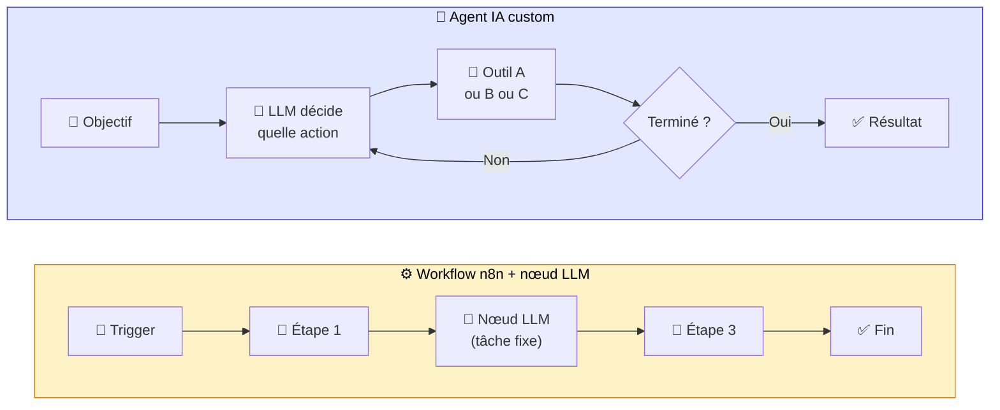
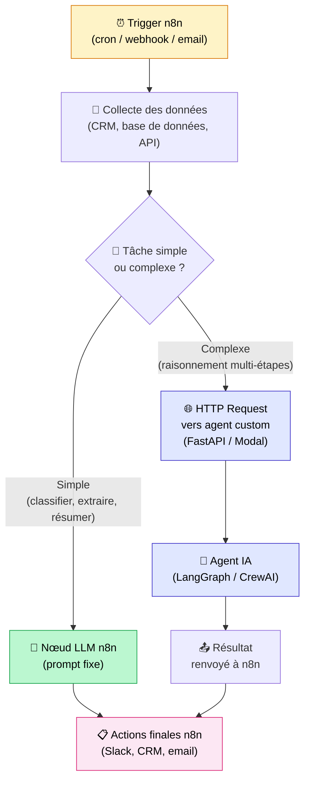
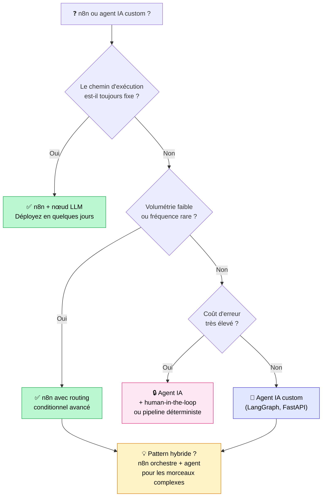

## 6 PME sur 10 qui demandent un agent IA n'en ont pas besoin

Sur 10 PME qui me contactent en disant "on veut un agent IA", 6 n'ont en réalité pas besoin d'un agent IA.

Elles ont besoin d'un bon workflow n8n avec un nœud OpenAI bien configuré. Et personne ne le leur dit. Parce que les agences custom préfèrent vendre des agents IA à 30K€ qu'un workflow n8n à 3K€. C'est humain. Mais ce n'est pas honnête.

Alors dans cet article, je vais vous donner la grille de décision que j'utilise avec mes propres clients. Pas de discours commercial. Juste les critères qui permettent de trancher entre **agent IA vs n8n** (ou Make, ou Zapier) selon votre cas réel.

Position claire dès le départ : **dans la majorité des cas PME, un n8n bien fait avec un nœud LLM suffit. L'agent IA custom n'est nécessaire que dans des cas précis.** Je vais vous montrer exactement lesquels.

<!-- more -->

> Pour le panorama des cas où l'agent IA l'emporte sur le no-code, voir le [guide Agents IA](/agents-ia/).

***

## La confusion à dissiper d'abord

Beaucoup de gens confondent "automatisation avec un peu d'IA dedans" et "agent IA". Ce n'est pas la même chose, et la confusion coûte cher.

Voici les deux définitions nettes :

**Workflow automatisé (n8n, Make, Zapier) avec nœud LLM** : une suite d'étapes prédéfinies dans un ordre déterministe. Parfois, l'une de ces étapes consiste à envoyer du texte à un LLM pour classifier, résumer ou générer. Mais le chemin est **fixe**. L'IA ne décide pas quoi faire : elle exécute une tâche dans un pipeline que vous avez défini.

**Agent IA custom** : un LLM qui décide lui-même quelles actions prendre, dans quel ordre, et quand s'arrêter, à partir d'un objectif qu'on lui donne. Le chemin est **dynamique**. L'agent peut appeler 2 outils ou 12, selon ce qu'il trouve en cours de route.

L'analogie que j'utilise : un workflow n8n, c'est une recette de cuisine fixe. Vous listez les étapes, vous les exécutez dans l'ordre, c'est reproductible. Un agent IA, c'est un chef cuisinier qui s'adapte aux ingrédients disponibles. Il regarde ce qu'il a dans le frigo, improvise, change de plan si quelque chose manque.

Si vous voulez creuser la définition complète de ce qu'est un agent IA, [j'ai écrit un article dédié là-dessus](c-est-quoi-un-agent-ia.md).

Voici comment je visualise la différence :

La boucle est là pour une raison : l'agent IA peut revenir en arrière, relancer une recherche, changer d'outil. Le workflow n8n, lui, avance toujours dans le même sens.

***

## Les 3 critères pour trancher

J'utilise trois critères dans cet ordre. Si le premier vous donne une réponse claire, inutile d'aller plus loin.

### Critère 1 : le chemin d'exécution est-il fixe ou variable ?

C'est la question la plus importante. Et souvent, elle suffit à trancher.

**Chemin fixe** : les mêmes étapes dans le même ordre, quelle que soit la valeur de l'input. Vous pouvez écrire le schéma du workflow sur un papier avant de commencer à coder.

Exemple concret : "Quand un email arrive dans support@, l'analyser avec GPT pour le classifier (bug / demande commerciale / autre), ouvrir un ticket Linear dans la bonne file, et envoyer un accusé de réception adapté." C'est 5 étapes. Elles sont toujours les mêmes. C'est un workflow n8n, point.

**Chemin variable** : le nombre d'étapes et les outils utilisés dépendent du contenu de l'input ou des résultats intermédiaires. Vous ne pouvez pas écrire le schéma à l'avance.

Exemple concret : "Trouve-moi tous les emails clients de cette semaine où on a promis une livraison, vérifie où en est chaque livraison dans Shopify, et envoie un message de suivi adapté à chaque situation." Ici, le nombre d'emails varie. Certaines livraisons seront en retard, d'autres non. Pour certains clients, il faudra vérifier dans un deuxième outil. Le chemin n'est pas prévisible.

**Si le chemin est fixe : workflow n8n. Si le chemin est variable : agent IA.**

### Critère 2 : quel est le coût d'une erreur ?

Un agent IA est plus capable qu'un workflow fixe. Mais il est aussi plus imprévisible. Ces deux choses vont ensemble.

**Coût faible** : l'erreur est visible, réversible ou sans conséquence immédiate. Un résumé d'appel un peu approximatif, une fiche produit à relire. Dans ce cas, le workflow n8n suffit, même s'il fait des erreurs de temps en temps.

**Coût élevé** : l'action est irréversible (email client envoyé, montant débité, contrat modifié). Dans ce cas, deux options. Soit on revient à un pipeline déterministe avec validation humaine. Soit on utilise un agent IA avec un pattern "human-in-the-loop" : l'agent propose, un humain valide avant l'exécution.

**Un agent IA autonome sur une action critique, sans garde-fou : c'est une mauvaise idée quel que soit l'outil.**

### Critère 3 : quelle est la volumétrie ?

Ce critère joue surtout sur le ROI de l'investissement initial.

**Quelques exécutions par jour** : le coût d'infrastructure d'un agent custom (développement, hébergement, maintenance) n'est pas justifié. Un workflow n8n tourne pour moins de 50€ par mois.

**Centaines ou milliers d'exécutions par jour** : là, un agent IA custom devient rentable. On peut optimiser la latence, réduire le coût par appel LLM, affiner les prompts de façon ciblée. Le delta de qualité justifie l'investissement.

### Tableau récapitulatif des 3 critères

| Critère | Workflow no-code (n8n, Make, Zapier) | Agent IA custom |
|---|---|---|
| Chemin d'exécution | Fixe, prévisible | Variable, dynamique |
| Coût d'erreur | Faible à modéré | Élevé (avec garde-fous) |
| Volumétrie | Faible à moyenne | Élevée |
| Time-to-market | Heures à jours | Semaines à mois |
| Coût initial | 0 à 5K€ | 15K€ à 50K€+ |
| Maintenance | Modérée (interface visuelle) | Forte (devops, monitoring) |

***

## Ce qu'on peut faire (souvent très bien) avec n8n + LLM

Avant de parler d'agents custom, voici 6 cas d'usage concrets que j'ai vus tourner en production avec n8n et un nœud LLM. Pour chacun, l'agent IA custom aurait été overkill.

**1. Classification d'emails entrants**

Besoin : les emails qui arrivent dans support@ doivent être routés vers la bonne équipe.

Workflow : Gmail reçoit l'email → nœud GPT-4o (classifier en 5 catégories) → branchement conditionnel → création de ticket Linear ou Notion dans la bonne file → réponse automatique au client.

Pourquoi pas un agent custom : le chemin est toujours le même. Le LLM fait une seule tâche : classifier. C'est une tâche déterministe avec un bon prompt.

**2. Génération de fiches produit**

Besoin : l'équipe e-commerce reçoit des données brutes fournisseur (CSV Airtable) et doit créer des fiches produit optimisées.

Workflow : Airtable (nouvelle ligne) → nœud GPT (rédacteur avec template) → création de page Notion + produit Shopify.

Pourquoi pas un agent custom : la structure de la fiche est fixe. Le LLM remplit un template. Pas de décision dynamique.

**3. Résumé d'appels Zoom**

Besoin : après chaque call client, avoir un compte-rendu structuré dans le CRM.

Workflow : Zoom (fin de réunion) → téléchargement audio → Whisper (transcription) → nœud GPT (résumé avec action items) → création d'une note HubSpot + message Slack dans le canal projet.

Pourquoi pas un agent custom : pipeline linéaire, toujours les mêmes 4 étapes. Le nœud Whisper et le nœud GPT font chacun une tâche précise.

**4. Réponses aux avis clients**

Besoin : répondre rapidement aux avis Trustpilot, Google ou Capterra.

Workflow : scraping ou webhook avis → nœud GPT (analyse du sentiment + brouillon de réponse adapté au ton) → envoi dans une interface de validation humaine → publication après validation.

Pourquoi pas un agent custom : la validation humaine est intégrée dans le workflow. L'IA génère, un humain valide. Simple et suffisant.

**5. Veille concurrentielle automatisée**

Besoin : suivre les publications de 10 concurrents et recevoir une synthèse hebdomadaire.

Workflow : cron hebdomadaire → scraping RSS / Apify → agrégation des nouvelles contenus → nœud GPT (synthèse comparative + points d'attention) → envoi d'une newsletter interne sur Slack ou email.

Pourquoi pas un agent custom : les sources sont fixes, la structure de sortie est fixe, la fréquence est fixe.

**6. Lead scoring et enrichissement CRM**

Besoin : scorer automatiquement les nouveaux leads entrants pour prioriser les relances.

Workflow : HubSpot (nouveau contact) → récupération des données d'enrichissement (Clearbit, LinkedIn) → nœud GPT (scoring qualitatif basé sur ICP + notes de contexte) → mise à jour du score dans HubSpot + alerte Slack si score > seuil.

Pourquoi pas un agent custom : le scoring suit toujours la même logique. La seule "intelligence" est dans le prompt.

**Une note sur les outils eux-mêmes** : n8n, Make et Zapier ne sont pas équivalents. n8n est open source et self-hostable (contrôle total, coût maîtrisé, courbe d'apprentissage plus forte). Make est très visuel, excellent pour des équipes non-techniques (pricing à l'opération, peut vite coûter cher à volume). Zapier est le plus accessible mais le moins flexible (et le plus cher à usage intensif). Pour tout ce qui touche à l'IA et aux workflows complexes en PME, **n8n est généralement le meilleur rapport puissance/coût**.

***

## Les cas où un agent IA custom devient nécessaire

Voici les 5 situations où le no-code ne suffit plus. Ce sont des cas réels que j'ai rencontrés.

**1. Le chemin d'exécution est imprévisible**

Un client dans la distribution voulait un assistant commercial capable de répondre à n'importe quelle question sur son catalogue, ses stocks et ses conditions tarifaires. Selon la question, l'agent devait parfois interroger la base produits, parfois la base stocks, parfois les deux, parfois ni l'une ni l'autre (question générale). Aucun workflow fixe ne pouvait couvrir tous les cas.

**2. Plusieurs sources à croiser dynamiquement**

C'est le cas que j'ai décrit dans mon article sur [le RAG agentique multi-sources dans le BTP](cas-usage-rag-redaction-appels-offres-btp.md). Pour rédiger une réponse à un appel d'offres, l'agent devait croiser 4 sources complètement différentes (normes DTU, historique projets, réponses gagnantes, annexes sectorielles) dans un ordre qui dépendait du contenu du cahier des charges. Impossible à encoder dans un workflow.

**3. Mémoire et raisonnement multi-tours**

Un agent conversationnel de support niveau 2, capable de maintenir un contexte sur plusieurs échanges avec le même client, de se souvenir de ce qui a été tenté dans les échanges précédents, et d'adapter sa stratégie en conséquence. Un workflow n8n peut gérer une session, mais pas un raisonnement d'état sur plusieurs jours.

**4. Logique métier complexe non encodable**

Un cabinet d'avocats m'a contacté pour un "workflow simple de synthèse de contrats". En creusant, j'ai compris que chaque dossier nécessitait une recherche de jurisprudence (variable selon le type de contrat), une analyse des clauses à risque (variable selon le contexte client), et une synthèse dont la structure dépendait du type d'affaire. Pas deux dossiers n'avaient le même chemin. C'était un agent IA, pas un workflow.

**5. Latence et coût critique à grande échelle**

À 100 000 appels par jour, l'inefficacité d'un workflow standard devient coûteuse. Un workflow n8n qui fait 3 appels LLM "pour être sûr" coûte 3 fois plus cher qu'un agent optimisé qui fait le même travail en 1 appel calibré. À cette volumétrie, investir dans un agent custom avec des prompts optimisés et un modèle plus léger (GPT-4o-mini, Mistral, Claude Haiku) peut diviser la facture LLM par 5 à 10.

***

## Le pattern hybride (le vrai futur en 2026)

C'est la section la plus importante de cet article. Et c'est le design que j'utilise sur 80% des projets en phase de maturité.

L'idée : **n8n orchestre, les agents raisonnent.**

Concrètement :
- n8n gère tous les triggers (cron, webhook, email entrant, événement CRM)
- n8n gère toutes les actions "sûres" vers les systèmes externes (écriture en base, envoi Slack, mise à jour HubSpot)
- Les nœuds LLM simples dans n8n gèrent les tâches déterministes (classifier, extraire, traduire, résumer selon template)
- Pour les morceaux qui nécessitent un vrai raisonnement multi-étapes, n8n appelle un agent custom hébergé séparément (FastAPI sur un VPS, Modal, AWS Lambda) via un simple nœud HTTP

L'avantage de ce pattern : vous gardez la simplicité d'orchestration de n8n (monitoring visuel, gestion des erreurs, reprises, alertes) et vous n'ajoutez de la complexité agentique que là où c'est vraiment nécessaire.

En pratique, sur un projet récent, ce design nous a permis de passer de 3 semaines de développement (agent custom complet) à 5 jours (workflow n8n + 1 micro-agent pour la partie complexe). Et le résultat final était identique du point de vue utilisateur.

***

## Coûts comparés sur 12 mois

Voici une estimation sur 12 mois pour un cas type : 1 000 exécutions par jour, chaque exécution impliquant une analyse LLM.

| Poste | Workflow n8n | Agent IA custom |
|---|---|---|
| Développement initial | 2 à 5 jours dev | 4 à 8 semaines dev |
| Coût LLM par mois | 50 à 300€ | 100 à 1 000€ |
| Hébergement par mois | n8n cloud 20€ ou self-hosted ~10€ | Cloud + monitoring 100 à 500€ |
| Maintenance par mois | 1 à 2 jours/mois | 3 à 5 jours/mois |
| Total estimé sur 12 mois | 5 à 15K€ | 30 à 80K€ |

Ces chiffres varient beaucoup selon la complexité. Mais l'ordre de grandeur est juste. Un agent custom revient typiquement à **3 à 5 fois plus cher** sur un an.

Et c'est tout à fait acceptable... si l'agent custom apporte 3 à 5 fois plus de valeur. La question n'est pas "lequel est moins cher". La question est : "est-ce que votre cas justifie ce surcoût ?"

Pour une PME avec 50 emails de support par jour à classifier : non, ça ne se justifie pas. Pour une plateforme qui gère 500 000 appels LLM par mois sur un processus complexe et variable : oui, absolument.

***

## L'arbre de décision (mon résumé en 1 schéma)

***

## Ce que je dis vraiment à mes clients

Voici trois cas concrets, tirés de projets réels (anonymisés).

**Cas 1 : la PME qui voulait un "agent commercial IA"**

Une PME dans les services B2B me contacte. Elle veut "un agent IA qui qualifie les leads entrants et décide si un commercial doit rappeler". Budget prévu : 25K€.

Après 45 minutes d'entretien, voilà ce que j'ai compris de leur besoin réel : quand un lead soumet le formulaire de contact, extraire les informations clés, les croiser avec leur ICP (idéal customer profile, défini en 5 critères), calculer un score, et si le score dépasse un seuil, créer une tâche dans HubSpot avec un résumé.

J'ai proposé un workflow n8n. Déployé en 1 semaine. Coût : 3 500€. Ça tourne depuis 8 mois, sans incident.

L'agent IA custom aurait fait exactement la même chose, 6 fois plus cher et 4 semaines plus tard. La différence ? Le chemin était fixe.

**Cas 2 : le cabinet d'avocats qui voulait "un truc simple"**

Un cabinet d'avocats me demande "un workflow pour synthétiser les contrats entrants et identifier les clauses à risque". Ils imaginent que c'est simple.

En creusant : chaque contrat a une nature différente (bail commercial, cession de parts, contrat de prestation, NDA...). Pour chaque type, les clauses à analyser sont différentes. La jurisprudence pertinente à aller chercher dépend du type de contrat et du contexte client. Et la synthèse finale doit s'adapter au profil de l'avocat destinataire (certains veulent un résumé court, d'autres une analyse détaillée).

Ici, le chemin est variable. Un workflow n8n avec 3 branches conditionnelles n'aurait pas suffi. On a développé un agent multi-outils avec LangGraph, accès à une base vectorielle de jurisprudence, et un profil de préférences par avocat. 6 semaines de développement. Mais le cas le justifiait.

**Cas 3 : le projet qui a commencé en n8n et qui a évolué**

C'est le pattern le plus courant en réalité. Une PME commence avec un workflow n8n simple (classification d'emails + création de tickets). Ça marche. Ils veulent ajouter de la valeur : l'agent devrait aussi aller chercher l'historique client dans le CRM avant de classifier, et adapter la priorité du ticket selon la valeur du compte.

On a ajouté 2 nœuds HTTP dans le workflow n8n (appel API CRM, enrichissement). Le chemin restait fixe. Pas besoin d'un agent custom.

Quelques mois plus tard, ils veulent que le système "comprenne le contexte de la conversation" et décide lui-même si un ticket mérite une escalade urgente selon des critères flous. Là, on a ajouté un micro-agent dans le pattern hybride. N8n reste l'orchestrateur, un petit agent LangGraph gère la décision d'escalade.

**La leçon** : commencez simple. Upgradez quand le simple ne suffit plus.

***

## FAQ

**C'est quoi la vraie différence entre n8n et un agent IA ?**

N8n est un outil d'orchestration de workflows. Il vous permet de connecter des applications entre elles selon un chemin que vous définissez à l'avance. Un agent IA est un LLM qui décide lui-même du chemin à suivre pour atteindre un objectif. Vous pouvez utiliser un nœud LLM dans n8n sans pour autant faire de l'agentique. La différence est dans qui décide : vous (workflow) ou le modèle (agent).

**N8n peut-il remplacer LangChain ?**

Pour les cas simples, oui. N8n 2.0 intègre nativement LangChain avec plus de 70 nœuds AI, incluant des agents avec mémoire et outils. Pour des architectures agentiques complexes (graphes d'état, multi-agents, logique conditionnelle avancée), LangGraph reste plus flexible et plus puissant. N8n est excellent pour démarrer et pour 80% des cas. LangGraph/LangChain prend le relais quand la complexité dépasse ce que l'interface visuelle permet de gérer proprement.

**Combien coûte un agent IA custom vs un workflow n8n ?**

Sur 12 mois pour un volume moyen (1 000 exécutions par jour) : un workflow n8n revient à 5 à 15K€ tout compris (développement initial, hébergement, LLM, maintenance). Un agent custom : 30 à 80K€ selon la complexité. L'agent est 3 à 5 fois plus cher. C'est justifié uniquement si la valeur produite est proportionnelle.

**Peut-on construire un agent IA avec n8n uniquement ?**

Oui, n8n propose un nœud Agent natif qui intègre de la mémoire, des outils et une boucle de raisonnement. Pour des agents simples à modérément complexes, c'est tout à fait viable. Les limites apparaissent quand vous avez besoin de logique d'état complexe, de plusieurs agents qui se coordonnent, ou de debug très fin sur le raisonnement. Dans ces cas, un framework dédié (LangGraph, CrewAI) vous donnera plus de contrôle.

**Make ou Zapier sont-ils adaptés aux workflows IA ?**

Make : très bon pour les workflows visuels avec quelques nœuds LLM. L'interface est excellente pour des équipes non-techniques. Le pricing à l'opération peut devenir problématique à volume. Zapier : accessible, idéal pour des automatisations légères, moins adapté aux workflows IA complexes (moins de flexibilité sur les nœuds LLM, coût élevé à usage intensif). Pour tout ce qui est IA et volume, n8n reste le meilleur choix en 2026.

**Quand passer de n8n à un agent custom ?**

Quand vous vous retrouvez à enchaîner 20+ nœuds dans n8n pour gérer des cas limites, que vous avez des branches conditionnelles partout, et que le workflow devient illisible même pour vous. Ou quand le LLM doit prendre des décisions dont vous ne pouvez pas anticiper la logique à l'avance. Ces deux signaux indiquent que vous avez besoin d'un agent, pas d'un workflow plus complexe.

**N8n self-hosted ou cloud pour des workflows IA ?**

Self-hosted si vous avez un minimum de compétences techniques (ou un dev disponible) et si vous traitez des données sensibles. Le coût est quasi nul (un VPS à 10-20€/mois suffit pour la plupart des PME). N8n cloud si vous voulez zéro gestion d'infrastructure : c'est 20€/mois pour l'essentiel des besoins. Pour les workflows IA en production, je préfère le self-hosted : plus de contrôle sur les secrets API, les logs et les mises à jour.

**Comment sécuriser les clés API LLM dans n8n ?**

Dans n8n, utilisez toujours le gestionnaire de credentials intégré, jamais de clés en clair dans les nœuds. Activez le chiffrement des credentials (activé par défaut en cloud, à configurer en self-hosted avec la variable `N8N_ENCRYPTION_KEY`). Créez des clés API OpenAI avec des limites de budget mensuelles. Si vous vous hébergez vous-même, pensez à mettre n8n derrière un reverse proxy avec authentification.

**Quel LLM utiliser dans un nœud n8n (OpenAI, Mistral, Claude) ?**

GPT-4o-mini pour les tâches de classification et d'extraction (excellent rapport qualité/coût). GPT-4o pour les tâches de génération et raisonnement. Claude 3.5 Haiku quand vous avez besoin d'une bonne fenêtre de contexte à coût maîtrisé. Mistral pour les cas où la souveraineté des données est importante (modèle self-hostable). N8n supporte tous ces modèles via ses nœuds LLM natifs ou via LangChain.

**Combien de temps pour développer un agent IA custom ?**

Un POC sur un cas d'usage ciblé : 2 à 4 semaines. La mise en production avec tests, intégration aux systèmes existants et gestion des erreurs : 2 à 3 mois. Un système multi-agents complet : 4 à 6 mois. Ces durées incluent le temps de définition des outils, de test des prompts, et de mise en place du monitoring. Ne sous-estimez pas le monitoring : c'est souvent 30% du temps de développement total sur un agent custom.

***

## Pour aller plus loin

- **[Mais c'est quoi un agent IA ?](c-est-quoi-un-agent-ia.md)** : la définition complète des systèmes agentiques, pour bien repartir des fondamentaux
- **[Agentic RAG vs RAG classique](agentic-rag-vs-rag-classique.md)** : quand l'agentique devient nécessaire dans un contexte de récupération documentaire
- **[Cas client BTP : RAG multi-sources pour les appels d'offres](cas-usage-rag-redaction-appels-offres-btp.md)** : un exemple concret d'agent IA qui justifiait l'investissement
- **[Cas client assurance : rapports de sinistre automatisés](integration-ia-rapports-sinistre-assurance.md)** : un autre cas où le chemin variable rendait le workflow insuffisant

***

Si mes articles vous intéressent et que vous avez des questions ou simplement envie de discuter de vos propres défis, n'hésitez pas à m'écrire à [anas@tensoria.fr](mailto:anas@tensoria.fr), j'aime échanger sur ces sujets !

Vous pouvez aussi [réserver un créneau d'échange](https://cal.eu/anas-rabhi/rendez-vous-ianas) ou vous abonner à ma newsletter :)

---

### À propos de moi

Je suis **Anas Rabhi**, consultant Data Scientist freelance. J'accompagne les entreprises dans leur stratégie et mise en œuvre de solutions d'IA (RAG, Agents, NLP).

Découvrez mes services sur [tensoria.fr](https://tensoria.fr) ou testez notre solution d'agents IA [heeya.fr](https://heeya.fr).

  <a href="https://cal.eu/anas-rabhi/rendez-vous-ianas" target="_blank" style="display: inline-block; background-color: #4F46E5; color: #ffffff; font-weight: bold; padding: 16px 32px; text-decoration: none; border-radius: 8px; font-size: 18px; letter-spacing: 0.8px; box-shadow: 0 6px 12px rgba(0, 0, 0, 0.2); transition: all 0.3s ease; border: none;">
    Réserver un créneau
  </a>
  <a href="https://anas-ai.kit.com/d8b1a255cc" target="_blank" style="display: inline-block; background-color: #222222; color: #ffffff; font-weight: bold; padding: 16px 32px; text-decoration: none; border-radius: 8px; font-size: 18px; letter-spacing: 0.8px; box-shadow: 0 6px 12px rgba(0, 0, 0, 0.2); transition: all 0.3s ease; border: none;">
    ✉️ S'abonner à ma newsletter
  </a>

