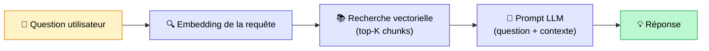
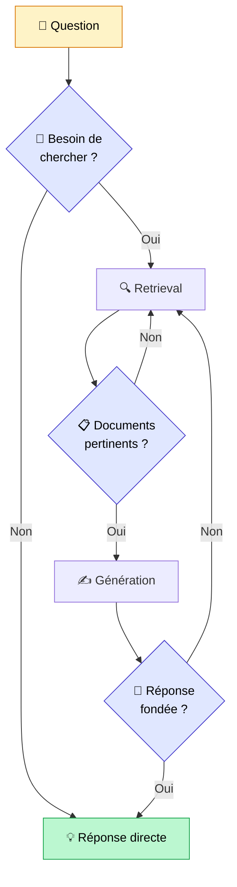
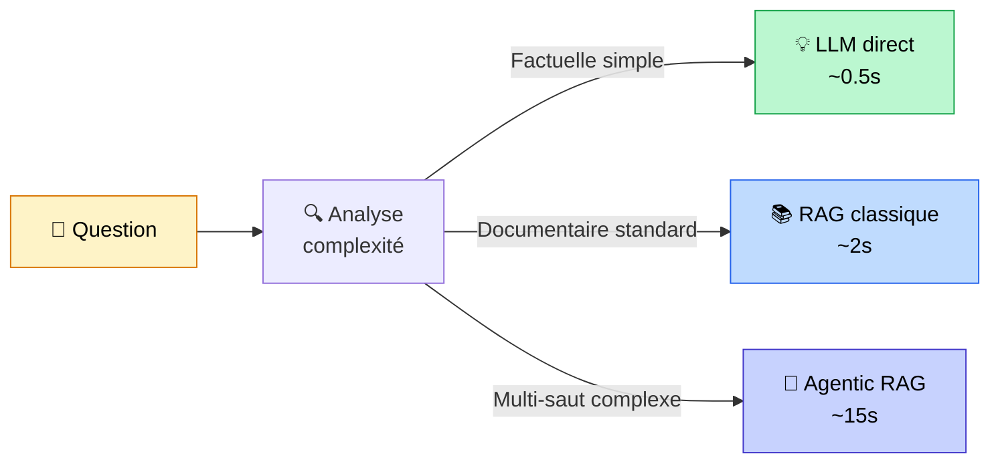

## Votre RAG ne suffit plus. Vraiment ?

On en parle partout. L'Agentic RAG. Le RAG agentique. Le futur du RAG.

Et comme d'habitude avec les tendances IA, on a l'impression que si vous n'êtes pas encore passé à l'Agentic RAG, vous êtes en retard. Que votre RAG "classique" est dépassé. Qu'il faut tout refaire.

Je vais vous dire ce que j'en pense vraiment : **ce n'est pas aussi simple, et la plupart des projets n'ont pas besoin d'Agentic RAG.**

Mais, car il y a toujours un mais, l'Agentic RAG répond à des problèmes réels que le RAG classique ne peut tout simplement pas résoudre. Et si vous tombez sur ces problèmes, vous en aurez besoin.

Alors dans cet article, je vais faire simple : ce qu'est vraiment l'Agentic RAG, en quoi il diffère du RAG classique, et surtout, comment décider si vous en avez besoin ou pas.

<!-- more -->

***

## Ce que fait un RAG classique (et ce qu'il ne peut pas faire)

Si vous n'êtes pas familier avec le RAG, je vous invite d'abord à lire [mon article sur ce qu'est le RAG](mais-que-es-le-rag.md). Pour ceux qui connaissent, voici un rappel rapide.

Un RAG classique, c'est un pipeline **linéaire** qui fait toujours la même chose dans le même ordre :

Ça marche bien. C'est prévisible, rapide (1 à 3 secondes), et simple à débugger. Dans la majorité des projets, c'est tout ce dont vous avez besoin.

Mais ce pipeline a des angles morts bien précis.

**Premier angle mort : il récupère toujours, même quand ce n'est pas utile.**
Si vous demandez "quelle est la capitale de la France ?", le RAG va quand même chercher dans votre base documentaire. Pour rien.

**Deuxième angle mort : il ne valide jamais ce qu'il a trouvé.**
Si les chunks récupérés sont mauvais (hors sujet, obsolètes, incorrects), le LLM va quand même générer une réponse à partir d'eux. Et souvent, cette réponse sera mauvaise ou inventée.

**Troisième angle mort : il ne peut pas décomposer une question complexe.**
"Compare les performances financières d'Apple et Microsoft sur les 3 dernières années et explique les différences." Pour ça, il faudrait faire plusieurs recherches, croiser des informations de sources différentes, raisonner sur les résultats intermédiaires. Un RAG classique fait une seule recherche et espère que ça suffira.

**Quatrième angle mort : il n'a accès qu'à votre base vectorielle.**
Pas aux APIs externes. Pas aux bases SQL. Pas au web. Pas aux emails. Seulement aux documents que vous lui avez indexés.

C'est exactement ces quatre problèmes que l'Agentic RAG tente de résoudre.

***

## L'Agentic RAG, c'est un spectre — pas un interrupteur

Et c'est là où beaucoup de gens se trompent.

On parle de "passer à l'Agentic RAG" comme s'il y avait un bouton à basculer. En réalité, **l'agentisme est un curseur**. Entre un RAG classique et un système multi-agents complet, il y a une infinité d'étapes intermédiaires.

HuggingFace le formule mieux que quiconque : *"L'agentisme, c'est combien de contrôle on laisse au LLM sur le flux d'exécution du programme."*

Voici comment je le visualise :

| Niveau | Ce que le LLM décide | Exemple |
|---|---|---|
| 0 — RAG classique | Rien | Pipeline fixe, toujours le même |
| 1 — Routing | Où chercher | Base interne OU recherche web OU SQL |
| 2 — Grading | Si les résultats sont bons | Relancer si les chunks sont hors sujet |
| 3 — Planification | Comment décomposer la question | Sub-questions en parallèle |
| 4 — Multi-agents | Qui fait quoi | Orchestrateur + agents spécialisés |

Vous n'avez pas à choisir entre niveau 0 et niveau 4. Vous pouvez rester au niveau 1 ou 2 et déjà résoudre 80% de vos problèmes avec très peu de complexité supplémentaire.

***

## Les 5 patterns agentiques (et à quel problème chacun répond)

### Pattern 1 — Self-RAG : l'IA qui relit son propre travail

**Le problème** : votre RAG génère des réponses qui ne s'appuient pas vraiment sur les documents récupérés. Hallucinations fréquentes.

**La solution** : après avoir généré sa réponse, le LLM se pose trois questions sur lui-même :
- Est-ce que j'avais vraiment besoin de chercher des documents ?
- Les documents récupérés sont-ils pertinents ?
- Ma réponse est-elle bien fondée sur ces documents ?

**Quand l'utiliser** : quand les hallucinations sont votre principal problème et que vous ne voulez pas alourdir l'architecture avec des outils externes.

***

### Pattern 2 — Corrective RAG (CRAG) : le filet de sécurité

**Le problème** : votre base documentaire est incomplète. Pour certaines questions, vous n'avez tout simplement pas la réponse dedans.

**La solution** : un modèle léger évalue la qualité des documents récupérés. Si le score est bas (documents non pertinents, information manquante), il déclenche automatiquement une recherche web en complément.

Trois niveaux de confiance :
- **Correct** : les documents sont pertinents, on les utilise
- **Ambigu** : on filtre pour ne garder que les passages utiles
- **Incorrect** : on abandonne et on cherche sur le web

**Quand l'utiliser** : quand votre base de connaissances est partielle ou se met à jour souvent, et que rater une réponse est plus grave que d'aller chercher ailleurs.

***

### Pattern 3 — Adaptive RAG : router selon la complexité

**Le problème** : vous avez des questions simples et des questions complexes dans le même système. Le RAG classique les traite de la même façon, ce qui est soit trop lent pour les simples, soit trop superficiel pour les complexes.

**La solution** : on analyse la complexité de la question en amont et on choisit la route :

- Question simple et factuelle → réponse directe du LLM (sans retrieval)
- Question de difficulté moyenne → RAG classique en un seul passage
- Question complexe multi-saut → pipeline agentique complet

**Quand l'utiliser** : quand vous avez un mix de requêtes très différentes et que vous voulez optimiser à la fois la vitesse et la qualité.

***

### Pattern 4 — RAG avec outils (ReAct) : accéder à plusieurs sources

**Le problème** : votre information est dispersée. Une partie dans votre base documentaire, une autre dans une base SQL, une autre dans un système externe.

**La solution** : le LLM ne cherche pas juste dans votre base vectorielle. Il décide lui-même quels outils appeler selon la question :

- Base vectorielle pour les questions documentaires
- SQL pour les données structurées
- API externe pour les informations en temps réel
- Recherche web pour l'actualité

Le schéma ReAct (Reason + Act) : penser → agir → observer le résultat → recommencer.

**Quand l'utiliser** : quand une seule source ne suffit pas pour répondre. C'est typiquement le cas dans nos projets BTP — on avait besoin des normes (base documentaire), de l'historique projets (base SQL), et des annexes professionnelles (PDF spécifiques). Aucune source seule n'aurait suffi.

***

### Pattern 5 — Multi-agents : diviser pour mieux régner

**Le problème** : la complexité devient trop grande pour un seul agent. Vous avez plusieurs domaines d'expertise différents, plusieurs types de sources, plusieurs traitements à orchestrer en parallèle.

**La solution** : un agent orchestrateur qui délègue à des agents spécialisés. Chaque agent est expert dans son domaine et dispose de ses propres outils.

C'est l'architecture qu'on a utilisée dans [notre projet RAG pour le BTP](cas-usage-rag-redaction-appels-offres-btp.md) : un agent rédacteur principal qui orchestrait 4 sources spécialisées (normes métier, annexes professionnelles, historique client, projets similaires). Chaque source avait son propre retriever avec son propre filtrage par métadonnées.

**Quand l'utiliser** : projets complexes avec plusieurs domaines bien distincts. C'est le niveau de complexité le plus élevé, à ne pas prendre à la légère.

***

## Le vrai coût de l'agentique

C'est là où beaucoup de projets se trompent. On voit la qualité des réponses s'améliorer, on est content, et on ne fait pas le calcul de ce que ça coûte vraiment.

**En latence :**

| Architecture | Latence typique | Raison |
|---|---|---|
| RAG classique | 1–3 secondes | 1 appel LLM |
| Advanced RAG (reranking) | 2–5 secondes | 2–3 appels LLM |
| Agentic RAG (niveau 2–3) | 5–30 secondes | 3–10 appels LLM |
| Multi-agents (niveau 4) | 30 secondes – 3 minutes | 10–50 appels LLM |

Pour un chatbot de support client, 30 secondes de latence c'est rédhibitoire. Pour un assistant de rédaction qui travaille en fond de tâche, c'est tout à fait acceptable.

**En coût :**

Chaque appel LLM coûte de l'argent. Un RAG classique = 1 appel. Un pipeline agentique complet = 10 appels minimum. Pour un volume de 10 000 requêtes par mois, on peut facilement multiplier la facture par 5 à 10 sans s'en rendre compte.

**En fiabilité :**

C'est le coût le moins visible mais le plus important. Un RAG classique a des modes d'échec prévisibles : si le retrieval rate, la réponse est mauvaise. C'est tout.

Un système agentique peut prendre des chemins imprévus, se retrouver dans des boucles, utiliser le mauvais outil, ou s'emballer sur une piste incorrecte. Plus l'agent est autonome, plus les modes d'échec sont variés et difficiles à anticiper.

C'est pour ça qu'Anthropic dit dans son guide sur les agents : *"Commencez par la solution la plus simple. N'ajoutez de la complexité que si le workflow ne peut pas être prédéfini à l'avance."*

***

## Comment décider : la grille simple

Voici les questions que je me pose sur chaque projet avant de choisir :

**1. Mes questions ont-elles toujours la même structure ?**
Oui → RAG classique, c'est suffisant.
Non → lisez la suite.

**2. Le LLM répond-il correctement quand il a le bon contexte ?**
Non → le problème est dans le retrieval ou les données. Résolvez ça d'abord : l'agentique n'y changera rien.
Oui → lisez la suite.

**3. Ma base documentaire est-elle incomplète sur certains sujets ?**
Oui → Corrective RAG avec fallback web.

**4. Les questions nécessitent-elles de croiser plusieurs sources distinctes ?**
Oui → RAG avec outils (niveau 3-4).

**5. Je ne peux pas prédire les étapes à l'avance ?**
Oui → Agentic RAG. Sinon, un pipeline conditionnel bien pensé fera souvent mieux avec moins de complexité.

**6. La fiabilité doit être proche de 100% ?**
Alors évitez l'agentique. Restez sur un pipeline déterministe avec des garde-fous humains.

En pratique, la plupart des projets s'arrêtent à la question 3 ou 4. Très peu ont réellement besoin du niveau 5 et 6.

***

## Ce que ça donne sur un vrai projet

Pour vous donner un exemple concret, [notre système RAG pour la rédaction d'appels d'offres dans le BTP](cas-usage-rag-redaction-appels-offres-btp.md) est un Agentic RAG de niveau 3–4.

Pourquoi agentique ? Parce qu'un RAG classique ne pouvait tout simplement pas faire le travail. Rédiger une réponse à un appel d'offres nécessite de combiner 4 sources complètement différentes : les normes DTU, l'historique projets du client, des réponses similaires déjà remportées, et les annexes professionnelles sectorielles. Aucune source seule ne suffisait.

Et ça valait le coût de complexité : **83% de gain de temps** sur la rédaction, avec des résultats cohérents et traçables.

Mais si le client nous avait demandé un simple chatbot pour répondre aux questions sur ses documents internes, un RAG classique bien configuré aurait très bien fait l'affaire. En moins de temps, pour moins cher, et avec plus de fiabilité.

L'Agentic RAG n'est pas meilleur que le RAG classique. Il est **approprié à des problèmes différents**.

***

## Récapitulatif

| | RAG classique | Agentic RAG |
|---|---|---|
| Pipeline | Linéaire, fixe | Dynamique, boucles |
| Latence | 1–3s | 5s à plusieurs minutes |
| Coût | 1 appel LLM | 3–50 appels LLM |
| Fiabilité | Prévisible | Variable |
| Cas d'usage | Q&A documentaire standard | Multi-sources, multi-étapes, validation |
| Quand l'utiliser | Par défaut | Quand le classique ne suffit plus |

***

## FAQ : Questions fréquentes sur l'Agentic RAG

**Quelle est la différence entre Agentic RAG et un agent IA ?**
Un [agent IA](c-est-quoi-un-agent-ia.md) est un système autonome qui utilise des outils. L'Agentic RAG, c'est un agent IA dont l'un des outils principaux est la recherche dans une base documentaire. L'Agentic RAG est un cas particulier d'agent IA, spécialisé dans la récupération et la synthèse d'information.

**Quels frameworks pour implémenter de l'Agentic RAG ?**
LangGraph est aujourd'hui le plus utilisé pour les pipelines agentiques structurés : il modélise les workflows comme des graphes avec états, boucles et conditions. LlamaIndex a ses propres abstractions (AgentWorkflow, SubQuestionQueryEngine). Pour les patterns simples (routing, grading), pas besoin de framework : quelques `if` bien placés suffisent.

**L'Agentic RAG coûte-t-il vraiment beaucoup plus cher ?**
Ça dépend du pattern. Un Self-RAG ou un CRAG ajoute 1 à 2 appels LLM supplémentaires (coût marginal). Un pipeline multi-agents complexe peut multiplier les coûts par 10 à 20. Calculez toujours le coût par requête avant de déployer en production.

**Mon RAG classique fait des hallucinations, l'Agentic RAG va-t-il résoudre ça ?**
Pas forcément. Les hallucinations viennent souvent de deux sources : un mauvais retrieval (le LLM n'a pas les bons documents) ou un mauvais prompt (le LLM n'est pas suffisamment contraint à s'appuyer sur le contexte). Commencez par analyser la cause racine avant d'ajouter de la complexité. J'en parle en détail dans [cet article sur pourquoi le RAG ne fonctionne pas](pourquoi-le-rag-ne-fonctionne-pas.md).

**Est-ce que je peux migrer progressivement vers l'Agentic RAG ?**
Oui, et c'est même la meilleure approche. Commencez par ajouter un seul mécanisme agentique — par exemple, un simple grading des documents récupérés (niveau 2 du spectre). Mesurez l'impact avant d'aller plus loin.

***

## Pour aller plus loin

- **[Mais c'est quoi un agent IA ?](c-est-quoi-un-agent-ia.md)** — Les fondements des systèmes agentiques, si vous voulez comprendre le mécanisme sous-jacent
- **[Mais c'est quoi le RAG vraiment ?](mais-que-es-le-rag.md)** — La base, si vous n'êtes pas encore familier avec le RAG
- **[Cas client BTP : RAG multi-sources pour les appels d'offres](cas-usage-rag-redaction-appels-offres-btp.md)** — Un exemple concret d'Agentic RAG en production avec les résultats chiffrés
- **[Cas client assurance : 80% de gain de temps sur les rapports de sinistre](integration-ia-rapports-sinistre-assurance.md)** — Un autre cas où l'agentique a fait la différence
- **[Les 5 erreurs que tout le monde fait avec le RAG](les-5-erreurs-rag.md)** — Avant d'aller vers l'agentique, assurez-vous de ne pas faire ces erreurs sur votre RAG classique

***

Si mes articles vous intéressent et que vous avez des questions ou simplement envie de discuter de vos propres défis, n'hésitez pas à m'écrire à [anas0rabhi@gmail.com](mailto:anas0rabhi@gmail.com), j'aime échanger sur ces sujets !

Vous pouvez aussi [réserver un créneau d'échange](https://cal.eu/anas-rabhi/rendez-vous-ianas) ou vous abonner à ma newsletter :)

---

### À propos de moi

Je suis **Anas Rabhi**, consultant Data Scientist freelance. J'accompagne les entreprises dans leur stratégie et mise en œuvre de solutions d'IA (RAG, Agents, NLP).

Découvrez mes services sur [tensoria.fr](https://tensoria.fr) ou testez notre solution d'agents IA [heeya.fr](https://heeya.fr).

  <a href="https://cal.eu/anas-rabhi/rendez-vous-ianas" target="_blank" style="display: inline-block; background-color: #4F46E5; color: #ffffff; font-weight: bold; padding: 16px 32px; text-decoration: none; border-radius: 8px; font-size: 18px; letter-spacing: 0.8px; box-shadow: 0 6px 12px rgba(0, 0, 0, 0.2); transition: all 0.3s ease; border: none;">
    Réserver un créneau
  </a>
  <a href="https://anas-ai.kit.com/d8b1a255cc" target="_blank" style="display: inline-block; background-color: #222222; color: #ffffff; font-weight: bold; padding: 16px 32px; text-decoration: none; border-radius: 8px; font-size: 18px; letter-spacing: 0.8px; box-shadow: 0 6px 12px rgba(0, 0, 0, 0.2); transition: all 0.3s ease; border: none;">
    ✉️ S'abonner à ma newsletter
  </a>

