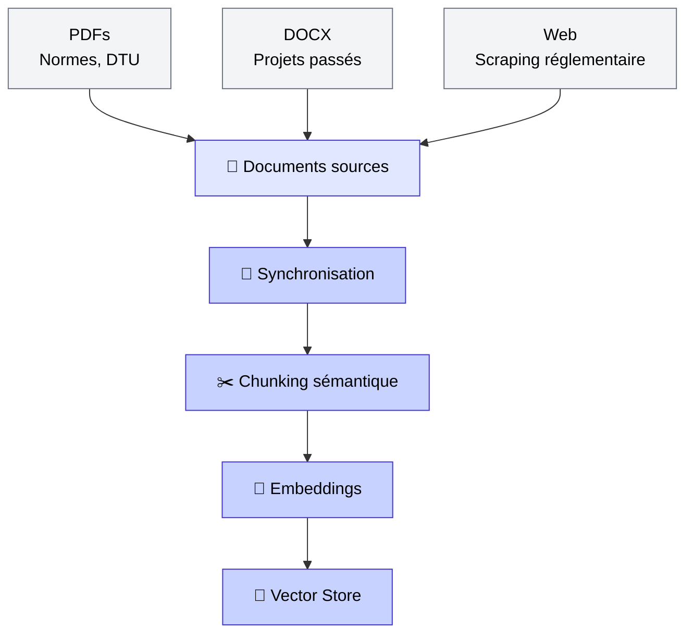
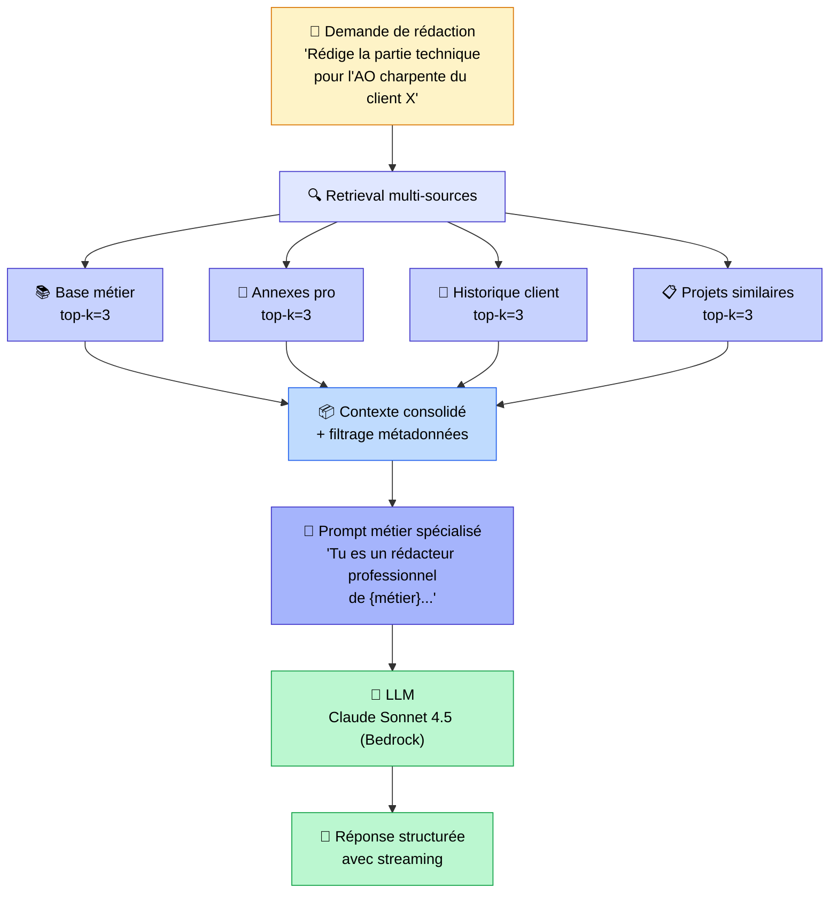
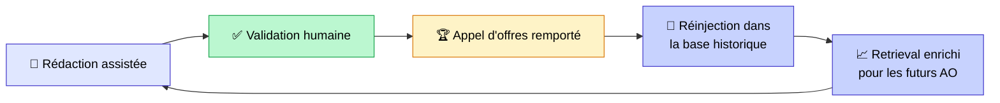

## Le RAG appliqué à la rédaction : bien plus qu'un chatbot Question-Réponse

Quand on parle de [RAG (Retrieval-Augmented Generation)](mais-que-es-le-rag.md), la plupart des gens pensent à un chatbot qui répond à des questions sur des documents internes. C'est le cas d'usage classique, celui qu'on voit dans tous les tutos.

Mais le RAG peut faire bien plus que ça. **Quand il est bien intégré dans un workflow métier, le RAG devient un moteur de rédaction contextuelle.** Il ne se contente pas de retrouver l'information : il la comprend, la structure, et produit un texte professionnel prêt à être validé par un humain.

Je vais illustrer ça avec un cas concret qu'on a réalisé récemment : l'automatisation de la rédaction d'appels d'offres pour un acteur du BTP.

<!-- more -->

## Rédaction d'appels d'offres dans le BTP : un processus chronophage

Mon client opère dans le secteur du BTP et répond régulièrement à des appels d'offres pour **plus de 30 corps de métiers** (électricité, plomberie, charpente, aménagement paysager, etc.) et **plus de 40 clients différents**. Chaque réponse à un appel d'offres demande un travail considérable :

- **Retrouver les normes** applicables au corps de métier concerné (DTU, réglementations, fiches techniques)
- **S'inspirer de projets passés** similaires déjà remportés
- **Adapter le ton et le contenu** au client et au métier
- **Rédiger des sections techniques** conformes aux exigences du cahier des charges
- **Vérifier la cohérence** entre les différentes parties du dossier

En pratique, un chargé d'affaires passait **plusieurs jours par réponse** :

- ~2h à chercher les normes professionnelles et les DTU applicables
- ~3h à retrouver et relire des projets passés similaires
- ~4h à rédiger les sections techniques
- ~2h de mise en forme et de relecture
- ~1h de vérifications croisées

Le plus frustrant ? **80% de ce travail est répétitif.** D'un appel d'offres à l'autre, les normes sont les mêmes, les formulations techniques se ressemblent, les structures de réponse sont similaires. Mais à chaque fois, le chargé d'affaires repart quasi de zéro.

C'est le genre de problème où l'IA peut faire une vraie différence. Pas en remplaçant l'expert, mais en lui donnant une **base de travail solide** en quelques minutes au lieu de quelques jours. Si vous avez lu mon article sur [l'automatisation des rapports de sinistre en assurance](integration-ia-rapports-sinistre-assurance.md), vous reconnaîtrez la même logique : l'IA fait le travail cognitif lourd, l'humain vérifie et valide.

## RAG multi-sources : un agent IA rédacteur pour les appels d'offres

### Pourquoi un RAG classique ne suffit pas pour rédiger un appel d'offres

Un [RAG basique](rag-trop-simple.md) — un seul index, un seul type de documents — ne fonctionne pas pour ce cas d'usage. Pourquoi ?

Parce que rédiger une réponse à un appel d'offres, ce n'est pas répondre à une question. C'est **combiner 4 types d'informations différentes** pour produire un texte cohérent et professionnel :

1. Les **normes et réglementations** du métier concerné
2. L'**historique des projets** réalisés pour ce client
3. Des **réponses similaires** déjà validées et remportées
4. Les **annexes professionnelles** (guides, DTU, références sectorielles)

Un RAG mono-source ne peut pas faire ça. Il faut un **retrieval multi-sources**, où chaque source apporte un angle différent au contexte de rédaction. C'est un point que j'aborde dans [les erreurs classiques du RAG](les-5-erreurs-rag.md) : traiter tous les documents de la même façon, c'est passer à côté de la richesse du contexte.

### Retrieval augmenté : les 4 sources de contexte du RAG

Le système qu'on a construit interroge **4 index spécialisés en parallèle**, chacun avec son rôle précis :

| Source de contexte | Rôle | Exemple concret |
|---|---|---|
| **Base de connaissances métier** | Normes, réglementations, fiches techniques par corps de métier | DTU 31.2 pour la charpente bois |
| **Annexes professionnelles** | Guides sectoriels, références normatives | Guide RAGE pour l'isolation |
| **Historique projets client** | Projets passés réalisés pour le même client | Chantier X livré en 2024 |
| **Projets similaires** | Réponses à des appels d'offres comparables déjà remportées | AO charpente remporté pour le client Y |

Chaque index est interrogé avec un **filtrage par métadonnées** : métier, client, type de document. Le retrieval n'est pas brut. Il est ciblé, ce qui garantit la pertinence du contexte injecté dans le [LLM](comprendre-l-IA-generative.md). C'est une des clés pour [éviter les causes classiques d'échec d'un RAG](les-4-causes-techniques-echec-rag.md).

## Architecture technique du RAG : ingestion, retrieval et génération

### Pipeline d'ingestion : indexation automatique des documents BTP

Avant de pouvoir récupérer les bonnes informations, il faut les indexer. Le pipeline d'ingestion gère ça automatiquement :

Les points techniques importants :

- **Synchronisation automatique** : détection de changements par hash (ajout, modification, suppression). Quand une norme est mise à jour, l'index se met à jour automatiquement.
- **Chunking sémantique** : 1 600 tokens avec overlap de 100, pour préserver la cohérence des passages. Pas de découpage arbitraire qui coupe une phrase au milieu — c'est un point que je détaille dans mon article sur [comment améliorer un RAG](comment-ameliorer-l-IA.md).
- **Embeddings** : vectorisation via OpenAI, stockage dans ChromaDB (local) ou Pinecone (cloud) selon les besoins de scalabilité.

### Pipeline d'inférence RAG : du retrieval augmenté à la rédaction automatisée

C'est là que la magie opère. Le pipeline de rédaction combine le retrieval multi-sources et la génération :

Quelques choix techniques clés :

- **API serverless** : FastAPI déployé sur AWS Lambda, avec streaming token par token. Le chargé d'affaires voit la réponse se construire en temps réel.
- **Support multi-LLM** : Claude Sonnet 4.5 (via AWS Bedrock) comme modèle principal, avec possibilité de basculer selon le type de rédaction.
- **Mémoire conversationnelle** : le système garde le contexte des échanges précédents. Le chargé d'affaires peut affiner sa demande : *"plus technique"*, *"ajoute les références normatives"*, *"adapte pour le client Z"*.
- **Traçabilité des sources** : chaque passage généré est accompagné des documents sources utilisés. Le chargé d'affaires sait exactement d'où vient chaque information.

### Interface de l'agent IA : un assistant de rédaction interactif

L'interface n'est pas un simple chatbot. C'est un **assistant de rédaction interactif** construit avec Streamlit :

- **Chat contextuel** : rédaction interactive de l'appel d'offres, section par section, avec streaming en temps réel
- **Visualisation des sources** : les documents utilisés par le RAG sont affichés en parallèle, pour que le chargé d'affaires puisse vérifier la traçabilité
- **Sélection du contexte** : choix du métier et du client en amont, ce qui oriente le retrieval dès le départ
- **Historique des échanges** : mémoire conversationnelle pour affiner les résultats au fil de l'échange

## Agent IA et retrieval intelligent : ce qui fait la différence

Le coeur de la valeur, c'est le **retrieval multi-sources avec filtrage par métadonnées**. C'est ce qui transforme un RAG générique en un véritable [agent IA](c-est-quoi-un-agent-ia.md) rédacteur spécialisé.

Concrètement, quand le chargé d'affaires demande de rédiger une section technique pour un appel d'offres en charpente bois :

1. **Le retrieval comprend le métier** : il interroge la base de connaissances filtrée sur "charpente" et récupère les normes DTU pertinentes
2. **Il s'adapte au client** : il retrouve les projets passés réalisés pour ce même client, pour maintenir la cohérence de ton et de références
3. **Il s'inspire des succès** : il récupère des réponses à des appels d'offres similaires qui ont été remportés
4. **Il intègre les normes** : les annexes professionnelles applicables sont automatiquement injectées dans le contexte

C'est la combinaison du **retrieval intelligent + prompt engineering métier + mémoire conversationnelle** qui transforme le RAG en assistant de rédaction professionnelle. Pas juste un outil qui retrouve des bouts de texte, mais un système qui comprend le contexte et produit un contenu structuré.

### Boucle de feedback : un RAG qui s'améliore avec l'usage

Un aspect souvent négligé dans les projets RAG : **la boucle de feedback**. Ici, les réponses à des appels d'offres validées par les chargés d'affaires et remportées sont **réinjectées dans la base de projets historiques**. Le système apprend de ses succès :

Plus le système est utilisé, plus il dispose d'exemples de réponses gagnantes, et plus le retrieval devient pertinent. C'est un **cercle vertueux** que peu de projets RAG mettent en place, mais qui fait une vraie différence sur le long terme.

## Résultats : 83% de gain de temps sur la rédaction d'appels d'offres

| Tâche | Avant | Après | Gain |
|-------|-------|-------|------|
| Recherche de normes et DTU | 2h | 30 sec (retrieval auto) | **~96%** |
| Relecture de projets passés | 3h | 1 min (retrieval ciblé) | **~99%** |
| Rédaction des sections techniques | 4h | 20 min de relecture | **~92%** |
| Mise en forme et relecture | 2h | 30 min de validation | **~75%** |
| Vérifications croisées | 1h | 10 min (sources traçables) | **~83%** |
| **Temps total par réponse** | **~12h (2 jours)** | **~2h** | **~83%** |

Le gain le plus spectaculaire, c'est sur la **recherche d'information** : passer de 5 heures à chercher dans des archives à quelques minutes de retrieval automatique. C'est là que le RAG multi-sources fait la différence la plus visible.

Mais le gain le plus important pour la qualité, c'est la **cohérence**. Le système propose toujours des formulations alignées avec les normes en vigueur et les précédents projets du client. Moins de risque d'oublier une référence normative ou de contredire une réponse passée.

**Vous avez des processus de rédaction répétitifs qui mobilisent vos experts pendant des heures ?** L'approche RAG multi-sources + agent rédacteur est applicable à de nombreux cas : réponses à appels d'offres, rapports techniques, mémoires de synthèse, dossiers réglementaires... [Réservez un créneau](https://cal.eu/anas-rabhi/rendez-vous-ianas) pour en discuter, ou écrivez-moi à [anas0rabhi@gmail.com](mailto:anas0rabhi@gmail.com).

## Ce que ce cas d'usage RAG en entreprise m'a appris

Ce projet m'a confirmé plusieurs convictions sur le RAG en entreprise :

**1. Le RAG n'est pas qu'un outil de Q&A.** La plupart des gens associent le RAG à un chatbot qui répond à des questions. Mais quand on le couple à un prompt engineering métier bien pensé et à un retrieval multi-sources, il devient un **moteur de rédaction contextuelle**. C'est un changement de paradigme : le RAG ne cherche plus seulement à retrouver l'information, il la transforme en contenu actionnable.

**2. Le retrieval multi-sources change tout.** Un seul index, c'est bien pour un POC. Mais en production, les besoins sont toujours plus riches. Ici, 4 index spécialisés apportent chacun un angle différent : normes, historique, exemples, annexes. C'est cette combinaison qui fait la qualité du résultat final.

**3. Le filtrage par métadonnées est indispensable.** Le retrieval ne doit pas être brut. Filtrer par métier et par client avant même de chercher les chunks pertinents, ça élimine le bruit et ça améliore drastiquement la pertinence. C'est souvent sous-estimé dans les implémentations RAG.

**4. La boucle de feedback crée un avantage cumulatif.** Chaque réponse validée enrichit la base. Le système s'améliore avec l'usage. C'est la différence entre un outil statique et un outil qui devient plus performant au fil du temps.

**5. L'humain reste dans la boucle.** Le chargé d'affaires ne disparaît pas. Il passe du rôle de rédacteur à celui de **relecteur-validateur**. Son expertise métier est irremplaçable : c'est lui qui sait que tel client préfère un ton plus formel, que telle norme a été mise à jour récemment, ou que tel projet passé a eu un problème qu'il vaut mieux ne pas citer en référence.

### Les pièges à éviter sur ce type de projet

Avec le recul, voici les trois erreurs que j'ai vues le plus souvent sur des projets similaires :

**1. Vouloir tout indexer dès le départ.** Le réflexe naturel, c'est de mettre tous les documents dans la base vectorielle avant même d'avoir testé. Mauvaise idée : un index trop volumineux sans métadonnées bien structurées rend le retrieval bruyant. Commencez par un sous-ensemble maîtrisé, validez la pertinence, puis élargissez progressivement.

**2. Négliger la qualité des documents sources.** Un PDF scanné illisible, un document Word avec des tableaux complexes, des normes issues d'un copier-coller mal formaté… Les problèmes de qualité de données sont responsables d'une grande partie des erreurs de retrieval. Le [nettoyage et la mise en forme des sources](comment-ameliorer-l-IA.md) est une étape souvent sous-estimée dans les plannings projet.

**3. Livrer sans boucle de feedback.** Sans mécanisme pour réinjecter les bonnes réponses dans la base, le système reste statique. La boucle de feedback n'est pas une option — c'est ce qui transforme un outil correct en un système qui s'améliore réellement avec l'usage, comme décrit dans la section précédente.

Et c'est ça, la vraie puissance du RAG quand il est bien intégré. Pas un gadget technologique, mais un outil qui s'inscrit dans le quotidien des équipes et qui les rend **plus rapides, plus cohérentes et plus efficaces**. Le même constat que j'avais fait sur [l'intégration de l'IA dans les rapports de sinistre](integration-ia-rapports-sinistre-assurance.md) : la technique est importante, mais c'est l'intégration qui fait la différence.

Si vous voulez aller plus loin sur le RAG, j'ai écrit sur [ce qu'est vraiment le RAG](mais-que-es-le-rag.md), sur [les erreurs classiques à éviter](les-5-erreurs-rag.md), sur [comment diagnostiquer un RAG qui ne fonctionne pas](pourquoi-le-rag-ne-fonctionne-pas.md), et sur [si le RAG est vraiment fini ou toujours pertinent](le-rag-est-fini.md).

***

Si mes articles vous intéressent et que vous avez des questions ou simplement envie de discuter de vos propres défis, n'hésitez pas à m'écrire à [anas0rabhi@gmail.com](mailto:anas0rabhi@gmail.com), j'aime échanger sur ces sujets !

Vous pouvez aussi [réserver un créneau d'échange](https://cal.eu/anas-rabhi/rendez-vous-ianas) ou vous abonner à ma newsletter :)

---

### À propos de moi

Je suis **Anas Rabhi**, consultant Data Scientist freelance. J'accompagne les entreprises dans leur stratégie et mise en œuvre de solutions d'IA (RAG, Agents, NLP).

Découvrez mes services sur [tensoria.fr](https://tensoria.fr) ou testez notre solution d'agents IA [heeya.fr](https://heeya.fr).

  <a href="https://cal.eu/anas-rabhi/rendez-vous-ianas" target="_blank" style="display: inline-block; background-color: #4F46E5; color: #ffffff; font-weight: bold; padding: 16px 32px; text-decoration: none; border-radius: 8px; font-size: 18px; letter-spacing: 0.8px; box-shadow: 0 6px 12px rgba(0, 0, 0, 0.2); transition: all 0.3s ease; border: none;">
    Réserver un créneau
  </a>
  <a href="https://anas-ai.kit.com/d8b1a255cc" target="_blank" style="display: inline-block; background-color: #222222; color: #ffffff; font-weight: bold; padding: 16px 32px; text-decoration: none; border-radius: 8px; font-size: 18px; letter-spacing: 0.8px; box-shadow: 0 6px 12px rgba(0, 0, 0, 0.2); transition: all 0.3s ease; border: none;">
    ✉️ S'abonner à ma newsletter
  </a>

