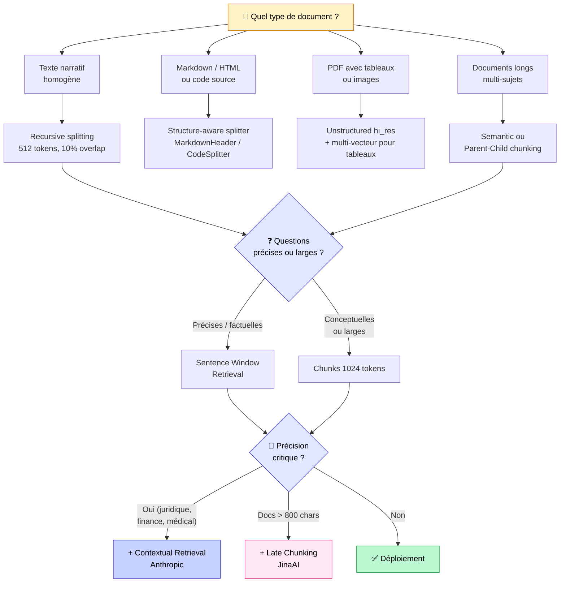

## Le chunking que vous utilisez probablement est le pire testé

Je vais commencer par un résultat qui m'a surpris quand je l'ai vu.

Chroma Research a publié un benchmark comparant toutes les stratégies de chunking courantes. Ils ont testé les paramètres par défaut d'OpenAI Assistants : 800 tokens, 400 tokens d'overlap. Leur verdict est sans appel, c'est la configuration avec la **précision la plus basse** de tous les tests. 1.4% de précision. Leur commentaire exact : *"particularly poor recall-efficiency tradeoffs"*.

Ce sont les paramètres que des dizaines de milliers de projets utilisent en ce moment, souvent parce que c'est ce que suggère le quick start de LangChain ou LlamaIndex.

Et pendant ce temps, des configurations 4x plus simples (200 tokens, zéro overlap) font 3.7x mieux en précision.

Le chunking, c'est la décision sur laquelle la plupart des équipes passent le moins de temps. Et pourtant, c'est probablement celle qui a le plus d'impact sur la qualité de votre RAG.

<!-- more -->

***

## Pourquoi le chunking est la décision la plus importante de votre RAG

Un mauvais retrieval, ça se corrige. Un prompt raté, ça se réécrit. Un modèle d'embedding sous-optimal, ça se remplace.

Un mauvais chunking, c'est impossible à corriger en aval. Si vous avez découpé vos documents de la mauvaise façon, les embeddings sont déjà calculés sur de mauvaises unités. Le meilleur reranker du monde ne peut pas reconstruire l'information que vous avez perdue en coupant au mauvais endroit.

**Trois raisons fondamentales qui expliquent tout :**

**1. La limite du modèle d'embedding**
La plupart des modèles d'embeddings populaires ont une fenêtre de 512 tokens. Au-delà, le modèle tronque silencieusement. Si votre chunk fait 1500 tokens et votre modèle tronque à 512, les deux tiers de votre chunk ne sont tout simplement pas indexés.

**2. Le "Lost in the Middle"**
Les LLMs ont du mal avec l'information au milieu d'un long contexte. Deux études indépendantes (Stanford, 2023) ont montré que les LLMs rappellent bien le début et la fin d'un contexte, mais ratent régulièrement ce qui est au milieu. Des chunks plus courts = moins de risque d'être "perdu au milieu".

**3. Le bruit dilue le signal**
Plus un chunk est grand, plus l'embedding encode de sujets différents, plus il devient difficile à distinguer des autres chunks. Un embedding de 1500 tokens sur un rapport annuel encode "comptabilité, gouvernance, stratégie, risques", sans être vraiment similaire à rien en particulier. Un chunk de 300 tokens sur la section "risques" est précis et discriminant.

La règle d'or de Pinecone résume ça mieux que n'importe quel benchmark : *"Si un humain comprend le chunk sans contexte extérieur, le LLM aussi."*

***

## Les 8 stratégies de chunking

Du plus simple au plus avancé. Elles ne sont pas exclusives : les meilleures architectures combinent plusieurs d'entre elles.

### 1. Fixed-size — le point de départ universel

Vous découpez chaque document en blocs de N tokens avec un overlap de X tokens entre les blocs. C'est la stratégie par défaut de presque tous les frameworks.

**Ce qu'on sait sur les tailles :**

| Taille | Quand l'utiliser |
|---|---|
| 128–256 tokens | Questions très précises et factuelles |
| 512 tokens | Polyvalent, bon équilibre par défaut |
| 1024 tokens | Contexte nécessaire, documents narratifs |
| 2048 tokens | Rarement utile, attention à la limite d'embedding |

Sur le benchmark LlamaIndex (Uber 10K, document financier), 1024 tokens atteint le score le plus élevé à la fois en fidélité et en pertinence. C'est leur sweet spot sur ce type de document.

**Pour qui** : votre point de départ systématique. Avant de tester des approches plus sophistiquées, établissez votre baseline ici.

---

### 2. Recursive Splitting — le vrai standard

C'est une version plus intelligente du fixed-size. Au lieu de couper tous les N tokens sans réfléchir, le splitter essaie d'abord de couper sur les séparateurs naturels : double saut de ligne d'abord, puis saut de ligne simple, puis espace, puis caractère à caractère en dernier recours.

Résultat : les chunks respectent autant que possible les paragraphes et les phrases.

```python
from langchain.text_splitter import RecursiveCharacterTextSplitter

splitter = RecursiveCharacterTextSplitter(
    chunk_size=512,
    chunk_overlap=51,          # 10% de 512 tokens
    length_function=len,       # ⚠️ par défaut : compte les caractères
)
```

**La règle souvent ignorée** : `length_function=len` compte les caractères, pas les tokens. Un token ≠ un caractère. Pour mesurer en tokens :

```python
import tiktoken

encoder = tiktoken.encoding_for_model("text-embedding-3-small")

splitter = RecursiveCharacterTextSplitter(
    chunk_size=512,
    chunk_overlap=51,
    length_function=lambda text: len(encoder.encode(text)),
)
```

Ce détail change beaucoup sur des textes avec des caractères unicode, des emojis, ou du texte dans plusieurs langues.

**Pour qui** : texte narratif homogène. C'est ma stratégie par défaut sur la plupart des projets.

---

### 3. Structure-aware — respecter la structure du document

Quand vos documents ont une structure (Markdown, HTML, code), autant l'utiliser.

**Markdown :**

```python
from langchain.text_splitter import MarkdownHeaderTextSplitter

headers_to_split_on = [
    ("#", "H1"),
    ("##", "H2"),
    ("###", "H3"),
]

splitter = MarkdownHeaderTextSplitter(
    headers_to_split_on=headers_to_split_on,
    strip_headers=False
)

chunks = splitter.split_text(markdown_content)
# Chaque chunk a des métadonnées : {"H1": "...", "H2": "...", "H3": "..."}
```

L'avantage : les métadonnées de hiérarchie sont conservées dans chaque chunk. Ça améliore le filtrage et permet au LLM de comprendre où se situe l'information dans le document.

**Code :** n'utilisez jamais un splitter générique sur du code. LlamaIndex CodeSplitter avec tree-sitter découpe au niveau syntaxique : il ne coupera jamais une fonction au milieu.

**Pour qui** : documentation technique, sites web, codebase.

---

### 4. Semantic Chunking — couper sur les changements de sujet

Au lieu de couper à une taille fixe, le semantic chunking compare les embeddings de phrases consécutives. Quand la distance cosinus entre deux phrases dépasse un seuil, on coupe. L'idée : quand le sujet change, on ouvre un nouveau chunk.

```python
from llama_index.node_parser import SemanticSplitterNodeParser
from llama_index.embeddings import OpenAIEmbedding

splitter = SemanticSplitterNodeParser(
    embed_model=OpenAIEmbedding(),
    breakpoint_percentile_threshold=95,  # 80-95 selon la granularité voulue
)

nodes = splitter.get_nodes_from_documents(documents)
```

`breakpoint_percentile_threshold` est le paramètre clé. À 95, vous ne coupez que sur les transitions de sujet très marquées (chunks plus longs). À 80, vous êtes plus agressif (chunks plus courts, plus nombreux).

**Ce que les benchmarks disent vraiment**

Chroma Research mesure la meilleure précision et IoU avec le chunking sémantique sur certains documents. Mais une étude NAACL 2025 nuance fortement : sur des documents naturels, le semantic chunking bat rarement le fixed-size, l'avantage n'apparaît vraiment que sur des documents artificiellement construits avec des changements de sujet marqués.

**Coût** : 2 à 3x plus lent à l'ingestion (on calcule des embeddings sur chaque phrase pour détecter les coupures).

**Pour qui** : documents longs avec plusieurs sujets distincts. Testez avant d'adopter : sur beaucoup de corpus, le recursive splitting est équivalent à moindre coût.

---

### 5. Sentence Window Retrieval — précision sans perdre le contexte

Ce pattern résout un vrai problème : les petits chunks sont précis pour le retrieval, mais donnent trop peu de contexte au LLM pour générer une bonne réponse.

**La solution** : dissocier ce qu'on indexe de ce qu'on retourne.

- On indexe chaque **phrase individuellement** (retrieval très précis)
- Quand une phrase est récupérée, on retourne les **±3 phrases autour** au LLM (contexte suffisant)

```python
from llama_index.node_parser import SentenceWindowNodeParser
from llama_index.postprocessor import MetadataReplacementPostProcessor

# Ingestion : indexer par phrase, garder la fenêtre en métadonnée
node_parser = SentenceWindowNodeParser.from_defaults(
    window_size=3,
    window_metadata_key="window",
    original_text_metadata_key="original_text",
)

# Retrieval : remplacer la phrase par sa fenêtre avant de passer au LLM
postprocessor = MetadataReplacementPostProcessor(
    target_metadata_key="window"
)
```

**Pour qui** : Q&R précises sur des corpus denses, quand la question porte sur un fait précis mais que la réponse nécessite le contexte immédiat autour.

---

### 6. Parent-Child / Hierarchical — le grand contexte quand nécessaire

Une variante de Sentence Window, mais à plusieurs niveaux. On crée une hiérarchie : chunks parents larges (1024 tokens), enfants intermédiaires (512), petits-enfants précis (128).

Le retrieval se fait sur les petits-enfants (précis). Mais si suffisamment d'enfants d'un même parent sont récupérés (en général 50%+), l'AutoMergingRetriever remonte automatiquement au parent, pour donner au LLM une vue large plutôt que des fragments épars.

```python
from llama_index.node_parser import HierarchicalNodeParser
from llama_index.retrievers import AutoMergingRetriever

node_parser = HierarchicalNodeParser.from_defaults(
    chunk_sizes=[2048, 512, 128]
)

# Le retriever fusionne automatiquement vers le parent si besoin
retriever = AutoMergingRetriever(
    vector_retriever,
    storage_context,
    verbose=True
)
```

**Pour qui** : documents longs et structurés (rapports annuels, documentation technique dense, articles scientifiques).

---

### 7. Late Chunking (JinaAI, 2024) — la meilleure amélioration "gratuite"

C'est l'idée la plus contre-intuitive de cette liste.

Dans un pipeline classique, on découpe d'abord, puis on embède chaque chunk indépendamment. Le problème : chaque chunk est encodé sans connaître le reste du document.

**Late chunking inverse l'ordre** : on passe d'abord *tout le document* dans le modèle d'embedding, on récupère les représentations contextualisées de chaque token, *puis* on découpe. Résultat : chaque chunk a été "vu" dans le contexte du document entier.

Sur le benchmark BEIR, dataset NFCorpus (documents longs) : late chunking passe de 23.46% à **29.98% nDCG@10**, soit +6.5 points. Aucun gain sur les documents courts : c'est une technique qui profite aux textes longs et cohérents.

**Condition** : un modèle avec grande fenêtre de contexte (8192 tokens minimum). Jina Embeddings v2/v3 sont conçus pour ça. text-embedding-3 d'OpenAI aussi.

**Pour qui** : quasi-tout le monde avec des documents de plus de 800 caractères. Le coût additionnel est négligeable à l'ingestion, et les gains sont réels.

---

### 8. Contextual Retrieval (Anthropic, 2024) — le plus grand gain mesurable

C'est la technique qui a produit les améliorations les plus importantes dans tous les benchmarks que j'ai vus.

**Le problème** : vos chunks sont anonymes. "Le chiffre d'affaires a augmenté de 3%" : de quelle entreprise ? Sur quelle période ? Extrait de quel document ? L'embedding de cette phrase ne contient aucune de ces informations. En retrieval, ce chunk est difficilement distinguable d'autres chunks similaires sur d'autres entreprises.

**La solution** : avant d'embedder chaque chunk, un LLM génère 50 à 100 tokens de contexte qui situent ce chunk dans son document.

Le prompt :

```
<document>
{{DOCUMENT_ENTIER}}
</document>

Voici le chunk à situer :
<chunk>
{{CHUNK}}
</chunk>

Écris en 1 à 2 phrases courtes le contexte de ce chunk dans le document.
Ne répète pas le contenu du chunk. Réponds directement, sans introduction.
```

Le chunk final = contexte généré + chunk original. C'est ce texte enrichi qui est embedé et indexé.

**Les benchmarks Anthropic** (taux d'échec sur top-20 chunks, baseline : 5.7%) :

| Technique | Taux d'échec | Réduction |
|---|---|---|
| Baseline (RAG classique) | 5.7% | — |
| + Contextual Embeddings | 3.7% | **−35%** |
| + BM25 contextuel | 2.9% | **−49%** |
| + Reranking (Cohere) | 1.9% | **−67%** |

**Le coût** : on appelle un LLM pour chaque chunk à l'ingestion. Avec le prompt caching de Claude, Anthropic annonce ~1€ par million de tokens. Pour un corpus de 10 000 chunks de 512 tokens, on est autour de quelques euros, une seule fois à l'ingestion.

**Pour qui** : quand la précision est critique et que le coût d'une mauvaise réponse est élevé. Projets BTP, juridique, médical, finance.

***

## Cas spéciaux : tableaux, PDFs, code

**Tableaux**

Règle absolue : ne jamais couper un tableau au milieu. Un tableau coupé en deux chunks produit des chunks incompréhensibles pour le modèle d'embedding.

Le meilleur pattern : multi-vecteur. On indexe un **résumé textuel** du tableau (pour le retrieval par embedding), et on stocke le **tableau brut** dans les métadonnées (pour la génération). `Unstructured.io` en mode `hi_res` extrait correctement les tableaux des PDFs.

**PDFs complexes**

Deux types de PDFs se comportent très différemment :

- PDF "text-based" (texte extractible) → `PyMuPDF` ou `pdfplumber`, très rapide
- PDF scanné ou mise en page complexe (colonnes, headers répétés, numéros de page) → `LlamaParse` ou `Unstructured.io hi_res` avec OCR

Le piège classique : extraire un PDF scanné avec PyMuPDF et obtenir du texte illisible (caractères OCR mal reconnus, colonnes mélangées). Inspectez vos PDFs avant de choisir votre extracteur (j'en parle dans [les 5 erreurs que tout le monde fait avec le RAG](les-5-erreurs-rag.md)).

**Code**

Utilisez un splitter avec support AST (Abstract Syntax Tree). LangChain a un `RecursiveCharacterTextSplitter` avec `Language.PYTHON` qui connaît la syntaxe. LlamaIndex a `CodeSplitter` avec tree-sitter. Ils ne coupent jamais une fonction au milieu.

***

## L'overlap : 10%, pas 50%

L'overlap existe pour une bonne raison : quand une information importante se situe exactement à la frontière entre deux chunks, elle risque d'être mal représentée dans les deux. L'overlap garantit que cette information apparaît entièrement dans au moins un chunk.

Mais combien d'overlap ?

**Benchmark Chroma** : l'overlap à 50% (défaut OpenAI Assistants : 400 tokens sur 800) produit la précision la plus basse de tous les tests. 1.4%, le pire résultat. Avec 0% d'overlap sur des chunks de 200 tokens, la précision est 3.7x meilleure.

**La règle qui marche** : 10% de la taille du chunk.

| Taille de chunk | Overlap recommandé |
|---|---|
| 256 tokens | 25 tokens |
| 512 tokens | 51 tokens |
| 1024 tokens | 102 tokens |

Augmentez à 15–20% uniquement si vos évaluations montrent des ratés aux frontières de chunks (ce qui est rare si votre découpage respecte les séparateurs naturels).

***

## Arbre de décision : quelle stratégie pour quel cas



***

## Comment valider son chunking : méthode en 3 étapes

La pire façon de choisir son chunking : tester à la main quelques questions et décider au feeling. Ça ne scale pas.

**Étape 1 : Générer des questions synthétiques**

LlamaIndex a un `DatasetGenerator` qui lit vos chunks et génère automatiquement des questions pertinentes pour chacun. Pour 500 chunks, vous pouvez générer 2000–3000 questions en une vingtaine de minutes.

```python
from llama_index.core.evaluation import DatasetGenerator

generator = DatasetGenerator.from_documents(documents, num_questions_per_chunk=2)
eval_dataset = await generator.agenerate_dataset_from_nodes()
```

**Étape 2 : Tester 3 à 5 configurations**

Commencez par les candidates les plus prometteuses selon votre type de document :
- 256 tokens, 10% overlap
- 512 tokens, 10% overlap
- 1024 tokens, 10% overlap
- Votre méthode avancée (semantic, sentence window...)

**Étape 3 : Mesurer Hit Rate, Fidélité et Pertinence**

```python
from llama_index.core.evaluation import RetrieverEvaluator, FaithfulnessEvaluator

# Hit Rate : est-ce que le bon document est dans les top-K résultats ?
retriever_evaluator = RetrieverEvaluator.from_metric_names(
    ["hit_rate", "mrr"], retriever=retriever
)

results = await retriever_evaluator.aevaluate_dataset(eval_dataset)
print(results.metric_dicts)
```

La configuration avec le meilleur Hit Rate et la meilleure fidélité gagne. C'est aussi simple que ça, mais presque personne ne le fait vraiment avant de déployer.

***

## FAQ

**Quelle taille de chunk pour GPT-5.2 ? Pour Claude ? Pour Mistral ?**

La limite du modèle de *génération* n'est pas le facteur limitant ici : GPT-5.2, Claude 4.5 et Mistral Large ont tous des fenêtres de 128K tokens minimum. Le facteur limitant est le modèle d'*embedding* (généralement 512 ou 8192 tokens selon le modèle). Et au-delà des limites techniques, les benchmarks suggèrent 512–1024 tokens comme sweet spot universel, indépendamment du LLM de génération.

**Faut-il rechunker quand on change de modèle d'embedding ?**

Oui, toujours. Les embeddings ne sont pas interopérables entre modèles. Si vous passez de `text-embedding-ada-002` à `text-embedding-3-large`, vos vecteurs en base sont incompatibles avec le nouveau modèle : les distances cosinus n'ont plus de sens. Vous devez recalculer tous les embeddings, ce qui implique de rechunker si vous changez aussi de stratégie.

**Le chunking sémantique vaut-il vraiment le coût supplémentaire ?**

Ça dépend. Sur des documents naturels (rapports, articles, manuels), une étude NAACL 2025 montre que le fixed-size bien paramétré fait souvent aussi bien, et la différence est souvent couverte par la qualité du modèle d'embedding, pas par la stratégie de chunking. Sur des documents artificiellement hétérogènes (compilation de sources très différentes), l'avantage est réel. Testez sur votre corpus avant de décider.

**Comment gérer les documents qui se mettent à jour régulièrement ?**

Le chunking est une opération d'ingestion, pas de requête. Pour les mises à jour fréquentes, l'essentiel est de ne rechunker que les documents modifiés, pas tout le corpus. Utilisez un identifiant unique par document et une stratégie de versioning (hash du contenu ou timestamp). La plupart des bases vectorielles permettent d'upserter par identifiant de document.

***

## Pour aller plus loin

- **[Mais c'est quoi le RAG vraiment ?](mais-que-es-le-rag.md)** — Si vous n'avez pas encore les bases du pipeline RAG
- **[Les 4 causes techniques d'échec d'un RAG](les-4-causes-techniques-echec-rag.md)** — Le chunking est souvent la cause racine, voici comment diagnostiquer
- **[RAG : une porte d'entrée par sa simplicité d'implémentation](rag-trop-simple.md)** — Analyser et corriger un RAG qui sous-performe
- **[RAG hybride BM25 + vectoriel](rag-hybride-bm25-vectoriel.md)** — L'étape suivante après le chunking : améliorer le retrieval avec du hybrid search
- **[Les 5 erreurs que tout le monde fait avec le RAG](les-5-erreurs-rag.md)** — Notamment l'erreur n°3 : foncer dans le code sans regarder les données (qui s'applique directement au chunking)

***

Si mes articles vous intéressent et que vous avez des questions ou simplement envie de discuter de vos propres défis, n'hésitez pas à m'écrire à [anas0rabhi@gmail.com](mailto:anas0rabhi@gmail.com), j'aime échanger sur ces sujets !

Vous pouvez aussi [réserver un créneau d'échange](https://cal.eu/anas-rabhi/rendez-vous-ianas) ou vous abonner à ma newsletter :)


---

### À propos de moi

Je suis **Anas Rabhi**, consultant Data Scientist freelance. J'accompagne les entreprises dans leur stratégie et mise en œuvre de solutions d'IA (RAG, Agents, NLP).

Découvrez mes services sur [tensoria.fr](https://tensoria.fr) ou testez notre solution d'agents IA [heeya.fr](https://heeya.fr).

<div style="text-align: center; margin: 40px 0; gap: 16px; display: flex; flex-wrap: wrap; justify-content: center;">
  <a href="https://cal.eu/anas-rabhi/rendez-vous-ianas" target="_blank" style="display: inline-block; background-color: #4F46E5; color: #ffffff; font-weight: bold; padding: 16px 32px; text-decoration: none; border-radius: 8px; font-size: 18px; letter-spacing: 0.8px; box-shadow: 0 6px 12px rgba(0, 0, 0, 0.2); transition: all 0.3s ease; border: none;">
    Réserver un créneau
  </a>
  <a href="https://anas-ai.kit.com/d8b1a255cc" target="_blank" style="display: inline-block; background-color: #222222; color: #ffffff; font-weight: bold; padding: 16px 32px; text-decoration: none; border-radius: 8px; font-size: 18px; letter-spacing: 0.8px; box-shadow: 0 6px 12px rgba(0, 0, 0, 0.2); transition: all 0.3s ease; border: none;">
    <span style="margin-right: 10px;">✉️</span> S'abonner à ma newsletter
  </a>
</div>
