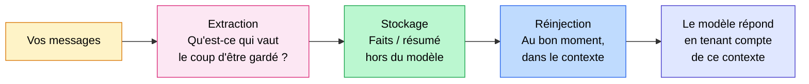

Comment ChatGPT fait pour se souvenir de vous d'une conversation à l'autre ?

Ce n'est pas le modèle d'IA en lui-même. Le modèle, il ne change pas, il ne vous connaît pas. Ce qui retient les infos, c'est une couche posée par-dessus, ce qu'on appelle la mémoire long terme. Et chaque outil la gère différemment.

<!-- more -->

> Cet article fait le lien entre l'usage grand public (ChatGPT, Claude) et l'ingénierie de la mémoire. Pour le versant technique (comment l'implémenter soi-même), voir mon article sur la [mémoire long terme des agents IA](memoire-agents-ia-long-terme.md).

***

## Le modèle ne vous connaît pas (et c'est important de le comprendre)

Commençons par tuer un malentendu très répandu.

Quand vous discutez avec ChatGPT et qu'il semble se souvenir que vous êtes développeur, que vous préférez les réponses courtes ou que vous travaillez sur tel projet, vous avez l'impression que **le modèle a appris** quelque chose sur vous. C'est faux.

Un modèle de langage est **figé**. Ses paramètres (les milliards de poids issus de l'entraînement) ne bougent pas quand vous lui parlez. Il ne "retient" rien. À chaque appel, il repart de zéro et fait une seule chose : prédire le prochain mot à partir de ce qu'on lui donne en entrée. Si vous voulez le détail de ce mécanisme, j'en parle dans mon article sur [comment fonctionne l'IA générative](comprendre-l-IA-generative.md).

Dit autrement : le modèle est **stateless**. Sans état. Sans mémoire.

Alors comment ChatGPT fait-il pour vous reconnaître d'une session à l'autre ? La réponse tient en une phrase : **on ne touche pas au modèle, on pose une couche par-dessus.** Cette couche stocke des informations sur vous quelque part, en dehors du modèle, et les **réinjecte dans le contexte** à chaque nouvelle conversation. Le modèle, lui, croit simplement qu'on les lui a données dans le prompt. Pour lui, il n'y a pas de "souvenir", juste du texte en entrée comme le reste.

C'est exactement ce principe qui rend la mémoire des LLM possible. Et c'est aussi pour ça qu'elle se gère, se règle, et parfois se trompe : ce n'est pas de l'intelligence, c'est de la plomberie.

***

## Le schéma général : stocker, puis réinjecter

Avant d'entrer dans les différences entre outils, posons le principe commun. Quelle que soit l'implémentation, une mémoire long terme fait toujours deux choses :

1. **L'écriture** : décider ce qui mérite d'être retenu, l'extraire, le stocker quelque part (une base de données, pas le modèle).
2. **La lecture** : au bon moment, aller chercher les bonnes informations et les remettre dans le contexte envoyé au modèle.

Tout le reste, ce sont des variantes sur ce thème. Et la première grande variante, c'est **le moment où on extrait**.

### Trois stratégies pour décider quand extraire

Certains outils extraient des infos **à chaque message** que vous envoyez. C'est précis, réactif, mais coûteux : ça demande un traitement supplémentaire à chaque tour.

D'autres attendent **la fin de la conversation** pour trier ce qui vaut le coup d'être gardé. C'est plus économique, et suffisant dans la majorité des cas.

D'autres encore tournent **en arrière-plan**, par exemple toutes les 24h, pour résumer ce que vous avez raconté sur la période. C'est le moins cher, et ça donne une vue synthétique plutôt qu'une liste de faits bruts.

Aucune de ces approches n'est "la bonne". Ce sont des compromis entre coût, fraîcheur de l'information et granularité. Et c'est précisément là-dessus que ChatGPT et Claude divergent.

***

## ChatGPT : une liste de souvenirs, séparée de vos chats

Sur ChatGPT, la mémoire se décompose en **deux mécanismes distincts**, et c'est utile de les séparer mentalement ([documentation OpenAI](https://help.openai.com/en/articles/8590148-memory-faq)).

**1. Les souvenirs sauvegardés (*saved memories*).**
C'est une liste de choses retenues sur vous : votre prénom, vos préférences, des contraintes que vous avez exprimées. Vous pouvez lui demander explicitement *« Retiens que… »*, et il peut aussi en enregistrer automatiquement quand il juge une information importante. Le point clé, c'est que cette liste est **stockée à part de vos conversations** — OpenAI la décrit comme un "bloc-notes" séparé. Conséquence concrète : même si vous supprimez le chat d'origine, le souvenir qui en a été extrait, lui, reste utilisable.

Et surtout : **vous pouvez aller voir cette liste et la modifier à la main**, dans Réglages → Personnalisation → Mémoire. Vous voyez exactement ce qui est retenu sur vous, vous supprimez un élément précis, ou vous videz tout d'un coup.

**2. La référence à l'historique des conversations (*reference chat history*).**
Là, ChatGPT ne s'appuie pas sur une liste de faits, mais sur le contenu de vos anciens chats pour rendre les nouveaux plus pertinents. Si vous avez dit un jour que vous aimez la cuisine thaï, il pourra en tenir compte la prochaine fois que vous demandez quoi manger ce soir. C'est plus diffus, moins explicite, et il ne retient pas tout : pour ce qui doit absolument être gardé, OpenAI recommande de passer par les souvenirs sauvegardés.

### Le détail technique que peu de gens remarquent : la limite de taille

Cette mémoire de souvenirs sauvegardés a une **capacité limitée**. Et c'est là que ça devient intéressant côté ingénierie.

Quand c'est plein, ChatGPT vous le signale. Pour enregistrer de nouvelles infos, **un tri se fait** : soit vous supprimez vous-même d'anciens souvenirs, soit le système met à jour ou retire automatiquement ceux qu'il juge moins utiles pour laisser la place aux nouveaux ([détails OpenAI](https://help.openai.com/en/articles/8983136-what-is-memory)).

Ce n'est pas un détail cosmétique. Ça veut dire qu'il existe, quelque part, une **politique de gestion de la mémoire** : une logique qui décide quoi garder et quoi sacrifier quand l'espace manque. Exactement le genre de décision qu'on doit coder soi-même quand on construit une mémoire d'agent.

> Astuce : si vous voulez discuter sans rien mémoriser ni mettre à jour, utilisez le **Temporary Chat**. Il ne lit pas vos souvenirs et n'en crée pas.

***

## Claude : un résumé de vous, mis à jour en arrière-plan

Sur Claude, l'approche est différente. Plutôt qu'une liste de faits atomiques, c'est plutôt **un résumé de vos échanges** — une synthèse des points clés à travers votre historique ([documentation Anthropic](https://support.anthropic.com/en/articles/11796192-use-memory-and-project-memory-with-claude)).

Ce résumé est **mis à jour à peu près toutes les 24h**, en arrière-plan, et il sert de contexte pour chaque nouvelle conversation. Votre métier, votre façon de travailler, les sujets qui reviennent : c'est ce type d'information qui finit dans la synthèse.

Trois choses méritent d'être soulignées :

- **Une mémoire par projet.** Si vous utilisez les projets dans Claude, il crée une mémoire **séparée pour chacun**. Votre travail client reste distinct de vos réflexions confidentielles, qui restent distinctes du reste. C'est un choix d'architecture intéressant : on cloisonne les contextes au lieu de tout mélanger dans un seul espace.
- **Vous pouvez lui demander de retenir directement.** Sans attendre le prochain résumé automatique, vous pouvez dire à Claude ce que vous voulez qu'il garde. La mise à jour s'applique immédiatement à votre conversation suivante.
- **Mémoire ≠ recherche dans l'historique.** Ce sont deux fonctionnalités distinctes ([Anthropic](https://support.anthropic.com/en/articles/11817273-using-claude-s-chat-search-and-memory-to-build-on-previous-context)). La *recherche* va explicitement chercher dans vos anciens chats quand c'est utile. La *mémoire* maintient une synthèse qui se transporte d'une conversation à l'autre. Et le **mode incognito** permet de discuter sans que rien ne soit mémorisé.

***

## ChatGPT vs Claude : deux philosophies de la même idée

| | ChatGPT | Claude |
|---|---|---|
| Forme de la mémoire | Liste de faits atomiques (souvenirs) | Résumé / synthèse des échanges |
| Moment de l'extraction | À l'usage + en continu | En arrière-plan (~24h) |
| Cloisonnement | Global (+ historique des chats) | Une mémoire par projet |
| Demander de retenir | Oui (*« Retiens que… »*) | Oui (effet immédiat) |
| Voir / éditer / supprimer | Oui, liste complète | Oui, résumé éditable |
| Désactiver / isoler | Temporary Chat | Mode incognito |
| Limite de taille gérée | Oui (tri quand plein) | Synthèse bornée par nature |

Deux philosophies, donc. ChatGPT mise sur **des faits précis, cherchables, éditables un par un** — au prix d'une limite de taille et d'un tri à gérer. Claude mise sur **une synthèse compacte, cloisonnée par projet** — plus lisible, mais moins granulaire qu'une liste de faits.

Aucune n'est objectivement supérieure. Ce sont deux points sur le même curseur : **précision et contrôle d'un côté, simplicité et compacité de l'autre.** Le bon choix dépend toujours du produit qu'on construit et de l'usage réel.

***

## Dans tous les cas, c'est de l'ingénierie autour du modèle

Reprenons de la hauteur. Quel que soit l'outil, le principe reste le même : **on stocke des bouts d'infos sur l'utilisateur quelque part, et on les réinjecte au bon moment pour donner du contexte à l'IA.**

C'est ce genre de système que je construis quand un projet a besoin de mieux connaître son utilisateur dans le temps. Et derrière l'apparente simplicité de l'idée, il y a une vraie liste de décisions techniques :

- **Quoi extraire ?** Un fait stable ("préfère le code au pseudo-code") n'a pas la même valeur qu'une remarque ponctuelle.
- **Quand l'extraire ?** À chaque message, en fin de session, ou en arrière-plan — le compromis coût/fraîcheur dont je parlais.
- **Sous quelle forme stocker ?** Des faits courts et atomiques (façon ChatGPT) ou une synthèse (façon Claude) ? Ça change tout pour la mise à jour et la recherche.
- **Comment gérer les contradictions ?** Si l'utilisateur déménage ou change d'avis, il faut **mettre à jour** l'ancien fait, pas en empiler un nouveau qui le contredit.
- **Comment réinjecter ?** Combien d'éléments, dans quel ordre, à quel endroit du prompt — trop, et la qualité de réponse se dégrade.
- **Et la limite ?** Comme ChatGPT quand la mémoire est pleine : que sacrifie-t-on pour faire de la place ?

Si vous voulez le détail de ces patterns d'implémentation (le "memory writer", le "memory retriever", les outils du marché et les chiffres de benchmark), j'ai écrit un article entier sur le sujet : [la mémoire long terme des agents IA](memoire-agents-ia-long-terme.md). Et pour comprendre où la mémoire s'insère dans une architecture d'agent complète, commencez par [c'est quoi un agent IA](c-est-quoi-un-agent-ia.md).

***

## Un cas concret : Reezet

C'est exactement le travail qu'on mène sur **Reezet**, un projet que je développe avec **Marie Pélisson**. Une IA qui accompagne les personnes dans leur quotidien.

La logique est simple à énoncer, difficile à bien faire : **plus elle retient les bonnes infos au fil du temps, plus l'accompagnement devient pertinent et personnalisé.** Sauf que "les bonnes infos" est le mot clé. Une IA qui accompagne quelqu'un au quotidien ne peut pas se permettre de tout garder en vrac, ni d'oublier l'essentiel.

Et c'est tout le travail. Décider **quoi garder**, à quel moment l'extraire, comment le réinjecter, et surtout **ce qu'on choisit de ne pas garder**.

Parce que c'est ça le piège que peu de gens anticipent : une mémoire qui garde tout, ça devient vite du **bruit**. Plus vous stockez d'informations, plus la récupération devient floue, plus l'IA remonte du contexte hors sujet, et plus la qualité des réponses baisse. C'est contre-intuitif, mais **moins, c'est souvent mieux**. Plus c'est ciblé, mieux l'IA répond.

D'ailleurs, ce n'est pas un hasard si ChatGPT a une limite de taille et si Claude travaille avec une synthèse compacte plutôt qu'un historique brut. Les deux géants ont fait le même constat : **la valeur d'une mémoire ne vient pas de la quantité, mais du tri.**

***

## Pour conclure

ChatGPT ne se souvient pas de vous. Le modèle, lui, ne sait rien.

Ce qui se souvient, c'est une couche d'ingénierie posée par-dessus : elle observe vos échanges, en extrait ce qui compte, le range hors du modèle, et le réinjecte au bon moment. ChatGPT le fait avec une liste de faits éditables et bornée en taille. Claude le fait avec une synthèse cloisonnée par projet, rafraîchie en arrière-plan. Mais c'est le même geste fondamental.

Et la vraie difficulté, celle qui fait la différence entre un gadget et un produit utile, ce n'est pas de tout retenir. C'est de **choisir**. Quoi garder, quand l'extraire, comment le réinjecter — et ce qu'on a le courage de jeter.

***

## Pour aller plus loin

- **[La mémoire long terme des agents IA](memoire-agents-ia-long-terme.md)** : le versant technique de cet article — patterns d'implémentation, outils (Mem0, Zep, Letta) et chiffres de benchmark
- **[C'est quoi un agent IA ?](c-est-quoi-un-agent-ia.md)** : la base pour comprendre où la mémoire s'insère dans une architecture d'agent
- **[Comprendre l'IA générative](comprendre-l-IA-generative.md)** : pourquoi un modèle de langage est figé et ne fait que prédire le prochain mot
- **[Mais c'est quoi le RAG vraiment ?](mais-que-es-le-rag.md)** : à distinguer de la mémoire — le RAG concerne les documents, la mémoire concerne l'utilisateur

***

Si mes articles vous intéressent et que vous avez des questions ou simplement envie de discuter de vos propres défis, n'hésitez pas à m'écrire à [anas@tensoria.fr](mailto:anas@tensoria.fr), j'aime échanger sur ces sujets !

Vous pouvez aussi [réserver un créneau d'échange](https://cal.eu/anas-rabhi/rendez-vous-ianas) ou vous abonner à ma newsletter :)

---

### À propos de moi

Je suis **Anas Rabhi**, consultant Data Scientist freelance. J'accompagne les entreprises dans leur stratégie et mise en œuvre de solutions d'IA (RAG, Agents, NLP).

Découvrez mes services sur [tensoria.fr](https://tensoria.fr) ou testez notre solution d'agents IA [heeya.fr](https://heeya.fr).

  <a href="https://cal.eu/anas-rabhi/rendez-vous-ianas" target="_blank" style="display: inline-block; background-color: #4F46E5; color: #ffffff; font-weight: bold; padding: 16px 32px; text-decoration: none; border-radius: 8px; font-size: 18px; letter-spacing: 0.8px; box-shadow: 0 6px 12px rgba(0, 0, 0, 0.2); transition: all 0.3s ease; border: none;">
    Réserver un créneau
  </a>
  <a href="https://anas-ai.kit.com/d8b1a255cc" target="_blank" style="display: inline-block; background-color: #222222; color: #ffffff; font-weight: bold; padding: 16px 32px; text-decoration: none; border-radius: 8px; font-size: 18px; letter-spacing: 0.8px; box-shadow: 0 6px 12px rgba(0, 0, 0, 0.2); transition: all 0.3s ease; border: none;">
    ✉️ S'abonner à ma newsletter
  </a>

