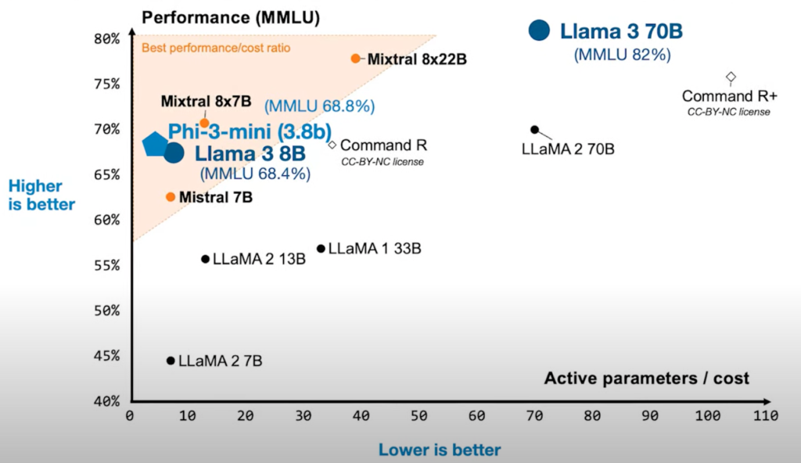

## Introduction

Dans la première partie de cette exploration de l'intelligence artificielle, j'ai cherché à rendre accessibles des notions souvent floues comme le machine learning et le deep learning. Dans cet article, je vous propose de plonger ensemble dans un domaine dont tout le monde parle depuis deux ans : l'IA générative.

Avec l'essor impressionnant d'outils comme ChatGPT, Perplexity ou Midjourney, l'IA générative s'est imposée sur le devant de la scène. Contrairement aux autres formes d'IA qui se contentent d'analyser ou de classer des données, cette technologie est capable de créer de nouvelles données. Que ce soit pour générer du texte, des images, ou même de l'audio. En gros, tout réside dans le mot "Générative" : pour faire simple c'est une forme ou domaine d'IA qui va permettre de générer un nouveau contenu.

Dans cette partie, je vais simplement expliquer ce qu'est l'IA générative, comment ça marche, donner des exemples concrets, et montrer à quoi ça sert vraiment. L'idée, c'est de voir comment les machines ne se contentent plus de comprendre ce qu'on leur donne, mais arrivent carrément à créer du nouveau contenu.

<!-- more -->

--- 

## Les premiers pas

Une des choses qui m'a le plus impressionné dans le domaine de l'IA générative a été l'émergence de modèles performants tels que GPT-3 (ChatGPT en 2022). Qu'on a appelé les LLM, large language modèles ou "grands modèles de langage" en français. La première chose remarquable, c'est l'impression de dialoguer avec une intelligence artificielle qui non seulement comprend nos propos, mais parvient également à maintenir une conversation cohérente.

Ayant déjà travaillé sur des projets de traitement du langage naturel (NLP) (cf. la partie 1 : [Comprendre l'intelligence artificielle - Guide pratique simple](https://ianas.fr/blog/2025/04/05/comprendre-lintelligence-artificielle--guide-pratique-simple-partie-1/)), je savais bien que la performance de GPT-3 n'était pas aussi simple à obtenir. Si c'était aussi facile, des géants comme Google auraient sorti des IA aussi puissantes depuis longtemps ! Mais à l'époque (avant 2022), personne ne savait vraiment comment s'y prendre pour atteindre ce niveau.

L'arrivée de ChatGPT a vraiment changé la donne dans le monde de l'IA. Contrairement à ce qu'on pourrait croire, le principe général derrière ces avancées n'est pas si compliqué : il s'agit principalement d'utiliser une immense quantité de données et une puissance de calcul colossale pour entraîner des modèles très grands, qu'on appelle des LLMs. Ces modèles existent depuis [2017](https://arxiv.org/abs/1706.03762), mais ce qui a tout bouleversé, c'est l'échelle à laquelle ils ont été déployés. Cela dit, il faut nuancer : même si l'idée paraît simple sur le papier, la mise en œuvre concrète reste extrêmement complexe et coûteuse, tant sur le plan technique que financier.

C'est un peu comme si, pour gagner une course de voiture, au lieu d'optimiser la forme de la voiture ou d'améliorer la technique du pilote, on décidait simplement d'installer le plus de **moteurs** puissants possible tout en **agrandissant** la voiture, en espérant que la voiture ira forcément plus vite grâce à toute cette puissance, même si ce n'est pas la solution la plus élégante. Dans notre cas, la **taille du modèle** correspond à la **taille de la voiture**, et le **moteur de la voiture** fait référence à la **donnée** ingérée par le modèle.

>Pour vous donner une idée du coût, environ 4 millions de dollars ont été nécessaires pour entraîner l'un des premiers modèles d'IA à atteindre une performance satisfaisante : GPT-3 (voir : [Coût d'entraînement de GPT-3](https://team-gpt.com/blog/how-much-did-it-cost-to-train-gpt-4/)), sans compter le salaire des chercheurs et les années de recherche nécessaires pour y parvenir.

---

## Un changement de paradigme IA

Vous l'avez compris, l'intelligence artificielle a connu un véritable tournant avec l'arrivée de cette approche « bourrin » 😅 : après cette découverte, plus rien n'a été comme avant dans le domaine de l'IA.

Mais revenons à l'essentiel. Dans la [partie 1](https://ianas.fr/blog/2025/04/05/comprendre-lintelligence-artificielle--guide-pratique-simple-partie-1/), j'expliquais que les modèles sont des algorithmes qui apprennent à partir des données qu'on leur donne. Les modèles Transformers (utilisés pour ChatGPT), c'est juste un nouveau type de modèle architecturés de manière différente. Pour faire simple : imaginez un bâtiment. Selon ce qu'on veut en faire (habiter, travailler...), on ne va pas le construire pareil. En IA, c'est pareil : selon le besoin, on choisit une "forme" de modèle différente. Les transformers, c'est une architecture qui a très bien marché pour générer du texte, des images, etc.

Dans tous les modèles d'IA, il y a plein de chiffres à l'intérieur, qu'on appelle « paramètres ». Imagine-les comme des petits boutons qu'on peut tourner. Pris tout seuls, ces chiffres ne veulent rien dire. Mais quand on les règle tous ensemble, c'est ça qui permet au modèle d'apprendre et de faire son travail.

Pour illustrer un peu l'idée, sur cette image, on voit une machine qui permet de régler les sonorités : dans un modèle d'IA, chaque paramètre peut être imaginé comme un petit bouton que l'on tourne pour ajuster le comportement du modèle. Par exemple, un paramètre peut influencer la façon dont l'IA accorde de l'importance à certains mots ou à certaines images. Comme sur une table de mixage audio où chaque bouton modifie un aspect du son, les paramètres d'un modèle d'IA sont ajustés pour obtenir le meilleur résultat possible lors de l'apprentissage.

Les paramètres sont ajustés grâce aux données qu'on fournit au modèle lors de son apprentissage. Les données permettent de trouver la combinaison de paramètres optimale pour que l'IA soit la plus performante possible. Le dernier élément à comprendre dans un modèle d'IA, c'est que tous ces paramètres sont connectés entre eux par des opérations mathématiques. C'est ce qui permet de calculer le résultat final de l'IA.
C'est tout ? C'est juste des chiffres et des opérations qui permettent à ChatGPT d'être aussi fort ? Eh bien, aussi simple que cela puisse paraître => OUI. Bien évidemment, l'idée globale est simple, mais lorsqu'on s'y met, ça peut vite devenir complexe.

S'il y a une chose à retenir en IA générative, c'est qu'on utilise massivement des données pour entraîner de très gros modèles pour qu'ils continuent de s'améliorer en termes de performance comme on peut le voir sur le graphique suivant : le modèle de 70 milliards de paramètres (Llama 3 70b) a une des meilleures performances, alors que ceux ayant 7 ou 8 milliards sont en dessous. Évidemment, on arrive de plus en plus à améliorer l'efficacité de plus petits modèles mais nous y viendrons plus tard.

---

## L'entraînement des modèles génératifs

L'entraînement d'un modèle génératif, c'est un peu comme apprendre à un enfant à écrire ou à dessiner : on lui montre des millions d'exemples, et il finit par comprendre comment créer quelque chose de nouveau à partir de ce qu'il a vu. Mais ici, l'« enfant » est un algorithme, et les exemples sont des montagnes de textes, d'images, de sons ou de vidéos collectés sur Internet.

Concrètement, l'entraînement consiste à présenter au modèle d'innombrables morceaux de données et à lui demander de deviner la suite logique : le prochain mot dans une phrase, le pixel suivant dans une image, la note suivante dans une mélodie. À chaque essai, le modèle compare sa proposition à la bonne réponse, puis ajuste ses fameux « paramètres » pour s'améliorer. Ce processus, appelé optimisation, se répète des milliards de fois jusqu'à ce que le modèle devienne suffisamment bon pour générer du contenu crédible.

Ce qui distingue l'IA générative moderne, c'est l'échelle : on ne parle plus de quelques milliers d'exemples, mais de milliards. L'entraînement d'un modèle comme GPT-3 ou Llama 3 nécessite des semaines, voire des mois, sur des ordinateurs équipés de milliers de cartes graphiques. C'est cette démesure qui permet d'obtenir des résultats bluffants, mais qui explique aussi pourquoi seuls quelques acteurs majeurs peuvent se permettre de créer de tels modèles.

Un autre point clé : plus le modèle est grand (c'est-à-dire plus il a de paramètres), plus il a de capacité à apprendre des subtilités et à générer des contenus variés. Mais cela ne veut pas dire que « plus gros » est toujours « mieux » : il faut aussi des données de qualité, et il existe aujourd'hui des recherches pour rendre les modèles plus efficaces, même à taille réduite.

Enfin, il ne faut pas oublier que l'entraînement n'est qu'une étape. Une fois le modèle prêt, il peut être « affiné » (fine-tuned) sur des tâches spécifiques, ou mis à jour pour corriger ses erreurs et s'adapter à de nouveaux usages. C'est ce qui permet, par exemple, d'avoir des IA spécialisées dans la rédaction, la traduction, la création d'images, etc.

---

## Comment ça marche concrètement ?

Maintenant qu'on sait comment on entraîne un modèle génératif, on peut se demander : comment fait le modèle, une fois entraîné, pour inventer du texte ?  
Prenons l'exemple d'un modèle de texte comme ChatGPT. Lorsqu'on lui pose une question ou que l'on commence une phrase, il ne fait rien d'autre que de deviner, mot après mot, ce qui a le plus de chances de venir ensuite. C'est un peu comme un jeu du « complète la phrase » : on écrit « Le chat grimpe sur... », et l'IA va proposer « le toit », « l'arbre », ou autre, en fonction de ce qu'elle a vu des millions de fois dans ses données d'entraînement. Elle choisit à chaque étape le mot qui lui semble le plus logique, puis recommence, encore et encore, jusqu'à former une réponse complète.  
Ce qui est fascinant, c'est que le modèle ne comprend pas vraiment ce qu'il écrit ou dessine : il se base uniquement sur des probabilités, en essayant de coller au mieux à ce qu'il a vu dans ses données. C'est pour cela qu'il peut parfois inventer des choses qui n'existent pas (« halluciner »), ou se tromper complètement si la question sort de l'ordinaire.

---

## Exemples d'IA générative

Pour mieux comprendre l'impact de l'IA générative, voici quelques exemples d'applications qui transforment déjà notre quotidien :

### Génération de texte

- **ChatGPT, Gemini, Mistral, Llama** : Ces assistants conversationnels peuvent répondre à des questions, rédiger des emails, résumer des documents, traduire des textes, ou même écrire des histoires et des poèmes. Ils sont utilisés dans le support client, l'aide à la rédaction, l'éducation, etc.

### Génération d'images

- **Midjourney, DALL·E, Stable Diffusion, reve.art** : Ces outils transforment une simple description textuelle (« un chat qui joue de la guitare sur la lune ») en image réaliste ou artistique. Ils sont utilisés par des artistes, des designers, des publicitaires, ou simplement pour s'amuser.

### Génération de code

- **GitHub Copilot, Claude code, Cursor** : Ces IA assistent les développeurs en générant automatiquement du code, en suggérant des corrections ou en expliquant des fonctions. Elles accélèrent le développement logiciel et aident à l'apprentissage de la programmation.

### Génération de musique et d'audio

- **Suno, MusicLM** : Ces modèles peuvent composer de la musique originale dans différents styles, générer des voix synthétiques ou créer des effets sonores à partir d'une simple consigne.

### Génération de vidéos

- **Sora, RunwayML, Veo** : Ces outils permettent de créer des vidéos courtes à partir d'un texte descriptif, d'animer des images ou de générer des effets spéciaux.

### Autres usages de l'IA générative

- **RAG (Retrieval-Augmented Generation)** : Le RAG, c'est un peu comme avoir un ChatGPT personnalisé qui répond à partir de *vos* documents, sans avoir besoin de réentraîner l'IA. Concrètement, au lieu de s'appuyer uniquement sur ce qu'il a appris lors de son entraînement, le modèle va d'abord aller chercher des informations pertinentes dans une base de données ou un ensemble de documents que vous lui fournissez (par exemple, vos manuels internes, FAQ, rapports, etc.). Ensuite, il utilise ces informations pour générer une réponse adaptée et contextualisée. Cette méthode permet d'obtenir des réponses précises, à jour et vraiment alignées sur votre contexte, tout en limitant les risques d'hallucinations ou d'erreurs. C'est une façon simple et puissante de mettre l'IA au service de vos besoins, sans avoir à manipuler des modèles complexes ou à gérer de longs entraînements avec des coûts assez importants. 

Le RAG a été l'une des technologies les plus populaires depuis le début de l'IA générative. 

- **Agents autonomes** : Les agents sont l'une des principales façons d'augmenter les capacités d'un modèle de langage (LLM) comme ChatGPT. Un LLM seul se contente de générer du texte en réponse à une consigne, mais un agent va plus loin : il utilise le LLM comme « cerveau » pour planifier, prendre des décisions et interagir avec le monde extérieur (applications, sites web, emails, etc.). Par exemple, un agent peut organiser un voyage complet, répondre à des emails, ou automatiser des tâches métiers en combinant le raisonnement du LLM avec l'accès à des outils ou des bases de données. Cette approche permet de rendre l'IA vraiment utile dans des situations complexes, en lui donnant la capacité d'agir, de s'adapter au contexte et même d'apprendre de nouvelles compétences au fil du temps. La performance des agents autonomes n'est pas encore parfaite, mais ça progresse rapidement.

- **Synthèse et résumé d'informations** : Les modèles génératifs sont capables de résumer automatiquement de longs documents, d'extraire les points clés d'un rapport, ou de générer des comptes rendus personnalisés à partir de multiples sources. Cela facilite la veille, l'analyse de données et la prise de décision rapide.

Ces exemples montrent que l'IA générative est assez vaste et grand public : elle s'invite dans de nombreux secteurs (éducation, santé, création artistique, industrie, etc.) et ouvre la porte à de nouveaux usages, parfois encore inimaginables il y a deux-trois ans en arrière.

---

## Bien utiliser l'IA générative

L'IA générative est un outil puissant, mais pour en tirer le meilleur parti, il faut savoir l'utiliser de la bonne façon. Voici quelques conseils simples pour l'utiliser efficacement :

### 1. Donner des consignes claires (le « prompting »)  

La qualité des résultats dépend beaucoup de la façon dont on formule la demande. Plus la consigne est claire, précise et détaillée, plus l'IA a de chances de donner une réponse pertinente. Il ne faut pas hésiter à donner du contexte, à préciser le style ou le format attendu, ou à demander plusieurs propositions si besoin.  
Pour écrire les meilleurs prompts, il existe des guides selon l'IA utilisée. Voici par exemple le guide d'OpenAI pour le modèle GPT-4.1 : [Guide](https://cookbook.openai.com/examples/gpt4-1_prompting_guide).

### 2. Relire et vérifier les résultats  

Même si l'IA est impressionnante, elle peut se tromper ou inventer des informations. Il est donc essentiel de toujours relire ce qu'elle produit, de vérifier les faits importants et de corriger les éventuelles erreurs ou incohérences. L'IA doit rester un assistant, pas un remplaçant du jugement humain.

### 3. Expérimenter et affiner  

N'hésite pas à tester différentes formulations, à demander des variantes ou à affiner ta demande si le résultat ne te convient pas du premier coup. L'IA ne "comprend" pas comme un humain, mais elle peut s'adapter à tes besoins au fil des échanges.

---

## Limites de l'IA générative

L'IA générative a des limites importantes : les connaître permet de mieux l'utiliser au quotidien.

### 1. Pas de véritable invention ni de compréhension

L'IA ne crée rien de totalement nouveau : elle se contente de réassembler, reformuler ou combiner ce qu'elle a déjà vu dans ses données d'entraînement. Si une idée, une information ou un style n'a jamais été rencontré pendant l'entraînement, l'IA ne pourra pas l'inventer ni le deviner. Elle ne comprend pas réellement le sens de ce qu'elle génère : il n'y a ni conscience, ni intention, ni réflexion derrière ses réponses. L'IA manipule des probabilités.

### 2. Les hallucinations

L'IA générative peut produire des « hallucinations » : elle invente parfois des informations qui semblent crédibles, mais qui sont fausses, inexactes ou trompeuses. Cela peut concerner des faits, des citations, des références, des chiffres, etc. Même si vous demandez à l'IA de ne pas inventer ou de citer ses sources, il n'y a aucune garantie que le résultat soit fiable à 100 %. C'est pourquoi il faut toujours relire et vérifier les réponses, surtout pour des sujets sensibles, professionnels ou lorsque l'exactitude est cruciale.

La seule façon d'être certain de la véracité d'une information produite par l'IA est de déjà connaître la réponse ou de pouvoir la vérifier soi-même à partir d'une source fiable.

**Conseil :** N'utilisez pas l'IA pour obtenir des informations que vous ne pouvez pas vérifier, ou alors uniquement dans des contextes où une éventuelle erreur n'aura pas de conséquences importantes.

### 3. Biais et stéréotypes

Les modèles d'IA sont entraînés sur de grandes quantités de données issues d'Internet ou d'autres sources. Si ces données contiennent des biais, des stéréotypes ou des préjugés, l'IA risque de les reproduire ou même de les amplifier dans ses réponses. Il est donc important de garder un esprit critique et de ne pas prendre au sérieux tout ce que l'IA génère, notamment sur des sujets sociaux, culturels ou sensibles.

### 4. Confidentialité et sécurité

Les informations saisies dans une IA peuvent être stockées temporairement ou utilisées pour améliorer le modèle. Il est donc déconseillé d'y partager des données personnelles, confidentielles ou sensibles. Soyez vigilant sur ce que vous communiquez à l'IA, surtout dans un cadre professionnel.

---

## Conclusion 

L'IA générative n'en est qu'à ses débuts et son évolution promet de transformer encore davantage notre quotidien. À terme, on peut imaginer l'émergence de modèles plus compacts et plus efficaces, capables pour certains usages de fonctionner directement sur nos appareils (ordinateurs, smartphones, objets connectés), sans dépendre du cloud. Pour l'instant, la plupart des modèles les plus puissants restent accessibles uniquement via le cloud, mais cette miniaturisation ouvrira progressivement la voie à des usages plus privés, plus rapides et mieux adaptés à chaque utilisateur.

Parallèlement, la question de la régulation et de l'éthique deviendra centrale : il faudra encadrer l'utilisation de ces technologies pour limiter les risques de désinformation, de biais ou d'atteinte à la vie privée. Les gouvernements, les entreprises et la société civile devront collaborer pour définir des règles claires et garantir un usage responsable de l'IA.

Enfin, l'IA générative va progressivement s'insérer de façon personnalisée dans chaque métier : elle viendra assister les professionnels au quotidien, en s'adaptant aux besoins spécifiques de chaque secteur. Que ce soit pour aider à la prise de décision, automatiser des tâches répétitives ou libérer du temps pour se concentrer sur des activités à plus forte valeur ajoutée, l'IA deviendra un véritable partenaire de travail. Elle ne remplacera pas la créativité ou l'expertise humaine, mais agira comme un outil puissant pour les amplifier et les enrichir. L'essentiel sera de rester curieux, critique et ouvert face à ces évolutions, afin d'en tirer le meilleur pour chacun.

---------

Si mes articles vous intéressent et que vous avez des questions ou simplement envie de discuter de vos propres défis, n'hésitez pas à m'écrire à anas0rabhi@gmail.com, j'aime échanger sur ces sujets !

Vous pouvez aussi vous abonner à ma newsletter :)

  <a href="https://anas-ai.kit.com/d8b1a255cc" target="_blank" style="display: inline-block; background-color: #222222; color: #ffffff; font-weight: bold; padding: 16px 32px; text-decoration: none; border-radius: 8px; font-size: 18px; letter-spacing: 0.8px; box-shadow: 0 6px 12px rgba(0, 0, 0, 0.2); transition: all 0.3s ease; border: none;">
    ✉️ S'abonner à ma newsletter
  </a>

