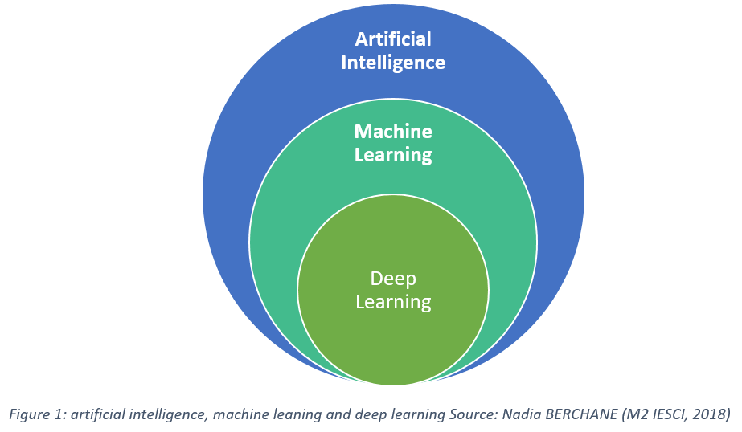

## Introduction

L'intelligence artificielle séduit de plus en plus de curieux et de professionnels, grâce à des outils révolutionnaires comme ChatGPT. Ces avancées ont non seulement transformé notre manière d'interagir avec la technologie, mais ont aussi rendu l'IA incontournable dans les discussions contemporaines. Avec l'IA générative, nous pouvons désormais produire du texte, des images et bien d'autres contenus grâce à de puissants modèles d'apprentissage.

<!--more-->

Cependant, se plonger dans le monde de l'IA peut s'avérer déroutant. Entre les vidéos explicatives superficielles et un flot de ressources sans véritable explication de fond, la confusion règne. De nombreuses idées reçues circulent, amplifiant la perception que l'IA est un domaine impénétrable.

L'objectif de cet article est de dissiper cette brume en fournissant une introduction claire et accessible à l'IA, ses composantes et ses applications. Que vous soyez juste curieux ou que vous cherchiez à intégrer l'IA dans votre domaine, ce guide est conçu pour vous donner les clés nécessaires pour naviguer dans cet univers fascinant.

Dans cette partie 1, je vais me concentrer sur les bases. Et dans la deuxieme partie je me focaliserai sur l'IA Générative.

## Comprendre les Bases de l'IA

L'intelligence artificielle est un terme que l'on entend partout ces jours-ci, mais que signifie-t-il vraiment ? Pour faire simple, l'IA repose sur des algorithmes capables d'apprendre et d'effectuer des tâches spécifiques à partir de données historiques. Les données, donc, sont la pierre angulaire de toute application d'IA. Sans elles, l'algorithme n'a rien sur quoi s'appuyer.

L'idée fondamentale est d'utiliser ces données pour créer des modèles capables de réaliser de nouvelles tâches ou de prédire des résultats. Par exemple, identifier des fraudes à partir de caractéristiques déjà observées. Sans ces données préexistantes, notre "intelligence" serait sans repère, comme un chef talentueux mais sans ingrédients.

L'IA n'est pas une baguette magique, elle ne fonctionne pas dans le vide. L'algorithme, souvent appelé "modèle", "réseau" ou même simplement "une IA", doit être nourri. Sans cette alimentation, il serait, pour ainsi dire, un navire sans cartes ni étoiles pour le guider.

En somme, alors que beaucoup courent après la nouveauté des applications IA, il est crucial de toujours revenir à la source : les données historiques. Elles ne sont pas seulement un point de départ, mais le socle indéfectible sur lequel toute l'IA repose. Commençons donc par balayer les mythes et fondons notre compréhension sur ce qui est vraiment essentiel.

Il est important de noter que l'IA nécessite beaucoup plus de données et d'énergie qu'un humain pour apprendre. Prenons l'exemple d'AlphaGo, l'IA célèbre pour avoir battu les meilleurs joueurs de Go au monde. Elle a été entraînée grâce à des dizaines de millions de parties, simulées et jouées, alors qu'un humain parvient à maîtriser le jeu avec beaucoup moins de pratique. Cette dépendance massive aux données et aux ressources énergétiques montre bien la différence entre l'apprentissage humain et celui des machines.

## Les Composantes de l'IA

Dans le vaste univers de l'intelligence artificielle, deux sous-domaines se distinguent particulièrement : le Machine Learning (ML) et le Deep Learning (DL). Ces techniques sont les fondations sur lesquelles reposent de nombreuses applications d'IA que nous utilisons aujourd'hui.

### Machine Learning

Le Machine Learning est une technique d'apprentissage statistique qui permet aux machines d’apprendre à partir de données, sans être explicitement programmées pour chaque tâche. Cela se traduit par des modèles capables d'effectuer des prédictions ou des classifications dans une multitude de domaines.

Prenons l'exemple de la prédiction des prix immobiliers : un modèle ML peut analyser des données historiques sur les ventes de maisons pour déterminer le prix probable d'un bien donné en se basant sur différentes caractéristiques (surface, nombre de chambres, etc.). De même, dans le domaine de la reconnaissance faciale, ces systèmes sont formés à partir de milliers d'images pour identifier avec précision un visage dans une foule.

L'essentiel ici est de comprendre que le Machine Learning n'est pas juste un outil magique. C'est une approche méthodique qui nécessite des données de qualité et une évaluation continue pour s'assurer que le modèle reste performant et pertinent.

### Deep Learning

Le Deep Learning est une technique avancée de machine learning qui utilise des réseaux de neurones (une sorte d'algorithme mathématique avec de nombreux chiffres et équations) pour analyser des données complexes. Sa force réside dans sa capacité à traiter les données de façon hiérarchique, un peu comme notre cerveau (ou du moins, on essaie d'imiter statistiquement son fonctionnement).

Les réseaux de neurones profonds ont permis des avancées spectaculaires dans des tâches nécessitant une compréhension fine, comme la reconnaissance de la voix ou la compréhension du langage naturel. Cependant, cette sophistication a un coût : les ressources nécessaires sont conséquentes, que ce soit en termes de puissance de calcul ou de volume de données requis pour l'entraînement (= les données historiques).

Ainsi, lorsqu'on envisage d'utiliser le deep learning, il est crucial d'évaluer si l'investissement en ressources est justifié par les bénéfices escomptés. Pour beaucoup d'applications, il pourrait être plus pragmatique de commencer avec des techniques de Machine Learning plus simples, avant d'évoluer vers le Deep Learning si nécessaire.

Ces deux composantes, bien que puissantes, nécessitent une approche réfléchie et stratégique pour être intégrées efficacement dans vos projets. Une compréhension claire de chaque technique, combinée à une évaluation méthodique des erreurs et des performances, est la clé pour réussir dans le monde passionnant de l'IA.

Pour mieux comprendre les relations entre l'Intelligence Artificielle, le Machine Learning et le Deep Learning, voici une représentation visuelle qui illustre comment ces domaines s'imbriquent les uns dans les autres :

Cette image montre clairement que le Deep Learning est un sous-ensemble du Machine Learning, qui est lui-même une branche de l'Intelligence Artificielle. Chaque couche représente une approche plus spécialisée et sophistiquée, avec des techniques et des applications spécifiques.

Cette hiérarchie nous rappelle que, bien que le Deep Learning soit actuellement au cœur de nombreuses innovations spectaculaires, il s'inscrit dans un écosystème plus large de méthodes et d'approches qui constituent ensemble le domaine de l'Intelligence Artificielle.

## Les Domaines de l'IA

Dans le vaste univers de l'intelligence artificielle, comprendre les différents domaines et leurs applications spécifiques peut grandement faciliter votre exploration. Dans cette section je présente un aperçu de chaque domaine majeur de l'IA et de ses applications concrètes.

### Vision par ordinateur : Voir pour comprendre

Le domaine de la vision par ordinateur se concentre sur la capacité des machines à analyser et interpréter des images et des vidéos. Que ce soit pour reconnaître des visages sur Facebook ou pour permettre à une voiture autonome de "voir" la route, les applications sont variées et en constante évolution.

L'analyse vidéo en temps réel, essentielle pour des applications telles que la sécurité ou le sport, dépend fortement de cette technologie. Mais attention, toute cette magie visuelle repose sur des techniques avancées d'apprentissage supervisé (où l'algorithme apprend à partir d'exemples étiquetés par des humains) et d'énormes ensembles de données annotées. Sans ces fondations solides, même les algorithmes les plus prometteurs risquent de trébucher.

Il est important de souligner que la vision par ordinateur est un domaine extrêmement vaste et complexe. Maîtriser ses différentes facettes, de la détection d'objets à la segmentation d'images, et la reconnaissance faciale (et beaucoup d'autres...) peut nécessiter plusieurs années d'étude et de pratique. Chaque sous-domaine possède ses propres défis techniques et méthodologiques, et les chercheurs continuent d'innover constamment pour repousser les limites de ce que les machines peuvent "voir" et comprendre.

### Traitement du Langage Naturel (NLP) : Communiquer avec les machines

Le NLP est la branche de l'IA qui se penche sur la compréhension et la génération du langage humain par les machines. Que ce soit pour traduire un texte ou interagir avec un assistant vocal, la capacité à comprendre le langage est primordiale.

Pourtant, comme dans toute relation, la communication n'est pas dépourvue de défis. Les nuances, les contextes culturels, et les langues rendent la tâche complexe. Des avancées comme les modèles de langage GPT tentent d'apprivoiser cette complexité, mais un modèle mal entraîné peut "halluciner" (inventer des informations) ou produire des réponses inappropriées.

Comme le domaine de la vision par ordinateur, le traitement du langage naturel est un domaine extrêmement vaste et complexe. Maîtriser ses différentes facettes et apporter des solutions adaptées à chaque problématique nécessitent plusieurs années d'expertise.

### Séries temporelles : Prédire l'avenir

Les séries temporelles constituent également un domaine à part entière. Lorsqu'il s'agit d'analyser des données ordonnées dans le temps, comme les prévisions météorologiques ou les cours de la bourse, les séries temporelles sont essentielles.

Ces analyses permettent non seulement de comprendre des tendances passées mais aussi de prédire des événements futurs. Mais attention, prédire l'avenir reste risqué avec une part d'erreur (ce qui n'empêche pas les prédictions de ramener de la valeur). Les modèles doivent être constamment ajustés, notant que des approches rigides peuvent manquer de flexibilité face à des événements imprévus.

### Systèmes de Recommandation : Personnaliser l'expérience utilisateur

Les systèmes de recommandation sont un domaine à part entière de l'IA, focalisé sur la création d'expériences personnalisées. Ils ne se contentent pas d'analyser vos habitudes, ils utilisent des méthodes uniques pour anticiper vos désirs.

Prenons l'exemple de Netflix : lorsque vous terminez une série, le système analyse vos préférences et propose immédiatement des films ou séries qui pourraient vous plaire, en tenant compte de ce que d'autres utilisateurs ayant des goûts similaires ont apprécié. Ce domaine se distingue par son approche dédiée à enrichir continuellement votre interaction avec les plateformes.

### Apprentissage sur données tabulaires : Analyser les tableaux

L'apprentissage sur données tabulaires (comme les données Excel) est une discipline qui se concentre sur l'utilisation des données structurées pour prendre des décisions claires. Imaginez une entreprise qui cherche à prévoir ses ventes futures : en analysant des tableaux de données contenant l'historique des ventes, les prix, et les périodes de l'année, elle peut anticiper les tendances et ajuster ses stratégies de marketing.

Ce domaine se distingue par sa capacité à transformer des données en actions concrètes, offrant un support essentiel aux décisions stratégiques des entreprises.

---

Ces domaines, bien qu'ils partagent certains concepts avec d'autres branches de l'IA, nécessitent une approche spécialisée et une compréhension approfondie des défis singuliers qu'ils présentent.

Pour conclure, il est essentiel de comprendre que l'IA est intrinsèquement liée aux types de données et aux problématiques spécifiques qu'elle aborde. Comme souligné précédemment, l'IA ne peut exister sans données. Chaque domaine de l'IA peut tirer parti des techniques de machine learning et de deep learning, selon les avancées scientifiques. Par exemple, pour les données tabulaires, telles que la prédiction des prix immobiliers, le machine learning et les analyses statistiques sont souvent privilégiés. À l'inverse, pour la vision par ordinateur, qui implique le traitement d'images comme la reconnaissance faciale, le deep learning est généralement plus adapté. Ces choix sont guidés par les recherches actuelles et les méthodes éprouvées par la communauté scientifique.

---

## Conclusion

Pour conclure cette première partie, nous avons exploré différents domaines fascinants de l'intelligence artificielle. Chacun, avec ses spécificités, offre une palette d'applications incroyables qui façonnent notre monde.

Dans la suite, nous plongerons dans l'univers passionnant de l'IA générative. A bientôt !

---------

Si mes articles vous intéressent et que vous avez des questions ou simplement envie de discuter de vos propres défis, n'hésitez pas à m'écrire à anas0rabhi@gmail.com, j'aime échanger sur ces sujets !

Vous pouvez aussi vous abonner à ma newsletter :)

  <a href="https://anas-ai.kit.com/d8b1a255cc" target="_blank" style="display: inline-block; background-color: #222222; color: #ffffff; font-weight: bold; padding: 16px 32px; text-decoration: none; border-radius: 8px; font-size: 18px; letter-spacing: 0.8px; box-shadow: 0 6px 12px rgba(0, 0, 0, 0.2); transition: all 0.3s ease; border: none;">
    ✉️ S'abonner à ma newsletter
  </a>

