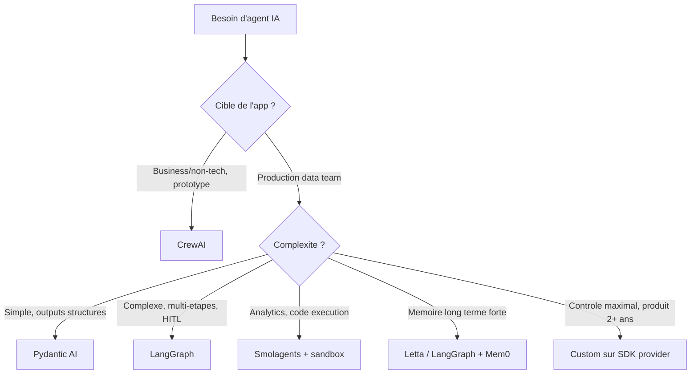

Tous les trois mois, un nouveau framework d'agents IA sort en faisant la une de Reddit et de Hacker News. CrewAI. LangGraph. AutoGen. Pydantic AI. Smolagents. Et maintenant Mastra, Agno, Letta, OpenAI Agents SDK, Inferable... La liste grossit chaque trimestre.

La question que tout le monde pose : **lequel choisir ?**

Le piège, c'est de croire qu'il y a un "meilleur framework". La vérité, c'est que ces outils ne s'adressent pas au même public. Et certains ne sont franchement pas faits pour des data scientists sérieux qui veulent comprendre, optimiser et maîtriser ce qu'ils construisent.

Dans cet article, je vais passer en revue les cinq frameworks principaux avec leurs forces réelles, leurs faiblesses concrètes, et le public auquel chacun s'adresse honnêtement. Plus quelques outsiders à connaître. Et une recommandation directe sur ce que je choisis sur mes missions.

<!-- more -->

> Comparatif rattaché au [guide complet sur les agents IA](/agents-ia/) — architecture, frameworks, production.

***

## Sommaire

1. [Le piège du "meilleur framework"](#le-piege-du-meilleur-framework)
2. [CrewAI, la lib "agent IA pour tous"](#crewai-la-lib-agent-ia-pour-tous)
3. [LangGraph, l'outil sérieux de LangChain](#langgraph-loutil-serieux-de-langchain)
4. [AutoGen (Microsoft), l'orchestrateur multi-agents](#autogen-microsoft-lorchestra-teur-multi-agents)
5. [Pydantic AI, l'outsider type-safe](#pydantic-ai-loutsider-type-safe)
6. [Smolagents (HuggingFace), la philosophie minimaliste](#smolagents-huggingface-la-philosophie-minimaliste)
7. [Les outsiders a connaitre](#les-outsiders-a-connaitre)
8. [Tableau comparatif synthese](#tableau-comparatif-synthese)
9. [Comment je choisis sur mes missions Tensoria](#comment-je-choisis-sur-mes-missions-tensoria)
10. [3 criteres de choix qui comptent vraiment](#3-criteres-de-choix-qui-comptent-vraiment)
11. [Les pieges classiques quand on choisit un framework](#les-pieges-classiques-quand-on-choisit-un-framework)
12. [FAQ](#faq)
13. [Pour aller plus loin](#pour-aller-plus-loin)

***

## Le piege du "meilleur framework"

Avant de plonger dans les comparatifs, il faut cadrer un point important : **aucun framework n'est "le meilleur" dans l'absolu**.

La bonne question n'est pas "quel est le meilleur framework d'agents IA ?". La bonne question, c'est : **le meilleur pour qui, pour faire quoi, avec quel niveau d'expertise, sur quel horizon de temps ?**

Un product manager qui veut prototyper un agent commercial en deux jours n'a pas les mêmes besoins qu'une équipe R&D qui implémente un système multi-agents custom en production. Ces deux personnes n'ont pas besoin du même outil. Et leur forcer le même choix est une erreur.

Ce qui relie tous ces frameworks, c'est une même logique fondamentale : ils cherchent tous à orchestrer la boucle "raisonnement + action" d'un [agent IA](c-est-quoi-un-agent-ia.md). Ce que chacun fait différemment, c'est **le niveau d'abstraction** qu'il choisit d'imposer à l'utilisateur.

Et c'est exactement ce critère qui change tout. **Plus un framework cache de complexité, plus il vous limite dans ce que vous pouvez customiser.** Pour prototyper vite, c'est un avantage. Pour construire un système de production fiable et optimisé, c'est un problème.

***

## CrewAI, la lib "agent IA pour tous"

CrewAI est aujourd'hui le framework d'agents IA le plus populaire sur GitHub avec plus de 44 000 étoiles. C'est un signal fort... mais qui mérite d'être mis en contexte.

### Points forts

- **Prise en main rapide** : on définit des agents avec un rôle, un objectif et un "backstory" en quelques lignes. Un workflow multi-agents fonctionne en moins d'une heure.
- **Abordable pour des non-développeurs** : des profils product, ops ou business peuvent comprendre et modifier la configuration sans maîtriser les concepts sous-jacents.
- **Documentation fournie** et grande communauté, avec beaucoup d'exemples prêts à l'emploi.
- **Adoption forte côté entreprise** pour des POC et des démos internes.

### Points faibles

Voici le coeur du problème pour un data scientist : **CrewAI abstrait des concepts fondamentaux que vous devriez maîtriser**.

Concrètement, quand vous utilisez CrewAI, vous n'avez pas la main sur :

- Le choix précis du prompt système de chaque agent
- Le format exact des messages envoyés au modèle (quel rôle, quel contenu, dans quel ordre)
- La logique de gestion mémoire entre les tours
- Le nombre réel d'appels LLM qui se produisent sous le capot
- Le format des outputs intermédiaires entre agents

Ces décisions, **CrewAI les prend pour vous**. Pour quelqu'un qui veut juste que "ça marche", c'est confortable. Pour un data scientist qui veut optimiser la consommation de tokens, contrôler la qualité des sorties, ou comprendre pourquoi l'agent fait une mauvaise décision, c'est une boite noire frustrante.

Les autres limites concrètes :

- **Difficile à debugger** quand les abstractions cassent. Les messages d'erreur remontent rarement à la cause réelle.
- **Consommation de tokens non optimisée** : CrewAI génère souvent des prompts verbeux et multiplie les appels inutiles.
- **Peu extensible** quand on veut réécrire la boucle de réflexion, ajouter des garde-fous précis, ou tracer chaque appel finement.
- **5,2 millions de téléchargements mensuels** sur PyPI contre 34,5 millions pour LangGraph, ce qui dit beaucoup sur l'adoption en production réelle versus l'expérimentation.

### Tableau CrewAI

| Critere | Evaluation |
|---|---|
| Controle bas niveau | Faible |
| Facilite d'apprentissage | Tres elevee |
| Adapte a un data scientist | Non |
| Production-ready | Moyennement |
| Consommation tokens | Elevee (peu optimisee) |
| Debuggabilite | Difficile |
| Documentation | Bonne |

### Verdict honnete

CrewAI est **excellent pour des non-data-scientists** qui veulent un agent multi-roles fonctionnel rapidement. Un product engineer qui veut montrer un POC en deux jours, un ops qui veut automatiser un workflow business simple, une equipe qui n'a pas de data scientist disponible.

Pour un data scientist serieux, c'est un mauvais choix. Pas parce que CrewAI est une mauvaise librairie, mais parce qu'elle vous prive du controle sur les briques que vous etes precisement cense maitriser et optimiser. Utiliser CrewAI comme data scientist, c'est un peu comme utiliser Excel pour faire du machine learning : ca peut marcher sur des cas simples, mais vous passez a cote de l'essentiel.

***

## LangGraph, l'outil serieux de LangChain

LangGraph est la reponse de LangChain aux critiques sur l'absence de controle de leurs premieres abstractions. Et c'est une bonne reponse.

### Points forts

- **Approche par graphe** : un agent est modelise comme un graphe de noeuds (etats) avec des transitions explicites. Vous voyez exactement ce qui se passe, quand, et pourquoi.
- **Controle maximal** sur les transitions, les conditions, les boucles, les points de verification.
- **Excellent pour les agents complexes** avec branches conditionnelles, cycles, et supervision humaine (human-in-the-loop).
- **Checkpointer integre** : la memoire entre les tours est geree nativement, vous pouvez reprendre un workflow a n'importe quel etat precedent.
- **Streaming natif** et observabilite fine de chaque etape.
- **34,5 millions de telechargements mensuels** sur PyPI : c'est le standard de fait pour les agents en production en 2026.
- Connexion directe avec LangSmith pour le tracing en profondeur.

### Points faibles

- **Courbe d'apprentissage non triviale** : les concepts de State, Edge, Node, Reducer, et Checkpointer demandent du temps pour etre vraiment maitrise.
- **Verbeux pour les cas simples** : creer un agent avec deux outils en LangGraph demande beaucoup plus de code que la meme chose en Pydantic AI ou CrewAI.
- **Encore lie a l'ecosysteme LangChain** avec ses changements d'API frequents, qui peuvent casser du code existant entre versions.
- **LangSmith devient quasi indispensable** pour le tracing serieux, et c'est payant au-dela d'un certain volume.

### Tableau LangGraph

| Critere | Evaluation |
|---|---|
| Controle bas niveau | Eleve |
| Facilite d'apprentissage | Moyenne a elevee |
| Adapte a un data scientist | Oui |
| Production-ready | Oui |
| Consommation tokens | Maitrisable |
| Debuggabilite | Bonne (avec LangSmith) |
| Documentation | Tres bonne |

### Verdict honnete

Pour un data scientist ou un ingenieur qui veut construire un agent custom **production-ready** avec une logique metier precise, **LangGraph est aujourd'hui le meilleur choix structurel**. Il vous laisse maitriser chaque etape, visualiser le graphe d'execution, gerer la memoire explicitement.

Si vous avez deja LangChain dans votre stack, la migration vers LangGraph est naturelle. Si vous partez de zero sur un agent complexe, c'est le premier framework a evaluer.

***

## AutoGen (Microsoft), l'orchestrateur multi-agents

AutoGen a ete pense des le depart pour les systemes ou plusieurs agents "conversent" entre eux pour resoudre une tache.

### Points forts

- **Pattern conversationnel multi-agents** bien pense : les agents se transmettent des messages comme dans une conversation, ce qui est intuitif a modeliser.
- **AutoGen Studio** : interface visuelle pour prototyper des workflows multi-agents sans code.
- **Soutien historique de Microsoft** qui a investi significativement dans le projet.
- **AG2** : la communaute a pris le relais sous forme de fork open-source independant, ce qui assure la continuite du projet.

### Points faibles

- **Microsoft a place AutoGen en maintenance en Q1 2026** au profit du Microsoft Agent Framework. La route officielle Microsoft n'est plus AutoGen.
- Le pattern multi-agents par conversation peut etre **inefficace** : beaucoup de tokens sont consommes en "dialogue" entre agents, meme quand ce dialogue n'apporte pas de valeur.
- **Moins de controle bas niveau** que LangGraph sur les transitions d'etats.
- **Adoption hors ecosysteme Microsoft plus faible** : la communaute francophone notamment est peu documentee.
- L'evolution rapide (v0.4 a casse beaucoup de choses) a laisse une mauvaise impression de stabilite.

### Tableau AutoGen

| Critere | Evaluation |
|---|---|
| Controle bas niveau | Moyen |
| Facilite d'apprentissage | Moyenne |
| Adapte a un data scientist | Moyennement |
| Production-ready | Oui (avec AG2) |
| Consommation tokens | Elevee (conversations entre agents) |
| Debuggabilite | Moyenne |
| Documentation | Bonne (mais fragmentee entre AutoGen/AG2) |

### Verdict honnete

AutoGen reste pertinent pour des **equipes deja dans l'ecosysteme Microsoft/Azure** ou pour de la recherche sur les patterns multi-agents conversationnels. Hors de ces cas, la mise en maintenance officielle par Microsoft et la montee en puissance de LangGraph rendent le choix d'AutoGen difficile a justifier sur un projet neuf en 2026. Je lui preferais LangGraph ou un agent custom sur SDK.

***

## Pydantic AI, l'outsider type-safe

Pydantic AI est sorti fin 2024 et a rapidement gagne 16 800 etoiles GitHub. C'est le framework dont peu de gens parlent encore assez, mais que les data scientists et les bons developpeurs Python apprecient immediatement.

### Points forts

- **Approche Pythonique et minimaliste** : pas d'abstractions magiques, le code ressemble a du bon Python avec des types.
- **Exploitation forte de Pydantic** : tools, outputs, schemas tous types avec validation stricte. Si vous utilisez deja Pydantic (et vous le faites probablement si vous faites du Python serieux), c'est dans la continuite directe.
- **Validation forte des outputs** : les hallucinations de format sont fortement reduites car le schema de sortie est valide avant que la reponse ne soit retournee.
- **Code lisible et auditale** : pas de magie sous le capot. Ce que vous lisez est ce qui se passe.
- **Compatible multi-provider** nativement : OpenAI, Anthropic, Gemini, Groq, Mistral. Pas de vendor lock-in.
- **Experience de test integree** : tester un agent Pydantic AI est aussi simple que tester une fonction Python.

### Points faibles

- **Communaute plus petite** : moins d'exemples, moins de Stack Overflow, moins de templates prets a l'emploi.
- **Peu de patterns multi-agents avancés** nativement. Pour des systemes complexes avec orchestration, il faut plus de code custom.
- **Streaming et taches long-running** pas aussi mûrs que LangGraph.
- **Plus jeune** : certains edge cases en production ne sont pas encore bien documentes.

### Tableau Pydantic AI

| Critere | Evaluation |
|---|---|
| Controle bas niveau | Eleve |
| Facilite d'apprentissage | Faible a moyenne |
| Adapte a un data scientist | Tres bien |
| Production-ready | Oui |
| Consommation tokens | Maitrisee |
| Debuggabilite | Tres bonne (code explicite) |
| Documentation | Bonne et en croissance |

### Verdict honnete

**Mon framework prefere pour un agent "propre" en production.** Quand le besoin est : un agent avec quelques outils, des outputs structures en JSON strict, et un code qu'une autre personne peut lire et maintenir six mois plus tard, Pydantic AI est mon premier choix.

C'est le framework qui respecte le mieux l'expertise d'un data scientist ou d'un bon developpeur Python : zero magie, typage fort, et un comportement previsible.

***

## Smolagents (HuggingFace), la philosophie minimaliste

Smolagents est le framework d'HuggingFace, sorti en 2024 avec un parti pris radical : la simplicite extreme. Le coeur de la librairie fait moins de 1000 lignes. La boucle d'agent principale est lisible en une apres-midi.

### Points forts

- **Poids minimal** : pas de dependances lourdes, pas d'abstractions qui s'empilent. Le code est lisible.
- **Code-based agents** : le concept cle de Smolagents. Plutot que d'appeler des outils via des function calls JSON (comme les autres frameworks), l'agent ecrit et execute du **code Python** pour accomplir ses taches. C'est une difference fondamentale de paradigme.
- **Pourquoi c'est puissant** : un agent qui ecrit du code peut composer des operations complexes en une seule etape, manipuler des dataframes, faire des calculs, produire des graphes, sans aucun outil custom a definir. Il utilise directement Python.
- **26 000+ etoiles GitHub** et le soutien d'HuggingFace, gage de perennnite.
- **Parfait pour les taches d'analyse de donnees** : manipulation de donnees, visualisation, statistiques.

### Points faibles

- **L'approche code-based exige un sandbox securise en production** : si l'agent execute du code Python arbitraire, ce code peut faire n'importe quoi sur le systeme. Sans isolation (E2B, Daytona, Docker isole), c'est une faille de securite majeure.
- **Pas de sandbox par defaut** : Smolagents vous laisse gerer ca vous-meme. Ce n'est pas trivial a configurer correctement.
- **Multi-agents complexe** pas encore aussi mature que LangGraph.
- **Dependance forte au modele** : les agents code-based fonctionnent mieux avec les meilleurs modeles (Claude Sonnet, GPT-4o). Sur des modeles plus faibles, la qualite du code genere chute fortement.

### Tableau Smolagents

| Critere | Evaluation |
|---|---|
| Controle bas niveau | Tres eleve |
| Facilite d'apprentissage | Faible |
| Adapte a un data scientist | Tres bien |
| Production-ready | Avec sandbox (E2B, Docker) |
| Consommation tokens | Variable (selon complexite du code) |
| Debuggabilite | Bonne (code lisible) |
| Documentation | Correcte |

### Verdict honnete

Smolagents est **le meilleur choix pour des taches d'analyse de donnees agentique** : un agent qui doit manipuler des dataframes, faire des calculs statistiques, produire des visualisations ou automatiser des pipelines data. La capacite a ecrire du code Python directement est un avantage decisif dans ces cas.

En revanche, si vous n'etes pas prets a gerer rigoureusement l'isolation de l'execution de code, evitez-le en production. Le risque d'execution de code arbitraire est reel et non negligeable.

***

## Les outsiders a connaitre

Au-dela des cinq frameworks principaux, voici les alternatives qui meritent votre attention selon votre contexte.

**Letta (ex-MemGPT)** : framework specialise dans les agents avec **memoire long terme persistante**. Si votre cas d'usage exige qu'un agent se souvienne de conversations sur des semaines ou des mois, Letta est le seul framework a avoir reellement pense ce probleme en profondeur. J'en parle dans mon article sur la [memoire des agents IA](memoire-agents-ia-long-terme.md).

**Agno (ex-Phidata)** : multi-agent avec memoire integree, croissance rapide. Interface simple, bonne abstraction de la memoire. A surveiller.

**OpenAI Agents SDK** : sorti en 2025, simple, bien integre avec l'API OpenAI. Tres bon si vous etes exclusivement sur OpenAI et que vous voulez quelque chose de leger et officiel. Limite des que vous voulez du multi-provider.

**Mastra** : framework TypeScript-first. Si votre equipe est Next.js / Node.js et que vous ne voulez pas de Python dans la stack, c'est aujourd'hui la meilleure option cote JS.

**Anthropic Computer Use / Claude Code SDK** : pour des agents qui controlent un environnement reel, un navigateur ou un terminal. Cas d'usage specifique mais tres puissant quand il s'applique.

**Inferable / Resemble** : agents en mode "queue/job" pour des taches long-running asynchrones. Utile quand l'agent doit tourner pendant des heures sans connexion active avec un utilisateur.

**DSPy** : pas un framework d'agent a proprement parler, mais une librairie pour **optimiser automatiquement les prompts** de votre pipeline LLM. Si vous cherchez a ameliorer les performances de votre systeme de facon systematique plutot que manuelle, DSPy vaut le detour.

**Microsoft Agent Framework** : le successeur officiel d'AutoGen chez Microsoft. Encore jeune, mais la direction que prend Microsoft pour ses projets d'agents en production.

***

## Tableau comparatif synthese

| Framework | Niveau de controle | Courbe d'apprentissage | Adapte a un DS | Production-ready | Quand l'utiliser |
|---|---|---|---|---|---|
| CrewAI | Bas (abstractions fortes) | Faible | Non | Moyennement | Prototypes business, non-DS |
| LangGraph | Eleve | Moyenne a elevee | Oui | Oui | Agents complexes en prod |
| AutoGen / AG2 | Moyen | Moyenne | Moyennement | Oui | Multi-agents, ecosysteme Microsoft |
| Pydantic AI | Eleve | Faible a moyenne | Tres bien | Oui | Outputs structures stricts, code propre |
| Smolagents | Tres eleve | Faible | Tres bien | Avec sandbox | Code-based agents, analytics |
| Letta | Moyen | Moyenne | Oui | Emergent | Memoire forte, conversations longues |
| OpenAI Agents SDK | Moyen | Faible | Oui | Oui | Stack exclusivement OpenAI, agent simple |
| Custom SDK | Maximal | Faible (si bon dev) | Ideal | Oui | Long terme, cas specifiques, controle total |

***

## Comment je choisis sur mes missions Tensoria

Voici ma grille de choix reelle, pas la version marketing.

**Si la mission est un POC rapide pour un client non-tech qui veut voir un resultat en une semaine** : CrewAI ou Smolagents. L'objectif est de montrer quelque chose qui fonctionne, pas d'ecrire du code parfait. Le temps compte plus que le controle.

**Si c'est un agent custom pour la production avec une logique metier precise** : Pydantic AI ou LangGraph avec glue custom. Pydantic AI pour les agents relativement simples avec outputs structures. LangGraph des que la logique comporte des branches conditionnelles, des boucles, ou de la supervision humaine.

**Si c'est de l'analytics agentique** (manipulation de donnees, calculs, visualisation) : Smolagents avec sandbox E2B. La capacite a ecrire du code Python directement change tout sur ce type de tache.

**Si c'est un systeme multi-agents avec memoire long terme** : LangGraph avec Mem0 pour l'orchestration, ou Letta si la memoire persistante est vraiment le coeur du produit. J'en parle en detail dans mon article sur la [memoire des agents IA](memoire-agents-ia-long-terme.md).

**Si c'est un produit sur lequel on va travailler deux ans et qu'on veut le controle maximal** : code custom direct sur le SDK Anthropic ou OpenAI. Pas de framework. Juste les primitives. Ca permet de ne pas subir les changements d'API d'un framework tiers et de maitriser exactement ce qui se passe. C'est aussi ce que je recommande quand l'equipe est petite et qu'on veut minimiser la dette technique.

Pour les agents qui ont besoin d'outils standardises, je regarde aussi ce que [MCP (Model Context Protocol)](mcp-model-context-protocol-agents-ia.md) peut apporter : c'est un standard qui emerge pour connecter des outils a des agents de facon interoperable, independamment du framework choisi.



***

## 3 criteres de choix qui comptent vraiment

Au-dela du tableau de features, trois criteres font vraiment la difference dans le choix d'un framework.

**1. Le niveau d'expertise de l'equipe**

C'est le critere le plus sous-estime. Un data scientist sera rapidement frustre par CrewAI et ses abstractions opaques. Un product engineer sans background Python galere sur LangGraph custom. Le meilleur framework est celui que votre equipe peut maintenir et deboguer a 2h du matin quand quelque chose casse en production.

**2. L'horizon temporel du produit**

Sur trois mois, prenez ce qui va vite. Sur trois ans, prenez ce qui ne vous enferme pas. Un framework tres abstrait comme CrewAI vous livre rapidement... et vous bloque rapidement aussi. Un agent custom sur SDK provider demande plus de temps au depart mais vous appartient completement sur la duree.

**3. La specificite du metier**

Plus votre cas d'usage est generique, plus un framework abstrait peut suffire. Plus il est specifique (logique metier particuliere, contraintes de format strictes, integration profonde avec des systemes existants), plus le framework devient un poids plutot qu'une aide. Pour des cas tres specifiques, envisagez serieusement l'option "zero framework".

***

## Les pieges classiques quand on choisit un framework

**1. Choisir CrewAI pour de la R&D ML**

La principale erreur que je vois. Une equipe data science choisit CrewAI parce que c'est populaire et facile a prendre en main. Six semaines plus tard, elle tombe sur les limites des abstractions au moment precis ou elle a besoin de comprendre ce qui se passe dans la boucle de raisonnement. La migration vers LangGraph ou du custom coute alors beaucoup plus cher que si elle avait fait le bon choix au depart.

**2. Choisir LangGraph pour un simple agent "appel API - resume"**

L'inverse existe aussi. Un cas d'usage trivial (appeler une API, resumer le resultat, renvoyer) ne necessite pas de modeliser un graphe d'etats avec des checkpointers. Pydantic AI ou meme un simple appel SDK fait le travail en dix fois moins de code.

**3. Choisir selon les etoiles GitHub**

44 000 etoiles pour CrewAI. C'est beaucoup. C'est aussi principalement le reflet de l'engouement des non-developpeurs et des curieux. Les etoiles GitHub mesurent la popularite, pas la qualite technique ni l'adequation a votre cas d'usage. LangGraph a deux fois moins d'etoiles et six fois plus de telechargements reels.

**4. Empiler plusieurs frameworks**

J'ai vu des projets avec LangGraph + CrewAI + LlamaIndex + LangChain legacy dans la meme codebase. C'est une catastrophe de maintenance. Chaque framework a ses propres abstractions, ses propres versions, ses propres conventions. Choisissez un framework principal et tenez-vous-y.

**5. Ne pas mesurer avant la mise en production**

Chaque framework a des comportements tres differents en termes de tokens consommes et de latence. Un workflow CrewAI qui "fonctionne" en dev peut couter cinq fois plus cher que prevu en production a cause des appels LLM superflus generes sous le capot. Mesurez toujours sur un echantillon representatif avant de deployer.

***

## FAQ

**Quel est le meilleur framework d'agent IA en 2026 ?**

Il n'y a pas de meilleur framework universel. Si vous etes data scientist ou ingenieur qui veut du controle : Pydantic AI pour les cas simples, LangGraph pour les cas complexes. Si vous etes non-technique et voulez prototyper vite : CrewAI. Si vous faites de l'analytics agentique : Smolagents. La question pertinente est toujours "le meilleur pour qui et pour quoi".

**CrewAI ou LangGraph : lequel choisir ?**

Si vous etes data scientist, choisissez LangGraph. Si vous etes product manager ou ops qui veut un POC en deux jours, choisissez CrewAI. Les deux sont bons dans leur domaine. Ils ne s'adressent pas au meme public ni aux memes besoins.

**CrewAI est-il bon pour la production ?**

Pour des workflows business simples avec des equipes non-techniques, oui, dans une certaine mesure. Pour des systemes qui demandent de l'optimisation de tokens, une logique metier complexe, ou une observabilite fine, CrewAI atteint rapidement ses limites. Les 5,2 millions de telechargements mensuels sur PyPI contre 34,5 millions pour LangGraph refletent cette realite.

**Pydantic AI vs LangGraph : quelle difference ?**

Pydantic AI est excellent pour des agents relativement simples avec outputs structures et typage fort. LangGraph est necessaire des que vous avez des workflows complexes avec branches conditionnelles, cycles, supervision humaine ou besoin de reprendre un etat precedent. Pour la plupart des agents de production "normaux", Pydantic AI est plus lisible et plus simple a maintenir.

**Smolagents est-il securise en production ?**

Pas par defaut. L'approche code-based de Smolagents signifie que l'agent execute du code Python potentiellement arbitraire. Sans sandbox d'isolation (E2B, Daytona, Docker avec restrictions reseau et systeme de fichiers), c'est une faille de securite serieuse. Avec un sandbox correctement configure, oui, il est utilisable en production.

**Faut-il utiliser un framework ou coder son agent a la main ?**

Ca depend de l'horizon. Pour un prototype ou un POC, un framework accelere le delivery. Pour un produit long terme avec des besoins tres specifiques et une equipe capable, le code custom sur SDK provider (Anthropic, OpenAI) donne un controle total et elimine la dette framework. Je choisis souvent le custom quand l'equipe est bonne et que le produit dure plus de douze mois.

**AutoGen est-il toujours pertinent en 2026 ?**

Microsoft a place AutoGen en maintenance en Q1 2026 au profit de son propre Microsoft Agent Framework. La communaute continue via AG2 (le fork open-source). Pour les equipes Microsoft/Azure deja sur AutoGen, AG2 assure la continuite. Pour un nouveau projet, je choisirais LangGraph ou Pydantic AI plutot qu'AutoGen sauf contrainte specifique.

**LangGraph remplace-t-il LangChain ?**

LangGraph est une couche par-dessus LangChain, pas un remplacement direct. LangChain reste utilise pour ses nombreuses integrations (connecteurs, parsers, retrievers). LangGraph prend en charge l'orchestration de l'agent. En pratique, les deux coexistent dans une meme stack. Pour de nouveaux projets, beaucoup evitent LangChain legacy et utilisent LangGraph avec les SDK providers directement.

**Quel framework pour un agent multi-agents ?**

LangGraph pour un systeme multi-agents stateful et production-ready. CrewAI pour un prototype multi-agents rapide. Agno pour un multi-agents avec memoire integree. AutoGen/AG2 pour des patterns conversationnels entre agents. Smolagents a des capacites multi-agents basiques mais ce n'est pas son point fort.

**Quel framework pour un data scientist ?**

Pydantic AI ou LangGraph. Les deux respectent votre expertise : le code est explicite, les abstractions sont choisies et non imposees, vous controllez ce qui se passe dans la boucle de raisonnement. Evitez CrewAI si vous voulez comprendre et optimiser ce que vous construisez.

***

```json
<script type="application/ld+json">
{
  "@context": "https://schema.org",
  "@type": "FAQPage",
  "mainEntity": [
    {
      "@type": "Question",
      "name": "Quel est le meilleur framework d'agent IA en 2026 ?",
      "acceptedAnswer": {
        "@type": "Answer",
        "text": "Il n'y a pas de meilleur framework universel. Pour un data scientist : Pydantic AI pour les cas simples, LangGraph pour les cas complexes. Pour un non-technique qui veut prototyper vite : CrewAI. Pour de l'analytics agentique : Smolagents. La bonne question est toujours 'le meilleur pour qui et pour quoi'."
      }
    },
    {
      "@type": "Question",
      "name": "CrewAI ou LangGraph : lequel choisir ?",
      "acceptedAnswer": {
        "@type": "Answer",
        "text": "Si vous etes data scientist, choisissez LangGraph. Si vous etes product manager ou ops qui veut un POC en deux jours, choisissez CrewAI. Les deux sont bons dans leur domaine mais ne s'adressent pas au meme public."
      }
    },
    {
      "@type": "Question",
      "name": "Pydantic AI vs LangGraph : quelle difference ?",
      "acceptedAnswer": {
        "@type": "Answer",
        "text": "Pydantic AI est excellent pour des agents simples avec outputs structures et typage fort. LangGraph est necessaire des que vous avez des workflows complexes avec branches conditionnelles, cycles ou supervision humaine. Pydantic AI est plus lisible et plus simple a maintenir pour la plupart des agents standard."
      }
    },
    {
      "@type": "Question",
      "name": "Smolagents est-il securise en production ?",
      "acceptedAnswer": {
        "@type": "Answer",
        "text": "Pas par defaut. L'approche code-based de Smolagents signifie que l'agent execute du code Python potentiellement arbitraire. Sans sandbox d'isolation (E2B, Daytona, Docker avec restrictions), c'est une faille de securite. Avec un sandbox correctement configure, il est utilisable en production."
      }
    },
    {
      "@type": "Question",
      "name": "AutoGen est-il toujours pertinent en 2026 ?",
      "acceptedAnswer": {
        "@type": "Answer",
        "text": "Microsoft a place AutoGen en maintenance en Q1 2026. La communaute continue via AG2 (fork open-source). Pour un nouveau projet en 2026, LangGraph ou Pydantic AI sont de meilleurs choix sauf contrainte specifique liee a l'ecosysteme Microsoft."
      }
    },
    {
      "@type": "Question",
      "name": "Quel framework d'agent IA pour un data scientist ?",
      "acceptedAnswer": {
        "@type": "Answer",
        "text": "Pydantic AI ou LangGraph. Les deux respectent l'expertise d'un data scientist : code explicite, abstractions choisies et non imposees, controle sur la boucle de raisonnement. Evitez CrewAI si vous voulez comprendre et optimiser ce que vous construisez."
      }
    },
    {
      "@type": "Question",
      "name": "Faut-il utiliser un framework ou coder son agent a la main ?",
      "acceptedAnswer": {
        "@type": "Answer",
        "text": "Pour un prototype ou un POC, un framework accelere le delivery. Pour un produit long terme avec des besoins tres specifiques et une equipe capable, le code custom sur SDK provider (Anthropic, OpenAI) donne un controle total et elimine la dette framework."
      }
    },
    {
      "@type": "Question",
      "name": "LangGraph remplace-t-il LangChain ?",
      "acceptedAnswer": {
        "@type": "Answer",
        "text": "LangGraph est une couche par-dessus LangChain, pas un remplacement direct. LangChain reste utilise pour ses integrations. LangGraph gere l'orchestration de l'agent. Pour de nouveaux projets, beaucoup utilisent LangGraph avec les SDK providers directement sans LangChain legacy."
      }
    },
    {
      "@type": "Question",
      "name": "Quel framework pour un systeme multi-agents ?",
      "acceptedAnswer": {
        "@type": "Answer",
        "text": "LangGraph pour un systeme multi-agents stateful et production-ready. CrewAI pour un prototype multi-agents rapide. Agno pour un multi-agents avec memoire integree. AutoGen/AG2 pour des patterns conversationnels entre agents."
      }
    },
    {
      "@type": "Question",
      "name": "CrewAI est-il bon pour la production ?",
      "acceptedAnswer": {
        "@type": "Answer",
        "text": "Pour des workflows business simples avec des equipes non-techniques, oui dans une certaine mesure. Pour des systemes qui demandent de l'optimisation de tokens, une logique metier complexe, ou une observabilite fine, CrewAI atteint rapidement ses limites. Les 5,2 millions de telechargements mensuels contre 34,5 millions pour LangGraph refletent cette realite."
      }
    }
  ]
}
</script>
```

***

## Pour aller plus loin

- **[Mais c'est quoi un agent IA ?](c-est-quoi-un-agent-ia.md)** : la base pour comprendre ce que ces frameworks cherchent tous a orchestrer
- **[Agentic RAG vs RAG classique](agentic-rag-vs-rag-classique.md)** : comment les frameworks d'agents s'articulent avec vos pipelines RAG
- **[Memoire des agents IA long terme](memoire-agents-ia-long-terme.md)** : le composant que la plupart des frameworks gerent encore mal
- **[MCP : Model Context Protocol pour les agents](mcp-model-context-protocol-agents-ia.md)** : le standard emergent pour connecter des outils a vos agents, independamment du framework
- **[Agent IA vs n8n, Make, Zapier](agent-ia-vs-n8n-make-zapier.md)** : quand un framework d'agents est-il vraiment necessaire par rapport a un outil no-code ?

***

Si mes articles vous interessent et que vous avez des questions ou simplement envie de discuter de vos propres defis, n'hesitez pas a m'ecrire a [anas@tensoria.fr](mailto:anas@tensoria.fr), j'aime echanger sur ces sujets !

Vous pouvez aussi [reserver un creneau d'echange](https://cal.eu/anas-rabhi/rendez-vous-ianas) ou vous abonner a ma newsletter :)


---

### A propos de moi

Je suis **Anas Rabhi**, consultant Data Scientist freelance. J'accompagne les entreprises dans leur strategie et mise en oeuvre de solutions d'IA (RAG, Agents, NLP).

Decouvrez mes services sur [tensoria.fr](https://tensoria.fr) ou testez notre solution d'agents IA [heeya.fr](https://heeya.fr).

<div style="text-align: center; margin: 40px 0; gap: 16px; display: flex; flex-wrap: wrap; justify-content: center;">
  <a href="https://cal.eu/anas-rabhi/rendez-vous-ianas" target="_blank" style="display: inline-block; background-color: #4F46E5; color: #ffffff; font-weight: bold; padding: 16px 32px; text-decoration: none; border-radius: 8px; font-size: 18px; letter-spacing: 0.8px; box-shadow: 0 6px 12px rgba(0, 0, 0, 0.2); transition: all 0.3s ease; border: none;">
    Réserver un créneau
  </a>
  <a href="https://anas-ai.kit.com/d8b1a255cc" target="_blank" style="display: inline-block; background-color: #222222; color: #ffffff; font-weight: bold; padding: 16px 32px; text-decoration: none; border-radius: 8px; font-size: 18px; letter-spacing: 0.8px; box-shadow: 0 6px 12px rgba(0, 0, 0, 0.2); transition: all 0.3s ease; border: none;">
    <span style="margin-right: 10px;">✉️</span> S'abonner à ma newsletter
  </a>
</div>
