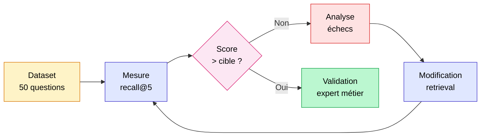

## Un dataset imparfait bat l'absence totale de mesure

Pas besoin de semaines d'annotation ou d'un expert métier disponible dès la première heure. En 30 minutes, vous pouvez générer un dataset de départ exploitable directement depuis vos chunks, mesurer le recall@k, et lancer un premier cycle d'amélioration.

Ce dataset sera imparfait. C'est normal et c'est acceptable. L'objectif n'est pas la perfection : c'est d'avoir une mesure reproductible plutôt que le vide. Un recall@5 de 0.71 mesuré sur 50 questions synthétiques vous dit déjà infiniment plus que "ça marche à peu près en démo".

La méthode que je décris ici se déroule en quatre étapes : générer les questions depuis vos chunks, calculer le recall@k, itérer sur le retrieval (hill climbing), et intégrer les retours "pas pertinent" comme hard negatives pour le reranker. Pour les métriques de génération (faithfulness, answer relevancy, context recall) et le choix entre RAGAS, DeepEval et TruLens, voir [Évaluer un RAG en production : métriques et RAGAS](evaluer-rag-production-metriques-ragas.md).

<!-- more -->

> Le dataset d'évaluation est le socle de tout RAG mesurable. Pour l'ensemble du pipeline, voir le [guide RAG complet](/rag/).

## Pourquoi un golden dataset, même synthétique, change tout

Sans dataset de référence, vous optimisez à l'aveugle. Vous changez le modèle d'embeddings, vous retouchez la taille des chunks, vous ajoutez un reranker. Mais vous ne savez pas si c'est mieux. Vous retestez à la main sur 5 questions. Ce n'est pas de l'optimisation, c'est du tâtonnement.

Un golden dataset, même généré par LLM, vous donne une mesure reproductible. Vous pouvez comparer le recall@5 avant et après chaque modification. Vous pouvez identifier quelles catégories de questions posent problème. Vous pouvez justifier une décision technique avec un chiffre, pas une impression.

### Ce qu'un dataset synthétique couvre (et ce qu'il ne couvre pas)

Les questions générées par LLM sont cohérentes avec vos chunks, bien formulées, et couvrent le corpus de façon systématique. C'est exactement ce qui manque quand on teste "à la main" sur 10 questions qu'on connaît déjà.

En revanche, les vraies questions des utilisateurs sont plus courtes, plus ambiguës, avec des fautes, des références implicites. Un dataset synthétique ne capture pas ces cas. Il faut l'enrichir progressivement avec des questions réelles dès que les logs existent. Le dataset synthétique est le point de départ, pas la destination.

### La règle des 50 questions

Pour une première baseline, 50 questions suffisent. Pas besoin de 500. La distribution que j'applique sur mes projets :

| Type de question | Part | Description |
|---|---|---|
| Factuelle simple | 50% | Une information dans un seul chunk |
| Multi-hop | 20% | Croiser deux chunks ou deux sections |
| Reformulation | 15% | Même question, formulation différente |
| Hors périmètre | 15% | Le RAG doit dire qu'il ne sait pas |

Les questions hors périmètre sont souvent oubliées. Elles sont pourtant critiques pour mesurer le taux d'hallucination sur les requêtes que le système ne devrait pas traiter.

## Générer des questions synthétiques depuis vos chunks

Deux approches. La première, manuelle, vous donne le contrôle total sur le format des questions. La seconde, via le `TestsetGenerator` de RAGAS, est plus rapide si vous avez un corpus volumeux.

### Approche 1 : génération avec un prompt simple (recommandée pour démarrer)

C'est l'approche que je préfère pour un premier dataset. Vous parcourez vos chunks et demandez à un LLM de générer une question et une réponse attendue (ground truth) pour chacun.

```python
import json
from openai import OpenAI

client = OpenAI()

PROMPT_TEMPLATE = """Tu es un expert en évaluation de systèmes RAG.

Voici un extrait de documentation :
<chunk>
{chunk_text}
</chunk>

Génère UNE question précise qu'un utilisateur pourrait poser, dont la réponse se trouve exactement dans cet extrait.
Génère aussi la réponse attendue (ground truth), rédigée en 1 à 3 phrases.

Réponds en JSON valide avec les clés "question" et "ground_truth".
Ne génère pas de question vague ou générique. Sois précis."""


def generate_qa_from_chunk(chunk_id: str, chunk_text: str) -> dict:
    """Génère une paire question/ground_truth à partir d'un chunk."""
    response = client.chat.completions.create(
        model="gpt-4o-mini",
        temperature=0.3,
        response_format={"type": "json_object"},
        messages=[
            {"role": "user", "content": PROMPT_TEMPLATE.format(chunk_text=chunk_text)}
        ],
    )
    result = json.loads(response.choices[0].message.content)
    return {
        "chunk_id": chunk_id,
        "question": result["question"],
        "ground_truth": result["ground_truth"],
        "relevant_chunk_ids": [chunk_id],
    }


# Exemple d'utilisation sur votre liste de chunks
chunks = [
    {"id": "doc1_chunk_3", "text": "Le délai de rétractation est de 14 jours calendaires..."},
    {"id": "doc1_chunk_7", "text": "Les frais de retour sont à la charge du vendeur..."},
]

dataset = [generate_qa_from_chunk(c["id"], c["text"]) for c in chunks]

# Sauvegarde
import csv
with open("eval_dataset.csv", "w", newline="", encoding="utf-8") as f:
    writer = csv.DictWriter(f, fieldnames=["chunk_id", "question", "ground_truth", "relevant_chunk_ids"])
    writer.writeheader()
    writer.writerows(dataset)
```

Coût indicatif avec `gpt-4o-mini` : environ 0,002€ par chunk. Pour 200 chunks, comptez moins de 0,50€ et 5 à 10 minutes de traitement.

### Approche 2 : TestsetGenerator de RAGAS

RAGAS propose un générateur qui construit un graphe de connaissances interne à partir de vos documents avant de générer les questions. Il produit automatiquement différents types de questions (simples, multi-hop, avec raisonnement).

```python
from ragas.testset import TestsetGenerator
from ragas.testset.transforms import default_transforms
from langchain_openai import ChatOpenAI, OpenAIEmbeddings
from langchain_community.document_loaders import DirectoryLoader

# Charger vos documents
loader = DirectoryLoader("./docs/", glob="**/*.md")
documents = loader.load()

# Configurer le générateur
generator = TestsetGenerator.from_langchain(
    generator_llm=ChatOpenAI(model="gpt-4o-mini"),
    critic_llm=ChatOpenAI(model="gpt-4o"),
    embeddings=OpenAIEmbeddings(),
)

# Générer 50 questions avec le mix de types par défaut
testset = generator.generate_with_langchain_docs(
    documents=documents,
    test_size=50,
    transforms=default_transforms,
)

# Export CSV
testset.to_pandas().to_csv("eval_dataset_ragas.csv", index=False)
```

L'avantage du `TestsetGenerator` : il génère des questions multi-hop qui croisent plusieurs documents, ce qu'un prompt simple ne fera pas naturellement. L'inconvénient : le modèle critic (`gpt-4o`) rend la génération plus coûteuse, et vous avez moins de contrôle sur le format exact des questions.

Mon usage terrain : je commence par l'approche manuelle (30 minutes, coût négligeable, contrôle total), et j'enrichis avec le `TestsetGenerator` si le corpus dépasse 500 chunks ou si je veux des questions multi-hop systématiques.

## Mesurer le recall@k et itérer (hill climbing)

Une fois le dataset généré, le cycle de travail est le suivant : mesurer le recall@k sur le dataset, identifier les questions qui échouent, comprendre pourquoi, modifier le retrieval, re-mesurer. C'est ce qu'on appelle le hill climbing : chaque modification doit faire monter le score, sinon on revient en arrière.

### Calculer le recall@k

Le recall@k répond à une question simple : pour chaque question, est-ce que le chunk de référence (`relevant_chunk_ids`) se trouve parmi les k premiers résultats retournés par votre retriever ?

```python
def recall_at_k(retrieved_ids: list[str], relevant_ids: set[str], k: int) -> float:
    """
    Proportion des chunks pertinents retrouvés dans le top-k.
    Pour un seul chunk pertinent par question : retourne 0 ou 1.
    Pour plusieurs chunks pertinents (multi-hop) : retourne la proportion récupérée.
    """
    top_k = set(retrieved_ids[:k])
    if not relevant_ids:
        return 0.0
    return len(top_k & relevant_ids) / len(relevant_ids)


def evaluate_retrieval_dataset(
    eval_dataset: list[dict],
    retriever,
    k: int = 5,
) -> dict:
    """
    eval_dataset : liste de dicts avec 'question' et 'relevant_chunk_ids'.
    retriever : votre retriever avec une méthode invoke() qui retourne des Documents.
    """
    recall_scores = []
    failures = []

    for sample in eval_dataset:
        results = retriever.invoke(sample["question"])
        retrieved_ids = [doc.metadata["chunk_id"] for doc in results[:k]]
        relevant_ids = set(sample["relevant_chunk_ids"])

        score = recall_at_k(retrieved_ids, relevant_ids, k)
        recall_scores.append(score)

        if score < 1.0:
            failures.append({
                "question": sample["question"],
                "expected": list(relevant_ids),
                "got": retrieved_ids,
                "score": score,
            })

    mean_recall = sum(recall_scores) / len(recall_scores)
    return {
        f"recall@{k}": round(mean_recall, 3),
        "n_questions": len(eval_dataset),
        "n_failures": len(failures),
        "failures": failures,
    }


# Exemple de sortie
# {'recall@5': 0.74, 'n_questions': 50, 'n_failures': 13, 'failures': [...]}
```

La liste `failures` est votre matière première pour le diagnostic. Regardez les 5 premiers échecs : le bon chunk est-il absent de la base vectorielle ? Était-il présent mais mal classé ? La question est-elle trop vague pour que l'embedding la "retrouve" ? Les réponses orientent directement l'optimisation suivante.

### Le cycle hill climbing en pratique



Sur un projet récent (corpus RH, 800 documents, retrieval vectoriel seul), le recall@5 de départ était à 0.68. Après deux itérations : passage en retrieval hybride BM25 + vectoriel (+11 pts), puis ajout d'un reranker cross-encoder (+8 pts). Résultat final : 0.87 en trois heures de travail, avec le même dataset de 50 questions comme étalon tout au long.

La cible que je vise avant de passer à l'évaluation de la génération : recall@5 supérieur à 0.90. En dessous, travailler sur le prompt ou le modèle LLM est du temps perdu. Comme le formule Jason Liu : atteignez 97% de recall avant de toucher à quoi que ce soit d'autre.

## Les hard negatives : transformer les échecs en données d'entraînement

Un hard negative est un chunk que le retriever juge pertinent (il le classe haut) alors qu'il ne l'est pas pour cette question précise. C'est le cas le plus difficile à corriger par les métriques de distance cosinus seules, et c'est exactement là que les rerankers apportent le plus.

### Pourquoi les hard negatives sont précieux

Un négatif "facile" est un chunk clairement hors sujet : le retriever ne le remontera pas et il n'y a rien à apprendre. Un hard negative ressemble à la bonne réponse sur le plan sémantique, mais n'est pas la bonne réponse. C'est le chunk de la page 12 qui parle de "délai de traitement" quand la question porte sur le "délai de livraison" : deux chunks proches vectoriellement, sémantique distincte.

Les rerankers cross-encoder (BAAI/bge-reranker-large, Cohere Rerank) sont entraînés sur des paires (question, chunk pertinent) et (question, chunk non pertinent). Plus les hard negatives sont proches du vrai positif, plus le reranker apprend à faire des distinctions fines.

### Comment identifier et constituer vos hard negatives

La source naturelle de hard negatives, ce sont vos `failures` : les cas où votre retriever a remonté de mauvais chunks en position haute. Pour chaque échec, le chunk qui apparaît en position 1 ou 2 à la place du bon chunk est un candidat hard negative.

```python
def extract_hard_negatives(failures: list[dict], k_hard: int = 3) -> list[dict]:
    """
    Extrait les hard negatives depuis les échecs du retriever.
    Pour chaque échec, les k_hard premiers chunks incorrects sont des hard negatives candidats.
    """
    hard_negatives = []
    for failure in failures:
        wrong_ids = [
            cid for cid in failure["got"]
            if cid not in set(failure["expected"])
        ]
        for hard_neg_id in wrong_ids[:k_hard]:
            hard_negatives.append({
                "question": failure["question"],
                "positive_chunk_id": failure["expected"][0],  # le bon chunk
                "hard_negative_chunk_id": hard_neg_id,        # le faux positif
            })
    return hard_negatives

# Utilisation
hard_negatives = extract_hard_negatives(results["failures"], k_hard=2)
# Ces triplets (question, positif, hard_negative) peuvent être utilisés
# pour fine-tuner un bi-encoder ou entraîner un reranker custom.
```

Ces triplets au format (question, chunk pertinent, hard negative) sont le format standard pour l'entraînement contrastif des bi-encoders (via la loss `MultipleNegativesRankingLoss` de sentence-transformers) ou pour affiner un reranker sur votre domaine.

Sur la majorité des projets, vous n'aurez pas besoin d'aller jusqu'au fine-tuning. L'utilisation d'un reranker pré-entraîné (BAAI/bge-reranker-large) sur vos candidats améliore déjà significativement les cas difficiles sans données d'entraînement supplémentaires. Les hard negatives servent d'abord à diagnostiquer : si les 10 premiers échecs sont tous des confusions entre deux chunks très proches, c'est un signal clair pour affiner le chunking ou ajouter du contexte aux chunks concernés.

## Faire valider le dataset par un expert métier

La génération synthétique produit un dataset de départ. Elle ne produit pas un dataset fiable.

Un LLM peut générer une question pour un chunk et une ground truth qui "a l'air juste" mais qui contient une erreur factuelle, une interprétation ambiguë, ou qui porte sur un détail sans importance métier. Sur 50 questions générées, j'estime en moyenne que 8 à 12 nécessitent une correction ou une reformulation.

### Le minimum vital

Asseyez-vous avec un expert métier (ou l'utilisateur final du RAG) pendant 45 minutes. Montrez-lui les 50 questions, une par une. Pour chaque question :

- **La question est-elle réaliste ?** Est-ce quelque chose qu'un vrai utilisateur pourrait demander ?
- **La ground truth est-elle exacte ?** Pas juste "cohérente avec le chunk" : vraiment exacte selon les règles métier ?
- **Y a-t-il des questions manquantes ?** Des sujets critiques non couverts dans les 50 ?

Retirez les questions douteuses plutôt que de les corriger à la va-vite. 40 questions fiables valent mieux que 50 questions approximatives.

### Versionnez votre dataset comme votre code

C'est une erreur fréquente : le dataset évolue (on ajoute des questions, on corrige des ground truths) sans que les évaluations précédentes soient tracées. Vous perdez la capacité de comparer.

Stockez votre dataset dans un fichier versionné (CSV ou JSON dans Git), avec un tag ou un numéro de version. Quand vous modifiez le dataset, créez une nouvelle version. Les métriques de chaque expérience doivent pointer vers la version du dataset utilisée. C'est la condition pour que le hill climbing ait du sens sur la durée.

## Questions fréquentes sur le dataset d'évaluation RAG

**Combien de questions faut-il pour un premier dataset ?**
50 questions suffisent pour une baseline exploitable. Ce chiffre est cohérent avec ce que j'observe sur le terrain : en dessous de 30, les résultats sont trop volatils (un écart de 2 questions change le score de 4 points). Au-delà de 200, le gain marginal est faible si les questions ne sont pas très diversifiées. Commencez à 50, enrichissez progressivement avec les vraies questions des utilisateurs.

**Les questions synthétiques sont-elles fiables pour mesurer le recall ?**
Pour mesurer le recall@k du retriever, oui. Le retriever ne sait pas si une question est synthétique ou réelle : il cherche les chunks les plus proches vectoriellement. Le recall@k calculé sur un dataset synthétique est un indicateur valide des capacités du retriever, à condition que les questions couvrent des sujets variés du corpus. Ce qui n'est pas fiable sans validation humaine, c'est l'évaluation de la génération (faithfulness, answer relevancy) : les ground truths LLM peuvent être inexactes.

**Quel modèle utiliser pour générer les questions ?**
`gpt-4o-mini` est le bon compromis coût/qualité pour la génération. `gpt-4o` en tant que critic (comme dans le `TestsetGenerator` RAGAS) améliore la qualité des questions complexes mais double ou triple le coût. Pour les domaines très techniques (juridique, médical, réglementaire), un modèle plus puissant en génération est justifié : les erreurs factuelles y ont plus de conséquences.

**Faut-il un chunk_id dans chaque document pour utiliser cette méthode ?**
Oui, c'est indispensable. Le recall@k repose sur la comparaison entre les IDs des chunks récupérés et les IDs des chunks de référence. Si vos chunks n'ont pas d'identifiant stable, ajoutez-en un à l'ingestion (hash du contenu, position dans le document, UUID). C'est une bonne pratique de toute façon pour le debugging.

**À quelle fréquence re-calculer le recall@k ?**
À chaque modification significative du pipeline de retrieval : changement de modèle d'embeddings, modification de la taille des chunks, ajout d'un reranker, passage en retrieval hybride. Pas besoin de re-calculer à chaque commit. En production stabilisée, une mesure hebdomadaire suffit pour détecter les dérives.

**Quelle est la différence entre recall@k et hit rate@k ?**
Pour un seul chunk pertinent par question, les deux sont identiques : 1 si le chunk est dans le top-k, 0 sinon. La différence apparaît sur les questions multi-hop avec plusieurs chunks pertinents. Le hit rate@k vaut 1 dès qu'au moins un chunk pertinent est retrouvé. Le recall@k mesure la proportion de chunks pertinents retrouvés. Pour la majorité des RAG avec des questions factuelles simples, utilisez indifféremment l'un ou l'autre.

**Peut-on utiliser cette méthode sans RAGAS ?**
Oui, complètement. Le code présenté dans cet article n'a aucune dépendance à RAGAS. Le `TestsetGenerator` est une option parmi d'autres pour générer les questions. Le calcul du recall@k est une fonction de 10 lignes. RAGAS devient utile pour l'étape suivante (évaluation de la génération avec faithfulness, answer relevancy, etc.), décrite dans [Évaluer un RAG en production : métriques et RAGAS](evaluer-rag-production-metriques-ragas.md).

## Pour aller plus loin

- [Évaluer un RAG en production : métriques et RAGAS](evaluer-rag-production-metriques-ragas.md) : une fois le recall@k correct, passer à l'évaluation de la génération
- [LLM-as-a-judge : quand l'utiliser, avec le coût réel en euros](llm-as-a-judge-cout-evaluation.md) : valider la qualité des ground truths générés par LLM
- [Tester un LLM avec des tests unitaires](tester-llm-tests-unitaires.md) : intégrer l'évaluation dans un pipeline CI/CD
- [RAG hybride BM25 + vectoriel](rag-hybride-bm25-vectoriel.md) : première optimisation à activer quand le recall@k est en dessous de 0.85

---------

Si mes articles vous intéressent et que vous avez des questions ou simplement envie de discuter de vos propres défis, n'hésitez pas à m'écrire à [anas@tensoria.fr](mailto:anas@tensoria.fr), j'aime échanger sur ces sujets !

Vous pouvez aussi [réserver un créneau d'échange](https://cal.eu/anas-rabhi/rendez-vous-ianas) ou vous abonner à ma newsletter :)


---

### À propos de moi

Je suis **Anas Rabhi**, consultant Data Scientist freelance. J'accompagne les entreprises dans leur stratégie et mise en œuvre de solutions d'IA (RAG, Agents, NLP).

Découvrez mes services sur [tensoria.fr](https://tensoria.fr) ou testez notre solution d'agents IA [heeya.fr](https://heeya.fr).

<div style="text-align: center; margin: 40px 0; gap: 16px; display: flex; flex-wrap: wrap; justify-content: center;">
  <a href="https://cal.eu/anas-rabhi/rendez-vous-ianas" target="_blank" style="display: inline-block; background-color: #4F46E5; color: #ffffff; font-weight: bold; padding: 16px 32px; text-decoration: none; border-radius: 8px; font-size: 18px; letter-spacing: 0.8px; box-shadow: 0 6px 12px rgba(0, 0, 0, 0.2); transition: all 0.3s ease; border: none;">
    Réserver un créneau
  </a>
  <a href="https://anas-ai.kit.com/d8b1a255cc" target="_blank" style="display: inline-block; background-color: #222222; color: #ffffff; font-weight: bold; padding: 16px 32px; text-decoration: none; border-radius: 8px; font-size: 18px; letter-spacing: 0.8px; box-shadow: 0 6px 12px rgba(0, 0, 0, 0.2); transition: all 0.3s ease; border: none;">
    <span style="margin-right: 10px;">✉️</span> S'abonner à ma newsletter
  </a>
</div>
