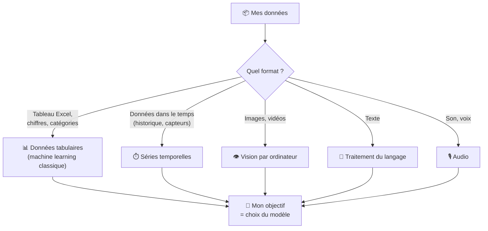

## Introduction

Depuis deux ans, dès que je dis « je travaille dans l'IA », la première réaction est presque toujours la même : *« Ah, comme ChatGPT ? »*. Et c'est normal. ChatGPT a complètement aspiré l'image que les gens se font de l'intelligence artificielle. Pour beaucoup, IA = ChatGPT, et en dehors de ça, il n'y a rien.

Sauf que c'est très loin de la réalité. ChatGPT, c'est **une partie** de l'IA, parmi beaucoup d'autres. La plupart des IA qui tournent aujourd'hui dans les entreprises et dans nos vies n'ont rien à voir avec ChatGPT. Elles existent depuis bien plus longtemps, elles sont moins visibles, mais elles font tourner Netflix, votre filtre anti spam, votre application bancaire ou les usines qui produisent les pièces de votre voiture.

Sur le terrain, je vois souvent des entreprises me demander un projet « ChatGPT » alors que ce dont elles ont vraiment besoin, c'est d'un modèle de prévision sur leurs données Excel ou d'un système de vision sur leur ligne de production. Et la confusion est compréhensible : on ne peut pas choisir le bon outil si on ne connaît pas la boîte à outils.

Dans cet article, je vais faire le tour des grands domaines de l'IA, avec des exemples concrets de ce que les entreprises font vraiment avec (et certains projets sur lesquels j'ai travaillé personnellement). L'objectif : que vous compreniez en lisant que **ChatGPT, c'est juste un type d'IA parmi d'autres**, et que selon ce qu'on veut faire, on choisit un domaine différent et un modèle différent.

<!-- more -->

---

## D'abord, c'est quoi un modèle d'IA, en deux mots

Si vous avez déjà lu mes articles sur [comprendre l'IA](comprendre-l-IA-guide.md) ou [l'IA générative](comprendre-l-IA-generative.md), vous connaissez déjà la base. Mais pour ceux qui débarquent, on va poser les choses simplement.

Un modèle d'IA, c'est un programme qu'on a entraîné à reconnaître des motifs dans des données pour accomplir un objectif précis. Le principe est toujours le même, peu importe le domaine :

1. On a des **données d'entrée** (des images, du texte, des chiffres dans un tableau, des sons).
2. On a une **sortie attendue** (un score, une catégorie, une réponse, une autre image).
3. On donne plein d'exemples au modèle pour qu'il apprenne tout seul à passer de l'entrée à la sortie.

Une bonne analogie : c'est comme un stagiaire à qui vous montrez 10 000 factures bien classées par catégorie. Au bout d'un moment, il sait classer la nouvelle facture qui arrive sans avoir besoin qu'on lui dise. Sauf que là, le stagiaire est un programme, et au lieu de 10 000 exemples, on lui en donne souvent des millions.

Le point central, c'est ça : **le type de données qu'on a en entrée, et ce qu'on attend en sortie, déterminent à quel domaine de l'IA on appartient**. Et selon le domaine, on n'utilise pas du tout le même type de modèle.

---

## Tout part du type de données

C'est vraiment la question fondamentale à se poser quand on parle d'IA : *« Quel type de données j'ai, et qu'est-ce que je veux en faire ? »*. La réponse à cette question vous mène directement à un domaine, et donc à une famille de modèles.

Maintenant qu'on a la grille de lecture, faisons le tour des grands domaines avec des exemples très concrets.

---

## 1. Les données tabulaires : l'IA invisible des entreprises

C'est le domaine le plus ancien, le plus utilisé, et paradoxalement celui dont personne ne parle. Pourquoi ? Parce que ce n'est pas sexy. Pas de chatbot, pas d'image générée. Juste des chiffres dans des tableaux.

Et pourtant, c'est là que se cache **la grande majorité de l'IA qui tourne aujourd'hui en production** dans les entreprises. Ce que je vois sur le terrain, c'est que les projets les plus rentables et les plus stables sont presque toujours dans cette famille.

**Le type de données** : des lignes et des colonnes, comme dans un fichier Excel ou une base de données. Chaque ligne est un exemple (un client, une transaction, un produit), chaque colonne est une caractéristique (âge, montant, catégorie, etc.).

**Quelques cas concrets** :

* **Scoring crédit** : votre banque utilise un modèle qui regarde votre âge, vos revenus, votre historique de remboursement et prédit la probabilité que vous remboursiez un prêt. C'est ce qui décide si on vous accorde votre crédit immobilier.
* **Détection de fraude bancaire** : Stripe et les banques analysent en temps réel chaque transaction (montant, heure, lieu, marchand) pour détecter les paiements suspects, en moins d'une seconde.
* **Détection de fraude à l'assurance santé** : c'est un sujet sur lequel j'ai personnellement travaillé pendant plus d'un an, dans une mission précédente où j'industrialisais des modèles ML pour des mutuelles santé (notamment des acteurs comme **AXA** et **MGEN**). On construisait des algorithmes de détection de fraude, en particulier dans le secteur de l'**optique** (lunettes, montures, verres), qui est l'un des postes les plus fraudés en santé. Ce qui était intéressant techniquement, c'est qu'on mélangeait des données **tabulaires** (montant remboursé, type de verre, fréquence des achats, identifiant du magasin) et des données **textuelles** (libellés d'actes, descriptions de produits) pour repérer des schémas suspects. Côté modèles, c'était du classique mais redoutablement efficace : **Random Forest, XGBoost, CatBoost, régression logistique**, le tout exposé via des APIs FastAPI dockerisées pour la mise en production. Ce type de fraude pèse lourd : la MGEN a détecté **40 millions d'euros de fraude en 2024**, soit +61% en deux ans. Et environ **5% des remboursements santé** seraient frauduleux selon les estimations du secteur, dont une part importante en optique.
* **Prédiction d'attrition** (de « churn » comme on dit dans le métier) : les opérateurs télécom prédisent qui va résilier son abonnement le mois prochain pour le retenir avec une offre ciblée.
* **Prévision de stock** : Carrefour utilise l'IA pour automatiser ses prévisions de stock et atteint **94% de précision** sur les prévisions e commerce et drive. Auchan, lui, a réduit ses surstocks de près de **60%** grâce au machine learning.

**Les modèles utilisés** : ce sont les modèles dits « classiques » du machine learning. **Régression logistique** (un modèle simple qui calcule un score), **arbres de décision**, **Random Forest**, et surtout **XGBoost** ou **LightGBM** qui restent les rois absolus de la donnée tabulaire en 2026. Ces modèles sont rapides à entraîner (quelques minutes à quelques heures), peu coûteux, et souvent très performants.

Aucun rapport avec ChatGPT.

---

## 2. Les séries temporelles : prévoir et détecter

**Le type de données** : des données qui évoluent dans le temps. La consommation électrique heure par heure, le cours de bourse minute par minute, la température d'un capteur seconde par seconde, les ventes jour par jour.

La spécificité de ces données, c'est que **l'ordre dans le temps compte**. Vous ne pouvez pas mélanger les lignes au hasard comme dans un tableau classique : la valeur d'aujourd'hui dépend de celles d'hier.

**Quelques cas concrets** :

* **Prévision de ventes en grande distribution** : Carrefour utilise depuis plusieurs années des modèles d'IA pour anticiper la demande, optimiser ses approvisionnements et limiter le gaspillage sur les produits frais. Auchan, de son côté, a fait baisser ses surstocks de près de 60% avec ce type d'approche.
* **Maintenance prédictive** : dans l'industrie, on capte en continu des données de vibration, température et pression sur les machines pour prédire une panne avant qu'elle n'arrive. **Air France** est un excellent exemple : la compagnie a développé une solution interne appelée **Prognos** qui détecte des signaux précoces de défaillance dans les données de vol enregistrées à chaque trajet. La solution est aujourd'hui utilisée par **plus de 80 compagnies aériennes dans le monde**, et a permis de remplacer préventivement plusieurs pompes à carburant et capteurs de rotation sur la flotte A380. Le département data de AFI KLM E&M utilise Python, Spark et scikit-learn pour développer ces modèles.
* **Prévision énergétique** : RTE et EDF prédisent la consommation électrique de la France minute par minute pour ajuster la production en temps réel.
* **Détection d'anomalies bancaires** : repérer une activité inhabituelle sur un compte par rapport à son historique.

**Les modèles utilisés** : des modèles statistiques anciens mais toujours efficaces comme **ARIMA** ou **Prophet** (développé par Facebook), et des réseaux de neurones spécialisés comme les **LSTM** (un type de réseau qui « se souvient » de ce qu'il a vu avant) ou des Transformers adaptés aux séries temporelles. À nouveau, rien à voir avec ChatGPT.

---

## 3. La vision par ordinateur : faire « voir » les machines

**Le type de données** : des images ou des vidéos. C'est-à-dire des grilles de pixels, où chaque pixel est défini par trois nombres (rouge, vert, bleu).

**L'objectif** : reconnaître ce qu'il y a sur l'image, où se trouvent les objets, ou même générer une nouvelle image.

**Quelques cas concrets** :

* **Contrôle qualité en usine** : **L'Oréal** est un bon exemple. Le groupe contrôle environ **7 milliards de produits cosmétiques** chaque année, avec une centaine de contrôles qualité par produit. Sur le site de **Lassigny en France**, des cobots (robots collaboratifs) travaillent main dans la main avec les opérateurs pour booster la qualité, et le groupe a même bâti une plateforme MLOps maison sur Google Cloud pour faire tourner ses modèles. C'est exactement le genre de cas où la vision par ordinateur permet de détecter automatiquement des défauts (rayures, mauvaises impressions, défauts de remplissage) à la cadence d'une chaîne de production.
* **Imagerie médicale** : des modèles aident les radiologues à repérer des tumeurs sur des IRM ou des cancers du sein sur des mammographies. Plusieurs études cliniques montrent que ces modèles atteignent ou dépassent la précision d'un radiologue moyen sur certaines tâches précises.
* **Voitures autonomes** : Tesla, Waymo et les constructeurs traditionnels utilisent des modèles de vision pour détecter en temps réel les piétons, les panneaux, les voitures et les marquages au sol.
* **Reconnaissance de documents (OCR)** : extraire automatiquement les informations d'une facture, d'une carte d'identité, d'un contrat. Toutes les banques, les assurances et les administrations utilisent ce type de modèle pour digitaliser des piles de documents et éviter les saisies manuelles.
* **Reconnaissance faciale** : déverrouillage de votre téléphone, contrôle aux frontières.

**Les modèles utilisés** : historiquement les **CNN** (réseaux de neurones convolutifs), conçus spécifiquement pour traiter les pixels. Aujourd'hui de plus en plus de **Vision Transformers (ViT)**, qui sont l'adaptation des Transformers (la base de ChatGPT) au monde de l'image. Pour la détection en temps réel, **YOLO** est devenu un standard.

---

## 4. Le traitement du langage (NLP) : comprendre le texte

**Le type de données** : du texte. Des avis clients, des emails, des contrats, des messages, des articles.

C'est dans cette famille que rentre ChatGPT, mais le NLP existait bien avant lui, et beaucoup d'usages en entreprise n'ont rien à voir avec un assistant conversationnel.

**Quelques cas concrets** :

* **Filtre anti spam** : votre boîte Gmail utilise depuis des années un modèle qui classe chaque email en « spam » ou « pas spam ». C'est du NLP pur.
* **Analyse de sentiment** : Booking, Tripadvisor ou Amazon analysent automatiquement les milliers d'avis clients qui arrivent chaque jour pour identifier les sujets qui posent problème (qualité, livraison, prix).
* **Extraction d'informations dans des contrats** : repérer automatiquement la date d'échéance, le montant, les clauses sensibles dans des piles de documents juridiques. Très utilisé chez les avocats et dans les directions juridiques de grandes entreprises.
* **Classification de tickets clients** : router automatiquement un ticket de support vers la bonne équipe selon ce que dit le client.
* **Traduction automatique** : Google Translate, DeepL.

**Les modèles utilisés** : pendant des années, c'était des modèles statistiques simples (où on comptait les mots et leur fréquence dans les documents), puis des modèles plus malins capables de représenter le sens des mots avec des nombres (comme Word2Vec), puis **BERT** (Google, 2018) qui a tout changé en NLP, et aujourd'hui les **LLM** comme GPT, Claude ou Mistral.

C'est ici, et seulement ici, que ChatGPT vit. Et même dans le NLP, beaucoup d'usages en entreprise n'ont pas besoin d'un LLM gigantesque. Un BERT finetuné sur de l'analyse de sentiment fait très bien le travail pour beaucoup moins cher (j'en parle dans mon article sur [l'entraînement et le finetuning](entrainement-finetuning-rag-modele-ia.md)).

---

## 5. L'audio : transcrire, reconnaître, générer

**Le type de données** : du son. Des fichiers audio, de la voix, de la musique.

**Quelques cas concrets** :

* **Transcription automatique** : Whisper d'OpenAI transcrit n'importe quel audio en texte avec une précision impressionnante. Utilisé partout, des journalistes aux centres d'appels.
* **Assistants vocaux** : Siri, Alexa, Google Assistant. Reconnaissance de la voix puis traitement par NLP.
* **Détection de pannes par le son** : certaines usines analysent le bruit de leurs machines en continu pour repérer des défaillances avant qu'elles n'arrivent.
* **Génération de voix** : ElevenLabs permet de cloner une voix à partir de quelques secondes d'audio. Suno génère des morceaux de musique entiers à partir d'un texte.

**Les modèles utilisés** : souvent des Transformers adaptés à l'audio (Whisper en est un), parfois des CNN qui analysent des « photos du son » (les spectrogrammes, qui transforment un son en image pour qu'on puisse l'analyser comme une image).

---

## Chaque domaine, son type de modèle

Et c'est là le point que je veux vraiment faire passer.

**Il n'existe pas un modèle d'IA universel**. Le modèle qui fait tourner ChatGPT (un Transformer entraîné sur du texte) n'a rien à voir avec celui qui prédit votre score de crédit (souvent un XGBoost) ou qui détecte un défaut sur une pièce industrielle (un CNN). Ce sont des outils différents, conçus pour des problèmes différents.

Voici un tableau récapitulatif pour bien visualiser :

| Domaine | Type de données | Famille de modèles | Cas typique |
|---|---|---|---|
| **Tabulaire** | Lignes et colonnes (Excel) | Régression, Random Forest, XGBoost, LightGBM | Scoring crédit, fraude, churn |
| **Séries temporelles** | Données ordonnées dans le temps | ARIMA, Prophet, LSTM | Prévision de ventes, maintenance |
| **Vision** | Images, vidéos | CNN, YOLO, Vision Transformers | Contrôle qualité, imagerie médicale |
| **Texte (NLP)** | Mots, phrases, documents | BERT, LLM (GPT, Claude...) | Anti spam, analyse de sentiment |
| **Audio** | Sons, voix, musique | Transformers audio, CNN sur spectrogrammes | Transcription, assistants vocaux |

Et la phrase à retenir : **ChatGPT, c'est un Transformer optimisé pour le texte**. C'est un domaine de l'IA, ce n'est pas l'IA. Si demain vous voulez prédire vos ventes du mois prochain à partir de votre historique Excel, ChatGPT ne sera pas la bonne réponse. Il faudra un modèle complètement différent.

### Et corollaire important : un data scientist n'est pas universel

Cette segmentation a une conséquence directe sur le marché du travail, que les entreprises sous estiment souvent : **un data scientist spécialisé dans un domaine ne maîtrise pas forcément les autres**.

Pour parler de moi, je suis spécialisé en **NLP et IA générative** (RAG, agents IA, LLMs, finetuning de modèles de langage). C'est ce que je fais au quotidien, c'est là que je peux apporter le plus de valeur. Mais si demain on vient me voir pour entraîner un modèle de **vision satellite** pour analyser des cultures agricoles, ou pour construire un **moteur de recommandation** type Netflix, ou pour faire du **forecasting de séries temporelles** avec des modèles comme Prophet ou ARIMA, je ne suis pas la bonne personne. Ces domaines demandent des connaissances très spécifiques (architectures, métriques d'évaluation, prétraitements, intuitions métier) qu'on ne s'invente pas du jour au lendemain.

Sur le terrain, je vois souvent des entreprises qui pensent qu'un « data scientist », c'est un profil universel qui sait tout faire en IA. C'est faux. C'est un peu comme dire qu'un médecin sait tout faire en médecine : un cardiologue ne va pas vous opérer du genou, et un dermatologue ne va pas suivre votre grossesse. Pareil en IA. Quand vous recrutez ou que vous mandatez un freelance, **vérifiez toujours la spécialité concrète** par rapport à votre besoin. Quelqu'un qui a passé trois ans à industrialiser des XGBoost en banque ne fera pas le même travail qu'un spécialiste des LLMs et des agents IA, même si tous les deux portent le titre de « data scientist ».

Ça ne veut pas dire qu'un bon data scientist ne peut pas apprendre un nouveau domaine. Mais ça veut dire qu'il y a une vraie courbe d'apprentissage, et qu'il faut en tenir compte dans les délais et les attentes du projet.

---

## L'IA générative : le grand tournant

Jusqu'ici, on a parlé d'IA qui **analyse**, qui **prédit**, qui **classe**. C'est ce qu'on appelle l'IA « discriminante ». Elle prend des données et elle vous donne une réponse courte (un score, une catégorie, une coordonnée).

À partir de 2022, avec ChatGPT, un autre type d'IA a explosé sur le devant de la scène : **l'IA générative**. Au lieu d'analyser, elle **crée**. Du texte, des images, du code, de la musique, des vidéos.

Pourquoi ce tournant maintenant ? Trois raisons principales :

1. **L'arrivée des Transformers en 2017**. Une nouvelle architecture mathématique qui a démontré qu'on pouvait apprendre des choses incroyablement complexes à partir de texte.
2. **Le passage à l'échelle**. On s'est rendu compte que plus on rendait ces modèles gros (plus de paramètres), plus on leur donnait de données, plus ils devenaient performants. Ce qui a mené à GPT 3, GPT 4, Claude, Llama.
3. **L'apprentissage par retours humains** (le RLHF dont je parle dans mon article sur [l'entraînement et le finetuning](entrainement-finetuning-rag-modele-ia.md)). C'est ce qui a transformé un modèle qui complète du texte en assistant qui dialogue vraiment avec vous.

**Les acteurs principaux aujourd'hui** : OpenAI (ChatGPT, Sora), Anthropic (Claude), Google (Gemini, Veo), Meta (Llama), Mistral, et côté image Midjourney et Stable Diffusion. Vu le rythme des annonces (un nouveau modèle presque chaque semaine), j'ai d'ailleurs listé [mes sources pour suivre les sorties en IA générative](reussir-a-suivre-les-sorties-en-IA.md) sans se noyer.

**Ce que ça change concrètement pour les entreprises** : la rédaction de contenu, la synthèse de documents, l'aide à la programmation, le support client automatisé, l'extraction d'informations dans des documents, les agents IA qui exécutent des tâches. Autant de cas qui n'étaient quasiment pas accessibles avant 2022.

Mais attention, encore une fois : **l'IA générative ne remplace pas les autres domaines**. Elle s'ajoute. Pour prédire un churn, vous utilisez toujours XGBoost. Pour détecter un défaut sur une pièce, toujours un CNN. L'IA générative est un nouvel outil, pas un outil universel.

---

## Les modèles multimodaux : la convergence

L'évolution la plus récente, c'est qu'on commence à voir apparaître des modèles capables de traiter **plusieurs types de données en même temps**. Du texte, des images, du son, parfois même de la vidéo, dans un seul et même modèle.

**Quelques exemples** :

* **GPT 4o** d'OpenAI : vous pouvez lui envoyer une photo, il vous répond en texte ou en voix.
* **Gemini** de Google : analyse une vidéo et produit un résumé écrit.
* **Claude** d'Anthropic : peut lire un document avec images, schémas et tableaux et raisonner dessus.

Avant cette vague multimodale, chaque domaine avait ses modèles séparés. Vous aviez un modèle de vision pour les images, un modèle NLP pour le texte, un modèle audio pour le son. Et si vous vouliez les combiner, il fallait les faire travailler ensemble manuellement.

Aujourd'hui, un seul modèle peut tout faire en même temps. C'est plus puissant, plus naturel, mais c'est important de comprendre que **c'est l'évolution naturelle, pas le point de départ**. Si vous ne comprenez pas les domaines d'avant (tabulaire, vision, NLP, audio), vous ne pouvez pas vraiment comprendre pourquoi le multimodal est intéressant.

---

## L'IA que vous utilisez déjà sans le savoir

Avant de conclure, je veux insister sur un point. La plupart des gens pensent que l'IA est une nouveauté qui est arrivée avec ChatGPT en 2022. La réalité, c'est que **vous utilisez de l'IA depuis des années sans vous en rendre compte**.

Quelques exemples du quotidien :

* **Le filtre anti spam de Gmail** : un classifieur NLP entraîné sur des milliards d'emails. Il existe depuis le début des années 2000 et il s'améliore en continu.
* **Les recommandations Netflix, YouTube, Spotify** : un mélange de modèles tabulaires et de réseaux de neurones qui prédisent ce qui va vous plaire à partir de votre historique.
* **Waze et Google Maps** : utilisent des modèles de séries temporelles et d'analyse de graphes pour prédire le trafic et calculer le meilleur itinéraire.
* **Le déverrouillage par reconnaissance faciale** de votre téléphone : un modèle de vision entraîné sur des millions de visages.
* **Les suggestions de mots quand vous tapez sur votre clavier** : un petit modèle de langage embarqué dans votre téléphone.
* **La détection automatique des photos floues** dans votre galerie : un modèle de vision.
* **Les chatbots de support client** sur les sites e commerce : avant les LLM, c'était souvent des modèles NLP simples avec des règles. Aujourd'hui de plus en plus de LLM.

Bref, **la grande majorité de l'IA en production aujourd'hui dans les entreprises et dans nos vies, ce n'est pas de l'IA générative**. C'est du machine learning classique, de la vision, du NLP « à l'ancienne ». Et ça tourne depuis des années, sans que personne en parle.

L'IA générative, c'est la partie visible de l'iceberg. Le reste tourne dans l'ombre, et c'est souvent ce qui rapporte le plus d'argent aux entreprises au quotidien.

---

## Ce qui fait vraiment la différence : la donnée et l'entraînement

Pour finir, un message qui me semble essentiel.

Peu importe le domaine, peu importe le modèle, **la performance d'une IA dépend avant tout de la qualité des données et du soin apporté à l'entraînement**. Pas du modèle lui même.

Trois choses à garder en tête :

1. **Données pourries en entrée, résultat pourri en sortie.** Un modèle entraîné sur des données sales, biaisées ou incomplètes donnera des résultats mauvais, peu importe sa puissance théorique. Un XGBoost bien entraîné sur des données propres bat presque toujours un gros réseau de neurones entraîné sur des données médiocres. Je l'ai vu plusieurs fois en mission : les équipes qui passent du temps à comprendre, nettoyer et structurer leurs données arrivent toujours à de meilleurs résultats que celles qui veulent foncer directement sur le modèle.

2. **L'entraînement fait toute la différence**. Deux entreprises peuvent utiliser exactement le même type de modèle et obtenir des résultats radicalement différents, simplement parce que la préparation des données, le choix des caractéristiques pertinentes, le réglage des paramètres et l'évaluation rigoureuse n'étaient pas au même niveau. C'est exactement ce que je détaille dans mon article sur [l'entraînement, le finetuning et le RAG](entrainement-finetuning-rag-modele-ia.md).

3. **C'est vrai même pour les LLM**. ChatGPT, Claude, Gemini ou Mistral utilisent globalement la même brique technique de base (des Transformers), ils ont tous accès à des moyens financiers énormes, et pourtant ils n'ont pas du tout les mêmes performances. Pourquoi ? Parce qu'ils n'ont pas été entraînés sur les mêmes données, avec les mêmes méthodes, les mêmes choix d'alignement. Même technologie, résultats différents.

La vraie valeur en IA, ce n'est pas le modèle. **C'est la donnée et le travail qu'on met dessus**. C'est pour ça que les métiers de Data Scientist, Data Engineer et Machine Learning Engineer existent, et qu'ils ne sont pas remplacés par ChatGPT.

---

## En résumé

L'IA, ce n'est pas un truc unique qui s'appelle ChatGPT. C'est un ensemble de domaines, chacun adapté à un type de données et à un objectif différent.

Avant de se lancer dans un projet IA, la bonne question à se poser n'est pas *« est-ce qu'on utilise ChatGPT ? »*. C'est *« quel type de données on a, et qu'est-ce qu'on veut faire ? »*. À partir de cette réponse, le bon domaine et le bon modèle deviennent évidents.

Et surtout, retenez que les modèles eux mêmes ne valent pas grand chose sans données propres et sans un travail sérieux d'entraînement. Le vrai effort en IA, ce n'est jamais le modèle. C'est tout ce qu'il y a autour.

---

## Pour aller plus loin

* **[Comprendre l'intelligence artificielle (Partie 1)](comprendre-l-IA-guide.md)** : les bases du machine learning et du deep learning
* **[Comprendre l'IA générative (Partie 2)](comprendre-l-IA-generative.md)** : comment fonctionnent vraiment les LLM
* **[Entraînement, finetuning ou RAG : que choisir ?](entrainement-finetuning-rag-modele-ia.md)** : les trois grandes approches selon votre besoin
* **[C'est quoi le RAG ?](mais-que-es-le-rag.md)** : l'approche qui fait tourner la majorité des projets IA en entreprise
* **[Mais c'est quoi un agent IA ?](c-est-quoi-un-agent-ia.md)** : la suite logique des LLM

---

Si mes articles vous intéressent et que vous avez des questions ou simplement envie de discuter de vos propres défis, n'hésitez pas à m'écrire à [anas@tensoria.fr](mailto:anas@tensoria.fr), j'aime échanger sur ces sujets !

Vous pouvez aussi [réserver un créneau d'échange](https://cal.eu/anas-rabhi/rendez-vous-ianas) ou vous abonner à ma newsletter :)

---

### À propos de moi

Je suis **Anas Rabhi**, consultant Data Scientist freelance. J'accompagne les entreprises dans leur stratégie et mise en œuvre de solutions d'IA (RAG, Agents, NLP).

Découvrez mes services sur [tensoria.fr](https://tensoria.fr) ou testez notre solution d'agents IA [heeya.fr](https://heeya.fr).

  <a href="https://cal.eu/anas-rabhi/rendez-vous-ianas" target="_blank" style="display: inline-block; background-color: #4F46E5; color: #ffffff; font-weight: bold; padding: 16px 32px; text-decoration: none; border-radius: 8px; font-size: 18px; letter-spacing: 0.8px; box-shadow: 0 6px 12px rgba(0, 0, 0, 0.2); transition: all 0.3s ease; border: none;">
    Réserver un créneau
  </a>
  <a href="https://anas-ai.kit.com/d8b1a255cc" target="_blank" style="display: inline-block; background-color: #222222; color: #ffffff; font-weight: bold; padding: 16px 32px; text-decoration: none; border-radius: 8px; font-size: 18px; letter-spacing: 0.8px; box-shadow: 0 6px 12px rgba(0, 0, 0, 0.2); transition: all 0.3s ease; border: none;">
    ✉️ S'abonner à ma newsletter
  </a>

## FAQ : Les domaines de l'IA

**1. Est-ce que ChatGPT peut tout faire ?**
Non. ChatGPT est excellent pour tout ce qui touche au texte (écrire, résumer, traduire, expliquer). Mais pour prédire vos ventes du mois prochain à partir d'un historique Excel, détecter un défaut sur une pièce industrielle ou faire de la maintenance prédictive sur une machine, ce n'est pas le bon outil. Il faut un modèle spécialisé pour le domaine concerné.

**2. C'est quoi la différence entre IA, machine learning et deep learning ?**
L'IA est le terme général. Le machine learning est une famille de techniques d'IA où le modèle apprend à partir des données. Le deep learning est un sous ensemble du machine learning qui utilise de gros réseaux de neurones (c'est la base des modèles modernes comme ChatGPT, mais aussi des modèles de vision et d'audio).

**3. Pourquoi on parle si peu des autres domaines de l'IA ?**
Parce qu'ils sont moins visibles pour le grand public. Personne ne se rend compte qu'un modèle d'IA filtre ses spams, recommande ses films Netflix ou détecte la fraude sur ses paiements. L'IA générative, elle, est visible parce qu'on interagit directement avec.

**4. Quel est le domaine de l'IA le plus utilisé en entreprise aujourd'hui ?**
Sans hésiter, les modèles tabulaires (XGBoost et compagnie) qui font tourner les applications de scoring, de prédiction de churn, de prévision de stocks, de détection de fraude. Suivi du NLP et de la vision. L'IA générative monte vite mais reste encore minoritaire en production.

**5. Est-ce que je dois m'inquiéter si je ne connais que ChatGPT ?**
Pas du tout, c'est même la porte d'entrée la plus courante aujourd'hui. Pour en tirer le maximum côté usage, j'ai écrit un guide sur [comment utiliser ChatGPT efficacement](utiliser-chatgpt-efficacement.md). Mais si vous voulez vraiment comprendre ce qu'est l'IA et ce qu'elle peut apporter à votre entreprise, il faut élargir la vision et comprendre que ChatGPT n'est qu'un type d'IA parmi d'autres.

---

## Sources et références

* **L'Oréal et le contrôle qualité industriel** : [L'Oréal's Quality-First Approach To Manufacturing Operations (Manufacturing Digital)](https://manufacturingdigital.com/articles/loreal-group-ensuring-elite-product-quality) et [How L'Oréal's Tech Accelerator built its end-to-end MLOps platform (Google Cloud)](https://cloud.google.com/blog/products/ai-machine-learning/how-loreals-tech-accelerator-built-its-end-to-end-mlops-platform).
* **Air France et la maintenance prédictive Prognos** : [Comment Air France utilise l'IA (Air France Corporate)](https://corporate.airfrance.com/en/press-releases/how-air-france-using-artificial-intelligence-ai-optimize-its-business-activities-and) et [A380 : la maintenance prédictive décolle (Data Analytics Post)](https://dataanalyticspost.com/a380-maintenance-predictive-decolle/).
* **Carrefour et l'IA dans la supply chain** : [Carrefour place l'IA au rayon des projets stratégiques (CIO Online)](https://www.cio-online.com/actualites/lire-carrefour-place-l-ia-au-rayon-des-projets-strategiques-16016.html) et [L'intelligence artificielle au cœur de la stratégie de Carrefour (Retail-IA)](https://retail-ia.fr/lintelligence-artificielle-au-coeur-de-la-strategie-de-carrefour/).
* **Auchan et la réduction des surstocks** : [Comment optimiser les approvisionnements et les prix dans la distribution grâce à l'IA (Optimix)](https://optimix.fr/blog/supplychain/optimisation-des-approvisionnements-et-prix-par-lia/).
* **AXA et la détection de fraude** : [AXA : L'Intelligence Artificielle au service de la lutte contre la fraude (AWS Blog)](https://aws.amazon.com/fr/blogs/france/axa-lintelligence-artificielle-au-service-de-la-lutte-contre-la-fraude-a-lassurance/) et [Comprendre et combattre la fraude santé (AXA Santé)](https://www.axa-assurancescollectives.fr/parole-experts/comprendre-et-combattre-la-fraude-sante-un-enjeu-collectif/).
* **MGEN et la fraude santé** : [Fraude assurance santé, une détection en temps réel (L'Assurance en mouvement)](https://www.lassuranceenmouvement.com/2025/12/31/fraude-assurance-sante-une-detection-en-temps-reel/).
