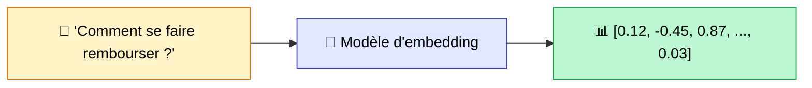
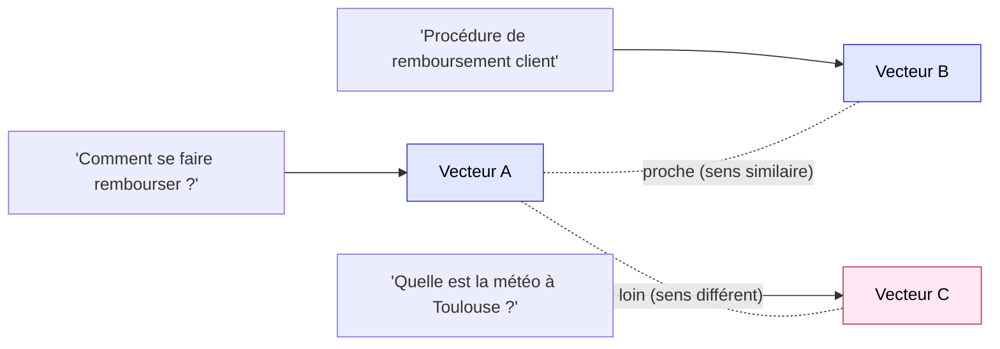
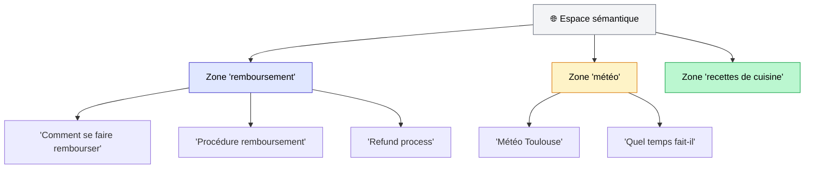
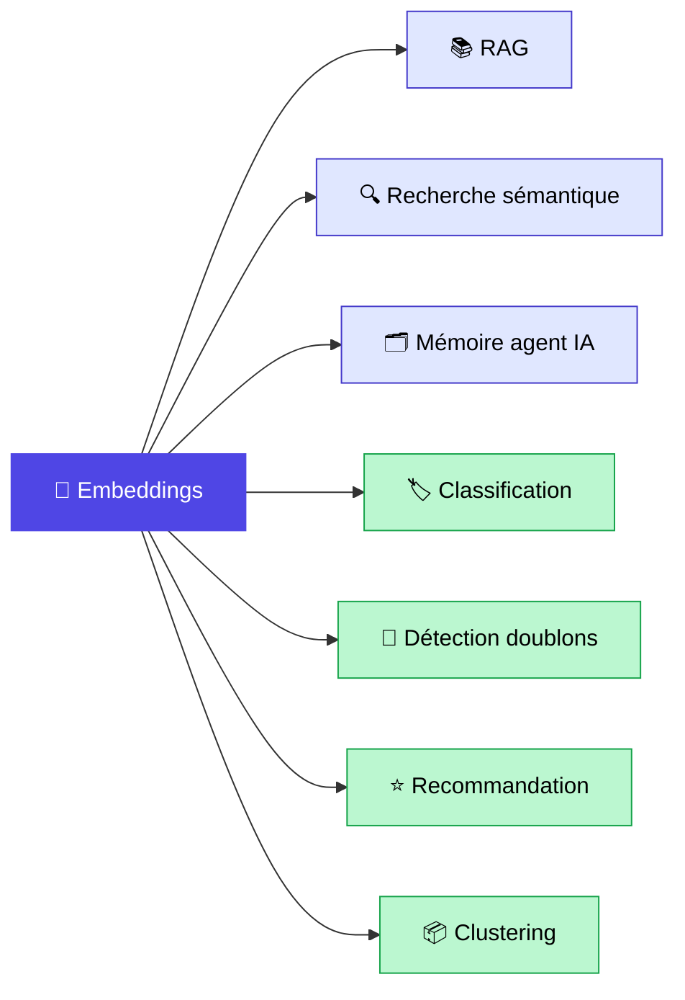

Sans embeddings, pas de ChatGPT qui répond à vos questions sur vos documents. Pas de recherche sémantique qui retrouve un article même quand vous tapez des synonymes. Pas d'agent IA qui se souvient de ce que vous lui avez dit la semaine dernière.

Les embeddings sont la brique de base de toute l'IA moderne. Et pourtant, dans la grande majorité des projets que j'accompagne, c'est la brique la moins bien comprise. On les utilise, souvent sans trop savoir pourquoi, et on s'étonne des résultats décevants.

Dans cet article, je vous explique ce que c'est vraiment, comment ça fonctionne vu de loin, pourquoi c'est aussi important, comment choisir le bon modèle en 2026, et les pièges concrets à éviter. Que vous soyez manager ou développeur, vous devriez repartir avec une compréhension solide du sujet.

<!-- more -->

> Les embeddings sont l'une des 5 briques d'un RAG. Pour le panorama d'ensemble, voir le [guide RAG complet](/rag/).

***

## Sommaire

1. [C'est quoi un embedding, vraiment ?](#cest-quoi-un-embedding-vraiment)
2. [Pourquoi on transforme du texte en nombres ?](#pourquoi-on-transforme-du-texte-en-nombres)
3. [Comment ça fonctionne, vu de loin](#comment-ca-fonctionne-vu-de-loin)
4. [Comment on compare deux embeddings](#comment-on-compare-deux-embeddings)
5. [Pourquoi les embeddings sont la brique de base de toute l'IA moderne](#pourquoi-les-embeddings-sont-la-brique-de-base-de-toute-lia-moderne)
6. [Les grands modèles d'embedding en 2026](#les-grands-modeles-dembedding-en-2026)
7. [Quelques pièges concrets à éviter](#quelques-pieges-concrets-a-eviter)
8. [Quand fine-tuner un modèle d'embedding](#quand-fine-tuner-un-modele-dembedding)
9. [FAQ](#faq)
10. [Pour aller plus loin](#pour-aller-plus-loin)

***

## C'est quoi un embedding, vraiment ?

Un embedding, c'est une **représentation numérique du sens** d'un texte.

Concrètement : vous donnez une phrase à un modèle d'embedding, et il vous retourne un vecteur. Un vecteur, c'est une liste de nombres. Selon le modèle utilisé, ce vecteur peut faire 768, 1024, 1536 ou 3072 nombres.

Ce qui rend les embeddings puissants, c'est que ce vecteur ne capture pas les mots eux-mêmes. Il capture le **sens**. Deux phrases qui parlent de la même chose, même avec des mots complètement différents, donneront des vecteurs proches. Deux phrases qui parlent de sujets différents donneront des vecteurs éloignés.

Prenons trois exemples concrets :

- "Comment se faire rembourser ?" -> vecteur A
- "Procédure de remboursement client" -> vecteur B
- "Quelle est la météo à Toulouse ?" -> vecteur C

Les vecteurs A et B sont **proches** : même sens, mots différents. Le vecteur C est **loin** : sujet sans rapport.



Et pour illustrer la notion de proximité entre vecteurs :



C'est tout. Un embedding, c'est une position dans un espace mathématique où les positions proches signifient des sens proches.

***

## Pourquoi on transforme du texte en nombres ?

Un ordinateur ne comprend pas les mots. Il manipule des nombres. Toujours. Un fichier texte, une image, un son : tout est converti en nombres avant d'être traité.

Mais il y a une subtilité importante. Quand on transforme du texte en nombres "à la old school", on obtient une représentation qui n'a aucune notion de sens. Le mot "chat" et le mot "félin" sont aussi éloignés l'un de l'autre que "chat" et "avion" si on utilise une simple correspondance mot -> identifiant numérique.

C'est exactement le problème des **moteurs de recherche par mots-clés classiques**. Si vous tapez "rembourser" et que le document utilise le mot "restituer", la recherche échoue. Il n'y a pas de correspondance exacte.

Une recherche par embeddings, elle, compare les **vecteurs** : "rembourser" et "restituer" donnent des vecteurs très proches, donc la recherche fonctionne même sans le bon mot-clé. C'est ce qu'on appelle la **recherche sémantique** (ou recherche vectorielle).

| Recherche | Principe | Trouve "restituer" quand on cherche "rembourser" ? |
|---|---|---|
| Mots-clés (BM25) | Correspondance exacte ou approchante | Non |
| Sémantique (embedding) | Comparaison de vecteurs dans l'espace de sens | Oui |
| Hybride | Les deux combinés | Oui, et c'est le meilleur des deux mondes |

La recherche hybride combine justement BM25 et la recherche vectorielle pour tirer profit des deux approches. J'en parle en détail dans mon article sur le [RAG hybride BM25 + vectoriel](rag-hybride-bm25-vectoriel.md).

***

## Comment ça fonctionne, vu de loin

Je ne vais pas vous expliquer en détail comment un réseau de neurones fonctionne en interne. Ce n'est pas l'objectif. Mais voici ce qu'il faut retenir.

Un modèle d'embedding (text-embedding-3-large, BGE-M3, Mistral Embed, etc.) est un **réseau de neurones entraîné sur des milliards de textes**. Pendant cet entraînement, il a appris que certains mots et certaines phrases apparaissent dans des contextes similaires.

"Remboursement", "restitution", "retour produit" : ces mots apparaissent souvent ensemble, dans les mêmes documents, autour des mêmes sujets. Le modèle les a donc rapprochés dans son espace de représentation.

Il ne stocke pas un dictionnaire de synonymes. Il a internalisé une **géométrie du sens** : un espace à plusieurs centaines de dimensions où chaque texte a une position, et où les positions proches correspondent à des sens proches.



Quand vous lui donnez un texte, il calcule sa **position dans cet espace de sens**. C'est votre embedding. Et cette position est stable : le même texte donnera toujours le même vecteur avec le même modèle.

Un détail important : les embeddings ne sont pas propres à une langue. Un bon modèle multilingue (comme BGE-M3) place "remboursement" et "refund" très proches dans l'espace, même si ce sont des langues différentes. C'est ce qui rend la recherche sémantique multilingue possible.

***

## Comment on compare deux embeddings

On a deux vecteurs. Comment savoir s'ils sont proches ou loin ?

La métrique standard dans le domaine des embeddings, c'est la **similarité cosinus**. L'idée intuitive : on mesure l'angle entre deux vecteurs dans l'espace de sens.

- Cosinus = 1 : les deux vecteurs pointent dans la même direction. Sens quasi identique.
- Cosinus = 0 : les deux vecteurs sont perpendiculaires. Sens indépendants.
- Cosinus = -1 : les deux vecteurs pointent en sens opposés. Très rare en pratique pour du texte.

Pour la recherche : plus la similarité cosinus entre la question et un chunk est élevée, plus ce chunk est pertinent à remonter.

Il existe aussi la **distance euclidienne** (la distance en ligne droite entre deux points dans l'espace) et le **produit scalaire** (dot product). La similarité cosinus reste le standard car elle est insensible à la "longueur" du vecteur : deux textes qui parlent du même sujet auront une similarité cosinus élevée même si l'un est une phrase et l'autre un paragraphe.

Voici un exemple Python minimal pour rendre ça concret :

```python
from openai import OpenAI
import numpy as np

client = OpenAI()

def embed(text):
    response = client.embeddings.create(
        model="text-embedding-3-large",
        input=text
    )
    return np.array(response.data[0].embedding)

def cosine_similarity(a, b):
    return np.dot(a, b) / (np.linalg.norm(a) * np.linalg.norm(b))

v1 = embed("Comment se faire rembourser ?")
v2 = embed("Procédure de remboursement client")
v3 = embed("Quelle est la météo à Toulouse ?")

print(cosine_similarity(v1, v2))  # ~0.85 : très proches
print(cosine_similarity(v1, v3))  # ~0.15 : très éloignés
```

Ce code est volontairement simple. En production, vous n'allez pas comparer les vecteurs un par un : vous utilisez une **base de données vectorielle** (Qdrant, Weaviate, Pinecone, FAISS) qui fait cette comparaison de façon très efficace sur des millions de vecteurs en quelques millisecondes.

***

## Pourquoi les embeddings sont la brique de base de toute l'IA moderne

Les embeddings ne servent pas qu'au RAG. En réalité, ils sont à la racine d'un nombre surprenant de systèmes IA. Voici les cas d'usage principaux.

**1. RAG (Retrieval-Augmented Generation)**

C'est l'usage le plus connu. On embed les documents, on stocke les vecteurs dans une base, et quand un utilisateur pose une question, on embed la question et on retrouve les chunks les plus proches sémantiquement. Ces chunks sont ensuite envoyés au LLM pour générer la réponse. Sans embeddings, pas de RAG. J'explique tout le fonctionnement du RAG dans cet article : [c'est quoi le RAG ?](mais-que-es-le-rag.md).

**2. Recherche sémantique**

Moteurs de recherche internes, FAQ assistées, recherche dans une base de connaissances. L'utilisateur cherche "comment annuler ma commande", le système retrouve l'article intitulé "politique de retour et remboursement". Aucune correspondance textuelle, pourtant le bon résultat.

**3. Mémoire long terme des agents IA**

Un agent IA qui doit se souvenir de conversations passées ne peut pas garder tout l'historique dans son contexte. La solution : embedder chaque interaction et la stocker. Quand une nouvelle conversation arrive, on retrouve par similarité les souvenirs pertinents. C'est le principe de la [mémoire long terme des agents IA](memoire-agents-ia-long-terme.md).

**4. Classification**

On calcule l'embedding de chaque email, ticket support, ou feedback client. Puis on applique un algorithme k-NN (k plus proches voisins) : les textes proches d'un exemple "urgent" seront classifiés "urgent". Pas besoin de fine-tuner un modèle entier pour faire de la classification correcte.

**5. Détection de doublons**

Deux descriptions de produits qui parlent du même article mais formulées différemment ? Deux tickets support qui posent la même question ? Une comparaison de similarité cosinus entre leurs embeddings vous le dira en quelques millisecondes.

**6. Recommandation**

"Articles similaires", "produits que vous pourriez aimer" : si vous avez l'embedding de chaque article ou produit, trouver les plus similaires est trivial. C'est une similarité cosinus dans la base vectorielle.

**7. Clustering**

Regrouper des documents, des clients, des feedbacks par thèmes sans avoir à définir les thèmes à l'avance. On embed tout, on applique k-means ou HDBSCAN dans l'espace vectoriel, et des groupes cohérents émergent naturellement.

**8. Détection d'anomalies**

Un document dont l'embedding est très éloigné de tous les autres dans votre base est probablement hors distribution : hors sujet, mal formaté, ou frauduleux. Les embeddings permettent de détecter ça automatiquement.



***

## Les grands modèles d'embedding en 2026

Le marché a beaucoup bougé depuis 2024. L'open source a rattrapé et parfois dépassé les APIs propriétaires sur les benchmarks MTEB. Voici un comparatif honnête de l'état du marché en 2026.

| Modèle | Provider | Dimensions | Multi-langue | Coût | MTEB |
|---|---|---|---|---|---|
| **text-embedding-3-large** | OpenAI | 3072 (réductible) | Bon | ~$0.13/M tokens | ~64.6 |
| **text-embedding-3-small** | OpenAI | 1536 | Bon | ~$0.02/M tokens | Bon |
| **BGE-M3** | BAAI (open source) | 1024 | Excellent (100+ langues) | Gratuit (self-host) | 63.0 |
| **Qwen3-Embedding-8B** | Alibaba (open source) | Variable | Excellent | Gratuit (self-host) | ~70.6 |
| **Mistral Embed** | Mistral | 1024 | Tres bon (fr, en, es...) | ~$0.10/M tokens | Bon |
| **Cohere Embed v3** | Cohere | 1024 | Tres bon | ~$0.10/M tokens | Bon |

Quelques nuances importantes sur ce tableau :

**Le MTEB est un proxy, pas une vérité absolue.** Les scores MTEB mesurent des performances sur des benchmarks généralistes. Sur votre domaine spécifique (jargon médical, terminologie juridique, documentation technique), les résultats peuvent être très différents. Testez toujours sur vos données.

**Qwen3-Embedding-8B** est la surprise open source de 2025-2026. Il dépasse text-embedding-3-large sur MTEB tout en étant gratuit en auto-hébergement. La contrainte : il faut une infrastructure GPU pour le servir. Avec un GPU A100 ou H100, les latences restent tout à fait acceptables en production.

**BGE-M3** reste mon choix favori pour les projets multilingues open source. Un seul modèle produit des vecteurs denses, des vecteurs creux (sparse), et des scores ColBERT, ce qui en fait une brique idéale pour le [RAG hybride](rag-hybride-bm25-vectoriel.md).

**Mes recommandations pratiques selon le contexte :**

- **Démarrer vite en SaaS, projet moyen volume** : text-embedding-3-small. Rapport qualite-prix imbattable, zero infrastructure a gerer.
- **Volume > 10M embeddings/mois ou contrainte de souverainete** : Qwen3-Embedding-8B ou BGE-M3 en self-hosted.
- **Projet multilingue avec jargon metier** : BGE-M3 (dense + sparse dans un seul modele, 100+ langues).
- **Tres bon en francais specifiquement, sans self-hosting** : Mistral Embed.

***

## Quelques pièges concrets à éviter

Ces erreurs, je les vois sur la majorite des projets RAG en debut de mise en oeuvre.

**1. Utiliser des modeles differents pour les documents et les requetes**

C'est l'erreur fatale. Si vous avez indexe vos documents avec BGE-M3 et que vous embeddez les questions avec text-embedding-3-large, vous comparez des choux et des carottes. Les espaces vectoriels sont differents : les distances n'ont aucun sens. Meme modele de A a Z, sans exception.

**2. Changer de modele d'embedding en cours de projet**

Vous avez indexe 500 000 documents avec text-embedding-3-small, et vous voulez passer a Qwen3 parce que les benchmarks sont meilleurs ? Il faut tout re-embedder. Tous vos vecteurs stockes deviennent inutilisables. Choisissez votre modele soigneusement au depart et prevoyez la migration si vous envisagez d'en changer.

**3. Penser que plus de dimensions = meilleures performances**

3072 dimensions ne battent pas systematiquement 1024 dimensions. BGE-M3 en 1024 dimensions surpasse souvent text-embedding-3-large en 3072 sur certains domaines. Ce qui compte, c'est la qualite du modele, pas la taille du vecteur.

**4. Embedder des chunks trop longs**

La plupart des modeles ont une limite de contexte (8192 tokens pour OpenAI, idem pour BGE-M3). Au-dela, le texte est tronque silencieusement, sans erreur, sans avertissement. Vous obtenez un embedding partiel. Sur des chunks de plus de 512 tokens, la qualite de representation commence souvent a degrader.

**5. Embedder du HTML brut**

Les balises `<div>`, `<span>`, `<p>`, les attributs CSS, les scripts JavaScript polluent l'embedding. Nettoyez toujours le texte avant d'embedder : extrayez le texte brut, supprimez la ponctuation inutile, normalisez les espaces. Un bon pre-traitement fait souvent plus de difference qu'un changement de modele.

***

## Quand fine-tuner un modèle d'embedding

Pour 95% des projets, un modele generaliste (text-embedding-3-small, BGE-M3, Qwen3) suffit largement.

Le fine-tuning devient interessant dans un cas precis : **quand votre domaine a un champ lexical tres specifique** que les modeles generalistes n'ont pas vu en quantite suffisante pendant leur entrainement. Jargon medical tres specialise, terminologie industrielle proprietaire, code juridique sectoriel.

Le principe du fine-tuning pour les embeddings est simple : on lui donne des paires (question, bon chunk) et on ajuste le modele pour que la question et le bon chunk se retrouvent proches dans l'espace vectoriel. Avec `sentence-transformers` en Python, quelques centaines de paires bien choisies et quelques heures d'entrainement sur un GPU, on peut gagner +15 a 30% de Hit Rate sur un domaine specifique.

Le ROI depend de votre cas : si votre domaine est suffisamment specifique et que les performances actuelles sont insuffisantes malgre un bon chunking et une bonne architecture, le fine-tuning vaut la peine d'etre evalue. Sinon, concentrez-vous d'abord sur le [chunking optimal](chunking-optimal-rag.md) et l'[optimisation du RAG](optimiser-rag-techniques.md) : ce sont des leviers moins couteux a activer.

***

## FAQ

**C'est quoi un embedding ?**

Un embedding, c'est une representation numerique du sens d'un texte. On transforme une phrase, un paragraphe ou un document en un vecteur (une liste de nombres). Ce vecteur capture le sens du texte, pas les mots eux-memes. Deux textes qui parlent de la meme chose auront des vecteurs proches, meme avec des mots differents.

**A quoi servent les embeddings en IA ?**

Les embeddings sont utilises dans la quasi-totalite des systemes IA modernes : RAG (pour retrouver les bons documents), recherche semantique (pour trouver par le sens et non par le mot exact), memoire d'agents IA, classification de textes, detection de doublons, recommandation, clustering et detection d'anomalies.

**Quelle difference entre embedding et token ?**

Un token est une unite elementaire de texte que le modele traite (environ 3/4 d'un mot en francais). L'embedding est la representation vectorielle d'un texte complet (phrase, chunk, document). Les tokens sont les "atomes" que le modele lit. L'embedding est la "signification" qu'il produit apres avoir lu ces tokens.

**Quel est le meilleur modele d'embedding en 2026 ?**

Ca depend de votre contexte. Sur le benchmark MTEB, Qwen3-Embedding-8B (open source, Alibaba) atteint ~70.6 et surpasse les modeles commerciaux. Pour du SaaS sans infrastructure, text-embedding-3-small (OpenAI, $0.02/M tokens) offre un excellent rapport qualite-prix. Pour du multilingue open source, BGE-M3 reste une reference solide a 63.0 MTEB.

**OpenAI text-embedding-3 ou Mistral Embed ?**

Pour un projet en francais avec des contraintes de souverainete europeenne ou une preference pour des modeles franco-europeens, Mistral Embed est une excellente option. Pour un projet generaliste sans contrainte de souverainete, text-embedding-3-small est plus accessible et tres bien documente. Les performances sont comparables en francais standard.

**Comment comparer deux embeddings ?**

La metrique standard est la similarite cosinus. Elle mesure l'angle entre deux vecteurs dans l'espace de sens. Plus elle est proche de 1, plus les textes sont semantiquement similaires. La distance euclidienne et le produit scalaire existent aussi, mais la similarite cosinus reste le standard car elle est insensible a la "longueur" des vecteurs.

**Combien coute d'embedder 1 million de documents ?**

Avec text-embedding-3-small (OpenAI), l'indexation initiale d'1 million de chunks de ~500 tokens coute environ $10 a $15. Avec text-embedding-3-large, comptez 6 a 7 fois plus. En self-hosted (Qwen3, BGE-M3), le cout marginal par embedding est quasi nul : seul le cout infrastructure (GPU) compte.

**Faut-il fine-tuner un modele d'embedding pour mon metier ?**

Rarement au debut. Pour 95% des projets, un modele generaliste suffit. Le fine-tuning apporte +15 a 30% de Hit Rate sur des domaines avec un jargon tres specifique non represente dans les donnees d'entrainement. Commencez par optimiser le chunking et l'architecture RAG avant d'envisager le fine-tuning.

**Embeddings et RAG : pourquoi c'est lie ?**

Le RAG fonctionne en retrouvant les documents pertinents avant de les envoyer au LLM. Cette recherche de pertinence repose entierement sur la comparaison d'embeddings : on embed la question, on embed les documents, on retrouve les plus proches. Sans embeddings, le RAG ne peut pas fonctionner. Ils sont indissociables.

**Peut-on faire des embeddings sur des images aussi ?**

Oui. Les modeles multimodaux comme CLIP ou Gemini Embedding 2 produisent des embeddings pour des images, des videos, et du texte dans un meme espace vectoriel. Ca permet de faire de la recherche image-par-texte ("trouve moi des photos de chats noirs") ou de retrouver des images similaires. C'est la meme logique, appliquee a des modalites differentes.

***

## Pour aller plus loin

- **[C'est quoi le RAG ?](mais-que-es-le-rag.md)** : la brique au-dessus des embeddings, comment on les utilise pour construire un systeme de Q&R sur vos documents
- **[RAG hybride BM25 + vectoriel](rag-hybride-bm25-vectoriel.md)** : combiner embeddings et mots-cles pour un retrieval plus robuste sur le jargon metier
- **[Chunking optimal pour votre RAG](chunking-optimal-rag.md)** : ce qu'on embed exactement, et pourquoi la facon de decouper les documents change tout
- **[Optimiser son RAG](optimiser-rag-techniques.md)** : les leviers post-embedding pour ameliorer les performances de bout en bout
- **[La memoire d'un agent IA](memoire-agents-ia-long-terme.md)** : comment les embeddings permettent a un agent de se souvenir sur le long terme

***

Si mes articles vous intéressent et que vous avez des questions ou simplement envie de discuter de vos propres défis, n'hésitez pas à m'écrire à [anas@tensoria.fr](mailto:anas@tensoria.fr), j'aime échanger sur ces sujets !

Vous pouvez aussi [réserver un créneau d'échange](https://cal.eu/anas-rabhi/rendez-vous-ianas) ou vous abonner à ma newsletter :)


---

### À propos de moi

Je suis **Anas Rabhi**, consultant Data Scientist freelance. J'accompagne les entreprises dans leur stratégie et mise en œuvre de solutions d'IA (RAG, Agents, NLP).

Découvrez mes services sur [tensoria.fr](https://tensoria.fr) ou testez notre solution d'agents IA [heeya.fr](https://heeya.fr).

<div style="text-align: center; margin: 40px 0; gap: 16px; display: flex; flex-wrap: wrap; justify-content: center;">
  <a href="https://cal.eu/anas-rabhi/rendez-vous-ianas" target="_blank" style="display: inline-block; background-color: #4F46E5; color: #ffffff; font-weight: bold; padding: 16px 32px; text-decoration: none; border-radius: 8px; font-size: 18px; letter-spacing: 0.8px; box-shadow: 0 6px 12px rgba(0, 0, 0, 0.2); transition: all 0.3s ease; border: none;">
    Réserver un créneau
  </a>
  <a href="https://anas-ai.kit.com/d8b1a255cc" target="_blank" style="display: inline-block; background-color: #222222; color: #ffffff; font-weight: bold; padding: 16px 32px; text-decoration: none; border-radius: 8px; font-size: 18px; letter-spacing: 0.8px; box-shadow: 0 6px 12px rgba(0, 0, 0, 0.2); transition: all 0.3s ease; border: none;">
    <span style="margin-right: 10px;">✉️</span> S'abonner à ma newsletter
  </a>
</div>
