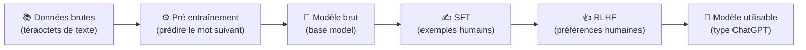
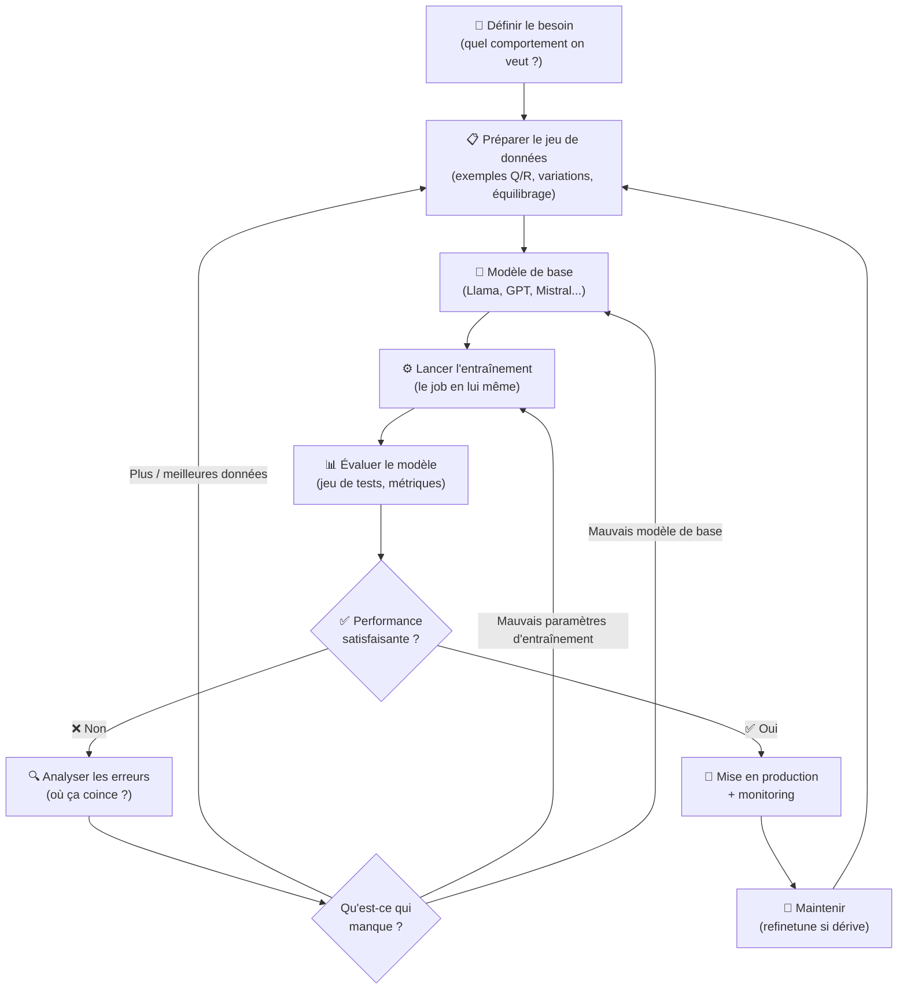
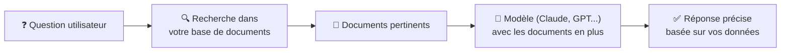
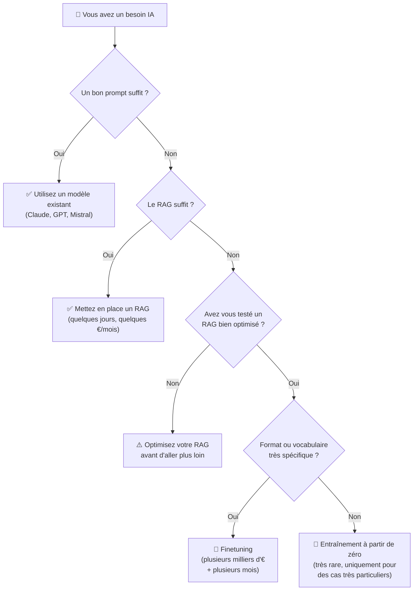

## Introduction

Une question revient souvent quand j'accompagne des entreprises sur leurs projets IA : *« Est-ce qu'on doit entraîner notre propre modèle ? »*. Ou alors la variante un peu plus avancée : *« On veut finetuner un modèle sur nos données »*.

Et à chaque fois, je dois prendre un peu de temps pour expliquer ce que ça veut dire concrètement. Parce que entre entraîner un modèle de zéro, le finetuner sur ses propres données, ou simplement lui donner du contexte avec un [RAG](mais-que-es-le-rag.md), il y a un monde de différence. En coût, en temps, en complexité, et surtout en résultat.

Dans cet article, je vais essayer de poser les choses simplement. C'est quoi un modèle d'IA, comment on l'entraîne, combien ça coûte, à quel moment ça vaut le coup, et surtout pourquoi dans 95% des cas, vous n'avez probablement pas besoin de faire ni l'un ni l'autre.

<!-- more -->

---

## D'abord, c'est quoi un modèle d'IA ?

Avant de parler entraînement, il faut comprendre ce qu'on entraîne.

Un modèle d'IA, c'est avant tout un gros paquet de chiffres qu'on appelle des **paramètres**, reliés entre eux par des opérations mathématiques. J'en parle plus en détail dans mon article sur [l'IA générative](comprendre-l-IA-generative.md), mais pour faire simple : imaginez une énorme table de mixage avec des milliards de boutons. Chaque bouton, c'est un paramètre. Pris seul, un bouton ne veut rien dire. Mais quand tous les boutons sont réglés correctement, l'ensemble est capable de générer du texte cohérent, de reconnaître un chat sur une photo ou de traduire une phrase.

Entraîner un modèle, c'est tourner ces boutons dans le bon sens à partir d'exemples. Plus on a d'exemples et plus on a de puissance de calcul, plus on peut tourner finement les boutons.

Et c'est là un point important : **plus un modèle a de paramètres (de boutons), plus il a de capacité à apprendre des choses subtiles et à donner de bons résultats**. Un modèle avec 1 milliard de paramètres ne pourra jamais retenir autant de nuances qu'un modèle de 100 milliards. C'est ce qui explique pourquoi les gros modèles sont souvent plus performants. Mais cette capacité a un prix : **plus il y a de boutons, plus l'entraînement est long, plus il coûte cher et plus c'est complexe à mettre en œuvre** (besoin de plus de données, plus de GPU, plus de mémoire). C'est tout l'arbitrage du domaine : on cherche en permanence à trouver le bon équilibre entre taille du modèle, qualité des données et coût.

> Pour vous donner un ordre d'idée : GPT 3 a 175 milliards de paramètres. Llama 3 70B en a 70 milliards. Les modèles récents type GPT 4 ou Claude tournent dans les centaines de milliards (les chiffres exacts ne sont pas publics). Chaque paramètre, c'est un petit nombre stocké en mémoire. Les modèles chinois comme Qwen 3.6 sont aux alentours de 27 Milliards (en fonction de la version). On arrive à avoir de meilleurs résultats aujourd'hui avec un modèle de 27 milliards qu'avec un GPT 3 de l'époque à 175 milliards, grâce aux progrès scientifiques et aux connaissances accumulées depuis.

---

## Quels types de modèles on peut entraîner ?

Il n'y a pas un seul type de modèle d'IA. Avant de parler architecture, il faut comprendre une chose : **on choisit toujours un modèle en fonction du format des données qu'on lui donne en entrée et du format de sortie qu'on attend de lui**. C'est ce duo entrée/sortie qui détermine la famille de modèle à utiliser. Du texte qui rentre et du texte qui sort ? Ce sera plutôt un LLM. Une image qui rentre et un label qui sort ? Plutôt un CNN. Un tableau de chiffres qui rentre et une prédiction qui sort ? Plutôt un modèle tabulaire. Un peu comme en construction : on ne bâtit pas une maison de la même façon qu'un hangar, on choisit en fonction de l'usage.

Voici les grandes familles que vous croisez le plus souvent.

| Type de modèle | Pour quoi faire | Exemples |
|---|---|---|
| **LLM** | Générer ou comprendre du texte | GPT (ChatGPT), Claude (Anthropic), Llama (Meta), Mistral, Gemini (Google) |
| **Modèles de diffusion** | Générer des images, des vidéos | Midjourney, Stable Diffusion, Sora (OpenAI), Veo (Google) |
| **CNN (réseaux convolutifs)** | Reconnaître des objets dans des images | YOLO (utilisé en sécurité, voitures autonomes), modèles d'imagerie médicale (radios, IRM) |
| **Modèles audio** | Transcrire ou générer du son | Whisper (OpenAI, transcription), ElevenLabs (voix synthétique), Suno (génération musicale) |
| **Modèles tabulaires (XGBoost, etc.)** | Prédire à partir de données chiffrées | Scoring crédit (utilisé par les banques), prévision de ventes (Carrefour, Amazon), détection de fraude (Stripe) |

Une précision importante sur les **Transformers** : on entend souvent parler de Transformers comme s'il s'agissait d'un type de modèle réservé au texte. C'est faux. Le Transformer, c'est une **architecture mathématique**, pas une catégorie d'usage. Cette architecture a été inventée en 2017 pour le texte, mais elle est aujourd'hui utilisée partout : dans les modèles d'image (les Vision Transformers ou ViT), dans la génération vidéo, dans l'audio (c'est comme ça que Claude ou GPT comprennent maintenant d'autres formats que le texte), et même dans certains modèles de prédiction sur des données scientifiques. Quand vous entendez « Transformer », pensez plutôt « brique technique ultra polyvalente » que « modèle de texte ».

D'ailleurs, **on pourrait techniquement construire un LLM avec une autre architecture que le Transformer**. Avant 2017, on utilisait des LSTM ou des RNN pour le langage. Aujourd'hui, des chercheurs explorent d'autres pistes (Mamba, RWKV, modèles à espace d'état). Mais dans la pratique, quasiment tous les LLM modernes (GPT, Claude, Llama, Mistral, Gemini) reposent sur des Transformers. Pourquoi ? Parce que c'est l'architecture qui a fonctionné le mieux ces dernières années, et que toute la recherche, l'optimisation matérielle, les outils et les bibliothèques se sont concentrés dessus. C'est un cercle vertueux : ça marche bien, donc on creuse, donc ça marche encore mieux. Changer d'architecture aujourd'hui voudrait dire repartir presque de zéro sur tout l'écosystème, et personne n'a vraiment intérêt à le faire tant que les Transformers continuent à progresser.

Chaque famille a ses spécificités d'entraînement. Mais le principe reste le même : on a un modèle vide, on lui donne plein de données, et on ajuste ses paramètres jusqu'à ce qu'il fasse correctement la tâche qu'on attend de lui.

Si vous voulez creuser les différents domaines de l'IA et comprendre dans quel cas utiliser quel type de modèle (avec des exemples concrets en entreprise), j'ai écrit un article dédié : [les différents domaines de l'IA et pourquoi ChatGPT n'est qu'une petite partie](domaines-intelligence-artificielle.md).

---

## Avant d'aller plus loin : il existe plusieurs types d'entraînement

Avant de plonger dans le détail, il faut éclaircir un point qui perd souvent les gens. Quand on parle « d'entraîner » un modèle, ça peut vouloir dire plusieurs choses très différentes. Et c'est important de les distinguer parce qu'elles n'ont ni le même but, ni le même coût, ni la même complexité.

Voici les trois grandes formes d'entraînement que vous croiserez dans cet article :

* **L'entraînement « à partir de zéro »** : on part d'un modèle complètement vide (les paramètres sont des nombres aléatoires) et on lui apprend tout, depuis le début. C'est ce que font OpenAI, Anthropic ou Meta quand ils créent un nouveau modèle. C'est l'approche la plus longue et la plus coûteuse.
* **Le pré entraînement (pretraining)** : c'est la **première phase** de l'entraînement à partir de zéro. On donne au modèle des quantités énormes de données générales pour qu'il apprenne les bases (comment les mots s'enchaînent, comment fonctionne le langage, la logique, etc.).
* **Le post entraînement (post training)** : c'est la **deuxième phase**. Une fois le modèle pré entraîné, on le spécialise pour qu'il devienne réellement utile (suivre des instructions, dialoguer, être utile et sûr). Cette phase regroupe le SFT et le RLHF dont je parle juste après.
* **Le finetuning** : c'est encore autre chose. On part d'un modèle déjà entraîné par quelqu'un d'autre (par exemple Llama ou GPT) et on l'ajuste légèrement sur ses propres données. C'est beaucoup plus rapide et beaucoup moins cher. J'y reviens plus loin dans l'article, c'est probablement le terme qui vous intéresse le plus en pratique.

Pour résumer en une phrase : l'entraînement « à partir de zéro » regroupe le pré entraînement et le post entraînement. Le finetuning, lui, c'est une retouche d'un modèle déjà existant.

Maintenant qu'on a posé ce vocabulaire, on peut entrer dans le détail.

---

## Comment ça marche concrètement, l'entraînement « à partir de zéro » ?

Entraîner un modèle « à partir de zéro », ça veut dire partir d'un modèle vide (les paramètres sont des chiffres aléatoires) et lui apprendre tout, à partir de zéro.

Pour les LLM modernes, on découpe ça en deux grandes étapes : le **pré entraînement** et le **post entraînement**. Pour les autres types de modèles (image, audio, tabulaire), le pipeline est différent, mais l'idée reste la même : on commence par apprendre des choses générales, puis on spécialise.

### 1. Le pré entraînement (pretraining)

C'est l'étape la plus connue, et de très loin la plus coûteuse.

Pour un LLM, on prend des téraoctets de texte issus du web, de livres, de code, d'articles scientifiques. On donne tout ça au modèle et on lui demande, en gros, de **deviner le mot suivant** dans des milliards de phrases. À chaque erreur, le modèle ajuste ses paramètres pour faire un peu mieux la prochaine fois.

Ce processus se répète des billions de fois (oui, billions, pas milliards), pendant des semaines voire des mois, sur des milliers de cartes graphiques GPU haut de gamme.

À la fin, on obtient un modèle qu'on appelle « brut » ou « base ». Il connaît un peu de tout, mais il ne sait pas vraiment dialoguer ni suivre des instructions. Il complète juste du texte de manière statistique.

**Un exemple concret** : Llama 3 70B *base* (la version brute publiée par Meta avant post entraînement) est un modèle brut. Si vous lui écrivez « Comment faire un gâteau au chocolat ? », il ne va pas vous donner une recette comme ChatGPT. Il va plus probablement continuer le texte avec quelque chose comme « Comment faire une tarte au citron ? Comment faire des cookies ? Comment faire... » parce qu'il imite ce qu'il a vu sur le web (souvent des listes de questions FAQ). Il a énormément de connaissances en lui, mais il ne sait pas s'en servir pour vous répondre. Pareil pour GPT 3 à sa sortie en 2020 : très impressionnant pour compléter du texte, mais quasiment inutilisable pour quelqu'un qui veut juste poser une question. C'est ça, un modèle brut. Les modèles récents, les éditeurs ont décidé de ne pas publier la version brute, mais de laisser le public seulement accéder à la version finale.

### 2. Le post entraînement

C'est ce qui transforme un modèle brut en assistant utilisable comme ChatGPT.

Première chose à comprendre : **on ne repart pas de zéro**. On reprend exactement le modèle brut (avec tous ses paramètres déjà ajustés pendant le pré entraînement) et on **continue** de l'entraîner, mais sur des données beaucoup plus ciblées et avec un objectif différent. Concrètement, ce sont les **mêmes boutons** dont on parlait au début, sauf qu'on les retouche légèrement pour que le modèle se comporte différemment.

Pour reprendre l'image de la table de mixage : pendant le pré entraînement, on a tourné des milliards de boutons à fond pour que le modèle apprenne tout du langage. Pendant le post entraînement, on touche aux mêmes boutons mais avec beaucoup plus de finesse, juste pour ajuster son comportement (être poli, suivre des instructions, refuser certaines demandes). On ne casse pas ce qui a été appris avant, on l'oriente.

Cette phase coûte beaucoup moins cher que le pré entraînement (souvent 1 à 10% du coût total) parce qu'elle utilise beaucoup moins de données et tourne sur beaucoup moins de temps. Mais c'est elle qui fait toute la différence entre un modèle inutilisable et un assistant qu'on a envie d'utiliser tous les jours.

Il y a généralement deux phases dans le post entraînement.

**Le fine tuning supervisé (SFT)** : on prend des humains, on leur fait écrire des paires question/réponse de qualité (typiquement quelques dizaines à quelques centaines de milliers d'exemples), et on continue d'entraîner le modèle dessus. Le mécanisme est exactement le même que le pré entraînement (le modèle compare sa réponse à la bonne réponse, ajuste ses paramètres pour faire mieux), sauf que les données sont propres et ciblées. Le but, c'est de lui apprendre à répondre correctement à une instruction plutôt que de juste compléter du texte.

**Le RLHF (Reinforcement Learning from Human Feedback)** : on demande à des humains de comparer plusieurs réponses du modèle et de choisir la meilleure. Ces préférences servent ensuite à ajuster encore les paramètres du modèle (toujours les mêmes boutons), mais cette fois ci pour qu'il pousse vers les réponses jugées « bonnes » et qu'il s'éloigne de celles jugées « mauvaises ». C'est ce qui apprend au modèle à être utile, honnête, et à refuser ce qu'il ne devrait pas faire.

**Un exemple concret** : Llama 3 70B *Instruct* (la version finale, après post entraînement) est exactement le même modèle que le « base », sauf qu'il est passé par le SFT et le RLHF. Maintenant, si vous lui demandez « Comment faire un gâteau au chocolat ? », il vous donne directement une recette structurée, claire, polie. Il refuse aussi de répondre à des demandes problématiques (RLHF lui a appris à dire non sur certains sujets). Le passage de GPT 3 « brut » à ChatGPT en 2022, c'est exactement ça : OpenAI n'a pas créé un nouveau modèle, ils ont juste post entraîné GPT 3.5 avec du SFT et du RLHF. Et c'est ce qui a déclenché toute la hype IA qu'on connaît aujourd'hui. Le modèle savait déjà tout. Le post entraînement lui a juste appris à parler avec nous.

Voici les grandes étapes en schéma :

Pour les modèles d'image type Stable Diffusion, c'est différent : on entraîne sur des paires image/texte pour apprendre à associer une description à une image, puis à générer l'inverse. Pour un modèle de scoring bancaire, on entraîne sur des historiques clients labellisés (c'est à dire que les données sont déjà annotées avec le score de crédit de chaque client). Le principe général reste le même, mais les données et les objectifs changent donc tout naturellement le type de modèle à utiliser change en conséquence.

---

## Combien ça coûte vraiment ?

Et c'est là que ça pique.

Le coût d'un entraînement « à partir de zéro » dépend de la taille du modèle, de la quantité de données et de l'efficacité de l'équipe qui s'en occupe. Voici les chiffres publics ou estimés les plus fiables sur les modèles récents (basés sur des publications, des annonces officielles ou des analyses sérieuses) :

| Modèle | Coût d'entraînement (compute uniquement) | Détails |
|---|---|---|
| **GPT 3** (OpenAI, 2020) | Environ **4,6 millions de dollars** (estimation Lambda Labs) | 175 milliards de paramètres, des milliers de GPU V100 |
| **GPT 4** (OpenAI, 2023) | **Plus de 100 millions de dollars** (confirmé par Sam Altman) | Plusieurs mois de calcul |
| **Gemini Ultra** (Google, 2023) | Environ **200 millions de dollars** (étude Stanford) | Le plus cher publiquement documenté |
| **Llama 3 70B** (Meta, 2024) | Environ **15 millions de dollars** (7,7M GPU heures H100 à ~2 $/h) | Sans compter R et D |
| **Llama 3.1 405B** (Meta, 2024) | Environ **60 millions de dollars** (30,8M GPU heures H100) | Le plus gros modèle open source de Meta |
| **Claude 3.7 Sonnet** (Anthropic, 2025) | « **Quelques dizaines de millions** » (Anthropic) | Beaucoup moins que GPT 4 grâce aux progrès |
| **DeepSeek V3** (2024) | Environ **5,6 millions de dollars** (2,788M GPU heures H800) | 671 milliards de paramètres (MoE), exploit de frugalité |
| **DeepSeek R1** (2025) | **294 000 dollars** (uniquement la phase reasoning) | À ajouter aux ~6 M$ de la base V3 |
| **Qwen 3** (Alibaba, 2025) | Non communiqué | Qwen3-Next aurait coûté **moins de 10%** de la version dense équivalente |
| **Modèle « petit » spécialisé** (1 à 7 milliards de params) | Entre **50 000 et 500 000 €** | Quelques jours à quelques semaines |

Quelques observations importantes en regardant ce tableau :

* **Les coûts ne montent pas mécaniquement avec le temps**. Claude 3.7 Sonnet (2025) coûte beaucoup moins cher à entraîner que GPT 4 (2023), parce que les techniques d'entraînement, l'optimisation matérielle et les architectures se sont énormément améliorées en deux ans. Faire mieux avec moins, c'est devenu la norme.
* **DeepSeek a montré qu'on pouvait construire un modèle de niveau frontière pour environ 6 millions de dollars** (V3 plus R1), contre des centaines de millions chez OpenAI ou Google. Le débat reste vif sur les coûts cachés (ils ne comptent pas les tentatives ratées ni la R et D), mais ça a quand même été un choc dans l'industrie en 2025.
* **Plus on sait faire, moins ça coûte**. La R et D accumulée bénéficie à tout le monde, et les nouveaux entrants (chinois notamment, comme DeepSeek ou Qwen) en profitent énormément.

Et surtout, **ces chiffres ne comptent que le calcul**. Il faut ajouter :

* Les **salaires des chercheurs** (une équipe de 10 à 100 personnes pendant des mois).
* Le coût de **collecte et de nettoyage des données** (souvent sous estimé, parfois plusieurs millions à lui seul).
* Le coût des **annotations humaines** pour le SFT et le RLHF (des centaines de milliers de paires annotées).
* Les **expérimentations ratées** : on ne sort pas un GPT 4 ou un Claude du premier coup. Il y a souvent dix tentatives avortées avant d'obtenir un modèle qui fonctionne.
* L'**achat ou location du matériel** (les clusters de Meta pour Llama 3 valent à eux seuls des centaines de millions de dollars d'infrastructure).

Et c'est exactement là où je veux en venir : **l'IA, c'est de la R et D**. On peut avoir des intuitions, suivre les bonnes pratiques, mais on n'est jamais sûr à 100% que l'entraînement va donner le résultat attendu. C'est pour ça d'ailleurs que tous les LLM ne se valent pas. Google a dépensé environ 200 millions sur Gemini Ultra et se retrouve aujourd'hui souvent derrière Claude ou GPT, alors qu'Anthropic a sorti Claude 3.7 Sonnet pour quelques dizaines de millions seulement. DeepSeek, avec un budget de 6 millions, est arrivé à matcher des modèles à 100 millions. Pourquoi ? Parce que c'est un domaine où l'expertise, les choix d'architecture, la qualité des données et la qualité du post entraînement font énormément de différence. Et personne n'a la recette magique.

---

## Ce qu'il faut faire AVANT d'entraîner un modèle

Avant même de lancer le moindre calcul, il y a une montagne de travail invisible :

1. **Collecte des données** : trouver, acheter ou crawler des données massives, propres et représentatives.
2. **Nettoyage** : retirer les doublons, les contenus toxiques, les données mal formatées. Sur des milliards de documents, ce n'est pas trivial.
3. **Filtrage et déduplication** : si vos données contiennent dix fois le même article Wikipedia, le modèle va le surapprendre.
4. **Tokenisation** : transformer le texte en petits morceaux que le modèle peut digérer.
5. **Choix de l'architecture** : combien de couches, combien de paramètres, quelle taille de contexte.
6. **Mise en place de l'infrastructure** : louer ou acheter des milliers de GPU, gérer la distribution du calcul, gérer les pannes.
7. **Évaluation** : c'est l'étape **la plus importante**, et pourtant souvent la plus négligée. Concrètement, ça veut dire construire un grand jeu de tests (des milliers de questions avec des réponses attendues, des cas pratiques, des scénarios pièges) pour vérifier en continu si le modèle s'améliore vraiment et s'il sera utilisable une fois en production. C'est ce qui permet de répondre à la seule question qui compte : « est-ce que ce modèle est vraiment prêt pour le monde réel ? ». Sans cette mesure rigoureuse, vous pouvez très bien sortir un modèle qui a l'air bon sur quelques exemples mais qui se casse la figure dès qu'un vrai utilisateur s'en sert. C'est exactement ce qui est arrivé à Meta avec ses derniers modèles **Llama 4** : ils ont publié des modèles qui paraissaient performants sur les classements publics, mais qui se sont avérés clairement en dessous de Claude, GPT 4 ou DeepSeek dans la vraie vie. Plusieurs analyses pointent une évaluation interne insuffisante et probablement biaisée (modèles trop ajustés sur les classements eux-mêmes plutôt que sur des cas d'usage réels). Résultat : malgré des centaines de millions de dollars investis et une équipe énorme, leurs modèles n'ont pas été adoptés par la communauté, et Meta s'est retrouvé décroché par rapport à ses concurrents. Ça illustre parfaitement à quel point cette étape est critique : vous pouvez avoir tous les moyens du monde, si votre évaluation est mal faite, vous sortez un modèle qui ne sert à personne.

Bref, c'est un projet d'au moins 6 à 18 mois pour un modèle ambitieux, avec une équipe entière dédiée.

Le sujet de l'évaluation n'est d'ailleurs pas réservé aux gros entraînements de LLM. Pour un RAG en entreprise, c'est exactement la même rigueur qu'il faut appliquer, à plus petite échelle. J'ai dédié un article complet à [comment évaluer un RAG en production avec RAGAS](evaluer-rag-production-metriques-ragas.md), parce que c'est le sujet n°1 sur lequel les boîtes coincent après leur POC.

---

## Donc... pourquoi on ne fait pas ça ?

Vous l'avez compris : c'est cher, c'est long, c'est risqué, et c'est complexe.

Pour 99,9% des entreprises, entraîner un LLM à partir de zéro n'a aucun sens à l'heure actuelle. Les seuls acteurs qui le font sont OpenAI, Anthropic, Google, Meta, Mistral, et quelques laboratoires de recherche. Tous les autres utilisent leurs modèles via une API ou en open source.

La bonne nouvelle, c'est qu'il existe une alternative beaucoup plus accessible : le **fine tuning**.

---

## Le finetuning : entraîner un modèle déjà entraîné

Le finetuning, c'est partir d'un modèle déjà pré entraîné (par exemple Llama 3, Mistral ou GPT 4 via leur plateforme restreinte de finetuning) et l'ajuster sur **vos** données spécifiques. C'est comme prendre un employé qui sait déjà parler, lire, écrire, et lui apprendre uniquement le vocabulaire de votre métier.

Concrètement, on prend le modèle existant, on lui montre quelques milliers (parfois quelques centaines) d'exemples question/réponse propres à votre domaine, et on ajuste légèrement ses paramètres pour qu'il devienne meilleur sur ces tâches précises.

Côté **coût pur de calcul**, c'est sans commune mesure avec un entraînement complet :

| Type de finetuning | Coût infrastructure | Durée de l'entraînement |
|---|---|---|
| Finetuning d'un petit modèle open source (7B params) | Entre **50 et 500 €** | Quelques heures |
| Finetuning d'un modèle moyen (13B à 70B) | Entre **500 et 5 000 €** | Quelques heures à quelques jours |
| Finetuning via API OpenAI (GPT 4o mini) | Quelques **dizaines à centaines d'euros** | Quelques heures |

Côté calcul brut, c'est mille à dix mille fois moins cher qu'un entraînement complet. **Mais attention : ces chiffres ne reflètent qu'une petite partie du coût réel d'un projet de finetuning.** En pratique, ce qui coûte vraiment cher, ce n'est pas de lancer le finetuning, c'est tout ce qu'il y a autour.

Voici ce qui n'est PAS dans le tableau ci dessus et qui pèse souvent **bien plus lourd** :

* **La construction du jeu de données** : il vous faut typiquement entre quelques centaines et plusieurs milliers de paires question/réponse de très bonne qualité, parfaitement représentatives de votre cas d'usage. C'est l'étape la plus longue, la plus pénible et la plus déterminante. Compter facilement **plusieurs semaines de travail** pour une équipe métier (rédiger les exemples, valider les réponses, gérer les cas limites). Et surtout, **il faut beaucoup de variations de la même chose** pour que le modèle capture vraiment le motif. Si vous voulez lui apprendre à reformuler un mail commercial dans votre style, ça ne suffit pas d'avoir 50 exemples : il vous faut **50 variantes du même type de mail** (avec différentes longueurs, différents tons, différents contextes), 50 d'un autre type, 50 d'un troisième, etc. Sans cette diversité, le modèle apprend par cœur au lieu de comprendre la logique. Et si votre cas est **rare ou totalement absent du modèle de base** (un vocabulaire métier ultra spécifique, un domaine de niche que personne n'a jamais publié sur le web), il vous faudra **encore beaucoup plus de données**, parfois dix fois plus, pour compenser le fait que le modèle part de zéro sur ce sujet.
* **Le temps des experts métier** : un finetuning juridique, médical ou technique demande des experts qui rédigent, relisent et corrigent les exemples. À 500 à 1500 € la journée d'expert, le coût caché monte vite.
* **Les itérations** : on ne réussit jamais un finetuning du premier coup. Il faut souvent **5 à 10 itérations** (ajout d'exemples, nettoyage, équilibrage des catégories, ajustement des paramètres d'entraînement) avant d'obtenir un modèle satisfaisant.
* **L'évaluation** : il faut aussi construire un jeu de tests fiable pour vérifier si le finetuning améliore vraiment les choses, et le maintenir au fil du temps.
* **Le risque que ça ne marche pas** : c'est le point le plus important. Comme tout projet d'IA, c'est de la R et D. Vous pouvez investir 3 mois et 20 000 € dans un finetuning et vous retrouver avec un modèle qui performe **moins bien** que le modèle de base avec un bon prompt. Ce n'est pas hypothétique, je l'ai vu plusieurs fois en mission. Et dans ce cas, vous ne récupérez ni l'argent, ni le temps.
* **Le coût de maintenance** : un modèle finetuné sur les données d'aujourd'hui devient obsolète quand vos données évoluent. Il faudra refinetuner régulièrement, ce qui veut dire reconstruire et maintenir le jeu de données dans la durée.

Donc quand on regarde le **coût total réaliste** d'un projet de finetuning sérieux en entreprise, on est plutôt sur **10 000 à 80 000 €** au global (humains + données + itérations + évaluation), et plusieurs mois de projet. Très loin des « 500 € en quelques heures » que laisse penser le tableau de calcul brut.

Et niveau performance, soyons honnêtes : **un finetuning bien fait apporte typiquement entre 5% et 20% de gain** par rapport au même modèle utilisé avec un bon prompt et un RAG. Sur des cas vraiment spécifiques (style d'écriture précis, classification métier pointue, format de sortie strict), on peut monter jusqu'à 25 voire 30% de gain. Mais dans la grande majorité des cas pros que je vois, le gain réel est plus proche des **5 à 10%**. Ce qui pose la vraie question : ce gain de 10% justifie-t-il les 30 000 € et les 3 mois investis ? Souvent la réponse est non. Parfois la réponse est oui. C'est exactement pour ça qu'il faut mesurer **avant** de se lancer.

Et il y a un dernier argument qui démotive (à raison) beaucoup d'entreprises de se lancer dans un finetuning : **on n'a pas encore atteint le plateau de performance des LLM**. Les modèles continuent de progresser à un rythme impressionnant tous les six mois. Donc le risque très concret, c'est de passer **3 mois et 30 000 € à finetuner pour gagner 10% sur votre cas**, et de voir la prochaine version de Claude, GPT ou Gemini sortir entre temps et vous donner le même résultat (voire meilleur) **gratuitement, juste avec un bon prompt**. J'ai vu plusieurs projets de finetuning devenir totalement inutiles du jour au lendemain à cause d'une nouvelle sortie. Tant que la courbe de progression des modèles de base monte aussi vite, **investir lourdement dans du finetuning, c'est souvent miser contre la marée**.

C'est pour ça que je dis souvent : **avant de finetuner, posez vous deux fois la question**. Est-ce qu'un bon prompt suffit ? Est-ce qu'un RAG bien construit suffit ? Si vous n'avez pas testé sérieusement ces deux options avec un jeu d'évaluation propre, vous n'êtes pas prêt à finetuner.

Voici à quoi ressemble vraiment un projet de finetuning (et c'est exactement le même schéma pour un entraînement à partir de zéro, juste à plus grande échelle) :

Le point clé à retenir : **ce n'est jamais linéaire**. C'est une boucle. Chaque évaluation peut renvoyer à la case « préparer les données » (souvent), à la case « ajuster les paramètres d'entraînement » (parfois), ou à la case « changer de modèle de base » (rarement, mais ça arrive). Et même une fois en production, ce n'est pas fini : il faut surveiller, et refinetuner quand les données ou les besoins évoluent. C'est exactement la même logique qu'un entraînement à partir de zéro, juste avec des montants et des durées multipliés par cent ou par mille.

---

## Quand est-ce que vous n'avez VRAIMENT pas le choix ?

Il existe quelques rares situations où entraîner un modèle à partir de zéro est justifié :

* Vous travaillez sur un **type de données très spécifique** que les modèles publics n'ont jamais vu (par exemple des séquences ADN, des signaux radio bruts, des images médicales très spécialisées).
* Vous avez des **contraintes réglementaires extrêmes** qui vous interdisent d'utiliser un modèle externe (certains contextes de défense ou de santé).
* Vous êtes un **laboratoire de recherche** et vous voulez explorer une nouvelle architecture.
* Vous avez **les moyens financiers et humains** d'une entreprise type Mistral ou Anthropic.

Si vous ne rentrez dans aucune de ces cases, vous n'avez pas besoin d'entraîner de modèle. Et même quand vous pensez en avoir besoin, posez vous la question deux fois.

---

## L'alternative qui marche dans 90% des cas : le RAG

Avant de finetuner, il y a presque toujours une approche beaucoup plus simple, beaucoup moins risquée et beaucoup moins chère : **donner directement vos documents au modèle au moment où il répond**. C'est ce qu'on appelle le [RAG](mais-que-es-le-rag.md).

L'idée est très simple. Plutôt que d'essayer de modifier le modèle (donc ses paramètres) pour qu'il « apprenne » vos données (ce que fait le finetuning), vous **gardez le modèle tel quel**, et vous lui glissez les bons documents dans la conversation au moment où il en a besoin. Concrètement, vous mettez tous vos documents (procédures, contrats, fiches produit, manuels) dans une base. Quand un utilisateur pose une question, votre système va chercher automatiquement les morceaux les plus pertinents dans cette base et les transmet au modèle, qui s'en sert pour rédiger sa réponse.

Le modèle reste le même, intact. Vous n'avez rien entraîné. Et pourtant, il répond comme s'il connaissait votre métier sur le bout des doigts.

Et c'est là toute la différence avec le finetuning. **Avec le RAG, vous n'avez pas à passer par toutes les étapes longues, lourdes et risquées du finetuning** :

* **Pas besoin de construire un jeu de données d'apprentissage** : vous n'avez pas à rédiger des milliers de paires question/réponse propres avec des variantes, de l'équilibrage et des cas limites. Vous prenez vos documents existants tels quels, vous les mettez dans une base, et c'est parti.
* **Pas besoin d'attendre des heures ou des jours de calcul** sur des GPU coûteux. Vous mettez votre RAG en place en quelques jours, et chaque ajustement se voit dans la minute.
* **Pas besoin de mobiliser une équipe d'experts métier pendant des semaines** pour annoter des exemples. Vos documents sont déjà là, déjà rédigés par vos équipes au fil du temps.
* **Pas besoin d'embaucher des profils techniques très pointus** (data scientists spécialisés en entraînement de modèles, ingénieurs ML). Une équipe de développeurs classique peut construire un RAG.
* **Pas de phase d'évaluation lourde et longue** avant la mise en production : vous voyez très vite si la réponse est bonne, et si elle ne l'est pas, vous ajustez la base ou la recherche, pas le modèle.
* **Pas de risque que tout votre travail tombe à l'eau** à la prochaine sortie d'un nouveau modèle. Au contraire, le jour où Claude 5 ou GPT 6 sort, vous changez juste le modèle dans votre RAG et vous bénéficiez immédiatement des progrès, sans avoir rien à refaire.

Bref, c'est l'inverse du finetuning sur quasiment tous les plans : **rapide, peu coûteux, peu risqué, facile à maintenir, et compatible avec l'évolution naturelle des modèles**.

Les autres avantages :

* **Mise à jour en temps réel** : si un document change, vous le remplacez dans la base, c'est tout. Pas besoin de tout recommencer.
* **Coût qui démarre à quelques dizaines d'euros par mois** pour des volumes raisonnables.
* **Traçabilité** : le modèle peut citer ses sources, vous savez d'où vient l'information.
* **Pas de risque d'inventions supplémentaires** comme avec le finetuning (un modèle finetuné peut perdre des capacités générales en se spécialisant).
* **Itérations rapides** : vous testez, vous ajustez, vous voyez le résultat le jour même.

Le seul vrai inconvénient, c'est que ça demande de bien construire son système de récupération de documents. J'en parle en détail dans mes articles sur [le découpage optimal des documents](chunking-optimal-rag.md) et sur [les techniques pour améliorer un RAG](optimiser-rag-techniques.md).

---

## Du coup, le finetuning, vous en avez vraiment besoin ?

C'est LA question à se poser **avant** de se lancer. Et dans 90% des cas que je vois en entreprise, la réponse honnête est : non, pas vraiment. Le RAG suffirait.

Le finetuning ne devient une bonne idée que dans des cas bien précis :

* Vous avez besoin d'un **format de réponse très strict** que le modèle de base n'arrive pas à respecter, même avec un prompt très bien écrit et un RAG en place. Par exemple un format de sortie ultra rigide pour un système qui se branche derrière, sans aucune liberté possible.
* Vous travaillez avec un **vocabulaire métier ultra spécifique** que les modèles publics ne maîtrisent pas du tout (jurisprudence très pointue, terminologie médicale spécialisée, jargon technique d'un secteur de niche).
* Vous voulez **faire baisser le coût d'utilisation** en remplaçant un gros modèle généraliste par un [petit modèle de langage (SLM)](c-est-quoi-un-slm.md) finetuné, qui coûte beaucoup moins cher à faire tourner mais qui reste aussi bon sur votre cas précis.
* Vous voulez apprendre un **comportement très particulier** au modèle (un style d'écriture précis, une façon spécifique de classer des documents, un ton de marque très marqué).

Hors de ces cas, le finetuning est presque toujours un mauvais investissement. Pourquoi tant de gens en parlent quand même ? Parce que ça fait sérieux, parce que ça donne l'impression de « vraiment faire de l'IA », et parce que beaucoup de prestataires le vendent comme une solution magique. La réalité, c'est que **donner les bons documents au modèle au bon moment** (le RAG) résout la grande majorité des besoins, sans tous les inconvénients du finetuning (coût, temps, risque, maintenance, obsolescence à la prochaine sortie).

---

## La règle d'or : entraîner et finetuner uniquement en dernier recours

Si je devais résumer en une seule phrase :

> **Avant de penser à finetuner ou à entraîner, essayez toujours de donner les bonnes informations au modèle au moment où il répond.**

Concrètement, voici l'ordre dans lequel je conseille de réfléchir sur un projet IA :

Pourquoi cet ordre ?

1. **Un bon prompt** résout déjà environ 70% des cas. Avant de toucher quoi que ce soit, soignez vos consignes et testez plusieurs modèles.
2. **Le RAG** résout les 25% suivants. Dès que vous avez besoin que le modèle s'appuie sur des connaissances précises (vos procédures, vos contrats, votre catalogue produit), c'est la bonne réponse.
3. **Le finetuning** ne devient pertinent que dans les 4% restants, quand vous avez vraiment un besoin de comportement très spécifique que ni le prompt ni les documents en contexte n'arrivent à couvrir.
4. **L'entraînement à partir de zéro**, c'est les 0,1% qui restent. Et si vous êtes dans ce cas, vous le savez déjà.

---

## Pourquoi cette discipline est importante

Je le rappelle souvent à mes clients : **l'IA, c'est de la R et D**.

Quand vous entraînez ou finetunez un modèle, vous faites un pari. Vous investissez de l'argent et du temps sans aucune garantie de résultat. Parfois ça marche, parfois ça ne marche pas. Personne ne peut vous garantir à l'avance qu'un finetuning améliorera vraiment les performances sur votre cas. C'est exactement pour cette raison que les LLM publics n'ont pas tous le même niveau : Anthropic, OpenAI, Google et Meta utilisent globalement les mêmes briques techniques, ils ont des données et des moyens comparables, et pourtant les résultats varient énormément. Parce qu'à chaque étape de l'entraînement, il y a des centaines de petits choix, et chacun peut faire basculer la qualité finale.

À votre échelle, c'est exactement pareil. Vous pouvez investir 10 000 € dans un finetuning et vous retrouver avec un modèle moins bon que le modèle de base utilisé avec un bon prompt. Ce n'est pas un cas d'école, je l'ai vu plusieurs fois sur le terrain.

C'est pour ça qu'avant de vous lancer, il faut **mesurer**. Construire un petit jeu de tests, mesurer la performance de la solution la plus simple (un bon prompt seul), puis tester la couche suivante (le RAG), et voir s'il reste vraiment un écart qui justifie d'aller plus loin. J'en parle dans mon article sur [comment améliorer un RAG](comment-ameliorer-l-IA.md).

---

## En résumé

Voici le tableau récap à garder en tête :

| Approche | Coût | Temps | Quand l'utiliser |
|---|---|---|---|
| **Bon prompt** | Quasi nul | Quelques heures | Toujours commencer ici |
| **RAG** | Quelques dizaines à centaines d'€/mois | Quelques jours à semaines | Besoin de connaissances spécifiques (vos documents, vos procédures) |
| **Finetuning** | 10 000 à 80 000 € en coût total réaliste | Plusieurs semaines à plusieurs mois | Format ou vocabulaire très spécifique que le RAG ne couvre pas |
| **Entraînement à partir de zéro** | Plusieurs centaines de milliers à plusieurs millions d'€ | Plusieurs mois | Cas extrêmement rares (recherche, données vraiment uniques) |

La meilleure stratégie en IA, ce n'est presque jamais la plus complexe. C'est de commencer par le plus simple, de bien mesurer, et de monter en complexité uniquement si c'est nécessaire.

Et surtout, gardez en tête que tout ça reste de la R et D. Même les plus gros labos du monde se trompent. Donc si vous y allez par étapes et que vous mesurez, vous éviterez de cramer un budget important sur une approche qui ne fonctionnera pas.

---

## Le choix pragmatique : commencez toujours par le RAG

Si vous ne deviez retenir qu'une seule chose de cet article, c'est celle ci : **commencez toujours par le RAG**.

Pourquoi ? Parce que c'est tout simplement le choix le plus rationnel d'un point de vue économique et technique :

* **L'investissement de départ est minime** par rapport à un finetuning ou un entraînement (quelques jours de mise en place, quelques dizaines d'euros par mois).
* **Vous voyez très vite si ça suffit pour votre cas**. Si oui, vous avez résolu votre problème avec une fraction du budget. Si non, vous avez quand même appris énormément de choses (sur vos données, sur les besoins réels des utilisateurs, sur les vraies limites du modèle de base) qui vont vous servir directement pour la suite.
* **Si jamais vous avez besoin de basculer vers du finetuning ensuite**, le RAG que vous avez construit ne sera pas perdu. Au contraire, il vous servira de socle. Les jeux de tests, les exemples remontés par les utilisateurs, la structuration de vos données, tout ça est réutilisable directement pour préparer un finetuning intelligent.
* **Et le coût initial du RAG sera totalement noyé dans la suite du projet**. Quelques milliers d'euros sur un RAG qui se révèle insuffisant, puis 30 000 € sur un finetuning, ça reste largement plus rentable que d'avoir tapé 30 000 € directement dans un finetuning qui s'avère mal calibré parce qu'on n'avait pas pris le temps de comprendre le besoin.

C'est un peu comme construire une maison : on ne commande pas la décoration sur mesure avant d'avoir vérifié que les murs tiennent. Vous testez d'abord avec ce qui est le plus rapide à monter, vous mesurez ce qui marche et ce qui coince, et **uniquement si vous avez identifié un manque précis et reproductible**, vous investissez dans la couche suivante.

Dans le pire des cas, si vous finissez quand même par finetuner, vous l'aurez fait avec une bien meilleure compréhension du problème et donc avec beaucoup plus de chances de réussir. Dans le meilleur des cas, vous économisez des dizaines de milliers d'euros et plusieurs mois de projet. Honnêtement, je ne vois aucune raison rationnelle de ne pas commencer par là.

---

## Pour aller plus loin

* **[Les différents domaines de l'IA](domaines-intelligence-artificielle.md)** : pour situer le finetuning et les LLM dans la grande famille des IA
* **[C'est quoi le RAG ?](mais-que-es-le-rag.md)** : comprendre l'alternative la plus efficace au finetuning
* **[Comprendre l'IA générative](comprendre-l-IA-generative.md)** : comment fonctionnent vraiment les LLM
* **[Comment améliorer un RAG](comment-ameliorer-l-IA.md)** : la méthode pour mesurer et progresser
* **[Le RAG est-il fini ?](le-rag-est-fini.md)** : le débat long context vs RAG
* **[Mais c'est quoi un agent IA ?](c-est-quoi-un-agent-ia.md)** : l'étape qui vient souvent après le RAG
* **[C'est quoi un SLM (Small Language Model) ?](c-est-quoi-un-slm.md)** : quand un petit modèle spécialisé suffit et coûte bien moins cher qu'un finetuning lourd
* **[SLM vs LLM : quand choisir un petit modèle ?](slm-vs-llm-quand-choisir.md)** : la grille de décision chiffrée entre petit modèle finetuné et gros modèle généraliste
* **[AI engineer : le nouveau rôle du data scientist](ai-engineer-nouveau-role-data-scientist-ia-generative.md)** : pourquoi on intègre des modèles existants plutôt que de les entraîner

---

Si mes articles vous intéressent et que vous avez des questions ou simplement envie de discuter de vos propres défis, n'hésitez pas à m'écrire à [anas@tensoria.fr](mailto:anas@tensoria.fr), j'aime échanger sur ces sujets !

Vous pouvez aussi [réserver un créneau d'échange](https://cal.eu/anas-rabhi/rendez-vous-ianas) ou vous abonner à ma newsletter :)

---

### À propos de moi

Je suis **Anas Rabhi**, consultant Data Scientist freelance. J'accompagne les entreprises dans leur stratégie et mise en œuvre de solutions d'IA (RAG, Agents, NLP).

Découvrez mes services sur [tensoria.fr](https://tensoria.fr) ou testez notre solution d'agents IA [heeya.fr](https://heeya.fr).

  <a href="https://cal.eu/anas-rabhi/rendez-vous-ianas" target="_blank" style="display: inline-block; background-color: #4F46E5; color: #ffffff; font-weight: bold; padding: 16px 32px; text-decoration: none; border-radius: 8px; font-size: 18px; letter-spacing: 0.8px; box-shadow: 0 6px 12px rgba(0, 0, 0, 0.2); transition: all 0.3s ease; border: none;">
    Réserver un créneau
  </a>
  <a href="https://anas-ai.kit.com/d8b1a255cc" target="_blank" style="display: inline-block; background-color: #222222; color: #ffffff; font-weight: bold; padding: 16px 32px; text-decoration: none; border-radius: 8px; font-size: 18px; letter-spacing: 0.8px; box-shadow: 0 6px 12px rgba(0, 0, 0, 0.2); transition: all 0.3s ease; border: none;">
    ✉️ S'abonner à ma newsletter
  </a>

## FAQ : Entraînement, finetuning et RAG

**1. Quelle est la différence entre entraîner un modèle et le finetuner ?**
Entraîner un modèle « à partir de zéro », c'est partir d'un modèle vide et lui apprendre tout depuis zéro. Cela demande des téraoctets de données, des milliers de GPU et coûte plusieurs millions de dollars. Le finetuning, c'est partir d'un modèle déjà entraîné (comme Llama ou GPT) et l'ajuster sur vos données spécifiques. C'est mille à dix mille fois moins cher.

**2. Combien coûte vraiment l'entraînement d'un LLM ?**
Pour donner des ordres de grandeur : GPT 3 a coûté environ 4 millions de dollars à entraîner, GPT 4 entre 60 et 100 millions, Llama 3 70B entre 30 et 50 millions. Et ces chiffres ne comptent que la puissance de calcul, sans les salaires des chercheurs ni les expérimentations ratées.

**3. Quand est-ce qu'on doit finetuner plutôt qu'utiliser un RAG ?**
Le finetuning n'est pertinent que quand vous avez besoin d'un format de réponse très précis, d'un vocabulaire métier ultra spécifique non couvert par les modèles publics, ou quand vous voulez utiliser un petit modèle finetuné pour réduire les coûts d'inférence. Dans 90% des cas pros, un RAG bien construit donne de meilleurs résultats à un coût bien inférieur.

**4. Pourquoi tous les LLM n'ont pas la même performance s'ils utilisent les mêmes techniques ?**
Parce que l'IA, c'est de la R et D. À chaque étape (architecture, données, post entraînement), il y a des centaines de choix techniques qui peuvent faire basculer la performance. C'est pour ça que Claude, GPT et Gemini, qui ont des moyens comparables, n'obtiennent pas les mêmes résultats. Personne n'a la recette magique.

**5. Est-ce que le RAG va finir par remplacer le finetuning ?**
Pour la majorité des cas d'usage en entreprise, oui. Avec l'augmentation des fenêtres de contexte des modèles et l'amélioration des techniques de retrieval, le RAG couvre de plus en plus de besoins sans nécessiter d'entraînement. Le finetuning garde une vraie utilité pour des cas spécifiques, mais il reste rarement la première option à essayer.
