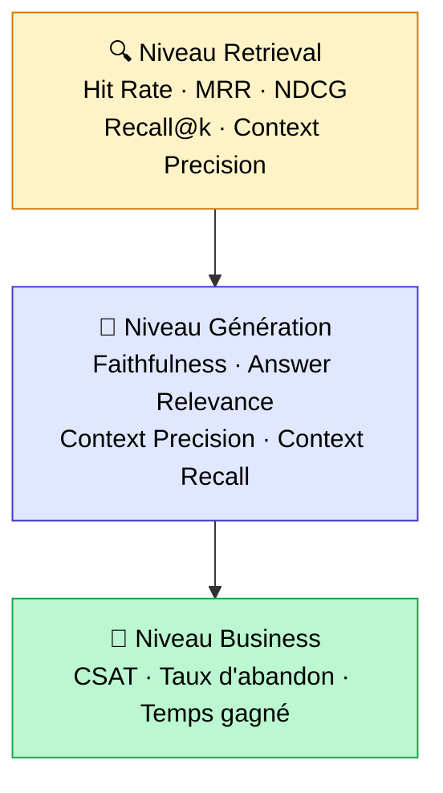
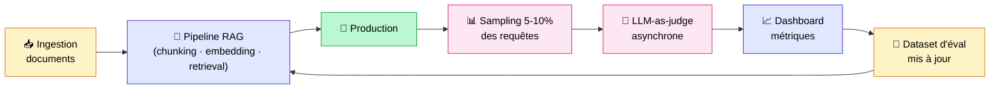

## 80% des RAG que j'audite n'ont pas de système d'évaluation

C'est un chiffre que j'aurais aimé pouvoir citer avec une source académique. Mais il vient directement du terrain : sur les projets RAG en production que j'ai eu à auditer ces deux dernières années, environ 8 sur 10 n'ont aucun système d'évaluation structuré en place.

Le scénario est toujours le même. Le projet a été livré. L'équipe a "vérifié à la main" sur 10 ou 15 questions pendant la recette. Les retours utilisateurs semblent corrects. Et plus personne ne mesure rien.

Le coût caché de cette absence est massif. Vous ne savez pas si le RAG dérive après une mise à jour des documents. Vous ne savez pas si un changement de modèle d'embeddings a cassé quelque chose. Vous ne savez pas si les améliorations que vous apportez apportent vraiment un gain, ou si elles compensent juste une régression ailleurs. Vous optimisez à l'aveugle.

C'est le sujet numéro un qui sépare un RAG POC d'un RAG production mature. Un POC, ça "marche". Un système production, ça se mesure, ça se surveille, et ça s'améliore de façon contrôlée. Cet article couvre les métriques RAG qui comptent, les frameworks d'évaluation (RAGAS, DeepEval, TruLens), comment construire un dataset d'évaluation solide, et comment mettre en place une évaluation continue en production.

<!-- more -->

> L'évaluation est la 5ᵉ brique d'un RAG en production. Pour l'ensemble du pipeline, voir le [guide RAG complet](/rag/).

***

## Pourquoi 80% des RAG en prod ne sont jamais vraiment évalués

### Le piège du "ça a l'air de marcher"

C'est le biais de confirmation appliqué au RAG. Pendant la recette, on pose les questions qu'on connaît. Le système répond correctement. On est rassuré. On livre.

Le problème, c'est que les vraies questions des utilisateurs en production sont toujours différentes de celles qu'on a testées. Plus courtes, plus ambiguës, avec des fautes d'orthographe, des références implicites à des documents que le système ne connaît pas encore. Et là, personne ne regarde.

### Les 4 raisons que je vois sur le terrain

**1. Pas de dataset de référence.** Construire un jeu de questions-réponses de référence demande du temps et de l'expertise métier. Dans la précipitation d'une livraison, c'est ce qui saute en premier.

**2. Pas le temps.** "On verra après le déploiement." Sauf qu'après le déploiement, il y a d'autres priorités, et le système d'évaluation ne sera jamais mis en place.

**3. Méconnaissance des frameworks.** RAGAS, DeepEval, TruLens : ces outils existent et sont matures, mais ils restent peu connus des équipes qui ne font pas de RAG en continu.

**4. Peur du résultat.** Ce n'est pas dit explicitement, mais je l'ai senti sur plusieurs projets. Si on mesure et que les scores sont mauvais, il faut en parler au client. Si on ne mesure pas, on peut rester dans le flou confortable.

### L'effet boule de neige

Sans évaluation, il est impossible d'améliorer quoi que ce soit de façon rationnelle. Vous changez le prompt, vous changez le modèle d'embeddings, vous retouchez le chunking. Mais comment savoir si c'est mieux ? Vous retestez à la main sur 5 questions. Ce n'est pas de l'optimisation, c'est du tâtonnement.

Comme je l'explique dans [l'article sur les 8 techniques d'optimisation RAG](optimiser-rag-techniques.md), Jason Liu a une formulation que je trouve juste : atteindre 97% de recall en retrieval avant de toucher à quoi que ce soit d'autre. Pour savoir où vous en êtes par rapport à cette cible, il faut mesurer. Sans mesure, cette phrase ne veut rien dire concrètement.

***

## Les 3 niveaux d'évaluation à connaître

L'évaluation d'un RAG n'est pas monolithique. Il y a trois couches distinctes, et chacune répond à une question différente.

| Niveau | Question centrale | Métriques clés | Frameworks |
|---|---|---|---|
| Retrieval | Le bon chunk est-il récupéré ? | Hit Rate @k, MRR, NDCG @k, Recall @k | RAGAS, BEIR, custom |
| Génération | La réponse est-elle correcte et fondée ? | Faithfulness, Answer Relevance, Context Precision, Context Recall | RAGAS, DeepEval, TruLens |
| Business | L'utilisateur est-il vraiment satisfait ? | CSAT, taux d'abandon, taux d'escalade, temps gagné | Analytics produit |

Ces trois niveaux forment une pyramide : le retrieval est la fondation, la génération s'appuie dessus, et les métriques business reflètent l'impact réel.



**L'erreur classique** : évaluer la génération sans évaluer le retrieval. Si le bon chunk n'est pas récupéré, le LLM ne peut pas construire une bonne réponse. Un score de faithfulness élevé sur un mauvais contexte ne veut rien dire. Le retrieval d'abord, toujours.

***

## Niveau 1 : évaluer le retrieval

Le retrieval est la partie la plus mécanique à évaluer, et c'est une bonne nouvelle : les métriques sont objectives, calculables sans LLM juge, et reproductibles.

### Hit Rate @k

**Définition** : pour chaque question, est-ce que le chunk pertinent se trouve parmi les k premiers résultats retournés ?

C'est la métrique de base. Si votre Hit Rate @5 est de 0.70, ça veut dire que dans 30% des cas, le bon chunk n'est même pas dans les 5 premiers résultats. Le LLM ne peut donc pas répondre correctement à ces questions, peu importe la qualité du prompt.

**Cible** : viser au moins 90% de Hit Rate @5, idéalement 95%.

### MRR (Mean Reciprocal Rank)

**Définition** : moyenne de 1/rang du premier chunk pertinent sur toutes les questions.

$$MRR = \frac{1}{|Q|} \sum_{i=1}^{|Q|} \frac{1}{rank_i}$$

Un MRR de 1.0 signifie que le bon chunk est toujours en première position. Un MRR de 0.5 signifie qu'en moyenne, il est en deuxième position. La différence entre position 1 et position 5 compte : les LLMs traitent mieux ce qui est en tête de contexte.

### NDCG @k (Normalized Discounted Cumulative Gain)

**Définition** : métrique qui prend en compte la position ET la pertinence graduée des chunks récupérés.

Plus fine que le Hit Rate, elle pénalise les bons chunks bien récupérés mais mal classés. Utile quand vous avez des niveaux de pertinence (très pertinent, pertinent, hors sujet) plutôt qu'un binaire pertinent / non pertinent.

### Context Precision et Context Recall

**Context Precision** : parmi les chunks récupérés, quelle proportion est vraiment pertinente ?

**Context Recall** : parmi tous les chunks pertinents qui existent, quelle proportion a été récupérée ?

Les deux sont complémentaires. Un système qui récupère beaucoup peut avoir un bon recall mais une mauvaise précision. Un système sélectif peut avoir une bonne précision mais rater des chunks importants.

### Calculer Hit Rate et MRR sans framework

Voici le code minimal pour calculer ces métriques à la main sur votre dataset :

```python
def hit_rate_at_k(retrieved_ids: list, relevant_ids: set, k: int) -> int:
    """Retourne 1 si au moins un chunk pertinent est dans le top-k, 0 sinon."""
    return int(any(rid in relevant_ids for rid in retrieved_ids[:k]))


def mrr(retrieved_ids: list, relevant_ids: set) -> float:
    """Retourne 1/rang du premier chunk pertinent, 0 si aucun trouvé."""
    for i, rid in enumerate(retrieved_ids, start=1):
        if rid in relevant_ids:
            return 1 / i
    return 0.0


def evaluate_retrieval(eval_dataset: list, k: int = 5) -> dict:
    """
    eval_dataset : liste de dicts avec 'retrieved_ids' et 'relevant_ids'
    """
    hit_rates = []
    mrr_scores = []

    for sample in eval_dataset:
        retrieved = sample["retrieved_ids"]
        relevant = set(sample["relevant_ids"])

        hit_rates.append(hit_rate_at_k(retrieved, relevant, k))
        mrr_scores.append(mrr(retrieved, relevant))

    return {
        f"hit_rate@{k}": sum(hit_rates) / len(hit_rates),
        "mrr": sum(mrr_scores) / len(mrr_scores),
    }


# Exemple d'utilisation
dataset = [
    {"retrieved_ids": ["chunk_3", "chunk_7", "chunk_1"], "relevant_ids": ["chunk_1"]},
    {"retrieved_ids": ["chunk_5", "chunk_2", "chunk_8"], "relevant_ids": ["chunk_5"]},
]
print(evaluate_retrieval(dataset, k=5))
# {'hit_rate@5': 1.0, 'mrr': 0.667}
```

***

## Niveau 2 : évaluer la génération

Une fois qu'on sait que les bons chunks sont récupérés, il faut évaluer ce que le LLM en fait. C'est là qu'interviennent les métriques de génération, et notamment les 4 métriques fondamentales de RAGAS.

### Les 4 métriques RAGAS à connaître

**Faithfulness (fidélité)** : la réponse générée est-elle entièrement fondée sur le contexte fourni ? Une réponse qui "invente" des informations non présentes dans les chunks aura un score bas. C'est la métrique anti-hallucination.

**Answer Relevance (pertinence de la réponse)** : la réponse répond-elle vraiment à la question posée ? Une réponse vraie mais hors sujet aura un score bas.

**Context Precision** : parmi les chunks passés au LLM, sont-ils tous pertinents pour répondre à cette question ? Des chunks parasites dans le contexte dégradent la génération.

**Context Recall** : le contexte fourni contient-il toute l'information nécessaire pour répondre correctement ? Si la réponse attendue nécessite une information absente des chunks récupérés, ce score sera bas.

### Le concept central : LLM-as-judge

RAGAS n'utilise pas de règles déterministes pour scorer ces métriques. Il utilise un LLM juge (GPT-4, Claude, Mistral, ou autre modèle de votre choix) pour évaluer chaque dimension.

Le principe : le LLM juge reçoit la question, le contexte récupéré, la réponse générée, et éventuellement la réponse attendue (ground truth). Il produit un score entre 0 et 1 avec une justification. C'est plus flexible et plus proche du jugement humain que des métriques basées sur la similarité lexicale comme BLEU ou ROUGE, qui ne capturent pas la sémantique.

### Code RAGAS complet

Voici un exemple fonctionnel avec la syntaxe RAGAS actuelle (v0.2+) :

```python
from ragas import evaluate
from ragas.llms import LangchainLLMWrapper
from ragas.metrics import (
    Faithfulness,
    ResponseRelevancy,
    LLMContextPrecisionWithReference,
    LLMContextRecall,
)
from langchain_openai import ChatOpenAI
from datasets import Dataset

# Définir le LLM juge
evaluator_llm = LangchainLLMWrapper(ChatOpenAI(model="gpt-4o-mini", temperature=0))

# Dataset d'évaluation minimal
eval_data = Dataset.from_dict({
    "user_input": [
        "Quelle est la procédure de remboursement ?",
        "Quels sont les délais de livraison ?",
    ],
    "response": [
        "La procédure de remboursement nécessite un formulaire signé sous 14 jours.",
        "Les délais de livraison sont de 3 à 5 jours ouvrés.",
    ],
    "retrieved_contexts": [
        ["Article 3.2 : remboursement sous 14 jours avec formulaire signé."],
        ["Nos colis sont expédiés sous 24h. Comptez 2 à 4 jours de transport."],
    ],
    "reference": [
        "Remplir et signer le formulaire dans les 14 jours suivant la réception.",
        "La livraison prend entre 3 et 5 jours ouvrés selon la destination.",
    ],
})

# Lancement de l'évaluation
result = evaluate(
    dataset=eval_data,
    metrics=[
        Faithfulness(llm=evaluator_llm),
        ResponseRelevancy(llm=evaluator_llm),
        LLMContextPrecisionWithReference(llm=evaluator_llm),
        LLMContextRecall(llm=evaluator_llm),
    ],
)

print(result)
# Exemple de sortie :
# {'faithfulness': 0.94, 'response_relevancy': 0.89,
#  'context_precision': 0.91, 'context_recall': 0.87}
```

### Les pièges à éviter avec RAGAS

**Dépendance au LLM juge.** Les scores RAGAS dépendent du modèle juge utilisé. GPT-4o et GPT-4o-mini ne donnent pas les mêmes scores sur les mêmes exemples. Choisissez un juge et ne changez pas en cours de route si vous voulez des comparaisons valides dans le temps.

**Coût à l'usage.** Chaque métrique fait un ou plusieurs appels LLM. Sur un dataset de 100 questions avec 4 métriques, comptez 400 à 800 appels selon la complexité. Avec GPT-4o-mini, ça reste très abordable (quelques centimes à quelques euros), mais avec GPT-4o ou Claude Opus, le coût monte vite.

**Biais de positivité.** Certains LLMs juges ont tendance à être indulgents. Si vos scores sont systématiquement au-dessus de 0.95, questionnez la qualité de votre juge, pas seulement votre RAG.

***

## Construire un dataset d'évaluation (la partie que tout le monde rate)

C'est la section la plus importante de cet article. Un bon framework d'évaluation appliqué sur un mauvais dataset ne donnera rien d'utile. Et c'est exactement l'erreur que je vois le plus souvent.

### Combien de questions ?

Pas besoin de 10 000. C'est le premier mythe à déconstruire.

Pour un RAG en production sur un corpus d'entreprise, voici mes recommandations basées sur l'expérience terrain :

- **30 à 50 questions** : minimum viable pour avoir une idée de l'état du système
- **100 à 200 questions** : l'idéal pour un RAG en production actif
- **200+** : à envisager uniquement si vous avez des domaines très distincts à couvrir séparément

La qualité des questions compte infiniment plus que la quantité. 50 questions bien construites valent mieux que 500 questions générées automatiquement sans relecture.

### 3 sources pour construire ce dataset

**1. Logs réels des utilisateurs (la source la plus précieuse)**

Si votre RAG a du trafic, vos logs sont une mine d'or. Ce sont les vraies questions, avec les vraies formulations, les vraies fautes, les vraies ambiguïtés. Extrayez un échantillon représentatif, annotez les réponses attendues avec des experts métier, et vous avez votre meilleur dataset.

**2. Génération synthétique par LLM**

Si vous n'avez pas encore de trafic (phase pré-lancement ou corpus récent), RAGAS propose un `TestsetGenerator` qui génère automatiquement des questions à partir de vos chunks.

```python
from ragas.testset import TestsetGenerator
from ragas.testset.transforms import default_transforms
from langchain_openai import ChatOpenAI, OpenAIEmbeddings

generator_llm = ChatOpenAI(model="gpt-4o-mini")
critic_llm = ChatOpenAI(model="gpt-4o")
embeddings = OpenAIEmbeddings()

generator = TestsetGenerator.from_langchain(
    generator_llm=generator_llm,
    critic_llm=critic_llm,
    embeddings=embeddings,
)

testset = generator.generate_with_langchain_docs(
    documents=vos_documents,
    test_size=50,
    # Mélange de questions simples, multi-hop, et raisonnement
    transforms=default_transforms,
)

testset.to_pandas().to_csv("eval_dataset.csv", index=False)
```

**3. Curation manuelle avec experts métier**

La source la plus laborieuse, mais souvent indispensable pour les domaines très spécialisés (juridique, médical, technique industriel). Asseyez-vous avec les experts qui utilisent le système et faites-leur formuler les questions qu'ils posent vraiment. Annotez les réponses attendues avec eux, pas seul derrière un écran.

### Anatomie d'une question d'évaluation bien construite

Chaque entrée de votre dataset devrait contenir :

| Champ | Description | Exemple |
|---|---|---|
| `question` | La question telle que posée | "Quel est le délai de rétractation ?" |
| `ground_truth` | La réponse attendue, rédigée | "14 jours calendaires à compter de la réception." |
| `relevant_chunk_ids` | Les IDs des chunks qui devraient être récupérés | ["doc_cgv_p3_chunk_2"] |
| `category` | Type de question | "factuelle_simple" |
| `difficulty` | Niveau de difficulté | "facile" |

### Catégoriser vos questions : ce que j'applique sur mes audits

| Catégorie | Description | Part recommandée |
|---|---|---|
| Factuelle simple | Une information précise dans un seul chunk | 40% |
| Multi-hop | Nécessite de croiser plusieurs chunks | 20% |
| Raisonnement | Demande une interprétation, pas une extraction | 15% |
| Hors périmètre | Question à laquelle le RAG ne doit pas répondre | 15% |
| Adversariale | Formulation bizarre, faute, question vague | 10% |

**Le piège que j'ai vu sur plusieurs projets** : le dataset d'évaluation est trop facile. Les questions sont bien formulées, les réponses sont dans un seul chunk clairement délimité, les cas limites n'existent pas. Le RAG score 0.95 sur ce dataset et tout le monde est content. En production, il atteint péniblement 0.70 sur les vraies questions.

Pour éviter ça : incluez systématiquement au moins 20 à 25% de questions adversariales. Des fautes d'orthographe ("kel est le delai de remboursement"), des formulations vagues ("c'est quoi le truc pour les retours"), des questions hors périmètre ("qui est votre PDG"), et des questions qui nécessitent de croiser deux documents distants.

***

## RAGAS vs DeepEval vs TruLens : quel framework choisir ?

Il n'y a pas un framework meilleur que les autres en absolu. Le bon choix dépend de votre contexte, de votre maturité d'équipe, et de ce que vous voulez faire exactement.

| Critère | RAGAS | DeepEval | TruLens |
|---|---|---|---|
| Maturité | Très utilisé, large communauté | Plus récent, croissance forte en 2025-2026 | Le plus ancien, racheté par Snowflake en 2024 |
| Métriques out-of-the-box | 15+ métriques RAG | 50+ métriques (RAG, agents, sécurité) | Custom-friendly via feedback functions |
| Génération de testset | Oui, forte (TestsetGenerator) | Oui | Non |
| Intégration CI/CD | Correcte | Native (style pytest) | Possible mais moins directe |
| Observabilité en prod | Limitée | Limitée | Forte (OpenTelemetry, traces) |
| Pricing | Open source (MIT) | Open source + cloud payant | Open source |
| Quand l'utiliser | 80% des cas RAG classiques | CI/CD, suites de tests, production multi-composants | Monitoring en prod, systèmes agentiques |

**Mon avis après avoir testé les trois en conditions réelles :**

RAGAS est le bon choix par défaut pour évaluer un RAG. La génération de testset est un avantage décisif quand on n'a pas encore de logs. Les métriques couvrent tout ce dont on a besoin pour un RAG classique.

DeepEval prend le dessus quand l'équipe veut intégrer l'évaluation dans une pipeline CI/CD style pytest, avec des assertions et des seuils. Si vous voulez que chaque Pull Request déclenche automatiquement une suite d'évaluation RAG, DeepEval est mieux outillé pour ça.

TruLens est le bon choix quand vous avez besoin de tracer chaque appel en production, de comprendre où exactement dans la chaîne un appel a échoué, et d'avoir une observabilité fine. Depuis le rachat par Snowflake en 2024, l'intégration avec les stacks data d'entreprise s'est améliorée.

***

## Évaluation en continu en production

Jusqu'ici, on a parlé d'évaluation offline : on prend un dataset, on lance RAGAS, on regarde les scores. C'est indispensable, mais ce n'est pas suffisant pour un système en production.

Un RAG en production dérive. Les documents changent. Les modèles sont mis à jour. Les habitudes des utilisateurs évoluent. Un score mesuré il y a 3 mois ne dit rien sur l'état du système aujourd'hui.

### Les 3 mécanismes à combiner

**1. Évaluation offline périodique**

Rejouez votre dataset de référence à intervalle régulier, idéalement à chaque release et au minimum une fois par semaine. C'est votre filet de sécurité contre les régressions silencieuses.

**2. Évaluation online sur trafic réel**

Appliquez un LLM juge sur un échantillon des vraies requêtes en production : 5 à 10% du trafic, de façon asynchrone pour ne pas impacter la latence. Le scoring se fait en arrière-plan et alimente un dashboard.

Sur un RAG avec 1000 requêtes par jour, ça représente 50 à 100 évaluations quotidiennes, soit avec GPT-4o-mini environ 0.01 à 0.05€ par évaluation. Comptez 1 à 5€ par jour, typiquement moins de 5% du coût total du RAG.

**3. Signaux utilisateurs**

Pouce haut/bas, taux de reformulation de la question (signe que la première réponse n'était pas satisfaisante), taux d'escalade vers un humain, durée des sessions. Ces signaux sont bruités mais gratuits, et ils capturent ce que les métriques techniques ratent parfois.

La quantité et la qualité de ces signaux dépendent directement de l'UX du produit. Les bons patterns d'interface multiplient le taux de feedback par 5 et génèrent des hard negatives exploitables pour le reranker, comme je le détaille dans [UX d'un produit IA : 5 patterns qui multiplient le feedback par 5](ux-produit-ia-5-patterns-feedback-utilisateur.md).

Le flux complet en production ressemble à ceci :



Le point clé : le dataset d'évaluation lui-même doit être vivant. Les questions qui remontent des logs de production enrichissent progressivement votre dataset de référence. C'est une boucle de feedback, pas une photo figée.

***

## Mon process d'audit RAG en mission

Quand un client me contacte avec "notre RAG marche pas terrible, tu peux regarder ?", voici les 5 étapes que j'applique systématiquement.

### Étape 1 : cadrage (2 à 4 heures)

Avant de toucher au code ou aux données, je prends 20 questions au hasard dans les logs de production (ou je les construis avec un expert métier si pas de logs) et je les passe manuellement dans le système. Je regarde ce qui sort : les chunks récupérés, la réponse générée, les éventuelles hallucinations.

Cet exercice de 2 heures donne déjà une intuition très forte sur où est le problème principal : retrieval, chunking, génération, ou données sources.

### Étape 2 : mesure baseline (1 à 2 jours)

Construction d'un dataset de 50 à 100 questions, lancement RAGAS pour obtenir les scores de base. On sort un tableau avec faithfulness, context recall, context precision, answer relevancy, et les métriques retrieval (Hit Rate @5, MRR).

C'est la photo de départ. Tout ce qui vient ensuite sera comparé à cette baseline.

### Étape 3 : analyse d'erreur

Pour chaque question où les scores sont mauvais, j'identifie la cause racine. Les 4 catégories que je retrouve systématiquement :

- **Retrieval raté** : le bon chunk n'est pas dans le top-5. Causes possibles : chunking trop large, embeddings inadaptés au domaine, pas de recherche hybride.
- **Chunking cassé** : le bon document est récupéré mais l'information est découpée au mauvais endroit, ou le contexte manque.
- **Génération défaillante** : les chunks sont bons mais le LLM hallucine ou répond à côté. Souvent un problème de prompt ou de température trop élevée.
- **Données sources** : l'information n'est tout simplement pas dans la base. C'est fréquent sur les RAG qui couvrent un périmètre plus large que les documents ingérés.

J'en parle plus en détail dans [l'analyse des 4 causes techniques d'échec d'un RAG](les-4-causes-techniques-echec-rag.md).

### Étape 4 : hypothèses et tests

Je formule 3 à 5 hypothèses d'amélioration, dans l'ordre de priorité gain/effort. Je les teste une par une sur le dataset de 50 questions pour mesurer l'impact réel de chacune.

Exemple d'hypothèses typiques sur un audit récent :

1. Passer au retrieval hybride BM25 + vectoriel (hypothèse : +8 à +12% Hit Rate)
2. Réduire la taille des chunks de 1000 à 500 tokens (hypothèse : +5% context precision)
3. Ajouter un reranker cross-encoder (hypothèse : +6 à +10% MRR)
4. Contextualiser les chunks à l'ingestion (hypothèse : +5 à +15% recall sur les questions multi-hop)

### Étape 5 : recommandations et roadmap

Un livrable avec les scores avant/après pour chaque hypothèse testée, l'ordre de priorité, et une estimation du gain attendu pour les optimisations non encore testées.

**Exemple chiffré d'un audit réel (anonymisé) :**

Contexte : RAG sur documentation interne RH, 800 documents, environ 300 questions par jour.

| Métrique | Avant audit | Après 3 semaines | Gain |
|---|---|---|---|
| Hit Rate @5 | 71% | 92% | +21 pts |
| MRR | 0.58 | 0.81 | +0.23 |
| Faithfulness | 0.68 | 0.91 | +0.23 |
| Context Recall | 0.61 | 0.84 | +0.23 |

Les 3 leviers principaux : passage au retrieval hybride, contextualisation des chunks, et ajout d'un reranker. Trois semaines de travail, des gains très significatifs sur toutes les dimensions.

Si vous voulez que je réalise ce type d'audit sur votre système, les détails sont sur [tensoria.fr](https://tensoria.fr).

***

## Les 5 erreurs que je vois en évaluation RAG

**1. Évaluer la génération sans évaluer le retrieval d'abord**

Un score de faithfulness élevé ne vous dit rien si vous ne savez pas que les chunks récupérés sont les bons. Commencez toujours par le retrieval.

**2. Dataset trop petit ou trop facile**

30 questions bien formulées sur des cas faciles vous donnent un faux sentiment de sécurité. Incluez des questions adversariales, des multi-hop, des hors périmètre.

**3. Confondre métriques techniques et métriques business**

Un faithfulness de 0.95 ne garantit pas que les utilisateurs sont satisfaits. Les métriques RAGAS mesurent des dimensions techniques. Les métriques business (CSAT, taux d'escalade) mesurent l'impact réel. Il faut les deux.

**4. Pas de versioning du dataset d'évaluation**

Si votre dataset change entre deux évaluations (vous ajoutez des questions, vous corrigez des ground truths), vos comparaisons dans le temps ne veulent plus rien dire. Versionnez votre dataset comme vous versionnez votre code.

**5. Utiliser le même LLM pour générer les réponses et juger leur qualité**

Si GPT-4o génère les réponses et que GPT-4o est aussi votre juge, il y a un biais structurel : le juge a tendance à trouver bonne la façon dont lui-même formulerait les choses. Utilisez des modèles différents pour la génération et le jugement, ou utilisez un modèle d'une famille différente.

***

## FAQ

**Combien de questions dans un dataset d'évaluation RAG ?**

Entre 50 et 200 pour un RAG en production classique. 30 à 50 questions suffisent pour une première mesure de base. La qualité et la diversité des questions comptent plus que la quantité : 50 questions bien construites, incluant des cas adversariaux et des multi-hop, donnent plus d'informations que 500 questions factuelles similaires.

**RAGAS est-il gratuit ?**

Oui, RAGAS est open source sous licence MIT. La librairie elle-même est gratuite. En revanche, les métriques qui utilisent un LLM juge (faithfulness, answer relevancy, etc.) génèrent des appels à un LLM externe : GPT-4o-mini, Claude, ou le modèle de votre choix. Pour 100 questions avec 4 métriques, comptez quelques euros avec GPT-4o-mini. Vous pouvez aussi utiliser un modèle open source hébergé localement (Mistral, LLaMA) pour ramener ce coût à zéro.

**Quel LLM utiliser comme juge ?**

GPT-4o-mini est un excellent compromis coût/qualité pour la majorité des cas. GPT-4o ou Claude Sonnet donnent des résultats légèrement plus fins sur les jugements complexes, mais le coût est plus élevé. L'essentiel : choisir un modèle et ne pas en changer pour garder des comparaisons valides dans le temps.

**Comment évaluer un RAG sans ground truth ?**

Deux options. D'abord, la génération synthétique : utilisez le TestsetGenerator de RAGAS pour générer automatiquement des questions et des réponses attendues à partir de vos chunks. Ensuite, l'évaluation sans référence : certaines métriques comme la faithfulness et l'answer relevancy ne nécessitent pas de ground truth. Elles évaluent la cohérence interne (la réponse est-elle fondée sur le contexte fourni ?), pas la correction absolue.

**Faut-il un humain pour évaluer un RAG ?**

En phase d'initialisation du dataset, oui, impérativement. Les ground truths doivent être validés par des experts métier, pas seulement générés par LLM. En évaluation continue, le LLM-as-judge est suffisant pour le monitoring quotidien. L'humain intervient ponctuellement pour les audits approfondis et pour valider les nouvelles questions qui entrent dans le dataset.

**À partir de quel score un RAG est-il prêt pour la production ?**

Il n'y a pas de seuil universel, ça dépend du contexte métier. Sur mes projets, je vise : Hit Rate @5 supérieur à 90%, faithfulness supérieur à 0.85, context recall supérieur à 0.80. En dessous, le risque d'hallucinations ou de réponses incorrectes est trop élevé pour un usage professionnel. Mais un RAG de support client peut accepter des seuils différents d'un RAG juridique ou médical où l'erreur a des conséquences graves.

**Comment détecter une dérive du RAG en prod ?**

Trois signaux à surveiller en parallèle : la dégradation des scores sur votre dataset de référence (comparaison semaine à semaine), l'augmentation du taux de questions avec un score LLM-as-judge bas sur le trafic réel, et les signaux utilisateurs (hausse du taux de reformulation, baisse du pouce haut). Si ces trois signaux se dégradent ensemble, il y a probablement eu un changement dans les données ou dans la pipeline qui a impacté la qualité.

**Quelle différence entre évaluation et observabilité d'un RAG ?**

L'évaluation mesure la qualité des réponses, offline sur un dataset ou online sur un échantillon. L'observabilité trace ce qui se passe à l'intérieur du pipeline à chaque appel : temps de récupération, chunks sélectionnés, nombre de tokens, coût, latence. TruLens est fort sur l'observabilité (traces OpenTelemetry). RAGAS et DeepEval sont forts sur l'évaluation. En production mature, on veut les deux.

**Quel est le coût typique d'une évaluation RAGAS complète ?**

Pour un dataset de 100 questions avec les 4 métriques principales (faithfulness, answer relevancy, context precision, context recall), comptez environ 400 à 800 appels LLM selon la complexité des textes. Avec GPT-4o-mini à environ 0.15$ / million de tokens en entrée et 0.60$ / million en sortie, une évaluation complète revient à 1 à 5€. Avec un modèle open source hébergé localement, le coût est nul hors infrastructure.

***

## Pour aller plus loin

- **[Optimiser son RAG : les 8 techniques qui font vraiment la différence](optimiser-rag-techniques.md)** : que faire une fois qu'on sait quoi améliorer, dans le bon ordre
- **[Les 4 causes techniques d'échec d'un RAG](les-4-causes-techniques-echec-rag.md)** : diagnostiquer la cause racine après avoir identifié les scores faibles
- **[Les 5 erreurs que tout le monde fait avec le RAG](les-5-erreurs-rag.md)** : l'évaluation est l'erreur n°5, la plus silencieuse et la plus coûteuse
- **[Pourquoi le RAG ne fonctionne pas](pourquoi-le-rag-ne-fonctionne-pas.md)** : méthode d'analyse d'erreur question par question
- **[RAG hybride BM25 + vectoriel](rag-hybride-bm25-vectoriel.md)** : le premier levier à activer une fois le diagnostic posé

***

Si mes articles vous intéressent et que vous avez des questions ou simplement envie de discuter de vos propres défis, n'hésitez pas à m'écrire à [anas@tensoria.fr](mailto:anas@tensoria.fr), j'aime échanger sur ces sujets !

Vous pouvez aussi [réserver un créneau d'échange](https://cal.eu/anas-rabhi/rendez-vous-ianas) ou vous abonner à ma newsletter :)


---

### À propos de moi

Je suis **Anas Rabhi**, consultant Data Scientist freelance. J'accompagne les entreprises dans leur stratégie et mise en œuvre de solutions d'IA (RAG, Agents, NLP).

Découvrez mes services sur [tensoria.fr](https://tensoria.fr) ou testez notre solution d'agents IA [heeya.fr](https://heeya.fr).

<div style="text-align: center; margin: 40px 0; gap: 16px; display: flex; flex-wrap: wrap; justify-content: center;">
  <a href="https://cal.eu/anas-rabhi/rendez-vous-ianas" target="_blank" style="display: inline-block; background-color: #4F46E5; color: #ffffff; font-weight: bold; padding: 16px 32px; text-decoration: none; border-radius: 8px; font-size: 18px; letter-spacing: 0.8px; box-shadow: 0 6px 12px rgba(0, 0, 0, 0.2); transition: all 0.3s ease; border: none;">
    Réserver un créneau
  </a>
  <a href="https://anas-ai.kit.com/d8b1a255cc" target="_blank" style="display: inline-block; background-color: #222222; color: #ffffff; font-weight: bold; padding: 16px 32px; text-decoration: none; border-radius: 8px; font-size: 18px; letter-spacing: 0.8px; box-shadow: 0 6px 12px rgba(0, 0, 0, 0.2); transition: all 0.3s ease; border: none;">
    <span style="margin-right: 10px;">✉️</span> S'abonner à ma newsletter
  </a>
</div>
