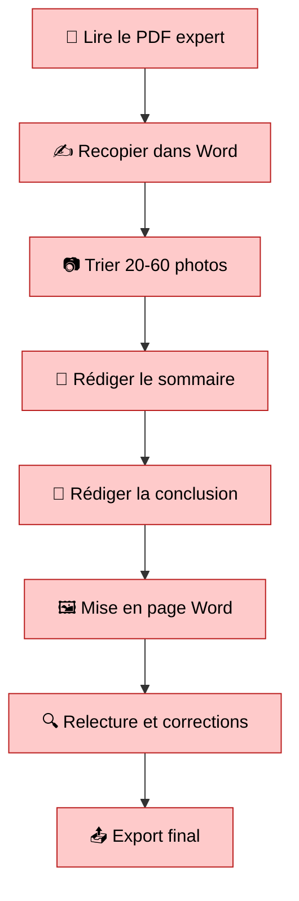
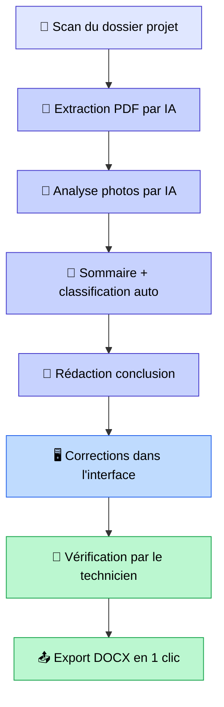

## La façon dont on intègre l'IA, c'est ce qui fait la différence

Quand on travaille dans l'IA, le plus important souvent ce n'est pas quel modèle on utilise ou quelle dernière techno à la mode est la plus performante.

Le plus important, c'est **comment on intègre l'IA dans un workflow déjà existant**.

A chaque nouveau projet, il y a deux défis. Le premier, c'est de réussir à atteindre de bonnes performances avec mes algorithmes d'IA pour résoudre une problématique donnée. Le deuxième, c'est l'intégration : comment je mets à disposition cet algorithme pour qu'il soit utilisé et qu'il soit **utile**. Car trop souvent, des projets IA tombent dans l'oubli parce qu'ils ne sont pas exploitables, ou qu'ils ne s'intègrent pas bien dans le travail quotidien des employés (j'en parle dans [les 5 erreurs que tout le monde fait avec le RAG](les-5-erreurs-rag.md), mais le constat dépasse largement le RAG).

Je vais illustrer ça avec un cas concret qu'on a réalisé récemment : l'automatisation de rapports de sinistre pour un acteur de l'expertise bâtiment et menuiserie.

<!-- more -->

## Le problème : un rapport qui prend des heures

Quand un menuisier intervient après un sinistre (infiltrations, dégâts des eaux, défauts de menuiseries extérieures), il doit produire un **rapport d'inspection** destiné à l'assureur. Ce rapport suit un formalisme strict : références du dossier expert, localisation du bien, classement chronologique des photos de chantier, constatations techniques, conclusion, export au format DOCX conforme.

En pratique, un technicien passait **3 à 4 heures par rapport** :

- ~45 min à recopier manuellement les informations du PDF expert (références assureur, adresse du sinistre, objet de la mission...)
- ~30 min à trier et classer 20 à 60 photos dans les bonnes sections
- ~45 min à rédiger le sommaire et structurer les constatations
- ~30 min à écrire la conclusion technique
- ~30 min de mise en page, vérification, export

Et le reste du temps ? Des allers-retours entre l'explorateur de fichiers, Word, un lecteur PDF, une visionneuse photo, Google Maps. Du copier-coller en boucle. De la friction pure.

C'est le genre de tâche où l'humain passe plus de temps à **orchestrer** qu'à **réfléchir**. Et c'est exactement le type de problème où l'IA peut faire la différence. Mais pas n'importe comment.

## L'IA seule ne suffit pas

C'est un point que je veux vraiment insister dessus, parce que c'est ce que j'observe sur presque tous mes projets.

Un LLM qui extrait des données d'un PDF, c'est impressionnant en démo. Mais si ensuite l'utilisateur doit copier le résultat dans un tableur, corriger manuellement, puis reporter dans Word : **le gain réel est bien en dessous de ce qu'on imagine**.

Sur ce projet, on a mesuré les gains de façon rigoureuse. Et voici ce qu'on a observé :

| Levier | Gain estimé | Ce qu'il couvre |
|--------|-------------|-----------------|
| **Pipeline IA** | ~50% | Extraction PDF, analyse photo, structuration, rédaction |
| **Interface métier intégrée** | ~30% | Fluidité du workflow, zéro friction, édition en contexte |
| **L'humain** | ~20% | Vérification, correction, validation finale |

L'IA apporte ~50% d'accélération : elle fait le gros du travail cognitif (lire, comprendre, structurer, rédiger). L'interface ajoute ~30% en supprimant toute la friction d'usage. Et les 20% restants ? C'est l'humain. Parce que ceux qui vous disent que l'IA va remplacer l'humain dans ce genre de tâche, ce n'est pas vrai. Le technicien reste maître à bord. Sa tâche change : il ne rédige plus, il **vérifie, corrige et valide**. Mais il reste indispensable.

C'est **l'intégration des trois qui crée le vrai saut** : de 3-4 heures à environ 40 minutes par rapport.

## Partie 1 : Ce que fait l'IA (50% du gain)

### Extraction automatique des données depuis le PDF expert

Le point de départ de chaque rapport, c'est un **PDF d'expertise** rédigé par le cabinet mandaté par l'assureur. Ce document contient toutes les références du dossier, mais dans un format non structuré : texte libre, tableaux PDF, parfois des scans OCR de mauvaise qualité.

On envoie ce PDF à un [LLM](comprendre-l-IA-generative.md) qui extrait en une seule passe les ~18 champs nécessaires : cabinet expert, références assureur, adresse du sinistre, objet de la mission, description du problème, etc.

**Résultat** : 18 champs pré-remplis en ~15 secondes, au lieu de 45 minutes de saisie manuelle.

C'est le genre de tâche où l'IA excelle. Un humain lit, comprend, recopie. L'IA fait pareil, mais en quelques secondes.

### Analyse des photos par vision IA

Chaque photo du chantier est analysée par un modèle de vision. Le LLM reçoit la photo + le contexte du rapport (objet de la mission, description du sinistre) et produit une **description technique** : ce qu'on voit, les observations pertinentes, les éléments identifiés.

Pour 40 photos, le traitement complet prend environ 2 minutes. Manuellement, un technicien passait 30 minutes rien que pour trier et classer ces photos.

### Génération du sommaire et classification des photos

À partir des analyses et du contexte du rapport, l'IA génère un **sommaire structuré** avec les sous-sections de localisation et d'investigation, dans l'ordre chronologique. Puis elle **classifie chaque photo** dans la bonne section : les vues d'ensemble en localisation, les photos techniques dans les investigations.

### Rédaction de la conclusion technique

Le LLM produit une conclusion de 3 à 5 paragraphes en croisant l'objet de la mission, les constatations, et les outils utilisés. Le technicien peut la régénérer avec des instructions simples : "plus concis", "insister sur le point X". Si vous voulez comprendre comment bien formuler ce type d'instructions, j'ai écrit un article sur [comment utiliser ChatGPT efficacement](utiliser-chatgpt-efficacement.md) qui explique les bases.

En résumé, l'IA fait en quelques minutes ce qui prenait plus d'une heure de travail cognitif. C'est le levier le plus puissant : **~50% du gain total**. Mais l'IA toute seule, sans une bonne interface et sans l'humain dans la boucle, ça ne donne pas un produit fini.

## Partie 2 : L'interface qui fluidifie tout (30% du gain)

30%, ça peut paraître peu dit comme ça. Mais c'est le levier qui transforme un prototype IA en un **outil utilisable au quotidien**. Sans interface adaptée, le gain de l'IA se dilue dans la friction d'usage. L'utilisateur doit jongler entre outils, copier-coller des résultats, reformater manuellement. Et là, même avec une IA performante, on perd du temps.

### Tout dans un seul écran

Avant, le technicien alternait entre **5 outils différents** :

- L'explorateur de fichiers (chercher les PDF, les photos)
- Un lecteur PDF (lire le rapport expert)
- Word (rédiger le rapport)
- Une visionneuse photo (trier les images)
- Google Maps (capture satellite)

Maintenant : **une seule interface, un seul flux**. Scan du dossier, lancement du pipeline IA, édition des données, mise en page photo, export DOCX. Zéro changement de contexte.

Ce gain-là, il est invisible dans les démos. Mais dans le quotidien d'un technicien qui fait 3 rapports par semaine, c'est énorme.

### L'IA propose, l'humain dispose

Chaque sortie du pipeline IA est **immédiatement éditable** dans l'interface :

- Les champs extraits du PDF sont pré-remplis dans un formulaire. Le technicien corrige uniquement ce qui est faux, il ne saisit plus rien de zéro.
- Le sommaire généré est modifiable : renommer, ajouter, supprimer, réordonner par drag-and-drop.
- La classification des photos est ajustable : déplacer une photo d'une section à une autre en un clic.
- La conclusion est régénérable avec des instructions en langage naturel.

**Corriger 2 champs sur 18, ça prend 30 secondes. Rédiger 18 champs manuellement, ça prenait 45 minutes.** L'interface rend la correction plus rapide que la rédaction. Et c'est exactement ça qu'on veut : que le technicien passe son temps à valider, pas à saisir.

### Mise en page visuelle des photos

La mise en page des photos dans un rapport Word, c'est un poste de temps massif quand c'est fait manuellement. L'interface propose des **layouts visuels** (pleine page, grille, colonnes) applicables en un clic. Le drag-and-drop permet de réordonner les photos, changer de layout, tout ça sans toucher au document final.

### Export en un clic

L'export final génère un DOCX conforme au template métier : données insérées, images avec orientation corrigée, sommaire généré, mise en page respectée. **Un clic, un fichier prêt à envoyer.**

## Partie 3 : L'humain reste maître à bord (20% du gain)

C'est un point important, et je veux être honnête dessus. Ceux qui vous disent que l'IA va effacer l'humain du process, ce n'est pas la réalité du terrain. En tout cas, pas sur ce type de projet.

Le technicien reste **indispensable**. Son rôle change, c'est vrai. Il ne passe plus des heures à rédiger. Mais il passe du temps à :

- **Vérifier** que les données extraites par l'IA sont correctes (une adresse mal lue, un numéro de référence inversé, ça arrive)
- **Corriger** les descriptions de photos quand le contexte technique lui échappe
- **Valider** la conclusion et s'assurer qu'elle reflète bien ce qu'il a constaté sur le terrain
- **Ajuster** le sommaire selon les spécificités du chantier

L'IA n'a pas été sur le chantier. Le technicien, si. C'est lui qui sait si la photo n°12 montre une infiltration ou un simple défaut esthétique. C'est lui qui sait que la menuiserie en question a déjà été remplacée il y a deux ans. Ce contexte terrain, aucun modèle ne l'a.

Et c'est pour ça que ces 20% sont essentiels. Pas juste pour la qualité du rapport, mais pour la **confiance**. Un rapport validé par un expert humain, ça a une valeur que l'IA seule ne peut pas garantir. L'assureur le sait, le technicien le sait, et le client final le sait aussi.

Le vrai changement, c'est que le technicien passe du rôle de **rédacteur** à celui de **relecteur-validateur**. C'est moins fatiguant, c'est plus rapide, et ça lui permet de se concentrer sur ce qui compte : son expertise métier.

## La synergie : IA + interface + humain

**Avant : workflow traditionnel (~3-4h)**

**Après : workflow assisté (~40 min)**

L'IA fait le travail cognitif lourd : lire, comprendre, structurer, rédiger. L'interface rend ce travail immédiatement exploitable, sans friction. Et l'humain apporte ce que ni l'IA ni l'interface ne peuvent fournir : le jugement terrain, la validation experte, la responsabilité.

Le pipeline s'enchaîne automatiquement, avec suivi de progression en temps réel. L'utilisateur lance une action, retrouve un rapport quasi-complet, le vérifie, le corrige si besoin, et exporte. **C'est la combinaison des trois qui fait passer de 3-4 heures à 40 minutes.**

## Les résultats concrets

| Tâche | Avant | Après | Gain |
|-------|-------|-------|------|
| Saisie des champs du dossier | 45 min | 30 sec de corrections | **~98%** |
| Tri et classement des photos | 30 min | 2 min de vérification | **~93%** |
| Rédaction du sommaire | 45 min | 1 min d'ajustement | **~97%** |
| Rédaction de la conclusion | 30 min | 2 min de relecture | **~93%** |
| Mise en page DOCX | 30 min | 5 min (layouts visuels) | **~83%** |
| **Temps total par rapport** | **3-4h** | **~40 min** | **~80%** |

**Vous avez un process métier répétitif qui prend des heures ?** L'approche qu'on a utilisée ici (IA + interface + humain dans la boucle) est applicable à beaucoup de cas similaires : rapports techniques, comptes-rendus, audits, fiches produit... [Réservez un créneau](https://cal.eu/anas-rabhi/rendez-vous-ianas) pour en discuter, ou écrivez-moi à [anas0rabhi@gmail.com](mailto:anas0rabhi@gmail.com).

## Ce que j'en retiens

Ce projet m'a confirmé quelque chose que je constate sur tous mes projets IA :

**1. L'IA fait le gros du travail, mais ce n'est qu'un ingrédient.** 50% du gain, c'est énorme. Mais un modèle qui extrait parfaitement des données ne sert à rien si l'utilisateur doit copier-coller le résultat dans 5 champs Word. Sans interface et sans humain dans la boucle, le gain se dilue.

**2. L'interface transforme un prototype en outil.** 30% de gain, ça ne fait pas rêver sur le papier. Mais c'est la différence entre un projet IA qui reste dans un Jupyter Notebook et un projet IA que les gens utilisent vraiment tous les jours.

**3. L'humain ne s'efface pas, il monte en valeur.** Les 20% restants, c'est le technicien qui vérifie, corrige et valide. Son expertise terrain est irremplaçable. L'IA lui enlève le travail pénible, pas le travail important.

**4. Le design de l'interface doit être pensé pour l'IA.** Ce n'est pas "un formulaire + un bouton IA". C'est un workflow où chaque sortie IA atterrit au bon endroit, dans le bon format, prête à être validée ou corrigée par l'humain. Le pipeline IA, l'interface et le rôle de l'humain sont co-conçus.

Et c'est ça, la vraie leçon de ce projet. La technique IA est importante, bien sûr. Mais ce qui fait la différence entre un projet IA qui impressionne en démo et un projet IA qui change réellement le quotidien des utilisateurs, c'est la qualité de l'intégration. Et dans cette intégration, l'humain a toujours sa place. Il est juste mieux utilisé.

Si vous voulez aller plus loin, j'ai écrit sur [ce qu'est un agent IA](c-est-quoi-un-agent-ia.md) et sur [comment améliorer ses résultats en IA](comment-ameliorer-l-IA.md).

***

Si mes articles vous intéressent et que vous avez des questions ou simplement envie de discuter de vos propres défis, n'hésitez pas à m'écrire à [anas0rabhi@gmail.com](mailto:anas0rabhi@gmail.com), j'aime échanger sur ces sujets !

Vous pouvez aussi [réserver un créneau d'échange](https://cal.eu/anas-rabhi/rendez-vous-ianas) ou vous abonner à ma newsletter :)

---

### À propos de moi

Je suis **Anas Rabhi**, consultant Data Scientist freelance. J'accompagne les entreprises dans leur stratégie et mise en œuvre de solutions d'IA (RAG, Agents, NLP).

Découvrez mes services sur [tensoria.fr](https://tensoria.fr) ou testez notre solution d'agents IA [heeya.fr](https://heeya.fr).

  <a href="https://cal.eu/anas-rabhi/rendez-vous-ianas" target="_blank" style="display: inline-block; background-color: #4F46E5; color: #ffffff; font-weight: bold; padding: 16px 32px; text-decoration: none; border-radius: 8px; font-size: 18px; letter-spacing: 0.8px; box-shadow: 0 6px 12px rgba(0, 0, 0, 0.2); transition: all 0.3s ease; border: none;">
    Réserver un créneau
  </a>
  <a href="https://anas-ai.kit.com/d8b1a255cc" target="_blank" style="display: inline-block; background-color: #222222; color: #ffffff; font-weight: bold; padding: 16px 32px; text-decoration: none; border-radius: 8px; font-size: 18px; letter-spacing: 0.8px; box-shadow: 0 6px 12px rgba(0, 0, 0, 0.2); transition: all 0.3s ease; border: none;">
    ✉️ S'abonner à ma newsletter
  </a>

