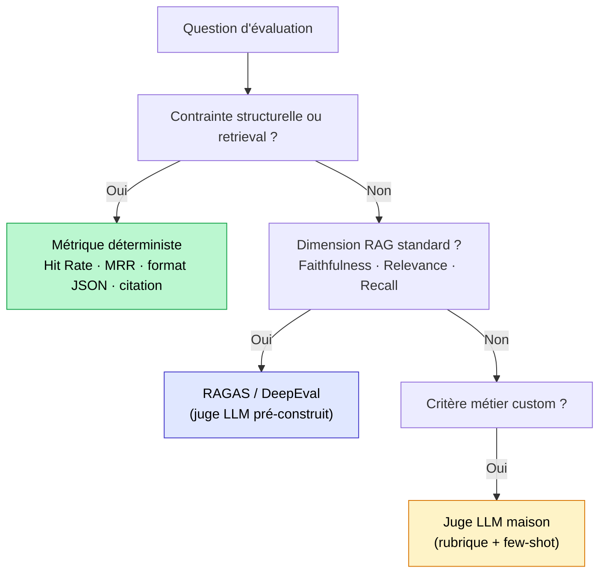

## Ce qu'est un LLM-as-a-judge, en une phrase citable

Un LLM-as-a-judge, c'est un second modèle de langage qui évalue la sortie d'un premier modèle selon une grille de critères explicites : pertinence, fidélité aux sources, complétude, ton. Il produit un score et une justification. C'est tout.

Ce mécanisme est utile. Mais il est cher, lent, et biaisé si on l'applique sans discernement. La question n'est pas "est-ce que je dois utiliser un juge LLM" mais "à quel endroit de mon pipeline, à quelle fréquence, avec quel modèle".

La règle que j'applique sur mes missions : les tests déterministes d'abord, le juge LLM en dernier recours, jamais dans la boucle de développement rapide.

<!-- more -->

> L'évaluation par un juge LLM s'inscrit dans le pipeline d'un RAG en production. Pour l'ensemble du pipeline, voir le [guide RAG complet](/rag/).

## La grille de décision : quand l'utiliser, quand l'éviter

Le LLM-as-a-judge n'est pas la réponse par défaut à "comment est-ce que j'évalue mon système ?". C'est l'outil qu'on sort quand les métriques déterministes ne suffisent plus.

Voici l'ordre d'escalade que j'applique systématiquement :

**Niveau 1 : tests déterministes (gratuits, instantanés)**

Avant de penser à un juge LLM, vérifiez ce que vous pouvez vérifier sans LLM. Est-ce que la réponse contient bien le bon format JSON ? Est-ce que la date extraite est une date valide ? Est-ce que le nombre de chunks récupérés est dans la plage attendue ? Est-ce que la réponse cite au moins une source ?

Ces vérifications sont déterministes, reproductibles, et coûtent 0€. Sur les projets que j'audite, 30 à 40% des bugs identifiables restent détectables à ce niveau. Ne les sautez pas.

**Niveau 2 : métriques de similarité (quasi gratuit)**

ROUGE, BERTScore, BLEU sur les cas où vous avez une ground truth. Imparfaits sémantiquement, mais utiles pour détecter des régressions brutes entre deux versions d'un système.

**Niveau 3 : juge LLM (coûteux, lent)**

On arrive ici uniquement quand les deux niveaux précédents ne couvrent pas ce qu'on veut mesurer : la qualité sémantique d'une réponse ouverte, la cohérence du raisonnement, la pertinence d'une explication. Ce sont des dimensions qu'un test déterministe ne peut pas capturer.

| Contexte | Juge LLM ? | Pourquoi |
|---|---|---|
| Boucle de développement (chaque commit) | Non | Trop lent, trop cher, tue l'itération |
| Suite de tests en CI/CD (hebdomadaire) | Oui, sur dataset fixe | Coût prévisible, comparaison valide |
| Monitoring échantillonné en prod (5-10%) | Oui, en asynchrone | Coût maîtrisé, signal réel |
| Debug d'un cas précis | Oui, ponctuellement | Acceptable ad hoc |
| Évaluation de 100% du trafic prod | Non | Coût × volume = facture incontrôlable |

La règle la plus importante : **jamais dans la boucle de feedback rapide du développement**. Un juge GPT-4o sur 500 requêtes à chaque push, c'est plusieurs dizaines d'euros par jour. Deux développeurs qui itèrent un week-end et votre budget d'évaluation du mois est parti.

## Le coût réel en euros : calcul concret

C'est la partie que personne ne montre clairement. Voici la formule :

$$\text{Coût total} = n\_éval \times n\_critères \times (tokens\_input \times prix\_input + tokens\_output \times prix\_output)$$

Les paramètres typiques d'un appel de juge LLM :
- Prompt système + question + réponse à évaluer + rubrique : environ 800 tokens en entrée
- Réponse du juge (score + justification) : environ 200 tokens en sortie

### Tableau de coûts par modèle (mai 2026)

| Modèle | Input ($/1M) | Output ($/1M) | Coût / évaluation | 1 000 éval × 3 critères |
|---|---|---|---|---|
| GPT-4o-mini | $0,15 | $0,60 | ~$0,000240 | ~**0,72€** |
| Claude Haiku 4.5 | $1,00 | $5,00 | ~$0,00180 | ~**5,40€** |
| GPT-4o | $2,50 | $10,00 | ~$0,00400 | ~**12,00€** |
| Claude Sonnet 4.6 | $3,00 | $15,00 | ~$0,00480 | ~**14,40€** |

Hypothèses du calcul : 800 tokens input + 200 tokens output par appel de juge, taux de change 1$ = 0,92€.

### Ce que ça donne en pratique

**Scénario 1 : évaluation offline d'un dataset de 500 questions, 3 critères (faithfulness, pertinence, complétude)**

Avec GPT-4o-mini : 500 × 3 = 1 500 appels × $0,000240 = **0,36€**. Négligeable.

Avec GPT-4o : 500 × 3 = 1 500 appels × $0,00400 = **6,00€**. Acceptable pour une évaluation ponctuelle.

**Scénario 2 : monitoring prod sur 10% de 10 000 requêtes/jour, 2 critères**

Avec GPT-4o-mini : 1 000 × 2 = 2 000 appels/jour × $0,000240 = **$0,48/jour, soit ~13€/mois**. Très raisonnable.

Avec GPT-4o : 1 000 × 2 = 2 000 appels/jour × $0,00400 = **$8,00/jour, soit ~220€/mois**. Commence à peser.

**Scénario 3 : juge LLM en boucle de dev, 100% du trafic de test, 4 critères**

Supposons 200 requêtes de test par développeur par jour, 3 développeurs, GPT-4o :
200 × 3 × 4 critères = 2 400 appels × $0,00400 = **$9,60/jour**. Multipliez par 20 jours ouvrés : **$192/mois, soit ~175€ rien que pour l'évaluation**. Et si vous passez à GPT-4o-mini, c'est 12€/mois. La différence justifie de toujours se poser la question du bon modèle juge.

Le message : GPT-4o-mini couvre 80% des besoins d'évaluation à un coût négligeable. Réservez GPT-4o ou Claude Sonnet pour les cas où vous avez besoin d'une finesse de jugement sur des critères complexes (raisonnement multi-étapes, cohérence juridique, ton délicat).

### Un prompt de juge opérationnel avec rubrique

Voici le pattern que j'utilise en production. L'idée clé : une rubrique explicite avec des niveaux de score définis, une sortie JSON structurée, et un critère par appel (pas trois critères mélangés dans un seul prompt).

```python
import json
from openai import OpenAI

client = OpenAI()

JUDGE_SYSTEM_PROMPT = """Tu es un évaluateur expert de systèmes RAG.
Ton rôle : noter la FIDÉLITÉ d'une réponse par rapport au contexte fourni.

Rubrique de notation (score de 1 à 4) :
- 4 : Toutes les affirmations de la réponse sont directement supportées par le contexte.
- 3 : La majorité des affirmations est supportée, une affirmation mineure ne l'est pas.
- 2 : Plusieurs affirmations ne sont pas dans le contexte, ou une affirmation centrale est non fondée.
- 1 : La réponse contient des informations inventées ou contredisant le contexte.

Réponds UNIQUEMENT en JSON valide avec ce format :
{"score": <int 1-4>, "justification": "<1-2 phrases max>", "affirmation_non_fondee": "<citation ou null>"}
"""

def judge_faithfulness(question: str, context: str, response: str) -> dict:
    """
    Évalue la fidélité d'une réponse au contexte.
    Retourne un dict avec score (1-4), justification, et l'affirmation problématique si trouvée.
    """
    user_message = f"""Question : {question}

Contexte récupéré :
{context}

Réponse à évaluer :
{response}"""

    completion = client.chat.completions.create(
        model="gpt-4o-mini",   # Juge léger pour la majorité des évaluations
        temperature=0,          # Déterminisme maximal
        response_format={"type": "json_object"},
        messages=[
            {"role": "system", "content": JUDGE_SYSTEM_PROMPT},
            {"role": "user", "content": user_message},
        ],
    )

    return json.loads(completion.choices[0].message.content)


# Exemple d'utilisation
result = judge_faithfulness(
    question="Quel est le délai de remboursement ?",
    context="Article 4.1 : tout remboursement doit être traité dans les 14 jours calendaires suivant la réception du formulaire signé.",
    response="Le remboursement est effectué sous 14 jours à réception du formulaire. Les remboursements sont traités le vendredi.",
)

print(result)
# {"score": 2,
#  "justification": "Le délai de 14 jours est correct, mais l'affirmation sur le vendredi n'est pas dans le contexte.",
#  "affirmation_non_fondee": "Les remboursements sont traités le vendredi."}
```

Trois décisions de design importantes dans ce prompt :

**Un critère par appel.** Un juge qui évalue faithfulness + pertinence + complétude dans le même prompt mélange les signaux et produit des scores moins fiables. Faites un appel par critère : c'est plus cher en nombre d'appels, mais beaucoup plus précis.

**Une rubrique avec des niveaux nommés.** "Notez de 1 à 10" est une instruction trop vague. Un juge LLM sans rubrique explicite score de façon inconsistante d'une requête à l'autre. Décrivez ce que vaut chaque niveau.

**`temperature=0`.** Indispensable pour la reproductibilité. Avec une température plus haute, le même exemple peut recevoir 3 ou 4 selon l'appel. Votre baseline devient instable.

## Les biais du juge LLM et comment les réduire

Un juge LLM n'est pas objectif. C'est le point le plus sous-estimé quand on met en place ce type d'évaluation pour la première fois. Trois biais structurels à connaître.

### Biais de position (position bias)

En mode pairwise (comparer deux réponses A et B pour choisir la meilleure), le juge favorise systématiquement la réponse présentée en première position. Des études récentes (arxiv 2602.02219, 2024-2025) montrent que sur certains modèles, l'ordre seul explique jusqu'à 30% de la variance dans le verdict.

Correction : **randomiser l'ordre** des réponses à chaque évaluation, et agréger sur au moins deux passes avec les ordres inversés. Si le verdict change selon l'ordre, c'est du bruit, pas du signal.

### Biais de verbosité (verbosity bias)

Les juges LLM ont tendance à favoriser les réponses plus longues, même quand la réponse courte est plus précise et plus utile. Une réponse de 300 mots qui tourne autour du sujet score souvent mieux qu'une réponse de 50 mots directe.

Correction : **inclure explicitement dans la rubrique** un niveau qui pénalise le padding inutile. Par exemple : "Score 3 uniquement si la réponse est concise et ne contient pas d'informations non demandées."

### Biais de self-preference (self-enhancement bias)

Un modèle juge a tendance à préférer les formulations proches du style de ses propres sorties. Si vous utilisez GPT-4o pour générer les réponses et GPT-4o comme juge, le juge notera plus favorablement les tournures que GPT-4o emploierait lui-même.

Correction : **utiliser un modèle d'une famille différente** pour juger. Si vous générez avec GPT-4o, jugez avec Claude ou Mistral, et vice versa. Sinon, utilisez au minimum un modèle de génération et une version différente pour le jugement (GPT-4o-mini comme juge des sorties de GPT-4o).

### Résumé des corrections

| Biais | Symptôme observable | Correction |
|---|---|---|
| Position | Verdict change si on inverse l'ordre A/B | Passer en pointwise ou randomiser + agréger |
| Verbosité | Les longues réponses scorent mieux même hors sujet | Rubrique avec critère de concision explicite |
| Self-preference | Famille de modèles impacte le score | Juge d'une famille différente du générateur |

## Juge LLM, métriques déterministes, RAGAS : quand choisir quoi

Les trois approches sont complémentaires, pas concurrentes. Voici leur rôle exact.

Les **métriques déterministes** (Hit Rate @k, MRR, NDCG, format valide, présence de citation) couvrent le retrieval et les contraintes structurelles. Toujours en premier, toujours gratuites. Si votre Hit Rate @5 est à 70%, le juge LLM sur la génération ne sert à rien : la cause racine est en amont.

Les **métriques RAGAS** (faithfulness, answer relevancy, context precision, context recall) sont elles-mêmes basées sur un juge LLM, mais avec des prompts de jugement pré-construits et testés. RAGAS vous évite de construire vos propres prompts de juge pour les métriques standard du RAG. Lisez l'article dédié pour le détail des métriques et du code : [Évaluer un RAG en production : métriques et RAGAS](evaluer-rag-production-metriques-ragas.md).

Le **juge LLM custom** (ce dont parle cet article) est utile quand vous avez des critères d'évaluation propres à votre domaine, que RAGAS ne couvre pas out-of-the-box : ton adapté au contexte métier, respect d'une charte de réponse, pertinence vis-à-vis de règles réglementaires spécifiques.



### Calibrer un juge fiable : corrélation avec les annotations humaines

Un juge LLM non calibré est dangereux. Vous pouvez avoir un beau pipeline d'évaluation qui score bien des réponses que des utilisateurs réels trouvent mauvaises, ou inversement.

La calibration se fait en une seule étape : calculer la corrélation entre vos scores de juge LLM et des annotations humaines sur le même échantillon.

**Protocole minimal :**

1. Prenez 50 à 100 exemples représentatifs de votre système.
2. Faites annoter chaque exemple par deux personnes ayant une expertise métier (pas des développeurs, des vrais utilisateurs du système si possible). Chaque annotateur note indépendamment selon la même rubrique.
3. Calculez le Cohen's Kappa inter-annotateur. En dessous de 0,6, votre rubrique est trop ambiguë : précisez les niveaux avant d'aller plus loin.
4. Lancez votre juge LLM sur les mêmes exemples.
5. Calculez la corrélation de Spearman entre les scores du juge et la moyenne des scores humains.

| Corrélation Spearman | Interprétation |
|---|---|
| > 0,80 | Juge fiable, utilisable en production |
| 0,60 à 0,80 | Acceptable pour le monitoring, pas pour des décisions critiques |
| < 0,60 | Rubrique à retravailler ou modèle juge à changer |

Sur mes missions, la corrélation passe typiquement de 0,55 à 0,78 après avoir ajouté 3 à 5 exemples few-shot dans le prompt du juge (un exemple par niveau de score, avec une justification explicite). Le few-shot ancre le juge sur votre définition de chaque niveau, pas sur la sienne.

```python
# Calcul de corrélation de Spearman entre scores juge et scores humains
from scipy.stats import spearmanr

juge_scores = [4, 2, 3, 4, 1, 3, 2, 4, 3, 2]       # Scores du juge LLM
human_scores = [4, 2, 4, 3, 1, 3, 3, 4, 2, 2]       # Moyenne des annotations humaines

corr, p_value = spearmanr(juge_scores, human_scores)
print(f"Corrélation de Spearman : {corr:.2f} (p={p_value:.3f})")
# Corrélation de Spearman : 0.82 (p=0.004)
```

Si votre corrélation est bonne sur cet échantillon de calibration, votre juge est utilisable. Si elle est faible, ne changez pas de modèle juge avant d'avoir retravaillé la rubrique : c'est presque toujours là que le problème se situe.

## Questions fréquentes sur le LLM-as-a-judge

**Quelle différence entre évaluation pointwise et évaluation pairwise ?**

L'évaluation pointwise attribue un score absolu à une seule réponse, selon une rubrique. L'évaluation pairwise compare deux réponses (A vs B) et détermine laquelle est meilleure. La pairwise est plus naturelle pour détecter des régressions entre deux versions d'un système, mais elle amplifie le biais de position. Pour du monitoring en production, la pointwise avec rubrique explicite est plus stable et moins coûteuse (un seul appel par réponse au lieu de deux).

**Peut-on utiliser un modèle open source comme juge ?**

Oui, et c'est une bonne option pour réduire les coûts à zéro (hors infrastructure). Mistral 7B Instruct, LLaMA 3 8B, ou des modèles spécialisés comme Prometheus 2 (fine-tuné pour le jugement) fonctionnent correctement pour des critères simples. En revanche, sur des jugements complexes (cohérence d'un raisonnement juridique, subtilité du ton), les modèles plus petits ont une corrélation plus faible avec les annotations humaines. Calibrez toujours avant de faire confiance aux scores.

**Combien de critères évaluer par appel de juge ?**

Un seul par appel. C'est la règle que je suis systématiquement. Un prompt qui mélange faithfulness, pertinence et complétude produit des scores moins stables et plus difficiles à interpréter. Trois critères = trois appels. Le coût supplémentaire est marginal, la fiabilité est nettement meilleure.

**Comment évaluer un chatbot sans dataset annoté de référence ?**

Deux méthodes complémentaires. D'abord, l'évaluation sans référence (reference-free) : des métriques comme la faithfulness et l'answer relevancy de RAGAS n'ont pas besoin de ground truth, elles évaluent la cohérence interne (la réponse est-elle fondée sur le contexte fourni ?). Ensuite, la génération synthétique : utilisez un LLM pour créer des questions à partir de vos documents et annoter automatiquement les réponses attendues. C'est un bootstrap imparfait mais suffisant pour démarrer. Le détail de cette méthode est dans [Construire un dataset d'évaluation RAG en 30 minutes](dataset-evaluation-rag-questions-synthetiques.md).

**Le LLM-as-a-judge remplace-t-il l'annotation humaine ?**

Non. Il la complète. Pour construire votre rubrique et la calibrer, vous avez besoin d'annotations humaines. Pour le monitoring quotidien à l'échelle (des milliers de requêtes), le juge LLM prend le relais. La règle pratique : annotations humaines au démarrage et lors des audits approfondis, juge LLM pour le flux continu.

**Quels sont les modèles les plus utilisés comme juges en 2026 ?**

GPT-4o-mini est le choix le plus courant pour les pipelines à volume moyen : bon rapport qualité/coût, API stable, résultats cohérents. GPT-4o et Claude Sonnet 4.6 sont utilisés quand la qualité de jugement prime sur le coût (cas réglementaires, audits ponctuels). Prometheus 2 est une alternative open source spécialisée dans le jugement fin avec rubrique. MT-Bench et Chatbot Arena restent des références académiques pour comparer des systèmes au niveau benchmark, mais ne sont pas des outils de monitoring production.

**À quelle fréquence lancer une évaluation par juge LLM en production ?**

En évaluation offline sur dataset fixe : à chaque release significative (changement de modèle, de prompt, de chunking). En monitoring online : en continu sur un échantillon de 5 à 10% du trafic réel, de façon asynchrone pour ne pas impacter la latence. N'évaluez pas 100% du trafic sauf contrainte réglementaire forte : le coût n'est pas justifié et le signal marginal sur les requêtes supplémentaires est faible.

**Comment savoir si mon juge LLM est trop indulgent ?**

Regardez la distribution de vos scores. Si plus de 80% de vos évaluations obtiennent le score maximum, soit votre système est exceptionnellement bon (peu probable en phase initiale), soit votre juge est trop laxiste. Ajoutez un few-shot avec des exemples de mauvaises réponses bien notées (score bas) dans votre prompt : ça recalibre la distribution vers le bas. Si ça ne suffit pas, durcissez explicitement votre rubrique.

## Pour aller plus loin

- [Évaluer un RAG en production : métriques et RAGAS](evaluer-rag-production-metriques-ragas.md) : les métriques standard (faithfulness, context recall) et les frameworks qui les implémentent
- [Tester un LLM avec des tests unitaires](tester-llm-tests-unitaires.md) : les tests déterministes qui doivent précéder tout juge LLM
- [Construire un dataset d'évaluation RAG en 30 minutes](dataset-evaluation-rag-questions-synthetiques.md) : bootstrap d'un jeu d'évaluation sans annotations manuelles
- [Pourquoi le RAG ne fonctionne pas](pourquoi-le-rag-ne-fonctionne-pas.md) : analyse d'erreur question par question avant de sortir l'artillerie lourde

---------

Si mes articles vous intéressent et que vous avez des questions ou simplement envie de discuter de vos propres défis, n'hésitez pas à m'écrire à [anas@tensoria.fr](mailto:anas@tensoria.fr), j'aime échanger sur ces sujets !

Vous pouvez aussi [réserver un créneau d'échange](https://cal.eu/anas-rabhi/rendez-vous-ianas) ou vous abonner à ma newsletter :)


---

### À propos de moi

Je suis **Anas Rabhi**, consultant Data Scientist freelance. J'accompagne les entreprises dans leur stratégie et mise en œuvre de solutions d'IA (RAG, Agents, NLP).

Découvrez mes services sur [tensoria.fr](https://tensoria.fr) ou testez notre solution d'agents IA [heeya.fr](https://heeya.fr).

<div style="text-align: center; margin: 40px 0; gap: 16px; display: flex; flex-wrap: wrap; justify-content: center;">
  <a href="https://cal.eu/anas-rabhi/rendez-vous-ianas" target="_blank" style="display: inline-block; background-color: #4F46E5; color: #ffffff; font-weight: bold; padding: 16px 32px; text-decoration: none; border-radius: 8px; font-size: 18px; letter-spacing: 0.8px; box-shadow: 0 6px 12px rgba(0, 0, 0, 0.2); transition: all 0.3s ease; border: none;">
    Réserver un créneau
  </a>
  <a href="https://anas-ai.kit.com/d8b1a255cc" target="_blank" style="display: inline-block; background-color: #222222; color: #ffffff; font-weight: bold; padding: 16px 32px; text-decoration: none; border-radius: 8px; font-size: 18px; letter-spacing: 0.8px; box-shadow: 0 6px 12px rgba(0, 0, 0, 0.2); transition: all 0.3s ease; border: none;">
    <span style="margin-right: 10px;">✉️</span> S'abonner à ma newsletter
  </a>
</div>
