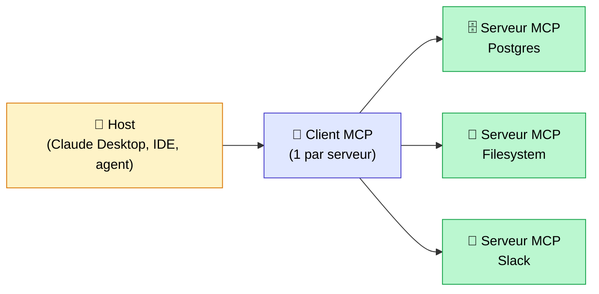

## Tout le monde parle d'agents IA. Personne ne parle de comment ils se connectent vraiment à vos outils.

Voici le problème concret que rencontrent 90% des équipes qui veulent construire un agent IA sérieux : elles ont un LLM capable, un cas d'usage clair, et 4 ou 5 outils à connecter (une base SQL, un Slack, un Notion, un GitHub). Et là, elles se retrouvent à coder une intégration custom pour chaque outil, pour chaque modèle. Si demain elles changent de LLM, elles recommencent. Si un collègue veut réutiliser l'intégration Slack sur un autre agent, il repart de zéro.

C'est le problème N fois M. N agents, M outils. On aboutit à N×M intégrations à coder et à maintenir.

**MCP résout exactement ce problème.** Le Model Context Protocol est le standard ouvert lancé par Anthropic en novembre 2024, et il est en train de devenir en 2026 ce qu'HTTP est au web : l'infrastructure invisible sur laquelle tout repose. OpenAI, Google, Microsoft, AWS : tout l'écosystème converge dessus. 97 millions de téléchargements mensuels du SDK en mars 2026, contre 2 millions au lancement. C'est une adoption sans précédent dans l'outillage IA.

Dans cet article, je vais vous expliquer ce qu'est MCP vraiment, comment son architecture fonctionne, en quoi il diffère du function calling classique, et surtout : sur quels projets l'utiliser (et sur quels projets ne pas l'utiliser).

<!-- more -->

***

## D'où vient MCP, et pourquoi maintenant

Anthropic a publié MCP en novembre 2024, en open-source sous licence MIT. L'idée de départ est simple : arrêter de réinventer la roue à chaque intégration.

**Le problème historique est architectural.** Chaque fournisseur de LLM a développé son propre mécanisme pour connecter le modèle à des outils externes. OpenAI a le function calling, avec sa syntaxe JSON spécifique. Anthropic a le tool use, différent dans sa structure. Google Gemini a sa propre API de fonctions. Résultat : si vous construisiez un agent avec OpenAI et que vous vouliez migrer vers Claude, vous réécriviez toutes vos intégrations d'outils. De zéro. C'était du couplage fort partout.

**L'analogie qu'Anthropic utilise eux-mêmes est celle de l'USB-C.** Avant l'USB-C, chaque fabricant avait son connecteur propriétaire. Vous deviez acheter un câble différent pour chaque appareil. L'USB-C a tout standardisé : un même câble fonctionne pour votre téléphone, votre ordinateur, votre disque dur externe. MCP fait la même chose pour les agents IA et leurs outils.

**L'adoption a été remarquablement rapide.** En décembre 2025, Anthropic a fait quelque chose d'inattendu : ils ont donné le protocole à l'Agentic AI Foundation (AAIF), un fonds dirigé hébergé par la Linux Foundation, co-fondé avec Block et OpenAI. Google, Microsoft, AWS, Cloudflare et Bloomberg ont suivi en tant que membres supporters. Ce n'est plus le protocole d'Anthropic. C'est un standard industriel ouvert, gouverné collectivement.

Concrètement, en 2026 :

- OpenAI a ajouté le support natif MCP dans ChatGPT et son SDK
- Google a intégré MCP dans l'API Gemini et Vertex AI Agent Builder
- Plus de 10 000 serveurs MCP publics actifs couvrent des centaines d'outils (GitHub, Slack, Postgres, Google Drive, Filesystem, Jira, Notion, et bien d'autres)
- Cursor, Claude Code, et la majorité des IDE IA supportent MCP nativement

C'est le signe que MCP n'est pas une tendance passagère. C'est une infrastructure.

***

## L'architecture MCP en 3 composants

MCP s'articule autour de trois entités qui communiquent via JSON-RPC 2.0. Voici comment elles s'organisent :



### Le Host : l'application qui contient le LLM

Le host, c'est l'application dans laquelle tourne votre modèle de langage. Ça peut être Claude Desktop, Cursor, un IDE comme VS Code avec une extension IA, ou votre propre application agent construite maison. Le host est responsable de lancer les connexions MCP, de gérer les sessions, et de décider quels serveurs MCP sont disponibles pour le LLM.

En pratique : quand vous configurez Claude Desktop pour lui donner accès à votre système de fichiers, vous dites au host quel serveur MCP démarrer.

### Le Client MCP : la lib qui parle aux serveurs

Le client MCP est une couche logicielle intégrée dans le host. Pour chaque serveur MCP connecté, il y a une instance de client. C'est lui qui gère le transport (stdio pour les processus locaux, Streamable HTTP pour les serveurs distants), la négociation de capacités au démarrage de la session, et la sérialisation/désérialisation des messages JSON-RPC.

En tant que développeur, vous n'écrivez généralement pas de client MCP : vous utilisez le SDK officiel qui s'en charge.

### Le Serveur MCP : le coeur du système

**C'est là que se passe l'essentiel.** Un serveur MCP est un processus indépendant qui expose trois types de primitives :

- **`tools`** : des actions avec effets de bord (exécuter une requête SQL, envoyer un message Slack, créer un fichier). Ce sont des équivalents de POST en HTTP.
- **`resources`** : des données en lecture seule (lire un fichier, accéder à une documentation, récupérer des logs). Ce sont des équivalents de GET.
- **`prompts`** : des templates paramétrés que l'agent peut utiliser comme points de départ pour des tâches récurrentes.

Au démarrage de la session, le client appelle `list_tools()` pour découvrir dynamiquement ce que le serveur expose. C'est la découverte dynamique : le host n'a pas besoin de connaître à l'avance les capacités du serveur. Quand le serveur évolue (nouveau tool ajouté), le host le découvre automatiquement.

***

## MCP vs function calling : la vraie différence

C'est la question que tout le monde se pose, et il y a une confusion fréquente que je veux clarifier d'emblée.

**MCP ne remplace pas le function calling.** Il ne fonctionne pas à la place, il fonctionne au-dessus. Sous le capot, quand un agent utilise un outil MCP, le LLM fait toujours du tool use (ou function calling, selon le vocabulaire du fournisseur). MCP standardise simplement la façon dont ces outils sont exposés, découverts et invoqués, indépendamment du LLM utilisé.

La différence structurelle est dans l'architecture :

| Critère | Function calling classique | MCP |
|---|---|---|
| Couplage | Code directement dans votre application | Serveur indépendant, réutilisable |
| Découverte des outils | Hardcodée dans le prompt | Dynamique via `list_tools()` |
| Multi-modèle | Réécrire pour chaque LLM | Standard universel |
| Maintenance | N×M intégrations | N+M |
| État | Stateless par défaut | Sessions stateful possibles |
| Réutilisabilité | Zéro | Totale entre agents et LLMs |

**Un exemple concret.** Vous construisez un agent qui interroge votre base Postgres. Avec le function calling classique, vous définissez vos fonctions en JSON dans votre code, vous les passez au LLM à chaque appel API, et si demain vous changez de LLM ou qu'un autre collègue veut la même fonctionnalité dans son propre agent, il recommence tout. Avec MCP, vous créez un serveur MCP Postgres une seule fois. N'importe quel agent, n'importe quel LLM compatible MCP peut l'utiliser. Vous passez de N×M à N+M.

Pour des projets simples avec 1 ou 2 outils, le function calling classique reste plus direct. MCP prend tout son sens dès que vous avez plusieurs outils à partager entre plusieurs agents ou plusieurs LLMs.

***

## Un exemple concret en 30 lignes

Voici à quoi ressemble un serveur MCP minimal en Python. J'utilise la lib officielle `mcp` (la même que celle utilisée par les serveurs officiels Anthropic).

L'exemple : un serveur qui expose un outil de recherche dans la documentation interne de votre entreprise.

```python
from mcp.server import Server
from mcp.server.stdio import stdio_server
from mcp.types import Tool, TextContent
import asyncio

app = Server("doc-search")

# Le retriever de votre base documentaire (RAG, base vectorielle, etc.)
# Pour l'exemple, on suppose qu'il existe
from your_project import my_retriever

@app.list_tools()
async def list_tools() -> list[Tool]:
    return [
        Tool(
            name="search_docs",
            description="Cherche dans la documentation interne de l'entreprise",
            inputSchema={
                "type": "object",
                "properties": {
                    "query": {
                        "type": "string",
                        "description": "La question ou le terme à rechercher"
                    }
                },
                "required": ["query"]
            },
        )
    ]

@app.call_tool()
async def call_tool(name: str, arguments: dict) -> list[TextContent]:
    if name == "search_docs":
        results = my_retriever.search(arguments["query"])
        return [TextContent(type="text", text=results)]

async def main():
    async with stdio_server() as streams:
        await app.run(*streams, app.create_initialization_options())

if __name__ == "__main__":
    asyncio.run(main())
```

Ce serveur, une fois démarré, est utilisable par Claude Desktop, Cursor, ou n'importe quel agent qui supporte MCP. **Votre retriever documentaire devient un service réutilisable.** Si demain vous avez 3 agents différents qui ont besoin d'accéder à cette base documentaire, ils branchent tous sur le même serveur MCP. Pas de duplication.

C'est exactement ce principe qu'on a appliqué sur plusieurs projets chez [Tensoria](https://tensoria.fr), et c'est ce que je détaille plus bas dans les cas d'usage réels.

***

## Les cas d'usage qui changent vraiment la donne

### Agent IDE : Cursor, Claude Code, VS Code

C'est le cas d'usage le plus immédiat en 2026. Un développeur qui travaille avec Cursor ou Claude Code peut connecter un serveur MCP `filesystem` qui donne à l'agent accès à ses fichiers locaux, un serveur MCP `git` pour les opérations de versioning, un serveur MCP pour ses bases de données de dev. Et tout ça fonctionne quel que soit le LLM derrière.

Ce que j'observe sur les projets : les équipes qui ont configuré leur environnement IDE avec MCP gagnent 30 à 60 minutes par jour en friction d'outillage. L'agent sait exactement ce qu'il peut faire, sans prompt d'instruction interminable.

### Agent multi-SaaS : le cas commercial

Imaginez un agent commercial qui doit répondre à des questions client en croisant HubSpot (historique client), Notion (documentation produit), Slack (dernières communications), et Gmail (emails). Sans MCP, c'est 4 intégrations custom, 4 maintenances, et si vous changez de CRM, vous recommencez.

Avec MCP : 4 serveurs MCP, tous réutilisables, tous découverts dynamiquement par l'agent. J'ai vu cette architecture réduire de 70% le temps de mise en place d'un agent commercial sur un projet récent, et rendre l'ensemble beaucoup plus facile à maintenir dans la durée.

### RAG d'entreprise exposé comme serveur MCP

C'est la connexion directe avec [l'architecture Agentic RAG](agentic-rag-vs-rag-classique.md) que j'ai détaillée dans un autre article. Votre retriever documentaire (celui que vous avez optimisé avec [les techniques de ce guide](optimiser-rag-techniques.md)) devient un serveur MCP. Il est maintenant réutilisable par n'importe quel agent interne. Vous l'avez construit une fois, vous en profitez partout.

Sur le [projet BTP de rédaction d'appels d'offres](cas-usage-rag-redaction-appels-offres-btp.md), nous avons exactement cette architecture : chacune des 4 sources documentaires est exposée comme un serveur MCP indépendant. L'orchestrateur choisit dynamiquement quelles sources interroger selon la question.

### Connexion à un système legacy

C'est peut-être le cas d'usage le plus sous-estimé. Vous avez un système métier ancien (ERP des années 2000, base Oracle, API interne mal documentée) et vous voulez que vos futurs agents puissent y accéder. Créer un serveur MCP en façade, c'est écrire une seule fois la logique d'intégration avec ce système. Tous vos agents actuels et futurs passent par là. Le jour où vous remplacez le système legacy, vous mettez à jour un seul serveur MCP.

***

## Les limites et les pièges (ce que personne ne dit)

Je vais vous dire ce que j'en pense vraiment : MCP est excellent, mais il a des angles morts réels que vous devez connaître avant de l'adopter.

### La sécurité : un vrai sujet, pas une note de bas de page

Un serveur MCP, c'est un processus qui a potentiellement accès à vos fichiers, vos bases de données, vos APIs internes. Si un agent mal configuré (ou malicieux) peut appeler ce serveur, les conséquences peuvent être sérieuses.

**Le risque de prompt injection via MCP est documenté.** Un attaquant peut injecter des instructions malveillantes dans des données lues par un serveur MCP (un fichier, un email, un ticket), et ces instructions peuvent pousser l'agent à exécuter des outils qu'il n'aurait pas dû appeler. C'est un vecteur d'attaque nouveau que la communauté sécurité commence à sérieusement documenter.

Les bonnes pratiques : limiter les permissions de chaque serveur MCP au strict nécessaire (principe du moindre privilège), valider et échapper les entrées avant tout appel d'outil, auditer les logs d'appels MCP, et ne pas exposer de serveurs MCP sur des réseaux non contrôlés sans authentification forte.

### La latence : calculez avant de déployer

Chaque appel à un outil MCP ajoute un round-trip réseau (si le serveur est distant) ou une communication inter-processus (si il est local via stdio). Pour la plupart des workflows back-office où une tâche prend 10 à 60 secondes, c'est négligeable. Pour une application en temps réel où chaque milliseconde compte, c'est une contrainte réelle.

En pratique, sur les architectures que je vois, un appel MCP local via stdio ajoute 5 à 20ms. Un appel MCP distant via HTTP peut ajouter 50 à 200ms selon le réseau. Si votre agent fait 10 appels d'outils par requête, calculez.

### Trop d'outils disponibles nuit à l'agent

**La découverte dynamique est une fonctionnalité, pas une invitation à tout exposer.** J'ai vu des configurations avec 30 ou 40 outils MCP disponibles pour un seul agent. Le résultat : le LLM se perd, choisit le mauvais outil, ou hésite entre des outils qui semblent similaires. La pertinence d'un outil MCP compte autant que son existence.

La règle que j'applique : chaque agent ne doit voir que les outils dont il a vraiment besoin pour son cas d'usage précis. Si vous avez un agent de support client, ne lui exposez pas les outils de déploiement infrastructure.

### Le standard est encore jeune

MCP a 18 mois. La spec évolue : l'authentification OAuth a été ajoutée en 2025, le transport Streamable HTTP a remplacé le SSE, de nouvelles primitives arrivent régulièrement. Du code écrit en early 2025 peut ne plus fonctionner avec le SDK de 2026 sans migration.

Ce n'est pas rédhibitoire (l'écosystème est mature), mais c'est une donnée à intégrer dans votre décision d'adopter maintenant vs attendre.

### Pour 1 ou 2 outils simples : le function calling reste plus simple

C'est la vérité que personne n'a envie de dire : si vous avez un seul agent avec un seul outil (une recherche web, un appel à une API externe), configurer un serveur MCP est une sur-ingénierie. Le function calling classique est plus direct, plus facile à déboguer, et largement suffisant.

***

## Quand utiliser MCP (et quand ne pas)

Voici les questions que je me pose sur chaque projet avant de décider :

**Avez-vous 3 outils ou plus à exposer ?**
Non (1 ou 2 outils) : le function calling classique suffit.
Oui : MCP commence à avoir du sens.

**Plusieurs agents vont-ils partager les mêmes outils ?**
Non : pas besoin du découplage qu'apporte MCP.
Oui : MCP est fait pour ça.

**Voulez-vous être agnostique vis-à-vis du LLM ?**
Non (vous êtes certain de rester sur le même fournisseur) : le function calling propriétaire est ok.
Oui (vous voulez pouvoir changer de modèle) : MCP est la seule vraie réponse.

**Votre écosystème d'outils va-t-il évoluer dans le temps ?**
Non (liste d'outils fixe et stable) : la découverte dynamique de MCP n'apporte pas grand-chose.
Oui (vous ajoutez régulièrement de nouveaux outils) : MCP simplifie massivement la gouvernance.

**Avez-vous des contraintes de latence strictes (sous 100ms) ?**
Oui : mesurez le coût MCP avant de vous engager, et privilégiez peut-être stdio local.
Non : MCP n'est pas un problème.

**Synthèse :** MCP pour des agents multi-outils en production, partagés entre équipes, dans un écosystème qui évolue. Function calling pour des prototypes, des agents simples, ou des cas où la stack est 100% fixée.

***

## Comment je l'utilise sur mes missions Tensoria

Je vais vous donner deux cas concrets issus de vrais projets, parce que le E-E-A-T en IA ça ne s'improvise pas.

### Le cas où MCP a fait gagner un temps considérable

Sur un projet récent pour une entreprise industrielle, nous devions construire un agent qui devait accéder à 4 sources internes : une base documentaire de normes techniques (notre retriever RAG), un ERP pour les données de stock, un système de ticketing interne, et un outil de planification. 

Sans MCP, la première architecture envisagée était un agent avec 4 intégrations custom codées en dur. Chaque intégration nécessitait de gérer l'authentification, la sérialisation, la gestion des erreurs, et les spécificités de chaque source. Et tout ça était couplé à Claude (le LLM choisi à l'époque).

Nous avons pivoté vers MCP. Nous avons développé 4 serveurs MCP indépendants, un par source. Chaque serveur gérait ses propres préoccupations : l'authentification à l'ERP, le format de requête du système de ticketing, etc. L'agent orchestrateur ne savait pas comment accéder à ces systèmes : il savait juste quels outils appeler.

Résultat concret : quand le client a voulu tester un autre LLM 3 mois plus tard, la migration a pris une journée (changer la configuration de l'orchestrateur). Sans MCP, c'était plusieurs semaines de refactoring.

### Le cas où on a délibérément choisi de ne PAS utiliser MCP

Sur un autre projet, un POC pour un assistant de génération de rapports de sinistre (contexte assurance, similaire à ce que j'ai décrit ailleurs), le besoin était simple : l'agent devait appeler une seule API interne pour récupérer les données du dossier sinistre, puis générer le rapport.

J'aurais pu créer un serveur MCP pour cette API. Ce n'est pas ce que j'ai fait. Le function calling natif avec 2 fonctions définies en JSON a suffi. C'était livré en 2 heures, sans couche d'infrastructure supplémentaire, sans processus à démarrer, sans configuration à maintenir. Le POC a convaincu le client en une semaine.

**La leçon :** MCP est un outil d'architecture, pas un standard à appliquer partout par principe. L'ingénierie, c'est choisir le bon niveau de complexité pour le problème posé.

***

## FAQ

**Qu'est-ce que MCP ?**

MCP (Model Context Protocol) est un protocole ouvert standardisé, lancé par Anthropic en novembre 2024 et gouverné depuis décembre 2025 par l'Agentic AI Foundation (Linux Foundation). Il définit comment un agent IA (ou tout LLM) se connecte à des outils et sources de données externes de manière standardisée, réutilisable et agnostique vis-à-vis du modèle.

**MCP est-il open source ?**

Oui. MCP est publié sous licence MIT. Le code source des SDKs officiels (Python, TypeScript, Java, Kotlin, Swift) est disponible sur GitHub. La spec du protocole elle-même est ouverte et gouvernée par l'AAIF, un fonds de la Linux Foundation co-fondé par Anthropic, OpenAI et Block.

**Quelle différence entre MCP et une API REST ?**

Une API REST est conçue pour des humains (ou des apps) qui savent exactement quels endpoints appeler. MCP est conçu pour que des agents IA découvrent dynamiquement ce qu'ils peuvent faire, via le mécanisme `list_tools()`. De plus, MCP gère les sessions, le contexte stateful, et une communication bidirectionnelle (le serveur peut envoyer des notifications au client). Une API REST est un outil de communication. MCP est une interface pensée spécifiquement pour les agents IA.

**MCP fonctionne-t-il avec OpenAI et GPT ?**

Oui. OpenAI a ajouté le support natif de MCP dans son SDK et dans ChatGPT. Depuis mi-2025, vous pouvez connecter des serveurs MCP à des agents GPT de la même façon que vous le faites avec Claude. C'est précisément l'intérêt du standard : n'importe quel LLM qui supporte MCP peut utiliser n'importe quel serveur MCP existant.

**Comment sécuriser un serveur MCP ?**

Plusieurs niveaux de protection : appliquer le principe du moindre privilège (ne donner au serveur MCP que les accès dont il a besoin), valider et assainir toutes les entrées pour prévenir les injections de prompt, utiliser l'authentification OAuth (supportée nativement depuis la spec 2025), auditer les logs d'appels, et ne jamais exposer de serveurs MCP sur des réseaux publics non sécurisés sans une couche d'authentification forte.

**Faut-il MCP pour faire des agents IA ?**

Non. Des millions d'agents fonctionnent sans MCP, avec du function calling classique. MCP devient pertinent quand vous avez plusieurs outils à partager, plusieurs agents qui tournent, ou un besoin d'être agnostique vis-à-vis du LLM. Pour un prototype simple ou un agent mono-outil, MCP est une sur-ingénierie.

**MCP remplace-t-il LangChain ou LlamaIndex ?**

Non. MCP et LangChain/LlamaIndex opèrent à des niveaux différents. LangChain et LlamaIndex sont des frameworks d'orchestration qui vous aident à construire des pipelines agentiques, des RAGs, des chaînes de traitements. MCP est un protocole de transport et de découverte d'outils. Vous pouvez très bien utiliser LangChain pour orchestrer votre agent, et MCP pour connecter vos outils. Ce sont des briques complémentaires.

**Combien coûte MCP ?**

Le protocole lui-même est gratuit et open source. Les SDKs officiels sont gratuits. Ce que vous payez, c'est l'infrastructure : héberger vos serveurs MCP si vous les déployez à distance. Pour les serveurs MCP tiers officiels (GitHub, Slack, etc.), la connexion via MCP est généralement gratuite, mais l'usage des APIs sous-jacentes peut être facturé selon les tarifs habituels de ces services.

**Existe-t-il des serveurs MCP prêts à l'emploi ?**

Oui, et l'écosystème est maintenant très riche. Les serveurs officiels couvrent : Filesystem, GitHub, GitLab, Slack, Google Drive, Google Maps, Postgres, SQLite, Fetch (web), Brave Search, Notion, Jira, et des dizaines d'autres. Le registre officiel sur `modelcontextprotocol.io` recense plus de 10 000 serveurs publics en 2026. Pour les cas d'usage courants, vous n'avez souvent rien à coder.

**Quel langage pour développer un serveur MCP ?**

Les SDKs officiels existent en Python, TypeScript/JavaScript, Java, Kotlin et Swift. En pratique, Python et TypeScript couvrent 90% des cas. Python est le choix naturel si votre équipe travaille déjà en Python (ML, data engineering). TypeScript si vous êtes dans un contexte Node.js ou frontend. Les deux SDKs sont bien maintenus et documentés.

***

## Pour aller plus loin

- **[Mais c'est quoi un agent IA ?](c-est-quoi-un-agent-ia.md)** : si vous voulez comprendre les fondements des systèmes agentiques avant d'aller plus loin avec MCP
- **[Agentic RAG vs RAG classique](agentic-rag-vs-rag-classique.md)** : comment MCP s'insère dans une architecture RAG agentique, avec les patterns les plus utiles
- **[Optimiser son RAG](optimiser-rag-techniques.md)** : exposer votre retriever comme serveur MCP réutilisable, et les techniques pour qu'il soit vraiment performant
- **[Cas client BTP : RAG multi-sources pour les appels d'offres](cas-usage-rag-redaction-appels-offres-btp.md)** : un exemple concret d'architecture multi-sources où chaque source est un serveur MCP indépendant

***

Si mes articles vous intéressent et que vous avez des questions ou simplement envie de discuter de vos propres défis, n'hésitez pas à m'écrire à [anas@tensoria.fr](mailto:anas@tensoria.fr), j'aime échanger sur ces sujets !

Vous pouvez aussi [réserver un créneau d'échange](https://cal.eu/anas-rabhi/rendez-vous-ianas) ou vous abonner à ma newsletter :)


---

### À propos de moi

Je suis **Anas Rabhi**, consultant Data Scientist freelance. J'accompagne les entreprises dans leur stratégie et mise en œuvre de solutions d'IA (RAG, Agents, NLP).

Découvrez mes services sur [tensoria.fr](https://tensoria.fr) ou testez notre solution d'agents IA [heeya.fr](https://heeya.fr).

<div style="text-align: center; margin: 40px 0; gap: 16px; display: flex; flex-wrap: wrap; justify-content: center;">
  <a href="https://cal.eu/anas-rabhi/rendez-vous-ianas" target="_blank" style="display: inline-block; background-color: #4F46E5; color: #ffffff; font-weight: bold; padding: 16px 32px; text-decoration: none; border-radius: 8px; font-size: 18px; letter-spacing: 0.8px; box-shadow: 0 6px 12px rgba(0, 0, 0, 0.2); transition: all 0.3s ease; border: none;">
    Réserver un créneau
  </a>
  <a href="https://anas-ai.kit.com/d8b1a255cc" target="_blank" style="display: inline-block; background-color: #222222; color: #ffffff; font-weight: bold; padding: 16px 32px; text-decoration: none; border-radius: 8px; font-size: 18px; letter-spacing: 0.8px; box-shadow: 0 6px 12px rgba(0, 0, 0, 0.2); transition: all 0.3s ease; border: none;">
    <span style="margin-right: 10px;">✉️</span> S'abonner à ma newsletter
  </a>
</div>
