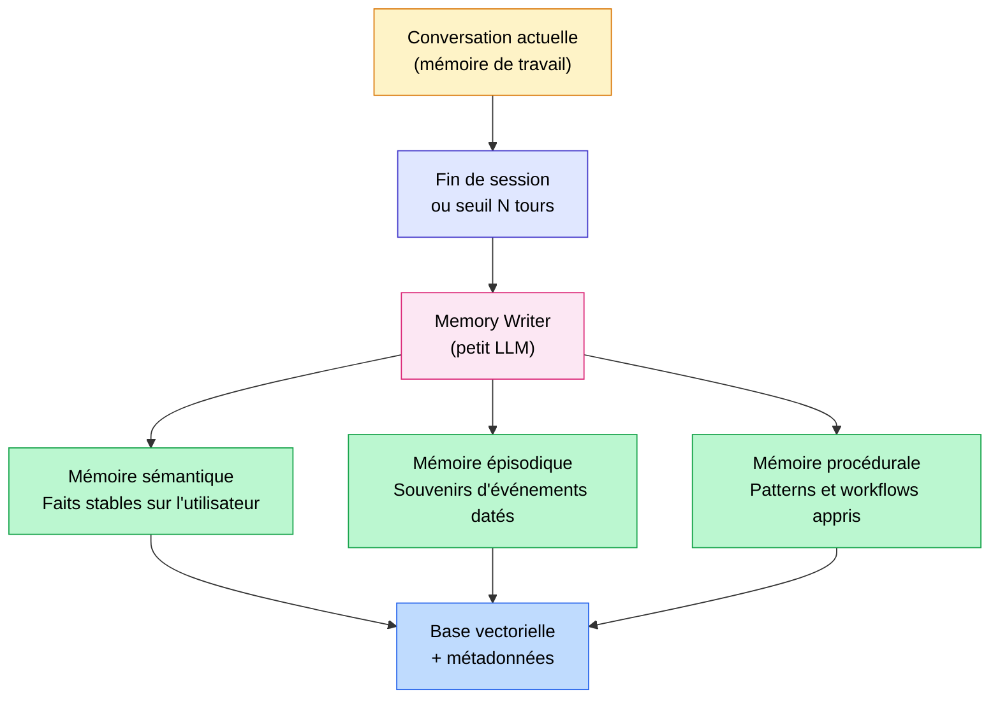
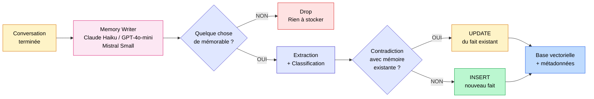

Sans mémoire, un agent IA est juste un meilleur chatbot.

Avec une mémoire mal conçue, c'est un agent qui invente des souvenirs, contredit ce qu'il a dit la semaine dernière, et vous coûte une fortune en tokens. La mémoire est la fonctionnalité la plus sous-estimée des agents IA en 2026. Et c'est aussi celle qui fait la différence entre un prototype sympa et un produit qui crée vraiment de la valeur.

Dans cet article, je vais vous expliquer la taxonomie réelle de la mémoire dans les agents IA, le pattern technique central que très peu de gens expliquent clairement (un petit LLM dédié qui filtre ce qui mérite d'être retenu), les outils du marché avec leurs vrais chiffres de benchmark, et comment choisir selon votre cas.

<!-- more -->

> La mémoire est une brique clé des agents. Pour l'ensemble de l'architecture, voir le [guide Agents IA](/agents-ia/).

***

## Sommaire

1. [Pourquoi la mémoire est devenue le sujet n°1 des agents IA](#pourquoi-la-mémoire-est-devenue-le-sujet-n1-des-agents-ia)
2. [Les 4 types de mémoire à connaître](#les-4-types-de-mémoire-à-connaître-taxonomie-claire)
3. [Le pattern central : le memory writer](#le-pattern-central-que-peu-de-gens-expliquent-le-memory-writer)
4. [Le pattern de récupération : le memory retriever](#le-pattern-de-récupération-le-memory-retriever)
5. [Les outils du marché en 2026](#les-outils-du-marché-en-2026)
6. [Mon avis pragmatique : quoi choisir selon le cas](#mon-avis-pragmatique-quoi-choisir-selon-le-cas)
7. [Les pièges classiques](#les-pièges-classiques-avec-retour-dexpérience)
8. [Sécurité et vie privée (RGPD)](#sécurité-et-vie-privée-rgpd)
9. [FAQ](#faq-10-questions-sur-la-mémoire-des-agents-ia)
10. [Pour aller plus loin](#pour-aller-plus-loin)

***

## Pourquoi la mémoire est devenue le sujet n°1 des agents IA

Les LLMs sont **fondamentalement stateless**.

À chaque appel API, le modèle repart de zéro. Il ne se souvient de rien. Vous lui avez dit votre prénom hier, votre secteur d'activité il y a une semaine, vos contraintes métier il y a un mois : pour lui, c'est comme si ça n'avait jamais existé.

La fenêtre de contexte n'est pas une solution à ce problème, contrairement à ce qu'on lit souvent. Oui, les modèles récents ont des contextes de 128k, 200k, voire 1M de tokens. Mais ce n'est pas de la mémoire : c'est du stockage temporaire, coûteux, lent à traiter, et qui disparaît dès que la session se termine.

**Sans mémoire propre**, voici ce qui se passe en pratique :

- L'utilisateur doit tout répéter à chaque nouvelle session (préférences, contexte, historique)
- L'agent répond comme s'il vous rencontrait pour la première fois, à chaque fois
- L'expérience est cassée dès la deuxième interaction

**Avec une mémoire mal pensée**, les problèmes sont différents mais tout aussi sérieux :

- L'agent accumule du bruit et finit par "savoir" des choses fausses
- Des contradictions s'installent dans la mémoire sans mécanisme de résolution
- Le coût en tokens explose parce qu'on injecte trop de contexte mémorisé

En 2026, la mémoire des agents IA a ses propres benchmarks (LongMemEval, LoCoMo), sa propre littérature de recherche, et un écosystème d'outils en croissance rapide. Ce n'est plus un sujet académique, c'est une question d'ingénierie qui se pose sur chaque projet d'agent sérieux.

Si vous n'êtes pas encore à l'aise avec ce qu'est un agent IA, commencez par [mon article sur les fondements des agents IA](c-est-quoi-un-agent-ia.md) avant de continuer. Et si vous voulez d'abord voir le principe côté grand public, j'explique [comment ChatGPT et Claude se souviennent de vous d'une conversation à l'autre](comment-chatgpt-se-souvient-de-vous.md) : c'est exactement la version concrète de ce que cet article détaille en profondeur.

***

## Les 4 types de mémoire à connaître (taxonomie claire)

Il y a une confusion fréquente entre tous ces termes. Voici la taxonomie qui fait consensus en 2026 :

| Type | Définition | Exemple concret | Durée | Stockage typique |
|---|---|---|---|---|
| **Mémoire de travail** (court terme) | Le contexte de la conversation en cours | Les 10 derniers messages échangés | Session uniquement | Buffer en mémoire vive |
| **Mémoire sémantique** | Faits stables sur l'utilisateur ou le monde | "Anas travaille à Toulouse, préfère Python" | Permanente | Base vectorielle ou KV store |
| **Mémoire épisodique** | Souvenirs d'événements passés avec contexte temporel | "Le 12 mars, on a discuté d'une migration vers GCP" | Long terme | Base vectorielle avec timestamp |
| **Mémoire procédurale** | Patterns et workflows appris | "Pour ce client, toujours envoyer un récap après chaque réunion" | Long terme | Base vectorielle ou base de règles |

Le schéma ci-dessous illustre comment ces types de mémoire s'articulent :



**La mémoire de travail** est simple à implémenter : c'est le tableau de messages que vous envoyez déjà au modèle. Le défi, c'est de savoir quand élaguer cette fenêtre pour ne pas dépasser les limites de contexte ni exploser les coûts.

**La mémoire sémantique** contient les faits qui ne changent pas souvent. "Anas est consultant IA à Toulouse et travaille principalement avec des PME industrielles." Ce type de fait mérite d'être stocké, indexé, et récupéré à chaque conversation pertinente.

**La mémoire épisodique** contient ce qui s'est passé, avec le contexte temporel. La date compte. "En janvier, on a décidé de ne pas migrer vers Pinecone à cause du coût." Six mois plus tard, la situation a peut-être changé.

**La mémoire procédurale** est souvent oubliée dans les implémentations. Elle capture les patterns comportementaux appris : "Quand cet utilisateur pose une question technique, il préfère une réponse en code plutôt qu'une explication narrative." Ce type de mémoire améliore la qualité des réponses sur le long terme, au-delà du simple rappel de faits.

***

## Le pattern central que peu de gens expliquent : le memory writer

C'est la section que j'aurais aimé trouver quand j'ai commencé à travailler sur la mémoire d'agents en production.

La question concrète est simple : comment décider ce qui mérite d'être mémorisé ?

La réponse naïve : tout sauvegarder. C'est catastrophique. Vous accumulez du bruit, des redondances, des contradictions. La qualité de récupération chute. Le coût monte.

La bonne réponse : utiliser **un petit LLM dédié**, qu'on appelle le memory writer, qui agit comme un filtre intelligent entre la conversation et la mémoire longue durée.

### Comment fonctionne le memory writer

Le memory writer reçoit chaque interaction (ou un groupe d'interactions) et prend une décision active :

1. **Filtrage** : est-ce qu'il y a dans cet échange quelque chose qui mérite d'être mémorisé long terme ?
2. **Extraction** : si oui, extraire l'information pertinente sous forme atomique (1 fait = 1 phrase courte)
3. **Classification** : catégoriser le fait (sémantique, épisodique, procédural)
4. **Vérification anti-contradiction** : chercher dans la mémoire existante si ce fait entre en conflit avec autre chose
5. **Stockage** : écrire avec embedding + métadonnées (date, catégorie, score de confiance)



### Les choix critiques d'implémentation

**Quel LLM pour le writer ?**

Pas besoin de votre modèle principal. Un modèle rapide et peu coûteux suffit largement : Claude Haiku, GPT-4o-mini, Mistral Small. Le memory writer fait une tâche précise et bien définie, pas de la génération créative. En pratique, Claude Haiku 3.5 ou GPT-4o-mini gèrent très bien cette tâche pour une fraction du coût.

**Quand déclencher le memory writer ?**

Trois approches possibles :

- **À chaque tour** : précis mais coûteux, à réserver aux cas critiques
- **Toutes les N interactions** (souvent 5 à 10) : bon compromis coût/qualité
- **En fin de session** : le plus économique, suffisant pour la majorité des cas

En production, la fin de session est le choix par défaut raisonnable. Pour des agents de support client avec des sessions longues et denses, toutes les 10 interactions est un bon compromis.

**Format de stockage**

C'est crucial et souvent mal fait : **des faits courts et atomiques**, pas des résumés longs.

- Bien : "Anas préfère les réunions le matin avant 10h"
- Mal : "Anas semble être quelqu'un qui apprécie avoir ses échanges professionnels organisés en début de journée, ce qui lui permettrait de garder ses après-midis libres pour le travail en profondeur"

Un fait atomique est précis, cherchable, et facile à mettre à jour. Un résumé long est flou, difficile à indexer, et impossible à corriger proprement.

**Le resolver de contradictions**

Si le nouveau fait contredit un fait existant, vous ne l'ajoutez pas en doublon. Vous mettez à jour l'entrée existante. "Anas travaille à Paris" suivi de "Anas a déménagé à Toulouse en mars" ne doivent pas coexister dans la mémoire.

### Code conceptuel du memory writer

Voici un exemple Python conceptuel qui illustre le pattern, indépendant de toute bibliothèque spécifique :

```python
import json
from anthropic import Anthropic

client = Anthropic()

MEMORY_WRITER_SYSTEM = """Tu es un extracteur de mémoire pour un agent IA.

Analyse la conversation fournie et extrais UNIQUEMENT les faits qui méritent
d'être mémorisés long terme : préférences stables, décisions importantes,
informations personnelles, contexte métier durable.

Ignore : les échanges de politesse, les questions ponctuelles sans intérêt durable,
les informations temporaires.

Pour chaque fait mémorable, retourne un JSON avec :
- text: le fait en une phrase courte et précise
- type: "semantic" | "episodic" | "procedural"
- confidence: score entre 0 et 1

Retourne une liste JSON. Si rien ne mérite d'être mémorisé, retourne [].
"""

def extract_memories(conversation: list[dict]) -> list[dict]:
    """Extrait les faits mémorables d'une conversation avec un petit LLM."""
    response = client.messages.create(
        model="claude-haiku-4-5",
        max_tokens=1000,
        system=MEMORY_WRITER_SYSTEM,
        messages=[{
            "role": "user",
            "content": f"Conversation à analyser :\n\n{json.dumps(conversation, ensure_ascii=False)}"
        }]
    )
    try:
        return json.loads(response.content[0].text)
    except json.JSONDecodeError:
        return []


def resolve_and_store(new_memory: dict, vector_db, similarity_threshold: float = 0.92):
    """
    Vérifie les contradictions et stocke le nouveau fait.
    Si un fait similaire existe déjà, on met à jour plutôt qu'ajouter.
    """
    similar_memories = vector_db.search(
        query=new_memory["text"],
        k=3,
        threshold=similarity_threshold
    )

    if similar_memories:
        # Mise à jour du fait le plus proche (anti-contradiction)
        most_similar = similar_memories[0]
        vector_db.update(
            id=most_similar["id"],
            new_text=new_memory["text"],
            metadata={
                "type": new_memory["type"],
                "confidence": new_memory["confidence"],
                "updated_at": "2026-05-19"
            }
        )
    else:
        # Nouveau fait : insertion directe
        vector_db.insert(
            text=new_memory["text"],
            metadata={
                "type": new_memory["type"],
                "confidence": new_memory["confidence"],
                "created_at": "2026-05-19"
            }
        )


def run_memory_writer(conversation: list[dict], vector_db):
    """Point d'entrée principal du memory writer."""
    memories = extract_memories(conversation)
    for memory in memories:
        if memory.get("confidence", 0) > 0.7:  # Seuil de confiance
            resolve_and_store(memory, vector_db)
    return len(memories)
```

Ce pattern peut s'adapter à n'importe quelle stack : LangGraph, LlamaIndex, ou un pipeline custom. L'essentiel est la séparation entre le LLM principal (qui répond) et le memory writer (qui filtre et stocke).

***

## Le pattern de récupération : le memory retriever

Écrire en mémoire, c'est la moitié du travail. L'autre moitié, c'est de lire au bon moment.

À chaque nouvelle interaction, le memory retriever fait une recherche dans la mémoire longue durée à partir du message utilisateur. Il récupère les N faits les plus pertinents et les injecte en début de system prompt.

```
System prompt :
"Voici ce que tu sais sur cet utilisateur :
- Anas est consultant IA freelance basé à Toulouse
- Il préfère les réponses en Python plutôt qu'en pseudo-code
- En mars, on a décidé ensemble de ne pas utiliser LangChain pour son projet BTP
[...]
Réponds maintenant à sa question en tenant compte de ce contexte."
```

### Les pièges du retriever

**Trop de mémoires injectées** : au-delà de 10-15 faits dans le contexte, la qualité de réponse du LLM commence à dégrader. Le modèle se perd dans les informations. Fixez un plafond strict.

**Pas assez** : si votre seuil de similarité est trop élevé, l'agent n'injectera rien alors qu'il existe des faits pertinents légèrement reformulés. Trop restrictif, c'est autant de mémoire perdue.

**Pas de filtrage par type** : si l'utilisateur pose une question technique, il faut prioritairement récupérer les mémoires de type "procedural" et "semantic" techniques, pas des épisodes anciens hors sujet.

En pratique, le bon compromis en 2026 est de 5 à 10 mémoires, avec un seuil de similarité cosinus autour de 0.75, et un filtrage par type de mémoire selon le contexte de la question. L'algorithme multi-signaux de Mem0 (similarité vectorielle + BM25 + correspondance d'entités) donne de bons résultats pour environ 6 900 tokens par requête, contre 26 000 pour une approche plein contexte.

Pour aller plus loin sur la récupération vectorielle dans les systèmes IA, lisez [mon article sur l'Agentic RAG](agentic-rag-vs-rag-classique.md) qui explique les patterns de retrieval agentique en détail.

***

## Les outils du marché en 2026

Le marché s'est bien structuré. Voici les acteurs principaux avec leurs vraies forces, leurs vraies faiblesses, et des chiffres de benchmark récents.

### Tableau comparatif

| Outil | Architecture | Open source | LoCoMo (benchmark) | Forces | Faiblesses |
|---|---|---|---|---|---|
| **Mem0** | Vector DB + graph, multi-scope | Oui (Apache 2.0) + cloud | ~58% | API simple, 21 frameworks supportés, actif (24M$ Series A oct. 2025) | Benchmark plus faible que Zep/Letta, lock-in léger sur format cloud |
| **Zep** | Temporal Knowledge Graph | OSS + cloud | ~85% (GPT-4o) | Excellent pour les relations entités dans le temps, meilleur benchmark | Stack plus lourde, features avancées payantes |
| **Letta** (ex-MemGPT) | OS-inspired (RAM/disque/archive) | Oui | ~83% | Concept élégant, contrôle LLM sur sa propre mémoire, très flexible | Courbe d'apprentissage élevée, setup complexe |
| **LlamaIndex Memory** | Buffer + vector store intégré | Oui | N/A | Bien intégré aux pipelines RAG LlamaIndex existants | Peu pratique en standalone, API instable, moins puissant seul |
| **LangGraph + LangMem** | Checkpointer + store | Oui | N/A | Contrôle total, parfait si vous êtes déjà sur LangGraph | Quasi-inutilisable en dehors de LangGraph |
| **Pattern custom** | Code maison sur pgvector/Qdrant | Oui | Variable | Adaptation parfaite au métier, pas de dépendance externe | Effort de développement important |

### Mem0 : l'option pragmatique

Mem0 est aujourd'hui l'option avec le moins de friction. L'API est claire, la documentation est bonne, et le support de 21 frameworks différents (LangChain, CrewAI, LlamaIndex, AutoGen, OpenAI Agents SDK...) en fait une option naturelle quand on veut ajouter de la mémoire sans refondre son architecture.

Le point faible est le benchmark : 58% sur LongMemEval indépendant contre 71-85% pour Zep. En pratique, pour la majorité des cas d'usage de mémoire utilisateur (préférences, contexte métier, historique de décisions), cette différence ne se traduit pas forcément par une dégradation visible. Mais pour des cas précis avec des relations temporelles complexes entre entités, Zep est plus adapté.

### Zep : le meilleur pour les relations temporelles

Zep se distingue par son Temporal Knowledge Graph : il stocke non seulement les faits, mais aussi comment ils évoluent dans le temps et les relations entre entités. "Marie est responsable du projet Alpha depuis janvier, anciennement sur le projet Beta" : Zep gère ça proprement, là où un simple vector store stockerait deux faits contradictoires sans comprendre la relation.

Son score LoCoMo de 85% (GPT-4o) est le meilleur du marché en 2026. Si votre cas d'usage implique des relations complexes entre personnes, projets, et décisions dans le temps, Zep est probablement la bonne réponse.

### Letta (ex-MemGPT) : l'approche la plus rigoureuse

Letta a une approche conceptuellement très différente : inspirée des systèmes d'exploitation, elle divise la mémoire en couches (mémoire vive / RAM, rappel / recall, archive). Le LLM lui-même décide quand "paginer" des informations entre ces couches.

C'est l'option la plus flexible et la plus intéressante d'un point de vue académique. Le LLM a un contrôle total sur sa propre mémoire, ce qui permet des comportements très sophistiqués. En contrepartie, la courbe d'apprentissage est élevée et le setup initial est significatif.

### LlamaIndex Memory

Honnêtement, LlamaIndex Memory n'est vraiment utile que si vous êtes déjà fortement investis dans l'écosystème LlamaIndex. En standalone, ses abstractions sont moins pratiques que Mem0 ou Zep. Si vous travaillez déjà avec LlamaIndex pour du RAG documentaire, c'est une option naturelle. Sinon, préférez Mem0 ou un pattern custom. Pour comprendre comment le RAG documentaire et la mémoire d'agent s'articulent, mon article sur l'[Agentic RAG vs RAG classique](agentic-rag-vs-rag-classique.md) clarifie bien la frontière.

***

## Mon avis pragmatique : quoi choisir selon le cas

Voici mes recommandations directes, issues de projets réels.

**Vous montez un prototype rapidement**

Partez sur Mem0. L'intégration prend quelques heures, l'API est bien documentée, et vous verrez tout de suite si la mémoire améliore votre agent. Ne cherchez pas à optimiser avant d'avoir validé que la mémoire apporte de la valeur sur votre cas d'usage.

**Vous construisez une application grand public avec mémoire utilisateur**

Mem0 ou Zep. Si votre cas implique principalement des préférences et du contexte conversationnel simple : Mem0. Si vous avez des relations complexes entre entités ou des exigences de traçabilité temporelle : Zep.

**Agent expert métier en entreprise (déploiement interne)**

Pattern custom sur LangGraph avec la base vectorielle que vous avez déjà (Qdrant, pgvector, Weaviate). Vous avez probablement déjà une infra, des contraintes de sécurité, des données qui ne doivent pas sortir. Le pattern custom vous donne le contrôle total et s'intègre naturellement à votre stack existante. L'effort initial est plus important, mais la maîtrise sur le long terme est bien meilleure.

**Support client multi-session ou agents conversationnels très longs**

Zep ou Letta. La gestion temporelle et l'évolution des faits dans le temps font une vraie différence dans ces contextes.

**Recherche et expérimentation d'architectures de mémoire**

Letta. C'est de loin le framework le plus riche pour explorer et comprendre les mécanismes de mémoire des agents. Pas le plus simple à mettre en production, mais le plus instructif.

***

## Les pièges classiques (avec retour d'expérience)

### 1. Tout sauvegarder par défaut

C'est le piège le plus fréquent. On se dit "stockons tout, on triera plus tard". En réalité, plus vous avez de faits en mémoire, plus la qualité de récupération baisse. La précision chute parce que les requêtes remontent des faits non pertinents. Instaurez le memory writer dès le début, pas après coup.

### 2. Pas de mécanisme anti-contradiction

Sans resolver de contradictions, votre agent finit par "savoir" des choses fausses. L'utilisateur déménage, change de poste, change d'avis sur une technologie : si vous n'updatez pas les faits existants, vous accumulez des contradictions silencieuses. L'agent répond en se basant sur de l'information obsolète et n'en sait rien.

### 3. Pas de catégorisation de la mémoire

Stocker tout dans un seul espace vectoriel sans distinguer les types de mémoire, c'est mélanger les torchons et les serviettes. Une recherche sur les préférences de l'utilisateur va remonter des épisodes anciens et du contexte procédural en vrac. La catégorisation (semantic / episodic / procedural) permet de faire des requêtes ciblées et d'obtenir des résultats bien plus pertinents.

### 4. Confondre mémoire d'agent et RAG métier

C'est une confusion fréquente. La mémoire d'agent concerne **l'utilisateur et l'agent** : préférences, historique d'interactions, décisions prises ensemble. Le RAG concerne **les documents et la base de connaissance métier** : normes, procédures, produits, contrats. Les deux coexistent dans un système complet, mais répondent à des besoins différents et s'implémentent différemment. Pour clarifier cette distinction, lisez mon article sur le [RAG et ses cas d'usage](mais-que-es-le-rag.md).

### 5. Pas de mécanisme d'expiration ou de révision

Les préférences changent. Les contextes évoluent. Un fait mémorisé "Anas préfère ne pas utiliser LangChain" peut devenir faux un an plus tard. Sans mécanisme de révision ou d'expiration, votre mémoire devient un musée de faits obsolètes. Ajoutez au minimum un timestamp sur chaque fait, et un score de confiance qui décroît avec le temps pour les faits non récemment confirmés.

### 6. Injecter trop de mémoires dans le contexte

Récupérer 50 faits et les injecter tous dans le system prompt, c'est contre-productif. Le LLM se perd dans le volume, et la qualité de réponse baisse. Fixez un plafond (5 à 10 faits maximum), appliquez un seuil de similarité, et priorisez par type selon le contexte.

***

## Sécurité et vie privée (RGPD)

Court mais non négociable.

Stocker la mémoire d'un agent, c'est stocker des données personnelles. Préférences, habitudes, décisions, contexte professionnel : tout cela entre dans la catégorie des données à caractère personnel au sens du RGPD.

**Ce que vous devez prévoir dès la conception :**

- **Droit à l'effacement** : un endpoint qui supprime l'intégralité de la mémoire d'un utilisateur en une opération. Pas optionnel.
- **Chiffrement au repos** : les embeddings et les textes des faits mémorisés doivent être chiffrés dans votre base de données.
- **Minimisation des données** : ne mémorisez que ce qui est nécessaire au service rendu. Le memory writer doit avoir des instructions explicites sur ce qu'il ne doit pas stocker (données de santé, financières, etc. sans base légale).
- **Localisation des données** : si vous opérez pour des entreprises françaises ou européennes, vérifiez que vos bases de données de mémoire sont hébergées dans l'UE. C'est un point de friction réel avec certains fournisseurs cloud.
- **Transparence** : les utilisateurs doivent savoir que l'agent mémorise des informations, et pouvoir accéder à ce qui est stocké sur eux.

Le RGPD n'est pas une contrainte à gérer "après". La mémoire d'agent amplifie les enjeux de protection des données : anticipez-le dans votre architecture.

***

## FAQ : 10 questions sur la mémoire des agents IA

**C'est quoi la mémoire d'un agent IA ?**

La mémoire d'un agent IA est la capacité de conserver et de récupérer des informations entre plusieurs sessions de conversation. Sans mémoire, chaque session repart de zéro. Avec une mémoire bien conçue, l'agent se souvient des préférences de l'utilisateur, du contexte métier, et de l'historique des décisions prises ensemble.

**Quelle est la différence entre mémoire d'agent et RAG ?**

Le RAG est un système de récupération d'information dans une base documentaire (normes, procédures, produits). La mémoire d'agent concerne les informations sur l'utilisateur et le contexte relationnel entre l'agent et l'utilisateur. Les deux peuvent coexister dans un système complet, mais répondent à des besoins très différents.

**Faut-il toujours une base vectorielle pour la mémoire d'un agent ?**

Non. Pour une mémoire simple (quelques dizaines de faits par utilisateur), un KV store ou même une table SQL avec recherche basique peut suffire. La base vectorielle devient utile quand le volume de faits est important et que vous avez besoin de récupération sémantique ("retrouve les faits similaires à cette question"). Au-delà de quelques centaines de faits par utilisateur, la recherche vectorielle s'impose.

**Mem0 ou Letta : lequel choisir ?**

Si vous voulez démarrer vite avec peu de friction : Mem0. Si vous avez besoin d'un contrôle très fin sur les mécanismes de mémoire et que vous êtes prêt à investir du temps dans le setup : Letta. Les benchmarks LoCoMo donnent Letta à 83% et Mem0 à 58%, mais Mem0 reste le choix pragmatique pour la majorité des projets.

**Comment éviter qu'un agent IA invente des souvenirs ?**

En implémentant un resolver de contradictions dans votre memory writer : avant d'ajouter un nouveau fait, on cherche dans la mémoire existante s'il y a un fait similaire ou contradictoire. Si oui, on met à jour plutôt qu'ajouter. On évite aussi de stocker des déductions ou des inférences de l'agent, uniquement des faits explicitement mentionnés ou confirmés par l'utilisateur.

**Combien coûte la mémoire d'un agent en production ?**

Le coût dépend de trois éléments : le coût du memory writer (un petit modèle, très faible), le coût d'embedding (faible), et le coût d'injection des mémoires dans le contexte (tokens supplémentaires par requête). L'approche multi-signaux de Mem0 utilise environ 6 900 tokens par requête vs 26 000 pour une approche plein contexte. Pour 10 000 requêtes par mois, la différence est significative.

**Comment respecter le RGPD avec un agent à mémoire ?**

Prévoyez dès la conception : un endpoint de suppression complète par utilisateur, le chiffrement au repos, la minimisation des données mémorisées, et la transparence envers l'utilisateur sur ce qui est stocké. Ne stockez jamais de données sensibles (santé, finances) sans base légale explicite.

**Quelle base vectorielle choisir pour la mémoire d'agent ?**

Qdrant et pgvector sont les deux options les plus courantes en 2026. Qdrant est excellent pour les déploiements dédiés avec de gros volumes. pgvector est idéal si vous avez déjà PostgreSQL dans votre stack : vous évitez une nouvelle dépendance. Pinecone et Weaviate sont des options cloud-first si vous ne voulez pas gérer l'infrastructure.

**Faut-il un knowledge graph pour la mémoire d'un agent ?**

Pas par défaut. Un knowledge graph (comme le Temporal Knowledge Graph de Zep) apporte une vraie valeur quand vous avez des relations complexes entre entités qui évoluent dans le temps. Pour la majorité des cas (préférences utilisateur, contexte conversationnel), une base vectorielle simple avec de bonnes métadonnées est suffisante.

**Comment tester la mémoire d'un agent IA ?**

Deux benchmarks font référence en 2026 : LongMemEval (évaluation sur des conversations longues avec questions sur des faits mémorisés) et LoCoMo (Long Conversation Memory). Pour vos propres tests : créez un set de conversations synthétiques avec des faits connus, lancez votre agent en session ultérieure, et vérifiez qu'il récupère correctement les faits pertinents. Testez aussi explicitement les cas de contradiction et de mise à jour.

***

## Pour aller plus loin

- **[Mais c'est quoi un agent IA ?](c-est-quoi-un-agent-ia.md)** : la base pour comprendre ce qu'est un agent avant de s'attaquer à sa mémoire
- **[Agentic RAG vs RAG classique](agentic-rag-vs-rag-classique.md)** : comment les agents récupèrent de l'information dans des documents, à distinguer de la mémoire utilisateur
- **[MCP : le standard qui change les agents IA](mcp-model-context-protocol-agents-ia.md)** : le protocole qui permet à un agent de brancher des outils externes, dont des systèmes de mémoire
- **[Cas client BTP : RAG multi-sources pour les appels d'offres](cas-usage-rag-redaction-appels-offres-btp.md)** : un exemple concret d'agent multi-sources en production, avec les questions de contexte persistant que ça soulève

***

Si mes articles vous intéressent et que vous avez des questions ou simplement envie de discuter de vos propres défis, n'hésitez pas à m'écrire à [anas@tensoria.fr](mailto:anas@tensoria.fr), j'aime échanger sur ces sujets !

Vous pouvez aussi [réserver un créneau d'échange](https://cal.eu/anas-rabhi/rendez-vous-ianas) ou vous abonner à ma newsletter :)


---

### À propos de moi

Je suis **Anas Rabhi**, consultant Data Scientist freelance. J'accompagne les entreprises dans leur stratégie et mise en œuvre de solutions d'IA (RAG, Agents, NLP).

Découvrez mes services sur [tensoria.fr](https://tensoria.fr) ou testez notre solution d'agents IA [heeya.fr](https://heeya.fr).

<div style="text-align: center; margin: 40px 0; gap: 16px; display: flex; flex-wrap: wrap; justify-content: center;">
  <a href="https://cal.eu/anas-rabhi/rendez-vous-ianas" target="_blank" style="display: inline-block; background-color: #4F46E5; color: #ffffff; font-weight: bold; padding: 16px 32px; text-decoration: none; border-radius: 8px; font-size: 18px; letter-spacing: 0.8px; box-shadow: 0 6px 12px rgba(0, 0, 0, 0.2); transition: all 0.3s ease; border: none;">
    Réserver un créneau
  </a>
  <a href="https://anas-ai.kit.com/d8b1a255cc" target="_blank" style="display: inline-block; background-color: #222222; color: #ffffff; font-weight: bold; padding: 16px 32px; text-decoration: none; border-radius: 8px; font-size: 18px; letter-spacing: 0.8px; box-shadow: 0 6px 12px rgba(0, 0, 0, 0.2); transition: all 0.3s ease; border: none;">
    <span style="margin-right: 10px;">✉️</span> S'abonner à ma newsletter
  </a>
</div>
