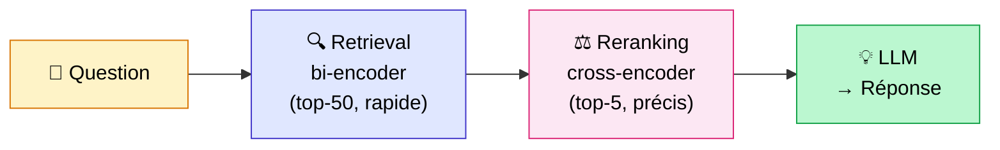

## Vous optimisez probablement dans le mauvais sens

Quand un RAG ne fonctionne pas bien, voici ce que font 90% des équipes : elles changent le prompt.

On reformule les instructions, on essaie différents modèles, on ajuste la température. Et parfois ça aide un peu. Mais le plus souvent, le problème n'est pas là.

Jason Liu, l'un des experts RAG les plus suivis, a une formulation que j'ai trouvée juste : *"Avant de toucher à quoi que ce soit, atteignez 97% de recall en retrieval."*

97% de recall, ça veut dire que dans 97 cas sur 100, le chunk qui contient la bonne réponse est bien dans les résultats que vous passez au LLM. Si vous n'êtes pas là, le meilleur prompt du monde ne changera rien. Le LLM ne peut pas inventer une information qui n'est pas dans son contexte.

Le vrai ordre d'optimisation d'un RAG, c'est : **mesurer d'abord, puis retrieval, puis génération**. Pas l'inverse.

<!-- more -->

***

## Avant d'optimiser : établir une baseline

C'est l'étape que tout le monde saute. Et c'est pour ça que les projets RAG stagnent sans qu'on comprenne pourquoi.

**Les 3 métriques essentielles :**

- **Hit Rate** : est-ce que le bon chunk est parmi les top-K résultats ? C'est votre mesure de base en retrieval. Si le bon chunk n'est pas récupéré, tout le reste est inutile.
- **MRR (Mean Reciprocal Rank)** : le bon chunk est-il bien classé dans les résultats ? Être récupéré en position 1 vs position 10, ça change la qualité de la réponse finale.
- **Faithfulness** (génération) : la réponse générée est-elle réellement fondée sur les chunks fournis, ou le LLM hallucine-t-il ?

**RAGAS en pratique**

RAGAS est la librairie standard pour évaluer un pipeline RAG de bout en bout. Elle calcule automatiquement ces métriques à partir d'un jeu de questions-réponses de référence.

```python
from ragas import evaluate
from ragas.metrics import faithfulness, answer_relevancy, context_precision, context_recall
from datasets import Dataset

# Votre jeu d'évaluation : questions + réponses attendues
eval_data = Dataset.from_dict({
    "question": ["votre question 1", "votre question 2"],
    "answer": ["réponse générée 1", "réponse générée 2"],
    "contexts": [["chunk1", "chunk2"], ["chunk3"]],
    "ground_truth": ["réponse attendue 1", "réponse attendue 2"],
})

result = evaluate(eval_data, metrics=[
    faithfulness,
    answer_relevancy,
    context_precision,
    context_recall,
])
print(result)
```

**Le minimum viable** : 30 à 50 questions représentatives des vraies requêtes de vos utilisateurs. Pas besoin d'un dataset de 10 000 exemples pour avoir une idée claire de où vous en êtes. J'en parle plus en détail dans [les 5 erreurs que tout le monde fait avec le RAG](les-5-erreurs-rag.md) (c'est l'erreur n°5, la plus silencieuse).

Une fois la baseline établie, voici dans quel ordre appliquer les optimisations.

***

## Phase 1 — Améliorer la requête avant la recherche

Le retrieval vectoriel encode le sens de votre question et cherche les chunks similaires. Le problème : les questions utilisateurs sont souvent courtes, ambiguës, mal formulées. Et les documents, eux, sont longs et riches en contexte.

Ce déséquilibre crée un problème de représentation : l'embedding d'une question courte ne ressemble pas à l'embedding du document qui y répond.

Les techniques de pre-retrieval attaquent ce problème.

### Technique 1 — HyDE : chercher avec un document hypothétique

**Le mécanisme** : au lieu d'embedder votre question, on demande d'abord au LLM de générer un "document hypothétique" qui répondrait idéalement à cette question. Puis on embède ce document hypothétique pour chercher dans votre base.

Pourquoi ça marche : un document hypothétique ressemble sémantiquement à un vrai document. L'embedding de "voici comment fonctionne la procédure ISO-27001 pour les accès distants..." est beaucoup plus proche des vrais chunks techniques que l'embedding de "procédure ISO-27001 accès distants ?".

```python
from langchain_core.prompts import ChatPromptTemplate
from langchain_openai import ChatOpenAI

hyde_prompt = ChatPromptTemplate.from_template(
    "Écris un court extrait de documentation qui répondrait précisément à cette question : {question}\n"
    "Réponds directement, sans introduction."
)
llm = ChatOpenAI(model="gpt-4o-mini", temperature=0)

# Le document hypothétique devient votre requête d'embedding
hypothetical_doc = (hyde_prompt | llm).invoke({"question": question}).content
results = vectorstore.similarity_search(hypothetical_doc, k=5)
```

**Gain mesuré** : +5 à +15% sur les requêtes courtes et ambiguës.

**Quand l'utiliser** : corpus techniques avec du jargon, ou quand vos utilisateurs formulent des questions très courtes ("procédure ISO ?", "config Redis ?"). Ne change rien sur des questions déjà bien formulées.

---

### Technique 2 — Multi-Query + RAG-Fusion

**Le mécanisme** : générer N reformulations de la même question, lancer chaque reformulation en parallèle, fusionner les résultats avec RRF.

L'idée : si vous posez la même question de 5 façons différentes, vous maximisez les chances de tomber sur un angle qui ressemble aux chunks pertinents.

```python
from langchain.retrievers.multi_query import MultiQueryRetriever
from langchain_openai import ChatOpenAI

llm = ChatOpenAI(model="gpt-4o-mini", temperature=0)

retriever = MultiQueryRetriever.from_llm(
    retriever=vectorstore.as_retriever(search_kwargs={"k": 5}),
    llm=llm,
)
# Génère automatiquement 3 reformulations et fusionne les résultats
results = retriever.invoke("votre question")
```

**Gain mesuré** : +5 à +10% de recall sur les requêtes mal formulées.

**Quand l'utiliser** : quand vous analysez vos logs et constatez que les utilisateurs posent leurs questions de façon imprévisible.

---

### Technique 3 — Step-Back Prompting

Pour les questions très spécifiques, le retrieval rate parfois parce qu'il n'y a pas de chunk qui parle exactement de ce cas précis, mais il y a des chunks qui couvrent le principe général.

**Le mécanisme** : avant de chercher sur la question précise, on génère aussi une version "abstraite" de la question et on récupère du contexte sur les deux.

Exemple :
- Question précise : "Pourquoi mon embedding ada-002 tronque à 512 tokens ?"
- Question step-back : "Comment fonctionne la limite de tokens des modèles d'embedding ?"

On lance les deux recherches et on fournit les deux contextes au LLM.

**Quand l'utiliser** : questions très techniques ou très spécifiques qui nécessitent du contexte de principe pour être répondues correctement.

***

## Phase 2 — Améliorer ce qu'on récupère

### Technique 4 — Hybrid Search BM25 + vectoriel

C'est probablement l'optimisation avec le meilleur rapport gain/effort. Le vectoriel seul rate systématiquement les requêtes avec du jargon métier, des normes, des codes produit. BM25 les capture parfaitement.

Les benchmarks : +10% NDCG vs vectoriel seul (Microsoft Azure, BEIR), jusqu'à +48% quand couplé au reranking.

J'ai consacré un article entier à cette technique (implémentation avec LangChain, LlamaIndex et Weaviate, benchmarks détaillés, et quand choisir SPLADE ou BGE-M3 plutôt que BM25 classique) : **[RAG hybride BM25 + vectoriel : comment l'implémenter](rag-hybride-bm25-vectoriel.md)**.

---

### Technique 5 — Contextual Retrieval (Anthropic, 2024)

C'est la technique qui a produit les plus grands gains dans tous les benchmarks que j'ai vus, et c'est aussi la plus méconnue en France.

**Le problème qu'elle résout** : vos chunks sont anonymes. "Le chiffre d'affaires a augmenté de 3%" — de quelle entreprise ? Sur quelle période ? Sans ce contexte, l'embedding de ce chunk est flottant et difficile à retrouver au bon moment.

**Le mécanisme** : avant d'embedder chaque chunk, un LLM génère 50 à 100 tokens de contexte qui situent ce chunk dans son document original.

```
<document>
{{DOCUMENT_ENTIER}}
</document>

Voici le chunk à contextualiser :
<chunk>
{{CHUNK}}
</chunk>

En 1 à 2 phrases courtes, situe ce chunk dans le document.
Ne répète pas le contenu. Réponds directement.
```

Le chunk final = contexte généré + chunk original. C'est ce texte enrichi qui est embedé.

**Les benchmarks Anthropic** (taux d'échec sur top-20 chunks, baseline : 5.7%) :

| Technique | Taux d'échec | Réduction |
|---|---|---|
| Baseline | 5.7% | — |
| + Contextual Embeddings | 3.7% | **−35%** |
| + BM25 contextuel | 2.9% | **−49%** |
| + Reranking | 1.9% | **−67%** |

**Le coût** : un appel LLM par chunk à l'ingestion. Avec le prompt caching de Claude, ~1€ par million de tokens. Pour la majorité des corpus d'entreprise, c'est quelques euros — une fois.

Je couvre l'implémentation complète dans [l'article dédié au chunking](chunking-optimal-rag.md).

***

## Phase 3 — Améliorer ce qu'on passe au LLM

### Technique 6 — Reranking (cross-encoder)

C'est l'optimisation post-retrieval la plus efficace. Et elle s'explique par une distinction architecturale importante.

**Bi-encoder vs cross-encoder :**

Un modèle d'embedding (bi-encoder) encode la question d'un côté, chaque chunk de l'autre, puis compare les vecteurs avec la similarité cosinus. C'est rapide, mais l'encodage se fait séparément : la question et le chunk ne "se voient" jamais dans le même passage du modèle.

Un cross-encoder, lui, prend la paire (question + chunk) comme entrée et génère un score de pertinence unique. La question et le chunk interagissent réellement dans le modèle. C'est beaucoup plus précis, mais 100x plus lent.

**La solution 2 étapes :**

```python
from sentence_transformers import CrossEncoder

reranker = CrossEncoder("BAAI/bge-reranker-large")  # open-source, très bon

# Étape 1 : retrieval large et rapide (50 candidats)
candidates = retriever.invoke(query, k=50)

# Étape 2 : reranking précis sur les 50 candidats
pairs = [(query, chunk.page_content) for chunk in candidates]
scores = reranker.predict(pairs)

# Ne garder que le top 5 pour le LLM
ranked = sorted(zip(scores, candidates), key=lambda x: x[0], reverse=True)
top_chunks = [chunk for _, chunk in ranked[:5]]
```



**Options :**
- `BAAI/bge-reranker-large` : open-source, excellent rapport qualité/coût, tourne en local
- `Cohere Rerank` : API, très performant, facturation à l'usage
- `JinaAI Reranker` : bonne performance sur les documents techniques

**Gain mesuré** : Hit Rate 0.938 sur les benchmarks LlamaIndex (combinaison hybrid + bge-reranker). Azure AI Search mesure +48% NDCG vs BM25 seul avec la combinaison hybrid + reranker.

**Quand l'utiliser** : dès que votre retrieval ramène trop de candidats corrects mais mal classés. Le reranking est souvent l'optimisation qui débloque les projets où "ça trouve les bons docs, mais la réponse est quand même mauvaise".

---

### Technique 7 — Context Compression + LongContextReorder

**Le problème** : vous passez 10 chunks au LLM. Mais l'information utile est noyée dans du bruit. Et les LLMs lisent mal les longs contextes — Stanford a montré en 2023 que les modèles rappellent bien ce qui est en début et fin de contexte, mais ratent souvent ce qui est au milieu.

C'est ce qu'on appelle le "Lost in the Middle".

**Deux solutions complémentaires :**

*LongContextReorder* : réordonner les chunks avant de les passer au LLM. Mettre les chunks les plus pertinents en premier et en dernier, les moins pertinents au milieu.

```python
from langchain.document_transformers import LongContextReorder

reorder = LongContextReorder()
reordered_chunks = reorder.transform_documents(retrieved_chunks)
```

*Context Compression* : filtrer au sein de chaque chunk pour ne garder que les phrases directement pertinentes à la question.

```python
from langchain.retrievers import ContextualCompressionRetriever
from langchain.retrievers.document_compressors import LLMChainExtractor
from langchain_openai import ChatOpenAI

compressor = LLMChainExtractor.from_llm(ChatOpenAI(model="gpt-4o-mini"))

compression_retriever = ContextualCompressionRetriever(
    base_compressor=compressor,
    base_retriever=retriever
)
# Retourne uniquement les passages pertinents de chaque chunk
results = compression_retriever.invoke(query)
```

**Quand l'utiliser** : LongContextReorder ne coûte rien (simple réordonnancement), à activer systématiquement. La compression LLM ajoute un appel LLM par chunk — à réserver aux cas où la précision est critique.

***

## Phase 4 — Optimisations transversales

### Technique 8 — Semantic Caching

C'est l'optimisation infrastructure la plus rentable si votre RAG a du trafic.

**Le mécanisme** : au lieu de ne cacher que les requêtes identiques (cache classique), on cache les requêtes *similaires*. "Quelle est la procédure de remboursement ?" et "Comment se faire rembourser ?" sont deux questions différentes mais sémantiquement très proches : elles méritent la même réponse.

Concrètement : chaque requête est embedée. Avant de lancer le pipeline RAG, on vérifie si une requête similaire (cosinus > 0.90) existe dans le cache. Si oui, on retourne la réponse cachée directement.

```python
from gptcache import cache
from gptcache.embedding import OpenAI as OpenAIEmbedding
from gptcache.similarity_evaluation.distance import SearchDistanceEvaluation

cache.init(
    embedding_func=OpenAIEmbedding().to_embeddings,
    similarity_evaluation=SearchDistanceEvaluation(threshold=0.1),
    # threshold=0.1 en distance ≈ cosine similarity > 0.90
)
# Désormais, les appels LLM similaires retournent la réponse cachée
```

**Benchmark Redis** : 15x plus rapide sur les requêtes répétées, −50% de coût LLM.

**Le paramètre clé** : le seuil de similarité. Trop bas (0.85) → faux positifs, vous retournez une réponse pour une question différente. Trop haut (0.98) → peu de cache hits. 0.90–0.95 est généralement le bon compromis.

**Quand l'utiliser** : dès que votre analyse de logs montre que >20% des requêtes sont des variantes de la même question. Typique sur des chatbots support, FAQ assistées, ou dashboards internes.

***

## Tableau ROI : par quoi commencer

| Technique | Gain mesuré | Effort | Quand l'appliquer en premier |
|---|---|---|---|
| **Hybrid Search** | +10% Hit Rate | Faible | Dès que vous avez du jargon ou des acronymes |
| **Reranking** | +15–24% NDCG | Moyen | Si le retrieval remonte du bruit bien classé |
| **Contextual Retrieval** | −35 à −67% échecs | Moyen | Chunks anonymes, contexte manquant |
| **HyDE** | +5–15% | Faible | Requêtes courtes et ambiguës |
| **Multi-Query** | +5–10% recall | Faible | Utilisateurs qui formulent mal |
| **Semantic Cache** | 15x latence, −50% coût | Moyen | Trafic répété >20% |
| **LongContextReorder** | Marginal mais gratuit | Nul | Systématiquement |
| **Context Compression** | Qualité sur corpus bruités | Élevé | Précision critique, budget disponible |

**L'ordre que j'applique sur mes projets :**

1. Mesurer la baseline (Hit Rate + Faithfulness) : sans ça, impossible de savoir ce qui marche
2. Hybrid Search — ratio gain/effort imbattable
3. Reranking — le second levier le plus efficace
4. Contextual Retrieval — si les chunks manquent de contexte
5. Les autres selon les besoins spécifiques

Ce qu'on n'optimise jamais en premier : le prompt. Si votre retrieval ne ramène pas les bons chunks, aucun prompt ne compensera ça.

***

## FAQ

**Par quoi commencer pour optimiser un RAG en production ?**

Commencez par mesurer. Générez 30 à 50 questions représentatives de vos vrais utilisateurs, mesurez le Hit Rate (le bon chunk est-il récupéré ?) et la Faithfulness (la réponse est-elle fondée sur le contexte ?). Ces deux métriques vous diront immédiatement si le problème est dans le retrieval ou la génération, et donc quelle piste suivre. Tout le reste avant cette étape, c'est de l'optimisation à l'aveugle.

**RAGAS est-il gratuit ?**

Oui, RAGAS est open-source (MIT). La librairie tourne en local. En revanche, les métriques comme Faithfulness et Answer Relevancy font des appels à un LLM juge (par défaut GPT-4) pour évaluer la qualité — ce qui a un coût à l'usage. Pour une évaluation de 50 questions, comptez quelques centimes à quelques euros selon le LLM juge utilisé. Vous pouvez aussi utiliser un modèle open-source comme juge pour réduire ce coût.

**Quelle différence entre reranking et re-retrieval ?**

Le reranking prend les chunks déjà récupérés et les réordonne selon leur pertinence réelle. Le re-retrieval (présent dans certains patterns agentiques comme CRAG) relance une nouvelle recherche si les résultats initiaux sont jugés mauvais. Ce sont deux mécanismes différents : le reranking améliore le classement, le re-retrieval change les résultats. On peut combiner les deux — c'est d'ailleurs ce que fait le [Corrective RAG](agentic-rag-vs-rag-classique.md) avec un fallback web.

**Est-ce que l'optimisation aide si mes données sont de mauvaise qualité ?**

Non. Les techniques décrites ici améliorent un RAG qui fonctionne déjà correctement sur de bonnes données. Si vos PDFs sont des scans mal reconnus, si vos documents sont mal structurés, si votre chunking découpe les informations au mauvais endroit — aucune optimisation ne compensera ça. La priorité absolue reste la qualité des données et du chunking. J'en parle dans [les 5 erreurs RAG](les-5-erreurs-rag.md) (erreur n°3) et dans [l'analyse des causes techniques d'échec](les-4-causes-techniques-echec-rag.md).

***

## Pour aller plus loin

- **[RAG hybride BM25 + vectoriel : comment l'implémenter](rag-hybride-bm25-vectoriel.md)** — La technique 4, avec implémentation complète en 3 stacks
- **[Chunking optimal pour votre RAG](chunking-optimal-rag.md)** — La fondation avant toute optimisation, avec benchmarks Chroma et Anthropic
- **[RAG : une porte d'entrée par sa simplicité d'implémentation](rag-trop-simple.md)** — La méthode d'analyse d'erreur pour identifier quoi optimiser en premier
- **[Les 4 causes techniques d'échec d'un RAG](les-4-causes-techniques-echec-rag.md)** — Diagnostiquer avant d'optimiser
- **[Agentic RAG vs RAG classique](agentic-rag-vs-rag-classique.md)** — Quand optimiser ne suffit plus et qu'il faut repenser l'architecture

***

Si mes articles vous intéressent et que vous avez des questions ou simplement envie de discuter de vos propres défis, n'hésitez pas à m'écrire à [anas0rabhi@gmail.com](mailto:anas0rabhi@gmail.com), j'aime échanger sur ces sujets !

Vous pouvez aussi [réserver un créneau d'échange](https://cal.eu/anas-rabhi/rendez-vous-ianas) ou vous abonner à ma newsletter :)


---

### À propos de moi

Je suis **Anas Rabhi**, consultant Data Scientist freelance. J'accompagne les entreprises dans leur stratégie et mise en œuvre de solutions d'IA (RAG, Agents, NLP).

Découvrez mes services sur [tensoria.fr](https://tensoria.fr) ou testez notre solution d'agents IA [heeya.fr](https://heeya.fr).

<div style="text-align: center; margin: 40px 0; gap: 16px; display: flex; flex-wrap: wrap; justify-content: center;">
  <a href="https://cal.eu/anas-rabhi/rendez-vous-ianas" target="_blank" style="display: inline-block; background-color: #4F46E5; color: #ffffff; font-weight: bold; padding: 16px 32px; text-decoration: none; border-radius: 8px; font-size: 18px; letter-spacing: 0.8px; box-shadow: 0 6px 12px rgba(0, 0, 0, 0.2); transition: all 0.3s ease; border: none;">
    Réserver un créneau
  </a>
  <a href="https://anas-ai.kit.com/d8b1a255cc" target="_blank" style="display: inline-block; background-color: #222222; color: #ffffff; font-weight: bold; padding: 16px 32px; text-decoration: none; border-radius: 8px; font-size: 18px; letter-spacing: 0.8px; box-shadow: 0 6px 12px rgba(0, 0, 0, 0.2); transition: all 0.3s ease; border: none;">
    <span style="margin-right: 10px;">✉️</span> S'abonner à ma newsletter
  </a>
</div>
