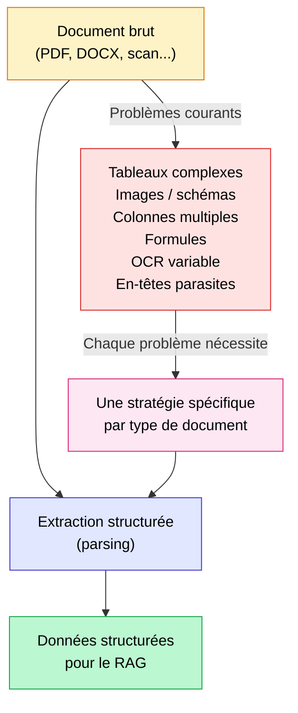
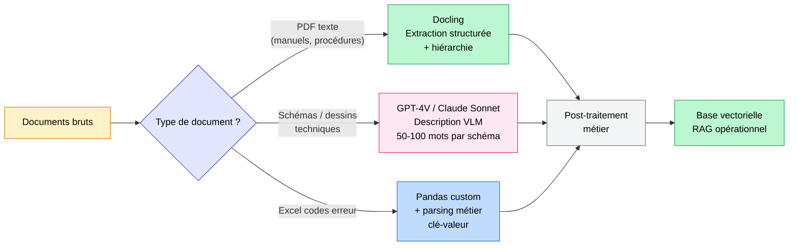

## Le parsing, première cause d'échec des RAG en entreprise

Sur 10 RAG qui ne fonctionnent pas en entreprise, 8 ont un problème de parsing en amont. Pas de modèle, pas de prompt, pas de retriever. Juste un PDF mal lu au départ.

C'est le constat que je fais sur presque tous les projets que j'accompagne. Une entreprise investit des semaines à choisir son modèle de langage, à configurer sa base vectorielle, à affiner ses prompts... et le système répond à côté. Parce que le document source a été mal lu dès le début.

Le parsing (l'extraction structurée des données depuis un document) est l'étape la plus sous-estimée du RAG. Si la récupération d'informations depuis vos fichiers est approximative, peu importe la sophistication du reste du pipeline : vous construisez sur du sable. Un tableau mal extrait, des colonnes confondues, un schéma technique ignoré... et votre LLM génère des réponses fausses avec une confiance absolue.

Dans cet article, je vais vous montrer pourquoi cette structuration des documents est si difficile, comment les 4 grands outils du marché se comparent vraiment, et ce que j'ai appris sur deux projets très différents : des documentations d'usine chez Continental, et un site e-commerce avec des milliers de fiches produit.

<!-- more -->

> Le parsing fait partie des étapes critiques d'un système RAG. Vue d'ensemble : [guide complet du RAG](/rag/).

***

## Pourquoi n'existe-t-il pas de méthode parfaite pour extraire un PDF ?

C'est la première question que posent les managers quand on leur explique qu'il faut un pipeline custom plutôt qu'un outil clé en main. La réponse est simple : **un PDF n'est pas un format de données. C'est un format d'affichage.**

Dans un PDF, chaque caractère est positionné à des coordonnées (x, y) sur une page. Il n'existe aucune notion de paragraphe, de colonne, de tableau ou de hiérarchie de titres. Le fichier sait juste que la lettre "A" est à 12,4 cm du bord gauche et 3,2 cm du bord haut. C'est tout.

À partir de là, chaque éditeur produit des PDFs radicalement différents :

- Un export Word génère des balises structurées lisibles par un parser.
- Un scan de document papier produit une image que seul un OCR peut lire.
- Un document LaTeX génère une mise en page complexe avec formules mathématiques.
- Un fichier InDesign produit du texte fragmenté à l'extrême, optimisé pour l'impression.

Et dans chacun de ces cas, les **tableaux** restent le cauchemar absolu. Des lignes implicites, des cellules fusionnées, des tableaux qui s'étalent sur plusieurs pages, des en-têtes répétés... Un parser naïf va souvent reconstituer un tableau dans un ordre qui n'a aucun sens.

Les autres pièges majeurs :

- **Les images et schémas techniques** : un parser texte ne voit rien, il faut un Vision Language Model (VLM) pour décrire le contenu.
- **Les colonnes multiples** : facile à mélanger si le parser lit ligne par ligne plutôt que colonne par colonne.
- **Les formules mathématiques** : souvent perdues ou converties en caractères illisibles.
- **Les en-têtes et pieds de page** : ils polluent le texte principal si on ne les filtre pas.
- **Les scans OCR** : la qualité variable de la reconnaissance peut introduire des erreurs silencieuses et difficiles à détecter.

**Conclusion de cette section** : il n'existe pas UNE solution universelle. Il existe une combinaison d'outils à adapter à chaque type de document dans votre corpus. Quiconque vous vend une solution "one-size-fits-all" pour l'extraction de données PDF vous raconte une histoire.

***

## Les 4 grands outils de parsing en 2026 : ce qu'ils font vraiment

Voici le tableau comparatif que j'aurais aimé trouver quand j'ai commencé à travailler sur ces sujets. Sans marketing, sans langue de bois.

| Outil | Open source | Forces réelles | Faiblesses réelles | Coût |
|---|---|---|---|---|
| **Docling** (IBM) | Oui (Apache 2.0) | Très bon sur tableaux, hiérarchie documentaire, modèle compact (258M params), format DocTags, intégration MCP | Setup initial plus technique, nécessite GPU pour la vitesse | Gratuit, GPU recommandé |
| **Unstructured** | Oui (OSS) + cloud payant | Support de 30+ formats (PDF, DOCX, HTML, PPT, EML...), pipeline modulaire et flexible | Performance moyenne sur tableaux complexes, version OSS limitée vs API cloud | Gratuit OSS, payant API |
| **LlamaParse** | Non, API uniquement | Excellent sur tableaux complexes, instructions custom en langage naturel, intégration LlamaIndex native, v2 sortie fin 2025 | Coût à l'usage, dépendance cloud, lock-in LlamaIndex | Quelques centimes par page |
| **Marker** | Oui (GPL-3.0) | Conversion en markdown très propre, rapide, bonne gestion des équations et du code | Moins performant sur les tableaux très complexes ou multi-pages | Gratuit, GPU recommandé |

***

### Docling : l'open source d'IBM Research

Docling est né dans les labos IBM Research Zurich et a dépassé 37 000 étoiles GitHub depuis sa première version publique. En janvier 2026, IBM a sorti Granite-Docling, une évolution majeure qui fusionne un backbone de langage Granite 3 avec un encodeur visuel SigLIP2.

La différence avec les autres outils : au lieu de chaîner OCR, analyse de layout et post-traitement en cascade, Docling intègre vision et langage dans un seul modèle compact. Le format de sortie propriétaire DocTags préserve fidèlement la structure : tableaux, blocs de code, formules mathématiques, hiérarchie de titres.

**Quand je l'utilise :** sur des documents techniques structurés (rapports, manuels, normes), des corpus avec beaucoup de tableaux numériques, et quand je veux un pipeline 100% local sans dépendance cloud. C'est mon choix par défaut depuis début 2026.

***

### Unstructured : 30+ formats supportés

Unstructured est l'outil que je recommande quand la diversité de formats est le vrai problème. 30+ formats supportés nativement, une API cloud bien documentée, et une architecture pipeline qui permet d'insérer des étapes de traitement custom.

**Sa vraie limite :** la version open source est volontairement moins puissante que l'API cloud. Sur des tableaux complexes, les résultats peuvent être décevants. Pour les besoins simples en self-hosted, il fait le travail. Pour la production avec des documents critiques, vous finirez souvent sur l'API payante.

**Quand je l'utilise :** quand le corpus mélange des formats très hétérogènes (PDF + emails + présentations + fichiers Word) et qu'aucun autre outil ne couvre tout le spectre.

***

### LlamaParse : des instructions de parsing en langage naturel

LlamaParse a sorti sa v2 fin 2025 avec une refonte significative. La grande force : vous pouvez lui donner des instructions en langage naturel pour lui expliquer comment traiter vos documents spécifiques. "Dans ce document, la première colonne est toujours un identifiant produit, la deuxième une description, ignore les lignes en gras qui sont des en-têtes de section." Il comprend et adapte son extraction.

Les benchmarks sont bons sur les tableaux complexes. Dans un A/B test sur 10 000 requêtes RAG, combiner LlamaParse avec LlamaIndex a réduit le taux d'hallucination de 42% par rapport à un parsing naïf.

**Sa vraie limite :** le coût s'accumule à l'échelle. Pour 10 000 pages complexes, la facture peut vite dépasser 300 à 500 euros. Et si vous n'utilisez pas LlamaIndex, l'intégration est moins fluide.

**Quand je l'utilise :** pour les 20% de documents les plus complexes dans un corpus, quand les tableaux sont critiques (financiers, techniques avec des valeurs de référence), et quand le délai d'intégration doit être court.

***

### Marker : la conversion PDF vers Markdown

Marker est l'outil le plus simple à comprendre : il convertit vos PDFs en Markdown propre, rapidement. Très bon sur les documents avec du texte dense, des formules LaTeX, et du code. La mise en forme est préservée de façon remarquable.

**Sa vraie limite :** sur les tableaux très complexes (cellules fusionnées, multi-colonnes, multi-pages), il peut produire du Markdown approximatif. Ce n'est pas son point fort.

**Quand je l'utilise :** pour des rapports académiques, des documentations techniques avec beaucoup de code et de formules, ou quand je veux un output propre sans post-traitement important.

***

## Cas client : Continental, parser des documentations d'usine pour résoudre des erreurs machine

C'est le projet qui m'a le plus appris sur les limites des approches génériques.

Continental, équipementier automobile de premier plan, dispose de volumes importants de documentations PDF : manuels de maintenance (200 à 800 pages, souvent multi-langues), schémas électriques au format PDF avec dessins techniques, procédures Word, et des tableurs Excel de codes erreur. La mission : permettre aux opérateurs de ligne de poser une question comme "code erreur E-241 sur ligne 3, que faire ?" et obtenir une réponse fondée sur la documentation réelle.

### Les types de documents rencontrés

- **Manuels PDF** : volumeux, structurés mais avec des tableaux de paramètres multi-pages, des renvois croisés entre chapitres, et des versions en 3 langues parfois dans le même fichier.
- **Schémas électriques** : des PDFs qui sont essentiellement des images vectorielles. Aucun parser texte ne peut en extraire l'information utile.
- **Tableurs Excel de codes erreur** : des cellules fusionnées, des références croisées entre onglets, des formules conditionnelles. Un parser texte générique y produirait du bruit pur.
- **Procédures Word** : les plus simples à traiter, mais avec des tableaux de correspondances critiques.

### Les problèmes spécifiques rencontrés

Le premier réflexe avait été d'essayer Unstructured sur l'ensemble du corpus. Résultat : les tableaux de paramètres machine étaient reconstitués dans le désordre, les cellules fusionnées devenaient des doublons, et les schémas électriques étaient simplement ignorés. Le Hit Rate initial était de 58%, ce qui dans un contexte industriel est insuffisant pour un usage en production.

### L'approche finale : pipeline custom multi-outils

Nous avons abandonné l'idée d'un parser unique. Le pipeline construit :

- **Docling** pour l'extraction structurée du texte des manuels et procédures : il préserve la hiérarchie des titres, reconstruit les tableaux de paramètres correctement, et sort un format propre pour le chunking.
- **GPT-4V (puis Claude Sonnet selon les cas)** pour décrire les schémas électriques. Chaque schéma est envoyé au VLM avec un prompt métier : "Décris ce schéma électrique en 3-5 phrases, en identifiant les composants principaux, les connexions critiques et les codes de référence visibles." La description textuelle est ensuite ajoutée au chunk correspondant dans la documentation.
- **Pandas avec parsing métier custom** pour les Excel : extraction onglet par onglet, gestion des cellules fusionnées, reconstruction des relations code erreur / description / action corrective sous forme de paires clé-valeur structurées.
- **Post-traitement spécifique** pour les codes erreur : normalisation du format (E-241, E241, Err241 sont tous le même code), ajout de métadonnées (ligne de production concernée, criticité, date de mise à jour de la procédure).

### Le résultat

**Hit Rate passé de 58% (parsing naïf) à 91% (pipeline custom).** Et selon les retours opérationnels, 60% de temps économisé pour les opérateurs sur la recherche d'information lors d'une panne.

Ce qui a vraiment changé la donne : traiter les schémas avec un VLM. La plupart des documentations industrielles contiennent des informations cruciales uniquement dans des dessins techniques. Les ignorer, c'est rendre le RAG aveugle à une partie significative de la connaissance métier.

***

## Cas client : e-commerce, extraire du HTML et le traiter proprement

Le deuxième cas est radicalement différent. Pas de PDF, pas de document industriel, mais un site e-commerce avec plusieurs milliers de pages : fiches produit, articles de blog, pages catégories, politiques de livraison et de retour, FAQ.

L'objectif : un assistant capable de répondre à des questions clients comme "ce produit existe-t-il en bleu taille XL ?" ou "quel délai de livraison pour Lyon ?" en se basant sur les données du site.

### Les problèmes spécifiques du HTML e-commerce

Le HTML d'un site e-commerce n'est pas du contenu : c'est 80% de structure, de navigation, de scripts et de boilerplate pour 20% d'information réelle.

- **Le bruit structurel** : header, footer, menus, bandeaux promotionnels, popups RGPD, scripts analytics... Un parser naïf va tout récupérer et noyer l'information utile dans du bruit.
- **Les caractéristiques produit en tableaux HTML** : les tableaux de spécifications (dimensions, poids, matières, couleurs disponibles) se transforment souvent en texte plat illisible si on applique un simple `get_text()`.
- **Les variantes produit gérées en JavaScript** : les options de taille et de couleur sont souvent chargées dynamiquement. Un parser statique ne les voit pas.
- **Les avis clients paginés** : récupérer les avis nécessite de naviguer dans des sections qui se chargent en AJAX.

### L'approche retenue

La récupération d'informations depuis ce corpus HTML a nécessité un pipeline très différent du cas industriel :

**Étape 1 : crawl propre et ciblé.** On part du sitemap XML pour identifier les URLs pertinentes, avec un filtrage par pattern : `/produit/`, `/blog/`, `/categorie/` oui. `/mon-compte/`, `/panier/`, `/checkout/` non. Cela réduit immédiatement le volume à traiter de moitié.

**Étape 2 : extraction du contenu utile avec Trafilatura.** [Trafilatura](https://trafilatura.readthedocs.io/) est un outil Python spécialisé dans l'extraction du contenu principal d'une page web en éliminant le boilerplate. Il fait un travail remarquable sur les articles de blog et les pages textuelles. Pour les pages simples, il remplace avantageusement un BeautifulSoup générique.

**Étape 3 : traitement custom des tableaux de spécifications avec BeautifulSoup.** Pour les fiches produit, on récupère les tableaux `<table>` ou les listes de caractéristiques et on les transforme en paires clé-valeur explicites. "Couleurs disponibles : bleu marine, rouge bordeaux, noir" plutôt qu'un tableau HTML mal converti.

**Étape 4 : Playwright pour le JavaScript.** Pour les variantes produit chargées dynamiquement, on utilise [Playwright](https://playwright.dev/) en mode headless : on charge la page dans un vrai navigateur, on attend que le JavaScript soit exécuté, puis on récupère le DOM complet. C'est plus lent, mais indispensable pour capturer les options de stock en temps réel.

**Étape 5 : stockage structuré avec métadonnées riches.** Chaque fiche produit est stockée en Markdown structuré avec des métadonnées explicites : catégorie, prix, disponibilité par taille, délai de livraison par zone, note avis clients. Ces métadonnées permettent ensuite un filtrage précis au moment du retrieval.

Pour aller plus loin sur la façon de structurer vos chunks après extraction, l'article sur le [chunking optimal pour le RAG](chunking-optimal-rag.md) détaille les stratégies adaptées à chaque type de contenu.

### Le résultat

Le Hit Rate sur les questions clients liées aux caractéristiques produit est passé de 61% à 88%. La différence vient principalement de deux choses : les variantes de produit correctement extraites, et les tableaux de spécifications convertis en langage naturel structuré plutôt qu'en soupe HTML.

***

## Comment je choisis mon outil de parsing aujourd'hui

Voici la matrice de décision que j'applique sur chaque nouveau projet. Elle n'est pas gravée dans le marbre mais couvre 95% des cas que je rencontre.

| Type de document | Approche recommandée | Pourquoi |
|---|---|---|
| PDFs textuels standards (rapports, contrats, normes) | **Docling** ou **Marker** | Bonne gestion de la structure, output propre, 100% local |
| PDFs avec tableaux complexes (financiers, techniques) | **LlamaParse** avec instructions custom, ou Docling + post-traitement | LlamaParse gère mieux les tableaux imbriqués avec des instructions |
| Corpus multi-formats (PDF + DOCX + PPT + emails) | **Unstructured** | Support 30+ formats, pipeline modulaire |
| PDFs avec schémas, dessins techniques, graphiques | **Pipeline dual** : parser texte + VLM pour les images | Un parser seul est aveugle au contenu visuel |
| HTML, pages web, sites e-commerce | **Trafilatura** + BeautifulSoup custom | Spécialisé web, élimine le boilerplate efficacement |
| Excel / CSV | **Pandas** avec logique métier custom | Jamais un parser texte générique sur des données tabulaires |
| PDFs scannés (faible qualité OCR) | **Docling** (avec module OCR intégré) ou **Amazon Textract** | Reconnaissance robuste sur scans dégradés |

**La règle que j'applique systématiquement** : je commence par analyser un échantillon de 20 à 30 documents du corpus réel avant de choisir un outil. Pas de benchmark générique, pas de démo avec des PDFs propres. Les vrais documents de production, avec leurs vraies imperfections.

***

## Le piège du chunking après parsing

L'extraction de données depuis vos documents n'est que la première étape. Une fois que vos PDFs sont correctement lus et structurés, il faut encore les découper de façon intelligente pour le retrieval.

Le chunking est l'étape qui suit directement le parsing. Et c'est un chantier à part entière : taille des chunks, méthode de découpage, gestion de l'overlap, préservation du contexte entre paragraphes. Un bon parsing avec un mauvais chunking produit toujours un RAG décevant.

J'ai détaillé les stratégies de chunking dans l'article [chunking optimal pour votre RAG](chunking-optimal-rag.md). Et si vous voulez comprendre le tableau complet des causes d'échec, [les 4 causes techniques d'échec d'un RAG](les-4-causes-techniques-echec-rag.md) situe le parsing dans l'ensemble du pipeline.

***

## Ce que ça coûte vraiment, un bon parsing

La question que les managers posent toujours en dernier, alors qu'elle devrait être posée en premier. Voici un budget réaliste pour un projet RAG d'entreprise avec environ 10 000 documents.

**Pipeline custom en self-hosted (Docling + VLM pour images) :**

- Développement : 1 à 2 semaines de travail, selon la complexité des types de documents.
- Coût d'ingestion initiale : environ 50 euros d'API VLM (GPT-4V ou Claude Sonnet) pour décrire les images et schémas.
- Coût en runtime : 0 euro (tout tourne en local après ingestion).
- Maintenance : prévoir environ 1 jour par mois quand les formats de documents évoluent (nouveau template, nouvel ERP).

**LlamaParse API uniquement :**

- Développement : quelques heures seulement, l'intégration est très rapide avec LlamaIndex.
- Coût d'ingestion pour 10 000 pages simples à complexes : entre 100 et 500 euros selon la complexité.
- Coût en runtime : 0 euro (l'ingestion est un one-shot).
- Maintenance : minimale, l'API absorbe les évolutions.

**Solution hybride (le meilleur rapport qualité/coût en pratique) :**

- Docling pour 80% des documents simples à modérément complexes : 0 euro de coût API.
- LlamaParse pour les 20% de documents critiques avec des tableaux complexes : environ 50 à 100 euros.
- Développement : 1 semaine.

**Le coût caché le plus important : la maintenance.** Quand votre client change d'ERP et que tous les exports PDF changent de format, votre pipeline doit être adapté. Quand le fournisseur change son template de documentation, idem. Toujours prévoir ce budget de maintien dans le TCO du projet. Un pipeline de structuration des documents n'est pas un one-shot, c'est un système vivant.

Pour un panorama des métriques permettant de mesurer l'impact de vos améliorations de parsing, l'article sur [comment évaluer un RAG en production](evaluer-rag-production-metriques-ragas.md) vous donnera les outils concrets.

***

## FAQ

**Comment extraire des données depuis un PDF pour de l'IA ?**

La méthode dépend du type de PDF. Pour un PDF texte standard, des outils comme Docling ou Marker produisent un output structuré de qualité. Pour des PDFs avec des tableaux complexes, LlamaParse avec des instructions custom sera plus efficace. Pour des PDFs scannés, il faut un pipeline OCR robuste avant même de penser à la structuration. Dans tous les cas, commencez par analyser un échantillon réel de vos documents avant de choisir un outil.

**Pourquoi LangChain ne suffit pas à parser correctement un PDF ?**

LangChain intègre des loaders PDF basiques (PyPDF, PDFMiner) qui font une extraction texte brute. Ils fonctionnent sur des PDFs simples. Mais ils n'ont aucune logique de reconstruction des tableaux, pas de gestion des images, et une lecture de l'ordre du texte parfois approximative sur des layouts complexes. LangChain est une couche d'orchestration : pour une extraction de données sérieuse, il faut un outil de parsing dédié en amont.

**Docling ou LlamaParse : lequel choisir ?**

Docling si vous voulez un pipeline 100% local, sans coût à l'usage, et que vos documents sont des PDFs textuels avec des tableaux numériques structurés. LlamaParse si vous avez des tableaux très complexes (imbriqués, cellules fusionnées sur plusieurs niveaux), que vous utilisez déjà LlamaIndex, et que la rapidité d'intégration prime sur le coût à l'usage. Pour la plupart des projets en 2026, Docling couvre 80% des besoins.

**Comment gérer les tableaux complexes en RAG ?**

Trois approches selon la complexité. Pour les tableaux simples, Docling ou Marker les reconstituent bien. Pour les tableaux complexes avec cellules fusionnées et multi-pages, LlamaParse avec des instructions custom est plus efficace. Pour les tableaux dans des Excel, Pandas avec une logique métier custom est la seule approche fiable : jamais un parser PDF générique sur des données structurées.

**Faut-il un VLM pour parser des PDFs avec schémas ?**

Oui, sans exception. Aucun parser texte ne peut extraire l'information contenue dans un dessin technique, un schéma électrique ou un graphique. Un Vision Language Model (GPT-4V, Claude Sonnet, ou Qwen2-VL en local) doit décrire ces éléments en quelques phrases. Cette description textuelle est ensuite ajoutée au chunk correspondant. Ignorer les images dans un document technique, c'est rendre votre RAG aveugle à une partie substantielle de la connaissance qu'il est censé exploiter.

**Quel parser pour des PDFs scannés ?**

Docling intègre un module OCR qui gère correctement la plupart des scans de qualité standard. Pour des scans de très faible qualité (documents anciens, photocopies dégradées), Amazon Textract ou Google Document AI produisent des résultats plus robustes, mais à un coût plus élevé. Dans tous les cas, anticipez un taux d'erreur résiduel et prévoyez une validation humaine sur les extractions critiques.

**Comment extraire les données d'un fichier Excel pour un RAG ?**

Pandas avec une logique de parsing métier custom. Jamais un parser générique. Les Excel d'entreprise ont des cellules fusionnées, des formules, des références croisées entre onglets, des en-têtes sur plusieurs lignes... La structuration des données depuis un Excel requiert de comprendre la sémantique du document : quelle colonne est un identifiant, quelle ligne est un en-tête, comment les onglets se référencent entre eux. Cette logique est spécifique à chaque fichier et ne peut pas être automatisée aveuglément.

**Comment parser du HTML pour un RAG ?**

Trafilatura pour l'extraction du contenu principal (articles, descriptions). BeautifulSoup pour les tableaux de caractéristiques et les données structurées. Playwright quand des éléments sont chargés dynamiquement en JavaScript (variantes produit, prix en temps réel, avis paginés). Et toujours un crawl ciblé par patterns d'URL : ne parsez pas votre site entier, parsez uniquement les pages qui contiennent de l'information utile pour les questions de vos utilisateurs.

**Le parsing peut-il être 100% automatisé ?**

Non, et toute solution qui vous dit le contraire est soit naïve soit malhonnête. L'extraction automatique atteint 85 à 95% de qualité sur des corpus homogènes bien définis. Le reste requiert une validation humaine, notamment pour les tableaux critiques dont une erreur d'extraction aurait des conséquences métier (valeurs de paramètres machine, données financières, codes réglementaires). La vraie question n'est pas "peut-on tout automatiser ?" mais "sur quels documents dois-je valider manuellement ?"

**Combien coûte un bon pipeline de parsing pour 10 000 documents ?**

Entre 0 et 500 euros de coût direct selon l'approche, plus 1 à 2 semaines de développement. Un pipeline Docling self-hosted coûte uniquement du temps de développement. LlamaParse pour des documents complexes coûte 100 à 500 euros d'API pour l'ingestion initiale. La solution hybride (Docling pour 80% + LlamaParse pour 20%) est souvent le meilleur compromis. Mais le vrai coût sur 12 mois inclut la maintenance : prévoir 1 jour par mois minimum quand les formats de documents évoluent.

***

## Pour aller plus loin

- **[Chunking optimal pour votre RAG](chunking-optimal-rag.md)** : l'étape directement après le parsing, avec benchmarks et stratégies selon le type de contenu
- **[Les 4 causes techniques d'échec d'un RAG](les-4-causes-techniques-echec-rag.md)** : le parsing est la cause n°1, cet article couvre l'ensemble du diagnostic
- **[Comment évaluer un RAG en production](evaluer-rag-production-metriques-ragas.md)** : pour mesurer concrètement l'impact d'un meilleur parsing sur vos métriques
- **[Optimiser son RAG : les 8 techniques](optimiser-rag-techniques.md)** : la suite logique une fois le parsing et le chunking en ordre
- **[Cas client BTP : RAG multi-sources pour les appels d'offres](cas-usage-rag-redaction-appels-offres-btp.md)** : un autre exemple de pipeline multi-sources avec des formats hétérogènes
- **[Sécuriser un RAG : prompt injection, fuites et RBAC](securiser-rag-prompt-injection-rbac.md)** : les documents que vous parsez sont aussi une surface d'attaque, texte caché et instructions empoisonnées comprises

***

Si mes articles vous intéressent et que vous avez des questions ou simplement envie de discuter de vos propres défis, n'hésitez pas à m'écrire à [anas@tensoria.fr](mailto:anas@tensoria.fr), j'aime échanger sur ces sujets !

Vous pouvez aussi [réserver un créneau d'échange](https://cal.eu/anas-rabhi/rendez-vous-ianas) ou vous abonner à ma newsletter :)

---

### À propos de moi

Je suis **Anas Rabhi**, consultant Data Scientist freelance. J'accompagne les entreprises dans leur stratégie et mise en œuvre de solutions d'IA (RAG, Agents, NLP).

Découvrez mes services sur [tensoria.fr](https://tensoria.fr) ou testez notre solution d'agents IA [heeya.fr](https://heeya.fr).

  <a href="https://cal.eu/anas-rabhi/rendez-vous-ianas" target="_blank" style="display: inline-block; background-color: #4F46E5; color: #ffffff; font-weight: bold; padding: 16px 32px; text-decoration: none; border-radius: 8px; font-size: 18px; letter-spacing: 0.8px; box-shadow: 0 6px 12px rgba(0, 0, 0, 0.2); transition: all 0.3s ease; border: none;">
    Réserver un créneau
  </a>
  <a href="https://anas-ai.kit.com/d8b1a255cc" target="_blank" style="display: inline-block; background-color: #222222; color: #ffffff; font-weight: bold; padding: 16px 32px; text-decoration: none; border-radius: 8px; font-size: 18px; letter-spacing: 0.8px; box-shadow: 0 6px 12px rgba(0, 0, 0, 0.2); transition: all 0.3s ease; border: none;">
    ✉️ S'abonner à ma newsletter
  </a>

