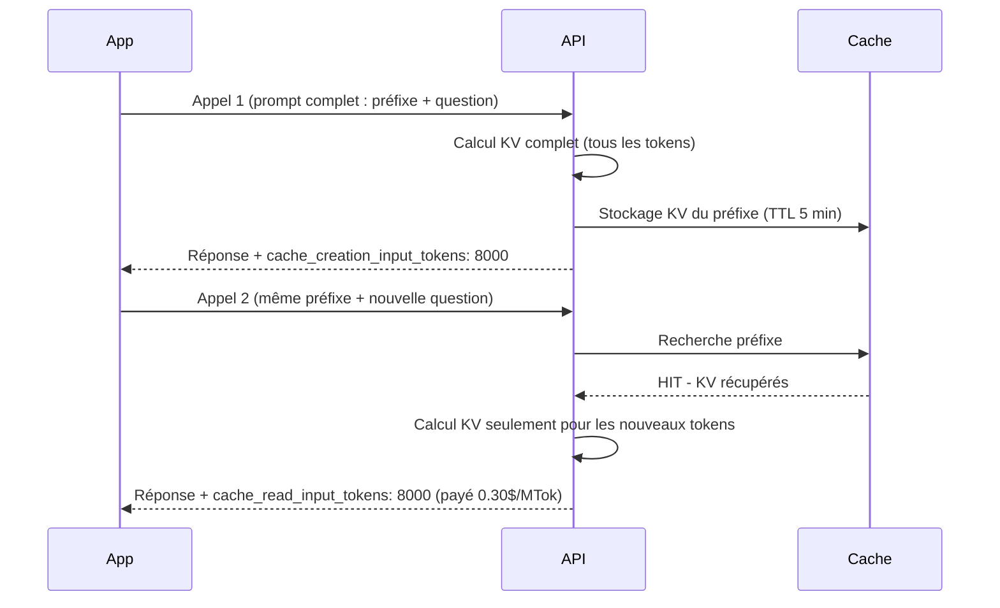
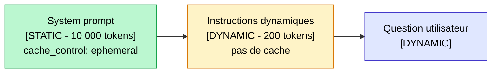

## Si vous payez plein tarif vos appels LLM en 2026, vous laissez 50 à 90% de réduction sur la table

Le prompt caching est devenu **la première optimisation de coût à mettre en place** dans tout projet LLM en production, et bizarrement, personne n'en parle assez.

La réalité des projets que j'accompagne : les équipes passent des heures à comparer les modèles, à négocier des remises volume avec les providers, à chercher des alternatives open-source. Et pendant ce temps, leur code repaie intégralement le même system prompt de 10 000 tokens à chaque appel, sans jamais avoir entendu parler de `cache_control`.

Dans cet article, vous allez voir comment fonctionne le prompt caching au niveau technique (le KV cache), comment les trois providers majeurs l'implémentent différemment (Anthropic, OpenAI, Gemini), les patterns qui font vraiment chuter la facture, et le calcul de ROI sur un cas concret.

<!-- more -->

***

## Pourquoi vos appels LLM coûtent cher inutilement

Chaque appel à un LLM vous facture des tokens en entrée et en sortie. Sur les tokens de sortie, difficile de faire mieux : c'est le modèle qui génère, et la longueur dépend de votre besoin.

Sur les tokens d'entrée, en revanche, il y a un problème structurel que la plupart des équipes ignorent.

**En production, les prompts deviennent rapidement énormes.** Un system prompt typique contient : la définition du rôle et des contraintes, des exemples few-shot pour guider le format, parfois des documents RAG injectés, et l'historique de la conversation. On arrive vite à 5 000, 20 000, parfois 50 000 tokens.

Le problème : à chaque appel, le LLM recalcule **tout depuis zéro**, même si 90% du prompt est rigoureusement identique à l'appel précédent. C'est comme si vous deviez repayer l'intégralité d'un menu de restaurant à chaque bouchée, sans remise pour ce que vous avez déjà consommé.

Le prompt caching résout exactement ça. On ne paie le gros préfixe stable qu'une seule fois, puis des fractions du prix normal pour chaque appel suivant qui le réutilise.

Concrètement, avec Claude Sonnet 4.6 :

| Type de token | Prix normal | Prix en cache hit |
|---|---|---|
| Input standard | 3 $/MTok | 3 $/MTok |
| Cache write (5 min) | 3.75 $/MTok | une seule fois |
| Cache read (hit) | **0.30 $/MTok** | soit **-90%** |

***

## Comment ca marche techniquement : le KV cache

Pour comprendre pourquoi ca fonctionne, il faut saisir ce que fait un LLM quand il traite votre prompt.

Un modèle Transformer calcule, pour chaque token, ce qu'on appelle des paires **Key-Value**. Ces paires encodent le sens de chaque token en relation avec tous les tokens qui le précèdent. C'est ce mécanisme d'attention qui permet au modèle de comprendre le contexte.

La bonne nouvelle : **une fois ces paires calculées pour les N premiers tokens, elles n'ont pas besoin d'être recalculées si ces N premiers tokens restent identiques**. C'est ce que les chercheurs en deep learning appellent le KV cache.

Les providers exposent maintenant ce mécanisme côté API. Vous déclarez qu'un préfixe est cachable, le provider stocke ses KV de son côté, et les appels suivants avec le même préfixe ne recalculent que les nouveaux tokens.



**Le point critique :** le cache est sensible byte par byte. Un seul espace en trop, une majuscule de différence, un timestamp qui change dans le prompt : c'est un miss complet et vous repayez tout. La stabilité du préfixe est non négociable.

***

## Support et differences par provider

Les trois providers majeurs implémentent le prompt caching avec des philosophies très différentes.

| Provider | Activation | Durée cache | Cout écriture | Cout lecture | Min tokens |
|---|---|---|---|---|---|
| **Anthropic Claude** | Manuel (`cache_control`) | 5 min (défaut) ou 1h (+coût) | +25% du prix normal | 10% du prix normal | 1 024 (Sonnet 4.x) ou 4 096 (Opus, Haiku 4.5) |
| **OpenAI** | Automatique | 5 à 60 min (variable) | Identique au prix normal | 50% du prix normal | 1 024 tokens |
| **Google Gemini** | Manuel (Context Caching API) | 1h par défaut (configurable) | Coût stockage à l'heure | ~25% du prix normal | 32 768 tokens (Pro), 4 096 (Flash) |

Les vraies différences à comprendre :

**Anthropic** est le plus contrôlable. Vous pouvez placer jusqu'à 4 breakpoints de cache dans votre prompt (outils, system, messages). Vous choisissez exactement ce qui est mis en cache. La lecture coûte seulement 10% du prix normal : la réduction la plus forte des trois. Inconvénient : faut l'activer manuellement, et écrire dans le cache coûte 25% de plus que le prix normal. Si vos hits sont rares, vous payez plus cher.

**OpenAI** est le plus simple : rien à coder. Dès que votre prompt système dépasse 1 024 tokens et que vous le réutilisez, OpenAI gère automatiquement. La réduction est de 50% sur les tokens cachés, pas 90%. Moins de contrôle, mais zéro effort.

**Gemini** a une approche différente avec sa Context Caching API séparée. Vous créez explicitement un objet cache que vous référencez ensuite dans vos appels. Le minimum de 32 768 tokens (Pro) est élevé : bon ROI uniquement sur de très gros contextes très réutilisés. Gemini 2.5 Pro et Flash supportent aussi un implicit caching automatique depuis 2026, mais moins contrôlable.

***

## Le code en pratique

### Anthropic Claude (Python)

```python
from anthropic import Anthropic

client = Anthropic()

# LONG_LEGAL_CONTEXT : 50 000 tokens de jurisprudence
response = client.messages.create(
    model="claude-sonnet-4-6",
    max_tokens=1024,
    system=[
        {
            "type": "text",
            "text": "Tu es un assistant expert en droit du travail français.",
        },
        {
            "type": "text",
            "text": LONG_LEGAL_CONTEXT,
            "cache_control": {"type": "ephemeral"},  # ce bloc est mis en cache
        },
    ],
    messages=[{"role": "user", "content": "Préavis pour un CDI cadre ?"}],
)

# Vérifier si le cache a été utilisé
usage = response.usage
print(f"Tokens écrits en cache : {usage.cache_creation_input_tokens}")
print(f"Tokens lus depuis le cache : {usage.cache_read_input_tokens}")
print(f"Tokens facturés plein tarif : {usage.input_tokens}")
```

Pour activer le TTL d'une heure (recommandé si votre trafic est espacé) :

```python
"cache_control": {"type": "ephemeral", "ttl": "1h"}
# Attention : écriture à 2x le prix normal au lieu de 1.25x
# A utiliser seulement si vous avez des appels espacés de plus de 5 min
```

### OpenAI (automatique, rien a faire)

```python
from openai import OpenAI

client = OpenAI()

# Premier appel : peuple le cache automatiquement
# Appels suivants avec le même préfixe : cache hit automatique
response = client.chat.completions.create(
    model="gpt-4o",
    messages=[
        {
            "role": "system",
            "content": LONG_SYSTEM_PROMPT,  # doit dépasser 1 024 tokens
        },
        {"role": "user", "content": "Ma question utilisateur"},
    ],
)

# Vérifier les tokens mis en cache
cached = response.usage.prompt_tokens_details.cached_tokens
total_input = response.usage.prompt_tokens
print(f"Tokens cachés : {cached} / {total_input} total")
print(f"Taux de hit : {cached / total_input * 100:.1f}%")
```

### Gemini Context Caching

```python
from google import genai
from google.genai import types
import datetime

client = genai.Client()

# Créer le cache une fois
cached = client.caches.create(
    model="gemini-2.5-pro",
    config=types.CreateCachedContentConfig(
        contents=[LONG_DOCUMENT],
        system_instruction="Tu es un assistant expert.",
        ttl=datetime.timedelta(hours=1),
        display_name="mon-cache-document",
    ),
)

print(f"Cache créé : {cached.name}")
print(f"Expire le : {cached.expire_time}")

# Utiliser le cache dans vos appels suivants
response = client.models.generate_content(
    model="gemini-2.5-pro",
    contents="Résume les points clés de ce document",
    config=types.GenerateContentConfig(
        cached_content=cached.name,
    ),
)

# Métriques
print(f"Tokens en cache : {response.usage_metadata.cached_content_token_count}")
```

***

## 5 patterns qui font vraiment chuter la facture

### Pattern 1 : system prompt long et exemples few-shot mis en cache

C'est le pattern le plus universel. Beaucoup d'applications ont un system prompt de 5 000 à 50 000 tokens : rôle détaillé, contraintes métier, exemples few-shot pour guider le format de réponse. Ce contenu est 100% identique entre tous les appels.

Sans caching : vous le repayez intégralement à chaque appel.
Avec caching : vous le payez une fois pour 5 minutes (ou 1 heure), puis 10% du prix normal sur chaque hit.

**Gain typique : 80 à 90% sur les tokens d'entrée.**

La règle d'or : placer le préfixe cachable en premier dans le system, les instructions dynamiques après le breakpoint.



### Pattern 2 : RAG avec contexte stable

Sur un RAG d'entreprise, certains documents sont systématiquement injectés dans chaque prompt : politique d'entreprise, glossaire métier, charte de réponse, exemples de cas traités. Ces documents peuvent peser 10 000 à 100 000 tokens.

Ils sont parfaits pour le cache : identiques entre tous les utilisateurs, stables dans le temps.

La partie dynamique (le chunk retrieval spécifique à la question) reste hors cache, après le breakpoint.

**Gain typique : 30 à 60% selon la proportion stable du contexte.**

J'en parle plus en détail dans [les 8 techniques pour optimiser son RAG](optimiser-rag-techniques.md), notamment la technique 5 (Contextual Retrieval) qui mentionne le prompt caching comme levier de réduction du coût d'ingestion.

### Pattern 3 : conversation longue (chatbots)

Dans un chatbot, à chaque tour on renvoie l'historique complet pour maintenir le contexte. Après 10 tours, l'historique représente souvent 80% du prompt total.

Avec le caching, on marque le system + les premiers messages de la conversation comme cachables. À chaque nouveau tour, seuls les derniers messages sont facturés plein tarif.

**Gain typique : 50 à 70% sur des conversations à 20 tours et plus.**

La clé : ne jamais modifier les messages déjà dans la partie cachée. Toujours ajouter des messages après le dernier breakpoint.

### Pattern 4 : agents avec longues definitions d'outils

Un agent avec 20 outils a typiquement 5 000 à 20 000 tokens juste pour décrire ses outils (noms, descriptions, paramètres JSON Schema). Ces définitions sont identiques à chaque appel.

Chez Anthropic, les outils peuvent être explicitement mis en cache avec `cache_control` sur la liste des tools. C'est souvent le premier breakpoint à placer.

**Gain typique : significatif sur des agents qui font 10 appels ou plus par tâche.**

### Pattern 5 : batch processing avec prompt stable

Pour de l'extraction ou de la classification sur 10 000 documents avec le même system prompt : le prompt caching s'applique à chaque document du batch.

Combiné avec l'API Batch (50% de réduction supplémentaire chez OpenAI et Anthropic), les gains s'accumulent.

| Levier | Réduction |
|---|---|
| Prompt caching seul | -90% sur tokens cachés |
| Batch API seule | -50% sur tous les tokens |
| Prompt caching + Batch | Combinaison très puissante |

Pour un corpus de 10 000 documents avec un system prompt de 8 000 tokens : **caching + batch peut diviser la facture par 15 à 20** comparé à des appels naifs en temps réel.

***

## Mesurer le gain reel sur vos appels

Le premier reflexe : vérifier que le cache est bien activé et mesurez vos taux de hit.

**Anthropic :**

```python
def compute_cache_stats(usage):
    total_input = (
        usage.input_tokens
        + usage.cache_creation_input_tokens
        + usage.cache_read_input_tokens
    )
    hit_rate = usage.cache_read_input_tokens / total_input if total_input > 0 else 0

    # Economie réalisée sur cet appel (vs prix normal)
    savings_usd = usage.cache_read_input_tokens * (3 - 0.30) / 1_000_000

    return {
        "hit_rate": f"{hit_rate:.1%}",
        "cached_tokens": usage.cache_read_input_tokens,
        "savings_usd": f"${savings_usd:.4f}",
    }
```

**OpenAI :**

```python
cached = response.usage.prompt_tokens_details.cached_tokens
total = response.usage.prompt_tokens
hit_rate = cached / total if total > 0 else 0
```

**Gemini :**

```python
cached = response.usage_metadata.cached_content_token_count
total = response.usage_metadata.prompt_token_count
hit_rate = cached / total if total > 0 else 0
```

**Ce que vous devez exposer dans votre dashboard LLMOps** (Langfuse, Phoenix, Helicone) :

- Taux de hit par endpoint
- Tokens cachés vs tokens facturés plein tarif
- Economie en dollars par jour
- Alertes si le hit rate chute (signe que le préfixe a changé involontairement)

***

## Les pieges a eviter

**Piège 1 : un seul caractère invalide tout le cache.** Le cache est comparé byte par byte. Un timestamp dans le system prompt, une version qui change, un espace de trop : miss complet. Auditez vos templates pour identifier tout ce qui varie involontairement.

**Piège 2 : cacher sous le seuil minimum.** Chaque provider a un minimum. Si votre system prompt fait 800 tokens et que vous ciblez Sonnet 4.6 (minimum 1 024 tokens), le cache ne s'activera jamais. Vérifiez `cache_creation_input_tokens` dans la réponse : s'il est à 0 sur le premier appel, c'est un miss de seuil.

**Piège 3 : payer l'écriture de cache sans jamais avoir de hits.** Chez Anthropic, écrire dans le cache coûte 25% de plus que le prix normal. Si votre trafic est trop faible ou trop irrégulier pour générer des hits avant expiration du TTL, vous payez plus cher. Le caching est rentable dès 2 appels avec le même préfixe dans la fenêtre TTL.

**Piège 4 : TTL trop court sur un trafic creux.** Avec 5 minutes de TTL Anthropic, si votre app reçoit un appel toutes les 10 minutes, le cache expirera systématiquement entre deux appels. Passez au TTL d'une heure dans ce cas (coût d'écriture doublé, mais rentable si vous avez 3 hits ou plus par heure).

**Piège 5 : mélanger des données utilisateur dans la partie cachée.** La partie cachée doit être identique entre tous les appels. Si vous glissez le nom de l'utilisateur ou son historique dans le system prompt avant le breakpoint, le cache sera un miss pour chaque utilisateur différent. Toujours placer l'info spécifique à la requête **après** le dernier breakpoint.

***

## Combiner prompt caching avec d'autres optimisations

Le prompt caching est le levier numéro 1, mais il s'inscrit dans une hiérarchie d'optimisations. Voici l'ordre que j'applique sur mes projets :

| Priorité | Optimisation | Gain | Effort |
|---|---|---|---|
| 1 | **Prompt caching** | 50 à 90% sur les tokens d'entrée | Faible (2 lignes de code) |
| 2 | **Model routing** | 80% sur les tâches simples | Moyen |
| 3 | **Batch API** | 50% supplémentaire | Faible |
| 4 | **Semantic caching** | Variable (voir technique 8 dans [les 8 techniques RAG](optimiser-rag-techniques.md)) | Moyen |
| 5 | **Prompt compression** | 20 à 30% | Moyen (risque qualité) |
| 6 | **Fine-tuning petit modèle** | Enorme sur le long terme | Elevé |

**Le model routing** mérite une mention particulière. Sur un système qui traite des requêtes très variées, envoyer systématiquement tout sur Claude Opus ou GPT-4o est un gaspillage. Un classifieur léger (ou le LLM lui-même) peut router les questions simples vers Haiku, Flash, ou GPT-4o-mini. Combiné au caching, les économies s'accumulent vite.

Je détaille cette logique de décision dans [l'article sur Agentic RAG vs RAG classique](agentic-rag-vs-rag-classique.md) : le principe est le même, adapter la puissance du modèle à la complexité réelle de la tâche.

***

## Calcul de ROI sur un cas type

Voici un calcul concret pour une app SaaS avec un chatbot en production.

**Hypothèses :**
- 50 000 appels par jour
- System prompt de 8 000 tokens (stable)
- Contexte conversationnel moyen de 4 000 tokens (dynamique)
- Modèle : Claude Sonnet 4.6 (3 $/MTok input, 15 $/MTok output)
- Taille de sortie moyenne : 500 tokens

**Sans prompt caching :**

| Poste | Calcul | Cout/jour |
|---|---|---|
| Input (12 000 tokens × 50 000 appels) | 600 M tokens × 3 $/MTok | **1 800 $/jour** |
| Output (500 tokens × 50 000 appels) | 25 M tokens × 15 $/MTok | **375 $/jour** |
| **Total** | | **2 175 $/jour** |

Soit **65 250 $/mois** en input + output.

**Avec prompt caching (hit rate 90% sur les 8 000 tokens stables) :**

| Poste | Calcul | Cout/jour |
|---|---|---|
| Cache writes (1 miss/5 min × 8 000 tokens) | ~144 miss/jour × 8 000 tokens × 3.75 $/MTok | **~4 $/jour** |
| Cache reads (49 856 hits × 8 000 tokens) | 399 M tokens × 0.30 $/MTok | **~120 $/jour** |
| Input dynamique (12 000 tokens... attention, 4 000 dynamic) | 200 M tokens × 3 $/MTok | **600 $/jour** |
| Output (inchangé) | 25 M tokens × 15 $/MTok | **375 $/jour** |
| **Total** | | **~1 099 $/jour** |

**Economie : environ 1 076 $/jour, soit ~32 000 $/mois.**

Pour une mise en place qui représente 30 minutes de développement (ajouter `cache_control` aux bons endroits), c'est probablement le ROI horaire le plus élevé que vous puissiez obtenir sur un projet LLM en production.

***

## FAQ

**C'est quoi le prompt caching ?**

Le prompt caching est un mécanisme qui permet de réutiliser les calculs déjà effectués pour un préfixe de prompt identique entre plusieurs appels LLM. Au lieu de recalculer les paires Key-Value de chaque token à chaque appel, le provider stocke ces calculs côté serveur et les réutilise si le préfixe est identique. Vous ne payez que les nouveaux tokens.

**Combien peut-on économiser avec le prompt caching ?**

La réduction atteint 90% sur les tokens mis en cache chez Anthropic (0.10x le prix normal), 50% chez OpenAI, et environ 75% chez Gemini. En pratique, sur une app avec un gros system prompt stable, les économies sur la facture totale d'entrée vont de 50 à 85% selon le ratio tokens stables / tokens dynamiques.

**Prompt caching automatique OpenAI vs manuel Anthropic : lequel est mieux ?**

Ca dépend du contexte. OpenAI est idéal si vous voulez zéro effort et un gain immédiat. Anthropic offre plus de contrôle (4 breakpoints, TTL configurable, 90% de réduction vs 50%) mais demande de coder explicitement. Pour des projets avec des prompts complexes et un fort volume, Anthropic est souvent plus rentable. Pour une mise en place rapide, OpenAI gagne.

**Combien de temps reste un cache prompt ?**

Chez Anthropic : 5 minutes par défaut, 1 heure avec l'option TTL étendu (coût d'écriture doublé). Chez OpenAI : entre 5 et 60 minutes selon la charge serveur, non configurable. Chez Gemini : 1 heure par défaut, configurable jusqu'à plusieurs jours.

**Le prompt caching dégrade-t-il la qualité des réponses ?**

Non. Le cache stocke uniquement les calculs d'attention sur le préfixe. Le modèle génère exactement la même réponse qu'il aurait générée sans cache : les paires Key-Value sont identiques, seul leur calcul est évité. La qualité est strictement équivalente.

**Faut-il payer plus cher pour activer le prompt caching ?**

Chez Anthropic, l'écriture dans le cache coûte 25% de plus que le prix normal (ou 2x pour le TTL 1 heure). Si vous n'avez jamais de hits, vous payez plus cher. Le caching devient rentable dès le deuxième appel dans la fenêtre TTL. Chez OpenAI et Gemini (implicit caching), aucun surcoût à l'écriture.

**Comment savoir si mon prompt est bien caché ?**

Chez Anthropic : vérifiez `cache_creation_input_tokens` (tokens écrits en cache) et `cache_read_input_tokens` (tokens lus depuis le cache) dans `response.usage`. Si les deux sont à 0 sur le premier appel, votre prompt est probablement sous le seuil minimum. Chez OpenAI : `response.usage.prompt_tokens_details.cached_tokens`. Chez Gemini : `response.usage_metadata.cached_content_token_count`.

**Prompt caching et données sensibles : est-ce sécurisé ?**

Le cache est isolé par organisation et par clé API. Chez Anthropic, le cache est explicitement limité à votre organisation, aucun autre client n'a accès à vos données mises en cache. Les providers certifient que les données cachées respectent les mêmes garanties de confidentialité que les données traitées normalement. Vérifiez les DPA (Data Processing Agreements) de votre provider si vous gérez des données sensibles (santé, finance).

**Prompt caching avec un RAG : comment l'organiser ?**

L'organisation optimale : d'abord le system prompt stable (mission, contraintes, format), puis les documents de référence toujours présents (glossaire, politique, exemples), puis un breakpoint de cache. Ensuite, les chunks retrieval spécifiques à la question, puis la question elle-même. Les deux premiers blocs sont en cache, les deux derniers sont dynamiques et facturés plein tarif.

**Quels sont les minimums de tokens par provider ?**

Anthropic : 1 024 tokens pour Claude Sonnet 4.x, 4 096 tokens pour Claude Opus et Haiku 4.5. OpenAI : 1 024 tokens (tous modèles). Gemini : 4 096 tokens pour Gemini Flash, 32 768 tokens pour Gemini Pro. Si votre préfixe est sous le seuil, le cache ne s'active pas sans erreur explicite : vérifiez toujours les champs de métriques en réponse.

***

## Pour aller plus loin

- **[Optimiser son RAG : les 8 techniques](optimiser-rag-techniques.md)** : la technique 8 (semantic cache) est la cousine du prompt caching, appliquée au niveau des requêtes utilisateurs
- **[Evaluer un RAG en production](evaluer-rag-production-metriques-ragas.md)** : une fois vos coûts optimisés, mesurez la qualité avec les bonnes métriques
- **[Agentic RAG vs RAG classique](agentic-rag-vs-rag-classique.md)** : comprendre quand la complexité des agents justifie leur coût, et comment le caching change l'équation
- **[MCP : le standard pour les agents IA](mcp-model-context-protocol-agents-ia.md)** : les agents avec beaucoup d'outils sont de bons candidats au caching des définitions d'outils

***

Si mes articles vous intéressent et que vous avez des questions ou simplement envie de discuter de vos propres défis, n'hésitez pas à m'écrire à [anas@tensoria.fr](mailto:anas@tensoria.fr), j'aime échanger sur ces sujets !

Vous pouvez aussi [réserver un créneau d'échange](https://cal.eu/anas-rabhi/rendez-vous-ianas) ou vous abonner à ma newsletter :)


---

### À propos de moi

Je suis **Anas Rabhi**, consultant Data Scientist freelance. J'accompagne les entreprises dans leur stratégie et mise en œuvre de solutions d'IA (RAG, Agents, NLP).

Découvrez mes services sur [tensoria.fr](https://tensoria.fr) ou testez notre solution d'agents IA [heeya.fr](https://heeya.fr).

<div style="text-align: center; margin: 40px 0; gap: 16px; display: flex; flex-wrap: wrap; justify-content: center;">
  <a href="https://cal.eu/anas-rabhi/rendez-vous-ianas" target="_blank" style="display: inline-block; background-color: #4F46E5; color: #ffffff; font-weight: bold; padding: 16px 32px; text-decoration: none; border-radius: 8px; font-size: 18px; letter-spacing: 0.8px; box-shadow: 0 6px 12px rgba(0, 0, 0, 0.2); transition: all 0.3s ease; border: none;">
    Réserver un créneau
  </a>
  <a href="https://anas-ai.kit.com/d8b1a255cc" target="_blank" style="display: inline-block; background-color: #222222; color: #ffffff; font-weight: bold; padding: 16px 32px; text-decoration: none; border-radius: 8px; font-size: 18px; letter-spacing: 0.8px; box-shadow: 0 6px 12px rgba(0, 0, 0, 0.2); transition: all 0.3s ease; border: none;">
    <span style="margin-right: 10px;">✉️</span> S'abonner à ma newsletter
  </a>
</div>
