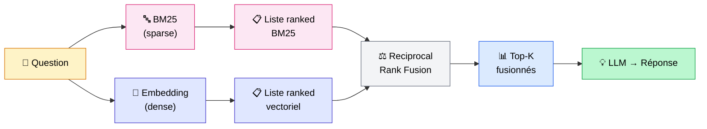

## Votre RAG vectoriel rate des questions que vous ne voyez pas

C'est une remarque que j'entends souvent sur les projets RAG : *"Ça marche bien en général, mais parfois il ne trouve rien sur des questions pourtant simples."*

Exemple concret : *"Quelle est la procédure ISO-27001 pour les accès distants ?"* → 0 résultat pertinent.

Le vectoriel encode le sens. Mais quand la question contient un identifiant exact (une norme, un code produit, un acronyme métier), l'encodage sémantique rate complètement.

C'est ce qu'on appelle le **vocabulary mismatch**. Et c'est le problème que le hybrid search résout.

<!-- more -->

***

## 3 types de requêtes où le vectoriel seul échoue

Un modèle d'embeddings encode le sens, les associations sémantiques, les proximités conceptuelles. C'est puissant. Mais ça rate systématiquement sur 3 catégories de requêtes.

**1. Le jargon métier et les normes**

"DTU 31.2", "CSRD", "IFRS 9", "ISO-27001 annexe A.9". Ces identifiants n'ont pas de sens au sens sémantique — ce sont des étiquettes. Un modèle d'embeddings généraliste ne sait pas que "DTU 31.2" est la norme sur les ouvrages de maçonnerie et il va encoder ça comme une séquence de caractères sans relation forte avec le contenu du document correspondant.

**2. Les noms propres, références produit, codes erreur**

"ERROR_CODE_403b", "Produit Ref X-2247-FR", "endpoint /v2/users/batch". L'embedding les encode mais mal : il ne comprend pas que la correspondance exacte est ce qui compte ici, pas la proximité sémantique.

**3. Les requêtes mixtes**

"Configurer Redis en cluster sur AWS avec authentification SASL". La moitié de la requête est conceptuelle, l'autre moitié est technique et textuelle. Le vectoriel pur gère mal cette asymétrie.

Et inversement, voici les 3 cas où **BM25 seul échoue** :

- Questions conceptuelles ("c'est quoi une architecture multi-agents ?")
- Synonymes et paraphrases ("manière de stocker" ≠ "façon de sauvegarder" pour BM25)
- Langage naturel multilingue

La conclusion s'impose : **les erreurs de BM25 et du vectoriel ne sont pas corrélées**. Ce qu'un rate, l'autre trouve souvent. Et c'est exactement pourquoi les combiner fonctionne.

***

## Comment fonctionne BM25 (sans les mathématiques)

BM25 (Best Matching 25) est un algorithme de recherche textuelle. L'idée de base : **un mot rare dans un document court est très pertinent**.

Deux paramètres font tout le travail :

- **k1** (défaut : 1.2) — la "saturation de fréquence". Après la 5e occurrence d'un mot dans un document, l'apport marginal devient presque nul. Si "Redis" apparaît 20 fois dans un doc, ce n'est pas 20x plus pertinent que s'il apparaît 2 fois.
- **b** (défaut : 0.75) — la normalisation par longueur. Un doc de 50 mots qui contient "Redis" est plus pertinent qu'un doc de 5000 mots qui le contient aussi.

Ces valeurs par défaut ont été validées sur des dizaines de benchmarks. Dans la très grande majorité des projets, vous n'avez pas besoin de les toucher.

**La vision moderne : BM25 comme vecteur creux**

Cette notion est importante pour comprendre les architectures hybrid. BM25 peut se représenter comme un vecteur **creux** (sparse vector) : un vecteur de dimension égale à la taille du vocabulaire, avec des valeurs non nulles uniquement pour les mots présents dans le document.

C'est cette vision "sparse" qui unifie BM25 et le vectoriel dense dans une même architecture : les deux produisent des vecteurs, mais de nature très différente.

| | BM25 / Sparse | Vectoriel dense |
|---|---|---|
| Représentation | Vecteur creux (vocab entier) | Vecteur dense (768–1536 dims) |
| Capture | Correspondances exactes | Sens, contexte, synonymes |
| Force | Jargon, codes, noms propres | Questions conceptuelles |
| Faiblesse | Synonymes, paraphrases | Identifiants exacts |
| Coût | Très rapide (CPU) | Plus lent (GPU recommandé) |

Et si BM25 ne suffit pas (je l'explique à la fin), il existe des alternatives sparse plus intelligentes : SPLADE et BGE-M3.

***

## Reciprocal Rank Fusion : l'algorithme de fusion qui marche vraiment

Quand on a deux listes de résultats — une de BM25, une du vectoriel — comment les combiner ?

La première idée naïve : additionner les scores. Ça ne marche pas. Les scores de BM25 et les scores de similarité cosinus n'ont pas les mêmes plages ni la même distribution. Additionner un score BM25 de 15.3 avec une similarité cosinus de 0.82 n'a aucun sens mathématique.

**La solution : Reciprocal Rank Fusion (RRF)**

L'idée est élégante : **on oublie les scores, on ne garde que les rangs**.

La formule : `score_RRF(doc) = 1 / (k + rang_BM25) + 1 / (k + rang_vectoriel)`

Avec k = 60 (valeur par défaut dans Elasticsearch et Azure AI Search).

Un exemple pas à pas :

| Document | Rang BM25 | Rang vectoriel | Score RRF |
|---|---|---|---|
| Doc A | 1er | 2e | 1/(60+1) + 1/(60+2) = **0.0325** |
| Doc B | 3e | 1er | 1/(60+3) + 1/(60+1) = **0.0323** |
| Doc C | 2e | absent | 1/(60+2) + 0 = **0.0161** |

**Doc A** sort en tête parce qu'il est bien classé dans les deux systèmes. **Doc C** est absent du vectoriel — il perd face aux docs présents dans les deux listes, même s'il était 2e en BM25.

C'est la robustesse de RRF : un document fort dans une seule liste peut quand même ressortir, mais un document modérément bon dans les deux le battra presque toujours.



**k = 60 vs k = 2 : quelle différence ?**

- k élevé (60) → les rangs élevés pèsent moins. La liste finale est plus équilibrée entre les deux signaux.
- k faible (2) → les rangs élevés dominent fortement. Qdrant utilise k=2 par défaut, ce qui favorise les très bons résultats d'une seule liste.

**Alternative : RelativeScoreFusion (Weaviate)**

Weaviate propose une autre approche : normaliser les scores de chaque méthode entre 0 et 1, puis les additionner. Leur benchmark sur FIQA (dataset Q&A financier) montre +6% de recall vs RRF. Ça vaut la peine de tester les deux sur vos données avant de choisir.

***

## Les benchmarks qui justifient de l'implémenter

Je ne vous demande pas de me croire sur parole. Voici les chiffres.

**Microsoft Azure AI Search (BEIR + données clients)**

| Méthode | NDCG@3 | Gain vs vectoriel seul |
|---|---|---|
| BM25 seul | 40.6 | −7% |
| Vectoriel seul | 43.8 | — |
| Hybrid RRF | 48.4 | **+10%** |
| Hybrid + reranker | 60.1 | **+37%** |

**Elasticsearch (BEIR benchmark)**

Hybrid : +1.4% vs vectoriel seul, +18% vs BM25 seul.

**LlamaIndex (Hit Rate sur benchmark Q&A)**

La combinaison hybrid + reranker atteint un Hit Rate de 0.938. C'est le meilleur score de leur benchmark — devant le vectoriel seul (0.891) et BM25 seul (0.869).

La leçon à retenir : le hybrid améliore systématiquement le vectoriel pur, surtout sur les données avec du jargon. Et si vous ajoutez un reranker derrière, vous multipliez encore l'effet.

***

## Implémentation : 3 stacks en pratique

### Stack 1 — LangChain + BM25 + FAISS (open-source, minimal)

C'est le point d'entrée. Parfait pour un POC ou une stack entièrement locale sans base de données externe.

```python
from langchain.retrievers import BM25Retriever, EnsembleRetriever
from langchain.vectorstores import FAISS
from langchain_openai import OpenAIEmbeddings

# Vos documents splittés au préalable
documents = [...]

# Retriever BM25
bm25_retriever = BM25Retriever.from_documents(documents)
bm25_retriever.k = 5

# Retriever vectoriel FAISS
embeddings = OpenAIEmbeddings()
faiss_store = FAISS.from_documents(documents, embeddings)
vector_retriever = faiss_store.as_retriever(search_kwargs={"k": 5})

# Fusion avec RRF (c=60 par défaut dans LangChain)
ensemble_retriever = EnsembleRetriever(
    retrievers=[bm25_retriever, vector_retriever],
    weights=[0.5, 0.5]  # 50/50 BM25 / vectoriel
)

results = ensemble_retriever.invoke("votre question")
```

C'est 15 lignes de code. RRF est géré nativement par `EnsembleRetriever`.

**Limite principale** : BM25 est recalculé en mémoire à chaque redémarrage. Pour de la prod, il faut persister l'index BM25 séparément (avec `pickle` ou une solution externe).

---

### Stack 2 — LlamaIndex + QueryFusionRetriever

LlamaIndex a une implémentation native avec support async — utile si vous voulez paralléliser les deux recherches pour réduire la latence.

```python
from llama_index.retrievers.bm25 import BM25Retriever
from llama_index.core.retrievers import VectorIndexRetriever, QueryFusionRetriever

# Vos index existants
vector_retriever = VectorIndexRetriever(index=vector_index, similarity_top_k=5)
bm25_retriever = BM25Retriever.from_defaults(
    docstore=vector_index.docstore,
    similarity_top_k=5
)

# Fusion
hybrid_retriever = QueryFusionRetriever(
    retrievers=[vector_retriever, bm25_retriever],
    similarity_top_k=5,
    num_queries=1,      # pas de multi-query ici, juste fusion
    use_async=True,     # BM25 et vectoriel en parallèle
    mode="reciprocal_rerank",
)

results = await hybrid_retriever.aretrieve("votre question")
```

Le `use_async=True` est important : les deux retrievers tournent en parallèle, ce qui réduit la latence de moitié en pratique.

---

### Stack 3 — Weaviate (production, tout-en-un)

Weaviate gère BM25, vectoriel et fusion nativement. C'est la stack la plus propre pour de la production à grande échelle — tout est dans la base de données, pas de logique de fusion côté applicatif.

```python
import weaviate
from weaviate.classes.query import MetadataQuery, HybridFusion

client = weaviate.connect_to_local()
collection = client.collections.get("Documents")

# Hybrid query avec RelativeScoreFusion
results = collection.query.hybrid(
    query="votre question",
    alpha=0.5,           # 0 = BM25 pur, 1 = vectoriel pur, 0.5 = équilibré
    fusion_type=HybridFusion.RELATIVE_SCORE,
    query_properties=["content", "title^2"],  # boost du titre
    limit=5,
    return_metadata=MetadataQuery(score=True, explain_score=True)
)

for obj in results.objects:
    print(obj.properties["content"])
    print(f"Score hybrid : {obj.metadata.score}")
```

Le paramètre `alpha` est votre levier principal en production :
- Augmentez `alpha` si vos questions sont conceptuelles (plus vectoriel)
- Diminuez `alpha` si vos requêtes contiennent beaucoup de jargon ou d'identifiants (plus BM25)

**Quand l'utiliser** : volumes importants, filtres par métadonnées combinés au hybrid, multi-tenant, ou si vous voulez éviter de gérer BM25 séparément dans votre code.

***

## Quand utiliser hybrid vs vectoriel pur

| Situation | Recommandation |
|---|---|
| Jargon métier, acronymes, normes | **Hybrid** (BM25 essentiel) |
| Questions conceptuelles pures | Vectoriel pur |
| Noms propres, codes produit, références | **Hybrid** |
| Requêtes avec fautes d'orthographe | Vectoriel (plus robuste aux typos) |
| Patterns de code, regex, logs | BM25 pur |
| Corpus multilingue | **Hybrid + BGE-M3** |
| Production généraliste sans profiling | **Hybrid par défaut** |

Ma règle personnelle : **en production généraliste, je pars toujours sur du hybrid**. Le coût additionnel est marginal — BM25 est quasi-gratuit comparé à l'embedding — et le gain sur les cas limites vaut toujours l'effort.

***

## Pour aller plus loin : SPLADE et BGE-M3

BM25 est une excellente baseline, mais il a une limite évidente : il ne comprend pas les synonymes. "Envoyer" et "transmettre" sont deux tokens différents pour BM25 : aucun score de proximité entre eux.

Deux alternatives modernes valent d'être connues.

**SPLADE (Sparse Lexical and Expansion)**

SPLADE est un modèle entraîné pour produire des vecteurs creux "intelligents". Contrairement à BM25, il fait de l'expansion de termes : si le document parle de "voiture", SPLADE peut ajouter du poids à "automobile", "véhicule", "auto". Il garde la structure sparse (rapide, filtrable) tout en capturant une partie de la sémantique.

À considérer quand : votre corpus a beaucoup de synonymes sectoriels, ou quand BM25 rate trop souvent des variantes terminologiques.

**BGE-M3 (BAAI/bge-m3)**

C'est le modèle le plus polyvalent sorti en 2024. Un seul modèle produit simultanément :
- Des vecteurs **denses** (embedding classique)
- Des vecteurs **creux** (type SPLADE)
- Des scores **ColBERT** (pour le reranking)

100 langues. Contexte de 8192 tokens. Vous l'utilisez à la fois comme retriever dense, retriever sparse, et reranker — avec un seul modèle à gérer.

À considérer quand : corpus multilingue, ou quand vous voulez simplifier votre stack en n'ayant qu'un seul modèle à déployer et maintenir.

| | BM25 | SPLADE | BGE-M3 sparse |
|---|---|---|---|
| Expansion de termes | Non | Oui | Oui |
| Entraînement nécessaire | Non | Oui (modèle pré-entraîné) | Oui (modèle pré-entraîné) |
| Vitesse | Très rapide | Rapide | Modéré |
| Multilingue | Dépend du tokenizer | Limité | Oui (100 langues) |
| Cas d'usage idéal | Baseline, jargon exact | Synonymes sectoriels | Production multilingue |

***

## FAQ

**Le hybrid search ralentit-il les requêtes ?**

La partie BM25 est quasi-instantanée (calcul CPU sur index inversé). Le vectoriel est le goulot d'étranglement, comme dans un RAG classique. En pratique, le hybrid bien implémenté ajoute 5 à 15ms de latence vs le vectoriel seul — négligeable dans la majorité des architectures RAG.

**Quelle base de données vectorielle choisir pour du hybrid search ?**

Weaviate et Qdrant ont le meilleur support natif aujourd'hui. Weaviate a `alpha`, `RelativeScoreFusion` et `BM25F` (BM25 avec boost par champ). Qdrant a son propre RRF avec k=2. Elasticsearch reste la référence si vous avez déjà une infrastructure ELK. FAISS et Chroma nécessitent de gérer BM25 séparément côté application (ce que fait LangChain avec `EnsembleRetriever`).

**Faut-il fine-tuner BM25 pour mon domaine ?**

Rarement nécessaire. Les paramètres k1 et b par défaut ont été validés sur des corpus très variés. Ce qui compte plus : la qualité du tokenizer (qu'il gère bien les accents, tirets, et la casse de vos données) et le preprocessing (stop words pertinents dans votre domaine). Pour du jargon très spécialisé, BM25 n'a d'ailleurs pas besoin de stemming — les tokens exacts sont précisément ce qu'on cherche.

**BM25 gère-t-il correctement le français ?**

Oui, avec un tokenizer adapté. LangChain utilise `rank_bm25` avec le stemmer Snowball qui couvre bien le français standard. Pour du jargon technique ou des acronymes, le stemming est inutile voire contre-productif — désactivez-le ou excluez ces termes de la normalisation.

***

## Pour aller plus loin

- **[Mais c'est quoi le RAG vraiment ?](mais-que-es-le-rag.md)** — La base du RAG avant d'optimiser le retrieval
- **[RAG : une porte d'entrée par sa simplicité d'implémentation](rag-trop-simple.md)** — Analyser et améliorer un RAG qui ne performe pas
- **[Les 4 causes techniques d'échec d'un RAG](les-4-causes-techniques-echec-rag.md)** — Le diagnostic complet quand quelque chose ne marche pas
- **[Agentic RAG vs RAG classique](agentic-rag-vs-rag-classique.md)** — Quand le hybrid seul ne suffit plus et qu'il faut un pipeline agentique
- **[Les 5 erreurs que tout le monde fait avec le RAG](les-5-erreurs-rag.md)** — Les erreurs de méthode avant de s'attaquer aux erreurs techniques

***

Si mes articles vous intéressent et que vous avez des questions ou simplement envie de discuter de vos propres défis, n'hésitez pas à m'écrire à [anas0rabhi@gmail.com](mailto:anas0rabhi@gmail.com), j'aime échanger sur ces sujets !

Vous pouvez aussi [réserver un créneau d'échange](https://cal.eu/anas-rabhi/rendez-vous-ianas) ou vous abonner à ma newsletter :)


---

### À propos de moi

Je suis **Anas Rabhi**, consultant Data Scientist freelance. J'accompagne les entreprises dans leur stratégie et mise en œuvre de solutions d'IA (RAG, Agents, NLP).

Découvrez mes services sur [tensoria.fr](https://tensoria.fr) ou testez notre solution d'agents IA [heeya.fr](https://heeya.fr).

<div style="text-align: center; margin: 40px 0; gap: 16px; display: flex; flex-wrap: wrap; justify-content: center;">
  <a href="https://cal.eu/anas-rabhi/rendez-vous-ianas" target="_blank" style="display: inline-block; background-color: #4F46E5; color: #ffffff; font-weight: bold; padding: 16px 32px; text-decoration: none; border-radius: 8px; font-size: 18px; letter-spacing: 0.8px; box-shadow: 0 6px 12px rgba(0, 0, 0, 0.2); transition: all 0.3s ease; border: none;">
    Réserver un créneau
  </a>
  <a href="https://anas-ai.kit.com/d8b1a255cc" target="_blank" style="display: inline-block; background-color: #222222; color: #ffffff; font-weight: bold; padding: 16px 32px; text-decoration: none; border-radius: 8px; font-size: 18px; letter-spacing: 0.8px; box-shadow: 0 6px 12px rgba(0, 0, 0, 0.2); transition: all 0.3s ease; border: none;">
    <span style="margin-right: 10px;">✉️</span> S'abonner à ma newsletter
  </a>
</div>
