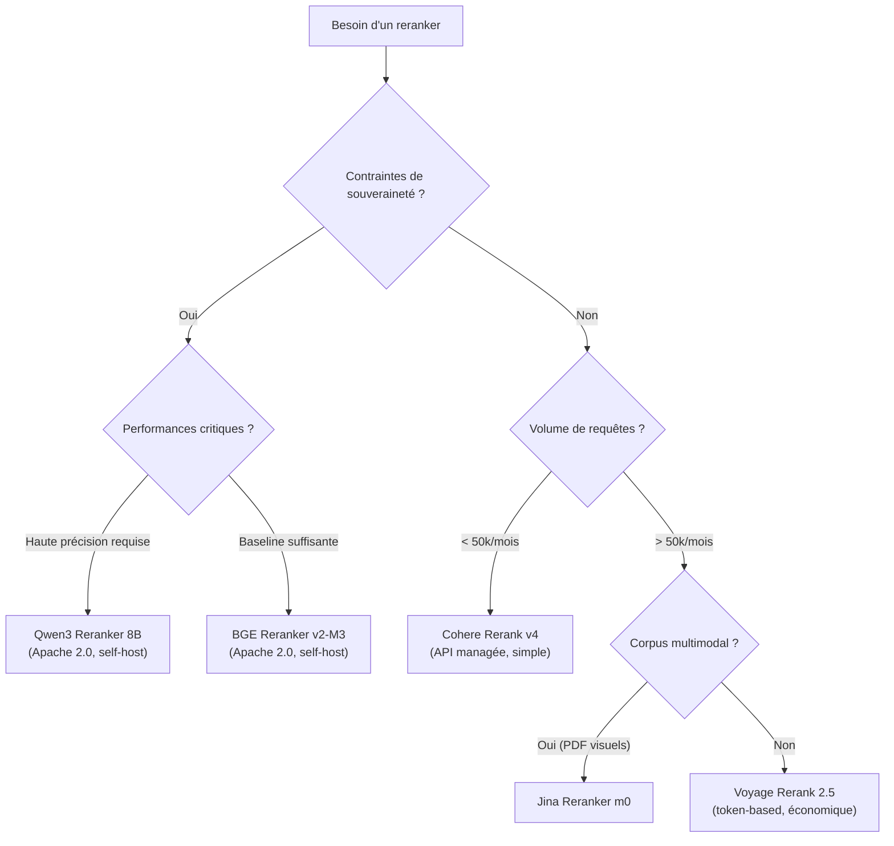

## Le retrieval hybride récupère les bons chunks. Le reranker les met dans le bon ordre.

Vous avez implémenté un [retrieval hybride BM25 + vectoriel](rag-hybride-bm25-vectoriel.md). Votre recall@10 est correct. Pourtant, le LLM produit des réponses médiocres : l'information pertinente est bien dans les 10 chunks remontés, mais elle est au rang 8 ou 9. Le LLM l'ignore ou la dilue dans le bruit des chunks du dessus.

C'est le problème que le reranker résout. Pas le recall, la précision. Pas "trouver", mais "mettre en premier ce qui compte".

Dans cet article, je compare les quatre rerankers les plus utilisés en production (Cohere, BGE, Jina, Voyage) avec les arrivants notables de 2025-2026, les chiffres de benchmark publics, les prix réels, et une recommandation directe par profil de projet.

<!-- more -->

> Cet article fait partie du [guide complet sur le RAG](/rag/) : retrieval hybride, embeddings, chunking, reranking et évaluation.

## Sommaire

1. [Bi-encoder vs cross-encoder : deux architectures de scoring](#bi-encoder-vs-cross-encoder-deux-architectures-de-scoring)
2. [Tableau comparatif des rerankers en 2026](#tableau-comparatif-des-rerankers-en-2026)
3. [Cohere Rerank : la référence managée](#cohere-rerank-la-reference-managee)
4. [BGE Reranker : l'open source qui tient la route](#bge-reranker-lopen-source-qui-tient-la-route)
5. [Jina Reranker : la carte multimodale](#jina-reranker-la-carte-multimodale)
6. [Voyage Rerank : vitesse et sobriété](#voyage-rerank-vitesse-et-sobriet)
7. [Les nouveaux entrants : Zerank, Qwen3, Mixedbread](#les-nouveaux-entrants-zerank-qwen3-mixedbread)
8. [Profils de recommandation par cas d'usage](#profils-de-recommandation-par-cas-dusage)
9. [Quand un reranker ne sert à rien](#quand-un-reranker-ne-sert-a-rien)
10. [Intégration en pratique : snippet Python minimal](#integration-en-pratique-snippet-python-minimal)
11. [FAQ](#faq)
12. [Pour aller plus loin](#pour-aller-plus-loin)

## Bi-encoder vs cross-encoder : deux architectures de scoring

Un reranker RAG est un modèle qui prend une paire (question, chunk) et renvoie un score de pertinence. Ce score sert à réordonner les résultats issus du retrieval initial avant de les envoyer au LLM.

La distinction fondamentale : pourquoi ne pas se contenter du modèle d'embedding pour scorer ?

**Le bi-encoder** (votre modèle d'embedding) encode la question seule d'un côté, le chunk seul de l'autre, puis compare les deux vecteurs par similarité cosinus. C'est rapide parce que chaque texte est encodé indépendamment. Mais cette indépendance est aussi la limite : le modèle ne voit jamais la question et le chunk en même temps. Il ne peut pas raisonner sur leur relation fine.

**Le cross-encoder** voit la paire complète en entrée. La question et le chunk sont concaténés dans une seule séquence, traités ensemble par l'attention. Le modèle comprend pourquoi ce chunk répond (ou ne répond pas) à cette question précise. Le prix : il faut appeler le modèle une fois par paire, ce qui est trop lent pour chercher dans un index de millions de documents. D'où le pipeline en deux étapes.

| | Bi-encoder | Cross-encoder |
|---|---|---|
| Entrée | Question seule / Chunk seul | (Question, Chunk) ensemble |
| Vitesse | Très rapide (index pré-calculé) | Lent (calcul à la volée) |
| Qualité de scoring | Approximative | Fine, contextuelle |
| Usage | Retrieval initial (top-100) | Reranking final (top-10 → top-3) |
| Exemple | text-embedding-3-small, BGE-M3 | Cohere Rerank, bge-reranker-v2-m3 |

Le pipeline classique : bi-encoder récupère les 50 à 100 meilleurs candidats, cross-encoder les rerange, on garde les 3 à 5 premiers pour le LLM.

Pour comprendre pourquoi le choix du modèle d'embedding en amont influence directement le gain apporté par le reranker, voir l'article sur [les embeddings et leur impact sur le RAG](embeddings-rag-comprendre-importance.md).

## Tableau comparatif des rerankers en 2026

Chiffres issus des benchmarks publics Agentset (leaderboard, mis à jour février 2026), docs officielles Voyage AI, Cohere et Jina, et de la littérature académique pour BGE.

| Modèle | ELO (Agentset) | nDCG@10 BEIR | Latence moyenne | Prix API | Self-host | Licence | Français |
|---|---|---|---|---|---|---|---|
| Zerank 2 | 1638 | n.d. | 265 ms | $0,025/M tokens | Non | Propriétaire | Oui |
| Cohere Rerank 4 Pro | 1629 | n.d. | 614 ms | $2,00/1k searches | Non | Propriétaire | Oui (100+ langues) |
| Voyage Rerank 2.5 | 1544 | n.d. | 613 ms | $0,05/M tokens | Non | Propriétaire | Oui |
| Cohere Rerank 3.5 | n.d. | n.d. | ~600 ms | $2,00/1k searches | Non | Propriétaire | Oui |
| BGE Reranker v2-M3 | n.d. | 51,8 | Variable (GPU) | Gratuit | Oui | Apache 2.0 | Oui (multilingue) |
| Jina Reranker v3 | n.d. | 61,94 | ~300 ms | Freemium | Oui (CC-BY-NC) | CC-BY-NC 4.0 | Oui (100+ langues) |
| Qwen3 Reranker 8B | 1473 | n.d. | Variable | Gratuit | Oui | Apache 2.0 | Oui |
| Mixedbread mxbai-rerank-v2 | n.d. | n.d. | Variable | Gratuit | Oui | Apache 2.0 | Oui |

**Notes sur les chiffres.** L'ELO Agentset est calculé sur comparaisons GPT-5 tête-à-tête sur 6 datasets (finance, science, essais, web). Le nDCG@10 BEIR est le benchmark académique de référence (18 datasets de recherche d'information). Les deux métriques ne mesurent pas exactement la même chose : l'ELO intègre la qualité perçue sur du contenu long, BEIR teste la pertinence sur des corpus variés.

**Chiffres à re-vérifier avant production.** Les prix Cohere ($2/1k searches), Voyage ($0,05/M tokens pour rerank-2.5), et les scores ELO changent régulièrement. Consultez les pages officielles avant de budgétiser.

## Cohere Rerank : la référence managée

Cohere Rerank est le choix par défaut de la plupart des équipes qui ne veulent pas gérer d'infrastructure. API, haute disponibilité, support multilingue documenté sur 100+ langues, documentation soignée.

### Modèles disponibles en 2026

Cohere propose trois générations actives :

- **rerank-v4.0-pro** : le plus précis, optimisé qualité, 614 ms de latence moyenne (benchmark Agentset).
- **rerank-v4.0-fast** : même génération, latence réduite au prix d'un léger sacrifice sur la précision.
- **rerank-v3.5** et **rerank-v3.0** (anglais + multilingue) : toujours disponibles pour la continuité des déploiements existants.

### Prix et modèle de facturation

La tarification Cohere est par "search unit" : **une requête avec jusqu'à 100 documents = 1 unité**. Le prix est de **$2,00 per 1 000 searches** pour rerank-v3.5, même logique pour v4. Un document de plus de 500 tokens est découpé en chunks, chaque chunk comptant séparément.

Pour 10 000 requêtes quotidiennes avec 20 documents chacune, le coût est de 20 dollars par jour, soit environ 600 dollars par mois. C'est le premier frein pour les équipes avec un volume élevé.

### Avantages concrets

- Zéro infrastructure à gérer.
- Support natif dans LangChain (`CohereRerank`), LlamaIndex, et la plupart des frameworks RAG.
- Latence prévisible (SLA managé).
- Le meilleur score ELO parmi les APIs propriétaires selon le leaderboard Agentset (1629, derrière Zerank 2 mais devant Voyage).

### Limite principale

Vendor lock-in total. Pas de self-hosting. Si l'API est indisponible, votre pipeline est bloqué. Et pour des données sensibles ou souveraines, Cohere propose des déploiements dédiés (Model Vault) qui changent complètement la structure de coût : $5/heure ou $3 250/mois.

## BGE Reranker : l'open source qui tient la route

BGE Reranker v2-M3 (BAAI/bge-reranker-v2-m3) est le reranker open source le plus utilisé en production. 278 millions de paramètres, licence Apache 2.0, disponible directement sur HuggingFace.

### Performances mesurées

Sur le benchmark BEIR, bge-reranker-v2-m3 atteint **51,8 nDCG@10**. Pour référence, jina-reranker-v3 atteint 61,94 nDCG@10 sur le même benchmark. La différence existe mais BGE reste compétitif sur les corpus métiers courants, et les benchmarks académiques BEIR ne capturent pas toujours bien les corpus techniques en français.

Dans des benchmarks indépendants sur des corpus RAG métiers, BGE-reranker-v2-m3 améliore le vectoriel seul de +11 points de NDCG en moyenne.

### Architecture et déploiement

| Paramètre | Valeur |
|---|---|
| Taille | 278M paramètres |
| Architecture | Encoder cross-attention (type BERT) |
| Contexte max | 512 tokens |
| Langues | Multilingue (MIRACL benchmark) |
| Licence | Apache 2.0 |
| Coût | $0 (self-host) |
| HuggingFace | `BAAI/bge-reranker-v2-m3` |

### Profil de latence

Sur CPU, BGE-reranker-v2-m3 est utilisable pour des batches inférieurs à 50 paires. Au-delà, un GPU devient nécessaire pour tenir sous 500 ms. Sur une GPU T4 (Google Colab ou équivalent), la latence tombe à 80-150 ms pour 20 documents, comparable aux APIs propriétaires.

### La limite à connaître

La limite de contexte à 512 tokens est la principale contrainte. Si vos chunks font 600 tokens ou plus, vous devrez les tronquer ou utiliser un modèle différent. bge-reranker-v2-gemma (1,5B params) lève cette contrainte mais demande plus de ressources.

## Jina Reranker : la carte multimodale

Jina AI a pris un angle différenciant : ses rerankers gèrent le texte mais aussi les documents visuels (PDFs avec mise en page, tableaux, images).

### Modèles disponibles

- **jina-reranker-v3** : 0,6B paramètres, architecture listwise (traite jusqu'à 64 documents simultanément dans une fenêtre de 131 000 tokens), nDCG@10 = 61,94 sur BEIR. C'est le meilleur score BEIR parmi les modèles comparés ici.
- **jina-reranker-v2-base-multilingual** : cross-encoder classique, 100+ langues, fenêtre 8 192 tokens.
- **jina-reranker-m0** : le modèle multimodal, capable de scorer des documents PDF à partir de leurs représentations visuelles.
- **jina-colbert-v2** : architecture ColBERT (late interaction), 89 langues. Utile pour les corpus longs.

### Différence avec les autres : l'approche listwise

La grande majorité des rerankers sont **pointwise** : ils scorent chaque paire (question, document) indépendamment, puis trient les scores. jina-reranker-v3 est **listwise** : il voit tous les documents candidats en même temps et raisonne sur leur ordre relatif. En théorie, c'est plus proche de ce que fait un humain quand il juge la pertinence d'un ensemble de résultats.

En pratique, l'avantage se mesure surtout sur des corpus longs et des questions complexes.

### Prix et licences

Jina propose un free tier de 10 millions de tokens par nouvelle clé API. La tarification en production n'est pas affichée publiquement en $/M tokens sur la page principale (à vérifier sur jina.ai au moment du déploiement). Les modèles sont disponibles sous licence CC-BY-NC 4.0, ce qui signifie que l'usage commercial direct des poids nécessite un accord avec Jina AI.

Le self-hosting est possible techniquement mais la licence CC-BY-NC 4.0 exclut l'usage commercial sans accord. Pour un usage commercial en self-host, contactez Jina directement.

## Voyage Rerank : vitesse et sobriété

Voyage AI a construit sa réputation sur des modèles d'embedding de haute qualité. Ses rerankers suivent la même philosophie : performants, rapides, prix compétitifs.

### Modèles actuels

- **voyage-rerank-2.5** : le modèle principal, $0,05/M tokens, 200 millions de tokens offerts chaque mois.
- **voyage-rerank-2.5-lite** : version allégée, $0,02/M tokens, même crédit mensuel.
- **voyage-rerank-2** et **voyage-rerank-2-lite** : génération précédente, disponibles aux mêmes tarifs.

### Calcul des coûts

Voyage facture au token, avec une formule précise : `(tokens de la question × nombre de documents) + somme des tokens de tous les documents`. Pour une requête typique avec 20 documents de 300 tokens chacun et une question de 20 tokens, cela donne `(20 × 20) + (20 × 300) = 6 400 tokens`, soit $0,00032 par requête avec rerank-2.5. C'est significativement moins cher que Cohere au même volume.

### Positionnement sur les benchmarks

ELO Agentset : 1544 pour voyage-rerank-2.5, derrière Cohere v4 Pro (1629) et Zerank 2 (1638). Voyage se distingue par une latence comparable à Cohere (613 ms) tout en étant moins coûteux à volume élevé.

| Métrique | Voyage Rerank 2.5 | Cohere Rerank 4 Pro |
|---|---|---|
| ELO Agentset | 1544 | 1629 |
| Latence moyenne | 613 ms | 614 ms |
| Prix | $0,05/M tokens | $2,00/1k searches |
| Langues | Oui | Oui (100+) |
| Self-host | Non | Non |

Le rapport qualité/prix de Voyage en fait un candidat sérieux pour les pipelines à volume moyen à élevé, surtout si vous êtes déjà dans l'écosystème Voyage pour les embeddings.

## Les nouveaux entrants : Zerank, Qwen3, Mixedbread

Le marché des rerankers a significativement bougé en 2025-2026. Trois entrants méritent d'être connus.

**Zerank 2 (ZeroEntropy)**

Premier ELO sur le leaderboard Agentset avec 1638, devant Cohere Rerank 4 Pro. Zerank 2 est un reranker propriétaire accessible via API à $0,025/M tokens, soit moitié moins cher que Voyage. La latence mesurée est de 265 ms, deux fois plus rapide que Cohere et Voyage. ZeroEntropy est une entreprise récente, ce qui pose des questions légitimes sur la pérennité du service. À surveiller.

**Qwen3 Reranker (Alibaba)**

Qwen3 Reranker est disponible en plusieurs tailles (0,6B, 1,5B, 4B, 8B) sous licence Apache 2.0. Sur les benchmarks MTEB, le modèle 4B obtient des scores compétitifs : MTEB-R à 69,76, CMTEB-R à 75,94. C'est l'option open source la plus polyglotte du marché en 2026, avec un excellent support du chinois et du français. Pour les équipes qui veulent de la souveraineté et des performances comparables aux APIs propriétaires, Qwen3 Reranker 4B ou 8B est aujourd'hui le candidat le plus sérieux.

**Mixedbread mxbai-rerank-v2**

Apache 2.0, self-hostable gratuitement, performances solides sur BEIR. Moins connu que BGE mais souvent cité dans les comparaisons indépendantes. Bonne option de repli si vous cherchez une alternative open source à BGE.

## Profils de recommandation par cas d'usage

Pas de "meilleur reranker" dans l'absolu. Voici mes recommandations par profil.

**Vous voulez brancher un reranker en une heure sans gérer d'infrastructure**

Cohere Rerank v3.5 ou v4. SDK natif dans LangChain et LlamaIndex. Documentation claire. Multilingue. Comptez $2/1k searches et prévoyez un budget si votre volume dépasse 50 000 requêtes par mois.

**Vous avez des contraintes de souveraineté ou de données sensibles**

BGE Reranker v2-M3 en self-host (Apache 2.0, zéro dépendance externe) ou Qwen3 Reranker 8B si vous avez besoin d'une fenêtre de contexte plus longue et de performances supérieures. Les deux tournent sur une GPU standard (A10, T4).

**Votre corpus inclut des PDFs avec des tableaux, des graphiques ou des mises en page complexes**

Jina Reranker m0 : le seul reranker multimodal du marché à ce jour. Si votre base documentaire est du texte pur, l'avantage disparaît.

**Vous cherchez le meilleur rapport qualité/prix sur un volume important (> 500k requêtes/mois)**

Voyage Rerank 2.5 (tarification au token, plus prévisible à volume élevé) ou Zerank 2 si vous acceptez un fournisseur plus récent.

**Vous partez de zéro et voulez valider l'impact du reranker avant de choisir**

BGE Reranker v2-M3 en local pour vos tests. C'est gratuit, Apache 2.0, et ça vous donne une baseline réaliste. Ensuite, comparez avec l'API de votre choix sur votre dataset d'évaluation.

Pour construire ce dataset d'évaluation et mesurer objectivement le gain du reranker, l'article sur la [construction d'un dataset d'évaluation RAG en 30 minutes](dataset-evaluation-rag-questions-synthetiques.md) vous donne la méthode complète.



## Quand un reranker ne sert à rien

C'est la section anti-hype. Un reranker améliore le classement des candidats déjà remontés. Il ne peut pas inventer ce que le retrieval n'a pas trouvé.

**Si votre recall@10 est mauvais, le reranker ne changera rien.**

Reranker un ensemble de 10 chunks dont aucun ne contient la bonne réponse ne vous rapprochera pas de la vérité. Le problème est en amont : chunking trop fin ou trop large, embeddings mal adaptés à votre domaine, absence de retrieval hybride, ou query qui ne ressemble pas à ce qu'on a dans le corpus.

Jason Liu, dont les travaux sur l'optimisation RAG sont bien documentés, formule cela ainsi : "atteignez 97% de recall en retrieval avant de toucher à quoi que ce soit d'autre". La même logique s'applique au reranker : il optimise ce qui est déjà là, il ne compense pas un retrieval défaillant.

**Trois signaux qui indiquent que votre problème n'est pas le reranking :**

- Recall@20 inférieur à 0,70 sur votre dataset d'évaluation : problème de retrieval, pas de ranking.
- Les utilisateurs signalent que "la réponse est toujours sur un sujet différent" : problème de compréhension de la question, probablement du côté de l'embedding ou du chunking.
- Le LLM répond correctement quand vous lui donnez manuellement le bon chunk mais pas via le pipeline : le retrieval ne ramène pas ce qu'il faut.

Dans ces cas, ajoutez le reranker après avoir corrigé le retrieval, pas à la place. L'article sur les [8 techniques d'optimisation RAG avec gains mesurés](optimiser-rag-techniques.md) donne un ordre de priorité complet.

**Coût de latence à ne pas négliger.**

Un cross-encoder ajoute 200 à 600 ms à chaque requête. Sur une application conversationnelle où chaque échange compte, c'est visible pour l'utilisateur. Si votre SLA de réponse est sous 1 seconde, mesurez la latence totale (retrieval + reranking + génération) avant de valider l'architecture.

## Intégration en pratique : snippet Python minimal

L'exemple suivant montre l'intégration d'un reranker dans un pipeline RAG avec LangChain, en mode "retriever générique" qui fonctionne avec n'importe quel backend.

```python
from langchain.retrievers import ContextualCompressionRetriever
from langchain.retrievers.document_compressors import CohereRerank
from langchain_community.vectorstores import Qdrant
from langchain_openai import OpenAIEmbeddings

# 1. Retriever de base (ici vectoriel Qdrant, adaptez à votre stack)
embeddings = OpenAIEmbeddings(model="text-embedding-3-small")
vectorstore = Qdrant.from_existing_collection(
    embedding=embeddings,
    collection_name="votre_collection",
    url="http://localhost:6333",
)
base_retriever = vectorstore.as_retriever(search_kwargs={"k": 20})

# 2. Reranker Cohere (remplacez par BGE ou Voyage selon votre choix)
# Pour BGE en self-host :
# from langchain.retrievers.document_compressors import CrossEncoderReranker
# from langchain_community.cross_encoders import HuggingFaceCrossEncoder
# model = HuggingFaceCrossEncoder(model_name="BAAI/bge-reranker-v2-m3")
# reranker = CrossEncoderReranker(model=model, top_n=5)
reranker = CohereRerank(
    cohere_api_key="votre_cle_api",
    model="rerank-v3.5",  # ou rerank-v4.0-pro
    top_n=5,              # nombre de chunks conservés après reranking
)

# 3. Pipeline complet : retrieval (top-20) puis reranking (top-5)
compression_retriever = ContextualCompressionRetriever(
    base_compressor=reranker,
    base_retriever=base_retriever,
)

# 4. Utilisation
docs = compression_retriever.invoke("Votre question utilisateur ici")
# docs contient les 5 chunks les plus pertinents, dans le bon ordre
for i, doc in enumerate(docs):
    print(f"Rang {i+1} : {doc.page_content[:200]}")
```

**Paramètre clé : le ratio top-k de retrieval / top-n de reranking.**

Récupérer 20 candidats et en garder 5 après reranking (ratio 4:1) est un bon point de départ. Si votre latence le permet, récupérez 50 et gardez 5 pour augmenter la couverture. En dessous de 10 candidats en entrée du reranker, le gain est marginal.

**Pour BGE en self-host**, remplacez le bloc reranker par le code commenté ci-dessus. Le comportement du `ContextualCompressionRetriever` est identique, seul le modèle utilisé change.

## FAQ

**Quel reranker choisir pour un RAG en français ?**

Tous les rerankers comparés ici supportent le français. Cohere v3.5 et v4 ont une couverture documentée sur 100+ langues avec des benchmarks MIRACL. BGE-reranker-v2-m3 est entraîné sur des corpus multilingues incluant le français. Jina v2 et v3 couvrent 100+ langues. Voyage rerank-2.5 est multilingue. En pratique, sur du français métier courant (RH, juridique, technique industriel), BGE et Cohere donnent des résultats similaires. Testez sur votre propre corpus avant de choisir.

**Quelle différence entre reranking pointwise et listwise ?**

Le pointwise (Cohere, BGE, Voyage) score chaque paire (question, document) indépendamment. Le listwise (Jina v3) voit tous les documents ensemble et raisonne sur leur ordre relatif. En théorie, le listwise est plus précis. En pratique, la différence se mesure surtout sur des corpus longs avec des questions complexes. Pour la majorité des RAG d'entreprise, les deux approches donnent des résultats proches.

**Faut-il un reranker si j'utilise déjà un retrieval hybride BM25 + vectoriel ?**

Oui, les deux sont complémentaires. Le retrieval hybride améliore le recall (trouver plus de bons candidats). Le reranker améliore la précision (mettre les meilleurs en tête). Sur les benchmarks Microsoft Azure AI Search, hybrid seul donne +10% de NDCG vs vectoriel seul, et hybrid + reranker donne +37%. L'empilement est rentable.

**Peut-on utiliser BGE Reranker en production commerciale sans frais ?**

Oui. bge-reranker-v2-m3 est sous licence Apache 2.0, ce qui autorise l'usage commercial sans restriction. Il suffit de gérer l'infrastructure (GPU recommandé pour la production). Qwen3 Reranker et Mixedbread mxbai-rerank-v2 sont également Apache 2.0.

**Jina Reranker est-il gratuit pour un usage commercial ?**

Non directement. La licence CC-BY-NC 4.0 des poids Jina exclut l'usage commercial sans accord avec Jina AI. L'API Jina est utilisable commercialement (après le free tier de 10M tokens), mais le self-hosting commercial des poids requiert un accord spécifique.

**Combien de documents passer au reranker ?**

En pratique : récupérez 20 à 100 candidats au retrieval, reranquez-les, gardez 3 à 10 pour le LLM. Plus vous passez de documents au reranker, meilleur est le recall mais plus la latence augmente. Zerank 2 traite 265 ms pour 20 documents. Cohere et Voyage autour de 600 ms pour 100 documents. Adaptez selon votre SLA.

**Le reranker améliore-t-il les questions en langue rare ?**

Partiellement. Les rerankers multilingues (Cohere, BGE-M3, Jina, Voyage) fonctionnent sur les langues bien représentées dans leurs corpus d'entraînement. Pour des langues rares ou des dialectes, les performances peuvent chuter significativement. Testez toujours sur un échantillon de vos vraies questions utilisateurs.

```json
<script type="application/ld+json">
{
  "@context": "https://schema.org",
  "@type": "FAQPage",
  "mainEntity": [
    {
      "@type": "Question",
      "name": "Quel reranker choisir pour un RAG en français ?",
      "acceptedAnswer": {
        "@type": "Answer",
        "text": "Tous les rerankers comparés supportent le français : Cohere v3.5/v4, BGE-reranker-v2-m3, Jina v2/v3 et Voyage rerank-2.5 couvrent 100+ langues dont le français. En pratique, BGE et Cohere donnent des résultats similaires sur du français métier courant. Testez sur votre propre corpus avant de choisir."
      }
    },
    {
      "@type": "Question",
      "name": "Faut-il un reranker si j'utilise déjà un retrieval hybride BM25 + vectoriel ?",
      "acceptedAnswer": {
        "@type": "Answer",
        "text": "Oui, les deux sont complémentaires. Le retrieval hybride améliore le recall, le reranker améliore la précision. Sur les benchmarks Microsoft Azure AI Search, hybrid seul donne +10% de NDCG vs vectoriel seul, et hybrid + reranker donne +37%. L'empilement est rentable."
      }
    },
    {
      "@type": "Question",
      "name": "Quelle est la différence entre bi-encoder et cross-encoder dans un RAG ?",
      "acceptedAnswer": {
        "@type": "Answer",
        "text": "Le bi-encoder (modèle d'embedding) encode la question et le document séparément puis compare les vecteurs. C'est rapide mais approximatif. Le cross-encoder (reranker) voit la paire complète et raisonne sur leur relation fine. C'est plus précis mais plus lent. Le pipeline classique : bi-encoder récupère les 50-100 meilleurs candidats, le cross-encoder les rerange."
      }
    },
    {
      "@type": "Question",
      "name": "Peut-on utiliser BGE Reranker en production commerciale sans frais ?",
      "acceptedAnswer": {
        "@type": "Answer",
        "text": "Oui. bge-reranker-v2-m3 est sous licence Apache 2.0, ce qui autorise l'usage commercial sans restriction. Il suffit de gérer l'infrastructure (GPU recommandé pour la production). Qwen3 Reranker et Mixedbread mxbai-rerank-v2 sont également Apache 2.0."
      }
    },
    {
      "@type": "Question",
      "name": "Quand un reranker ne sert à rien ?",
      "acceptedAnswer": {
        "@type": "Answer",
        "text": "Quand le recall initial est mauvais. Un reranker améliore le classement des candidats déjà remontés : il ne peut pas inventer ce que le retrieval n'a pas trouvé. Si votre recall@20 est inférieur à 0,70 sur votre dataset d'évaluation, corrigez d'abord le retrieval (chunking, embeddings, hybrid search)."
      }
    },
    {
      "@type": "Question",
      "name": "Combien de documents faut-il passer au reranker ?",
      "acceptedAnswer": {
        "@type": "Answer",
        "text": "En pratique : récupérez 20 à 100 candidats au retrieval, reranquez-les, gardez 3 à 10 pour le LLM. Plus vous passez de documents, meilleur est le recall mais plus la latence augmente. Zerank 2 traite 20 documents en 265 ms, Cohere et Voyage autour de 600 ms pour 100 documents."
      }
    },
    {
      "@type": "Question",
      "name": "Jina Reranker est-il gratuit pour un usage commercial ?",
      "acceptedAnswer": {
        "@type": "Answer",
        "text": "Pas en self-hosting commercial. La licence CC-BY-NC 4.0 des poids Jina exclut l'usage commercial sans accord. L'API Jina est utilisable commercialement après le free tier de 10M tokens, mais le self-hosting commercial des poids requiert un accord spécifique avec Jina AI."
      }
    }
  ]
}
</script>
```

## Pour aller plus loin

- **[RAG hybride BM25 + vectoriel](rag-hybride-bm25-vectoriel.md)** : la brique de retrieval que le reranker vient compléter, avec les benchmarks qui justifient de l'implémenter
- **[Les embeddings, la brique de base de toute l'IA moderne](embeddings-rag-comprendre-importance.md)** : comprendre le bi-encoder pour mieux cerner ce que le cross-encoder apporte en plus
- **[Construire un dataset d'évaluation RAG en 30 minutes](dataset-evaluation-rag-questions-synthetiques.md)** : comment mesurer objectivement le gain apporté par votre reranker sur votre corpus réel
- **[Optimiser un RAG : 8 techniques de production](optimiser-rag-techniques.md)** : le reranker dans l'ordre de priorité complet d'un RAG de production

---------

Si mes articles vous intéressent et que vous avez des questions ou simplement envie de discuter de vos propres défis, n'hésitez pas à m'écrire à [anas@tensoria.fr](mailto:anas@tensoria.fr), j'aime échanger sur ces sujets !

Vous pouvez aussi [réserver un créneau d'échange](https://cal.eu/anas-rabhi/rendez-vous-ianas) ou vous abonner à ma newsletter :)

Si vous cherchez un accompagnement pour intégrer un pipeline RAG complet (retrieval hybride, reranking, évaluation) dans votre organisation, c'est le type de mission que je mène chez [Tensoria, consultant IA à Toulouse](/consultant-ia-toulouse/).

---

### À propos de moi

Je suis **Anas Rabhi**, consultant Data Scientist freelance. J'accompagne les entreprises dans leur stratégie et mise en oeuvre de solutions d'IA (RAG, Agents, NLP).

Découvrez mes services sur [tensoria.fr](https://tensoria.fr) ou testez notre solution d'agents IA [heeya.fr](https://heeya.fr).

<div style="text-align: center; margin: 40px 0; gap: 16px; display: flex; flex-wrap: wrap; justify-content: center;">
  <a href="https://cal.eu/anas-rabhi/rendez-vous-ianas" target="_blank" style="display: inline-block; background-color: #4F46E5; color: #ffffff; font-weight: bold; padding: 16px 32px; text-decoration: none; border-radius: 8px; font-size: 18px; letter-spacing: 0.8px; box-shadow: 0 6px 12px rgba(0, 0, 0, 0.2); transition: all 0.3s ease; border: none;">
    Réserver un créneau
  </a>
  <a href="https://anas-ai.kit.com/d8b1a255cc" target="_blank" style="display: inline-block; background-color: #222222; color: #ffffff; font-weight: bold; padding: 16px 32px; text-decoration: none; border-radius: 8px; font-size: 18px; letter-spacing: 0.8px; box-shadow: 0 6px 12px rgba(0, 0, 0, 0.2); transition: all 0.3s ease; border: none;">
    <span style="margin-right: 10px;">✉️</span> S'abonner à ma newsletter
  </a>
</div>
