## Il n'y a pas de librairie IA parfaite. Et ce n'est pas grave.

J'ai utilisé LangChain et LlamaIndex sur plus d'une vingtaine de projets, d'abord comme développeur, ensuite comme lead data scientist chargé de piloter des équipes. Sur des RAG de gestion documentaire, des agents de traitement de données métier, des pipelines d'extraction, des assistants sectoriels.

Voilà ce que j'en pense vraiment : **il n'y a pas de librairie IA parfaite**. Ni LangChain, ni LlamaIndex. Et toutes les équipes qui construisent des produits IA sérieux sur le long terme finissent par développer leur propre stack.

Ce n'est pas un bashing. C'est un constat pragmatique, fondé sur ce que j'ai vécu sur le terrain. Ces librairies ont de vraies qualités, elles rendent de vrais services, et il y a des situations où les utiliser est clairement le bon choix. Mais il y a aussi une réalité qu'on entend rarement : **au fond, LangChain et LlamaIndex ne font qu'appeler des APIs**. Les APIs d'OpenAI, d'Anthropic, de Google, de Mistral. Et ces APIs, on peut les appeler directement, avec un code qui reste sous notre contrôle.

Dans cet article, je couvre les vraies limites des deux librairies, quand elles conviennent, pourquoi on bascule vers du custom, et comment le SDK OpenAI seul couvre aujourd'hui une fraction énorme des besoins en production.

<!-- more -->

> Pour les choix d'architecture détaillés et les alternatives, voir le [guide complet sur les agents IA](/agents-ia/).

***

## La promesse initiale, et pourquoi c'est séduisant

LangChain et LlamaIndex sont nés en 2022, dans un contexte particulier : les APIs GPT-3.5 et GPT-4 venaient d'exploser, tout le monde voulait construire des applications dessus, mais coder un RAG ou un agent depuis zéro demandait un travail non négligeable.

Ces librairies ont résolu un vrai problème. Avant elles, il fallait :

- Gérer soi-même les appels aux APIs LLM avec retry et gestion d'erreur
- Implémenter le chunking, l'embedding, la recherche vectorielle
- Assembler les prompts manuellement
- Brancher les outils un par un pour les agents

Après, quelques lignes suffisaient pour un prototype fonctionnel. `RetrievalQA.from_chain_type(...)` chez LangChain, `VectorStoreIndex.from_documents(...)` chez LlamaIndex, et vous aviez un RAG opérationnel en une après-midi.

**Pour un POC ou un projet de démonstration, c'est imbattable.** La vitesse de prototypage est réelle, la communauté est massive, les intégrations avec les vector databases, les sources de données et les providers LLM sont nombreuses. Si vous avez deux semaines pour montrer quelque chose qui fonctionne, ces librairies sont vos meilleures amies.

Le problème commence quand le POC devient un produit.

***

## Le mythe du carré dans le trou rond

C'est l'image que j'utilise systématiquement pour expliquer la limite fondamentale de ces librairies.

Chaque projet IA en entreprise est différent. Les données ne sont jamais dans le même format. Les contraintes métier varient. Les règles de gestion sont spécifiques. Le comportement attendu du système dépend du contexte client. **Deux projets RAG dans deux entreprises différentes ont en commun le pattern architectural, pas la réalité d'implémentation.**

LangChain et LlamaIndex ont été conçus avec des abstractions génériques : Chain, Agent, QueryEngine, Tool, Retriever, Pipeline. Ces abstractions couvrent bien les cas standard. Mais dès que votre besoin s'écarte un peu de ces cas, vous vous retrouvez à passer plus de temps à comprendre comment contourner la librairie qu'à coder votre solution.

C'est ça, le carré dans le trou rond : **on essaie de faire entrer son cas d'usage dans le moule de la librairie, et ça force des compromis sur la qualité finale**.

Voici trois exemples concrets que j'ai vécus :

**Cas 1 : un retrieval custom avec re-ranker maison et requête SQL simultanée.** Le besoin : récupérer des documents vectoriels ET interroger une base SQL en même temps, avec un re-ranker qui fusionne les deux résultats selon une logique métier. Avec LangChain, j'ai passé deux jours à comprendre comment étendre les classes de retriever, à lutter contre les abstractions en cascade. La solution custom équivalente : 80 lignes de Python lisible.

**Cas 2 : un agent avec une logique métier précise sur certains tools.** L'agent devait appeler certains outils dans un ordre précis selon le contexte, avec des règles de fallback spécifiques au domaine. L'`AgentExecutor` de LangChain ne permettait pas ce niveau de contrôle sans hacker autour de ses mécanismes internes. On a fini par écrire une boucle ReAct en pur Python.

**Cas 3 : un logging et une observabilité customisés.** On voulait des traces structurées, un format de log spécifique pour l'outil d'observabilité déjà en place dans l'entreprise. Le système de callbacks de LangChain est documenté, mais chaque mise à jour de version le fait évoluer. Trop fragile pour un système en production.

Ces trois cas ne sont pas des exceptions. Ils sont la norme dès qu'on sort des démos.

***

## LangChain en production : ce qui marche et ce qui casse

Soyons précis, parce que LangChain a de vraies forces qu'il serait malhonnête de nier.

**Ce qui marche bien :**

- Prototyper un agent ReAct ou un RAG basique en 50 lignes : c'est la promesse, elle est tenue
- Accéder à plus de 200 connecteurs prêts à l'emploi (Slack, Notion, Confluence, Google Drive, bases SQL, etc.)
- Tester rapidement plusieurs LLMs sans réécrire le code appelant
- LangGraph, leur framework pour les agents avec état, est aujourd'hui un bon outil pour les agents structurés en 2026 : il modélise les workflows comme des graphes avec boucles et conditions, et c'est bien concu

**Ce qui pose problème en production :**

L'instabilité de l'API est le problème le plus sous-estimé. LangChain a changé de structure architecturale plusieurs fois : d'abord les legacy chains, puis LCEL (LangChain Expression Language) avec l'opérateur pipe `|`, puis LangGraph pour les agents. Du code qui tournait parfaitement il y a 18 mois peut ne plus fonctionner aujourd'hui, et les messages d'erreur générés par la surcharge de l'opérateur `|` dans LCEL sont difficiles a interpréter sans connaitre les internals du framework.

Les couches d'abstraction empilées deviennent rapidement un enfer de debug. Quand quelque chose plante, il faut traverser trois niveaux d'abstraction pour comprendre ce qui s'est passé. En prod, chaque minute de debug non résolu coute cher.

La performance peut poser problème sur des chaînes complexes : l'overhead des couches d'abstraction n'est pas négligeable sur certaines architectures.

L'observabilité customisée reste compliquée sans passer par LangSmith (l'outil propriétaire de LangChain) ou Langfuse. Ce qui crée une dépendance supplémentaire.

**La recommandation honnête pour LangChain :** il reste pertinent pour des POC rapides et pour des agents LangGraph bien structurés. Au-delà, les risques augmentent avec la complexité du projet.

***

## LlamaIndex pour le RAG : ou est la frontiere

LlamaIndex a une philosophie plus centrée sur le RAG que LangChain, et ca se sent dans la qualite de ses abstractions pour ce use case précis.

**Ce qui marche bien :**

- Les pipelines RAG standards : ingestion, chunking, embedding, retrieval, query engine, sub-query decomposition. C'est fluide et bien concu.
- L'intégration avec les vector databases est excellente : Qdrant, Chroma, pgvector, Weaviate, Pinecone. Les connecteurs sont matures et bien maintenus.
- Le `TestsetGenerator` pour générer automatiquement des jeux d'évaluation est une vraie valeur ajoutée : c'est quelque chose qui n'existe pas de facon aussi aboutie dans LangChain.
- Les patterns de retrieval avancés (HyDE, multi-query, sub-question) sont pré-implémentés et fonctionnent correctement sur les cas standard.

**Ce qui se complique :**

Dès qu'on sort des patterns standards, le temps de montée en compétence devient conséquent. Vouloir un chunking non standard qui respecte la structure sémantique de vos documents ? Un re-ranker custom qui intègre des métadonnées métier dans le score ? Un système de mémoire spécifique à votre domaine ? Il faut plonger dans les abstractions de la librairie, comprendre comment les étendre, et naviguer dans une documentation qui évolue vite.

L'API de LlamaIndex a elle aussi beaucoup changé : les Index, les Engines, les Retrievers, les Pipelines ont vu leurs noms et interfaces évoluer entre les versions. Pour un projet R&D qui doit être maintenu sur 12 à 24 mois, c'est un risque réel.

**La recommandation honnête pour LlamaIndex :** la librairie peut convenir pour le RAG, tant qu'on n'essaie pas trop de faire de la R&D ou d'implémenter des algos custom. Sinon, le temps de montée en compétence sur les abstractions risque d'être long, et on finit par passer plus de temps a comprendre la lib qu'a résoudre le vrai problème métier.

***

## Ce que ces libs font réellement : appeler des APIs

C'est le constat qui change la perspective sur tout le reste.

Prenez n'importe quelle fonctionnalité de LangChain ou LlamaIndex. Derrière, que se passe-t-il réellement ?

- Un appel LLM : un appel HTTP à l'API d'OpenAI, Anthropic, Google ou Mistral
- Une recherche vectorielle : un appel au SDK de votre vector database (Qdrant, pgvector, Weaviate)
- Un tool call d'agent : un JSON formaté selon la spec function calling d'OpenAI, envoyé a l'API
- Une évaluation : encore un appel LLM avec un prompt "juge"
- L'ingestion de documents : du parsing, du chunking, des appels embedding, des upserts en base

**Il n'y a pas de magie.** Ces librairies ajoutent du sucre syntaxique et des abstractions par-dessus des appels que vous pourriez faire directement. Ce sont des couches de commodité, pas des couches de capacité.

```mermaid
graph TD
    subgraph "Avec LangChain / LlamaIndex"
        A1["Votre code"] --> B1["Abstraction LangChain\n(Chain, Agent, Tool...)"]
        B1 --> C1["Abstraction LlamaIndex\n(QueryEngine, Retriever...)"]
        C1 --> D1["SDK provider\n(openai, anthropic...)"]
        D1 --> E1["API LLM\n(OpenAI, Claude, Gemini...)"]
        C1 --> F1["SDK vector DB\n(qdrant-client, pgvector...)"]
        F1 --> G1["Base vectorielle\n(Qdrant, pgvector, Chroma...)"]
    end

    subgraph "Avec votre stack custom"
        A2["Votre code"] --> D2["SDK provider\n(openai, anthropic...)"]
        D2 --> E2["API LLM\n(OpenAI, Claude, Gemini...)"]
        A2 --> F2["SDK vector DB\n(qdrant-client, pgvector...)"]
        F2 --> G2["Base vectorielle\n(Qdrant, pgvector, Chroma...)"]
    end

    style A1 fill:#fef3c7,stroke:#d97706,color:#000
    style A2 fill:#fef3c7,stroke:#d97706,color:#000
    style B1 fill:#fce7f3,stroke:#db2777,color:#000
    style C1 fill:#fce7f3,stroke:#db2777,color:#000
    style D1 fill:#e0e7ff,stroke:#4338ca,color:#000
    style D2 fill:#e0e7ff,stroke:#4338ca,color:#000
    style E1 fill:#bbf7d0,stroke:#16a34a,color:#000
    style E2 fill:#bbf7d0,stroke:#16a34a,color:#000
    style F1 fill:#e0e7ff,stroke:#4338ca,color:#000
    style F2 fill:#e0e7ff,stroke:#4338ca,color:#000
    style G1 fill:#bbf7d0,stroke:#16a34a,color:#000
    style G2 fill:#bbf7d0,stroke:#16a34a,color:#000
```



Les mêmes briques sous-jacentes dans les deux cas. La différence : avec votre stack custom, vous avez le contrôle total, le code est lisible, le debug est direct, et vous n'êtes pas soumis aux breaking changes d'une dépendance tierce.

En production sérieuse, vous pouvez et souvent devez orchestrer directement ces SDK. Vous gagnez en contrôle, en lisibilité, en performance, en stabilité, et en debugabilité.

***

## Le bonus : on peut presque tout appeler avec le SDK OpenAI

C'est le point technique qui devrait convaincre les plus sceptiques.

Le SDK Python d'OpenAI est devenu un quasi-standard de fait dans l'écosystème LLM. Sa structure d'API est compatible avec un nombre croissant de providers et d'outils. En 2026, cela inclut :

- **Mistral** via leur endpoint compatible OpenAI (`api.mistral.ai/v1`)
- **Google Gemini** via le mode de compatibilité OpenAI
- **Groq** (compatible OpenAI nativement)
- **vLLM** en self-hosted (sert une API OpenAI-compatible)
- **Ollama** en local (même API)
- **OpenRouter** : un seul endpoint, 300+ modèles dont Claude, Gemini, Llama, Mistral, DeepSeek
- **LiteLLM** : un proxy open source qui expose une interface OpenAI-compatible pour 100+ providers

Concrètement, un seul code, des dizaines de providers :

```python
from openai import OpenAI

# Provider 1 : OpenAI direct
client = OpenAI(api_key="sk-...")

# Provider 2 : Mistral via leur endpoint compatible
client = OpenAI(
    base_url="https://api.mistral.ai/v1",
    api_key="mistral-api-key"
)

# Provider 3 : Claude ou Gemini via OpenRouter
client = OpenAI(
    base_url="https://openrouter.ai/api/v1",
    api_key="openrouter-api-key"
)

# Provider 4 : modele open source self-hosted via vLLM
client = OpenAI(
    base_url="http://localhost:8000/v1",
    api_key="dummy"
)

# Provider 5 : LiteLLM proxy (tous les providers derriere un seul endpoint)
client = OpenAI(
    base_url="http://localhost:4000",
    api_key="litellm-master-key"
)

# Tous les appels sont identiques, quel que soit le provider
response = client.chat.completions.create(
    model="gpt-4.1",           # ou "mistral-large-latest"
    # model="anthropic/claude-sonnet-4-6"  # via OpenRouter
    # model="google/gemini-2.0-flash"      # via OpenRouter
    # model="meta-llama/llama-3.3-70b"    # via Groq ou OpenRouter
    messages=[
        {"role": "system", "content": "Tu es un assistant expert."},
        {"role": "user", "content": "Explique le RAG en 3 phrases."}
    ]
)
```

Est-ce que tout est 100% identique ? Non. Le function calling chez Anthropic a quelques specificités dans sa spec native. Le streaming Gemini diffère parfois légèrement. Certains paramètres avancés varient selon les providers.

Mais **80 a 90% des cas d'usage tournent sans changer une seule ligne de code** entre les providers. Pour le reste, une abstraction custom légère avec quelques branches conditionnelles suffit.

Pour un produit IA sérieux, un wrapper interne autour du SDK OpenAI couvre 90% des besoins avec un code que toute l'équipe peut lire, maintenir et debugger. Beaucoup plus maintenable qu'une dépendance LangChain ou LlamaIndex pour les appels LLM.

***

## Ce que les equipes long terme font vraiment

J'ai observé un pattern qui se répète sur presque tous les projets qui durent.

**Phase 1 : le POC.** LangChain ou LlamaIndex selon le cas, quelques semaines. Ca va vite, le prototype est convaincant, les stakeholders sont contents.

**Phase 2 : le premier déploiement.** On met en prod. Et c'est là que les premières frictions apparaissent. La lib est trop verbeuse pour le logging qu'on veut. Le retriever standard ne supporte pas le filtre métier qu'on a besoin. Un callback ne se comporte pas comme prévu après une mise a jour de dépendance.

**Phase 3 : la mise a l'échelle.** Le trafic augmente, les cas limites se multiplient, les besoins de customisation s'accumulent. On commence a isoler les morceaux qui posent problème et a les réécrire en custom. On garde le reste de la lib.

**Phase 4 : le produit mature.** Six a douze mois plus tard, il ne reste plus que 10 a 30% de la librairie initiale dans le code. Parfois zéro. La stack maison est cohérente, connue de toute l'équipe, maintenue selon les règles internes du projet.

Ce n'est pas une critique de la librairie. C'est le cycle naturel d'un produit qui mûrit. Les librairies servent a démarrer vite. Les équipes sérieuses finissent par construire ce qui leur correspond vraiment.

Voici les composants typiques d'une stack maison en 2026 :

| Layer | Lib externe recommandée | Custom ? |
|---|---|---|
| Appels LLM | SDK provider direct (openai, anthropic) | Wrapper léger autour du SDK OpenAI |
| Vector database | Qdrant, pgvector, Weaviate (SDK direct) | Non |
| Logique de retrieval | Code custom | Oui |
| Chunking | Code custom selon le type de doc | Oui |
| Re-ranking | API Cohere/Voyage ou modele local (BGE) | Code custom court pour la logique de fusion |
| Mémoire agent | Mem0 ou custom selon le cas | Oui |
| Evaluation | RAGAS, DeepEval | Optionnel selon la maturité |
| Observabilité | Langfuse, Phoenix Arize | Non (trop spécialisé pour refaire) |
| Orchestration agent | LangGraph ou boucle ReAct custom | Selon la complexité |

Les outils d'évaluation comme RAGAS (voir [mon article sur l'évaluation RAG en production](evaluer-rag-production-metriques-ragas.md)) et les outils d'observabilité comme Langfuse restent pertinents même dans une stack custom : ce sont des domaines ou la lib apporte vraiment quelque chose de différenciant, et les refaire soi-même n'aurait pas de valeur ajoutée.

***

## Quand garder LangChain ou LlamaIndex

Pour être complet, voici la grille honnête que j'applique au début de chaque mission :

| Situation | Recommandation |
|---|---|
| POC en moins d'une semaine | OK avec lib, c'est l'usage ideal |
| Projet de 6 mois, équipe de moins de 3 devs | Lib avec discipline : pas d'abstraction profonde, rester en surface |
| Produit a 2+ ans, équipe data sérieuse | Stack custom + libs ponctuelles (RAGAS, Langfuse, LangGraph si besoin) |
| R&D, recherche, algos custom | Custom direct, les abstractions des libs vont ralentir la recherche |
| Connecteurs SaaS exotiques (Notion, Slack, Confluence...) | Garder LangChain uniquement pour ces connecteurs |
| Agent structuré avec état et boucles | LangGraph est un bon choix en 2026 |

La règle empirique : **si votre besoin colle naturellement aux abstractions de la lib, gardez-la. Dès que vous commencez a contourner ses abstractions, c'est le signal qu'il est temps de réécrire ce morceau en custom.**

***

## Mon process en mission aujourd'hui

Voici comment j'aborde concrètement chaque nouveau projet IA, après 20+ projets :

**Semaines 1 a 3 : POC avec lib.** J'utilise LlamaIndex pour les use cases RAG purs, LangChain (ou directement LangGraph) pour les agents. L'objectif est de valider le concept et de montrer quelque chose qui fonctionne rapidement. Je n'optimise rien, je ne customise pas profondément.

**Semaines 4 a 8 : validation business et qualité.** On garde la lib, on mesure la qualité (voir [les métriques d'évaluation RAG](evaluer-rag-production-metriques-ragas.md) et [les techniques d'optimisation](optimiser-rag-techniques.md)), on itère sur les prompts et les paramètres. C'est encore le bon moment pour la lib.

**Mise en prod et au-dela : identification des frictions.** Je liste les endroits ou la lib me freine : un retriever que je veux modifier, un comportement d'agent que je ne peux pas contrôler finement, un format de log incompatible avec l'infra existante.

**Refacto progressive.** Je remplace ces morceaux un par un par du code custom. Je conserve ce qui fonctionne bien (souvent l'évaluation, l'observabilité, parfois les connecteurs de données).

**Bilan a 6 mois.** Typiquement : 40 a 60% de la lib initiale a été remplacé par du custom. Le reste reste parce qu'il apporte vraiment quelque chose. C'est un équilibre sain.

Ce que j'observe sur les projets ou on n'a pas fait ce chemin : des dettes techniques qui s'accumulent, des breaking changes qui bloquent les mises a jour, et des développeurs qui passent plus de temps a comprendre les internals de la lib qu'a livrer de la valeur.

Pour aller plus loin sur les patterns agentiques qui méritent d'être implémentes en custom plutôt qu'avec une lib, lisez [mon analyse de l'Agentic RAG vs RAG classique](agentic-rag-vs-rag-classique.md) et [les concepts autour du MCP](mcp-model-context-protocol-agents-ia.md).

***

## FAQ

**LangChain est-il adapté a la production ?**

Oui, dans certaines conditions. Pour des agents LangGraph bien structurés et des POC, oui. Pour un produit complexe avec des besoins de customisation forts, les risques augmentent avec la durée du projet. L'instabilité historique de l'API et les couches d'abstraction empilées posent problème sur les projets longs. LangGraph 1.0 a introduit une politique de stabilité plus sérieuse en 2025, ce qui améliore la situation pour les agents.

**LlamaIndex ou LangChain pour un RAG ?**

LlamaIndex est généralement mieux adapté aux pipelines RAG standard : ses abstractions pour l'ingestion, l'indexation et le retrieval sont plus matures sur ce cas d'usage. LangChain est plus polyvalent mais moins spécialisé. Si votre besoin est un RAG pur sans trop de customisation, commencez par LlamaIndex.

**Faut-il faire sa propre stack IA ou utiliser une lib ?**

Les deux, selon la phase du projet. Lib pour démarrer vite, stack custom pour tenir sur la durée. La question n'est pas "lib ou custom ?" mais "quelle partie en lib, quelle partie en custom, et quand faire la transition ?".

**Le SDK OpenAI peut-il appeler Claude ou Gemini ?**

Oui, via des gateways comme OpenRouter ou LiteLLM, ou via les endpoints compatibles OpenAI que certains providers exposent directement (Mistral, Groq). OpenRouter donne accès a plus de 300 modèles via un seul endpoint avec le format OpenAI. 80 a 90% du code ne change pas d'un provider a l'autre.

**Quelles sont les vraies limites de LangChain ?**

Les trois principales en production : l'instabilité de l'API sur la durée (legacy chains, LCEL, LangGraph ont chacun cassé la compatibilité), les couches d'abstraction qui rendent le debug difficile, et la difficulté a customiser l'observabilité sans passer par LangSmith. Sur les projets courts, ces limites sont acceptables. Sur les projets longs, elles deviennent des dettes.

**LlamaIndex est-il bon pour la R&D ?**

Pour de la R&D ou des algos custom, les abstractions de LlamaIndex deviennent un frein plutôt qu'une aide. Le temps de montée en compétence sur les internals de la lib est long, et on préférera souvent partir sur du Python pur avec les SDKs directs, ce qui laisse toute la liberté d'expérimentation.

**Combien de temps pour développer sa propre stack IA ?**

Un wrapper LLM unifié autour du SDK OpenAI : une journée. Un retriever custom sur Qdrant ou pgvector : deux a trois jours. Un système de mémoire simple : deux jours. En tout, une stack custom cohérente pour un RAG ou un agent de complexité standard, c'est une a deux semaines pour une équipe de deux développeurs. Et elle sera exactement adaptée a vos besoins, sans compromis.

**LangGraph est-il une bonne option pour les agents ?**

Oui, et c'est probablement la meilleure chose issue de l'écosystème LangChain en 2026. LangGraph modélise les workflows agentiques comme des graphes avec états, boucles et conditions, ce qui correspond bien a la réalité des agents en production. Il a atteint la version 1.0 avec une politique de stabilité plus rigoureuse. Pour les agents complexes ou vous ne voulez pas tout réécrire, c'est un bon compromis.

**LiteLLM ou OpenRouter pour gérer plusieurs providers LLM ?**

Cas d'usage différents. OpenRouter est un service géré : un compte, un endpoint, 300+ modèles, facturation centralisée. Simple a mettre en place, parfait pour tester ou pour des volumes modérés. LiteLLM est un proxy open source que vous auto-hébergez : plus de contrôle, plus de flexibilité, adapté aux contextes ou les données ne doivent pas transiter par un tiers. En production sérieuse avec des contraintes de conformité, LiteLLM s'impose souvent.

**Quand abandonner LangChain pour du custom ?**

Trois signaux clairs : (1) vous passez plus de temps a comprendre les abstractions de la lib qu'a coder votre solution, (2) une mise a jour de dépendance a cassé quelque chose en prod, (3) vous n'arrivez pas a implémenter une logique métier sans contourner les mécanismes internes de la lib. Ces trois signaux peuvent apparaître ensemble ou séparément, et chacun d'eux mérite de réévaluer le morceau concerné.

***

## Pour aller plus loin

- **[MCP : le standard de connexion des agents IA](mcp-model-context-protocol-agents-ia.md)** : comment le Model Context Protocol simplifie l'intégration des outils dans les agents, et pourquoi c'est une brique de plus qui plaide pour une stack ouverte et modulaire
- **[Evaluer un RAG en production : métriques et RAGAS](evaluer-rag-production-metriques-ragas.md)** : l'évaluation est l'un des domaines ou les libs comme RAGAS apportent vraiment de la valeur. Comment l'intégrer dans votre stack, quelle qu'elle soit.
- **[Optimiser son RAG : les 8 techniques qui font la différence](optimiser-rag-techniques.md)** : les techniques d'optimisation RAG, et comment les implémenter avec ou sans librairie
- **[Agent IA vs n8n, Make et Zapier : quand choisir quoi](agent-ia-vs-n8n-make-zapier.md)** : le choix de la stack IA s'inscrit dans un écosystème plus large. Quand les outils no-code suffisent, et quand il faut du code.
- **[Agentic RAG vs RAG classique](agentic-rag-vs-rag-classique.md)** : les patterns agentiques, leurs coûts réels en latence et en complexité, et la grille de décision pour choisir

***

Si mes articles vous intéressent et que vous avez des questions ou simplement envie de discuter de vos propres défis, n'hésitez pas à m'écrire à [anas@tensoria.fr](mailto:anas@tensoria.fr), j'aime échanger sur ces sujets !

Vous pouvez aussi [réserver un créneau d'échange](https://cal.eu/anas-rabhi/rendez-vous-ianas) ou vous abonner à ma newsletter :)


---

### À propos de moi

Je suis **Anas Rabhi**, consultant Data Scientist freelance. J'accompagne les entreprises dans leur stratégie et mise en œuvre de solutions d'IA (RAG, Agents, NLP).

Découvrez mes services sur [tensoria.fr](https://tensoria.fr) ou testez notre solution d'agents IA [heeya.fr](https://heeya.fr).

<div style="text-align: center; margin: 40px 0; gap: 16px; display: flex; flex-wrap: wrap; justify-content: center;">
  <a href="https://cal.eu/anas-rabhi/rendez-vous-ianas" target="_blank" style="display: inline-block; background-color: #4F46E5; color: #ffffff; font-weight: bold; padding: 16px 32px; text-decoration: none; border-radius: 8px; font-size: 18px; letter-spacing: 0.8px; box-shadow: 0 6px 12px rgba(0, 0, 0, 0.2); transition: all 0.3s ease; border: none;">
    Réserver un créneau
  </a>
  <a href="https://anas-ai.kit.com/d8b1a255cc" target="_blank" style="display: inline-block; background-color: #222222; color: #ffffff; font-weight: bold; padding: 16px 32px; text-decoration: none; border-radius: 8px; font-size: 18px; letter-spacing: 0.8px; box-shadow: 0 6px 12px rgba(0, 0, 0, 0.2); transition: all 0.3s ease; border: none;">
    <span style="margin-right: 10px;">✉️</span> S'abonner à ma newsletter
  </a>
</div>
