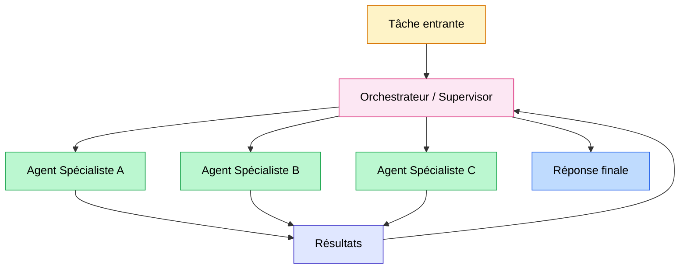

Un système multi-agents, c'est bien souvent la première architecture qu'on envisage. Plusieurs agents spécialisés, un orchestrateur qui distribue les tâches, des hand-offs propres entre les rôles. Sur le papier, c'est élégant.

En production, c'est une autre histoire.

Les systèmes multi-agents échouent entre 41 % et 86,7 % du temps selon le framework utilisé, d'après l'étude MAST publiée par UC Berkeley en mars 2025 sur 1 600 traces d'exécution. Et quand ils échouent, le problème vient rarement du modèle lui-même : il vient de l'architecture.

Voici ce que les données disent réellement, et comment décider si vous avez besoin de plusieurs agents ou d'un seul bien équipé.

<!-- more -->

> Cet article traite de l'architecture multi-agents elle-même. Pour les frameworks qui implémentent ces architectures (LangGraph, CrewAI, Pydantic AI...), voir le [guide complet sur les agents IA](/agents-ia/).

## Sommaire

1. [Pourquoi tout le monde veut du multi-agents](#pourquoi-tout-le-monde-veut-du-multi-agents)
2. [Ce que disent les données d'échec](#ce-que-disent-les-données-déchec)
3. [Les 3 cas où le multi-agents vaut vraiment le coup](#les-3-cas-où-le-multi-agents-vaut-vraiment-le-coup)
4. [Supervisor vs Swarm : deux architectures, deux usages](#supervisor-vs-swarm-deux-architectures-deux-usages)
5. [Quand un seul agent suffit](#quand-un-seul-agent-suffit)
6. [Grille de décision](#grille-de-décision)
7. [Le coût réel d'un hand-off](#le-coût-réel-dun-hand-off)
8. [FAQ sur les systèmes multi-agents](#faq-sur-les-systèmes-multi-agents)
9. [Pour aller plus loin](#pour-aller-plus-loin)

## Pourquoi tout le monde veut du multi-agents

Le multi-agents, c'est l'architecture qui bénéficie de la meilleure narration de 2025.

L'image est séduisante : des agents spécialisés qui travaillent en parallèle, comme une équipe humaine. Un agent cherche de l'information pendant qu'un autre analyse le code, pendant qu'un troisième rédige le rapport. Efficace, modulaire, scalable.

Plusieurs facteurs ont amplifié cet engouement ces deux dernières années :

- Les frameworks comme CrewAI et AutoGen ont rendu la mise en place d'un système multi-agents accessible en quelques lignes de code.
- Les démos de pipelines de recherche autonomes ont impressionné (SWE-bench, Devin, les agents de recherche Anthropic).
- Les éditeurs de frameworks ont intérêt à présenter le multi-agents comme la cible naturelle de toute architecture ambitieuse.

Le résultat : on déploie du multi-agents par défaut, même quand un seul agent avec les bons outils réglerait le problème proprement.

Ce n'est pas une critique des équipes qui font ce choix. C'est la conséquence logique d'un écosystème qui valorise la sophistication architecturale davantage que la simplicité opérationnelle.

La réalité de production corrige cette intuition rapidement.

## Ce que disent les données d'échec

L'étude MAST (Multi-Agent System Failure Taxonomy), menée par des chercheurs d'UC Berkeley et publiée en mars 2025, est la référence sur laquelle s'appuyer pour sortir des intuitions.

Les chercheurs ont analysé 1 600 traces d'exécution sur 7 frameworks populaires (AutoGen, ChatDev, CrewAI, MetaGPT, OpenHands, et d'autres). Résultat : les systèmes multi-agents échouent dans 41 % à 86,7 % des cas selon le framework et la tâche. MAST documente 14 modes de défaillance distincts, regroupés en 3 grandes catégories.

| Catégorie | Part des échecs | Exemples concrets |
|---|---|---|
| Problèmes de spécification | 42 % | Ambiguïté dans les instructions, agents qui interprètent différemment la tâche |
| Désalignement inter-agents | 37 % | Contexte fragmenté entre agents, formats de sortie incompatibles |
| Déficit de vérification | 21 % | Aucun agent ne valide le résultat final, tâche déclarée terminée à tort |

Ce qui est frappant dans les conclusions : la cause d'échec est rarement la capacité du modèle. Quand un système multi-agents échoue, le problème vient de l'architecture et de la coordination, pas de l'intelligence du LLM sous-jacent.

Autre observation importante : un ensemble d'agents qui passent chacun tous leurs tests unitaires individuels peut produire un système qui échoue au niveau global. Les défaillances sont systémiques, pas individuelles. C'est la conclusion centrale de MAST : "a collection of safe agents does not guarantee a safe collection of agents".

La désalignement de contexte mérite une mention particulière. Quand l'agent A transmet son output à l'agent B via un hand-off, il compresse et reformule. Cette reformulation peut perdre des nuances critiques, introduire des erreurs d'interprétation, ou simplement raccourcir un contexte qui avait besoin de sa pleine longueur. L'agent B travaille sur un contexte appauvri sans le savoir.

Pour comprendre ce qu'est un agent IA dans ses fondamentaux avant d'aller plus loin sur ces architectures, l'article [définition et fonctionnement des agents IA](c-est-quoi-un-agent-ia.md) pose les bases nécessaires.

## Les 3 cas où le multi-agents vaut vraiment le coup

Le multi-agents n'est pas une mauvaise architecture. C'est une architecture qui a des préconditions précises. Quand ces préconditions sont réunies, le gain est réel. Quand elles ne le sont pas, vous ajoutez de la complexité sans bénéfice.

Voici les trois cas documentés où le multi-agents apporte une valeur mesurable.

### Sous-tâches parallélisables et véritablement indépendantes

C'est le cas le plus propre et le plus documenté. Si une tâche peut se décomposer en sous-tâches qui n'ont pas besoin de se connaître pour s'exécuter, le multi-agents fait sens.

L'architecture de recherche multi-agents d'Anthropic, décrite dans leur article d'ingénierie "How we built our multi-agent research system" (2026), illustre ce point précisément. Un agent orchestrateur décompose la recherche en questions indépendantes. Des sous-agents travaillent en parallèle, chacun dans son propre contexte, sans connaissance des autres. L'orchestrateur récupère et synthétise les résultats.

La clé : chaque sous-agent reçoit une instruction autonome, un format de sortie défini, et une fenêtre de contexte fraîche. Il ne sait pas que les autres existent. C'est cette isolation qui rend le parallélisme propre et évite le désalignement inter-agents.

**Précondition à vérifier :** les sous-tâches peuvent-elles se compléter sans communiquer entre elles pendant l'exécution ? Si oui, le multi-agents parallèle est légitime.

### Lecture et traitement massifs de documents

Quand le volume d'information dépasse ce qu'une seule fenêtre de contexte peut traiter efficacement, distribuer le travail entre plusieurs agents est une solution valide.

Un seul agent avec 200 000 tokens de contexte peut théoriquement lire beaucoup. Mais les modèles actuels dégradent leur qualité de réponse quand le contexte approche de sa limite. La précision sur les faits situés au milieu d'un contexte long chute significativement (phénomène documenté dans la littérature comme "lost in the middle").

Plusieurs sous-agents traitant chacun un sous-ensemble documentaire, puis remontant leurs synthèses à un orchestrateur, contournent ce problème. C'est le principe sur lequel reposent les architectures de type [agentic RAG](agentic-rag-vs-rag-classique.md).

### Séparation de privilèges et isolation des risques

Certaines architectures de production séparent délibérément les agents par niveaux de permission, non pour des raisons de performance, mais pour des raisons de sécurité.

Un agent de collecte d'information n'a accès qu'en lecture à certaines sources. Un agent de décision travaille sur les données filtrées, sans accès direct aux sources brutes. Un agent d'exécution dispose des permissions d'écriture uniquement sur des systèmes définis.

Cette séparation limite les effets d'une prompt injection ou d'une hallucination : un agent compromis ne peut pas faire de dégâts au-delà de son périmètre. C'est un pattern documenté dans la documentation officielle Anthropic sur "Building Effective Agents".

## Supervisor vs Swarm : deux architectures, deux usages

Dans la pratique, deux patterns dominent les implémentations multi-agents en 2026.

**Le pattern Supervisor** (ou orchestrateur-workers) : un agent central reçoit la tâche, la décompose, délègue à des agents spécialistes, et consolide les résultats. L'orchestrateur maintient le contexte global. Les workers ont un contexte local limité.

C'est le pattern qu'Anthropic utilise pour son système de recherche. C'est aussi le pattern le plus facile à déboguer, parce qu'il y a un seul point de contrôle.

**Le pattern Swarm** : les agents se passent le contrôle entre eux dynamiquement, sans orchestrateur central. Chaque agent peut décider de transférer la tâche à un autre agent plus adapté selon la situation. OpenAI a expérimenté ce pattern (puis abandonné la bibliothèque Swarm en mars 2025 au profit de l'Agents SDK).

| Critère | Supervisor | Swarm |
|---|---|---|
| Débogage | Facile (point central) | Difficile (chaînes de hand-off complexes) |
| Latence | Dépend de l'orchestrateur | Peut être plus rapide sur des tâches dynamiques |
| Coût tokens | Élevé (orchestrateur voit tout) | Variable |
| Adapté à la production | Oui | Avec précautions |
| Cas d'usage typique | Recherche, analyse documentaire | Routage dynamique, support client |

En pratique, le pattern Supervisor est plus robuste pour une première mise en production. Le Swarm apporte de la valeur dans des cas de routage très dynamique, mais la difficulté de débogage des chaînes de hand-off est réelle.

Pour implémenter ces patterns, LangGraph (Supervisor natif, 34,5 millions de téléchargements mensuels sur PyPI) reste le choix de référence en production. Le comparatif complet des frameworks est dans l'article [CrewAI, LangGraph, AutoGen, Pydantic AI : comparatif 2026](crewai-langchain-langgraph-comparatif-pragmatique.md) : une fois l'architecture décidée, c'est là que se joue le choix d'implémentation.

## Quand un seul agent suffit

C'est probablement la section la plus utile de cet article, et celle qu'on trouve le moins dans les tutoriels.

La règle pragmatique de 2026 : **un seul agent bien conçu avec les bons outils gère correctement la majorité des cas d'usage réels.**

Les signaux qui indiquent qu'un seul agent est suffisant :

- La tâche est séquentielle, chaque étape dépend de l'étape précédente.
- Le contexte doit rester cohérent sur toute la durée de la tâche.
- Le volume de traitement rentre dans une fenêtre de contexte raisonnable.
- Vous avez besoin d'un comportement déterministe et traçable.

Les équipes qui passent directement au multi-agents rencontrent souvent le même problème : elles ajoutent de la coordination là où elles avaient besoin d'un meilleur prompt et de meilleurs outils.

L'approche recommandée, notamment dans la documentation Anthropic et dans les retours d'expérience LangChain, est d'adopter une progression : commencer avec un seul agent bien outillé, mesurer ses limites réelles, et n'ajouter un second agent que quand une limite précise justifie l'ajout.

Un agent qui dépasse ses limites produit généralement des symptômes identifiables : il commence à ignorer des instructions (contexte trop long), il confond des outils (trop d'outils dans le même contexte), il prend trop de temps sur une branche (pas de parallélisme possible). Ce sont ces symptômes, pas la sophistication a priori de l'architecture, qui doivent guider la décision.

## Grille de décision

Voici comment structurer la décision dans la pratique, à partir des critères qui ressortent de MAST et des recommandations Anthropic.

| Symptôme observé | Question à poser | Architecture recommandée |
|---|---|---|
| Le contexte devient trop long, le modèle "oublie" des instructions | Les sous-tâches sont-elles indépendantes ? | Multi-agents parallèle si oui, réduction du contexte si non |
| L'agent se trompe régulièrement d'outil | Y a-t-il trop d'outils pour un seul agent ? | Multi-agents avec spécialisation par domaine d'outils |
| Certaines étapes pourraient s'exécuter simultanément | Les étapes parallèles s'informent-elles mutuellement ? | Multi-agents parallèle si non, séquentiel si oui |
| Besoin de permissions différentes par étape | Y a-t-il un risque de sécurité si un agent a tous les accès ? | Multi-agents avec séparation de privilèges |
| Traitement d'un volume documentaire important | Volume > ce que gère proprement une seule fenêtre ? | Multi-agents documentaire (type agentic RAG) |
| Agent lent mais correct | Le délai est-il causé par des opérations séquentielles parallélisables ? | Multi-agents parallèle |
| Agent rapide mais qualité insuffisante | Le problème vient-il des données ou du raisonnement ? | Améliorer les outils et le prompt avant d'ajouter un agent |

La colonne de droite contient souvent "un seul agent" : c'est normal. Le multi-agents est la bonne réponse à une contrainte précise, pas la réponse par défaut.

## Le coût réel d'un hand-off

Chaque transfert d'information entre agents a un coût. Ce coût est rarement mesuré avant déploiement, et il surprend systématiquement en production.

Les données disponibles pour 2026 :

- Les systèmes multi-agents consomment en moyenne **4 à 15 fois plus de tokens** que leurs équivalents single-agent sur des tâches comparables, avec des pics à 220x dans les cas pathologiques (source : analyses comparatives Augment Code et Iterathon, 2026).
- Une architecture multi-agents centralisée (supervisor) génère environ **285 % de surcoût en tokens** par rapport à un single-agent. Une architecture indépendante parallèle génère environ **58 %** de surcoût.
- Dans une expérience contrôlée citée par Redis (2026), une entreprise a déployé un système multi-agents en support client pour 47 000 dollars par mois, là où un single-agent bien conçu aurait coûté 22 700 dollars pour seulement 2,1 points de précision de moins.

Ces chiffres méritent une vérification sur votre propre cas avant de les extrapoler : le surcoût dépend fortement de la structure de vos tâches, du nombre de hand-offs, et du modèle utilisé.

Ce qui est constant, en revanche : chaque hand-off consomme des tokens pour le contexte entrant de l'agent récepteur, le reformatage du contexte passant par l'orchestrateur, et éventuellement un appel LLM supplémentaire pour le routing. Sur un pipeline avec 5 agents et plusieurs itérations, ces coûts s'accumulent rapidement.

Le bon réflexe avant déploiement : instrumenter un prototype, compter les tokens sur un batch représentatif de vraies requêtes, et projeter le coût mensuel. La surprise est souvent à la hausse par rapport à l'estimation initiale.

La réduction du coût des tokens est un sujet à part entière, que j'aborde dans mon article sur le [prompt caching](prompt-caching-reduire-cout-llm.md) : une technique particulièrement utile dans les systèmes multi-agents où le contexte de l'orchestrateur est souvent stable entre les appels.

## FAQ sur les systèmes multi-agents

**Quelle est la différence entre un système multi-agents et un workflow classique ?**

Un workflow classique enchaîne des étapes prédéfinies dans un ordre fixe, sans prise de décision autonome. Un système multi-agents implique que chaque agent prend des décisions sur les actions à mener, peut changer de stratégie, et communique dynamiquement avec d'autres agents. La dynamique est le critère discriminant : si le chemin d'exécution est toujours le même, c'est probablement un workflow, pas un système multi-agents.

**Faut-il un LLM différent pour l'orchestrateur et les workers ?**

Pas nécessairement, mais c'est souvent pertinent. L'orchestrateur fait principalement du routing et de la coordination : un modèle intermédiaire comme Claude Haiku ou GPT-4o-mini peut suffire et coûte moins cher. Les workers spécialisés sur des tâches complexes (analyse, génération) méritent un modèle plus capable. Cette répartition réduit le coût global sans sacrifier la qualité sur les étapes critiques.

**Quelle est la différence entre le pattern Supervisor et le pattern Swarm ?**

Le Supervisor a un orchestrateur central qui voit toutes les décisions et délègue explicitement. Le Swarm permet aux agents de se passer le contrôle directement, sans point central. Le Supervisor est plus facile à déboguer. Le Swarm peut être plus réactif sur des tâches de routage dynamique mais génère des chaînes de hand-off difficiles à tracer.

**Comment savoir si mon agent unique atteint ses limites ?**

Trois signaux principaux : le modèle commence à ignorer des instructions situées loin dans le contexte (contexte trop long), il confond des outils de fonctions similaires (trop d'outils non différenciés), ou la latence augmente sans gain de qualité (traitement séquentiel de tâches qui pourraient être parallèles). Ces symptômes précis, pas la complexité perçue du problème, doivent déclencher la réflexion sur un second agent.

**Les systèmes multi-agents sont-ils plus fiables ?**

Pas intrinsèquement. L'étude MAST montre que les systèmes multi-agents introduisent des modes de défaillance systémiques que les agents individuels n'ont pas : désalignement de contexte entre agents, cascade d'erreurs dans une chaîne de hand-off, impossibilité pour un agent de corriger une erreur commise par un agent amont. La fiabilité dépend entièrement de la qualité de la conception de l'architecture.

**Quelle est la bonne taille d'équipe d'agents ?**

La règle non officielle dans les équipes qui ont de l'expérience en production : commencer avec 2 agents (un orchestrateur, un worker), valider que le gain est mesurable, puis ajouter un troisième seulement si un besoin précis le justifie. Au-delà de 5 agents dans un même pipeline, la complexité de débogage et de maintenance devient généralement un problème plus grand que le problème qu'on cherchait à résoudre.

**Comment gérer la mémoire dans un système multi-agents ?**

Chaque agent a sa propre fenêtre de contexte. L'orchestrateur peut maintenir un état partagé, mais il doit décider explicitement ce qu'il transmet à chaque worker. Si l'historique d'une interaction doit persister entre plusieurs tâches multi-agents, une mémoire externe est nécessaire : c'est le sujet traité en détail dans l'article sur la [mémoire des agents IA](memoire-agents-ia-long-terme.md).

**Les protocoles comme A2A ou MCP changent-ils l'équation ?**

Oui, progressivement. Le protocole A2A de Google (avril 2025) standardise le hand-off entre agents de différents systèmes. Le [MCP (Model Context Protocol)](mcp-model-context-protocol-agents-ia.md) standardise la connexion aux outils. Ces standards réduisent le coût d'intégration technique, mais ne résolvent pas les problèmes architecturaux documentés par MAST : spécification ambiguë, désalignement inter-agents, déficit de vérification. Les protocoles facilitent le câblage, pas la conception.

---------

Si mes articles vous intéressent et que vous avez des questions ou simplement envie de discuter de vos propres défis, n'hésitez pas à m'écrire à [anas@tensoria.fr](mailto:anas@tensoria.fr), j'aime échanger sur ces sujets.

Vous pouvez aussi [réserver un créneau d'échange](https://cal.eu/anas-rabhi/rendez-vous-ianas) ou vous abonner à ma newsletter :)

## Pour aller plus loin

- **[Mais c'est quoi un agent IA ?](c-est-quoi-un-agent-ia.md)** : la définition et le fonctionnement d'un agent avant d'aborder les architectures
- **[CrewAI, LangGraph, AutoGen, Pydantic AI : comparatif 2026](crewai-langchain-langgraph-comparatif-pragmatique.md)** : une fois l'architecture décidée, quel framework choisir pour l'implémenter
- **[Mémoire des agents IA](memoire-agents-ia-long-terme.md)** : comment gérer la persistance de contexte dans un système multi-agents
- **[MCP : Model Context Protocol pour les agents](mcp-model-context-protocol-agents-ia.md)** : le standard de connexion aux outils, indépendant du nombre d'agents

---

### À propos de moi

Je suis **Anas Rabhi**, consultant Data Scientist freelance. J'accompagne les entreprises dans leur stratégie et mise en œuvre de solutions d'IA (RAG, Agents, NLP). Si vous réfléchissez à une architecture d'agents IA pour un projet concret, je suis disponible en tant que [consultant IA à Toulouse](/consultant-ia-toulouse/).

Découvrez mes services sur [tensoria.fr](https://tensoria.fr) ou testez notre solution d'agents IA [heeya.fr](https://heeya.fr).

  <a href="https://cal.eu/anas-rabhi/rendez-vous-ianas" target="_blank" style="display: inline-block; background-color: #4F46E5; color: #ffffff; font-weight: bold; padding: 16px 32px; text-decoration: none; border-radius: 8px; font-size: 18px; letter-spacing: 0.8px; box-shadow: 0 6px 12px rgba(0, 0, 0, 0.2); transition: all 0.3s ease; border: none;">
    Réserver un créneau
  </a>
  <a href="https://anas-ai.kit.com/d8b1a255cc" target="_blank" style="display: inline-block; background-color: #222222; color: #ffffff; font-weight: bold; padding: 16px 32px; text-decoration: none; border-radius: 8px; font-size: 18px; letter-spacing: 0.8px; box-shadow: 0 6px 12px rgba(0, 0, 0, 0.2); transition: all 0.3s ease; border: none;">
    ✉️ S'abonner à ma newsletter
  </a>

</content>
</invoke>