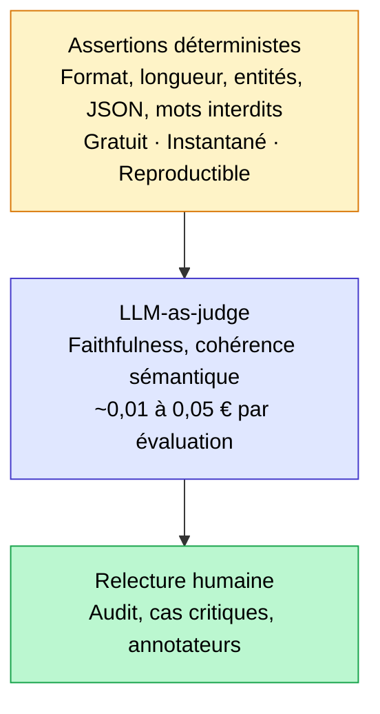

## Avant de payer un juge LLM, testez comme un développeur

Avant de sortir un LLM-as-judge à 0,60 $ du million de tokens, 80 % des régressions d'un système LLM se détectent avec des assertions gratuites et instantanées : format de sortie incorrect, réponse trop courte, entité attendue absente, JSON invalide, mot interdit présent. Ces vérifications ne nécessitent pas d'IA pour évaluer de l'IA. Elles se codent en 10 lignes de Python et se branchent sur n'importe quelle pipeline CI/CD avec pytest.

C'est l'approche que j'applique systématiquement avant de mettre en place un évaluateur sémantique sur mes missions. Cet article couvre les assertions qui attrapent le plus de bugs, comment les organiser en suite pytest, et à quel moment il faut effectivement passer à l'étage supérieur.

<!-- more -->

> Ces tests forment la base de l'évaluation d'un RAG en production. Pour l'ensemble du pipeline, voir le [guide RAG complet](/rag/).

## La pyramide d'évaluation d'un LLM

La pyramide de tests logiciels est un principe classique : beaucoup de tests unitaires rapides et pas chers à la base, quelques tests d'intégration au milieu, peu de tests end-to-end coûteux au sommet. En évaluation LLM, la structure est strictement identique.



**Base (assertions déterministes)** : vérifications structurelles, entièrement mécaniques. Elles passent ou échouent, sans ambiguïté, sans coût variable. C'est le filet de sécurité qui tourne à chaque commit.

**Milieu (LLM-as-judge)** : évaluation sémantique par un second modèle. Utile pour mesurer la fidélité, la pertinence ou le ton. Coût réel avec GPT-4o-mini : 1 à 5 € pour 100 questions avec 4 métriques. À lancer à chaque release, pas à chaque commit.

**Sommet (relecture humaine)** : pour les cas limites, les audits approfondis, les domaines à fort enjeu (juridique, médical). Irremplaçable mais non scalable.

L'anti-pattern que je vois constamment sur les projets : commencer par le milieu. L'équipe installe RAGAS dès le premier sprint, dépense des euros en appels LLM juge, et passe à côté de bugs structurels que 3 lignes d'assertions auraient détectés en 50 ms.

## Les assertions déterministes qui attrapent le plus de bugs

Six catégories couvrent la quasi-totalité des régressions structurelles. Elles sont indépendantes, empilables, et toutes compatibles avec pytest.

### Format et expressions régulières

La sortie de votre LLM respecte-t-elle le format attendu ? Un numéro de téléphone, un code postal, une date, un identifiant interne : autant de contraintes vérifiables avec une regex en quelques millisecondes.

```python
import re
import pytest

def test_output_contient_code_postal(llm_response: str):
    """La réponse doit mentionner un code postal français valide."""
    pattern = r"\b(0[1-9]|[1-8]\d|9[0-5])\d{3}\b"
    assert re.search(pattern, llm_response), (
        f"Aucun code postal FR valide trouvé dans : {llm_response!r}"
    )

def test_output_format_date_iso(llm_response: str):
    """Les dates citées doivent être au format ISO 8601."""
    dates = re.findall(r"\d{4}-\d{2}-\d{2}", llm_response)
    assert len(dates) >= 1, "Aucune date au format YYYY-MM-DD dans la réponse."
```

Appliquez ce type d'assertion à chaque contrat de format que votre LLM doit respecter. Si le format change, la regex casse immédiatement : c'est exactement le comportement voulu d'un test de régression.

### Contraintes de longueur

Une réponse trop courte signale un refus, une hallucination, ou un prompt cassé. Une réponse trop longue signale une verbosité incontrôlée ou un prompt mal cadré. Les deux sont des régressions silencieuses si vous ne les mesurez pas.

```python
def test_longueur_reponse(llm_response: str):
    """La réponse doit faire entre 100 et 800 caractères."""
    nb_chars = len(llm_response.strip())
    assert nb_chars >= 100, f"Réponse trop courte : {nb_chars} caractères."
    assert nb_chars <= 800, f"Réponse trop longue : {nb_chars} caractères."

def test_longueur_en_mots(llm_response: str):
    """Au moins 20 mots, pas plus de 150."""
    mots = llm_response.split()
    assert 20 <= len(mots) <= 150, (
        f"Longueur en mots hors plage : {len(mots)} mots."
    )
```

Les seuils dépendent de votre cas d'usage. Un chatbot FAQ a une plage différente d'un générateur de résumés. Documentez les seuils dans le test avec un commentaire : pourquoi ces bornes, d'où viennent-elles.

### Présence et absence d'entités

C'est l'assertion la plus précieuse sur les systèmes RAG. Pour une question sur le produit X, la réponse doit contenir "X". Pour une question sur la procédure de remboursement, la réponse ne doit pas mentionner la procédure de résiliation.

```python
def test_entites_attendues_presentes(llm_response: str):
    """Pour une question sur le délai de rétractation, la durée doit apparaître."""
    entites_requises = ["14 jours", "rétractation"]
    manquantes = [e for e in entites_requises if e.lower() not in llm_response.lower()]
    assert not manquantes, f"Entités manquantes : {manquantes}"

def test_entites_interdites_absentes(llm_response: str):
    """La réponse ne doit jamais mentionner un concurrent direct."""
    concurrents = ["ConcurrentA", "ConcurrentB", "ConcurrentC"]
    trouvees = [c for c in concurrents if c.lower() in llm_response.lower()]
    assert not trouvees, f"Entités interdites détectées : {trouvees}"
```

Pour les RAG sur corpus métier, construisez un dictionnaire d'entités attendues par type de question. Ce dictionnaire devient lui-même un actif documentaire : il matérialise les invariants que votre système doit respecter.

### Validation JSON et schéma Pydantic

Quand votre LLM produit du JSON (extraction, structuration, tool call), la validation est obligatoire avant toute exploitation en aval.

```python
import json
from pydantic import BaseModel, ValidationError

class ReponseStructuree(BaseModel):
    categorie: str
    priorite: int
    resume: str
    tags: list[str]

def test_json_valide(llm_response: str):
    """La sortie doit être du JSON parsable."""
    try:
        data = json.loads(llm_response)
    except json.JSONDecodeError as e:
        pytest.fail(f"JSON invalide : {e}\nSortie brute : {llm_response!r}")

def test_schema_pydantic(llm_response: str):
    """Le JSON doit valider le schéma métier attendu."""
    try:
        data = json.loads(llm_response)
        ReponseStructuree(**data)
    except (json.JSONDecodeError, ValidationError) as e:
        pytest.fail(f"Validation échouée : {e}")

def test_champs_non_vides(llm_response: str):
    """Aucun champ requis ne doit être vide ou None."""
    data = json.loads(llm_response)
    for champ in ["categorie", "resume"]:
        assert data.get(champ), f"Champ vide ou absent : '{champ}'"
```

Pydantic intercepte les erreurs de type (un entier reçu comme string), les champs manquants, et les valeurs hors énumération. Chaque crash aval sur une sortie LLM mal formatée est un signe que cette validation n'est pas en place.

### Mots interdits et comportement de refus

Deux catégories distinctes : les mots que le LLM ne doit jamais produire (jargon interne, données sensibles, formulations interdites par la conformité), et les refus attendus quand la question est hors périmètre.

```python
def test_mots_interdits_absents(llm_response: str):
    """Formulations interdites par la charte de communication."""
    interdits = [
        "je ne sais pas",       # refus passif interdit
        "confidentiel",         # fuite de mention interne
        "erreur interne",       # exposition de stack trace
        "hallucination",        # auto-diagnostic qui alarme l'utilisateur
    ]
    for mot in interdits:
        assert mot.lower() not in llm_response.lower(), (
            f"Mot interdit détecté : '{mot}'"
        )

def test_refus_attendu_hors_perimetre(llm_response: str):
    """Sur une question hors périmètre, le LLM doit décliner explicitement."""
    marqueurs_refus = [
        "je ne suis pas en mesure",
        "cette question dépasse",
        "je ne peux pas répondre",
        "hors de mon périmètre",
    ]
    refus_detecte = any(m in llm_response.lower() for m in marqueurs_refus)
    assert refus_detecte, (
        "Le LLM aurait dû refuser cette question hors périmètre.\n"
        f"Réponse obtenue : {llm_response!r}"
    )
```

Le test de refus est souvent oublié. Pourtant, un LLM qui répond à une question hors périmètre plutôt que de la décliner est une régression fonctionnelle aussi grave qu'une réponse incorrecte.

## Mettre ces tests en CI/CD avec pytest

L'objectif est que ces assertions tournent automatiquement à chaque Pull Request, sans intervention manuelle. Voici la structure que j'utilise sur mes missions.

### Fixtures et cas connus (golden outputs)

```python
# tests/conftest.py
import pytest

@pytest.fixture
def cas_faq():
    """Ensemble de cas de test avec inputs et invariants attendus."""
    return [
        {
            "question": "Quel est le délai de rétractation ?",
            "reponse_simulee": "Vous disposez de 14 jours calendaires pour exercer votre droit de rétractation.",
            "entites_requises": ["14 jours", "rétractation"],
            "longueur_min": 50,
            "longueur_max": 400,
        },
        {
            "question": "Qui est votre PDG ?",  # hors périmètre
            "reponse_simulee": "Je ne suis pas en mesure de répondre à cette question.",
            "doit_refuser": True,
        },
    ]
```

```python
# tests/test_assertions_llm.py
import re
import pytest

def verifier_cas(cas: dict):
    reponse = cas["reponse_simulee"]

    # Longueur
    if "longueur_min" in cas:
        assert len(reponse) >= cas["longueur_min"]
    if "longueur_max" in cas:
        assert len(reponse) <= cas["longueur_max"]

    # Entités requises
    for entite in cas.get("entites_requises", []):
        assert entite.lower() in reponse.lower(), f"Entité manquante : {entite}"

    # Comportement de refus
    if cas.get("doit_refuser"):
        marqueurs = ["ne suis pas en mesure", "hors de mon périmètre", "je ne peux pas"]
        assert any(m in reponse.lower() for m in marqueurs), (
            "Refus attendu non détecté."
        )

def test_tous_les_cas_faq(cas_faq):
    for cas in cas_faq:
        verifier_cas(cas)
```

### Seuils de non-régression

Sur un dataset de 50 cas, un seuil de 100 % peut être trop strict (vous allez avoir des faux positifs dus au non-déterminisme du LLM). Un seuil à 95 % est souvent plus réaliste : si 3 cas sur 50 échouent, c'est un signal. Si 10 cas échouent, c'est une régression.

```python
def test_taux_succes_minimum(cas_faq):
    """Au moins 95% des cas doivent passer."""
    resultats = []
    for cas in cas_faq:
        try:
            verifier_cas(cas)
            resultats.append(True)
        except AssertionError:
            resultats.append(False)

    taux = sum(resultats) / len(resultats)
    assert taux >= 0.95, (
        f"Taux de succès insuffisant : {taux:.1%} "
        f"({sum(resultats)}/{len(resultats)} cas passent)"
    )
```

Ce pattern de seuil est directement inspiré de la pratique de Jason Liu sur les systèmes de retrieval : fixer un objectif chiffré et le traiter comme une contrainte non négociable dans la pipeline.

### Intégration GitHub Actions

```yaml
# .github/workflows/llm-assertions.yml
name: LLM Assertions
on: [pull_request]

jobs:
  test:
    runs-on: ubuntu-latest
    steps:
      - uses: actions/checkout@v4
      - uses: actions/setup-python@v5
        with:
          python-version: "3.12"
      - run: pip install pytest pydantic
      - run: pytest tests/test_assertions_llm.py -v --tb=short
```

Ce workflow ajoute moins de 30 secondes à une pipeline CI standard. Comparez avec un juge LLM sur 50 questions : 2 à 5 minutes, et 1 à 3 € de coût API à chaque run.

## Quand les assertions ne suffisent plus

Les assertions déterministes ont une limite claire : elles vérifient la structure, pas le sens. Une réponse peut contenir toutes les entités requises, respecter le format, avoir la bonne longueur, et rester complètement à côté sur le fond.

Trois signaux indiquent qu'il faut passer à l'étage supérieur (LLM-as-judge ou relecture humaine) :

**1. Les assertions passent toutes mais les utilisateurs se plaignent.** Le filet structurel ne capture pas les problèmes sémantiques. Faithfulness, pertinence de la réponse, cohérence avec le contexte : ce sont des métriques RAGAS, pas des assertions pytest.

**2. Vous avez un corpus documentaire qui change souvent.** Un nouveau document peut modifier la réponse correcte attendue sans casser aucune assertion structurelle. Un LLM-as-judge détecte cette dérive sémantique.

**3. Le domaine est à fort enjeu.** Médical, juridique, financier : les erreurs de sens ont des conséquences. Les assertions réduisent le bruit, mais elles ne remplacent pas une évaluation sémantique rigoureuse.

Pour l'étage suivant, l'article [LLM-as-a-judge : quand l'utiliser, avec le coût réel en €](llm-as-a-judge-cout-evaluation.md) détaille quand et comment déployer un juge LLM sans exploser le budget d'évaluation.

## Questions fréquentes sur les tests unitaires d'un LLM

**Les sorties d'un LLM ne sont pas déterministes, comment tester avec des assertions ?**

Avec `temperature=0` sur la plupart des API, vous obtenez des sorties stables sur des requêtes identiques. Pour les cas où la variabilité est inévitable, testez les invariants (présence d'entités, format global, longueur) plutôt que les sorties exactes. Un test qui vérifie "la réponse contient '14 jours'" est robuste à la variabilité ; un test qui vérifie "la réponse est exactement cette phrase" ne l'est pas.

**Quelle différence entre ces assertions et un LLM-as-judge ?**

Les assertions déterministes vérifient la structure : format, longueur, présence de tokens spécifiques. Le LLM-as-judge évalue le sens : la réponse est-elle fidèle au contexte ? Est-elle pertinente ? Les deux sont complémentaires. Les assertions protègent contre les régressions structurelles, gratuitement. Le juge LLM protège contre les régressions sémantiques, à coût variable.

**Combien de cas de test faut-il maintenir dans la suite d'assertions ?**

Entre 30 et 80 cas couvrent la majorité des situations en production. Organisez-les par catégorie : cas nominaux, cas limites (question hors périmètre, question ambiguë), cas adversariaux (fautes, formulations bizarres). Versionnez ce dataset dans le repo au même titre que le code.

**Peut-on utiliser ces assertions sur un chatbot en production (pas seulement en test) ?**

Oui, c'est même recommandé. On parle alors de guardrails en ligne : les assertions tournent sur chaque réponse avant qu'elle soit envoyée à l'utilisateur. Si une assertion échoue, la réponse est bloquée ou renvoyée pour régénération. Des librairies comme Guardrails AI et LLM Guard implémentent ce pattern avec des scanners prédéfinis.

**Comment gérer les faux positifs dans les assertions ?**

Deux leviers. D'abord, écrire des assertions précises : chercher "14 jours calendaires" plutôt que juste "14", ce qui évite de matcher une durée d'attente non pertinente. Ensuite, utiliser un seuil de succès global (ex. 95 %) plutôt qu'un passage obligatoire à 100 % pour les assertions les plus strictes.

**Peut-on tester le comportement de refus d'un LLM avec des assertions ?**

Oui, et c'est souvent le test le plus utile. Définissez un ensemble de questions hors périmètre connues, et vérifiez que la réponse contient un marqueur de refus attendu. Ce test détecte immédiatement les régressions de prompt qui feraient répondre le LLM là où il devrait décliner.

**Ces tests ralentissent-ils le développement ?**

Non, c'est l'inverse. Sans assertions, chaque changement de prompt ou de modèle nécessite une inspection manuelle des sorties. Avec une suite de 50 assertions qui tourne en 20 secondes, vous avez un retour immédiat et fiable. Le coût de mise en place (2 à 4 heures) s'amortit dès le premier bug structurel détecté automatiquement.

## Pour aller plus loin

- [LLM-as-a-judge : quand l'utiliser, avec le coût réel en €](llm-as-a-judge-cout-evaluation.md)
- [Évaluer un RAG en production : métriques et RAGAS](evaluer-rag-production-metriques-ragas.md)
- [Construire un dataset d'évaluation RAG en 30 minutes](dataset-evaluation-rag-questions-synthetiques.md)

---------

Si mes articles vous intéressent et que vous avez des questions ou simplement envie de discuter de vos propres défis, n'hésitez pas à m'écrire à [anas@tensoria.fr](mailto:anas@tensoria.fr), j'aime échanger sur ces sujets !

Vous pouvez aussi [réserver un créneau d'échange](https://cal.eu/anas-rabhi/rendez-vous-ianas) ou vous abonner à ma newsletter :)


---

### À propos de moi

Je suis **Anas Rabhi**, consultant Data Scientist freelance. J'accompagne les entreprises dans leur stratégie et mise en œuvre de solutions d'IA (RAG, Agents, NLP).

Découvrez mes services sur [tensoria.fr](https://tensoria.fr) ou testez notre solution d'agents IA [heeya.fr](https://heeya.fr).

<div style="text-align: center; margin: 40px 0; gap: 16px; display: flex; flex-wrap: wrap; justify-content: center;">
  <a href="https://cal.eu/anas-rabhi/rendez-vous-ianas" target="_blank" style="display: inline-block; background-color: #4F46E5; color: #ffffff; font-weight: bold; padding: 16px 32px; text-decoration: none; border-radius: 8px; font-size: 18px; letter-spacing: 0.8px; box-shadow: 0 6px 12px rgba(0, 0, 0, 0.2); transition: all 0.3s ease; border: none;">
    Réserver un créneau
  </a>
  <a href="https://anas-ai.kit.com/d8b1a255cc" target="_blank" style="display: inline-block; background-color: #222222; color: #ffffff; font-weight: bold; padding: 16px 32px; text-decoration: none; border-radius: 8px; font-size: 18px; letter-spacing: 0.8px; box-shadow: 0 6px 12px rgba(0, 0, 0, 0.2); transition: all 0.3s ease; border: none;">
    <span style="margin-right: 10px;">✉️</span> S'abonner à ma newsletter
  </a>
</div>
