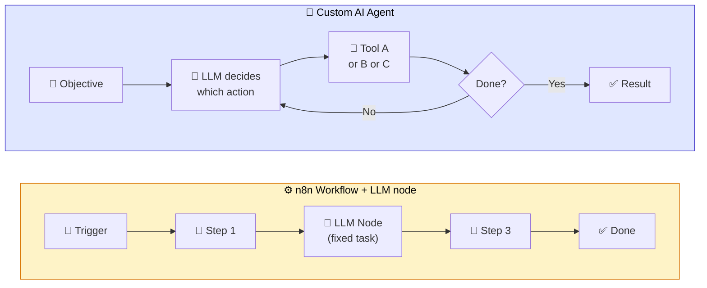
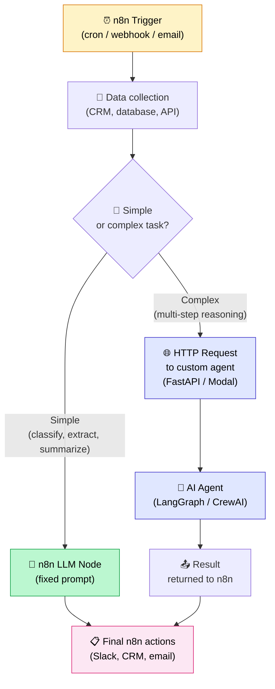
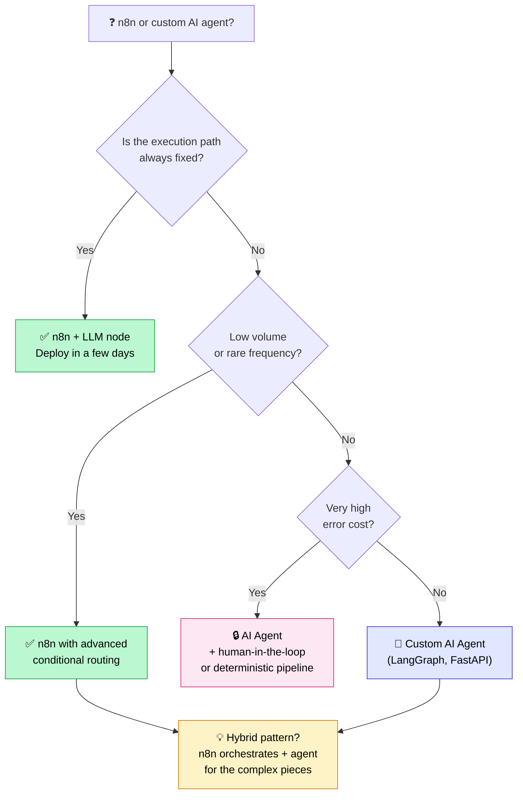

## 6 out of 10 businesses asking for an AI agent don't need one

Out of every 10 businesses that contact me saying "we want an AI agent," 6 don't actually need one.

They need a solid n8n workflow with a well-configured OpenAI node. And nobody tells them that. Because custom agencies would rather sell a 30K€ AI agent than a 3K€ n8n workflow. Which is understandable. But it isn't honest.

So in this article, I'll share the decision framework I use with my own clients. No sales pitch. Just the criteria that tell you whether you need an **AI agent vs n8n** (or Make, or Zapier) for your specific situation.

My position from the start: **in the majority of SMB cases, a well-built n8n workflow with an LLM node is enough. A custom AI agent is only necessary in specific situations.** I'll show you exactly which ones.

<!-- more -->

> For an overview of the cases where AI agents outperform no-code tools, see the [AI Agents guide](c-est-quoi-un-agent-ia.md).

***

## The confusion worth clearing up first

A lot of people conflate "automation with a bit of AI in it" and "AI agent." These are not the same thing, and the confusion is expensive.

Here are two clean definitions:

**Automated workflow (n8n, Make, Zapier) with an LLM node**: a sequence of predefined steps executed in a deterministic order. Sometimes one of those steps involves sending text to an LLM to classify, summarize, or generate. But the path is **fixed**. The AI doesn't decide what to do: it executes a task inside a pipeline you defined.

**Custom AI agent**: an LLM that decides on its own which actions to take, in what order, and when to stop, based on an objective you give it. The path is **dynamic**. The agent may call 2 tools or 12, depending on what it finds along the way.

The analogy I use: an n8n workflow is a fixed cooking recipe. You list the steps, execute them in order, and it's repeatable every time. An AI agent is a chef who adapts to whatever ingredients are available. They look at what's in the fridge, improvise, and change the plan if something is missing.

If you want to dig into the full definition of what an AI agent actually is, [I wrote a dedicated article on that](c-est-quoi-un-agent-ia.md).

Here's how I visualize the difference:

The loop is there for a reason: the AI agent can backtrack, rerun a search, switch tools. The n8n workflow always moves in one direction.

***

## The 3 criteria for deciding

I use three criteria in this order. If the first one gives you a clear answer, there's no need to go further.

### Criterion 1: is the execution path fixed or variable?

This is the most important question. And it's often enough to settle the decision.

**Fixed path**: the same steps in the same order, regardless of the input value. You can draw the workflow schema on paper before you start coding.

Concrete example: "When an email arrives at support@, analyze it with GPT to classify it (bug / sales inquiry / other), open a Linear ticket in the right queue, and send an adapted acknowledgment." That's 5 steps. They're always the same. It's an n8n workflow, full stop.

**Variable path**: the number of steps and tools used depends on the content of the input or on intermediate results. You can't draw the schema in advance.

Concrete example: "Find all client emails from this week where we promised a delivery, check where each delivery stands in Shopify, and send a tailored follow-up message for each situation." Here, the number of emails varies. Some deliveries will be late, others won't. For some clients, you'll need to check a second tool. The path isn't predictable.

**If the path is fixed: n8n workflow. If the path is variable: AI agent.**

### Criterion 2: what is the cost of an error?

An AI agent is more capable than a fixed workflow. But it's also less predictable. Those two things go together.

**Low cost**: the error is visible, reversible, or has no immediate consequence. A slightly off call summary, a product description that needs a second look. In that case, the n8n workflow is fine, even if it occasionally makes mistakes.

**High cost**: the action is irreversible (client email sent, charge processed, contract modified). In that case, two options. Either you go back to a deterministic pipeline with human validation. Or you use an AI agent with a human-in-the-loop pattern: the agent proposes, a human validates before execution.

**An autonomous AI agent on a critical action, with no guardrails: that's a bad idea regardless of the tool.**

### Criterion 3: what is the volume?

This criterion mainly affects the ROI of the initial investment.

**A few executions per day**: the infrastructure cost of a custom agent (development, hosting, maintenance) isn't justified. An n8n workflow runs for under 50€ a month.

**Hundreds or thousands of executions per day**: there, a custom AI agent becomes worthwhile. You can optimize latency, reduce cost per LLM call, fine-tune prompts precisely. The quality difference justifies the investment.

### Summary table of the 3 criteria

| Criterion | No-code workflow (n8n, Make, Zapier) | Custom AI agent |
|---|---|---|
| Execution path | Fixed, predictable | Variable, dynamic |
| Error cost | Low to moderate | High (with guardrails) |
| Volume | Low to medium | High |
| Time-to-market | Hours to days | Weeks to months |
| Initial cost | 0 to 5K€ | 15K€ to 50K€+ |
| Maintenance | Moderate (visual interface) | Heavy (devops, monitoring) |

***

## What you can do (often very well) with n8n + LLM

Before talking about custom agents, here are 6 concrete use cases I've seen running in production with n8n and an LLM node. For each one, a custom AI agent would have been overkill.

**1. Inbound email classification**

Need: emails arriving at support@ need to be routed to the right team.

Workflow: Gmail receives the email, a GPT-4o node classifies it into 5 categories, conditional branching, Linear or Notion ticket created in the right queue, automated reply sent to the client.

Why not a custom agent: the path is always the same. The LLM does one thing: classify. It's a deterministic task with a solid prompt.

**2. Product description generation**

Need: the e-commerce team receives raw supplier data (Airtable CSV) and needs to create optimized product listings.

Workflow: Airtable (new row), GPT node (writer with template), Notion page + Shopify product created.

Why not a custom agent: the listing structure is fixed. The LLM fills a template. No dynamic decision-making.

**3. Zoom call summaries**

Need: after every client call, have a structured recap in the CRM.

Workflow: Zoom (meeting ended), audio downloaded, Whisper transcription, GPT node (summary with action items), HubSpot note created + Slack message in the project channel.

Why not a custom agent: linear pipeline, always the same 4 steps. The Whisper node and GPT node each handle one precise task.

**4. Responses to customer reviews**

Need: respond quickly to Trustpilot, Google, or Capterra reviews.

Workflow: scraping or webhook, GPT node (sentiment analysis + draft response adapted to tone), sent to a human validation interface, published after approval.

Why not a custom agent: human validation is built into the workflow. AI generates, a human validates. Simple and sufficient.

**5. Automated competitive monitoring**

Need: track publications from 10 competitors and receive a weekly digest.

Workflow: weekly cron, RSS / Apify scraping, new content aggregated, GPT node (comparative summary + points of attention), internal newsletter sent via Slack or email.

Why not a custom agent: the sources are fixed, the output structure is fixed, the frequency is fixed.

**6. Lead scoring and CRM enrichment**

Need: automatically score incoming new leads to prioritize follow-ups.

Workflow: HubSpot (new contact), enrichment data retrieved (Clearbit, LinkedIn), GPT node (qualitative scoring based on ICP + context notes), score updated in HubSpot + Slack alert if score exceeds threshold.

Why not a custom agent: the scoring always follows the same logic. The only "intelligence" is in the prompt.

**A note on the tools themselves**: n8n, Make, and Zapier are not equivalent. n8n is open source and self-hostable (full control, predictable costs, steeper learning curve). Make is very visual, excellent for non-technical teams (per-operation pricing that can get expensive at volume). Zapier is the most accessible but the least flexible (and the most expensive at heavy usage). For anything involving AI and complex workflows at SMB scale, **n8n is generally the best power-to-cost ratio**.

***

## The cases where a custom AI agent becomes necessary

Here are the 5 situations where no-code is no longer enough. These are real cases I've encountered.

**1. The execution path is unpredictable**

A client in distribution wanted a sales assistant capable of answering any question about their catalog, stock, and pricing conditions. Depending on the question, the agent sometimes had to query the product database, sometimes the stock database, sometimes both, sometimes neither (general question). No fixed workflow could cover all cases.

**2. Multiple sources to cross-reference dynamically**

This is the case I described in my article on [agentic RAG vs classic RAG](agentic-rag-vs-rag-classique.md). To draft a response to a request for proposal, the agent had to cross-reference 4 completely different sources (technical standards, project history, winning past responses, sector annexes) in an order that depended on the content of the specifications. Impossible to encode in a workflow.

**3. Memory and multi-turn reasoning**

A level-2 support conversational agent, capable of maintaining context across multiple exchanges with the same client, remembering what was tried in previous conversations, and adapting its strategy accordingly. An n8n workflow can handle a session, but not stateful reasoning across several days.

**4. Complex business logic that can't be encoded**

A law firm contacted me for a "simple contract summarization workflow." Digging in, I understood that each file required a case law search (variable by contract type), a risk clause analysis (variable by client context), and a summary whose structure depended on the type of matter. No two files had the same path. It was an AI agent, not a workflow.

**5. Latency and cost critical at scale**

At 100,000 calls per day, the inefficiency of a standard workflow becomes expensive. An n8n workflow making 3 LLM calls "just to be safe" costs 3 times more than an optimized agent doing the same work in 1 calibrated call. At that volume, investing in a custom agent with optimized prompts and a lighter model (GPT-4o-mini, Mistral, Claude Haiku) can cut the LLM bill by 5 to 10x.

***

## The hybrid pattern (the real approach in 2026)

This is the most important section in this article. And it's the design I use on 80% of projects in their mature phase.

The idea: **n8n orchestrates, agents reason.**

Concretely:
- n8n handles all triggers (cron, webhook, inbound email, CRM event)
- n8n handles all "safe" actions toward external systems (database writes, Slack sends, HubSpot updates)
- Simple LLM nodes in n8n handle deterministic tasks (classify, extract, translate, summarize from template)
- For the pieces that require real multi-step reasoning, n8n calls a separately hosted custom agent (FastAPI on a VPS, Modal, AWS Lambda) via a simple HTTP node

The advantage of this pattern: you keep the orchestration simplicity of n8n (visual monitoring, error handling, retries, alerts) and you only add agentic complexity where it's truly necessary.

In practice, on a recent project, this design took us from 3 weeks of development (full custom agent) down to 5 days (n8n workflow + 1 micro-agent for the complex part). And the end result was identical from the user's perspective.

***

## Costs compared over 12 months

Here's a 12-month estimate for a typical case: 1,000 executions per day, each involving an LLM analysis.

| Item | n8n Workflow | Custom AI Agent |
|---|---|---|
| Initial development | 2 to 5 days dev | 4 to 8 weeks dev |
| LLM cost per month | 50 to 300€ | 100 to 1,000€ |
| Hosting per month | n8n cloud 20€ or self-hosted ~10€ | Cloud + monitoring 100 to 500€ |
| Maintenance per month | 1 to 2 days/month | 3 to 5 days/month |
| Estimated total over 12 months | 5 to 15K€ | 30 to 80K€ |

These figures vary a lot depending on complexity. But the order of magnitude is right. A custom agent typically costs **3 to 5 times more** over a year.

And that's perfectly fine... if the custom agent delivers 3 to 5 times more value. The question isn't "which one is cheaper." The question is: "does your situation justify that premium?"

For a business with 50 support emails per day to classify: no, it doesn't. For a platform handling 500,000 LLM calls per month on a complex, variable process: yes, absolutely.

***

## The decision tree (my one-diagram summary)

***

## What I actually tell my clients

Here are three concrete cases, drawn from real projects (anonymized).

**Case 1: the SMB that wanted an "AI sales agent"**

A B2B services company contacts me. They want "an AI agent that qualifies inbound leads and decides whether a salesperson should call them back." Planned budget: 25K€.

After 45 minutes of discussion, here's what I understood about their actual need: when a lead submits the contact form, extract the key information, cross-reference it with their ICP (ideal customer profile, defined by 5 criteria), calculate a score, and if the score exceeds a threshold, create a task in HubSpot with a summary.

I proposed an n8n workflow. Deployed in 1 week. Cost: 3,500€. It's been running for 8 months, without a single incident.

A custom AI agent would have done exactly the same thing, 6 times more expensive and 4 weeks later. The difference? The path was fixed.

**Case 2: the law firm that wanted "something simple"**

A law firm asks me for "a workflow to summarize incoming contracts and identify risky clauses." They think it's simple.

Digging in: each contract has a different nature (commercial lease, share transfer, service agreement, NDA). For each type, the clauses to analyze are different. The relevant case law to retrieve depends on the contract type and client context. And the final summary needs to adapt to the receiving attorney's profile (some want a short summary, others a detailed analysis).

Here, the path is variable. An n8n workflow with 3 conditional branches wouldn't have cut it. We built a multi-tool agent with LangGraph, access to a vector database of case law, and a preference profile per attorney. 6 weeks of development. But the case justified it.

**Case 3: the project that started with n8n and evolved**

This is the most common pattern in practice. A company starts with a simple n8n workflow (email classification + ticket creation). It works. They want to add value: the agent should also retrieve the client history from the CRM before classifying, and adapt the ticket priority based on account value.

We added 2 HTTP nodes in the n8n workflow (CRM API call, enrichment). The path stayed fixed. No need for a custom agent.

A few months later, they want the system to "understand the conversation context" and decide on its own whether a ticket deserves urgent escalation based on fuzzy criteria. There, we added a micro-agent in the hybrid pattern. N8n remains the orchestrator, a small LangGraph agent handles the escalation decision.

**The lesson**: start simple. Upgrade when simple is no longer enough.

***

## FAQ

**What's the real difference between n8n and an AI agent?**

N8n is a workflow orchestration tool. It lets you connect applications together along a path you define in advance. An AI agent is an LLM that decides on its own which path to follow to reach an objective. You can use an LLM node in n8n without doing anything agentic. The difference is in who decides: you (workflow) or the model (agent).

**Can n8n replace LangChain?**

For simple cases, yes. N8n 2.0 natively integrates LangChain with more than 70 AI nodes, including agents with memory and tools. For complex agentic architectures (state graphs, multi-agents, advanced conditional logic), LangGraph remains more flexible and more powerful. N8n is excellent to get started with and covers 80% of cases. LangGraph/LangChain takes over when the complexity exceeds what the visual interface can cleanly handle.

**How much does a custom AI agent cost vs an n8n workflow?**

Over 12 months for an average volume (1,000 executions per day): an n8n workflow comes to 5 to 15K€ all-in (initial development, hosting, LLM, maintenance). A custom agent: 30 to 80K€ depending on complexity. The agent is 3 to 5 times more expensive. That's only justified if the value produced is proportional.

**Can you build an AI agent with n8n alone?**

Yes, n8n has a native Agent node that includes memory, tools, and a reasoning loop. For simple to moderately complex agents, it's entirely viable. The limits appear when you need complex state logic, multiple coordinating agents, or very fine-grained debugging on the reasoning. In those cases, a dedicated framework (LangGraph, CrewAI) gives you more control.

**Are Make or Zapier suited to AI workflows?**

Make: very good for visual workflows with a few LLM nodes. The interface is excellent for non-technical teams. Per-operation pricing can become a problem at volume. Zapier: accessible, ideal for lightweight automations, less suited to complex AI workflows (less flexibility on LLM nodes, high cost at heavy usage). For anything involving AI and volume, n8n remains the best choice in 2026.

**When should you move from n8n to a custom agent?**

When you find yourself chaining 20+ nodes in n8n to handle edge cases, you have conditional branches everywhere, and the workflow is unreadable even to you. Or when the LLM needs to make decisions whose logic you can't anticipate in advance. These two signals indicate you need an agent, not a more complex workflow.

**N8n self-hosted or cloud for AI workflows?**

Self-hosted if you have some technical skills (or a developer available) and if you're processing sensitive data. The cost is near zero (a VPS at 10-20€/month covers most SMB needs). N8n cloud if you want zero infrastructure management: it's 20€/month for most needs. For AI workflows in production, I prefer self-hosted: more control over API secrets, logs, and updates.

**How do you secure LLM API keys in n8n?**

In n8n, always use the built-in credentials manager, never put keys in plain text in nodes. Enable credential encryption (enabled by default in cloud, needs to be configured in self-hosted with the `N8N_ENCRYPTION_KEY` variable). Create OpenAI API keys with monthly budget limits. If you're self-hosting, put n8n behind a reverse proxy with authentication.

**Which LLM to use in an n8n node (OpenAI, Mistral, Claude)?**

GPT-4o-mini for classification and extraction tasks (excellent quality/cost ratio). GPT-4o for generation and reasoning tasks. Claude 3.5 Haiku when you need a good context window at controlled cost. Mistral for cases where data sovereignty matters (self-hostable model). N8n supports all these models via its native LLM nodes or via LangChain.

**How long does it take to develop a custom AI agent?**

A POC on a targeted use case: 2 to 4 weeks. Production deployment with testing, integration with existing systems, and error handling: 2 to 3 months. A full multi-agent system: 4 to 6 months. These timelines include tool definition, prompt testing, and monitoring setup. Don't underestimate monitoring: it's often 30% of total development time on a custom agent.

***

## Further reading

- **[What is an AI agent, really?](c-est-quoi-un-agent-ia.md)**, the complete definition of agentic systems, to get back to the fundamentals
- **[Agentic RAG vs classic RAG](agentic-rag-vs-rag-classique.md)**, when agentic becomes necessary in a document retrieval context
- **[Multi-agent systems: hype vs reality](systemes-multi-agents-hype-vs-realite.md)**, a critical look at when multi-agent architectures actually make sense

***

If my articles interest you and you have questions or just want to discuss your own challenges, feel free to write to me at [anas@tensoria.fr](mailto:anas@tensoria.fr), I enjoy talking about these topics!

You can also [book a call](https://cal.eu/anas-rabhi/rendez-vous-ianas) or subscribe to my newsletter :)

---

### About me

I'm **Anas Rabhi**, freelance AI Engineer & Data Scientist. I help companies design and deploy AI solutions (RAG, AI agents, NLP). [Read more about my work and approach](/en/a-propos/), or browse the [full blog](/en/blog/).

Discover my services at [tensoria.fr](https://tensoria.fr) or try our AI agents solution at [heeya.fr](https://heeya.fr).

  <a href="https://cal.eu/anas-rabhi/rendez-vous-ianas" target="_blank" style="display: inline-block; background-color: #4F46E5; color: #ffffff; font-weight: bold; padding: 16px 32px; text-decoration: none; border-radius: 8px; font-size: 18px; letter-spacing: 0.8px; box-shadow: 0 6px 12px rgba(0, 0, 0, 0.2); transition: all 0.3s ease; border: none;">
    Book a call
  </a>
  <a href="https://anas-ai.kit.com/d8b1a255cc" target="_blank" style="display: inline-block; background-color: #222222; color: #ffffff; font-weight: bold; padding: 16px 32px; text-decoration: none; border-radius: 8px; font-size: 18px; letter-spacing: 0.8px; box-shadow: 0 6px 12px rgba(0, 0, 0, 0.2); transition: all 0.3s ease; border: none;">
    ✉️ Subscribe to my newsletter
  </a>

