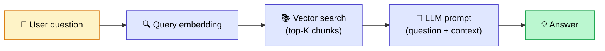
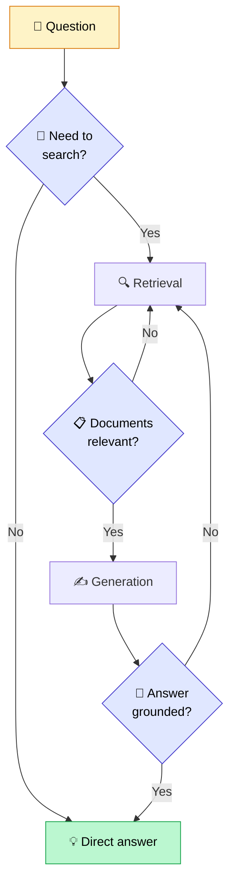
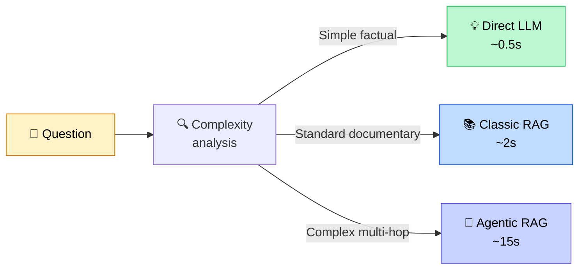

## Your RAG isn't enough anymore. Really?

It's everywhere. Agentic RAG. The future of RAG. The next evolution.

And as usual with AI trends, you get the feeling that if you haven't switched to Agentic RAG yet, you're already behind. That your "classic" RAG is outdated. That you need to rebuild everything from scratch.

Here's what I actually think: **it's not that simple, and most projects don't need Agentic RAG.**

But — and there's always a but — Agentic RAG solves real problems that classic RAG simply cannot. And if you run into those problems, you'll need it.

So in this article, I'll keep it straightforward: what Agentic RAG actually is, how it differs from classic RAG, and most importantly, how to decide whether you need it.

<!-- more -->

***

## What classic RAG does (and what it can't do)

Classic RAG is a **linear** pipeline that always does the same thing in the same order:

It works well. It's predictable, fast (1 to 3 seconds), and easy to debug. For the majority of projects, it's all you need.

But this pipeline has specific blind spots.

**Blind spot one: it always retrieves, even when it doesn't need to.**
Ask "what is the capital of France?" and the RAG will still search your document store. For nothing.

**Blind spot two: it never validates what it found.**
If the retrieved chunks are poor quality — off-topic, outdated, wrong — the LLM will still generate a response from them. And that response will often be wrong or hallucinated. Before reaching for agentic patterns, it's often better to harden the retrieval itself — for example with a [hybrid RAG combining BM25 and vector search](rag-hybride-bm25-vectoriel.md), which is enough to fix most problematic cases.

**Blind spot three: it can't break down a complex question.**
"Compare the financial performance of Apple and Microsoft over the last 3 years and explain the differences." That requires multiple searches, cross-referencing information from different sources, and reasoning over intermediate results. Classic RAG makes one search and hopes it's enough.

**Blind spot four: it only has access to your vector store.**
Not external APIs. Not SQL databases. Not the web. Not emails. Only the documents you indexed.

These are exactly the four problems that Agentic RAG tries to solve.

***

## Agentic RAG is a spectrum — not a switch

This is where a lot of people go wrong.

We talk about "switching to Agentic RAG" as if there's a button to flip. In reality, **agentic behavior is a dial**. Between a classic RAG and a full multi-agent system, there are infinite intermediate steps.

HuggingFace puts it better than anyone: *"Agentic behavior is about how much control you give the LLM over the program's execution flow."*

Here's how I visualize the spectrum:

| Level | What the LLM decides | Example |
|---|---|---|
| 0 — Classic RAG | Nothing | Fixed pipeline, always the same |
| 1 — Routing | Where to search | Internal store OR web search OR SQL |
| 2 — Grading | Whether results are good | Retry if chunks are off-topic |
| 3 — Planning | How to decompose the question | Parallel sub-questions |
| 4 — Multi-agents | Who does what | Orchestrator + specialized agents |

You don't have to choose between level 0 and level 4. You can stay at level 1 or 2 and already solve 80% of your problems with very little added complexity.

***

## The 5 agentic patterns (and what problem each one solves)

### Pattern 1 — Self-RAG: the AI that reviews its own work

**The problem**: your RAG generates responses that aren't truly grounded in the retrieved documents. Frequent hallucinations.

**The solution**: after generating its response, the LLM asks itself three questions:
- Did I actually need to retrieve documents?
- Are the retrieved documents relevant?
- Is my response properly grounded in those documents?

**When to use it**: when hallucinations are your main problem and you don't want to add external tools to the architecture.

***

### Pattern 2 — Corrective RAG (CRAG): the safety net

**The problem**: your document base is incomplete. For some questions, the answer simply isn't in there.

**The solution**: a lightweight model evaluates the quality of the retrieved documents. If the score is low (irrelevant documents, missing information), it automatically triggers a web search as a fallback.

Three confidence levels:
- **Correct**: the documents are relevant, use them
- **Ambiguous**: filter to keep only the useful passages
- **Incorrect**: abandon and search the web

**When to use it**: when your knowledge base is partial or updates frequently, and missing an answer is worse than fetching it from elsewhere.

***

### Pattern 3 — Adaptive RAG: route by complexity

**The problem**: you have simple questions and complex questions in the same system. Classic RAG treats them the same way — which is either too slow for simple ones or too shallow for complex ones.

**The solution**: analyze the question's complexity upfront and choose the right route:

- Simple factual question → direct LLM answer (no retrieval)
- Medium-difficulty question → single-pass classic RAG
- Complex multi-hop question → full agentic pipeline

**When to use it**: when you have a mix of very different request types and want to optimize for both speed and quality.

***

### Pattern 4 — RAG with tools (ReAct): access multiple sources

**The problem**: your information is scattered. Some of it in your document store, some in a SQL database, some in an external system.

**The solution**: the LLM doesn't just search your vector store. It decides which tools to call based on the question:

- Vector store for documentary questions
- SQL for structured data
- External API for real-time information
- Web search for current events

The ReAct (Reason + Act) pattern: think → act → observe the result → repeat.

**When to use it**: when a single source isn't enough to answer the question. This is exactly what we encountered in our construction industry projects: we needed regulatory standards (document store), project history (SQL database), and professional annexes (specific PDFs). No single source would have been sufficient.

The cleanest way to expose these tools to an agent today is through the [MCP protocol (Model Context Protocol)](mcp-model-context-protocol-agents-ia.md), an open standard launched by Anthropic that is becoming the standard way to connect an agent to its tools (databases, APIs, files, SaaS) without reinventing the wheel on every project.

***

### Pattern 5 — Multi-agents: divide and conquer

**The problem**: the complexity becomes too large for a single agent. You have multiple different domains of expertise, multiple source types, multiple processes to orchestrate in parallel.

**The solution**: an orchestrator agent that delegates to specialized agents. Each agent is an expert in its domain and has its own set of tools.

This is the architecture we used on a RAG project for construction bid writing: a main writing agent that orchestrated 4 specialized sources (industry standards, professional annexes, client history, similar projects). Each source had its own retriever with its own metadata filtering.

**When to use it**: complex projects with several clearly distinct domains. This is the highest level of complexity — not to be taken lightly.

***

## The real cost of going agentic

This is where a lot of projects go wrong. You see the answer quality improve, you're happy, and you don't do the math on what it's actually costing you.

**In latency:**

| Architecture | Typical latency | Reason |
|---|---|---|
| Classic RAG | 1–3 seconds | 1 LLM call |
| Advanced RAG (reranking) | 2–5 seconds | 2–3 LLM calls |
| Agentic RAG (level 2–3) | 5–30 seconds | 3–10 LLM calls |
| Multi-agents (level 4) | 30 seconds – 3 minutes | 10–50 LLM calls |

For a customer support chatbot, 30 seconds of latency is a deal-breaker. For a writing assistant working in the background, it's perfectly fine.

**In cost:**

Every LLM call costs money. Classic RAG = 1 call. A full agentic pipeline = 10 calls minimum. At 10,000 requests per month, you can easily multiply your bill by 5 to 10 without noticing.

**In reliability:**

This is the least visible cost, but the most important. Classic RAG has predictable failure modes: if retrieval misses, the answer is bad. That's it.

An agentic system can take unexpected paths, get stuck in loops, use the wrong tool, or go down an incorrect track. The more autonomous the agent, the more varied and harder to anticipate the failure modes become.

That's why Anthropic says in their guide on agents: *"Start with the simplest solution. Only add complexity if the workflow cannot be predefined in advance."*

***

## How to decide: the simple framework

Here are the questions I ask on every project before choosing an architecture:

**1. Do my questions always have the same structure?**
Yes → Classic RAG is enough.
No → Read on.

**2. Does the LLM answer correctly when given the right context?**
No → The problem is in the retrieval or the data. Fix that first — going agentic won't change anything.
Yes → Read on.

**3. Is my document base incomplete on certain topics?**
Yes → Corrective RAG with web fallback.

**4. Do questions require cross-referencing multiple distinct sources?**
Yes → RAG with tools (level 3–4).

**5. Can I not predict the steps in advance?**
Yes → Agentic RAG. Otherwise, a well-designed conditional pipeline will usually do better with less complexity.

**6. Does reliability need to be close to 100%?**
Then avoid agentic. Stick with a deterministic pipeline with human guardrails.

In practice, most projects stop at question 3 or 4. Very few genuinely need levels 5 and 6.

***

## What this looks like on a real project

To give you a concrete example, our RAG system for writing construction bid responses is an Agentic RAG at level 3–4.

Why agentic? Because classic RAG simply couldn't do the job. Writing a bid response requires combining 4 completely different sources: DTU regulatory standards, the client's project history, previously won similar responses, and sector-specific professional annexes. No single source was sufficient.

And the complexity cost was worth it: **83% time savings** on bid writing, with consistent and traceable results.

But if the same client had asked for a simple chatbot to answer questions about their internal documents, a well-configured classic RAG would have done the job perfectly — in less time, for less money, and with more reliability.

Agentic RAG isn't better than classic RAG. It's **appropriate for different problems**. And before asking whether to go agentic, there's a prior question worth settling: is RAG the right architecture at all, given that long-context LLMs can now ingest millions of tokens in a single call? I covered this in [RAG vs long context LLM: is RAG really dead?](le-rag-est-fini.md).

***

## Summary

| | Classic RAG | Agentic RAG |
|---|---|---|
| Pipeline | Linear, fixed | Dynamic, loops |
| Latency | 1–3s | 5s to several minutes |
| Cost | 1 LLM call | 3–50 LLM calls |
| Reliability | Predictable | Variable |
| Use case | Standard document Q&A | Multi-source, multi-step, validation |
| When to use | By default | When classic isn't enough |

***

## FAQ: Common questions about Agentic RAG

**What's the difference between Agentic RAG and an AI agent?**
An [AI agent](c-est-quoi-un-agent-ia.md) is an autonomous system that uses tools. Agentic RAG is an AI agent whose primary tool happens to be search over a document store. Agentic RAG is a specific type of AI agent, specialized in information retrieval and synthesis.

**Which frameworks should I use to implement Agentic RAG?**
LangGraph is currently the most widely used for structured agentic pipelines: it models workflows as graphs with states, loops, and conditions. LlamaIndex has its own abstractions (AgentWorkflow, SubQuestionQueryEngine). For simple patterns (routing, grading), you don't need a framework at all — a few well-placed `if` statements will do. I have a pragmatic comparison of the main frameworks (CrewAI, LangGraph, AutoGen, Pydantic AI, Smolagents) in [this dedicated article](crewai-langchain-langgraph-comparatif-pragmatique.md), and broader reflections on the limits of LangChain and LlamaIndex in production after 20+ projects.

**Does Agentic RAG really cost that much more?**
It depends on the pattern. Self-RAG or CRAG adds 1 to 2 extra LLM calls (marginal cost). A complex multi-agent pipeline can multiply costs by 10 to 20. Always calculate the cost per request before deploying to production. The number one lever for cutting that bill is prompt caching (up to 90% savings on input tokens at Anthropic, OpenAI, and Gemini).

**My classic RAG hallucinates — will Agentic RAG fix that?**
Not necessarily. Hallucinations usually come from two sources: bad retrieval (the LLM doesn't have the right documents) or a bad prompt (the LLM isn't sufficiently constrained to stick to the context). Start by diagnosing the root cause before adding complexity.

**Can I migrate to Agentic RAG incrementally?**
Yes — and it's actually the best approach. Start by adding a single agentic mechanism, for example a simple grading step on the retrieved documents (level 2 of the spectrum). Measure the impact before going further.

***

## Further reading

- **[What is an AI agent, exactly?](c-est-quoi-un-agent-ia.md)** — The fundamentals of agentic systems, if you want to understand the underlying mechanics
- **[What is RAG, really?](mais-que-es-le-rag.md)** — The basics, if you're not yet familiar with RAG

***

If my articles interest you and you have questions, or just want to talk through your own challenges, feel free to reach out at [anas@tensoria.fr](mailto:anas@tensoria.fr) — I enjoy these conversations.

You can also [book a call](https://cal.eu/anas-rabhi/rendez-vous-ianas) or subscribe to my newsletter.

---

### About me

I'm **Anas Rabhi**, freelance AI Engineer & Data Scientist. I help companies design and ship AI solutions (RAG, agents, NLP). [Read more about my work and approach](/en/a-propos/), or browse the [full blog](/en/blog/).

Discover my services at [tensoria.fr](https://tensoria.fr) or try our AI agents solution at [heeya.fr](https://heeya.fr).

  <a href="https://cal.eu/anas-rabhi/rendez-vous-ianas" target="_blank" style="display: inline-block; background-color: #4F46E5; color: #ffffff; font-weight: bold; padding: 16px 32px; text-decoration: none; border-radius: 8px; font-size: 18px; letter-spacing: 0.8px; box-shadow: 0 6px 12px rgba(0, 0, 0, 0.2); transition: all 0.3s ease; border: none;">
    Book a call
  </a>
  <a href="https://anas-ai.kit.com/d8b1a255cc" target="_blank" style="display: inline-block; background-color: #222222; color: #ffffff; font-weight: bold; padding: 16px 32px; text-decoration: none; border-radius: 8px; font-size: 18px; letter-spacing: 0.8px; box-shadow: 0 6px 12px rgba(0, 0, 0, 0.2); transition: all 0.3s ease; border: none;">
    ✉️ Subscribe to my newsletter
  </a>

