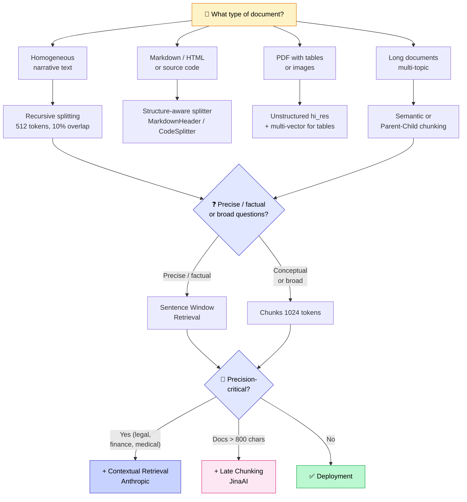

## The chunking you're probably using is the worst one tested

Let me start with a result that surprised me when I first saw it.

Chroma Research published a benchmark comparing all common chunking strategies. They tested the default OpenAI Assistants parameters: 800 tokens, 400 tokens of overlap. Their verdict is unambiguous — it's the configuration with the **lowest precision** across all tests. 1.4% precision. Their exact comment: *"particularly poor recall-efficiency tradeoffs"*.

These are the parameters tens of thousands of projects are using right now, often because it's what the LangChain or LlamaIndex quick start suggests.

Meanwhile, configurations 4x simpler (200 tokens, zero overlap) perform 3.7x better on precision.

Chunking is the decision most teams spend the least time on. And yet it's probably the one with the highest impact on your RAG quality.

<!-- more -->

***

## Why chunking is the most important decision in your RAG

Bad retrieval can be fixed. A broken prompt can be rewritten. A suboptimal embedding model can be swapped out.

Bad chunking cannot be corrected downstream. If you've split your documents the wrong way, the embeddings are already computed on the wrong units. The best reranker in the world cannot reconstruct the information you lost by cutting at the wrong place. Understanding why matters: in a [retrieval-augmented generation](mais-que-es-le-rag.md) system, the retrieved chunk is the only context the LLM has — so the quality of every answer traces directly back to how you split your documents.

**Three fundamental reasons that explain everything:**

**1. The embedding model's limit**
Most popular embedding models have a 512-token window. Beyond that, the model silently truncates. If your chunk is 1500 tokens and your model truncates at 512, two-thirds of your chunk simply isn't indexed.

**2. "Lost in the Middle"**
LLMs struggle with information in the middle of a long context. Two independent studies (Stanford, 2023) showed that LLMs recall the beginning and end of a context well, but regularly miss what's in the middle. Shorter chunks = less risk of being "lost in the middle".

**3. Noise dilutes the signal**
The larger a chunk is, the more different topics the embedding encodes, and the harder it becomes to distinguish it from other chunks. A 1500-token embedding of an annual report encodes "accounting, governance, strategy, risks" without being particularly similar to anything specific. A 300-token chunk on the "risks" section is precise and discriminative.

Pinecone's golden rule sums this up better than any benchmark: *"If a human can understand the chunk without external context, the LLM can too."*

***

## The 8 chunking strategies

From simplest to most advanced. They're not mutually exclusive — the best architectures combine several of them.

### 1. Fixed-size — the universal starting point

You split each document into blocks of N tokens with an overlap of X tokens between blocks. This is the default strategy in almost every framework.

**What we know about sizes:**

| Size | When to use |
|---|---|
| 128–256 tokens | Very precise, factual questions |
| 512 tokens | Versatile, good default balance |
| 1024 tokens | Context needed, narrative documents |
| 2048 tokens | Rarely useful, watch the embedding limit |

On the LlamaIndex benchmark (Uber 10K, financial document), 1024 tokens achieves the highest score in both faithfulness and relevance. That's their sweet spot on this type of document.

**For whom**: your systematic starting point. Before testing more sophisticated approaches, establish your baseline here.

---

### 2. Recursive Splitting — the real standard

This is a smarter version of fixed-size. Instead of blindly cutting every N tokens, the splitter first tries to cut on natural separators: double newline first, then single newline, then space, then character-by-character as a last resort.

Result: chunks respect paragraphs and sentences as much as possible.

```python
from langchain.text_splitter import RecursiveCharacterTextSplitter

splitter = RecursiveCharacterTextSplitter(
    chunk_size=512,
    chunk_overlap=51,          # 10% of 512 tokens
    length_function=len,       # ⚠️ default: counts characters, not tokens
)
```

**The often-ignored rule**: `length_function=len` counts characters, not tokens. One token ≠ one character. To measure in tokens:

```python
import tiktoken

encoder = tiktoken.encoding_for_model("text-embedding-3-small")

splitter = RecursiveCharacterTextSplitter(
    chunk_size=512,
    chunk_overlap=51,
    length_function=lambda text: len(encoder.encode(text)),
)
```

This detail matters a lot on text with unicode characters, emojis, or multilingual content.

**For whom**: homogeneous narrative text. This is my default strategy on most projects.

---

### 3. Structure-aware — respect document structure

When your documents have structure (Markdown, HTML, code), you might as well use it.

**Markdown:**

```python
from langchain.text_splitter import MarkdownHeaderTextSplitter

headers_to_split_on = [
    ("#", "H1"),
    ("##", "H2"),
    ("###", "H3"),
]

splitter = MarkdownHeaderTextSplitter(
    headers_to_split_on=headers_to_split_on,
    strip_headers=False
)

chunks = splitter.split_text(markdown_content)
# Each chunk has metadata: {"H1": "...", "H2": "...", "H3": "..."}
```

The advantage: hierarchy metadata is preserved in each chunk. This improves filtering and lets the LLM understand where the information sits within the document.

**Code:** never use a generic splitter on code. LlamaIndex CodeSplitter with tree-sitter splits at the syntactic level — it will never cut a function in the middle.

**For whom**: technical documentation, websites, codebases.

---

### 4. Semantic Chunking — split on topic changes

Instead of cutting at a fixed size, semantic chunking compares the embeddings of consecutive sentences. When the cosine distance between two sentences exceeds a threshold, a cut is made. The idea: when the topic changes, open a new chunk.

```python
from llama_index.node_parser import SemanticSplitterNodeParser
from llama_index.embeddings import OpenAIEmbedding

splitter = SemanticSplitterNodeParser(
    embed_model=OpenAIEmbedding(),
    breakpoint_percentile_threshold=95,  # 80-95 depending on desired granularity
)

nodes = splitter.get_nodes_from_documents(documents)
```

`breakpoint_percentile_threshold` is the key parameter. At 95, you only cut on very pronounced topic transitions (longer chunks). At 80, you're more aggressive (shorter, more numerous chunks).

**What the benchmarks actually say**

Chroma Research measures the best precision and IoU with semantic chunking on certain documents. But a NAACL 2025 study adds important nuance: on natural documents, semantic chunking rarely beats fixed-size — the advantage only clearly appears on artificially constructed documents with pronounced topic changes.

**Cost**: 2–3x slower at ingestion (embeddings are computed on every sentence to detect cut points).

**For whom**: long documents with several distinct topics. Test before committing — on many corpora, recursive splitting is equivalent at a lower cost.

---

### 5. Sentence Window Retrieval — precision without losing context

This pattern solves a real problem: small chunks are precise for retrieval, but give the LLM too little context to generate a good response.

**The solution**: decouple what you index from what you return.

- Index each **sentence individually** (very precise retrieval)
- When a sentence is retrieved, return the **±3 sentences around it** to the LLM (sufficient context)

```python
from llama_index.node_parser import SentenceWindowNodeParser
from llama_index.postprocessor import MetadataReplacementPostProcessor

# Ingestion: index by sentence, keep the window as metadata
node_parser = SentenceWindowNodeParser.from_defaults(
    window_size=3,
    window_metadata_key="window",
    original_text_metadata_key="original_text",
)

# Retrieval: replace the sentence with its window before passing to the LLM
postprocessor = MetadataReplacementPostProcessor(
    target_metadata_key="window"
)
```

**For whom**: precise Q&A on dense corpora, when the question targets a specific fact but the answer requires immediate surrounding context.

---

### 6. Parent-Child / Hierarchical — wider context when needed

A variant of Sentence Window, but at multiple levels. A hierarchy is created: wide parent chunks (1024 tokens), intermediate children (512), precise grandchildren (128).

Retrieval happens on the grandchildren (precise). But if enough children from the same parent are retrieved (generally 50%+), the AutoMergingRetriever automatically merges up to the parent, giving the LLM a wide view rather than scattered fragments.

```python
from llama_index.node_parser import HierarchicalNodeParser
from llama_index.retrievers import AutoMergingRetriever

node_parser = HierarchicalNodeParser.from_defaults(
    chunk_sizes=[2048, 512, 128]
)

# The retriever automatically merges up to the parent if needed
retriever = AutoMergingRetriever(
    vector_retriever,
    storage_context,
    verbose=True
)
```

**For whom**: long, structured documents (annual reports, dense technical documentation, scientific papers).

---

### 7. Late Chunking (JinaAI, 2024) — the best "free" upgrade

This is the most counter-intuitive idea on this list.

In a classic pipeline, you chunk first, then embed each chunk independently. The problem: each chunk is encoded without knowledge of the rest of the document.

**Late chunking reverses the order**: first pass *the entire document* through the embedding model, retrieve the contextualized token representations, *then* chunk. Result: each chunk has been "seen" in the context of the full document.

On the BEIR benchmark, NFCorpus dataset (long documents): late chunking goes from 23.46% to **29.98% nDCG@10**, a gain of +6.5 points. No gain on short documents — this technique benefits long, coherent texts.

**Requirement**: a model with a large context window (8192 tokens minimum). Jina Embeddings v2/v3 are built for this. OpenAI's text-embedding-3 too.

**For whom**: almost everyone with documents over 800 characters. The additional ingestion cost is negligible, and the gains are real.

---

### 8. Contextual Retrieval (Anthropic, 2024) — the biggest measurable gain

This is the technique that has produced the largest improvements across every benchmark I've seen.

**The problem**: your chunks are anonymous. "Revenue increased by 3%": which company? What period? Extracted from which document? The embedding of that sentence contains none of this information. In retrieval, this chunk is nearly indistinguishable from similar chunks about other companies.

**The solution**: before embedding each chunk, an LLM generates 50–100 tokens of context that situate the chunk within its document.

The prompt:

```
<document>
{{FULL_DOCUMENT}}
</document>

Here is the chunk to situate:
<chunk>
{{CHUNK}}
</chunk>

Write 1–2 short sentences placing this chunk in its document context.
Do not repeat the chunk content. Respond directly, no introduction.
```

The final chunk = generated context + original chunk. This enriched text is what gets embedded and indexed.

**Anthropic benchmarks** (failure rate on top-20 chunks, baseline: 5.7%):

| Technique | Failure rate | Reduction |
|---|---|---|
| Baseline (classic RAG) | 5.7% | — |
| + Contextual Embeddings | 3.7% | **−35%** |
| + Contextual BM25 | 2.9% | **−49%** |
| + Reranking (Cohere) | 1.9% | **−67%** |

**The cost**: you call an LLM for each chunk at ingestion. With Claude's prompt caching, Anthropic reports ~€1 per million tokens. For a corpus of 10,000 chunks of 512 tokens, you're looking at a few euros, once at ingestion.

**For whom**: when precision is critical and the cost of a wrong answer is high. Construction, legal, medical, finance projects. I detail the measured gains from contextual retrieval, reranking, and other optimization components in [my article on 8 techniques to optimize your RAG](optimiser-rag-techniques.md).

***

## Special cases: tables, PDFs, code

**Tables**

Absolute rule: never cut a table in the middle. A table split across two chunks produces embeddings the model can't make sense of.

The best pattern: multi-vector. Index a **textual summary** of the table (for embedding-based retrieval), and store the **raw table** in metadata (for generation). `Unstructured.io` in `hi_res` mode correctly extracts tables from PDFs.

**Complex PDFs**

Two types of PDFs behave very differently:

- Text-based PDF (extractable text) → `PyMuPDF` or `pdfplumber`, very fast
- Scanned PDF or complex layout (columns, repeated headers, page numbers) → `LlamaParse` or `Unstructured.io hi_res` with OCR

The classic trap: extracting a scanned PDF with PyMuPDF and getting garbled text (poorly recognized OCR characters, mixed columns). Inspect your PDFs before choosing your extractor (I cover this in [the 5 mistakes everyone makes with RAG](/blog/2026/02/21/les-5-erreurs-les-plus-fr%C3%A9quentes-avec-le-rag/)).

**Code**

Use a splitter with AST (Abstract Syntax Tree) support. LangChain has a `RecursiveCharacterTextSplitter` with `Language.PYTHON` that understands the syntax. LlamaIndex has `CodeSplitter` with tree-sitter. Neither will ever cut a function in the middle.

***

## Overlap: 10%, not 50%

Overlap exists for a good reason: when important information sits exactly at the boundary between two chunks, it risks being poorly represented in both. Overlap ensures that information appears fully in at least one chunk.

But how much overlap?

**Chroma benchmark**: 50% overlap (OpenAI Assistants default: 400 tokens on 800) produces the lowest precision across all tests. 1.4%, the worst result. With 0% overlap on 200-token chunks, precision is 3.7x better.

**The rule that works**: 10% of the chunk size.

| Chunk size | Recommended overlap |
|---|---|
| 256 tokens | 25 tokens |
| 512 tokens | 51 tokens |
| 1024 tokens | 102 tokens |

Increase to 15–20% only if your evaluations show failures at chunk boundaries (which is rare if your splitting respects natural separators).

***

## Decision tree: which strategy for which case



***

## How to validate your chunking: a 3-step method

The worst way to choose your chunking: test a few questions by hand and decide by gut feeling. That doesn't scale.

**Step 1: Generate synthetic questions**

LlamaIndex has a `DatasetGenerator` that reads your chunks and automatically generates relevant questions for each one. For 500 chunks, you can generate 2,000–3,000 questions in about twenty minutes.

```python
from llama_index.core.evaluation import DatasetGenerator

generator = DatasetGenerator.from_documents(documents, num_questions_per_chunk=2)
eval_dataset = await generator.agenerate_dataset_from_nodes()
```

**Step 2: Test 3 to 5 configurations**

Start with the most promising candidates for your document type:
- 256 tokens, 10% overlap
- 512 tokens, 10% overlap
- 1024 tokens, 10% overlap
- Your advanced method (semantic, sentence window…)

**Step 3: Measure Hit Rate, Faithfulness, and Relevance**

```python
from llama_index.core.evaluation import RetrieverEvaluator, FaithfulnessEvaluator

# Hit Rate: is the right document in the top-K results?
retriever_evaluator = RetrieverEvaluator.from_metric_names(
    ["hit_rate", "mrr"], retriever=retriever
)

results = await retriever_evaluator.aevaluate_dataset(eval_dataset)
print(results.metric_dicts)
```

The configuration with the best Hit Rate and faithfulness wins. It's that simple — and almost nobody actually does this before deploying.

***

## FAQ

**What chunk size for GPT-5.2? For Claude? For Mistral?**

The *generation* model's limit isn't the constraining factor here: GPT-5.2, Claude 4.5, and Mistral Large all have context windows of 128K tokens minimum. The constraining factor is the *embedding* model (typically 512 or 8192 tokens depending on the model). And beyond technical limits, benchmarks suggest 512–1024 tokens as a universal sweet spot, independent of the generation LLM.

**Do you need to re-chunk when switching embedding models?**

Yes, always. Embeddings are not interoperable across models. If you switch from `text-embedding-ada-002` to `text-embedding-3-large`, your stored vectors are incompatible with the new model — cosine distances no longer mean anything. You must recompute all embeddings, which means re-chunking if you're also changing strategy.

**Is semantic chunking really worth the extra cost?**

It depends. On natural documents (reports, articles, manuals), a NAACL 2025 study shows that well-configured fixed-size often performs just as well, and the difference is frequently absorbed by embedding model quality rather than chunking strategy. On artificially heterogeneous documents (compilations of very different sources), the advantage is real. Test on your own corpus before committing.

**How do you handle documents that update frequently?**

Chunking is an ingestion operation, not a query operation. For frequent updates, the key is to re-chunk only the modified documents, not the entire corpus. Use a unique identifier per document and a versioning strategy (content hash or timestamp). Most vector databases support upsert by document identifier.

***

## Further reading

- **[What is RAG, really?](mais-que-es-le-rag.md)** — If you don't yet have the RAG pipeline fundamentals
- **[PDF parsing for RAG](parsing-pdf-rag-extraction-documents.md)** — the step before chunking: extracting clean, structured text from your source documents, with real comparisons of Docling, LlamaParse, and Marker
- **[Embeddings in RAG](embeddings-rag-comprendre-importance.md)** — what gets indexed after chunking and why the embedding model choice interacts with chunk size
- **[Hybrid RAG: BM25 + vector search](rag-hybride-bm25-vectoriel.md)** — the next step after chunking: improve retrieval with hybrid search and +10% recall
- **[How to evaluate a RAG in production](evaluer-rag-production-metriques-ragas.md)** — the Hit Rate, MRR, and RAGAS metrics to validate that your chunking strategy actually improves results

***

If my articles interest you and you have questions, or just want to talk through your own challenges, feel free to reach out at [anas@tensoria.fr](mailto:anas@tensoria.fr) — I enjoy these conversations.

You can also [book a call](https://cal.eu/anas-rabhi/rendez-vous-ianas) or subscribe to my newsletter.


---

### About me

I'm **Anas Rabhi**, freelance AI Engineer & Data Scientist. I help companies design and ship AI solutions (RAG, agents, NLP). [Read more about my work and approach](/en/a-propos/), or browse the [full blog](/en/blog/).

Discover my services at [tensoria.fr](https://tensoria.fr) or try our AI agents solution at [heeya.fr](https://heeya.fr).

<div style="text-align: center; margin: 40px 0; gap: 16px; display: flex; flex-wrap: wrap; justify-content: center;">
  <a href="https://cal.eu/anas-rabhi/rendez-vous-ianas" target="_blank" style="display: inline-block; background-color: #4F46E5; color: #ffffff; font-weight: bold; padding: 16px 32px; text-decoration: none; border-radius: 8px; font-size: 18px; letter-spacing: 0.8px; box-shadow: 0 6px 12px rgba(0, 0, 0, 0.2); transition: all 0.3s ease; border: none;">
    Book a call
  </a>
  <a href="https://anas-ai.kit.com/d8b1a255cc" target="_blank" style="display: inline-block; background-color: #222222; color: #ffffff; font-weight: bold; padding: 16px 32px; text-decoration: none; border-radius: 8px; font-size: 18px; letter-spacing: 0.8px; box-shadow: 0 6px 12px rgba(0, 0, 0, 0.2); transition: all 0.3s ease; border: none;">
    <span style="margin-right: 10px;">✉️</span> Subscribe to my newsletter
  </a>
</div>
