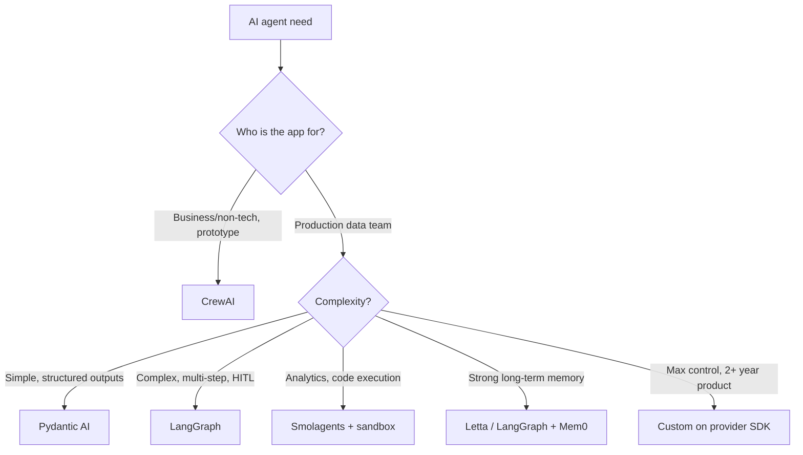

Every three months, a new AI agent framework drops and makes the front page of Reddit and Hacker News. CrewAI. LangGraph. AutoGen. Pydantic AI. Smolagents. And now Mastra, Agno, Letta, OpenAI Agents SDK, Inferable... The list grows every quarter.

The question everyone asks: **which one should I pick?**

The trap is believing there's a "best framework." The truth is that these tools don't target the same audience. And some of them are genuinely not built for serious data scientists who want to understand, optimize, and control what they build.

In this article, I'll walk through the five main frameworks — their real strengths, their concrete weaknesses, and who each one is honestly suited for. Plus a few outsiders worth knowing. And a direct recommendation on what I actually use on client engagements.

<!-- more -->

***

## Table of contents

1. [The "best framework" trap](#the-best-framework-trap)
2. [CrewAI, the "AI agents for everyone" lib](#crewai-the-ai-agents-for-everyone-lib)
3. [LangGraph, LangChain's serious tool](#langgraph-langchains-serious-tool)
4. [AutoGen (Microsoft), the multi-agent orchestrator](#autogen-microsoft-the-multi-agent-orchestrator)
5. [Pydantic AI, the type-safe outsider](#pydantic-ai-the-type-safe-outsider)
6. [Smolagents (HuggingFace), the minimalist philosophy](#smolagents-huggingface-the-minimalist-philosophy)
7. [Outsiders worth knowing](#outsiders-worth-knowing)
8. [Comparison table summary](#comparison-table-summary)
9. [How I choose on client engagements](#how-i-choose-on-client-engagements)
10. [The 3 criteria that actually matter](#the-3-criteria-that-actually-matter)
11. [Classic mistakes when picking a framework](#classic-mistakes-when-picking-a-framework)
12. [FAQ](#faq)
13. [Further reading](#further-reading)

***

## The "best framework" trap

Before diving into comparisons, one important point needs framing: **no framework is "the best" in any absolute sense.**

The right question isn't "what's the best AI agent framework?" The right question is: **best for whom, to build what, with what level of expertise, over what time horizon?**

A product manager who wants to prototype a sales agent in two days has entirely different needs from an R&D team implementing a custom multi-agent system in production. These two people don't need the same tool. Forcing them toward the same choice is a mistake. And before picking a framework at all, ask the architecture question itself: [one agent or several?](systemes-multi-agents-hype-vs-realite.md)

What connects all these frameworks is a single underlying logic: they're all trying to orchestrate the "reasoning + action" loop of an AI agent. What each one does differently is **the level of abstraction** it chooses to impose on the user.

And that's exactly the criterion that changes everything. **The more complexity a framework hides, the more it limits what you can customize.** For rapid prototyping, that's an advantage. For building a reliable, optimized production system, it's a problem.

***

## CrewAI, the "AI agents for everyone" lib

CrewAI is currently the most popular AI agent framework on GitHub with over 44,000 stars. That's a strong signal — but one that deserves context.

### Strengths

- **Fast onboarding**: define agents with a role, goal, and "backstory" in a few lines. A multi-agent workflow is running in under an hour.
- **Accessible to non-developers**: product, ops, or business profiles can understand and modify the config without grasping the underlying concepts.
- **Extensive documentation** and a large community, with plenty of ready-to-use examples.
- **Strong enterprise adoption** for POCs and internal demos.

### Weaknesses

Here's the core problem for a data scientist: **CrewAI abstracts away fundamental concepts you should own.**

In practice, when you use CrewAI, you have no control over:

- The precise system prompt for each agent
- The exact format of messages sent to the model (which role, which content, in what order)
- The memory management logic between turns
- The actual number of LLM calls happening under the hood
- The format of intermediate outputs between agents

These decisions, **CrewAI makes for you**. For someone who just wants things to work, that's comfortable. For a data scientist who wants to optimize token consumption, control output quality, or understand why an agent made a bad decision, it's a frustrating black box.

The other concrete limitations:

- **Hard to debug** when the abstractions break. Error messages rarely surface the actual cause.
- **Non-optimized token consumption**: CrewAI frequently generates verbose prompts and multiplies unnecessary calls.
- **Low extensibility** when you want to rewrite the reasoning loop, add precise guardrails, or trace each call in detail.
- **5.2 million monthly PyPI downloads** versus 34.5 million for LangGraph — which says a lot about real production adoption versus experimentation.

### CrewAI scorecard

| Criterion | Rating |
|---|---|
| Low-level control | Low |
| Learning curve | Very easy |
| Suited to a data scientist | No |
| Production-ready | Partially |
| Token consumption | High (poorly optimized) |
| Debuggability | Difficult |
| Documentation | Good |

### Honest verdict

CrewAI is **excellent for non-data-scientists** who want a functioning multi-role agent quickly. A product engineer who needs to show a POC in two days, an ops person who wants to automate a simple business workflow, a team without a data scientist available.

For a serious data scientist, it's the wrong choice. Not because CrewAI is a bad library, but because it strips you of control over the exact building blocks you're supposed to master and optimize. Using CrewAI as a data scientist is a bit like using Excel for machine learning: it works on simple cases, but you're missing the point entirely.

***

## LangGraph, LangChain's serious tool

LangGraph is LangChain's answer to the criticism of lacking control in their earlier abstractions. And it's a good answer.

### Strengths

- **Graph-based approach**: an agent is modeled as a graph of nodes (states) with explicit transitions. You see exactly what's happening, when, and why.
- **Maximum control** over transitions, conditions, loops, and checkpoints.
- **Excellent for complex agents** with conditional branches, cycles, and human-in-the-loop supervision.
- **Built-in checkpointer**: memory across turns is handled natively — you can resume a workflow from any previous state.
- **Native streaming** and fine-grained observability at each step.
- **34.5 million monthly PyPI downloads**: the de facto standard for production agents in 2026.
- Direct connection with LangSmith for deep tracing.

### Weaknesses

- **Non-trivial learning curve**: State, Edge, Node, Reducer, and Checkpointer concepts take real time to master properly.
- **Verbose for simple cases**: creating a two-tool agent in LangGraph requires far more code than the same thing in Pydantic AI or CrewAI.
- **Still tied to the LangChain ecosystem** with its frequent API changes, which can break existing code between versions.
- **LangSmith becomes nearly indispensable** for serious tracing, and it's paid beyond a certain volume.

### LangGraph scorecard

| Criterion | Rating |
|---|---|
| Low-level control | High |
| Learning curve | Medium to high |
| Suited to a data scientist | Yes |
| Production-ready | Yes |
| Token consumption | Manageable |
| Debuggability | Good (with LangSmith) |
| Documentation | Very good |

### Honest verdict

For a data scientist or engineer who wants to build a **production-ready** custom agent with precise business logic, **LangGraph is today's best structural choice**. It lets you control every step, visualize the execution graph, and manage memory explicitly.

If you already have LangChain in your stack, migrating to LangGraph is natural. If you're starting from scratch on a complex agent, it's the first framework to evaluate.

***

## AutoGen (Microsoft), the multi-agent orchestrator

AutoGen was designed from the start for systems where multiple agents "converse" with each other to solve a task.

### Strengths

- **Well-designed conversational multi-agent pattern**: agents pass messages between each other like a conversation, which is intuitive to model.
- **AutoGen Studio**: a visual interface for prototyping multi-agent workflows without code.
- **Historical Microsoft backing**, which invested significantly in the project.
- **AG2**: the community took over via an independent open-source fork, ensuring the project's continuity.

### Weaknesses

- **Microsoft put AutoGen into maintenance in Q1 2026** in favor of the Microsoft Agent Framework. The official Microsoft path is no longer AutoGen.
- The conversational multi-agent pattern can be **inefficient**: a lot of tokens are consumed in "dialogue" between agents, even when that dialogue adds no value.
- **Less low-level control** than LangGraph over state transitions.
- **Weaker adoption outside the Microsoft ecosystem**: community resources in English are limited, and examples are sparse.
- The rapid evolution (v0.4 broke a lot of things) left a poor impression of stability.

### AutoGen scorecard

| Criterion | Rating |
|---|---|
| Low-level control | Medium |
| Learning curve | Medium |
| Suited to a data scientist | Partially |
| Production-ready | Yes (with AG2) |
| Token consumption | High (agent-to-agent conversations) |
| Debuggability | Medium |
| Documentation | Good (but fragmented between AutoGen/AG2) |

### Honest verdict

AutoGen remains relevant for **teams already in the Microsoft/Azure ecosystem** or for research on conversational multi-agent patterns. Outside those cases, Microsoft's official maintenance decision and LangGraph's rise make AutoGen hard to justify on a new project in 2026. I'd choose LangGraph or a custom SDK-based agent instead.

***

## Pydantic AI, the type-safe outsider

Pydantic AI launched at the end of 2024 and quickly accumulated 16,800 GitHub stars. It's the framework not enough people are talking about yet, but that data scientists and strong Python developers appreciate immediately.

### Strengths

- **Pythonic and minimalist approach**: no magic abstractions — the code looks like good Python with types.
- **Heavy use of Pydantic**: tools, outputs, schemas all typed with strict validation. If you already use Pydantic (and you probably do if you write serious Python), this is a direct continuation.
- **Strong output validation**: format hallucinations are significantly reduced because the output schema is validated before the response is returned.
- **Readable and auditable code**: no magic under the hood. What you read is what happens.
- **Natively multi-provider**: OpenAI, Anthropic, Gemini, Groq, Mistral. No vendor lock-in.
- **Integrated testing experience**: testing a Pydantic AI agent is as straightforward as testing a Python function.

### Weaknesses

- **Smaller community**: fewer examples, less Stack Overflow coverage, fewer ready-made templates.
- **Limited advanced multi-agent patterns** natively. For complex systems with orchestration, you need more custom code.
- **Streaming and long-running tasks** not as mature as LangGraph.
- **Younger framework**: some production edge cases aren't well documented yet.

### Pydantic AI scorecard

| Criterion | Rating |
|---|---|
| Low-level control | High |
| Learning curve | Low to medium |
| Suited to a data scientist | Very well |
| Production-ready | Yes |
| Token consumption | Controlled |
| Debuggability | Very good (explicit code) |
| Documentation | Good and growing |

### Honest verdict

**My preferred framework for a clean production agent.** When the requirement is: an agent with a few tools, structured JSON outputs, and code that another person can read and maintain six months later — Pydantic AI is my first choice.

It's the framework that most respects a data scientist's or strong Python developer's expertise: zero magic, strong typing, and predictable behavior.

***

## Smolagents (HuggingFace), the minimalist philosophy

Smolagents is HuggingFace's framework, released in 2024 with a radical bet: extreme simplicity. The core library is under 1,000 lines. The main agent loop is readable in an afternoon.

### Strengths

- **Minimal footprint**: no heavy dependencies, no stacked abstractions. The code is readable.
- **Code-based agents**: the key concept in Smolagents. Rather than calling tools via JSON function calls (like every other framework), the agent writes and executes **Python code** to accomplish its tasks. This is a fundamental paradigm difference.
- **Why this is powerful**: an agent that writes code can compose complex operations in a single step, manipulate dataframes, run calculations, produce charts — all without defining any custom tools. It uses Python directly.
- **26,000+ GitHub stars** and HuggingFace backing, a guarantee of longevity.
- **Perfect for data analysis tasks**: data manipulation, visualization, statistics.

### Weaknesses

- **The code-based approach requires a secure sandbox in production**: if the agent executes arbitrary Python code, that code can do anything on the system. Without isolation (E2B, Daytona, isolated Docker), it's a major security vulnerability.
- **No sandbox by default**: Smolagents leaves this entirely to you. It's non-trivial to configure correctly.
- **Complex multi-agent** setups not yet as mature as LangGraph.
- **Heavy model dependency**: code-based agents perform best with top-tier models (Claude Sonnet, GPT-4o). On weaker models, the quality of generated code drops sharply.

### Smolagents scorecard

| Criterion | Rating |
|---|---|
| Low-level control | Very high |
| Learning curve | Low |
| Suited to a data scientist | Very well |
| Production-ready | With sandbox (E2B, Docker) |
| Token consumption | Variable (depends on code complexity) |
| Debuggability | Good (readable code) |
| Documentation | Adequate |

### Honest verdict

Smolagents is **the best choice for agentic data analysis tasks**: an agent that needs to manipulate dataframes, run statistical calculations, produce visualizations, or automate data pipelines. The ability to write Python code directly is a decisive advantage in these situations.

That said, if you're not prepared to rigorously manage code execution isolation, avoid it in production. The risk of arbitrary code execution is real and non-negligible.

***

## Outsiders worth knowing

Beyond the five main frameworks, here are the alternatives that deserve your attention depending on your context.

**Letta (formerly MemGPT)**: a framework specialized in agents with **persistent long-term memory**. If your use case requires an agent to remember conversations over weeks or months, Letta is the only framework that has genuinely thought this problem through in depth.

**Agno (formerly Phidata)**: multi-agent with built-in memory, growing fast. Simple interface, good memory abstraction. Worth watching.

**OpenAI Agents SDK**: released in 2025, simple, well integrated with the OpenAI API. Very good if you're exclusively on OpenAI and want something lightweight and official. Limited the moment you want multi-provider support.

**Mastra**: TypeScript-first framework. If your team is Next.js / Node.js and you don't want Python in the stack, this is currently the best JS-side option.

**Anthropic Computer Use / Claude Code SDK**: for agents that control a real environment, a browser, or a terminal. Specific use case but very powerful when it applies.

**Inferable / Resemble**: agents in "queue/job" mode for long-running asynchronous tasks. Useful when the agent needs to run for hours without an active user connection.

**DSPy**: not strictly an agent framework, but a library for **automatically optimizing the prompts** in your LLM pipeline. If you want to improve system performance systematically rather than manually, DSPy is worth exploring.

**Microsoft Agent Framework**: the official AutoGen successor at Microsoft. Still young, but the direction Microsoft is taking for production agent projects.

***

## Comparison table summary

| Framework | Control level | Learning curve | DS-friendly | Production-ready | When to use |
|---|---|---|---|---|---|
| CrewAI | Low (heavy abstractions) | Easy | No | Partially | Business prototypes, non-DS |
| LangGraph | High | Medium to high | Yes | Yes | Complex agents in prod |
| AutoGen / AG2 | Medium | Medium | Partially | Yes | Multi-agent, Microsoft ecosystem |
| Pydantic AI | High | Low to medium | Very well | Yes | Strict structured outputs, clean code |
| Smolagents | Very high | Low | Very well | With sandbox | Code-based agents, analytics |
| Letta | Medium | Medium | Yes | Emerging | Strong memory, long conversations |
| OpenAI Agents SDK | Medium | Easy | Yes | Yes | Exclusively OpenAI stack, simple agent |
| Custom SDK | Maximum | Low (if good dev) | Ideal | Yes | Long-term, specific cases, total control |

***

## How I choose on client engagements

Here's my real decision grid, not the marketing version.

**If the engagement is a fast POC for a non-technical client who wants to see results in a week**: CrewAI or Smolagents. The goal is to show something working, not to write perfect code. Speed matters more than control.

**If it's a custom production agent with precise business logic**: Pydantic AI or LangGraph with custom glue. Pydantic AI for relatively simple agents with structured outputs. LangGraph the moment the logic involves conditional branches, loops, or human-in-the-loop supervision.

**If it's agentic analytics** (data manipulation, calculations, visualization): Smolagents with an E2B sandbox. The ability to write Python code directly changes everything on this type of task.

**If it's a multi-agent system with long-term memory**: LangGraph with Mem0 for orchestration, or Letta if persistent memory is truly the core of the product.

**If it's a product we'll be working on for two years and want maximum control**: custom code directly on the Anthropic or OpenAI SDK. No framework. Just the primitives. This avoids being held hostage by a third-party framework's API changes and gives you complete ownership of what's happening. It's also what I recommend when the team is small and you want to minimize technical debt.

For agents that need standardized tooling, I also look at what [MCP (Model Context Protocol)](/en/blog/2026/05/15/mcp-model-context-protocol-agents-ia/) can offer: it's an emerging standard for connecting tools to agents in an interoperable way, independent of the chosen framework.



***

## The 3 criteria that actually matter

Beyond the feature table, three criteria make the real difference when choosing a framework.

**1. Your team's expertise level**

This is the most underestimated criterion. A data scientist will quickly get frustrated with CrewAI and its opaque abstractions. A product engineer without a Python background struggles with custom LangGraph. The best framework is the one your team can maintain and debug at 2am when something breaks in production.

**2. The product's time horizon**

Over three months, use what ships fast. Over three years, use what doesn't lock you in. A highly abstract framework like CrewAI delivers quickly — and blocks you quickly too. A custom agent on a provider SDK takes more upfront time but belongs to you completely over the long run.

**3. The specificity of your domain**

The more generic your use case, the more an abstract framework can suffice. The more specific it is (particular business logic, strict format constraints, deep integration with existing systems), the more the framework becomes a burden rather than a help. For very specific cases, seriously consider the "zero framework" option.

***

## Classic mistakes when picking a framework

**1. Choosing CrewAI for ML R&D**

The main mistake I see. A data science team picks CrewAI because it's popular and easy to get started with. Six weeks later, they hit the abstraction limits at the exact moment they need to understand what's happening inside the reasoning loop. The migration to LangGraph or custom code then costs far more than making the right choice upfront.

**2. Choosing LangGraph for a simple "API call + summarize" agent**

The reverse exists too. A trivial use case (call an API, summarize the result, return) doesn't need a state graph with checkpointers. Pydantic AI or even a plain SDK call does the job in ten times less code.

**3. Choosing based on GitHub stars**

44,000 stars for CrewAI. That's a lot. It's also primarily a reflection of enthusiasm from non-developers and curious onlookers. GitHub stars measure popularity, not technical quality or fit for your use case. LangGraph has half the stars and six times the actual downloads.

**4. Stacking multiple frameworks**

I've seen projects with LangGraph + CrewAI + LlamaIndex + legacy LangChain in the same codebase. It's a maintenance disaster. Every framework has its own abstractions, its own versions, its own conventions. Pick one primary framework and stick with it.

**5. Not measuring before going to production**

Every framework behaves very differently in terms of tokens consumed and latency. A CrewAI workflow that "works" in dev might cost five times more than expected in production due to the superfluous LLM calls generated under the hood. Always measure on a representative sample before deploying.

***

## FAQ

**What is the best AI agent framework in 2026?**

There is no universally best framework. If you're a data scientist or engineer who wants control: Pydantic AI for simple cases, LangGraph for complex ones. If you're non-technical and want to prototype fast: CrewAI. If you're doing agentic analytics: Smolagents. The relevant question is always "best for whom and for what."

**CrewAI or LangGraph: which one to choose?**

If you're a data scientist, choose LangGraph. If you're a product manager or ops person who wants a POC in two days, choose CrewAI. Both are good within their domain. They don't target the same audience or the same needs.

**Is CrewAI good for production?**

For simple business workflows with non-technical teams, yes, to a degree. For systems that require token optimization, complex business logic, or fine-grained observability, CrewAI hits its limits quickly. The 5.2 million monthly PyPI downloads versus 34.5 million for LangGraph reflects this reality.

**Pydantic AI vs LangGraph: what's the difference?**

Pydantic AI is excellent for relatively simple agents with structured outputs and strong typing. LangGraph is necessary the moment you have complex workflows with conditional branches, cycles, human supervision, or the need to resume a previous state. For most "standard" production agents, Pydantic AI is more readable and easier to maintain.

**Is Smolagents secure in production?**

Not by default. Smolagents' code-based approach means the agent executes potentially arbitrary Python code. Without an isolation sandbox (E2B, Daytona, Docker with network and filesystem restrictions), it's a serious security vulnerability. With a properly configured sandbox, yes, it's usable in production.

**Should you use a framework or write your agent from scratch?**

It depends on the horizon. For a prototype or POC, a framework accelerates delivery. For a long-term product with very specific needs and a capable team, custom code on a provider SDK (Anthropic, OpenAI) gives total control and eliminates framework debt. I often choose custom when the team is strong and the product runs for more than twelve months.

**Is AutoGen still relevant in 2026?**

Microsoft put AutoGen into maintenance in Q1 2026 in favor of its own Microsoft Agent Framework. The community continues via AG2 (the open-source fork). For teams already on AutoGen within Microsoft/Azure, AG2 ensures continuity. For a new project, I'd choose LangGraph or Pydantic AI over AutoGen unless there's a specific constraint.

**Does LangGraph replace LangChain?**

LangGraph is a layer on top of LangChain, not a direct replacement. LangChain is still used for its many integrations (connectors, parsers, retrievers). LangGraph handles the agent orchestration. In practice, both coexist in the same stack. For new projects, many teams skip legacy LangChain and use LangGraph with provider SDKs directly.

**Which framework for a multi-agent system?**

LangGraph for a stateful, production-ready multi-agent system. CrewAI for a rapid multi-agent prototype. Agno for multi-agent with built-in memory. AutoGen/AG2 for conversational patterns between agents. Smolagents has basic multi-agent capabilities but it's not its strong suit.

**Which framework for a data scientist?**

Pydantic AI or LangGraph. Both respect your expertise: the code is explicit, abstractions are chosen rather than imposed, and you control what happens inside the reasoning loop. Avoid CrewAI if you want to understand and optimize what you're building.

***

```json
<script type="application/ld+json">
{
  "@context": "https://schema.org",
  "@type": "FAQPage",
  "mainEntity": [
    {
      "@type": "Question",
      "name": "What is the best AI agent framework in 2026?",
      "acceptedAnswer": {
        "@type": "Answer",
        "text": "There is no universally best framework. For a data scientist: Pydantic AI for simple cases, LangGraph for complex ones. For a non-technical user who wants to prototype fast: CrewAI. For agentic analytics: Smolagents. The right question is always 'best for whom and for what.'"
      }
    },
    {
      "@type": "Question",
      "name": "CrewAI or LangGraph: which one to choose?",
      "acceptedAnswer": {
        "@type": "Answer",
        "text": "If you're a data scientist, choose LangGraph. If you're a product manager or ops person who wants a POC in two days, choose CrewAI. Both are good within their domain but don't target the same audience."
      }
    },
    {
      "@type": "Question",
      "name": "Pydantic AI vs LangGraph: what's the difference?",
      "acceptedAnswer": {
        "@type": "Answer",
        "text": "Pydantic AI is excellent for simple agents with structured outputs and strong typing. LangGraph is necessary once you have complex workflows with conditional branches, cycles, or human supervision. Pydantic AI is more readable and easier to maintain for most standard agents."
      }
    },
    {
      "@type": "Question",
      "name": "Is Smolagents secure in production?",
      "acceptedAnswer": {
        "@type": "Answer",
        "text": "Not by default. Smolagents' code-based approach means the agent executes potentially arbitrary Python code. Without an isolation sandbox (E2B, Daytona, Docker with restrictions), it's a serious security vulnerability. With a properly configured sandbox, it is usable in production."
      }
    },
    {
      "@type": "Question",
      "name": "Is AutoGen still relevant in 2026?",
      "acceptedAnswer": {
        "@type": "Answer",
        "text": "Microsoft put AutoGen into maintenance in Q1 2026. The community continues via AG2 (open-source fork). For a new project in 2026, LangGraph or Pydantic AI are better choices unless there is a specific Microsoft ecosystem constraint."
      }
    },
    {
      "@type": "Question",
      "name": "Which AI agent framework for a data scientist?",
      "acceptedAnswer": {
        "@type": "Answer",
        "text": "Pydantic AI or LangGraph. Both respect a data scientist's expertise: explicit code, chosen rather than imposed abstractions, control over the reasoning loop. Avoid CrewAI if you want to understand and optimize what you're building."
      }
    },
    {
      "@type": "Question",
      "name": "Should you use a framework or write your agent from scratch?",
      "acceptedAnswer": {
        "@type": "Answer",
        "text": "For a prototype or POC, a framework accelerates delivery. For a long-term product with very specific needs and a capable team, custom code on a provider SDK (Anthropic, OpenAI) gives total control and eliminates framework debt."
      }
    },
    {
      "@type": "Question",
      "name": "Does LangGraph replace LangChain?",
      "acceptedAnswer": {
        "@type": "Answer",
        "text": "LangGraph is a layer on top of LangChain, not a direct replacement. LangChain is still used for its integrations. LangGraph handles agent orchestration. For new projects, many teams use LangGraph with provider SDKs directly, skipping legacy LangChain."
      }
    },
    {
      "@type": "Question",
      "name": "Which framework for a multi-agent system?",
      "acceptedAnswer": {
        "@type": "Answer",
        "text": "LangGraph for a stateful, production-ready multi-agent system. CrewAI for a rapid multi-agent prototype. Agno for multi-agent with built-in memory. AutoGen/AG2 for conversational patterns between agents."
      }
    },
    {
      "@type": "Question",
      "name": "Is CrewAI good for production?",
      "acceptedAnswer": {
        "@type": "Answer",
        "text": "For simple business workflows with non-technical teams, yes, to a degree. For systems requiring token optimization, complex business logic, or fine-grained observability, CrewAI hits its limits quickly. The 5.2 million monthly PyPI downloads versus 34.5 million for LangGraph reflects this reality."
      }
    }
  ]
}
</script>
```

***

## Further reading

- **[What is an AI agent, really?](/en/blog/2025/12/16/mais-cest-quoi-un-agent-ia/)** — the foundation for understanding what all these frameworks are trying to orchestrate
- **[Agentic RAG vs classic RAG](/en/blog/2026/03/20/agentic-rag-vs-rag-classique/)** — how agent frameworks connect with your RAG pipelines
- **[Long-term memory for AI agents](/en/blog/2026/05/19/memoire-agents-ia-long-terme/)** — the component most frameworks still handle poorly
- **[MCP: Model Context Protocol for agents](/en/blog/2026/05/15/mcp-model-context-protocol-agents-ia/)** — the emerging standard for connecting tools to your agents, independent of framework

***

If my articles interest you and you have questions, or just want to talk through your own challenges, feel free to reach out at [anas@tensoria.fr](mailto:anas@tensoria.fr) — I enjoy these conversations.

You can also [book a call](https://cal.eu/anas-rabhi/rendez-vous-ianas) or subscribe to my newsletter.


---

### About me

I'm **Anas Rabhi**, freelance AI Engineer & Data Scientist. I help companies design and ship AI solutions (RAG, agents, NLP). [Read more about my work and approach](/en/a-propos/), or browse the [full blog](/en/blog/).

Discover my services at [tensoria.fr](https://tensoria.fr) or try our AI agents solution at [heeya.fr](https://heeya.fr).

<div style="text-align: center; margin: 40px 0; gap: 16px; display: flex; flex-wrap: wrap; justify-content: center;">
  <a href="https://cal.eu/anas-rabhi/rendez-vous-ianas" target="_blank" style="display: inline-block; background-color: #4F46E5; color: #ffffff; font-weight: bold; padding: 16px 32px; text-decoration: none; border-radius: 8px; font-size: 18px; letter-spacing: 0.8px; box-shadow: 0 6px 12px rgba(0, 0, 0, 0.2); transition: all 0.3s ease; border: none;">
    Book a call
  </a>
  <a href="https://anas-ai.kit.com/d8b1a255cc" target="_blank" style="display: inline-block; background-color: #222222; color: #ffffff; font-weight: bold; padding: 16px 32px; text-decoration: none; border-radius: 8px; font-size: 18px; letter-spacing: 0.8px; box-shadow: 0 6px 12px rgba(0, 0, 0, 0.2); transition: all 0.3s ease; border: none;">
    <span style="margin-right: 10px;">✉️</span> Subscribe to my newsletter
  </a>
</div>
