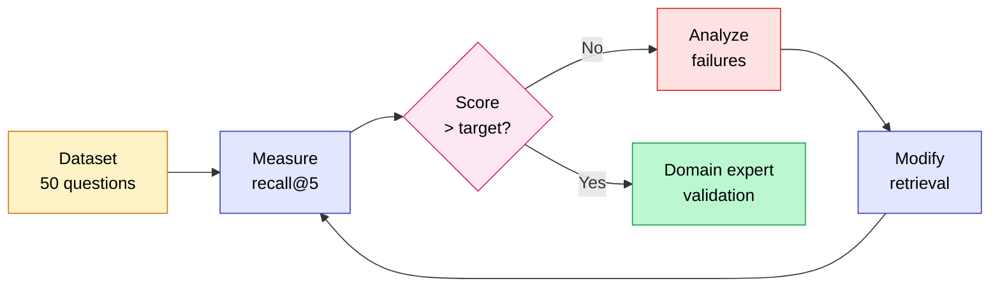

## An imperfect dataset beats having no measurement at all

No weeks of annotation needed, no domain expert on call from day one. In 30 minutes, you can generate a usable starting dataset directly from your chunks, measure recall@k, and kick off a first improvement cycle.

That dataset will be imperfect. That's normal and acceptable. The goal isn't perfection: it's to have a reproducible measurement rather than nothing. A recall@5 of 0.71 measured on 50 synthetic questions already tells you infinitely more than "it seems to work in the demo."

The method described here runs in four steps: generate questions from your chunks, compute recall@k, iterate on retrieval (hill climbing), and feed "not relevant" feedback back as hard negatives for the reranker. For generation metrics (faithfulness, answer relevancy, context recall) and the choice between RAGAS, DeepEval, and TruLens, see [Evaluate RAG in production: metrics & RAGAS](evaluer-rag-production-metriques-ragas.md).

<!-- more -->

## A golden dataset, even a synthetic one, makes optimization measurable

Without a reference dataset, you are optimizing blind. You swap the embedding model, you tweak chunk sizes, you add a reranker. But you have no idea whether things got better. You retest by hand on 5 questions. That is not optimization. That is guesswork.

A golden dataset, even one generated by an LLM, gives you a reproducible measure. You can compare recall@5 before and after every change. You can identify which categories of questions are causing problems. You can justify a technical decision with a number, not a feeling.

### What a synthetic dataset covers (and what it does not)

Questions generated by an LLM are coherent with your chunks, well-formed, and cover the corpus systematically. That is exactly what is missing when you test "by hand" on 10 questions you already know.

On the other hand, real user questions are shorter, more ambiguous, contain typos, and carry implicit references. A synthetic dataset does not capture those cases. You need to enrich it progressively with real questions as soon as logs exist. The synthetic dataset is the starting point, not the destination.

### The 50-question rule

For a first baseline, 50 questions are enough. You do not need 500. The distribution I apply on my projects:

| Question type | Share | Description |
|---|---|---|
| Simple factual | 50% | One piece of information in a single chunk |
| Multi-hop | 20% | Crossing two chunks or two sections |
| Reformulation | 15% | Same question, different wording |
| Out-of-scope | 15% | The RAG should say it does not know |

Out-of-scope questions are often forgotten. They are critical for measuring the hallucination rate on queries the system should not handle.

## Generating synthetic questions from your chunks

Two approaches. The first, manual, gives you full control over the format of the questions. The second, via the RAGAS `TestsetGenerator`, is faster when you have a large corpus.

### Approach 1: generation with a simple prompt (recommended to start)

This is the approach I prefer for a first dataset. You iterate over your chunks and ask an LLM to generate a question and an expected answer (ground truth) for each one.

```python
import json
from openai import OpenAI

client = OpenAI()

PROMPT_TEMPLATE = """You are an expert in evaluating RAG systems.

Here is an excerpt from a document:
<chunk>
{chunk_text}
</chunk>

Generate ONE precise question a user might ask, whose answer is found exactly in this excerpt.
Also generate the expected answer (ground truth), written in 1 to 3 sentences.

Reply with valid JSON using the keys "question" and "ground_truth".
Do not generate a vague or generic question. Be specific."""


def generate_qa_from_chunk(chunk_id: str, chunk_text: str) -> dict:
    """Generate a question/ground_truth pair from a chunk."""
    response = client.chat.completions.create(
        model="gpt-4o-mini",
        temperature=0.3,
        response_format={"type": "json_object"},
        messages=[
            {"role": "user", "content": PROMPT_TEMPLATE.format(chunk_text=chunk_text)}
        ],
    )
    result = json.loads(response.choices[0].message.content)
    return {
        "chunk_id": chunk_id,
        "question": result["question"],
        "ground_truth": result["ground_truth"],
        "relevant_chunk_ids": [chunk_id],
    }


# Example usage on your list of chunks
chunks = [
    {"id": "doc1_chunk_3", "text": "The withdrawal period is 14 calendar days..."},
    {"id": "doc1_chunk_7", "text": "Return shipping costs are borne by the seller..."},
]

dataset = [generate_qa_from_chunk(c["id"], c["text"]) for c in chunks]

# Save
import csv
with open("eval_dataset.csv", "w", newline="", encoding="utf-8") as f:
    writer = csv.DictWriter(f, fieldnames=["chunk_id", "question", "ground_truth", "relevant_chunk_ids"])
    writer.writeheader()
    writer.writerows(dataset)
```

Indicative cost with `gpt-4o-mini`: around €0.002 per chunk. For 200 chunks, expect under €0.50 and 5 to 10 minutes of processing time.

### Approach 2: RAGAS TestsetGenerator

RAGAS offers a generator that builds an internal knowledge graph from your documents before generating questions. It automatically produces different question types (simple, multi-hop, with reasoning).

```python
from ragas.testset import TestsetGenerator
from ragas.testset.transforms import default_transforms
from langchain_openai import ChatOpenAI, OpenAIEmbeddings
from langchain_community.document_loaders import DirectoryLoader

# Load your documents
loader = DirectoryLoader("./docs/", glob="**/*.md")
documents = loader.load()

# Configure the generator
generator = TestsetGenerator.from_langchain(
    generator_llm=ChatOpenAI(model="gpt-4o-mini"),
    critic_llm=ChatOpenAI(model="gpt-4o"),
    embeddings=OpenAIEmbeddings(),
)

# Generate 50 questions with the default type mix
testset = generator.generate_with_langchain_docs(
    documents=documents,
    test_size=50,
    transforms=default_transforms,
)

# Export CSV
testset.to_pandas().to_csv("eval_dataset_ragas.csv", index=False)
```

The advantage of `TestsetGenerator`: it generates multi-hop questions that cross several documents, something a simple prompt will not do naturally. The downside: the critic model (`gpt-4o`) makes generation more expensive, and you have less control over the exact format of the questions.

My field practice: I start with the manual approach (30 minutes, negligible cost, full control), then enrich with `TestsetGenerator` if the corpus exceeds 500 chunks or if I want systematic multi-hop questions.

## Measuring recall@k and iterating (hill climbing)

Once the dataset is generated, the working cycle is: measure recall@k on the dataset, identify the failing questions, understand why, modify the retrieval, re-measure. This is what hill climbing means: every change must raise the score, otherwise you roll it back.

### Computing recall@k

Recall@k answers a simple question: for each question, is the reference chunk (`relevant_chunk_ids`) among the top-k results returned by your retriever?

```python
def recall_at_k(retrieved_ids: list[str], relevant_ids: set[str], k: int) -> float:
    """
    Proportion of relevant chunks found in the top-k.
    For a single relevant chunk per question: returns 0 or 1.
    For multiple relevant chunks (multi-hop): returns the proportion retrieved.
    """
    top_k = set(retrieved_ids[:k])
    if not relevant_ids:
        return 0.0
    return len(top_k & relevant_ids) / len(relevant_ids)


def evaluate_retrieval_dataset(
    eval_dataset: list[dict],
    retriever,
    k: int = 5,
) -> dict:
    """
    eval_dataset: list of dicts with 'question' and 'relevant_chunk_ids'.
    retriever: your retriever with an invoke() method that returns Documents.
    """
    recall_scores = []
    failures = []

    for sample in eval_dataset:
        results = retriever.invoke(sample["question"])
        retrieved_ids = [doc.metadata["chunk_id"] for doc in results[:k]]
        relevant_ids = set(sample["relevant_chunk_ids"])

        score = recall_at_k(retrieved_ids, relevant_ids, k)
        recall_scores.append(score)

        if score < 1.0:
            failures.append({
                "question": sample["question"],
                "expected": list(relevant_ids),
                "got": retrieved_ids,
                "score": score,
            })

    mean_recall = sum(recall_scores) / len(recall_scores)
    return {
        f"recall@{k}": round(mean_recall, 3),
        "n_questions": len(eval_dataset),
        "n_failures": len(failures),
        "failures": failures,
    }


# Example output
# {'recall@5': 0.74, 'n_questions': 50, 'n_failures': 13, 'failures': [...]}
```

The `failures` list is your raw material for diagnosis. Look at the first 5 failures: is the right chunk missing from the vector store? Was it present but ranked poorly? Is the question too vague for the embedding to "find" it? The answers directly point to the next optimization.

### The hill climbing cycle in practice



On a recent project (HR corpus, 800 documents, vector-only retrieval), the starting recall@5 was 0.68. After two iterations: switching to hybrid BM25 + vector retrieval (+11 pts), then adding a cross-encoder reranker (+8 pts). Final result: 0.87 in three hours of work, with the same 50-question dataset as the benchmark throughout.

The target I aim for before moving on to generation evaluation: recall@5 above 0.90. Below that, working on the prompt or the LLM model is wasted effort. As Jason Liu puts it: reach 97% recall before touching anything else.

## Hard negatives: turning failures into training data

A hard negative is a chunk the retriever considers relevant (it ranks it high) even though it is not relevant for that specific question. This is the hardest case to fix through cosine distance metrics alone, and it is exactly where rerankers contribute the most.

### Why hard negatives are valuable

An "easy" negative is a chunk clearly off-topic: the retriever will not surface it and there is nothing to learn from it. A hard negative looks like the right answer semantically, but is not the right answer. It is the chunk on page 12 that talks about "processing time" when the question is about "delivery time": two chunks close together in vector space, distinct semantics.

Cross-encoder rerankers (BAAI/bge-reranker-large, Cohere Rerank) are trained on (question, relevant chunk) and (question, non-relevant chunk) pairs. The closer the hard negatives are to the true positive, the better the reranker learns to make fine-grained distinctions.

### How to identify and build your hard negatives

The natural source of hard negatives is your `failures` list: the cases where your retriever surfaced wrong chunks in a high position. For each failure, the chunk appearing at position 1 or 2 in place of the correct chunk is a hard negative candidate.

```python
def extract_hard_negatives(failures: list[dict], k_hard: int = 3) -> list[dict]:
    """
    Extracts hard negatives from retriever failures.
    For each failure, the k_hard first incorrect chunks are hard negative candidates.
    """
    hard_negatives = []
    for failure in failures:
        wrong_ids = [
            cid for cid in failure["got"]
            if cid not in set(failure["expected"])
        ]
        for hard_neg_id in wrong_ids[:k_hard]:
            hard_negatives.append({
                "question": failure["question"],
                "positive_chunk_id": failure["expected"][0],  # the correct chunk
                "hard_negative_chunk_id": hard_neg_id,        # the false positive
            })
    return hard_negatives

# Usage
hard_negatives = extract_hard_negatives(results["failures"], k_hard=2)
# These triplets (question, positive, hard_negative) can be used
# to fine-tune a bi-encoder or train a custom reranker.
```

These triplets in the format (question, relevant chunk, hard negative) are the standard format for contrastive training of bi-encoders (via the `MultipleNegativesRankingLoss` of sentence-transformers) or for fine-tuning a reranker on your domain.

On the majority of projects, you will not need to go as far as fine-tuning. Using a pre-trained reranker (BAAI/bge-reranker-large) on your candidates already significantly improves hard cases without any additional training data. Hard negatives serve as a diagnostic tool first: if the first 10 failures are all confusions between two very similar chunks, that is a clear signal to refine the chunking or add context to the affected chunks.

## Having a domain expert validate the dataset

Synthetic generation produces a starting dataset. It does not produce a reliable dataset.

An LLM can generate a question for a chunk and a ground truth that "looks right" but contains a factual error, an ambiguous interpretation, or focuses on a detail with no business relevance. Out of 50 generated questions, I estimate on average that 8 to 12 require a correction or a reformulation.

### The minimum viable review

Sit down with a domain expert (or the end user of the RAG) for 45 minutes. Go through the 50 questions, one by one. For each question:

- **Is the question realistic?** Is it something a real user might actually ask?
- **Is the ground truth accurate?** Not just "consistent with the chunk": genuinely accurate according to the business rules?
- **Are there missing questions?** Critical topics not covered in the 50?

Remove doubtful questions rather than correcting them on the fly. 40 reliable questions are worth more than 50 approximate ones.

### Version your dataset like your code

A frequent mistake: the dataset evolves (questions added, ground truths corrected) without tracking what previous evaluations were based on. You lose the ability to compare.

Store your dataset in a versioned file (CSV or JSON in Git), with a tag or a version number. When you modify the dataset, create a new version. Every experiment's metrics must point to the dataset version used. That is the condition for hill climbing to make sense over time.

## Frequently asked questions about RAG evaluation datasets

**How many questions are needed for a first dataset?**
50 questions are enough for a usable baseline. That number is consistent with what I see in the field: below 30, results are too volatile (a difference of 2 questions shifts the score by 4 points). Above 200, the marginal gain is small unless the questions are highly diversified. Start at 50, progressively enrich with real user questions.

**Are synthetic questions reliable for measuring recall?**
For measuring retrieval recall@k, yes. The retriever does not know whether a question is synthetic or real: it looks for the vectorially closest chunks. Recall@k computed on a synthetic dataset is a valid indicator of retriever performance, provided the questions cover diverse topics from the corpus. What is not reliable without human validation is the evaluation of generation (faithfulness, answer relevancy): LLM-generated ground truths can be inaccurate.

**Which model should be used to generate questions?**
`gpt-4o-mini` is the right cost/quality tradeoff for generation. `gpt-4o` as a critic (as in the RAGAS `TestsetGenerator`) improves the quality of complex questions but doubles or triples the cost. For highly technical domains (legal, medical, regulatory), a more powerful generation model is justified: factual errors carry more consequences there.

**Do chunks need a chunk_id to use this method?**
Yes, it is essential. Recall@k relies on comparing the IDs of retrieved chunks against the IDs of reference chunks. If your chunks do not have a stable identifier, add one at ingestion time (hash of the content, position in the document, UUID). It is good practice regardless for debugging purposes.

**How often should recall@k be recomputed?**
After every significant change to the retrieval pipeline: embedding model change, chunk size modification, reranker addition, switch to hybrid retrieval. No need to recompute on every commit. In a stable production environment, a weekly measurement is enough to detect drift.

**What is the difference between recall@k and hit rate@k?**
For a single relevant chunk per question, the two are identical: 1 if the chunk is in the top-k, 0 otherwise. The difference appears on multi-hop questions with multiple relevant chunks. Hit rate@k equals 1 as soon as at least one relevant chunk is retrieved. Recall@k measures the proportion of relevant chunks retrieved. For most RAGs with simple factual questions, use either interchangeably.

**Can this method be used without RAGAS?**
Yes, completely. The code in this article has no dependency on RAGAS. The `TestsetGenerator` is one option among others for generating questions. Computing recall@k is a 10-line function. RAGAS becomes useful for the next step (evaluating generation with faithfulness, answer relevancy, etc.), described in [Evaluate RAG in production: metrics & RAGAS](evaluer-rag-production-metriques-ragas.md).

## Further reading

- [Evaluate RAG in production: metrics & RAGAS](evaluer-rag-production-metriques-ragas.md): once recall@k is satisfactory, move on to generation evaluation
- [LLM-as-a-judge: when to use it, with the real cost in euros](llm-as-a-judge-cout-evaluation.md): validate the quality of LLM-generated ground truths
- [Testing an LLM with unit tests](tester-llm-tests-unitaires.md): integrate evaluation into a CI/CD pipeline
- [Hybrid RAG: BM25 + vector search](rag-hybride-bm25-vectoriel.md): the first optimization to activate when recall@k is below 0.85

---------

If my articles interest you and you have questions, or just want to discuss your own challenges, feel free to write to me at [anas@tensoria.fr](mailto:anas@tensoria.fr). I enjoy talking about these topics!

You can also [book a call](https://cal.eu/anas-rabhi/rendez-vous-ianas) or subscribe to my newsletter :)


---

### About me

I'm **Anas Rabhi**, freelance AI Engineer & Data Scientist. I help companies design and deploy AI solutions (RAG, AI agents, NLP). [Read more about my work and approach](/en/a-propos/), or browse the [full blog](/en/blog/).

Discover my services at [tensoria.fr](https://tensoria.fr) or try our AI agents solution at [heeya.fr](https://heeya.fr).

<div style="text-align: center; margin: 40px 0; gap: 16px; display: flex; flex-wrap: wrap; justify-content: center;">
  <a href="https://cal.eu/anas-rabhi/rendez-vous-ianas" target="_blank" style="display: inline-block; background-color: #4F46E5; color: #ffffff; font-weight: bold; padding: 16px 32px; text-decoration: none; border-radius: 8px; font-size: 18px; letter-spacing: 0.8px; box-shadow: 0 6px 12px rgba(0, 0, 0, 0.2); transition: all 0.3s ease; border: none;">
    Book a call
  </a>
  <a href="https://anas-ai.kit.com/d8b1a255cc" target="_blank" style="display: inline-block; background-color: #222222; color: #ffffff; font-weight: bold; padding: 16px 32px; text-decoration: none; border-radius: 8px; font-size: 18px; letter-spacing: 0.8px; box-shadow: 0 6px 12px rgba(0, 0, 0, 0.2); transition: all 0.3s ease; border: none;">
    <span style="margin-right: 10px;">✉️</span> Subscribe to my newsletter
  </a>
</div>
