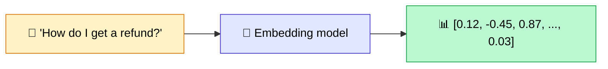
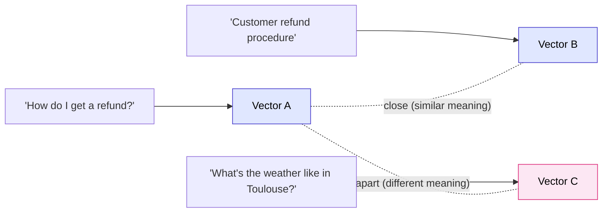
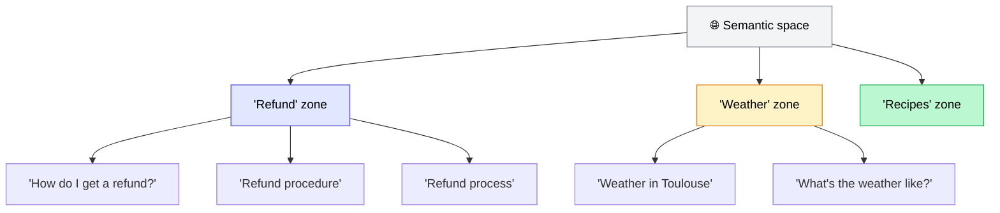
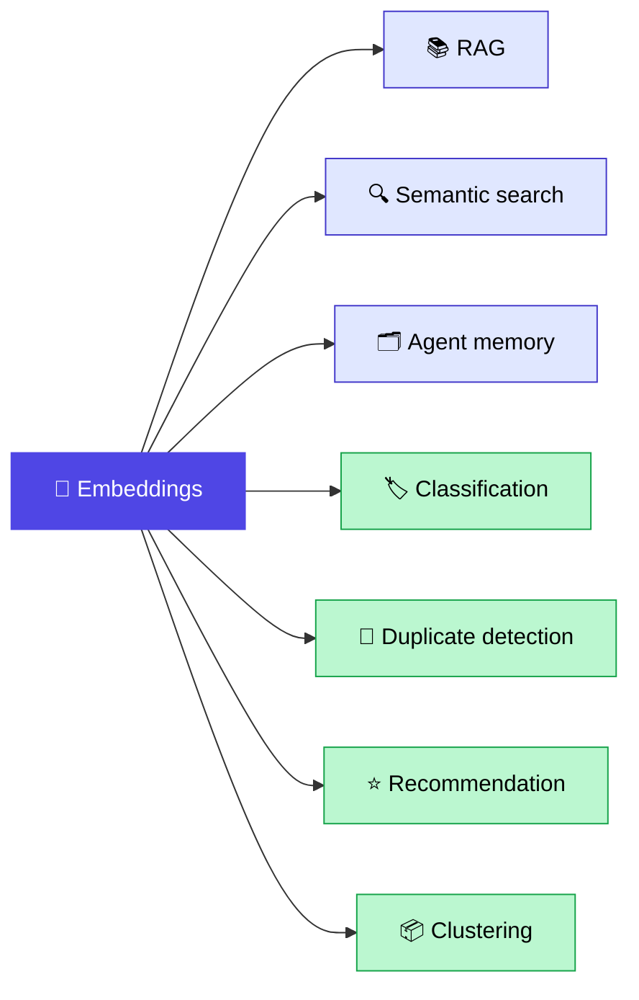

No embeddings, no ChatGPT answering questions about your documents. No semantic search that finds an article even when you type synonyms. No AI agent that remembers what you told it last week.

Embeddings are the foundational building block of all modern AI. And yet, in the vast majority of projects I work on, they're the least well understood component. Teams use them — often without really knowing why — and then wonder why results are disappointing.

In this article, I'll explain what embeddings actually are, how they work at a high level, why they matter so much, how to choose the right model in 2026, and the concrete pitfalls to avoid. Whether you're a manager or a developer, you should come away with a solid understanding of the topic.

<!-- more -->

***

## Table of Contents

1. [What is an embedding, really?](#what-is-an-embedding-really)
2. [Why do we turn text into numbers?](#why-do-we-turn-text-into-numbers)
3. [How the magic works, from a distance](#how-the-magic-works-from-a-distance)
4. [How to compare two embeddings](#how-to-compare-two-embeddings)
5. [Why embeddings are the foundation of modern AI](#why-embeddings-are-the-foundation-of-modern-ai)
6. [The major embedding models in 2026](#the-major-embedding-models-in-2026)
7. [Concrete pitfalls to avoid](#concrete-pitfalls-to-avoid)
8. [When to fine-tune an embedding model](#when-to-fine-tune-an-embedding-model)
9. [FAQ](#faq)
10. [Further reading](#further-reading)

***

## What is an embedding, really?

An embedding is a **numerical representation of the meaning** of a piece of text.

Concretely: you give a sentence to an embedding model, and it returns a vector. A vector is just a list of numbers. Depending on the model, that vector might contain 768, 1024, 1536, or 3072 numbers.

What makes embeddings powerful is that this vector doesn't capture the words themselves. It captures the **meaning**. Two sentences that talk about the same thing, even with completely different words, will produce vectors that are close together. Two sentences on unrelated topics will produce vectors that are far apart.

Here are three concrete examples:

- "How do I get a refund?" -> vector A
- "Customer refund procedure" -> vector B
- "What's the weather like in Toulouse?" -> vector C

Vectors A and B are **close**: same meaning, different words. Vector C is **far away**: unrelated topic.



And to illustrate the notion of proximity between vectors:



That's it. An embedding is a position in a mathematical space where nearby positions mean nearby meanings.

***

## Why do we turn text into numbers?

A computer doesn't understand words. It manipulates numbers — always. A text file, an image, a sound: everything is converted to numbers before being processed.

But there's an important subtlety. When you convert text to numbers the "old school" way, you get a representation that has no notion of meaning whatsoever. The word "refund" and the word "reimbursement" are just as far apart as "refund" and "airplane" if you use a simple word-to-numeric-ID mapping.

That's exactly the problem with **classic keyword search engines**. If you type "refund" and the document uses "reimbursement", the search fails. There's no exact match.

Embedding-based search, on the other hand, compares **vectors**: "refund" and "reimbursement" produce very similar vectors, so the search works even without the exact keyword. This is what's known as **semantic search** (or vector search).

| Search type | Principle | Finds "reimbursement" when searching "refund"? |
|---|---|---|
| Keyword (BM25) | Exact or approximate match | No |
| Semantic (embedding) | Vector comparison in meaning space | Yes |
| Hybrid | Both combined | Yes, and it's the best of both worlds |

Hybrid search combines BM25 and vector search to get the best of both approaches. I cover this in detail in my article on [hybrid RAG: BM25 + vector search](/en/blog/2026/04/01/rag-hybride-bm25-vectoriel/).

***

## How the magic works, from a distance

I'm not going to explain in detail how a neural network works internally — that's not the goal here. But here's what you need to know.

An embedding model (text-embedding-3-large, BGE-M3, Mistral Embed, etc.) is a **neural network trained on billions of texts**. During that training, it learned that certain words and phrases appear in similar contexts.

"Refund", "reimbursement", "product return": these words often appear together, in the same documents, around the same topics. The model therefore placed them close together in its representational space.

It doesn't store a synonym dictionary. It has internalized a **geometry of meaning**: a space of several hundred dimensions where each piece of text has a position, and where nearby positions correspond to nearby meanings.



When you give it a piece of text, it computes its **position in this meaning space**. That's your embedding. And this position is stable: the same text will always produce the same vector with the same model.

One important detail: embeddings aren't language-specific. A good multilingual model (like BGE-M3) places "remboursement" and "refund" very close together in the space, even though they're different languages. That's what makes multilingual semantic search possible.

***

## How to compare two embeddings

You have two vectors. How do you know if they're close or far apart?

The standard metric in the embeddings world is **cosine similarity**. The intuition: you measure the angle between two vectors in meaning space.

- Cosine = 1: the two vectors point in the same direction. Nearly identical meaning.
- Cosine = 0: the two vectors are perpendicular. Independent meanings.
- Cosine = -1: the two vectors point in opposite directions. Very rare in practice for text.

For search: the higher the cosine similarity between a question and a chunk, the more relevant that chunk is to surface.

There's also **Euclidean distance** (the straight-line distance between two points in space) and the **dot product**. Cosine similarity remains the standard because it's insensitive to the vector's "length": two texts on the same topic will have high cosine similarity even if one is a sentence and the other a paragraph.

Here's a minimal Python example to make this concrete:

```python
from openai import OpenAI
import numpy as np

client = OpenAI()

def embed(text):
    response = client.embeddings.create(
        model="text-embedding-3-large",
        input=text
    )
    return np.array(response.data[0].embedding)

def cosine_similarity(a, b):
    return np.dot(a, b) / (np.linalg.norm(a) * np.linalg.norm(b))

v1 = embed("How do I get a refund?")
v2 = embed("Customer refund procedure")
v3 = embed("What's the weather like in Toulouse?")

print(cosine_similarity(v1, v2))  # ~0.85 : very close
print(cosine_similarity(v1, v3))  # ~0.15 : very far apart
```

This code is intentionally simple. In production, you won't compare vectors one by one — you'll use a **vector database** (Qdrant, Weaviate, Pinecone, FAISS) that performs these comparisons efficiently across millions of vectors in milliseconds.

***

## Why embeddings are the foundation of modern AI

Embeddings aren't just for RAG. In reality, they sit at the root of a surprisingly large number of AI systems. Here are the main use cases.

**1. RAG (Retrieval-Augmented Generation)**

This is the most well-known use. You embed the documents, store the vectors in a database, and when a user asks a question, you embed the question and retrieve the semantically closest chunks. Those chunks are then sent to the LLM to generate the answer. Without embeddings, there's no RAG. I explain the full RAG pipeline in detail in [my article on what RAG is](/en/blog/2025/06/21/cest-quoi-le-rag-definition-fonctionnement/). One important nuance: cosine similarity ranks chunks by vector proximity, but that ranking isn't always the best signal for the final LLM context. A reranker re-scores the top-K candidates with a more expensive cross-encoder model, typically adding +10 to 20% faithfulness. I compared the main options (Cohere Rerank, BGE, Jina, Voyage) in [this reranker comparison](reranker-comparatif-cohere-bge-jina-voyage.md).

**2. Semantic search**

Internal search engines, assisted FAQs, knowledge base search. The user searches "how do I cancel my order", the system finds the article titled "returns and refund policy". No textual overlap, yet the right result.

**3. Long-term memory for AI agents**

An AI agent that needs to remember past conversations can't keep the entire history in its context. The solution: embed each interaction and store it. When a new conversation arrives, retrieve the relevant memories by similarity. This is the principle behind [long-term memory for AI agents](/en/blog/2026/05/19/memoire-agents-ia-long-terme/).

**4. Classification**

Compute the embedding of each email, support ticket, or customer feedback. Then apply a k-NN algorithm: texts close to an "urgent" example get classified as "urgent". No need to fine-tune an entire model to get solid classification.

**5. Duplicate detection**

Two product descriptions that describe the same item but worded differently? Two support tickets asking the same question? A cosine similarity comparison of their embeddings will tell you in milliseconds.

**6. Recommendations**

"Similar articles", "products you might like": if you have the embedding of each article or product, finding the most similar ones is trivial. It's a cosine similarity lookup in the vector database.

**7. Clustering**

Group documents, customers, or feedback by theme without having to define the themes upfront. Embed everything, run k-means or HDBSCAN in the vector space, and coherent groups emerge naturally.

**8. Anomaly detection**

A document whose embedding is very far from all others in your database is probably out-of-distribution: off-topic, badly formatted, or fraudulent. Embeddings let you detect this automatically.



***

## The major embedding models in 2026

The market has shifted a lot since 2024. Open source has caught up with — and in some cases surpassed — proprietary APIs on MTEB benchmarks. Here's an honest comparison of where things stand in 2026.

| Model | Provider | Dimensions | Multilingual | Cost | MTEB |
|---|---|---|---|---|---|
| **text-embedding-3-large** | OpenAI | 3072 (reducible) | Good | ~$0.13/M tokens | ~64.6 |
| **text-embedding-3-small** | OpenAI | 1536 | Good | ~$0.02/M tokens | Good |
| **BGE-M3** | BAAI (open source) | 1024 | Excellent (100+ languages) | Free (self-host) | 63.0 |
| **Qwen3-Embedding-8B** | Alibaba (open source) | Variable | Excellent | Free (self-host) | ~70.6 |
| **Mistral Embed** | Mistral | 1024 | Very good (fr, en, es...) | ~$0.10/M tokens | Good |
| **Cohere Embed v3** | Cohere | 1024 | Very good | ~$0.10/M tokens | Good |

A few important nuances:

**MTEB is a proxy, not the final word.** MTEB scores measure performance on generalist benchmarks. On your specific domain (medical jargon, legal terminology, technical documentation), results can be very different. Always test on your own data.

**Qwen3-Embedding-8B** is the open source surprise of 2025–2026. It surpasses text-embedding-3-large on MTEB while being free to self-host. The constraint: you need GPU infrastructure to serve it. With an A100 or H100, latencies remain perfectly acceptable in production.

**BGE-M3** remains my top choice for open source multilingual projects. A single model produces dense vectors, sparse vectors, and ColBERT scores, making it an ideal building block for [hybrid RAG](/en/blog/2026/04/01/rag-hybride-bm25-vectoriel/).

**My practical recommendations by context:**

- **Getting started fast on SaaS, medium volume project**: text-embedding-3-small. Unbeatable price-performance ratio, zero infrastructure to manage.
- **Volume > 10M embeddings/month or data sovereignty requirements**: Qwen3-Embedding-8B or BGE-M3 self-hosted.
- **Multilingual project with domain-specific jargon**: BGE-M3 (dense + sparse in a single model, 100+ languages).
- **Best-in-class for French specifically, without self-hosting**: Mistral Embed.

***

## Concrete pitfalls to avoid

These are mistakes I see on the majority of RAG projects in their early implementation phase.

**1. Using different models for documents and queries**

This is the fatal error. If you indexed your documents with BGE-M3 but embed queries with text-embedding-3-large, you're comparing apples and oranges. The vector spaces are different — distances mean nothing. Same model from end to end, no exceptions.

**2. Switching embedding models mid-project**

You indexed 500,000 documents with text-embedding-3-small, and now you want to move to Qwen3 because the benchmarks look better? You have to re-embed everything. All your stored vectors become unusable. Choose your model carefully upfront and plan for migration if you ever intend to switch.

**3. Thinking more dimensions = better performance**

3072 dimensions don't systematically beat 1024 dimensions. BGE-M3 at 1024 dimensions often outperforms text-embedding-3-large at 3072 on certain domains. What matters is model quality, not vector size.

**4. Embedding chunks that are too long**

Most models have a context limit (8192 tokens for OpenAI, same for BGE-M3). Beyond that, text is silently truncated — no error, no warning. You get a partial embedding. For chunks over 512 tokens, representation quality often starts to degrade.

**5. Embedding raw HTML**

`<div>`, `<span>`, `<p>` tags, CSS attributes, JavaScript snippets — all of this pollutes the embedding. Always clean text before embedding: extract plain text, remove unnecessary punctuation, normalize whitespace. Good pre-processing often makes more of a difference than switching models.

***

## When to fine-tune an embedding model

For 95% of projects, a generalist model (text-embedding-3-small, BGE-M3, Qwen3) is more than sufficient.

Fine-tuning becomes interesting in one specific scenario: **when your domain has a very specific vocabulary** that generalist models haven't seen in sufficient quantity during their training. Highly specialized medical jargon, proprietary industrial terminology, sector-specific legal codes.

The fine-tuning principle for embeddings is straightforward: you provide (question, good chunk) pairs and adjust the model so that the question and the right chunk end up close together in vector space. With `sentence-transformers` in Python, a few hundred well-chosen pairs and a few hours of GPU training, you can gain +15 to 30% Hit Rate on a specific domain.

The ROI depends on your situation: if your domain is specific enough and current performance is insufficient despite good chunking and architecture, fine-tuning is worth evaluating. Otherwise, focus first on [optimal chunking](/en/blog/2026/04/15/chunking-optimal-rag/) and [RAG optimization](/en/blog/2026/04/22/optimiser-rag-techniques/) — these are less costly levers to pull.

***

## FAQ

**What is an embedding?**

An embedding is a numerical representation of the meaning of a piece of text. You transform a sentence, paragraph, or document into a vector (a list of numbers). This vector captures the meaning of the text, not the words themselves. Two texts that discuss the same thing will have similar vectors, even if they use completely different words.

**What are embeddings used for in AI?**

Embeddings are used in virtually every modern AI system: RAG (to retrieve the right documents), semantic search (to find by meaning rather than exact keyword), AI agent memory, text classification, duplicate detection, recommendations, clustering, and anomaly detection.

**What's the difference between an embedding and a token?**

A token is an elementary unit of text that a model processes (roughly 3/4 of a word in English). An embedding is the vector representation of a complete piece of text (sentence, chunk, document). Tokens are the "atoms" the model reads. The embedding is the "meaning" it produces after reading those tokens.

**What's the best embedding model in 2026?**

It depends on your context. On the MTEB benchmark, Qwen3-Embedding-8B (open source, Alibaba) reaches ~70.6 and surpasses commercial models. For SaaS without infrastructure, text-embedding-3-small (OpenAI, $0.02/M tokens) offers an excellent price-performance ratio. For open source multilingual work, BGE-M3 remains a solid reference at 63.0 MTEB.

**OpenAI text-embedding-3 or Mistral Embed?**

For projects with European data sovereignty requirements or a preference for European models, Mistral Embed is an excellent option. For generalist projects without sovereignty constraints, text-embedding-3-small is more accessible and very well documented. Performance is comparable on standard English content.

**How do you compare two embeddings?**

The standard metric is cosine similarity. It measures the angle between two vectors in meaning space. The closer to 1, the more semantically similar the texts are. Euclidean distance and dot product also exist, but cosine similarity remains the standard because it's insensitive to the "length" of the vectors.

**How much does it cost to embed 1 million documents?**

With text-embedding-3-small (OpenAI), the initial indexing of 1 million chunks of ~500 tokens costs roughly $10 to $15. With text-embedding-3-large, multiply by 6 to 7. With self-hosted models (Qwen3, BGE-M3), the marginal cost per embedding is near zero — only infrastructure (GPU) costs matter.

**Should I fine-tune an embedding model for my industry?**

Rarely at the start. For 95% of projects, a generalist model is sufficient. Fine-tuning adds +15 to 30% Hit Rate on domains with highly specific jargon not well-represented in the training data. Start by optimizing your chunking and RAG architecture before considering fine-tuning.

**Embeddings and RAG: why are they so linked?**

RAG works by retrieving relevant documents before sending them to the LLM. That relevance search relies entirely on embedding comparison: embed the question, embed the documents, retrieve the closest ones. Without embeddings, RAG simply cannot function. They're inseparable.

**Can you do embeddings on images too?**

Yes. Multimodal models like CLIP or Gemini Embedding 2 produce embeddings for images, videos, and text in the same vector space. This enables text-to-image search ("find me photos of black cats") or finding similar images. It's the same logic, applied to different modalities.

***

## Further reading

- **[What is RAG, really?](/en/blog/2025/06/21/cest-quoi-le-rag-definition-fonctionnement/)**: the layer above embeddings: how they're used to build a Q&A system over your documents
- **[Hybrid RAG: BM25 + vector search](/en/blog/2026/04/01/rag-hybride-bm25-vectoriel/)**: combining embeddings and keywords for more robust retrieval on domain-specific jargon
- **[Optimal chunking for your RAG](/en/blog/2026/04/15/chunking-optimal-rag/)**: what exactly gets embedded, and why how you split documents changes everything
- **[Optimizing your RAG](/en/blog/2026/04/22/optimiser-rag-techniques/)**: post-embedding levers to improve end-to-end performance
- **[Reranker comparison: Cohere, BGE, Jina, Voyage](reranker-comparatif-cohere-bge-jina-voyage.md)**: how reranking re-scores the chunks your embedding model retrieved, and which model wins in practice
- **[AI agent memory](/en/blog/2026/05/19/memoire-agents-ia-long-terme/)**: how embeddings let an agent remember over the long term

***

If my articles interest you and you have questions, or just want to talk through your own challenges, feel free to reach out at [anas@tensoria.fr](mailto:anas@tensoria.fr) — I enjoy these conversations.

You can also [book a call](https://cal.eu/anas-rabhi/rendez-vous-ianas) or subscribe to my newsletter.


---

### About me

I'm **Anas Rabhi**, freelance AI Engineer & Data Scientist. I help companies design and ship AI solutions (RAG, agents, NLP). [Read more about my work and approach](/en/a-propos/), or browse the [full blog](/en/blog/).

Discover my services at [tensoria.fr](https://tensoria.fr) or try our AI agents solution at [heeya.fr](https://heeya.fr).

<div style="text-align: center; margin: 40px 0; gap: 16px; display: flex; flex-wrap: wrap; justify-content: center;">
  <a href="https://cal.eu/anas-rabhi/rendez-vous-ianas" target="_blank" style="display: inline-block; background-color: #4F46E5; color: #ffffff; font-weight: bold; padding: 16px 32px; text-decoration: none; border-radius: 8px; font-size: 18px; letter-spacing: 0.8px; box-shadow: 0 6px 12px rgba(0, 0, 0, 0.2); transition: all 0.3s ease; border: none;">
    Book a call
  </a>
  <a href="https://anas-ai.kit.com/d8b1a255cc" target="_blank" style="display: inline-block; background-color: #222222; color: #ffffff; font-weight: bold; padding: 16px 32px; text-decoration: none; border-radius: 8px; font-size: 18px; letter-spacing: 0.8px; box-shadow: 0 6px 12px rgba(0, 0, 0, 0.2); transition: all 0.3s ease; border: none;">
    <span style="margin-right: 10px;">✉️</span> Subscribe to my newsletter
  </a>
</div>
