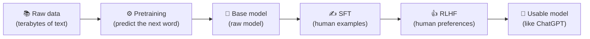
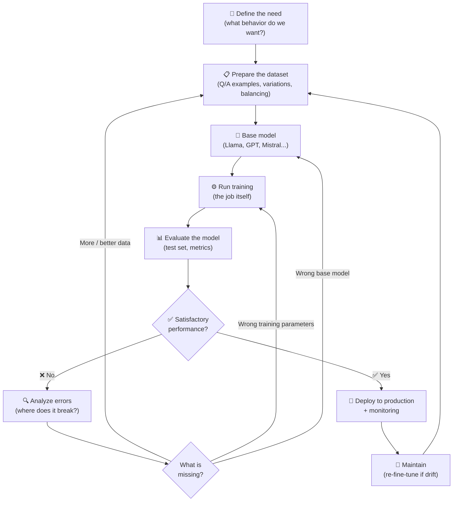
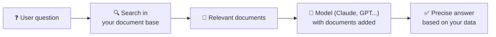
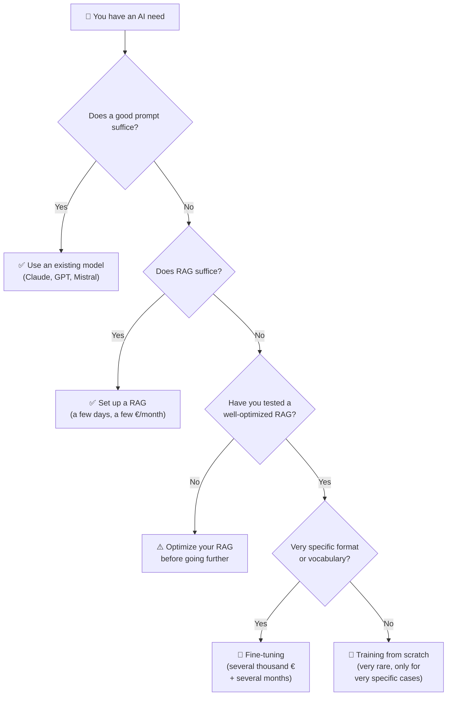

## Introduction

A question comes up frequently when I work with companies on their AI projects: *"Should we train our own model?"*. Or the slightly more advanced variant: *"We want to fine-tune a model on our data"*.

Every time, I need to take a moment to explain what that actually means in practice. Because between training a model from scratch, fine-tuning it on your own data, or simply giving it context with a [RAG](mais-que-es-le-rag.md), there is a world of difference. In cost, time, complexity, and above all in outcome.

In this article, I will try to lay things out simply. What is an AI model, how do you train it, what does it cost, when is it worth it, and most importantly why in 95% of cases you probably do not need to do either.

<!-- more -->

---

## First: what is an AI model?

Before talking about training, you need to understand what you are training.

An AI model is essentially a large package of numbers called **parameters**, connected by mathematical operations. I cover this in more detail in my article on [generative AI](/blog/2025/05/15/comprendre-ia-generative/), but to keep it simple: imagine an enormous mixing board with billions of knobs. Each knob is a parameter. Taken alone, a single knob means nothing. But when all the knobs are set correctly, the whole thing is capable of generating coherent text, recognizing a cat in a photo, or translating a sentence.

Training a model means turning those knobs in the right direction based on examples. The more examples you have and the more compute power you have, the more finely you can adjust the knobs.

And that is an important point: **the more parameters (knobs) a model has, the more capacity it has to learn subtle things and deliver good results**. A model with 1 billion parameters will never retain as many nuances as a model with 100 billion. That is why larger models are often more capable. But this capacity has a price: **the more knobs there are, the longer training takes, the more it costs, and the more complex it is to implement** (more data, more GPUs, more memory). This is the constant trade-off in the field: always searching for the right balance between model size, data quality, and cost.

> To give you a sense of scale: GPT-3 has 175 billion parameters. Llama 3 70B has 70 billion. Recent models like GPT-4 or Claude are in the hundreds of billions (exact figures are not public). Each parameter is a small number stored in memory. Chinese models like Qwen 3 are around 27 billion (depending on the version). Today we achieve better results with a 27-billion-parameter model than with the 175-billion-parameter GPT-3 from back then, thanks to scientific progress and accumulated knowledge.

---

## What types of models can you train?

There is not just one type of AI model. Before talking architecture, there is one thing to understand: **you always choose a model based on the format of the data you give it as input and the format of output you expect from it**. This input/output pair determines which model family to use. Text in and text out? That is typically an LLM. An image in and a label out? More of a CNN. A table of numbers in and a prediction out? More of a tabular model. A bit like construction: you do not build a house the same way you build a warehouse — you choose based on use.

Here are the main families you encounter most often.

| Model type | What it is for | Examples |
|---|---|---|
| **LLM** | Generating or understanding text | GPT (ChatGPT), Claude (Anthropic), Llama (Meta), Mistral, Gemini (Google) |
| **Diffusion models** | Generating images, videos | Midjourney, Stable Diffusion, Sora (OpenAI), Veo (Google) |
| **CNN (convolutional networks)** | Recognizing objects in images | YOLO (used in security, autonomous vehicles), medical imaging models (X-ray, MRI) |
| **Audio models** | Transcribing or generating sound | Whisper (OpenAI, transcription), ElevenLabs (synthetic voice), Suno (music generation) |
| **Tabular models (XGBoost, etc.)** | Predicting from numerical data | Credit scoring (used by banks), sales forecasting (Carrefour, Amazon), fraud detection (Stripe) |

An important clarification on **Transformers**: you often hear Transformers described as if they were a model type reserved for text. That is wrong. The Transformer is a **mathematical architecture**, not a usage category. This architecture was invented in 2017 for text, but today it is used everywhere: in image models (Vision Transformers or ViT), in video generation, in audio (that is how Claude or GPT now understand formats beyond text), and even in some prediction models for scientific data. When you hear "Transformer", think "ultra-versatile technical building block" rather than "text model".

In fact, **you could technically build an LLM with an architecture other than the Transformer**. Before 2017, LSTMs and RNNs were used for language. Today, researchers are exploring other paths (Mamba, RWKV, state-space models). But in practice, virtually all modern LLMs (GPT, Claude, Llama, Mistral, Gemini) are built on Transformers. Why? Because it is the architecture that has worked best over recent years, and all the research, hardware optimization, tools, and libraries have converged around it. It is a virtuous circle: it works well, so people dig deeper, so it works even better. Switching architectures today would mean starting nearly from scratch on the entire ecosystem, and nobody has a real incentive to do that as long as Transformers keep improving.

Each family has its own training specifics. But the principle remains the same: you have an empty model, you feed it lots of data, and you adjust its parameters until it correctly performs the task you expect of it.

If you want to dive into the different domains of AI and understand which type of model to use for which use case (with concrete business examples), I wrote a dedicated article: [the different domains of AI and why ChatGPT is only a small part of it](/blog/2026/05/02/les-differents-domaines-de-l-intelligence-artificielle/).

---

## Before going further: there are several types of training

Before diving into the details, there is a point that often confuses people. When people talk about "training" a model, it can mean several very different things. And it is important to distinguish them because they have different goals, different costs, and different levels of complexity.

Here are the three main forms of training you will encounter in this article:

* **Training "from scratch"**: you start from a completely empty model (parameters are random numbers) and teach it everything, from the beginning. This is what OpenAI, Anthropic, and Meta do when they create a new model. It is the longest and most expensive approach.
* **Pretraining**: this is the **first phase** of training from scratch. You feed the model enormous quantities of general data so it learns the basics (how words chain together, how language works, logic, etc.).
* **Post-training**: this is the **second phase**. Once the model is pretrained, you specialize it to become genuinely useful (following instructions, conversing, being helpful and safe). This phase includes SFT and RLHF, which I cover just below.
* **Fine-tuning**: this is something else entirely. You start from a model already trained by someone else (for example Llama or GPT) and adjust it slightly on your own data. It is much faster and much cheaper. I come back to this later in the article — it is probably the term that matters most to you in practice.

To summarize in one sentence: training "from scratch" encompasses pretraining and post-training. Fine-tuning is a touch-up of an already-existing model.

Now that we have established this vocabulary, we can get into the details.

---

## How does training "from scratch" actually work?

Training a model "from scratch" means starting from an empty model (parameters are random numbers) and teaching it everything, from zero.

For modern LLMs, this breaks down into two main stages: **pretraining** and **post-training**. For other model types (image, audio, tabular), the pipeline is different, but the idea remains the same: start by learning general things, then specialize.

### 1. Pretraining

This is the best-known stage, and by far the most expensive.

For an LLM, you take terabytes of text from the web, books, code, and scientific articles. You give all of this to the model and ask it, essentially, to **predict the next word** in billions of sentences. With each error, the model adjusts its parameters to do a little better next time.

This process is repeated trillions of times (yes, trillions, not billions), over weeks or even months, on thousands of high-end GPU cards.

At the end, you get a model called "raw" or "base". It knows a little about everything, but it does not really know how to hold a conversation or follow instructions. It just completes text statistically.

**A concrete example**: Llama 3 70B *base* (the raw version published by Meta before post-training) is a raw model. If you write "How do you make a chocolate cake?", it will not give you a recipe like ChatGPT. It will more likely continue the text with something like "How do you make a lemon tart? How do you make cookies? How do you make..." because it is imitating what it saw on the web (often FAQ-style question lists). It has enormous knowledge inside it, but it does not know how to use it to answer you. Same for GPT-3 at its release in 2020: very impressive for completing text, but almost unusable for someone who just wants to ask a question. That is a base model. For recent models, publishers have decided not to release the raw version but to give the public access only to the final version.

### 2. Post-training

This is what transforms a raw model into a usable assistant like ChatGPT.

First thing to understand: **you do not start from scratch**. You take the raw model exactly as it is (with all its parameters already adjusted during pretraining) and **continue** training it, but on much more targeted data with a different objective. Concretely, these are the **same knobs** we talked about at the start, except you are adjusting them slightly to make the model behave differently.

To return to the mixing board analogy: during pretraining, you turned billions of knobs all the way to have the model learn everything about language. During post-training, you touch the same knobs but with much more precision, just to adjust its behavior (be polite, follow instructions, refuse certain requests). You do not break what was learned before — you orient it.

This phase costs much less than pretraining (often 1 to 10% of total cost) because it uses far less data and runs for far less time. But it is what makes all the difference between an unusable model and an assistant you want to use every day.

There are generally two phases in post-training.

**Supervised fine-tuning (SFT)**: you take humans, have them write high-quality question/answer pairs (typically a few tens to a few hundreds of thousands of examples), and continue training the model on them. The mechanism is exactly the same as pretraining (the model compares its answer to the correct answer and adjusts its parameters to do better), except the data is clean and targeted. The goal is to teach it to respond correctly to an instruction rather than just completing text.

**RLHF (Reinforcement Learning from Human Feedback)**: you ask humans to compare multiple responses from the model and choose the best one. These preferences are then used to adjust the model's parameters further (the same knobs), but this time to push it toward responses judged "good" and away from those judged "bad". This is what teaches the model to be helpful, honest, and to refuse what it should not do.

**A concrete example**: Llama 3 70B *Instruct* (the final version, after post-training) is exactly the same model as the "base", except it has gone through SFT and RLHF. Now, if you ask "How do you make a chocolate cake?", it gives you a structured, clear, polite recipe directly. It also refuses to answer problematic requests (RLHF taught it to say no on certain topics). The transition from raw GPT-3 to ChatGPT in 2022 is exactly that: OpenAI did not create a new model, they just post-trained GPT-3.5 with SFT and RLHF. And that is what triggered all the AI hype we know today. The model already knew everything. Post-training just taught it to talk with us.

Here are the main stages as a diagram:

For image models like Stable Diffusion, it is different: you train on image/text pairs to learn how to associate a description with an image, then generate the reverse. For a bank scoring model, you train on labeled customer histories (meaning the data is already annotated with each customer's credit score). The general principle remains the same, but the data and objectives change, so naturally the type of model to use changes accordingly.

---

## What does it really cost?

And this is where it stings.

The cost of training "from scratch" depends on the model size, the amount of data, and the efficiency of the team handling it. Here are the most reliable public or estimated figures for recent models (based on publications, official announcements, or serious analyses):

| Model | Training cost (compute only) | Details |
|---|---|---|
| **GPT-3** (OpenAI, 2020) | Approximately **$4.6 million** (Lambda Labs estimate) | 175 billion parameters, thousands of V100 GPUs |
| **GPT-4** (OpenAI, 2023) | **Over $100 million** (confirmed by Sam Altman) | Several months of compute |
| **Gemini Ultra** (Google, 2023) | Approximately **$200 million** (Stanford study) | The most expensive publicly documented |
| **Llama 3 70B** (Meta, 2024) | Approximately **$15 million** (7.7M H100 GPU-hours at ~$2/h) | Excluding R&D |
| **Llama 3.1 405B** (Meta, 2024) | Approximately **$60 million** (30.8M H100 GPU-hours) | Meta's largest open-source model |
| **Claude 3.7 Sonnet** (Anthropic, 2025) | "**A few tens of millions**" (Anthropic) | Much less than GPT-4 thanks to progress |
| **DeepSeek V3** (2024) | Approximately **$5.6 million** (2.788M H800 GPU-hours) | 671 billion parameters (MoE), feat of frugality |
| **DeepSeek R1** (2025) | **$294,000** (reasoning phase only) | To add to the ~$6M base of V3 |
| **Qwen 3** (Alibaba, 2025) | Not disclosed | Qwen3-Next reportedly cost **less than 10%** of the equivalent dense version |
| **Small specialized model** (1 to 7 billion params) | Between **$50,000 and $500,000** | A few days to a few weeks |

A few important observations from this table:

* **Costs do not rise mechanically over time**. Claude 3.7 Sonnet (2025) costs much less to train than GPT-4 (2023), because training techniques, hardware optimization, and architectures have improved enormously in two years. Doing more with less has become the norm.
* **DeepSeek showed that you can build a frontier-level model for approximately $6 million** (V3 plus R1), versus hundreds of millions at OpenAI or Google. The debate remains heated about hidden costs (they do not count failed attempts or R&D), but it was still a shock to the industry in 2025.
* **The more you know how to do it, the cheaper it gets**. Accumulated R&D benefits everyone, and new entrants (Chinese players in particular, like DeepSeek or Qwen) are benefiting enormously from this.

And above all, **these figures only count compute**. You also need to add:

* **Researcher salaries** (a team of 10 to 100 people for months).
* The cost of **data collection and cleaning** (often underestimated, sometimes several million on its own).
* The cost of **human annotations** for SFT and RLHF (hundreds of thousands of annotated pairs).
* **Failed experiments**: you do not ship a GPT-4 or a Claude on the first try. There are often ten aborted attempts before you get a model that works.
* **Hardware purchase or rental** (Meta's clusters for Llama 3 alone are worth hundreds of millions of dollars in infrastructure).

And that is exactly the point I want to make: **AI is R&D**. You can have intuitions, follow best practices, but you are never 100% sure that training will deliver the expected result. That is also why not all LLMs are equal. Google spent approximately $200 million on Gemini Ultra and finds itself often behind Claude or GPT today, while Anthropic released Claude 3.7 Sonnet for a few tens of millions. DeepSeek, with a $6 million budget, managed to match $100-million models. Why? Because this is a domain where expertise, architecture choices, data quality, and post-training quality make an enormous difference. And nobody has the magic recipe.

---

## What you must do BEFORE training a model

Even before launching the first calculation, there is a mountain of invisible work:

1. **Data collection**: find, buy, or crawl massive, clean, and representative data.
2. **Cleaning**: remove duplicates, toxic content, and malformatted data. At billions of documents, this is non-trivial.
3. **Filtering and deduplication**: if your data contains the same Wikipedia article ten times, the model will overlearn it.
4. **Tokenization**: transform text into small pieces the model can digest.
5. **Architecture choice**: how many layers, how many parameters, what context size.
6. **Infrastructure setup**: rent or buy thousands of GPUs, manage distributed compute, handle failures.
7. **Evaluation**: this is the **most important** step, and yet often the most neglected. Concretely, it means building a large test set (thousands of questions with expected answers, practical cases, trap scenarios) to continuously verify whether the model is genuinely improving and whether it will be usable once in production. This is what allows you to answer the only question that matters: "is this model truly ready for the real world?". Without this rigorous measurement, you can very easily release a model that looks good on a few examples but falls apart the moment a real user tries it. This is exactly what happened to Meta with their recent **Llama 4** models: they published models that appeared performant on public leaderboards, but proved clearly below Claude, GPT-4, or DeepSeek in real life. Several analyses point to insufficient internal evaluation, probably biased (models too adjusted to the leaderboards themselves rather than real use cases). Result: despite hundreds of millions invested and a huge team, their models were not adopted by the community, and Meta found itself falling behind competitors. That perfectly illustrates how critical this step is: you can have all the resources in the world, but if your evaluation is done poorly, you ship a model that serves nobody.

In short, this is at minimum a 6 to 18-month project for an ambitious model, with a dedicated team.

---

## So... why don't we do this?

You get it: it is expensive, it is slow, it is risky, and it is complex.

For 99.9% of companies, training an LLM from scratch makes no sense at this point in time. The only actors doing it are OpenAI, Anthropic, Google, Meta, Mistral, and a few research labs. Everyone else uses their models via an API or in open source.

The good news is that a much more accessible alternative exists: **fine-tuning**.

---

## Fine-tuning: training an already-trained model

Fine-tuning means starting from an already-pretrained model (for example Llama 3, Mistral, or GPT-4 via their restricted fine-tuning platform) and adjusting it on **your** specific data. It is like taking an employee who already knows how to speak, read, and write, and teaching them only the vocabulary of your industry.

Concretely, you take the existing model, show it a few thousand (sometimes a few hundred) question/answer examples specific to your domain, and slightly adjust its parameters so it becomes better at these specific tasks.

On the **pure compute cost** side, it is incomparable to full training:

| Fine-tuning type | Infrastructure cost | Training duration |
|---|---|---|
| Fine-tuning a small open-source model (7B params) | Between **$50 and $500** | A few hours |
| Fine-tuning a medium model (13B to 70B) | Between **$500 and $5,000** | A few hours to a few days |
| Fine-tuning via OpenAI API (GPT-4o mini) | A few **tens to hundreds of dollars** | A few hours |

On raw compute, it is one thousand to ten thousand times cheaper than full training. **But be careful: these figures only reflect a small part of the real cost of a fine-tuning project.** In practice, what actually costs the most is not running the fine-tuning — it is everything around it.

Here is what is NOT in the table above and what often weighs **much more heavily**:

* **Building the dataset**: you typically need between a few hundred and several thousand high-quality question/answer pairs, perfectly representative of your use case. This is the longest, most painful, and most decisive step. Easily **several weeks of work** for a domain team (writing the examples, validating answers, handling edge cases). And above all, **you need many variations of the same thing** for the model to truly capture the pattern. If you want to teach it to rewrite a sales email in your style, 50 examples are not enough: you need **50 variants of the same type of email** (with different lengths, different tones, different contexts), 50 of another type, 50 of a third, and so on. Without this diversity, the model learns by rote instead of understanding the logic. And if your case is **rare or completely absent from the base model** (ultra-specific domain vocabulary, a niche domain nobody has ever published about on the web), you will need **far more data**, sometimes ten times more, to compensate for the model starting from zero on that topic.
* **Domain expert time**: a legal, medical, or technical fine-tuning requires experts who write, review, and correct examples. At $500 to $1,500 per expert day, the hidden cost adds up fast.
* **Iterations**: you never succeed on the first fine-tuning attempt. It typically takes **5 to 10 iterations** (adding examples, cleaning, balancing categories, adjusting training parameters) before getting a satisfactory model.
* **Evaluation**: you also need to build a reliable test set to verify whether the fine-tuning actually improves things, and maintain it over time.
* **The risk of failure**: this is the most important point. Like any AI project, this is R&D. You can invest 3 months and $20,000 in a fine-tuning and end up with a model that performs **worse** than the base model with a good prompt. This is not hypothetical — I have seen it several times in the field. And in that case, you recover neither the money nor the time.
* **Maintenance cost**: a model fine-tuned on today's data becomes outdated when your data evolves. You will need to re-fine-tune regularly, which means rebuilding and maintaining the dataset over time.

So when you look at the **realistic total cost** of a serious fine-tuning project in a business context, you are looking at **$10,000 to $80,000** overall (people + data + iterations + evaluation), and several months of project. Very far from the "$500 in a few hours" the raw compute table might suggest.

And on performance, let us be honest: **a well-done fine-tuning typically delivers between 5% and 20% gain** compared to the same model used with a good prompt and RAG. On truly specific cases (precise writing style, sharp domain classification, strict output format), you can reach 25 or even 30% gain. But in the vast majority of professional cases I see, the real gain is closer to **5 to 10%**. Which raises the real question: does this 10% gain justify the $30,000 and 3 months invested? Often the answer is no. Sometimes the answer is yes. That is exactly why you need to measure **before** jumping in.

And there is one last argument that (rightly) discourages many companies from going ahead with fine-tuning: **we have not yet hit the performance plateau of LLMs**. Models continue to progress at an impressive pace every six months. So the very concrete risk is spending **3 months and $30,000 fine-tuning to gain 10% on your case**, only to see the next version of Claude, GPT, or Gemini come out in the meantime and give you the same result (or better) **for free, just with a good prompt**. I have seen several fine-tuning projects become completely useless overnight because of a new release. As long as the base model progression curve keeps rising this fast, **investing heavily in fine-tuning often means betting against the tide**.

That is why I often say: **before fine-tuning, ask yourself twice**. Does a good prompt suffice? Does a well-built RAG suffice? If you have not seriously tested both options with a clean evaluation set, you are not ready to fine-tune.

Here is what a fine-tuning project really looks like (and it is exactly the same diagram for training from scratch, just scaled up by a factor of one hundred or one thousand):

The key point to remember: **it is never linear**. It is a loop. Each evaluation can send you back to "prepare the data" (often), to "adjust training parameters" (sometimes), or to "change the base model" (rarely, but it happens). And even once in production, you are not done: you need to monitor and re-fine-tune when data or needs evolve. It is exactly the same logic as training from scratch, just with amounts and durations multiplied by a hundred or a thousand.

---

## When do you TRULY have no choice?

There are a few rare situations where training a model from scratch is justified:

* You are working on a **very specific data type** that public models have never seen (for example DNA sequences, raw radio signals, highly specialized medical images).
* You have **extreme regulatory constraints** that prohibit you from using an external model (certain defense or healthcare contexts).
* You are a **research lab** and want to explore a new architecture.
* You have the **financial and human resources** of a company like Mistral or Anthropic.

If you do not fit any of these cases, you do not need to train a model. And even when you think you do, ask yourself twice.

---

## The alternative that works in 90% of cases: RAG

Before fine-tuning, there is almost always a much simpler, much less risky, and much cheaper approach: **giving your documents directly to the model at the moment it responds**. This is what we call [retrieval-augmented generation](mais-que-es-le-rag.md).

The idea is very simple. Rather than trying to modify the model (its parameters) so it "learns" your data (which is what fine-tuning does), you **keep the model as is**, and you slip the right documents into the conversation when it needs them. Concretely, you put all your documents (procedures, contracts, product sheets, manuals) in a database. When a user asks a question, your system automatically searches for the most relevant chunks in this database and passes them to the model, which uses them to write its response.

The model stays the same, untouched. You have not trained anything. And yet it responds as if it knew your industry inside out.

And that is the whole difference from fine-tuning. **With RAG, you do not have to go through all the long, heavy, and risky steps of fine-tuning**:

* **No need to build a training dataset**: you do not have to write thousands of clean question/answer pairs with variations, balancing, and edge cases. You take your existing documents as they are, put them in a database, and you are ready.
* **No need to wait hours or days of compute** on expensive GPUs. You set up your RAG in a few days, and each adjustment shows up within minutes.
* **No need to mobilize a team of domain experts for weeks** to annotate examples. Your documents are already there, already written by your teams over time.
* **No need to hire highly specialized technical profiles** (data scientists specialized in model training, ML engineers). A standard development team can build a RAG.
* **No heavy, lengthy evaluation phase** before going to production: you see very quickly whether the answer is good, and if it is not, you adjust the database or the retrieval, not the model.
* **No risk of all your work becoming worthless** at the next model release. On the contrary, the day Claude 5 or GPT-6 comes out, you simply swap the model in your RAG and immediately benefit from the progress, without having to redo anything.

In short, it is the opposite of fine-tuning on almost every dimension: **fast, low-cost, low-risk, easy to maintain, and compatible with the natural evolution of models**.

Additional advantages:

* **Real-time updates**: if a document changes, you replace it in the database, that is it. No need to start over.
* **Cost starting at a few dozen dollars per month** for reasonable volumes.
* **Traceability**: the model can cite its sources — you know where the information comes from.
* **No risk of capability loss** as with fine-tuning (a fine-tuned model can lose general capabilities by specializing).
* **Fast iterations**: you test, you adjust, you see the result the same day.

The only real drawback is that it requires building a solid document retrieval system. I cover this in detail in my articles on [optimal document chunking](chunking-optimal-rag.md) and [techniques to improve a RAG](optimiser-rag-techniques.md).

---

## So, do you really need fine-tuning?

This is THE question to ask **before** diving in. And in 90% of the cases I see in business, the honest answer is: no, not really. RAG would be enough.

Fine-tuning only becomes a good idea in specific cases:

* You need a **very strict output format** that the base model cannot respect, even with a very well-written prompt and RAG in place. For example an ultra-rigid output format for a downstream system with no flexibility whatsoever.
* You work with **ultra-specific domain vocabulary** that public models do not master at all (very narrow case law, specialized medical terminology, niche industry jargon).
* You want to **drive down usage costs** by replacing a large generalist model with a small fine-tuned model, which costs much less to run but stays just as good on your specific case.
* You want to teach the model a **very particular behavior** (a precise writing style, a specific way of classifying documents, a strongly defined brand tone).

Outside these cases, fine-tuning is almost always a bad investment. Why do so many people still talk about it? Because it sounds serious, because it gives the impression of "really doing AI", and because many vendors sell it as a magic solution. The reality is that **giving the right documents to the model at the right moment** (RAG) solves the vast majority of needs, without all the downsides of fine-tuning (cost, time, risk, maintenance, obsolescence at the next release).

---

## The golden rule: train and fine-tune only as a last resort

If I had to summarize in one sentence:

> **Before thinking about fine-tuning or training, always try giving the right information to the model at the moment it responds.**

Concretely, here is the order in which I recommend thinking through an AI project:

Why this order?

1. **A good prompt** already solves approximately 70% of cases. Before touching anything, refine your instructions and test several models.
2. **RAG** solves the next 25%. As soon as you need the model to rely on specific knowledge (your procedures, your contracts, your product catalog), this is the right answer.
3. **Fine-tuning** only becomes relevant for the remaining 4%, when you genuinely have a need for very specific behavior that neither a prompt nor documents in context can cover.
4. **Training from scratch** is the remaining 0.1%. And if you are in that case, you already know it.

---

## Why this discipline matters

I remind my clients of this often: **AI is R&D**.

When you train or fine-tune a model, you are making a bet. You invest money and time with no guarantee of results. Sometimes it works, sometimes it does not. Nobody can guarantee in advance that a fine-tuning will genuinely improve performance on your case. That is exactly why public LLMs do not all have the same level: Anthropic, OpenAI, Google, and Meta use broadly the same technical building blocks, they have comparable data and resources, and yet results vary enormously. Because at every stage of training there are hundreds of small choices, and each one can swing the final quality.

At your scale, it is exactly the same. You can invest $10,000 in a fine-tuning and end up with a model worse than the base model used with a good prompt. This is not a theoretical case — I have seen it several times in the field.

That is why before you start, you must **measure**. Build a small test set, measure the performance of the simplest solution (a good prompt alone), then test the next layer (RAG), and see whether there is truly a gap that justifies going further. I cover the evaluation methodology in detail in [how to evaluate a RAG in production](evaluer-rag-production-metriques-ragas.md).

---

## Summary

Here is the recap table to keep in mind:

| Approach | Cost | Time | When to use it |
|---|---|---|---|
| **Good prompt** | Near zero | A few hours | Always start here |
| **RAG** | A few tens to hundreds of €/month | A few days to weeks | Need for specific knowledge (your documents, your procedures) |
| **Fine-tuning** | $10,000 to $80,000 realistic total cost | Several weeks to several months | Very specific format or vocabulary that RAG does not cover |
| **Training from scratch** | Several hundreds of thousands to several millions of € | Several months | Extremely rare cases (research, truly unique data) |

The best AI strategy is almost never the most complex one. Start with the simplest, measure carefully, and move up in complexity only if necessary.

And keep in mind that all of this remains R&D. Even the biggest labs in the world get it wrong. So if you go step by step and measure, you will avoid burning an important budget on an approach that will not work.

---

## The pragmatic choice: always start with RAG

If you could take away only one thing from this article, it is this: **always start with RAG**.

Why? Because it is simply the most rational choice from an economic and technical standpoint:

* **The initial investment is minimal** compared to fine-tuning or training (a few days of setup, a few dozen dollars per month).
* **You see very quickly whether it is enough for your case**. If yes, you have solved your problem with a fraction of the budget. If no, you have still learned an enormous amount (about your data, about real user needs, about the true limits of the base model) that will serve you directly for the next steps.
* **If you ever need to switch to fine-tuning afterwards**, the RAG you built will not be wasted. On the contrary, it will serve as a foundation. The test sets, the examples surfaced by users, the structuring of your data — all of this is directly reusable to prepare a smart fine-tuning.
* **And the initial cost of the RAG will be completely absorbed by the rest of the project**. A few thousand dollars on a RAG that proves insufficient, then $30,000 on a fine-tuning, is still far more cost-effective than having spent $30,000 directly on a fine-tuning that turns out to be poorly calibrated because you did not take the time to understand the need.

It is a bit like building a house: you do not order custom decoration before verifying that the walls hold. You first test with what is fastest to set up, measure what works and what does not, and **only if you have identified a precise and reproducible gap** do you invest in the next layer.

In the worst case, if you end up fine-tuning anyway, you will have done it with a much better understanding of the problem and therefore with a far higher chance of success. In the best case, you save tens of thousands of dollars and several months of project time. Honestly, I see no rational reason not to start there.

---

## Further reading

* **[What is RAG?](mais-que-es-le-rag.md)** — understand the most effective alternative to fine-tuning, including how the pipeline works end-to-end
* **[Optimizing your RAG](optimiser-rag-techniques.md)** — before fine-tuning, try these 8 levers: the gains are often larger and cheaper to obtain
* **[How to evaluate a RAG in production](evaluer-rag-production-metriques-ragas.md)** — how to measure performance rigorously before deciding whether fine-tuning is justified
* **[Optimal RAG chunking](chunking-optimal-rag.md)** — a poorly chunked RAG often mimics the symptoms that teams wrongly attribute to model quality
* **[Agentic RAG vs classic RAG](agentic-rag-vs-rag-classique.md)** — the architecture step that often comes after RAG when classic retrieval hits its limits
* **[What is an AI agent?](c-est-quoi-un-agent-ia.md)** — the step that often follows once your RAG is solid

---

If my articles interest you and you have questions or simply want to discuss your own challenges, feel free to write to me at [anas@tensoria.fr](mailto:anas@tensoria.fr) — I enjoy exchanging on these topics!

You can also [book a call](https://cal.eu/anas-rabhi/rendez-vous-ianas) or subscribe to my newsletter :)

---

### About me

I'm **Anas Rabhi**, freelance AI Engineer & Data Scientist. I help companies design and deploy AI solutions (RAG, agents, NLP). [Read more about my work and approach](/en/a-propos/), or browse the [full blog](/en/blog/).

Discover my services at [tensoria.fr](https://tensoria.fr) or try our AI agents solution at [heeya.fr](https://heeya.fr).

  <a href="https://cal.eu/anas-rabhi/rendez-vous-ianas" target="_blank" style="display: inline-block; background-color: #4F46E5; color: #ffffff; font-weight: bold; padding: 16px 32px; text-decoration: none; border-radius: 8px; font-size: 18px; letter-spacing: 0.8px; box-shadow: 0 6px 12px rgba(0, 0, 0, 0.2); transition: all 0.3s ease; border: none;">
    Book a call
  </a>
  <a href="https://anas-ai.kit.com/d8b1a255cc" target="_blank" style="display: inline-block; background-color: #222222; color: #ffffff; font-weight: bold; padding: 16px 32px; text-decoration: none; border-radius: 8px; font-size: 18px; letter-spacing: 0.8px; box-shadow: 0 6px 12px rgba(0, 0, 0, 0.2); transition: all 0.3s ease; border: none;">
    ✉️ Subscribe to my newsletter
  </a>

## FAQ: Training, fine-tuning, and RAG

**1. What is the difference between training a model and fine-tuning it?**
Training a model "from scratch" means starting from an empty model and teaching it everything from zero. It requires terabytes of data, thousands of GPUs, and costs several million dollars. Fine-tuning means starting from an already-trained model (like Llama or GPT) and adjusting it on your specific data. It is one thousand to ten thousand times cheaper.

**2. What does it really cost to train an LLM?**
To give orders of magnitude: GPT-3 cost approximately $4 million to train, GPT-4 over $100 million, Llama 3 70B approximately $15 million. And these figures only count compute power, not researcher salaries or failed experiments.

**3. When should you fine-tune instead of using RAG?**
Fine-tuning is only relevant when you need a very precise output format, ultra-specific domain vocabulary not covered by public models, or when you want to use a small fine-tuned model to reduce inference costs. In 90% of professional cases, a well-built RAG delivers better results at a much lower cost.

**4. Why don't all LLMs perform the same if they use the same techniques?**
Because AI is R&D. At every stage (architecture, data, post-training), there are hundreds of technical choices that can swing performance. That is why Claude, GPT, and Gemini, which have comparable resources, do not achieve the same results. Nobody has the magic recipe.

**5. Will RAG eventually replace fine-tuning?**
For the majority of enterprise use cases, yes. With the expansion of model context windows and improvements in retrieval techniques, RAG covers more and more needs without requiring any training. Fine-tuning retains real utility for specific cases, but it is rarely the first option to try.
