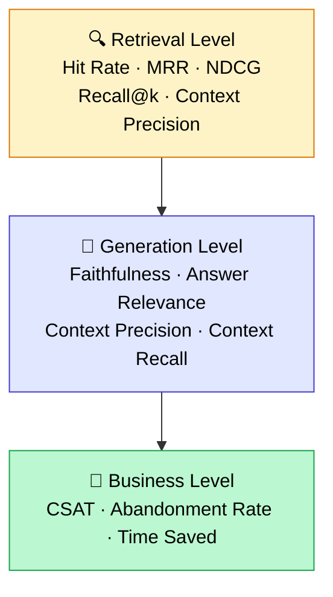
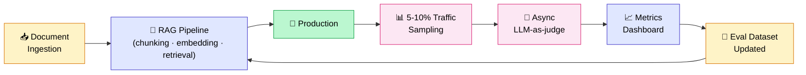

## 80% of the RAGs I audit have no evaluation system

That's a number I wish I could back with an academic citation. But it comes straight from the field: of the production RAG systems I've audited over the past two years, roughly 8 out of 10 have no structured evaluation system in place.

The pattern is always the same. The project gets shipped. The team "checked it manually" on 10 or 15 questions during QA. User feedback seems fine. And then nobody measures anything again.

The hidden cost of this gap is enormous. You don't know if the RAG is drifting after a document update. You don't know if a change in your embedding model broke something. You don't know whether the improvements you're making are actually gains, or just compensating for a regression somewhere else. You're optimizing blind.

This is the single biggest thing that separates a RAG proof-of-concept from a mature production system. A POC "works". A production system gets measured, monitored, and improved in a controlled way. This article covers the RAG metrics that actually matter, evaluation frameworks (RAGAS, DeepEval, TruLens), how to build a solid evaluation dataset, and how to set up continuous evaluation in production.

<!-- more -->

***

## Why 80% of production RAGs are never properly evaluated

### The "looks like it's working" trap

This is confirmation bias applied to RAG. During QA, you ask the questions you already know. The system answers correctly. You feel reassured. You ship.

The problem is that real user questions in production are always different from the ones you tested. Shorter, more ambiguous, with typos, with implicit references to documents the system doesn't know yet. And nobody's watching.

### The 4 reasons I see in the field

**1. No reference dataset.** Building a ground-truth question-answer set takes time and domain expertise. Under the pressure of a deadline, this is always the first thing that gets cut.

**2. No time.** "We'll do it after deployment." Except after deployment there are other priorities, and the evaluation system never gets built.

**3. Unfamiliarity with the frameworks.** RAGAS, DeepEval, TruLens — these tools exist and are mature, but they're still largely unknown to teams that don't work on RAG continuously.

**4. Fear of the result.** Nobody says it explicitly, but I've felt it on several projects. If you measure and the scores are bad, you have to talk to the client about it. If you don't measure, you can stay in a comfortable fog.

### The snowball effect

Without evaluation, it's impossible to improve anything rationally. You change the prompt, you change the embedding model, you tweak the chunking. But how do you know if it's better? You retest manually on 5 questions. That's not optimization — that's guesswork.

As I explain in [the article on 8 RAG optimization techniques](optimiser-rag-techniques.md), Jason Liu has a formulation I find exactly right: reach 97% recall in retrieval before touching anything else. To know where you stand against that target, you need to measure. Without measurement, that sentence is meaningless in practice.

***

## The 3 levels of evaluation you need to know

RAG evaluation is not monolithic. There are three distinct layers, and each answers a different question.

| Level | Core question | Key metrics | Frameworks |
|---|---|---|---|
| Retrieval | Is the right chunk being retrieved? | Hit Rate @k, MRR, NDCG @k, Recall @k | RAGAS, BEIR, custom |
| Generation | Is the answer correct and grounded? | Faithfulness, Answer Relevance, Context Precision, Context Recall | RAGAS, DeepEval, TruLens |
| Business | Is the user actually satisfied? | CSAT, abandonment rate, escalation rate, time saved | Product analytics |

These three levels form a pyramid: retrieval is the foundation, generation builds on it, and business metrics reflect real-world impact.



**The classic mistake**: evaluating generation without evaluating retrieval first. If the right chunk isn't retrieved, the LLM cannot build a good answer. A high faithfulness score on bad context means nothing. Retrieval first, always.

***

## Level 1: evaluating retrieval

Retrieval is the most mechanical layer to evaluate, and that's good news: the metrics are objective, computable without an LLM judge, and fully reproducible.

### Hit Rate @k

**Definition**: for each question, is the relevant chunk among the top-k results returned?

This is the baseline metric. If your Hit Rate @5 is 0.70, it means that in 30% of cases, the right chunk isn't even in the top 5. The LLM simply cannot answer those questions correctly, regardless of how good your prompt is.

**Target**: aim for at least 90% Hit Rate @5, ideally 95%.

### MRR (Mean Reciprocal Rank)

**Definition**: the average of 1/rank of the first relevant chunk across all questions.

$$MRR = \frac{1}{|Q|} \sum_{i=1}^{|Q|} \frac{1}{rank_i}$$

An MRR of 1.0 means the right chunk is always in first position. An MRR of 0.5 means it's on average in second position. The difference between position 1 and position 5 matters: LLMs process information at the top of the context more effectively.

### NDCG @k (Normalized Discounted Cumulative Gain)

**Definition**: a metric that accounts for both position and the graded relevance of retrieved chunks.

More nuanced than Hit Rate, it penalizes good chunks that are retrieved but ranked poorly. Useful when you have relevance levels (highly relevant, somewhat relevant, off-topic) rather than a binary relevant/not-relevant judgment.

### Context Precision and Context Recall

**Context Precision**: of the chunks retrieved, what proportion is actually relevant?

**Context Recall**: of all relevant chunks that exist, what proportion was retrieved?

The two are complementary. A system that retrieves broadly may have good recall but poor precision. A selective system may have good precision but miss important chunks.

### Computing Hit Rate and MRR without a framework

Here's the minimal code to compute these metrics by hand on your dataset:

```python
def hit_rate_at_k(retrieved_ids: list, relevant_ids: set, k: int) -> int:
    """Returns 1 if at least one relevant chunk is in the top-k, 0 otherwise."""
    return int(any(rid in relevant_ids for rid in retrieved_ids[:k]))


def mrr(retrieved_ids: list, relevant_ids: set) -> float:
    """Returns 1/rank of the first relevant chunk, 0 if none found."""
    for i, rid in enumerate(retrieved_ids, start=1):
        if rid in relevant_ids:
            return 1 / i
    return 0.0


def evaluate_retrieval(eval_dataset: list, k: int = 5) -> dict:
    """
    eval_dataset: list of dicts with 'retrieved_ids' and 'relevant_ids'
    """
    hit_rates = []
    mrr_scores = []

    for sample in eval_dataset:
        retrieved = sample["retrieved_ids"]
        relevant = set(sample["relevant_ids"])

        hit_rates.append(hit_rate_at_k(retrieved, relevant, k))
        mrr_scores.append(mrr(retrieved, relevant))

    return {
        f"hit_rate@{k}": sum(hit_rates) / len(hit_rates),
        "mrr": sum(mrr_scores) / len(mrr_scores),
    }


# Usage example
dataset = [
    {"retrieved_ids": ["chunk_3", "chunk_7", "chunk_1"], "relevant_ids": ["chunk_1"]},
    {"retrieved_ids": ["chunk_5", "chunk_2", "chunk_8"], "relevant_ids": ["chunk_5"]},
]
print(evaluate_retrieval(dataset, k=5))
# {'hit_rate@5': 1.0, 'mrr': 0.667}
```

***

## Level 2: evaluating generation

Once you know the right chunks are being retrieved, you need to evaluate what the LLM does with them. This is where generation metrics come in — and specifically the 4 core RAGAS metrics.

### The 4 RAGAS metrics you need to know

**Faithfulness**: is the generated answer entirely grounded in the provided context? An answer that "invents" information not present in the chunks will score low. This is the anti-hallucination metric.

**Answer Relevance**: does the answer actually address the question asked? A true but off-topic answer will score low.

**Context Precision**: of the chunks passed to the LLM, are they all relevant to answering this question? Irrelevant chunks in the context degrade generation quality.

**Context Recall**: does the provided context contain all the information needed to answer correctly? If the expected answer requires information absent from the retrieved chunks, this score will be low.

### The central concept: LLM-as-judge

RAGAS does not use deterministic rules to score these metrics. It uses a judge LLM (GPT-4, Claude, Mistral, or whichever model you choose) to evaluate each dimension. Anything that can be checked deterministically (format, length, presence or absence of an entity) stays faster and free with [unit tests on the LLM](tester-llm-tests-unitaires.md). Keep the judge LLM for what genuinely requires judgment.

The principle: the judge LLM receives the question, the retrieved context, the generated answer, and optionally the expected answer (ground truth). It produces a score between 0 and 1 with a justification. This is more flexible and closer to human judgment than lexical similarity metrics like BLEU or ROUGE, which fail to capture semantics. This judge also has its own pitfalls (cost that climbs fast, position and verbosity bias): I covered when it is worth its price and how to estimate it in [LLM-as-a-judge: when to use it, with the real cost in €](llm-as-a-judge-cout-evaluation.md).

### Full RAGAS code example

A working example using the current RAGAS syntax (v0.2+):

```python
from ragas import evaluate
from ragas.llms import LangchainLLMWrapper
from ragas.metrics import (
    Faithfulness,
    ResponseRelevancy,
    LLMContextPrecisionWithReference,
    LLMContextRecall,
)
from langchain_openai import ChatOpenAI
from datasets import Dataset

# Define the judge LLM
evaluator_llm = LangchainLLMWrapper(ChatOpenAI(model="gpt-4o-mini", temperature=0))

# Minimal evaluation dataset
eval_data = Dataset.from_dict({
    "user_input": [
        "What is the refund procedure?",
        "What are the delivery times?",
    ],
    "response": [
        "The refund procedure requires a signed form within 14 days.",
        "Delivery times are 3 to 5 business days.",
    ],
    "retrieved_contexts": [
        ["Article 3.2: refund within 14 days with signed form."],
        ["Our parcels are shipped within 24h. Allow 2 to 4 days for transit."],
    ],
    "reference": [
        "Complete and sign the form within 14 days of receipt.",
        "Delivery takes between 3 and 5 business days depending on the destination.",
    ],
})

# Run the evaluation
result = evaluate(
    dataset=eval_data,
    metrics=[
        Faithfulness(llm=evaluator_llm),
        ResponseRelevancy(llm=evaluator_llm),
        LLMContextPrecisionWithReference(llm=evaluator_llm),
        LLMContextRecall(llm=evaluator_llm),
    ],
)

print(result)
# Example output:
# {'faithfulness': 0.94, 'response_relevancy': 0.89,
#  'context_precision': 0.91, 'context_recall': 0.87}
```

### Pitfalls to avoid with RAGAS

**Judge LLM dependency.** RAGAS scores depend on which judge model you use. GPT-4o and GPT-4o-mini do not produce the same scores on the same examples. Pick a judge and don't switch mid-project if you want valid comparisons over time.

**Usage cost.** Each metric makes one or more LLM calls. On a dataset of 100 questions with 4 metrics, expect 400 to 800 calls depending on text complexity. With GPT-4o-mini, costs stay very reasonable (a few cents to a few euros), but with GPT-4o or Claude Opus, costs climb quickly.

**Positivity bias.** Some judge LLMs tend to be lenient. If your scores are consistently above 0.95, question the quality of your judge, not just your RAG.

***

## Building an evaluation dataset (the part everyone gets wrong)

This is the most important section of this article. A good evaluation framework applied to a poor dataset will produce nothing useful. And that's exactly the mistake I see most often.

### How many questions?

You don't need 10,000. That's the first myth to debunk.

For a production RAG on an enterprise corpus, here are my recommendations based on field experience:

- **30 to 50 questions**: the minimum viable starting point for a sense of where the system stands
- **100 to 200 questions**: the ideal for an active production RAG
- **200+**: only consider this if you have very distinct domains that need separate coverage

Question quality matters infinitely more than quantity. 50 well-constructed questions are worth more than 500 auto-generated questions that were never reviewed.

### 3 sources for building your dataset

**1. Real user logs (the most valuable source)**

If your RAG has traffic, your logs are a goldmine. These are real questions, with real phrasing, real typos, real ambiguities. Extract a representative sample, annotate expected answers with domain experts, and you have your best possible dataset.

**2. Synthetic generation via LLM**

If you don't have traffic yet (pre-launch phase or recent corpus), RAGAS offers a `TestsetGenerator` that automatically generates questions from your chunks. I described this approach step by step, hard negatives included, in [build a RAG evaluation dataset in 30 minutes](dataset-evaluation-rag-questions-synthetiques.md).

```python
from ragas.testset import TestsetGenerator
from ragas.testset.transforms import default_transforms
from langchain_openai import ChatOpenAI, OpenAIEmbeddings

generator_llm = ChatOpenAI(model="gpt-4o-mini")
critic_llm = ChatOpenAI(model="gpt-4o")
embeddings = OpenAIEmbeddings()

generator = TestsetGenerator.from_langchain(
    generator_llm=generator_llm,
    critic_llm=critic_llm,
    embeddings=embeddings,
)

testset = generator.generate_with_langchain_docs(
    documents=your_documents,
    test_size=50,
    # Mix of simple, multi-hop, and reasoning questions
    transforms=default_transforms,
)

testset.to_pandas().to_csv("eval_dataset.csv", index=False)
```

**3. Manual curation with domain experts**

The most labor-intensive source, but often indispensable for highly specialized domains (legal, medical, industrial technical). Sit down with the experts who use the system and have them articulate the questions they actually ask. Annotate the expected answers with them, not alone in front of a screen.

### Anatomy of a well-constructed evaluation question

Each entry in your dataset should contain:

| Field | Description | Example |
|---|---|---|
| `question` | The question as posed | "What is the return window?" |
| `ground_truth` | The expected answer, written out | "14 calendar days from receipt." |
| `relevant_chunk_ids` | IDs of the chunks that should be retrieved | ["doc_tos_p3_chunk_2"] |
| `category` | Question type | "simple_factual" |
| `difficulty` | Difficulty level | "easy" |

### Categorizing your questions: what I apply in my audits

| Category | Description | Recommended share |
|---|---|---|
| Simple factual | One precise piece of information in a single chunk | 40% |
| Multi-hop | Requires crossing multiple chunks | 20% |
| Reasoning | Calls for interpretation, not extraction | 15% |
| Out-of-scope | Questions the RAG should not answer | 15% |
| Adversarial | Unusual phrasing, typos, vague questions | 10% |

**The trap I've seen on multiple projects**: the evaluation dataset is too easy. Questions are well-formed, answers are in a single clearly delimited chunk, edge cases don't exist. The RAG scores 0.95 on this dataset and everyone's happy. In production, it barely reaches 0.70 on real questions.

To avoid this: systematically include at least 20 to 25% adversarial questions. Typos ("wat is the retrn poilcy"), vague phrasing ("what's the thing for returns"), out-of-scope questions ("who is your CEO"), and questions that require crossing two distant documents.

***

## RAGAS vs DeepEval vs TruLens: which framework to choose?

No single framework is strictly better than the others. The right choice depends on your context, your team's maturity, and exactly what you're trying to do.

| Criterion | RAGAS | DeepEval | TruLens |
|---|---|---|---|
| Maturity | Widely used, large community | More recent, strong growth in 2025–2026 | Oldest, acquired by Snowflake in 2024 |
| Out-of-the-box metrics | 15+ RAG metrics | 50+ metrics (RAG, agents, security) | Custom-friendly via feedback functions |
| Testset generation | Yes, strong (TestsetGenerator) | Yes | No |
| CI/CD integration | Decent | Native (pytest-style) | Possible but less direct |
| Production observability | Limited | Limited | Strong (OpenTelemetry, traces) |
| Pricing | Open source (MIT) | Open source + paid cloud | Open source |
| When to use | 80% of standard RAG cases | CI/CD, test suites, multi-component production | Production monitoring, agentic systems |

**My take after testing all three in real conditions:**

RAGAS is the right default choice for evaluating a RAG. The testset generation is a decisive advantage when you don't yet have logs. The metrics cover everything you need for a standard RAG.

DeepEval takes over when the team wants to integrate evaluation into a pytest-style CI/CD pipeline, with assertions and thresholds. If you want every Pull Request to automatically trigger a RAG evaluation suite, DeepEval is better equipped for that.

TruLens is the right choice when you need to trace every production call, understand exactly where in the chain a call failed, and have fine-grained observability. Since the Snowflake acquisition in 2024, integration with enterprise data stacks has improved.

***

## Continuous evaluation in production

Up to this point, we've been talking about offline evaluation: you take a dataset, run RAGAS, look at the scores. That's essential, but it's not enough for a production system.

A production RAG drifts. Documents change. Models get updated. User habits evolve. A score measured three months ago says nothing about the system today.

### The 3 mechanisms to combine

**1. Periodic offline evaluation**

Replay your reference dataset at regular intervals — ideally at every release, and at minimum once a week. This is your safety net against silent regressions.

**2. Online evaluation on real traffic**

Apply an LLM judge to a sample of real production requests: 5 to 10% of traffic, asynchronously so it doesn't impact latency. Scoring happens in the background and feeds a dashboard.

On a RAG handling 1,000 requests per day, that's 50 to 100 daily evaluations — with GPT-4o-mini, roughly €0.01 to €0.05 per evaluation. That's €1 to €5 per day, typically less than 5% of the RAG's total cost.

**3. User signals**

Thumbs up/down, question reformulation rate (a sign the first answer wasn't satisfying), escalation rate to a human, session duration. These signals are noisy but free, and they capture what technical metrics sometimes miss.

The full production flow looks like this:



The key point: the evaluation dataset itself must be alive. Questions surfacing from production logs progressively enrich your reference dataset. This is a feedback loop, not a frozen snapshot.

***

## My RAG audit process on client engagements

When a client reaches out with "our RAG isn't performing well, can you take a look?", here are the 5 steps I apply every time.

### Step 1: framing (2 to 4 hours)

Before touching any code or data, I take 20 random questions from the production logs (or build them with a domain expert if there are no logs) and manually run them through the system. I look at what comes out: the retrieved chunks, the generated response, any hallucinations.

This 2-hour exercise already gives a strong intuition of where the main problem is: retrieval, chunking, generation, or source data.

### Step 2: baseline measurement (1 to 2 days)

Build a dataset of 50 to 100 questions, run RAGAS to get the baseline scores. Output a table with faithfulness, context recall, context precision, answer relevancy, and the retrieval metrics (Hit Rate @5, MRR).

This is the starting photograph. Everything that follows will be compared against this baseline.

### Step 3: error analysis

For each question where scores are poor, I identify the root cause. The 4 categories I consistently find:

- **Retrieval failure**: the right chunk isn't in the top-5. Possible causes: chunks too large, embeddings poorly suited to the domain, no hybrid search.
- **Broken chunking**: the right document is retrieved but the information was split at the wrong point, or context is missing.
- **Generation failure**: the chunks are correct but the LLM hallucinates or answers off-topic. Usually a prompt issue or temperature set too high.
- **Source data**: the information simply isn't in the knowledge base. Common on RAGs that cover a broader scope than the ingested documents.

I go deeper on this in the analysis of the [4 technical causes of RAG failure](les-4-causes-techniques-echec-rag.md), which maps these categories to the metrics that isolate each one. A frequent finding: when the source documents were extracted poorly from PDFs, no retrieval optimization will compensate, see [my comparison of parsing tools](parsing-pdf-rag-extraction-documents.md) if parsing errors are your root cause.

### Step 4: hypotheses and tests

I formulate 3 to 5 improvement hypotheses, ordered by gain-to-effort ratio. I test them one by one on the 50-question dataset to measure the actual impact of each.

Example hypotheses from a recent audit:

1. Switch to hybrid retrieval BM25 + vector (hypothesis: +8 to +12% Hit Rate)
2. Reduce chunk size from 1000 to 500 tokens (hypothesis: +5% context precision)
3. Add a cross-encoder reranker (hypothesis: +6 to +10% MRR)
4. Contextualize chunks at ingestion (hypothesis: +5 to +15% recall on multi-hop questions)

### Step 5: recommendations and roadmap

A deliverable with before/after scores for each tested hypothesis, priority order, and an estimated gain for optimizations not yet tested.

**Real audit example (anonymized):**

Context: RAG on internal HR documentation, 800 documents, approximately 300 questions per day.

| Metric | Before audit | After 3 weeks | Gain |
|---|---|---|---|
| Hit Rate @5 | 71% | 92% | +21 pts |
| MRR | 0.58 | 0.81 | +0.23 |
| Faithfulness | 0.68 | 0.91 | +0.23 |
| Context Recall | 0.61 | 0.84 | +0.23 |

The three main levers: switching to hybrid retrieval, contextualizing chunks, and adding a reranker. Three weeks of work, very significant gains across every dimension.

If you'd like me to run this kind of audit on your system, the details are at [tensoria.fr](https://tensoria.fr).

***

## The 5 mistakes I see in RAG evaluation

**1. Evaluating generation without evaluating retrieval first**

A high faithfulness score tells you nothing if you don't know whether the retrieved chunks are the right ones. Always start with retrieval.

**2. Dataset too small or too easy**

30 well-formed questions on easy cases give you a false sense of security. Include adversarial questions, multi-hop, out-of-scope.

**3. Confusing technical metrics with business metrics**

A faithfulness of 0.95 does not guarantee that users are satisfied. RAGAS metrics measure technical dimensions. Business metrics (CSAT, escalation rate) measure real-world impact. You need both.

**4. No versioning of the evaluation dataset**

If your dataset changes between two evaluations (you add questions, you correct ground truths), your comparisons over time lose their meaning. Version your dataset the way you version your code.

**5. Using the same LLM to generate answers and judge their quality**

If GPT-4o generates the answers and GPT-4o is also your judge, there's a structural bias: the judge tends to rate highly the way it would phrase things itself. Use different models for generation and judgment, or use a model from a different family.

***

## FAQ

**How many questions should a RAG evaluation dataset have?**

Between 50 and 200 for a standard production RAG. 30 to 50 questions are enough for a first baseline measurement. Question quality and diversity matter far more than quantity: 50 well-built questions including adversarial cases and multi-hop scenarios give more information than 500 similar factual questions.

**Is RAGAS free?**

Yes, RAGAS is open source under the MIT license. The library itself is free. However, metrics that use an LLM judge (faithfulness, answer relevancy, etc.) generate calls to an external LLM: GPT-4o-mini, Claude, or whichever model you choose. For 100 questions with 4 metrics, expect a few euros with GPT-4o-mini. You can also use a locally hosted open-source model (Mistral, LLaMA) to bring that cost to zero.

**Which LLM should I use as a judge?**

GPT-4o-mini is an excellent cost/quality tradeoff for the majority of cases. GPT-4o or Claude Sonnet produce slightly more nuanced judgments on complex cases, but at a higher cost. The key: choose a model and don't change it, to keep comparisons valid over time.

**How do you evaluate a RAG without ground truth?**

Two options. First, synthetic generation: use RAGAS's TestsetGenerator to automatically generate questions and expected answers from your chunks. Second, reference-free evaluation: some metrics like faithfulness and answer relevancy don't require ground truth. They evaluate internal consistency (is the answer grounded in the provided context?), not absolute correctness.

**Does a human need to be involved in RAG evaluation?**

During the dataset initialization phase, yes, absolutely. Ground truths must be validated by domain experts, not just LLM-generated. For ongoing evaluation, LLM-as-judge is sufficient for daily monitoring. Human review comes in periodically for deep audits and to validate new questions entering the dataset.

**From what score is a RAG ready for production?**

There's no universal threshold — it depends on the business context. On my projects, I target: Hit Rate @5 above 90%, faithfulness above 0.85, context recall above 0.80. Below that, the risk of hallucinations or incorrect answers is too high for professional use. But a customer support RAG may accept different thresholds than a legal or medical RAG where errors have serious consequences.

**How do you detect RAG drift in production?**

Three signals to monitor in parallel: degradation of scores on your reference dataset (week-over-week comparison), an increase in the share of requests scoring low on the LLM-as-judge on live traffic, and user signals (rising reformulation rate, falling thumbs-up rate). If all three degrade together, something in the data or pipeline likely changed and impacted quality.

**What's the difference between RAG evaluation and RAG observability?**

Evaluation measures answer quality, offline on a dataset or online on a sample. Observability traces what happens inside the pipeline on every call: retrieval time, selected chunks, token counts, cost, latency. TruLens is strong on observability (OpenTelemetry traces). RAGAS and DeepEval are strong on evaluation. In a mature production setup, you want both.

**What is the typical cost of a full RAGAS evaluation?**

For a dataset of 100 questions with the 4 main metrics (faithfulness, answer relevancy, context precision, context recall), expect roughly 400 to 800 LLM calls depending on text complexity. With GPT-4o-mini at approximately $0.15/million input tokens and $0.60/million output tokens, a full evaluation runs €1 to €5. With a locally hosted open-source model, the cost is zero beyond infrastructure.

***

## Further reading

- **[What is RAG, really?](mais-que-es-le-rag.md)**: the full pipeline overview, what evaluation sits on top of
- **[Optimizing your RAG: the 8 techniques that actually make a difference](optimiser-rag-techniques.md)**: what to do once you know what to improve, in the right order
- **[Hybrid RAG: BM25 + vector search](rag-hybride-bm25-vectoriel.md)**: the first retrieval lever to activate once the diagnosis is done
- **[Optimal RAG chunking](chunking-optimal-rag.md)**: when Hit Rate is low, chunking is often the culprit, this guide shows how to validate and fix it
- **[PDF parsing for RAG](parsing-pdf-rag-extraction-documents.md)**: when evaluation reveals unexplained errors, poorly extracted documents are often the root cause upstream
- **[Build a RAG evaluation dataset in 30 minutes](dataset-evaluation-rag-questions-synthetiques.md)**: the fast recipe to generate your test questions and hard negatives
- **[LLM-as-a-judge: when to use it, with the real cost in €](llm-as-a-judge-cout-evaluation.md)**: how the judge LLM works, its biases and its real cost
- **[Testing an LLM with unit tests](tester-llm-tests-unitaires.md)**: the deterministic, free tier of the evaluation pyramid
- **[Error analysis method: what to do when your RAG doesn't work](pourquoi-le-rag-ne-fonctionne-pas.md)**: the qualitative complement to RAGAS, for understanding failure modes that metrics surface but don't explain

***

If my articles interest you and you have questions, or just want to talk through your own challenges, feel free to reach out at [anas@tensoria.fr](mailto:anas@tensoria.fr) — I enjoy these conversations.

You can also [book a call](https://cal.eu/anas-rabhi/rendez-vous-ianas) or subscribe to my newsletter.


---

### About me

I'm **Anas Rabhi**, freelance AI Engineer & Data Scientist. I help companies design and ship AI solutions (RAG, agents, NLP). [Read more about my work and approach](/en/a-propos/), or browse the [full blog](/en/blog/).

Discover my services at [tensoria.fr](https://tensoria.fr) or try our AI agents solution at [heeya.fr](https://heeya.fr).

<div style="text-align: center; margin: 40px 0; gap: 16px; display: flex; flex-wrap: wrap; justify-content: center;">
  <a href="https://cal.eu/anas-rabhi/rendez-vous-ianas" target="_blank" style="display: inline-block; background-color: #4F46E5; color: #ffffff; font-weight: bold; padding: 16px 32px; text-decoration: none; border-radius: 8px; font-size: 18px; letter-spacing: 0.8px; box-shadow: 0 6px 12px rgba(0, 0, 0, 0.2); transition: all 0.3s ease; border: none;">
    Book a call
  </a>
  <a href="https://anas-ai.kit.com/d8b1a255cc" target="_blank" style="display: inline-block; background-color: #222222; color: #ffffff; font-weight: bold; padding: 16px 32px; text-decoration: none; border-radius: 8px; font-size: 18px; letter-spacing: 0.8px; box-shadow: 0 6px 12px rgba(0, 0, 0, 0.2); transition: all 0.3s ease; border: none;">
    <span style="margin-right: 10px;">✉️</span> Subscribe to my newsletter
  </a>
</div>
