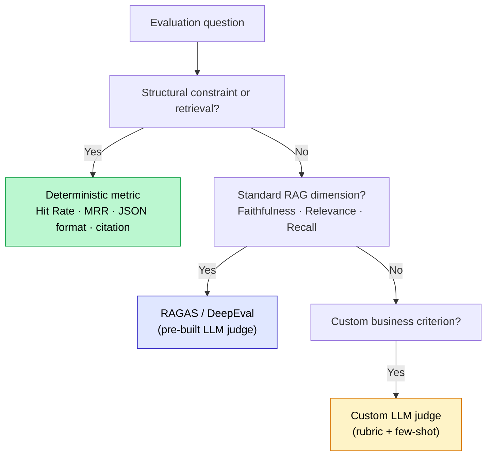

## What an LLM-as-a-judge is, in one quotable sentence

An LLM-as-a-judge is a second language model that evaluates the output of a first model against an explicit set of criteria: relevance, faithfulness to sources, completeness, tone. It produces a score and a justification. That's it.

The mechanism is useful. But it is expensive, slow, and biased if applied without discernment. The question is not "should I use an LLM judge" but "at which point in my pipeline, at what frequency, with which model."

The rule I apply on my engagements: deterministic tests first, the LLM judge as a last resort, never inside the fast development loop.

<!-- more -->

## The decision framework: when to use it, when to avoid it

LLM-as-a-judge is not the default answer to "how do I evaluate my system?". It is the tool you reach for when deterministic metrics are no longer sufficient.

Here is the escalation order I apply systematically:

**Level 1: deterministic tests (free, instantaneous)**

Before thinking about an LLM judge, verify everything you can verify without an LLM. Does the response contain the correct JSON format? Is the extracted date a valid date? Is the number of retrieved chunks within the expected range? Does the response cite at least one source?

These checks are deterministic, reproducible, and cost €0. On the projects I audit, 30 to 40% of detectable bugs remain identifiable at this level. Do not skip them.

**Level 2: similarity metrics (nearly free)**

ROUGE, BERTScore, BLEU on cases where you have a ground truth. Imperfect semantically, but useful for detecting raw regressions between two versions of a system.

**Level 3: LLM judge (expensive, slow)**

You arrive here only when the two previous levels do not cover what you want to measure: the semantic quality of an open-ended response, the consistency of reasoning, the relevance of an explanation. These are dimensions that no deterministic test can capture.

| Context | LLM judge? | Why |
|---|---|---|
| Development loop (every commit) | No | Too slow, too expensive, kills iteration |
| CI/CD test suite (weekly) | Yes, on a fixed dataset | Predictable cost, valid comparison |
| Sampled production monitoring (5-10%) | Yes, asynchronously | Controlled cost, real signal |
| Debugging a specific case | Yes, on an ad hoc basis | Acceptable one-off |
| Evaluating 100% of production traffic | No | Cost x volume = uncontrollable bill |

The most important rule: **never inside the fast development feedback loop**. A GPT-4o judge on 500 requests at every push is tens of euros per day. Two developers iterating over a weekend and your monthly evaluation budget is gone.

## The real cost in euros: a concrete calculation

This is the part nobody shows clearly. Here is the formula:

$$\text{Total cost} = n\_eval \times n\_criteria \times (tokens\_input \times price\_input + tokens\_output \times price\_output)$$

Typical parameters for an LLM judge call:
- System prompt + question + response to evaluate + rubric: roughly 800 input tokens
- Judge response (score + justification): roughly 200 output tokens

### Cost table by model (May 2026)

| Model | Input ($/1M) | Output ($/1M) | Cost / evaluation | 1,000 eval x 3 criteria |
|---|---|---|---|---|
| GPT-4o-mini | $0.15 | $0.60 | ~$0.000240 | ~**€0.72** |
| Claude Haiku 4.5 | $1.00 | $5.00 | ~$0.00180 | ~**€5.40** |
| GPT-4o | $2.50 | $10.00 | ~$0.00400 | ~**€12.00** |
| Claude Sonnet 4.6 | $3.00 | $15.00 | ~$0.00480 | ~**€14.40** |

Calculation assumptions: 800 input tokens + 200 output tokens per judge call, exchange rate $1 = €0.92.

### What this looks like in practice

**Scenario 1: offline evaluation of a 500-question dataset, 3 criteria (faithfulness, relevance, completeness)**

With GPT-4o-mini: 500 x 3 = 1,500 calls x $0.000240 = **€0.36**. Negligible.

With GPT-4o: 500 x 3 = 1,500 calls x $0.00400 = **€6.00**. Acceptable for a one-off evaluation.

**Scenario 2: production monitoring on 10% of 10,000 requests/day, 2 criteria**

With GPT-4o-mini: 1,000 x 2 = 2,000 calls/day x $0.000240 = **$0.48/day, roughly €13/month**. Very reasonable.

With GPT-4o: 1,000 x 2 = 2,000 calls/day x $0.00400 = **$8.00/day, roughly €220/month**. Starts to add up.

**Scenario 3: LLM judge in the dev loop, 100% of test traffic, 4 criteria**

Assume 200 test requests per developer per day, 3 developers, GPT-4o:
200 x 3 x 4 criteria = 2,400 calls x $0.00400 = **$9.60/day**. Multiply by 20 working days: **$192/month, roughly €175 just for evaluation**. Switch to GPT-4o-mini and it drops to €12/month. The difference justifies always asking which model to use as judge.

The takeaway: GPT-4o-mini covers 80% of evaluation needs at negligible cost. Reserve GPT-4o or Claude Sonnet for cases where you need judgment precision on complex criteria (multi-step reasoning, legal consistency, delicate tone). For a broader view of cutting LLM costs across your entire pipeline, not just the judge, see [prompt caching](prompt-caching-reduire-cout-llm.md): Anthropic, OpenAI, and Gemini all offer up to 90% discounts on cached tokens, which matters when your judge system prompt is large and repeated across thousands of calls.

### An operational judge prompt with a rubric

Here is the pattern I use in production. The key idea: an explicit rubric with defined score levels, structured JSON output, and one criterion per call (not three criteria mixed into a single prompt).

```python
import json
from openai import OpenAI

client = OpenAI()

JUDGE_SYSTEM_PROMPT = """You are an expert evaluator of RAG systems.
Your role: rate the FAITHFULNESS of a response relative to the provided context.

Scoring rubric (score from 1 to 4):
- 4: All claims in the response are directly supported by the context.
- 3: The majority of claims are supported; one minor claim is not.
- 2: Several claims are not in the context, or one central claim is ungrounded.
- 1: The response contains invented information or information that contradicts the context.

Reply ONLY in valid JSON with this format:
{"score": <int 1-4>, "justification": "<1-2 sentences max>", "ungrounded_claim": "<quote or null>"}
"""

def judge_faithfulness(question: str, context: str, response: str) -> dict:
    """
    Evaluates the faithfulness of a response to the context.
    Returns a dict with score (1-4), justification, and the problematic claim if found.
    """
    user_message = f"""Question: {question}

Retrieved context:
{context}

Response to evaluate:
{response}"""

    completion = client.chat.completions.create(
        model="gpt-4o-mini",   # Lightweight judge for the majority of evaluations
        temperature=0,          # Maximum determinism
        response_format={"type": "json_object"},
        messages=[
            {"role": "system", "content": JUDGE_SYSTEM_PROMPT},
            {"role": "user", "content": user_message},
        ],
    )

    return json.loads(completion.choices[0].message.content)


# Usage example
result = judge_faithfulness(
    question="What is the refund window?",
    context="Article 4.1: all refunds must be processed within 14 calendar days following receipt of the signed form.",
    response="The refund is processed within 14 days of receiving the form. Refunds are processed on Fridays.",
)

print(result)
# {"score": 2,
#  "justification": "The 14-day window is correct, but the claim about Fridays is not in the context.",
#  "ungrounded_claim": "Refunds are processed on Fridays."}
```

Three important design decisions in this prompt:

**One criterion per call.** A judge evaluating faithfulness + relevance + completeness in the same prompt mixes signals and produces less reliable scores. Make one call per criterion: it costs more in number of calls, but it is far more precise.

**A rubric with named levels.** "Rate from 1 to 10" is too vague an instruction. An LLM judge without an explicit rubric scores inconsistently from one request to the next. Describe what each level means.

**`temperature=0`.** Essential for reproducibility. With a higher temperature, the same example can receive a 3 or a 4 depending on the call. Your baseline becomes unstable.

## LLM judge biases and how to reduce them

An LLM judge is not objective. This is the most underestimated point when setting up this type of evaluation for the first time. Three structural biases to know.

### Position bias

In pairwise mode (comparing two responses A and B to pick the best), the judge systematically favors the response presented in first position. Recent studies (arxiv 2602.02219, 2024-2025) show that on some models, order alone accounts for up to 30% of the variance in the verdict.

Correction: **randomize the order** of responses at each evaluation, and aggregate over at least two passes with the order reversed. If the verdict changes depending on the order, that is noise, not signal.

### Verbosity bias

LLM judges tend to favor longer responses, even when the shorter response is more precise and more useful. A 300-word response that circles around the topic often scores better than a direct 50-word response.

Correction: **include explicitly in the rubric** a level that penalizes unnecessary padding. For example: "Score 3 only if the response is concise and contains no unrequested information."

### Self-preference bias (self-enhancement bias)

A judge model tends to prefer phrasings close to its own output style. If you use GPT-4o to generate responses and GPT-4o as the judge, the judge will rate more favorably the constructions GPT-4o would itself use.

Correction: **use a model from a different family** for judging. If you generate with GPT-4o, judge with Claude or Mistral, and vice versa. Alternatively, use at minimum a different version of the model for generation and for judgment (GPT-4o-mini as a judge of GPT-4o outputs).

### Summary of corrections

| Bias | Observable symptom | Correction |
|---|---|---|
| Position | Verdict changes if A/B order is reversed | Switch to pointwise or randomize + aggregate |
| Verbosity | Long responses score better even when off-topic | Rubric with explicit conciseness criterion |
| Self-preference | Model family affects the score | Judge from a different family than the generator |

## LLM judge, deterministic metrics, RAGAS: when to choose what

The three approaches are complementary, not competing. Here is their exact role.

**Deterministic metrics** (Hit Rate @k, MRR, NDCG, valid format, citation presence) cover retrieval and structural constraints. Always first, always free. If your Hit Rate @5 is at 70%, an LLM judge on generation serves no purpose: the root cause is upstream.

**RAGAS metrics** (faithfulness, answer relevancy, context precision, context recall) are themselves based on an LLM judge, but with pre-built and tested judging prompts. RAGAS saves you from building your own judge prompts for standard RAG metrics. Read the dedicated article for the full breakdown of metrics and code: [Evaluate RAG in production: metrics & RAGAS](evaluer-rag-production-metriques-ragas.md).

**The custom LLM judge** (what this article is about) is useful when you have domain-specific evaluation criteria that RAGAS does not cover out-of-the-box: tone adapted to the business context, compliance with a response charter, relevance relative to specific regulatory rules.



### Calibrating a reliable judge: correlation with human annotations

An uncalibrated LLM judge is dangerous. You can have a well-built evaluation pipeline that scores highly responses that real users find poor, or the reverse.

Calibration happens in a single step: compute the correlation between your LLM judge scores and human annotations on the same sample.

**Minimal protocol:**

1. Take 50 to 100 representative examples from your system.
2. Have each example annotated by two people with domain expertise (not developers, real users of the system if possible). Each annotator scores independently according to the same rubric.
3. Compute the inter-annotator Cohen's Kappa. Below 0.6, your rubric is too ambiguous: clarify the levels before going further.
4. Run your LLM judge on the same examples.
5. Compute the Spearman correlation between the judge scores and the average of the human scores.

| Spearman correlation | Interpretation |
|---|---|
| > 0.80 | Reliable judge, usable in production |
| 0.60 to 0.80 | Acceptable for monitoring, not for critical decisions |
| < 0.60 | Rubric needs reworking or judge model needs changing |

On my engagements, the correlation typically goes from 0.55 to 0.78 after adding 3 to 5 few-shot examples to the judge prompt (one example per score level, with an explicit justification). Few-shot anchors the judge to your definition of each level, not its own.

```python
# Spearman correlation between judge scores and human scores
from scipy.stats import spearmanr

judge_scores = [4, 2, 3, 4, 1, 3, 2, 4, 3, 2]       # LLM judge scores
human_scores = [4, 2, 4, 3, 1, 3, 3, 4, 2, 2]       # Average of human annotations

corr, p_value = spearmanr(judge_scores, human_scores)
print(f"Spearman correlation: {corr:.2f} (p={p_value:.3f})")
# Spearman correlation: 0.82 (p=0.004)
```

If your correlation is strong on this calibration sample, your judge is usable. If it is weak, do not switch judge models before reworking the rubric: that is almost always where the problem lies.

## Frequently asked questions about LLM-as-a-judge

**What is the difference between pointwise and pairwise evaluation?**

Pointwise evaluation assigns an absolute score to a single response according to a rubric. Pairwise evaluation compares two responses (A vs B) and determines which is better. Pairwise is more natural for detecting regressions between two versions of a system, but it amplifies position bias. For production monitoring, pointwise with an explicit rubric is more stable and less expensive (one call per response instead of two).

**Can you use an open-source model as a judge?**

Yes, and it is a good option to bring costs to zero (beyond infrastructure). Mistral 7B Instruct, LLaMA 3 8B, or specialized models like Prometheus 2 (fine-tuned for judgment) work correctly for simple criteria. For complex judgments (consistency of legal reasoning, subtlety of tone), smaller models have a lower correlation with human annotations. Always calibrate before trusting the scores.

**How many criteria should you evaluate per judge call?**

One per call. That is the rule I apply systematically. A prompt that mixes faithfulness, relevance, and completeness produces less stable scores that are harder to interpret. Three criteria equals three calls. The additional cost is marginal; the reliability gain is significant.

**How do you evaluate a chatbot without an annotated reference dataset?**

Two complementary methods. First, reference-free evaluation: metrics like faithfulness and answer relevancy from RAGAS do not require ground truth. They evaluate internal consistency (is the answer grounded in the provided context?). Second, synthetic generation: use an LLM to create questions from your documents and automatically annotate expected responses. It is an imperfect bootstrap but sufficient to get started. The full method is in [Build a RAG evaluation dataset in 30 minutes](dataset-evaluation-rag-questions-synthetiques.md).

**Does LLM-as-a-judge replace human annotation?**

No. It complements it. To build your rubric and calibrate it, you need human annotations. For daily monitoring at scale (thousands of requests), the LLM judge takes over. The practical rule: human annotations at the start and during deep audits, LLM judge for the continuous flow.

**Which models are most commonly used as judges in 2026?**

GPT-4o-mini is the most common choice for medium-volume pipelines: good cost-to-quality ratio, stable API, consistent results. GPT-4o and Claude Sonnet 4.6 are used when judgment quality takes priority over cost (regulatory cases, one-off audits). Prometheus 2 is an open-source alternative specialized in fine-grained judgment with a rubric. MT-Bench and Chatbot Arena remain academic references for comparing systems at the benchmark level, but they are not production monitoring tools.

**How often should you run an LLM judge evaluation in production?**

For offline evaluation on a fixed dataset: at every significant release (model change, prompt change, chunking change). For online monitoring: continuously on a 5 to 10% sample of real traffic, asynchronously so it does not impact latency. Do not evaluate 100% of traffic unless there is a strong regulatory constraint: the cost is not justified and the marginal signal on the additional requests is weak.

**How do you know if your LLM judge is too lenient?**

Look at the distribution of your scores. If more than 80% of your evaluations receive the maximum score, either your system is exceptionally good (unlikely in early stages), or your judge is too lax. Add a few-shot example with poorly performing responses (low score) in your prompt: it recalibrates the distribution downward. If that is not enough, tighten your rubric explicitly.

## Further reading

- [Evaluate RAG in production: metrics & RAGAS](evaluer-rag-production-metriques-ragas.md) : standard metrics (faithfulness, context recall) and the frameworks that implement them
- [Testing an LLM with unit tests](tester-llm-tests-unitaires.md) : the deterministic tests that must come before any LLM judge
- [Build a RAG evaluation dataset in 30 minutes](dataset-evaluation-rag-questions-synthetiques.md) : bootstrapping an evaluation set without manual annotations
- [Optimizing your RAG: the 8 techniques that make a difference](optimiser-rag-techniques.md) : what to do once you know what to fix, in the right order

---------

If my articles interest you and you have questions, or just want to discuss your own challenges, feel free to write to me at [anas@tensoria.fr](mailto:anas@tensoria.fr). I enjoy talking about these topics!

You can also [book a call](https://cal.eu/anas-rabhi/rendez-vous-ianas) or subscribe to my newsletter :)


---

### About me

I'm **Anas Rabhi**, freelance AI Engineer & Data Scientist. I help companies design and deploy AI solutions (RAG, AI agents, NLP). [Read more about my work and approach](/en/a-propos/), or browse the [full blog](/en/blog/).

Discover my services at [tensoria.fr](https://tensoria.fr) or try our AI agents solution at [heeya.fr](https://heeya.fr).

<div style="text-align: center; margin: 40px 0; gap: 16px; display: flex; flex-wrap: wrap; justify-content: center;">
  <a href="https://cal.eu/anas-rabhi/rendez-vous-ianas" target="_blank" style="display: inline-block; background-color: #4F46E5; color: #ffffff; font-weight: bold; padding: 16px 32px; text-decoration: none; border-radius: 8px; font-size: 18px; letter-spacing: 0.8px; box-shadow: 0 6px 12px rgba(0, 0, 0, 0.2); transition: all 0.3s ease; border: none;">
    Book a call
  </a>
  <a href="https://anas-ai.kit.com/d8b1a255cc" target="_blank" style="display: inline-block; background-color: #222222; color: #ffffff; font-weight: bold; padding: 16px 32px; text-decoration: none; border-radius: 8px; font-size: 18px; letter-spacing: 0.8px; box-shadow: 0 6px 12px rgba(0, 0, 0, 0.2); transition: all 0.3s ease; border: none;">
    <span style="margin-right: 10px;">✉️</span> Subscribe to my newsletter
  </a>
</div>
