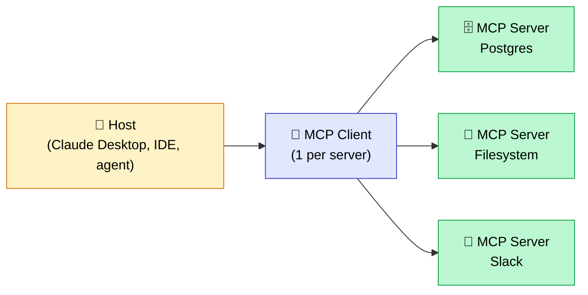

## Everyone talks about AI agents. Nobody talks about how they actually connect to your tools.

Here's the concrete problem 90% of teams face when they want to build a serious AI agent: they have a capable LLM, a clear use case, and 4 or 5 tools to connect (a SQL database, Slack, Notion, GitHub). And then they end up writing a custom integration for each tool, for each model. If they switch LLMs tomorrow, they start over. If a colleague wants to reuse the Slack integration on a different agent, they start from scratch.

This is the N times M problem. N agents, M tools. You end up with N×M integrations to write and maintain.

**MCP solves exactly this problem.** The Model Context Protocol is the open standard launched by Anthropic in November 2024, and in 2026 it's becoming what HTTP is to the web: the invisible infrastructure everything runs on. OpenAI, Google, Microsoft, AWS — the entire ecosystem is converging on it. 97 million monthly SDK downloads in March 2026, up from 2 million at launch. That's unprecedented adoption for an AI tooling standard.

In this article, I'll explain what MCP actually is, how its architecture works, how it differs from classic function calling, and most importantly: which projects to use it on (and which ones not to).

<!-- more -->

***

## Where MCP came from, and why now

Anthropic published MCP in November 2024, open-source under the MIT license. The original idea is simple: stop reinventing the wheel for every integration.

**The historical problem is architectural.** Every LLM provider developed its own mechanism for connecting the model to external tools. OpenAI has function calling, with its specific JSON syntax. Anthropic has tool use, with a different structure. Google Gemini has its own functions API. The result: if you built an agent with OpenAI and wanted to migrate to Claude, you rewrote all your tool integrations. From scratch. Strong coupling everywhere.

**The analogy Anthropic themselves use is USB-C.** Before USB-C, every manufacturer had its own proprietary connector. You needed a different cable for each device. USB-C standardized everything: the same cable works for your phone, your laptop, your external hard drive. MCP does the same thing for AI agents and their tools.

**Adoption has been remarkably fast.** In December 2025, Anthropic did something unexpected: they handed the protocol to the Agentic AI Foundation (AAIF), a directed fund hosted by the Linux Foundation, co-founded with Block and OpenAI. Google, Microsoft, AWS, Cloudflare, and Bloomberg joined as supporting members. This is no longer Anthropic's protocol. It's an open industry standard, governed collectively.

In practice, as of 2026:

- OpenAI added native MCP support in ChatGPT and its SDK
- Google integrated MCP into the Gemini API and Vertex AI Agent Builder
- Over 10,000 active public MCP servers cover hundreds of tools (GitHub, Slack, Postgres, Google Drive, Filesystem, Jira, Notion, and many more)
- Cursor, Claude Code, and the majority of AI-powered IDEs support MCP natively

This is the signal that MCP is not a passing trend. It's infrastructure.

***

## MCP architecture in 3 components

MCP is built around three entities that communicate via JSON-RPC 2.0. Here's how they fit together:



### The Host: the application running the LLM

The host is the application in which your language model runs. It could be Claude Desktop, Cursor, an IDE like VS Code with an AI extension, or your own custom-built agent application. The host is responsible for launching MCP connections, managing sessions, and deciding which MCP servers are available to the LLM.

In practice: when you configure Claude Desktop to give it access to your filesystem, you're telling the host which MCP server to start.

### The MCP Client: the library that talks to servers

The MCP client is a software layer embedded in the host. For each connected MCP server, there is one client instance. It handles the transport (stdio for local processes, Streamable HTTP for remote servers), capability negotiation at session startup, and JSON-RPC message serialization/deserialization.

As a developer, you generally don't write an MCP client yourself — you use the official SDK that handles all of this for you.

### The MCP Server: the heart of the system

**This is where the real work happens.** An MCP server is an independent process that exposes three types of primitives:

- **`tools`**: actions with side effects (execute a SQL query, send a Slack message, create a file). These are the equivalent of POST in HTTP.
- **`resources`**: read-only data (read a file, access documentation, retrieve logs). These are the equivalent of GET.
- **`prompts`**: parameterized templates the agent can use as starting points for recurring tasks.

At session startup, the client calls `list_tools()` to dynamically discover what the server exposes. This is dynamic discovery: the host doesn't need to know the server's capabilities in advance. When the server evolves (a new tool is added), the host discovers it automatically.

***

## MCP vs function calling: the real difference

This is the question everyone asks, and there's a common confusion I want to clear up right away.

**MCP does not replace function calling.** It doesn't work instead of it — it works on top of it. Under the hood, when an agent uses an MCP tool, the LLM is still doing tool use (or function calling, depending on the provider's vocabulary). MCP simply standardizes how those tools are exposed, discovered, and invoked, independent of which LLM is being used.

The structural difference is in the architecture:

| Criterion | Classic function calling | MCP |
|---|---|---|
| Coupling | Code directly in your application | Independent, reusable server |
| Tool discovery | Hardcoded in the prompt | Dynamic via `list_tools()` |
| Multi-model | Rewrite for every LLM | Universal standard |
| Maintenance | N×M integrations | N+M |
| State | Stateless by default | Stateful sessions possible |
| Reusability | Zero | Full across agents and LLMs |

**A concrete example.** You're building an agent that queries your Postgres database. With classic function calling, you define your functions in JSON in your code, pass them to the LLM on every API call, and if you switch LLMs tomorrow or a colleague wants the same functionality in their own agent, they start from scratch. With MCP, you create a Postgres MCP server once. Any agent, any MCP-compatible LLM can use it. You go from N×M to N+M.

For simple projects with 1 or 2 tools, classic function calling remains more direct. MCP starts to make sense the moment you have multiple tools to share across multiple agents or multiple LLMs.

***

## A concrete example in 30 lines

Here's what a minimal MCP server looks like in Python. I'm using the official `mcp` library (the same one used by Anthropic's official servers).

The example: a server that exposes a search tool over your company's internal documentation.

```python
from mcp.server import Server
from mcp.server.stdio import stdio_server
from mcp.types import Tool, TextContent
import asyncio

app = Server("doc-search")

# The retriever for your document base (RAG, vector store, etc.)
# For this example, we assume it exists
from your_project import my_retriever

@app.list_tools()
async def list_tools() -> list[Tool]:
    return [
        Tool(
            name="search_docs",
            description="Search the company's internal documentation",
            inputSchema={
                "type": "object",
                "properties": {
                    "query": {
                        "type": "string",
                        "description": "The question or term to search for"
                    }
                },
                "required": ["query"]
            },
        )
    ]

@app.call_tool()
async def call_tool(name: str, arguments: dict) -> list[TextContent]:
    if name == "search_docs":
        results = my_retriever.search(arguments["query"])
        return [TextContent(type="text", text=results)]

async def main():
    async with stdio_server() as streams:
        await app.run(*streams, app.create_initialization_options())

if __name__ == "__main__":
    asyncio.run(main())
```

Once started, this server is usable by Claude Desktop, Cursor, or any MCP-compatible agent. **Your document retriever becomes a reusable service.** If tomorrow you have 3 different agents that need access to this document base, they all connect to the same MCP server. No duplication.

This is exactly the principle we've applied on several projects at [Tensoria](https://tensoria.fr), and it's what I detail below in the real use cases.

***

## The use cases that genuinely change the game

### IDE agents: Cursor, Claude Code, VS Code

This is the most immediately impactful use case in 2026. A developer working with Cursor or Claude Code can connect a `filesystem` MCP server that gives the agent access to local files, a `git` MCP server for version control operations, an MCP server for their dev databases. And all of this works regardless of which LLM is running underneath.

What I see on projects: teams that have configured their IDE environment with MCP save 30 to 60 minutes a day in tooling friction. The agent knows exactly what it can do, without an endless system prompt telling it so.

### Multi-SaaS agents: the commercial case

Imagine a sales agent that needs to answer customer questions by cross-referencing HubSpot (customer history), Notion (product documentation), Slack (latest communications), and Gmail (emails). Without MCP, that's 4 custom integrations, 4 things to maintain, and if you switch CRMs, you start over.

With MCP: 4 MCP servers, all reusable, all dynamically discovered by the agent. I've seen this architecture cut the setup time for a sales agent by 70% on a recent project, and make the whole thing significantly easier to maintain over time.

### Enterprise RAG exposed as an MCP server

This is the direct connection to [Agentic RAG architecture](/en/blog/posts/agentic-rag-vs-rag-classique/) that I've detailed in another article. Your document retriever (the one you've optimized with [the techniques in this guide](/en/blog/posts/optimiser-rag-techniques/)) becomes an MCP server. It's now reusable by any internal agent. You build it once, you benefit everywhere.

On a construction proposal writing project, we use exactly this architecture: each of the 4 document sources is exposed as an independent MCP server. The orchestrator dynamically chooses which sources to query based on the question.

### Connecting to a legacy system

This is perhaps the most underestimated use case. You have an old business system (an early-2000s ERP, an Oracle database, a poorly documented internal API) and you want your future agents to be able to access it. Creating an MCP server as a facade means writing the integration logic with that system exactly once. All your current and future agents go through it. The day you replace the legacy system, you update a single MCP server.

***

## The limits and pitfalls (what nobody tells you)

I'll tell you what I genuinely think: MCP is excellent, but it has real blind spots you need to know about before adopting it.

### Security: a real subject, not a footnote

An MCP server is a process that potentially has access to your files, your databases, your internal APIs. If a misconfigured (or malicious) agent can call that server, the consequences can be serious.

**The risk of prompt injection via MCP is documented.** An attacker can inject malicious instructions into data read by an MCP server (a file, an email, a ticket), and those instructions can push the agent to invoke tools it shouldn't have called. This is a new attack vector that the security community is starting to seriously document.

Best practices: limit each MCP server's permissions to the strict minimum (principle of least privilege), validate and sanitize inputs before any tool call, audit MCP call logs, and never expose MCP servers on uncontrolled networks without strong authentication.

### Latency: calculate before you deploy

Every call to an MCP tool adds a network round trip (if the server is remote) or inter-process communication overhead (if it's local via stdio). For most back-office workflows where a task takes 10 to 60 seconds, this is negligible. For a real-time application where every millisecond counts, it's a genuine constraint.

In practice, on the architectures I work with, a local MCP call via stdio adds 5 to 20ms. A remote MCP call via HTTP can add 50 to 200ms depending on the network. If your agent makes 10 tool calls per request, do the math.

### Too many available tools hurts the agent

**Dynamic discovery is a feature, not an invitation to expose everything.** I've seen configurations with 30 or 40 MCP tools available to a single agent. The result: the LLM gets confused, picks the wrong tool, or hesitates between tools that seem similar. The relevance of an MCP tool matters as much as its existence.

The rule I apply: each agent should only see the tools it genuinely needs for its specific use case. If you have a customer support agent, don't expose infrastructure deployment tools to it.

### The standard is still young

MCP is 18 months old. The spec evolves: OAuth authentication was added in 2025, Streamable HTTP transport replaced SSE, new primitives are added regularly. Code written in early 2025 may not work with the 2026 SDK without migration.

This isn't a deal-breaker (the ecosystem is mature), but it's a data point to factor into your decision to adopt now vs. wait.

### For 1 or 2 simple tools: function calling is still simpler

This is the truth nobody wants to say: if you have a single agent with a single tool (a web search, a call to an external API), setting up an MCP server is over-engineering. Classic function calling is more direct, easier to debug, and more than sufficient.

***

## When to use MCP (and when not to)

Here are the questions I ask myself on every project before deciding:

**Do you have 3 or more tools to expose?**
No (1 or 2 tools): classic function calling is sufficient.
Yes: MCP starts to make sense.

**Will multiple agents share the same tools?**
No: you don't need the decoupling MCP provides.
Yes: MCP is built exactly for this.

**Do you want to be LLM-agnostic?**
No (you're certain you'll stay with the same provider): proprietary function calling is fine.
Yes (you want the ability to switch models): MCP is the only real answer.

**Will your tool ecosystem evolve over time?**
No (fixed and stable tool list): MCP's dynamic discovery doesn't add much.
Yes (you regularly add new tools): MCP massively simplifies governance.

**Do you have strict latency constraints (under 100ms)?**
Yes: measure the MCP overhead before committing, and prefer local stdio.
No: MCP is not an issue.

**Summary:** MCP for multi-tool production agents, shared across teams, in an ecosystem that evolves. Function calling for prototypes, simple agents, or cases where the stack is 100% fixed.

***

## How I use it on my Tensoria engagements

Let me give you two concrete cases from real projects, because E-E-A-T in AI isn't something you improvise.

### The case where MCP saved considerable time

On a recent project for an industrial company, we needed to build an agent that had to access 4 internal sources: a technical standards document base (our RAG retriever), an ERP for stock data, an internal ticketing system, and a planning tool.

Without MCP, the first architecture we considered was an agent with 4 custom integrations hardcoded in. Each integration required managing authentication, serialization, error handling, and the idiosyncrasies of each source. And all of it was coupled to Claude (the LLM chosen at the time).

We pivoted to MCP. We developed 4 independent MCP servers, one per source. Each server handled its own concerns: authenticating with the ERP, formatting queries for the ticketing system, and so on. The orchestrating agent had no idea how to access these systems — it only knew which tools to call.

Concrete result: when the client wanted to test a different LLM 3 months later, the migration took one day (changing the orchestrator configuration). Without MCP, it would have been several weeks of refactoring.

### The case where we deliberately chose NOT to use MCP

On another project — a POC for an insurance claims report generation assistant — the need was simple: the agent had to call a single internal API to retrieve the claim file data, then generate the report.

I could have created an MCP server for this API. I didn't. Native function calling with 2 functions defined in JSON was sufficient. It was delivered in 2 hours, with no extra infrastructure layer, no process to start, no configuration to maintain. The POC convinced the client within a week.

**The lesson:** MCP is an architectural tool, not a standard to apply everywhere on principle. Engineering means choosing the right level of complexity for the problem at hand.

***

## FAQ

**What is MCP?**

MCP (Model Context Protocol) is a standardized open protocol, launched by Anthropic in November 2024 and governed since December 2025 by the Agentic AI Foundation (Linux Foundation). It defines how an AI agent (or any LLM) connects to external tools and data sources in a standardized, reusable, model-agnostic way.

**Is MCP open source?**

Yes. MCP is published under the MIT license. The source code for the official SDKs (Python, TypeScript, Java, Kotlin, Swift) is available on GitHub. The protocol spec itself is open and governed by the AAIF, a Linux Foundation fund co-founded by Anthropic, OpenAI, and Block.

**What's the difference between MCP and a REST API?**

A REST API is designed for humans (or apps) that know exactly which endpoints to call. MCP is designed for AI agents to dynamically discover what they can do, via the `list_tools()` mechanism. MCP also manages sessions, stateful context, and bidirectional communication (the server can send notifications to the client). A REST API is a communication tool. MCP is an interface designed specifically for AI agents.

**Does MCP work with OpenAI and GPT?**

Yes. OpenAI added native MCP support in its SDK and in ChatGPT. Since mid-2025, you can connect MCP servers to GPT agents the same way you do with Claude. That's precisely the point of the standard: any LLM that supports MCP can use any existing MCP server.

**How do you secure an MCP server?**

Several layers of protection: apply the principle of least privilege (only give the MCP server the access it actually needs), validate and sanitize all inputs to prevent prompt injection, use OAuth authentication (natively supported since the 2025 spec), audit call logs, and never expose MCP servers on unsecured public networks without a strong authentication layer.

**Do you need MCP to build AI agents?**

No. Millions of agents run without MCP, using classic function calling. MCP becomes relevant when you have multiple tools to share, multiple agents running, or a need to be LLM-agnostic. For a simple prototype or a single-tool agent, MCP is over-engineering.

**Does MCP replace LangChain or LlamaIndex?**

No. MCP and LangChain/LlamaIndex operate at different levels. LangChain and LlamaIndex are orchestration frameworks that help you build agentic pipelines, RAGs, and processing chains. MCP is a transport and tool discovery protocol. You can absolutely use LangChain to orchestrate your agent and MCP to connect your tools. They're complementary building blocks.

**How much does MCP cost?**

The protocol itself is free and open source. The official SDKs are free. What you pay for is infrastructure: hosting your MCP servers if you deploy them remotely. For official third-party MCP servers (GitHub, Slack, etc.), connecting via MCP is generally free, but usage of the underlying APIs may be billed at those services' standard rates.

**Are there ready-to-use MCP servers?**

Yes, and the ecosystem is now very rich. Official servers cover: Filesystem, GitHub, GitLab, Slack, Google Drive, Google Maps, Postgres, SQLite, Fetch (web), Brave Search, Notion, Jira, and dozens of others. The official registry at `modelcontextprotocol.io` lists over 10,000 public servers as of 2026. For common use cases, you often don't need to write anything.

**Which language should you use to develop an MCP server?**

Official SDKs exist for Python, TypeScript/JavaScript, Java, Kotlin, and Swift. In practice, Python and TypeScript cover 90% of cases. Python is the natural choice if your team already works in Python (ML, data engineering). TypeScript if you're in a Node.js or frontend context. Both SDKs are well-maintained and documented.

***

## Further reading

- **[What is an AI agent?](c-est-quoi-un-agent-ia.md)** — the foundations of agentic systems before going deeper with MCP
- **[Agentic RAG vs classic RAG](agentic-rag-vs-rag-classique.md)** — how MCP fits into an agentic RAG architecture, with the most useful patterns
- **[AI agent frameworks comparison](crewai-langchain-langgraph-comparatif-pragmatique.md)** — choosing the right framework (LangGraph, Pydantic AI, CrewAI) to orchestrate the agents that connect via MCP
- **[AI agent memory](memoire-agents-ia-long-terme.md)** — how memory systems can themselves be exposed as MCP servers, giving any agent access to persistent context
- **[Optimizing your RAG](optimiser-rag-techniques.md)** — exposing your retriever as a reusable MCP server, and the techniques to make it truly performant

***

If my articles interest you and you have questions, or just want to talk through your own challenges, feel free to reach out at [anas@tensoria.fr](mailto:anas@tensoria.fr) — I enjoy these conversations.

You can also [book a call](https://cal.eu/anas-rabhi/rendez-vous-ianas) or subscribe to my newsletter.


---

### About me

I'm **Anas Rabhi**, freelance AI Engineer & Data Scientist. I help companies design and ship AI solutions (RAG, agents, NLP).

Discover my services at [tensoria.fr](https://tensoria.fr) or try our AI agents solution at [heeya.fr](https://heeya.fr).

<div style="text-align: center; margin: 40px 0; gap: 16px; display: flex; flex-wrap: wrap; justify-content: center;">
  <a href="https://cal.eu/anas-rabhi/rendez-vous-ianas" target="_blank" style="display: inline-block; background-color: #4F46E5; color: #ffffff; font-weight: bold; padding: 16px 32px; text-decoration: none; border-radius: 8px; font-size: 18px; letter-spacing: 0.8px; box-shadow: 0 6px 12px rgba(0, 0, 0, 0.2); transition: all 0.3s ease; border: none;">
    Book a call
  </a>
  <a href="https://anas-ai.kit.com/d8b1a255cc" target="_blank" style="display: inline-block; background-color: #222222; color: #ffffff; font-weight: bold; padding: 16px 32px; text-decoration: none; border-radius: 8px; font-size: 18px; letter-spacing: 0.8px; box-shadow: 0 6px 12px rgba(0, 0, 0, 0.2); transition: all 0.3s ease; border: none;">
    <span style="margin-right: 10px;">✉️</span> Subscribe to my newsletter
  </a>
</div>
