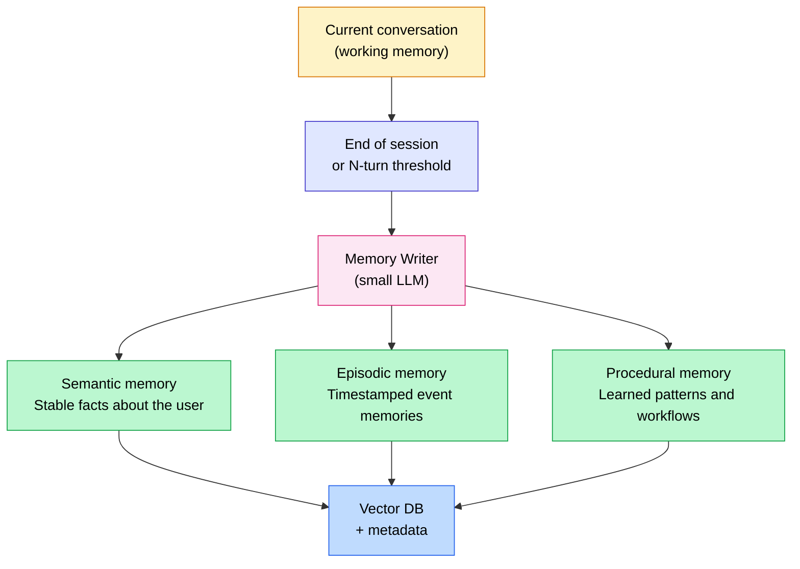
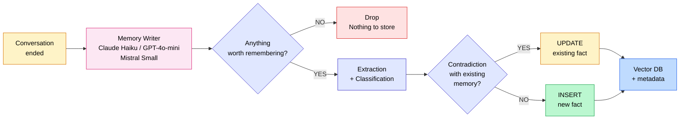

Without memory, an AI agent is just a better chatbot.

With poorly designed memory, it's an agent that fabricates recollections, contradicts what it said last week, and costs you a fortune in tokens. Memory is the most underestimated feature of AI agents in 2026. And it's the one that separates a fun prototype from a product that actually creates value.

In this article I'll walk you through the real taxonomy of memory in AI agents, the core technical pattern that very few people explain clearly (a small dedicated LLM that filters what's worth keeping), the tools on the market with their actual benchmark numbers, and how to choose based on your use case.

<!-- more -->

***

## Table of contents

1. [Why memory has become the #1 topic in AI agents](#why-memory-has-become-the-1-topic-in-ai-agents)
2. [The 4 types of memory you need to know](#the-4-types-of-memory-you-need-to-know-a-clear-taxonomy)
3. [The core pattern: the memory writer](#the-core-pattern-that-few-people-explain-the-memory-writer)
4. [The retrieval pattern: the memory retriever](#the-retrieval-pattern-the-memory-retriever)
5. [Tools on the market in 2026](#tools-on-the-market-in-2026)
6. [My pragmatic take: what to choose for each case](#my-pragmatic-take-what-to-choose-for-each-case)
7. [Classic pitfalls](#classic-pitfalls-with-real-experience)
8. [Security and privacy (GDPR)](#security-and-privacy-gdpr)
9. [FAQ](#faq-10-questions-about-ai-agent-memory)
10. [Further reading](#further-reading)

***

## Why memory has become the #1 topic in AI agents

LLMs are **fundamentally stateless**.

Every API call, the model starts from scratch. It remembers nothing. You told it your name yesterday, your industry last week, your business constraints a month ago — for the model, none of that ever happened.

The context window is not a solution to this problem, despite what you often read. Yes, recent models have contexts of 128k, 200k, even 1M tokens. But that's not memory — it's temporary storage, expensive, slow to process, and gone the moment the session ends.

**Without proper memory**, here's what happens in practice:

- The user has to repeat everything at the start of each new session (preferences, context, history)
- The agent responds as if it's meeting you for the first time, every time
- The experience breaks down after the second interaction

**With poorly designed memory**, the problems are different but just as serious:

- The agent accumulates noise and ends up "knowing" things that are false
- Contradictions build up in memory with no resolution mechanism
- Token costs explode because too much memorized context gets injected

In 2026, AI agent memory has its own benchmarks (LongMemEval, LoCoMo), its own research literature, and a rapidly growing tooling ecosystem. This is no longer an academic topic — it's an engineering question that comes up on every serious agent project.

If you're not yet comfortable with what an AI agent actually is, start with [my article on the fundamentals of AI agents](/en/blog/2025/12/16/mais-cest-quoi-un-agent-ia/) before continuing.

***

## The 4 types of memory you need to know (a clear taxonomy)

There's frequent confusion between all these terms. Here's the taxonomy that has reached consensus in 2026:

| Type | Definition | Concrete example | Duration | Typical storage |
|---|---|---|---|---|
| **Working memory** (short-term) | The context of the current conversation | The last 10 messages exchanged | Session only | In-memory buffer |
| **Semantic memory** | Stable facts about the user or the world | "Anas works in Toulouse, prefers Python" | Permanent | Vector DB or KV store |
| **Episodic memory** | Memories of past events with temporal context | "On March 12th, we discussed a migration to GCP" | Long-term | Vector DB with timestamp |
| **Procedural memory** | Learned patterns and workflows | "For this client, always send a recap after every meeting" | Long-term | Vector DB or rules store |

The diagram below illustrates how these memory types connect:



**Working memory** is straightforward to implement: it's the messages array you're already sending to the model. The challenge is knowing when to prune that window to avoid hitting context limits or blowing costs.

**Semantic memory** holds facts that don't change often. "Anas is an AI consultant in Toulouse and works mainly with industrial SMEs." This kind of fact is worth storing, indexing, and retrieving at the start of every relevant conversation.

**Episodic memory** holds what happened, with temporal context. The date matters. "In January, we decided not to migrate to Pinecone because of the cost." Six months later, the situation may have changed.

**Procedural memory** is often forgotten in implementations. It captures learned behavioral patterns: "When this user asks a technical question, they prefer a code answer over a narrative explanation." This type of memory improves response quality over the long run, beyond simply recalling facts.

***

## The core pattern that few people explain: the memory writer

This is the section I wish I'd found when I first started working on agent memory in production.

The concrete question is simple: how do you decide what's worth remembering?

The naive answer: save everything. That's a disaster. You accumulate noise, redundancies, contradictions. Retrieval quality drops. Costs rise.

The right answer: use **a small dedicated LLM**, called the memory writer, that acts as an intelligent filter between the conversation and long-term memory.

### How the memory writer works

The memory writer receives each interaction (or a batch of interactions) and makes an active decision:

1. **Filtering**: is there anything in this exchange worth keeping long-term?
2. **Extraction**: if yes, extract the relevant information in atomic form (1 fact = 1 short sentence)
3. **Classification**: categorize the fact (semantic, episodic, procedural)
4. **Contradiction check**: search existing memory for anything that conflicts with this fact
5. **Storage**: write with embedding + metadata (date, category, confidence score)



### Critical implementation choices

**Which LLM for the writer?**

You don't need your main model. A fast, cheap model is more than sufficient: Claude Haiku, GPT-4o-mini, Mistral Small. The memory writer performs a precise, well-defined task — not creative generation. In practice, Claude Haiku 3.5 or GPT-4o-mini handle this very well at a fraction of the cost.

**When to trigger the memory writer?**

Three possible approaches:

- **Every turn**: precise but expensive — reserve for critical cases
- **Every N interactions** (often 5 to 10): good cost/quality tradeoff
- **End of session**: the most economical, sufficient for the majority of cases

In production, end-of-session is the sensible default. For customer support agents with long, dense sessions, every 10 interactions is a solid compromise.

**Storage format**

This is crucial and often done wrong: **short, atomic facts** — not long summaries.

- Good: "Anas prefers meetings in the morning before 10am"
- Bad: "Anas seems to be someone who appreciates having their professional exchanges organized at the start of the day, which would allow him to keep his afternoons free for deep work"

An atomic fact is precise, searchable, and easy to update. A long summary is vague, hard to index, and impossible to correct cleanly.

**The contradiction resolver**

If the new fact contradicts an existing fact, you don't add it as a duplicate. You update the existing entry. "Anas works in Paris" followed by "Anas moved to Toulouse in March" must not coexist in memory.

### Conceptual code for the memory writer

Here's a conceptual Python example illustrating the pattern, independent of any specific library:

```python
import json
from anthropic import Anthropic

client = Anthropic()

MEMORY_WRITER_SYSTEM = """You are a memory extractor for an AI agent.

Analyze the provided conversation and extract ONLY facts worth keeping
long-term: stable preferences, important decisions, personal information,
durable business context.

Ignore: pleasantries, one-off questions with no lasting value,
temporary information.

For each memorable fact, return a JSON object with:
- text: the fact as one short, precise sentence
- type: "semantic" | "episodic" | "procedural"
- confidence: score between 0 and 1

Return a JSON list. If nothing is worth remembering, return [].
"""

def extract_memories(conversation: list[dict]) -> list[dict]:
    """Extract memorable facts from a conversation using a small LLM."""
    response = client.messages.create(
        model="claude-haiku-4-5",
        max_tokens=1000,
        system=MEMORY_WRITER_SYSTEM,
        messages=[{
            "role": "user",
            "content": f"Conversation to analyze:\n\n{json.dumps(conversation, ensure_ascii=False)}"
        }]
    )
    try:
        return json.loads(response.content[0].text)
    except json.JSONDecodeError:
        return []


def resolve_and_store(new_memory: dict, vector_db, similarity_threshold: float = 0.92):
    """
    Check for contradictions and store the new fact.
    If a similar fact already exists, update rather than insert.
    """
    similar_memories = vector_db.search(
        query=new_memory["text"],
        k=3,
        threshold=similarity_threshold
    )

    if similar_memories:
        # Update the closest fact (anti-contradiction)
        most_similar = similar_memories[0]
        vector_db.update(
            id=most_similar["id"],
            new_text=new_memory["text"],
            metadata={
                "type": new_memory["type"],
                "confidence": new_memory["confidence"],
                "updated_at": "2026-05-19"
            }
        )
    else:
        # New fact: direct insertion
        vector_db.insert(
            text=new_memory["text"],
            metadata={
                "type": new_memory["type"],
                "confidence": new_memory["confidence"],
                "created_at": "2026-05-19"
            }
        )


def run_memory_writer(conversation: list[dict], vector_db):
    """Main entry point for the memory writer."""
    memories = extract_memories(conversation)
    for memory in memories:
        if memory.get("confidence", 0) > 0.7:  # Confidence threshold
            resolve_and_store(memory, vector_db)
    return len(memories)
```

This pattern adapts to any stack: LangGraph, LlamaIndex, or a custom pipeline. The key is the separation between the main LLM (which responds) and the memory writer (which filters and stores).

***

## The retrieval pattern: the memory retriever

Writing to memory is half the work. The other half is reading at the right moment.

On each new interaction, the memory retriever searches long-term memory using the user's message. It retrieves the N most relevant facts and injects them at the top of the system prompt.

```
System prompt:
"Here is what you know about this user:
- Anas is a freelance AI consultant based in Toulouse
- He prefers Python answers over pseudocode
- In March, we decided together not to use LangChain for his construction project
[...]
Now answer his question taking this context into account."
```

### Retriever pitfalls

**Too many memories injected**: beyond 10–15 facts in context, LLM response quality starts to degrade. The model gets lost in the information. Set a hard cap.

**Too few**: if your similarity threshold is too high, the agent will inject nothing even though there are relevant facts that are slightly reformulated. Too restrictive means that memory is wasted.

**No filtering by type**: if the user asks a technical question, you should prioritize memories of type "procedural" and technical "semantic" — not off-topic old episodes.

In practice, the right tradeoff in 2026 is 5 to 10 memories, with a cosine similarity threshold around 0.75, and type-based filtering based on question context. Mem0's multi-signal algorithm (vector similarity + BM25 + entity matching) delivers good results at roughly 6,900 tokens per request, compared to 26,000 for a full-context approach.

For a deeper dive into vector retrieval in AI systems, read [my article on Agentic RAG](/en/blog/2026/03/20/agentic-rag-vs-rag-classique/) which covers agentic retrieval patterns in detail.

***

## Tools on the market in 2026

The market has structured itself well. Here are the main players with their real strengths, real weaknesses, and recent benchmark numbers.

### Comparison table

| Tool | Architecture | Open source | LoCoMo (benchmark) | Strengths | Weaknesses |
|---|---|---|---|---|---|
| **Mem0** | Vector DB + graph, multi-scope | Yes (Apache 2.0) + cloud | ~58% | Simple API, 21 frameworks supported, active (Series A $24M Oct. 2025) | Weaker benchmark than Zep/Letta, slight cloud format lock-in |
| **Zep** | Temporal Knowledge Graph | OSS + cloud | ~85% (GPT-4o) | Excellent for entity relationships over time, best benchmark | Heavier stack, advanced features are paid |
| **Letta** (ex-MemGPT) | OS-inspired (RAM/disk/archive) | Yes | ~83% | Elegant concept, LLM controls its own memory, very flexible | High learning curve, complex setup |
| **LlamaIndex Memory** | Buffer + integrated vector store | Yes | N/A | Well integrated into existing LlamaIndex RAG pipelines | Not practical standalone, unstable API, weaker alone |
| **LangGraph + LangMem** | Checkpointer + store | Yes | N/A | Full control, perfect if you're already on LangGraph | Nearly unusable outside LangGraph |
| **Custom pattern** | In-house on pgvector/Qdrant | Yes | Variable | Perfect fit to business logic, no external dependency | Significant development effort |

### Mem0: the pragmatic option

Mem0 is currently the option with the least friction. The API is clear, the documentation is good, and support for 21 different frameworks (LangChain, CrewAI, LlamaIndex, AutoGen, OpenAI Agents SDK…) makes it a natural choice when you want to add memory without rebuilding your architecture.

The weak point is the benchmark: 58% on the independent LongMemEval versus 71–85% for Zep. In practice, for the majority of user memory use cases (preferences, business context, decision history), this difference doesn't necessarily translate into visible degradation. But for specific cases with complex temporal relationships between entities, Zep is the better fit.

### Zep: the best for temporal relationships

Zep stands out with its Temporal Knowledge Graph: it stores not just facts, but how they evolve over time and the relationships between entities. "Marie has been lead on Project Alpha since January, previously on Project Beta" — Zep handles that cleanly, whereas a plain vector store would store two contradictory facts without understanding the relationship.

Its LoCoMo score of 85% (GPT-4o) is the best on the market in 2026. If your use case involves complex relationships between people, projects, and decisions over time, Zep is probably the right answer.

### Letta (ex-MemGPT): the most rigorous approach

Letta takes a conceptually very different approach: inspired by operating systems, it divides memory into layers (RAM / recall / archive). The LLM itself decides when to "page" information between these layers.

It's the most flexible option and the most interesting from an academic standpoint. The LLM has full control over its own memory, enabling very sophisticated behaviors. The tradeoff is a steep learning curve and significant initial setup.

### LlamaIndex Memory

Honestly, LlamaIndex Memory is only really useful if you're already heavily invested in the LlamaIndex ecosystem. Standalone, its abstractions are less ergonomic than Mem0 or Zep. If you're already using LlamaIndex for document RAG, it's a natural option. Otherwise, go with Mem0 or a custom pattern. To understand how document RAG and agent memory relate to each other, [my article on Agentic RAG vs classic RAG](/en/blog/2026/03/20/agentic-rag-vs-rag-classique/) draws that boundary clearly.

***

## My pragmatic take: what to choose for each case

Here are my direct recommendations, drawn from real projects.

**You're building a prototype quickly**

Go with Mem0. Integration takes a few hours, the API is well documented, and you'll see immediately whether memory improves your agent. Don't optimize before you've validated that memory actually adds value for your use case.

**You're building a consumer app with user memory**

Mem0 or Zep. If your case mainly involves preferences and simple conversational context: Mem0. If you have complex entity relationships or temporal traceability requirements: Zep.

**Domain expert agent in an enterprise (internal deployment)**

Custom pattern on LangGraph with whatever vector database you already have (Qdrant, pgvector, Weaviate). You probably already have infrastructure, security constraints, data that can't leave the building. A custom pattern gives you full control and integrates naturally with your existing stack. The upfront effort is higher, but long-term ownership is much better.

**Multi-session customer support or very long conversational agents**

Zep or Letta. Temporal management and the evolution of facts over time make a real difference in these contexts.

**Research and experimentation on memory architectures**

Letta. By far the richest framework for exploring and understanding agent memory mechanisms. Not the easiest to put into production, but the most instructive.

***

## Classic pitfalls (with real experience)

### 1. Saving everything by default

This is the most common trap. You tell yourself "let's store everything, we'll sort it out later." In reality, the more facts you have in memory, the lower the retrieval quality. Precision drops because queries surface irrelevant facts. Put the memory writer in place from day one — not as an afterthought.

### 2. No contradiction-resolution mechanism

Without a contradiction resolver, your agent eventually "knows" things that are false. The user moves, changes jobs, changes their mind about a technology — if you don't update existing facts, you accumulate silent contradictions. The agent responds based on stale information and has no idea.

### 3. No memory categorization

Storing everything in a single vector space without distinguishing memory types means mixing apples and oranges. A query about user preferences will surface old episodes and procedural context in an indiscriminate pile. Categorization (semantic / episodic / procedural) enables targeted queries and far more relevant results.

### 4. Confusing agent memory with business RAG

This is a frequent confusion. Agent memory is about **the user and the agent**: preferences, interaction history, decisions made together. RAG is about **documents and business knowledge**: standards, procedures, products, contracts. Both coexist in a complete system, but they serve different needs and are implemented differently.

### 5. No expiration or review mechanism

Preferences change. Contexts evolve. A memorized fact "Anas prefers not to use LangChain" might be wrong a year later. Without a review or expiration mechanism, your memory becomes a museum of stale facts. At minimum, add a timestamp to each fact, and a confidence score that decays over time for facts that haven't been recently confirmed.

### 6. Injecting too many memories into context

Retrieving 50 facts and injecting them all into the system prompt is counterproductive. The LLM gets lost in the volume, and response quality drops. Set a hard cap (5 to 10 facts maximum), apply a similarity threshold, and prioritize by type based on context.

***

## Security and privacy (GDPR)

Short, but non-negotiable.

Storing an agent's memory means storing personal data. Preferences, habits, decisions, professional context — all of this falls under the definition of personal data under GDPR.

**What you must plan for from the design stage:**

- **Right to erasure**: an endpoint that deletes all of a user's memory in one operation. Not optional.
- **Encryption at rest**: the embeddings and text of memorized facts must be encrypted in your database.
- **Data minimization**: only memorize what is necessary for the service provided. The memory writer must have explicit instructions about what it must not store (health data, financial data, etc. without a legal basis).
- **Data localization**: if you operate for European companies, verify that your memory databases are hosted in the EU. This is a real friction point with certain cloud providers.
- **Transparency**: users must know that the agent is storing information, and must be able to access what is stored about them.

GDPR is not a constraint to handle "later." Agent memory amplifies data protection stakes — anticipate it in your architecture.

***

## FAQ: 10 questions about AI agent memory

**What is AI agent memory?**

AI agent memory is the ability to retain and retrieve information across multiple conversation sessions. Without memory, every session starts from scratch. With well-designed memory, the agent remembers user preferences, business context, and the history of decisions made together.

**What's the difference between agent memory and RAG?**

RAG is an information retrieval system over a document base (standards, procedures, products). Agent memory is about information on the user and the relational context between agent and user. Both can coexist in a complete system, but they serve very different needs.

**Do you always need a vector database for agent memory?**

No. For simple memory (a few dozen facts per user), a KV store or even a SQL table with basic search can be sufficient. A vector database becomes useful when the volume of facts is significant and you need semantic retrieval ("find facts similar to this question"). Beyond a few hundred facts per user, vector search becomes necessary.

**Mem0 or Letta: which one to choose?**

If you want to get started fast with minimal friction: Mem0. If you need very fine control over memory mechanisms and are willing to invest time in setup: Letta. LoCoMo benchmarks put Letta at 83% and Mem0 at 58%, but Mem0 remains the pragmatic choice for most projects.

**How do you prevent an AI agent from fabricating memories?**

By implementing a contradiction resolver in your memory writer: before adding a new fact, search existing memory for anything similar or contradictory. If found, update rather than insert. Also avoid storing the agent's own deductions or inferences — only facts explicitly stated or confirmed by the user.

**How much does agent memory cost in production?**

The cost depends on three components: the memory writer cost (a small model, very low), the embedding cost (low), and the cost of injecting memories into context (additional tokens per request). Mem0's multi-signal approach uses roughly 6,900 tokens per request versus 26,000 for a full-context approach. For 10,000 requests per month, the difference is significant.

**How do you comply with GDPR with a memory-enabled agent?**

Plan from the design stage: a full per-user deletion endpoint, encryption at rest, minimization of memorized data, and transparency to the user about what is stored. Never store sensitive data (health, finances) without an explicit legal basis.

**Which vector database should you choose for agent memory?**

Qdrant and pgvector are the two most common options in 2026. Qdrant is excellent for dedicated deployments with high volumes. pgvector is ideal if you already have PostgreSQL in your stack — you avoid adding a new dependency. Pinecone and Weaviate are cloud-first options if you don't want to manage infrastructure.

**Do you need a knowledge graph for agent memory?**

Not by default. A knowledge graph (like Zep's Temporal Knowledge Graph) adds real value when you have complex relationships between entities that evolve over time. For the majority of cases (user preferences, conversational context), a simple vector store with good metadata is sufficient.

**How do you test an AI agent's memory?**

Two benchmarks are the reference in 2026: LongMemEval (evaluation over long conversations with questions about memorized facts) and LoCoMo (Long Conversation Memory). For your own tests: create a set of synthetic conversations with known facts, run your agent in a subsequent session, and verify it correctly retrieves the relevant facts. Also test contradiction and update cases explicitly.

***

## Further reading

- **[What is an AI agent?](c-est-quoi-un-agent-ia.md)** — the foundation for understanding what an agent is before tackling its memory
- **[Agentic RAG vs classic RAG](agentic-rag-vs-rag-classique.md)** — how agents retrieve information from documents, distinct from user memory
- **[MCP: the standard changing AI agents](mcp-model-context-protocol-agents-ia.md)** — the protocol that lets an agent plug in external tools, including memory systems
- **[AI agent frameworks comparison](crewai-langchain-langgraph-comparatif-pragmatique.md)** — the framework you choose (LangGraph, Letta, Pydantic AI) determines how memory integrates into your agent architecture

***

If my articles interest you and you have questions, or just want to talk through your own challenges, feel free to reach out at [anas@tensoria.fr](mailto:anas@tensoria.fr) — I enjoy these conversations.

You can also [book a call](https://cal.eu/anas-rabhi/rendez-vous-ianas) or subscribe to my newsletter.


---

### About me

I'm **Anas Rabhi**, freelance AI Engineer & Data Scientist. I help companies design and ship AI solutions (RAG, agents, NLP). [Read more about my work and approach](/en/a-propos/), or browse the [full blog](/en/blog/).

Discover my services at [tensoria.fr](https://tensoria.fr) or try our AI agents solution at [heeya.fr](https://heeya.fr).

<div style="text-align: center; margin: 40px 0; gap: 16px; display: flex; flex-wrap: wrap; justify-content: center;">
  <a href="https://cal.eu/anas-rabhi/rendez-vous-ianas" target="_blank" style="display: inline-block; background-color: #4F46E5; color: #ffffff; font-weight: bold; padding: 16px 32px; text-decoration: none; border-radius: 8px; font-size: 18px; letter-spacing: 0.8px; box-shadow: 0 6px 12px rgba(0, 0, 0, 0.2); transition: all 0.3s ease; border: none;">
    Book a call
  </a>
  <a href="https://anas-ai.kit.com/d8b1a255cc" target="_blank" style="display: inline-block; background-color: #222222; color: #ffffff; font-weight: bold; padding: 16px 32px; text-decoration: none; border-radius: 8px; font-size: 18px; letter-spacing: 0.8px; box-shadow: 0 6px 12px rgba(0, 0, 0, 0.2); transition: all 0.3s ease; border: none;">
    <span style="margin-right: 10px;">✉️</span> Subscribe to my newsletter
  </a>
</div>
