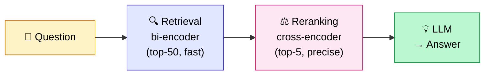

## You're probably optimizing in the wrong place

When a RAG isn't working well, here's what 90% of teams do: they change the prompt.

They rephrase the instructions, try different models, adjust the temperature. And sometimes it helps a little. But most of the time, that's not where the problem is.

Jason Liu, one of the most followed RAG experts, has a framing I find spot-on: *"Before touching anything, reach 97% recall in retrieval."*

97% recall means that in 97 out of 100 cases, the chunk containing the right answer is among the results you pass to the LLM. If you're not there, the best prompt in the world won't change a thing. The LLM cannot invent information that isn't in its context.

The real RAG optimization order is: **measure first, then retrieval, then generation**. Not the other way around. If you're not yet familiar with the basics of [how RAG works](mais-que-es-le-rag.md), start there before optimizing any component.

<!-- more -->

***

## Before optimizing: establish a baseline

This is the step everyone skips. And that's why RAG projects stagnate without anyone understanding why. Before even choosing which technique to apply, you need to know which layer is broken: before reaching for any of the 8 techniques below, identify which of the [4 technical causes of RAG failure](les-4-causes-techniques-echec-rag.md) is actually responsible, otherwise you risk optimizing the wrong component.

**The 3 essential metrics:**

- **Hit Rate**: is the right chunk among the top-K results? This is your base retrieval measure. If the right chunk isn't retrieved, everything else is pointless.
- **MRR (Mean Reciprocal Rank)**: is the right chunk ranked highly in the results? Being retrieved at position 1 vs. position 10 changes the quality of the final answer.
- **Faithfulness** (generation): is the generated answer actually grounded in the provided chunks, or is the LLM hallucinating?

**RAGAS in practice**

RAGAS is the standard library for evaluating a RAG pipeline end-to-end. It automatically computes these metrics from a reference set of question-answer pairs.

```python
from ragas import evaluate
from ragas.metrics import faithfulness, answer_relevancy, context_precision, context_recall
from datasets import Dataset

# Your evaluation set: questions + expected answers
eval_data = Dataset.from_dict({
    "question": ["your question 1", "your question 2"],
    "answer": ["generated answer 1", "generated answer 2"],
    "contexts": [["chunk1", "chunk2"], ["chunk3"]],
    "ground_truth": ["expected answer 1", "expected answer 2"],
})

result = evaluate(eval_data, metrics=[
    faithfulness,
    answer_relevancy,
    context_precision,
    context_recall,
])
print(result)
```

**The minimum viable set**: 30 to 50 questions representative of your users' real queries. You don't need a 10,000-example dataset to get a clear picture of where you stand. The recipe to [generate this dataset in 30 minutes](dataset-evaluation-rag-questions-synthetiques.md) fits in a few lines of code. I also cover this in [the 5 mistakes everyone makes with RAG](/blog/2026/02/21/les-5-erreurs-les-plus-fr%C3%A9quentes-avec-le-rag/) (it's mistake #5, the most silent one).

Once the baseline is established, here's the order in which to apply optimizations.

***

## Phase 1 — Improving the query before search

Vector retrieval encodes the meaning of your question and searches for similar chunks. The problem: user questions are often short, ambiguous, poorly phrased. And documents are long and rich in context.

This imbalance creates a representation problem: the embedding of a short question doesn't resemble the embedding of the document that answers it.

Pre-retrieval techniques attack this problem.

### Technique 1 — HyDE: search with a hypothetical document

**The mechanism**: instead of embedding your question, you first ask the LLM to generate a "hypothetical document" that would ideally answer that question. Then you embed this hypothetical document to search your index.

Why it works: a hypothetical document is semantically similar to a real document. The embedding of "here is how the ISO-27001 procedure works for remote access..." is much closer to real technical chunks than the embedding of "ISO-27001 remote access procedure?".

```python
from langchain_core.prompts import ChatPromptTemplate
from langchain_openai import ChatOpenAI

hyde_prompt = ChatPromptTemplate.from_template(
    "Write a short documentation excerpt that would precisely answer this question: {question}\n"
    "Answer directly, without an introduction."
)
llm = ChatOpenAI(model="gpt-4o-mini", temperature=0)

# The hypothetical document becomes your embedding query
hypothetical_doc = (hyde_prompt | llm).invoke({"question": question}).content
results = vectorstore.similarity_search(hypothetical_doc, k=5)
```

**Measured gain**: +5 to +15% on short and ambiguous queries.

**When to use it**: technical corpora with jargon, or when your users phrase very short questions ("ISO procedure?", "Redis config?"). Makes no difference on already well-formed questions.

---

### Technique 2 — Multi-Query + RAG-Fusion

**The mechanism**: generate N reformulations of the same question, run each reformulation in parallel, merge results with RRF.

The idea: if you ask the same question 5 different ways, you maximize the chances of hitting an angle that resembles the relevant chunks.

```python
from langchain.retrievers.multi_query import MultiQueryRetriever
from langchain_openai import ChatOpenAI

llm = ChatOpenAI(model="gpt-4o-mini", temperature=0)

retriever = MultiQueryRetriever.from_llm(
    retriever=vectorstore.as_retriever(search_kwargs={"k": 5}),
    llm=llm,
)
# Automatically generates 3 reformulations and merges the results
results = retriever.invoke("your question")
```

**Measured gain**: +5 to +10% recall on poorly phrased queries.

**When to use it**: when you analyze your logs and notice that users ask questions in unpredictable ways.

---

### Technique 3 — Step-Back Prompting

For very specific questions, retrieval sometimes fails because there's no chunk that talks about that exact case, but there are chunks that cover the general principle.

**The mechanism**: before searching on the specific question, you also generate an "abstract" version of the question and retrieve context on both.

Example:
- Specific question: "Why does my ada-002 embedding truncate at 512 tokens?"
- Step-back question: "How does the token limit work in embedding models?"

You run both searches and provide both contexts to the LLM.

**When to use it**: very technical or very specific questions that require principle-level context to be answered correctly.

***

## Phase 2 — Improving what you retrieve

### Technique 4 — Hybrid Search BM25 + vector

This is probably the optimization with the best gain-to-effort ratio. Vector alone systematically misses queries with business jargon, standards, product codes. BM25 captures them perfectly.

The benchmarks: +10% NDCG vs. vector alone (Microsoft Azure, BEIR), up to +48% when combined with reranking.

I dedicated an entire article to this technique (implementation with LangChain, LlamaIndex and Weaviate, detailed benchmarks, and when to choose SPLADE or BGE-M3 over classic BM25): **[Hybrid RAG BM25 + vector: how to implement it](rag-hybride-bm25-vectoriel.md)**.

---

### Technique 5 — Contextual Retrieval (Anthropic, 2024)

This is the technique that has produced the largest gains in every benchmark I've seen, and it's also the least known outside France.

**The problem it solves**: your chunks are anonymous. "Revenue increased by 3%"—which company? Over what period? Without this context, the embedding of that chunk is floating and hard to retrieve at the right moment.

**The mechanism**: before embedding each chunk, an LLM generates 50 to 100 tokens of context that situate the chunk within its original document.

```
<document>
{{ENTIRE_DOCUMENT}}
</document>

Here is the chunk to contextualize:
<chunk>
{{CHUNK}}
</chunk>

In 1 to 2 short sentences, situate this chunk within the document.
Do not repeat the content. Answer directly.
```

The final chunk = generated context + original chunk. This enriched text is what gets embedded.

**Anthropic benchmarks** (failure rate on top-20 chunks, baseline: 5.7%):

| Technique | Failure rate | Reduction |
|---|---|---|
| Baseline | 5.7% | — |
| + Contextual Embeddings | 3.7% | **−35%** |
| + Contextual BM25 | 2.9% | **−49%** |
| + Reranking | 1.9% | **−67%** |

**The cost**: one LLM call per chunk at ingestion. With Claude's prompt caching, ~€1 per million tokens. For most enterprise corpora, that's a few euros, one time.

I cover the full implementation in [the dedicated chunking article](chunking-optimal-rag.md).

***

## Phase 3 — Improving what you pass to the LLM

### Technique 6 — Reranking (cross-encoder)

This is the most effective post-retrieval optimization. And it comes down to an important architectural distinction. To choose a specific model (Cohere, BGE, Jina, Voyage), see the [reranker comparison with pricing and benchmarks](reranker-comparatif-cohere-bge-jina-voyage.md).

**Bi-encoder vs. cross-encoder:**

An embedding model (bi-encoder) encodes the question on one side, each chunk on the other, then compares vectors using cosine similarity. It's fast, but encoding happens separately: the question and the chunk never "see" each other in the same model pass.

A cross-encoder, on the other hand, takes the pair (question + chunk) as input and generates a single relevance score. The question and the chunk actually interact inside the model. Much more precise, but 100x slower.

**The 2-step solution:**

```python
from sentence_transformers import CrossEncoder

reranker = CrossEncoder("BAAI/bge-reranker-large")  # open-source, very good

# Step 1: broad and fast retrieval (50 candidates)
candidates = retriever.invoke(query, k=50)

# Step 2: precise reranking on the 50 candidates
pairs = [(query, chunk.page_content) for chunk in candidates]
scores = reranker.predict(pairs)

# Keep only the top 5 for the LLM
ranked = sorted(zip(scores, candidates), key=lambda x: x[0], reverse=True)
top_chunks = [chunk for _, chunk in ranked[:5]]
```



**Options:**
- `BAAI/bge-reranker-large`: open-source, excellent quality/cost ratio, runs locally
- `Cohere Rerank`: API, very strong performance, usage-based billing
- `JinaAI Reranker`: good performance on technical documents

**Measured gain**: Hit Rate 0.938 on LlamaIndex benchmarks (hybrid + bge-reranker combination). Azure AI Search measures +48% NDCG vs. BM25 alone with the hybrid + reranker combination.

**When to use it**: as soon as your retrieval returns too many correct candidates that are poorly ranked. Reranking is often the optimization that unblocks projects where "it finds the right docs, but the answer is still bad".

---

### Technique 7 — Context Compression + LongContextReorder

**The problem**: you pass 10 chunks to the LLM. But the useful information is buried in noise. And LLMs read long contexts poorly. Stanford showed in 2023 that models recall well what's at the beginning and end of context, but often miss what's in the middle.

This is known as "Lost in the Middle". (If you're wondering whether chunking into a RAG is still the right architecture at all versus simply using a large context window, the [long context vs RAG](long-context-vs-rag-quand-utiliser.md) comparison covers exactly when each approach wins.)

**Two complementary solutions:**

*LongContextReorder*: reorder the chunks before passing them to the LLM. Put the most relevant chunks first and last, the least relevant in the middle.

```python
from langchain.document_transformers import LongContextReorder

reorder = LongContextReorder()
reordered_chunks = reorder.transform_documents(retrieved_chunks)
```

*Context Compression*: filter within each chunk to keep only the sentences directly relevant to the question.

```python
from langchain.retrievers import ContextualCompressionRetriever
from langchain.retrievers.document_compressors import LLMChainExtractor
from langchain_openai import ChatOpenAI

compressor = LLMChainExtractor.from_llm(ChatOpenAI(model="gpt-4o-mini"))

compression_retriever = ContextualCompressionRetriever(
    base_compressor=compressor,
    base_retriever=retriever
)
# Returns only the relevant passages from each chunk
results = compression_retriever.invoke(query)
```

**When to use it**: LongContextReorder costs nothing (simple reordering), enable it systematically. LLM compression adds one LLM call per chunk: reserve it for cases where precision is critical.

***

## Phase 4 — Cross-cutting optimizations

### Technique 8 — Semantic Caching

This is the most cost-effective infrastructure optimization if your RAG has traffic.

**The mechanism**: instead of caching only identical queries (classic cache), you cache *similar* queries. "What is the refund procedure?" and "How do I get a refund?" are two different questions but semantically very close: they deserve the same answer.

Concretely: each query is embedded. Before launching the RAG pipeline, you check whether a similar query (cosine > 0.90) exists in the cache. If so, you return the cached answer directly.

```python
from gptcache import cache
from gptcache.embedding import OpenAI as OpenAIEmbedding
from gptcache.similarity_evaluation.distance import SearchDistanceEvaluation

cache.init(
    embedding_func=OpenAIEmbedding().to_embeddings,
    similarity_evaluation=SearchDistanceEvaluation(threshold=0.1),
    # threshold=0.1 in distance ≈ cosine similarity > 0.90
)
# From now on, similar LLM calls return the cached answer
```

**Redis benchmark**: 15x faster on repeated queries, −50% LLM cost.

**The key parameter**: the similarity threshold. Too low (0.85) → false positives, you return an answer to a different question. Too high (0.98) → few cache hits. 0.90–0.95 is generally the right trade-off.

**When to use it**: as soon as your log analysis shows that >20% of queries are variations of the same question. Typical on support chatbots, assisted FAQs, or internal dashboards.

Semantic caching operates at the RAG pipeline level. For cost reduction at the LLM level itself, the equivalent mechanism is [prompt caching](prompt-caching-reduire-cout-llm.md): Anthropic, OpenAI, and Gemini all support it natively, with discounts up to 90% on cached tokens.

***

## ROI table: where to start

| Technique | Measured gain | Effort | When to apply first |
|---|---|---|---|
| **Hybrid Search** | +10% Hit Rate | Low | As soon as you have jargon or acronyms |
| **Reranking** | +15–24% NDCG | Medium | If retrieval returns well-ranked noise |
| **Contextual Retrieval** | −35 to −67% failures | Medium | Anonymous chunks, missing context |
| **HyDE** | +5–15% | Low | Short and ambiguous queries |
| **Multi-Query** | +5–10% recall | Low | Users who phrase questions poorly |
| **Semantic Cache** | 15x latency, −50% cost | Medium | Repeated traffic >20% |
| **LongContextReorder** | Marginal but free | None | Systematically |
| **Context Compression** | Quality on noisy corpora | High | Critical precision, budget available |

**The order I apply on my projects:**

1. Measure the baseline (Hit Rate + faithfulness): without this, impossible to know what works
2. Hybrid Search — unbeatable gain/effort ratio
3. Reranking — the second most effective lever
4. Contextual Retrieval — if chunks lack context
5. Others based on specific needs

What we never optimize first: the prompt. If your retrieval doesn't return the right chunks, no prompt will compensate for that.

***

## FAQ

**Where to start to optimize a RAG in production?**

Start by measuring. Generate 30 to 50 questions representative of your real users, measure Hit Rate (is the right chunk retrieved?) and faithfulness (is the answer grounded in the context?). These two metrics will immediately tell you whether the problem is in retrieval or generation, and therefore which path to follow. Everything else before that step is blind optimization.

**Is RAGAS free?**

Yes, RAGAS is open-source (MIT). The library runs locally. However, metrics like Faithfulness and Relevance make calls to a judge LLM (by default GPT-4.1 or another model chosen upfront) to evaluate quality, which has a usage cost. For an evaluation of 50 questions, expect a few cents to a few euros depending on the judge LLM used. You can also use an open-source model as judge to reduce this cost. To know when the judge LLM is worth its cost and how to estimate it precisely, see [LLM-as-a-judge: the real cost in €](llm-as-a-judge-cout-evaluation.md).

**What's the difference between reranking and re-retrieval?**

Reranking takes the already-retrieved chunks and reorders them by actual relevance. Re-retrieval (present in some agentic patterns like CRAG) relaunches a new search if the initial results are judged poor. These are two different mechanisms: reranking improves ranking, re-retrieval changes the results. You can combine both: that's exactly what [Corrective RAG](agentic-rag-vs-rag-classique.md) does with a web fallback.

**Does optimization help if my data is poor quality?**

No. The techniques described here improve a RAG that already works correctly on good data. If your PDFs are poorly OCR'd scans, if your documents are badly structured, if your chunking cuts information at the wrong place: no optimization will compensate for that. The absolute priority remains data quality and chunking. I cover this in [the 5 RAG mistakes](/blog/2026/02/21/les-5-erreurs-les-plus-fr%C3%A9quentes-avec-le-rag/) (mistake #3) and in [the analysis of technical failure causes](/blog/2026/02/05/les-4-causes-techniques-dechec-dun-rag-et-comment-les-corriger/).

***

## Further reading

- **[What is RAG, really?](mais-que-es-le-rag.md)** — The fundamentals before optimizing, including the core pipeline these techniques improve
- **[How to evaluate a RAG in production](evaluer-rag-production-metriques-ragas.md)** — Set the baseline first: RAGAS, Hit Rate, and MRR metrics to measure whether each optimization actually helps
- **[Hybrid RAG BM25 + vector: how to implement it](rag-hybride-bm25-vectoriel.md)** — Technique 4, with full implementation across 3 stacks and the benchmarks behind the +10% claim
- **[Optimal chunking for your RAG](chunking-optimal-rag.md)** — The foundation before any optimization, with Chroma and Anthropic benchmarks
- **[PDF parsing for RAG](parsing-pdf-rag-extraction-documents.md)** — When optimization doesn't help, parsing is often the root cause: a real-world comparison of Docling, LlamaParse, and Unstructured
- **[Agentic RAG vs classic RAG](agentic-rag-vs-rag-classique.md)** — When optimization is no longer enough and you need to rethink the architecture entirely

***

If my articles interest you and you have questions or just want to discuss your own challenges, feel free to write to me at [anas@tensoria.fr](mailto:anas@tensoria.fr) — I enjoy talking about these topics!

You can also [book a call](https://cal.eu/anas-rabhi/rendez-vous-ianas) or subscribe to my newsletter :)


---

### About me

I'm **Anas Rabhi**, freelance AI Engineer & Data Scientist. I help companies design and deploy AI solutions (RAG, AI agents, NLP). [Read more about my work and approach](/en/a-propos/), or browse the [full blog](/en/blog/).

Discover my services at [tensoria.fr](https://tensoria.fr) or try our AI agents solution at [heeya.fr](https://heeya.fr).

<div style="text-align: center; margin: 40px 0; gap: 16px; display: flex; flex-wrap: wrap; justify-content: center;">
  <a href="https://cal.eu/anas-rabhi/rendez-vous-ianas" target="_blank" style="display: inline-block; background-color: #4F46E5; color: #ffffff; font-weight: bold; padding: 16px 32px; text-decoration: none; border-radius: 8px; font-size: 18px; letter-spacing: 0.8px; box-shadow: 0 6px 12px rgba(0, 0, 0, 0.2); transition: all 0.3s ease; border: none;">
    Book a call
  </a>
  <a href="https://anas-ai.kit.com/d8b1a255cc" target="_blank" style="display: inline-block; background-color: #222222; color: #ffffff; font-weight: bold; padding: 16px 32px; text-decoration: none; border-radius: 8px; font-size: 18px; letter-spacing: 0.8px; box-shadow: 0 6px 12px rgba(0, 0, 0, 0.2); transition: all 0.3s ease; border: none;">
    <span style="margin-right: 10px;">✉️</span> Subscribe to my newsletter
  </a>
</div>
