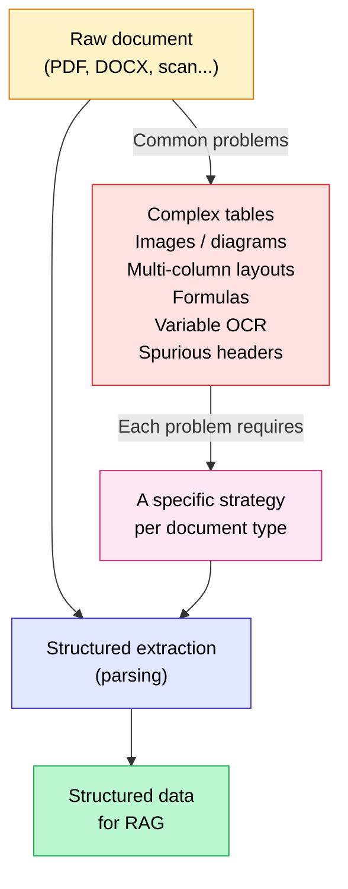
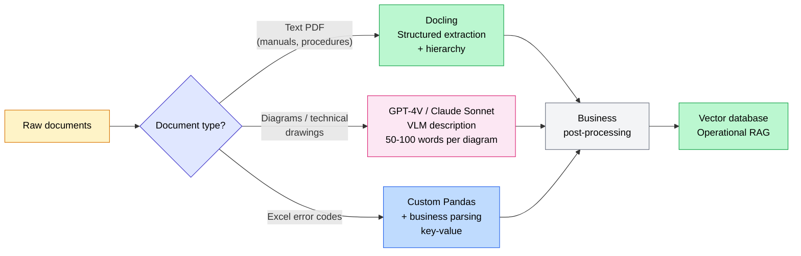

## The problem nobody wants to face

8 out of 10 RAG systems that fail in production have a parsing problem upstream. Not a model issue, not a prompt issue, not a retriever issue. Just a PDF that was read badly from the start.

That's the pattern I see on almost every project I work on. A company spends weeks choosing its language model, configuring its vector database, tuning its prompts — and the system still misses the mark. Because the source document was misread right at the beginning.

Parsing (structured data extraction from a document) is the most underestimated step in any RAG pipeline. If your information retrieval from source files is approximate, the sophistication of everything else doesn't matter — you're building on sand. A badly extracted table, confused columns, an ignored technical diagram — and your LLM generates confidently wrong answers.

In this article, I'll show you why document structuring is so hard, how the 4 major tools on the market actually compare, and what I learned across two very different projects: factory documentation at Continental, and an e-commerce site with thousands of product pages.

<!-- more -->

***

## Why there's no perfect method for extracting a PDF

This is the first question managers ask when you explain that they need a custom pipeline rather than an off-the-shelf tool. The answer is simple: **a PDF is not a data format. It's a display format.**

In a PDF, every character is positioned at (x, y) coordinates on a page. There is no concept of paragraph, column, table, or heading hierarchy. The file just knows that the letter "A" is 4.9 inches from the left edge and 1.3 inches from the top. That's it.

From there, every authoring tool produces radically different PDFs:

- A Word export produces structured tags that a parser can read.
- A paper scan produces an image that only OCR can read.
- A LaTeX document produces a complex layout with mathematical formulas.
- An InDesign file produces extremely fragmented text, optimized for print.

And in every one of these cases, **tables** remain the absolute nightmare. Implicit rows, merged cells, tables spanning multiple pages, repeated headers — a naive parser will often reconstruct a table in an order that makes no sense.

Other major traps:

- **Images and technical diagrams**: a text parser sees nothing. You need a Vision Language Model (VLM) to describe the content.
- **Multi-column layouts**: easy to mix up if the parser reads line by line rather than column by column.
- **Mathematical formulas**: often lost or converted into unreadable characters.
- **Headers and footers**: they pollute the main text if not filtered out.
- **OCR scans**: variable recognition quality can introduce silent errors that are hard to detect.

**Bottom line**: there is no single universal solution. There is a combination of tools to adapt to each document type in your corpus. Anyone selling you a "one-size-fits-all" PDF extraction solution is telling you a story.

***

## The 4 major parsing tools in 2026: what they actually do

Here's the comparison table I wish I'd found when I first started working on these projects. No marketing, no spin.

| Tool | Open source | Real strengths | Real weaknesses | Cost |
|---|---|---|---|---|
| **Docling** (IBM) | Yes (Apache 2.0) | Excellent on tables, document hierarchy, compact model (258M params), DocTags format, MCP integration | More technical initial setup, GPU recommended for speed | Free, GPU recommended |
| **Unstructured** | Yes (OSS) + paid cloud | Supports 30+ formats (PDF, DOCX, HTML, PPT, EML...), modular and flexible pipeline | Average performance on complex tables, OSS version limited vs cloud API | Free OSS, paid API |
| **LlamaParse** | No, API only | Excellent on complex tables, custom natural language instructions, native LlamaIndex integration, v2 released late 2025 | Per-page cost, cloud dependency, LlamaIndex lock-in | A few cents per page |
| **Marker** | Yes (GPL-3.0) | Very clean Markdown conversion, fast, good handling of equations and code | Weaker on very complex or multi-page tables | Free, GPU recommended |

***

### Docling: the IBM outsider gaining fast

Docling was born in the IBM Research Zurich labs and has surpassed 37,000 GitHub stars since its first public release. In January 2026, IBM shipped Granite-Docling, a major evolution that merges a Granite 3 language backbone with a SigLIP2 visual encoder.

What changes everything: instead of chaining OCR, layout analysis, and post-processing in a cascade, Docling integrates vision and language into a single compact model. The proprietary DocTags output format faithfully preserves structure: tables, code blocks, mathematical formulas, heading hierarchy.

**When I use it:** on structured technical documents (reports, manuals, standards), corpora with a lot of numerical tables, and when I want a 100% local pipeline with no cloud dependency. It's been my default choice since early 2026.

***

### Unstructured: the format chameleon

Unstructured is the tool I recommend when format diversity is the real problem. 30+ natively supported formats, a well-documented cloud API, and a pipeline architecture that lets you insert custom processing steps.

**Its real limitation:** the open source version is deliberately less powerful than the cloud API. On complex tables, results can be disappointing. For simple self-hosted needs, it gets the job done. For production with critical documents, you'll often end up on the paid API.

**When I use it:** when the corpus mixes very heterogeneous formats (PDF + emails + presentations + Word files) and no other tool covers the full spectrum.

***

### LlamaParse: the power of custom instructions

LlamaParse shipped its v2 in late 2025 with a significant rewrite. The big strength: you can give it natural language instructions explaining how to handle your specific documents. "In this document, the first column is always a product ID, the second a description, ignore bold rows which are section headers." It understands and adapts its extraction accordingly.

The benchmarks are strong on complex tables. In an A/B test on 10,000 RAG queries, combining LlamaParse with LlamaIndex reduced hallucination rate by 42% compared to naive parsing.

**Its real limitation:** cost adds up at scale. For 10,000 complex pages, the bill can quickly exceed €300–500. And if you're not using LlamaIndex, the integration is less smooth.

**When I use it:** for the 20% most complex documents in a corpus, when tables are critical (financial, technical with reference values), and when integration time needs to be short.

***

### Marker: the Markdown machine

Marker is the simplest tool to understand: it converts your PDFs into clean Markdown, quickly. Very good on documents with dense text, LaTeX formulas, and code. Formatting is preserved remarkably well.

**Its real limitation:** on very complex tables (merged cells, multi-column, multi-page), it can produce approximate Markdown. That's not its strong suit.

**When I use it:** for academic reports, technical documentation heavy on code and formulas, or when I want a clean output with minimal post-processing.

***

## Client case: Continental — parsing factory documentation to resolve machine errors

This is the project that taught me the most about the limits of generic approaches.

Continental, a leading automotive supplier, holds large volumes of PDF documentation: maintenance manuals (200 to 800 pages, often multilingual), technical electrical diagrams in PDF format, Word procedures, and Excel spreadsheets of error codes. The mission: allow line operators to ask a question like "error code E-241 on line 3, what should I do?" and get an answer grounded in the actual documentation.

### Document types encountered

- **PDF manuals**: bulky, structured but with multi-page parameter tables, cross-references between chapters, and versions in 3 languages sometimes within the same file.
- **Electrical diagrams**: PDFs that are essentially vector images. No text parser can extract useful information from them.
- **Excel error code spreadsheets**: merged cells, cross-references between tabs, conditional formulas. A generic text parser would produce pure noise.
- **Word procedures**: the simplest to handle, but with critical correspondence tables.

### Specific problems encountered

The first instinct was to try Unstructured on the entire corpus. Result: machine parameter tables were reconstructed in the wrong order, merged cells became duplicates, and electrical diagrams were simply ignored. The initial Hit Rate was 58% — in an industrial context, that's not production-ready.

### Final approach: custom multi-tool pipeline

We abandoned the idea of a single parser. The pipeline we built:

- **Docling** for structured text extraction from manuals and procedures: it preserves heading hierarchy, correctly reconstructs parameter tables, and outputs a clean format ready for chunking.
- **GPT-4V (then Claude Sonnet depending on the case)** to describe the electrical diagrams. Each diagram is sent to the VLM with a domain-specific prompt: "Describe this electrical diagram in 3–5 sentences, identifying the main components, critical connections, and visible reference codes." The text description is then added to the corresponding chunk in the documentation.
- **Custom Pandas business parsing** for the Excel files: tab-by-tab extraction, merged cell handling, reconstruction of error code / description / corrective action relationships as structured key-value pairs.
- **Specific post-processing** for error codes: format normalization (E-241, E241, Err241 all map to the same code), metadata enrichment (production line affected, severity, procedure update date).

### The result

**Hit Rate went from 58% (naive parsing) to 91% (custom pipeline).** Operational feedback also showed 60% time savings for operators when searching for information during a breakdown.

What truly changed the outcome: processing diagrams with a VLM. Most industrial documentation contains critical information locked inside technical drawings. Ignoring them makes the RAG blind to a significant portion of the domain knowledge it's supposed to exploit.

***

## Client case: e-commerce — extracting HTML and processing it cleanly

The second case is radically different. No PDFs, no industrial documents — instead, an e-commerce site with several thousand pages: product sheets, blog articles, category pages, delivery and return policies, FAQ.

The goal: an assistant capable of answering customer questions like "does this product come in blue size XL?" or "what's the delivery time for Lyon?" based on the site's actual data.

### The specific problems with e-commerce HTML

The HTML of an e-commerce site is not content — it's 80% structure, navigation, scripts, and boilerplate for 20% of real information.

- **Structural noise**: header, footer, menus, promotional banners, cookie consent popups, analytics scripts — a naive parser grabs everything and drowns useful information in noise.
- **Product specifications in HTML tables**: spec tables (dimensions, weight, materials, available colors) often become unreadable flat text when you apply a simple `get_text()`.
- **Product variants managed in JavaScript**: size and color options are often loaded dynamically. A static parser doesn't see them.
- **Paginated customer reviews**: retrieving reviews requires navigating sections that load via AJAX.

### The approach

Extracting information from this HTML corpus required a very different pipeline from the industrial case:

**Step 1: clean, targeted crawl.** Start from the XML sitemap to identify relevant URLs, with pattern-based filtering: `/product/`, `/blog/`, `/category/` — yes. `/my-account/`, `/cart/`, `/checkout/` — no. This immediately cuts the volume to process in half.

**Step 2: extract main content with Trafilatura.** [Trafilatura](https://trafilatura.readthedocs.io/) is a Python tool specialized in extracting the main content of a web page while eliminating boilerplate. It does a remarkable job on blog articles and text-heavy pages. For simple pages, it's a strong replacement for a generic BeautifulSoup approach.

**Step 3: custom specification table handling with BeautifulSoup.** For product pages, we retrieve `<table>` tags or characteristic lists and convert them into explicit key-value pairs. "Available colors: navy blue, burgundy red, black" — rather than a poorly converted HTML table.

**Step 4: Playwright for JavaScript.** For dynamically loaded product variants, we use [Playwright](https://playwright.dev/) in headless mode: load the page in a real browser, wait for JavaScript to execute, then retrieve the full DOM. Slower, but essential to capture real-time stock options.

**Step 5: structured storage with rich metadata.** Each product page is stored as structured Markdown with explicit metadata: category, price, size availability, delivery time by region, customer review rating. This metadata enables precise filtering at retrieval time.

For more on how to structure your chunks after extraction, the article on [optimal RAG chunking](/en/blog/posts/chunking-optimal-rag/) details strategies adapted to each content type.

### The result

Hit Rate on customer questions about product characteristics went from 61% to 88%. The difference came mainly from two things: product variants correctly extracted, and specification tables converted into structured natural language rather than HTML soup.

***

## How I choose my parsing tool today

Here's the decision matrix I apply on every new project. It's not set in stone, but it covers 95% of the cases I encounter.

| Document type | Recommended approach | Why |
|---|---|---|
| Standard text PDFs (reports, contracts, standards) | **Docling** or **Marker** | Good structure handling, clean output, 100% local |
| PDFs with complex tables (financial, technical) | **LlamaParse** with custom instructions, or Docling + post-processing | LlamaParse handles nested tables better with instructions |
| Multi-format corpus (PDF + DOCX + PPT + emails) | **Unstructured** | 30+ format support, modular pipeline |
| PDFs with diagrams, technical drawings, charts | **Dual pipeline**: text parser + VLM for images | A parser alone is blind to visual content |
| HTML, web pages, e-commerce sites | **Trafilatura** + custom BeautifulSoup | Web-specialized, eliminates boilerplate efficiently |
| Excel / CSV | **Pandas** with custom business logic | Never a generic text parser on tabular data |
| Scanned PDFs (poor OCR quality) | **Docling** (with integrated OCR module) or **Amazon Textract** | Robust recognition on degraded scans |

**The rule I apply systematically**: I start by analyzing a sample of 20 to 30 documents from the actual corpus before choosing a tool. No generic benchmarks, no demos with clean PDFs. Real production documents, with their real imperfections.

***

## The chunking trap after parsing

Extracting data from your documents is only the first step. Once your PDFs are correctly read and structured, you still need to split them intelligently for retrieval.

Chunking is the step that follows directly from parsing. And it's a project in its own right: chunk size, splitting method, overlap handling, context preservation between paragraphs. Good parsing with bad chunking still produces a disappointing RAG.

I've detailed chunking strategies in the article on [optimal RAG chunking](/en/blog/posts/chunking-optimal-rag/). This parsing step sits at the very beginning of a [retrieval-augmented generation](mais-que-es-le-rag.md) pipeline — if the raw text is wrong from the start, the rest of the system cannot compensate.

***

## What good parsing actually costs

The question managers always ask last, when it should be asked first. Here's a realistic budget for an enterprise RAG project with around 10,000 documents.

**Custom self-hosted pipeline (Docling + VLM for images):**

- Development: 1 to 2 weeks of work, depending on document type complexity.
- Initial ingestion cost: approximately €50 in VLM API calls (GPT-4V or Claude Sonnet) to describe images and diagrams.
- Runtime cost: €0 (everything runs locally after ingestion).
- Maintenance: budget roughly 1 day per month when document formats evolve (new template, new ERP).

**LlamaParse API only:**

- Development: a few hours — integration with LlamaIndex is very fast.
- Ingestion cost for 10,000 simple-to-complex pages: between €100 and €500 depending on complexity.
- Runtime cost: €0 (ingestion is a one-shot operation).
- Maintenance: minimal, the API absorbs format changes.

**Hybrid solution (the best cost/quality ratio in practice):**

- Docling for 80% of simple-to-moderately complex documents: €0 in API costs.
- LlamaParse for the 20% of critical documents with complex tables: approximately €50–100.
- Development: 1 week.

**The most important hidden cost: maintenance.** When your client switches ERP and all PDF exports change format, your pipeline needs to adapt. When a supplier changes their documentation template, same story. Always budget for this upkeep in the project TCO. A document structuring pipeline isn't a one-shot — it's a living system.

For a comprehensive look at the metrics to measure the impact of your parsing improvements, the article on [how to evaluate a RAG in production](/en/blog/posts/evaluer-rag-production-metriques-ragas/) gives you the concrete tools.

***

## FAQ

**How do you extract data from a PDF for AI?**

The method depends on the PDF type. For a standard text PDF, tools like Docling or Marker produce quality structured output. For PDFs with complex tables, LlamaParse with custom instructions will be more effective. For scanned PDFs, you need a robust OCR pipeline before even thinking about structuring. In all cases, start by analyzing a real sample of your documents before choosing a tool.

**Why isn't LangChain enough to properly parse a PDF?**

LangChain includes basic PDF loaders (PyPDF, PDFMiner) that do raw text extraction. They work on simple PDFs. But they have no logic for reconstructing tables, no image handling, and sometimes approximate text reading order on complex layouts. LangChain is an orchestration layer — for serious data extraction, you need a dedicated parsing tool upstream.

**Docling or LlamaParse: which one to choose?**

Docling if you want a 100% local pipeline, no per-use cost, and your documents are text PDFs with structured numerical tables. LlamaParse if you have very complex tables (nested, multi-level merged cells), you're already using LlamaIndex, and integration speed matters more than per-use cost. For most projects in 2026, Docling covers 80% of needs.

**How do you handle complex tables in RAG?**

Three approaches depending on complexity. For simple tables, Docling or Marker reconstruct them well. For complex tables with merged cells and multi-page spans, LlamaParse with custom instructions is more effective. For tables in Excel files, Pandas with custom business logic is the only reliable approach — never a generic PDF parser on structured data.

**Do you need a VLM to parse PDFs with diagrams?**

Yes, without exception. No text parser can extract the information contained in a technical drawing, electrical schematic, or chart. A Vision Language Model (GPT-4V, Claude Sonnet, or Qwen2-VL locally) must describe these elements in a few sentences. That text description is then added to the corresponding chunk. Ignoring images in a technical document makes your RAG blind to a substantial portion of the knowledge it's supposed to exploit.

**What parser for scanned PDFs?**

Docling includes an OCR module that correctly handles most standard-quality scans. For very poor quality scans (old documents, degraded photocopies), Amazon Textract or Google Document AI produce more robust results, but at higher cost. In all cases, anticipate a residual error rate and plan for human validation on critical extractions.

**How do you extract data from an Excel file for RAG?**

Pandas with custom business parsing logic. Never a generic parser. Enterprise Excel files have merged cells, formulas, cross-references between tabs, multi-row headers — structuring data from an Excel file requires understanding the document's semantics: which column is an identifier, which row is a header, how tabs reference each other. This logic is specific to each file and cannot be blindly automated.

**How do you parse HTML for RAG?**

Trafilatura for extracting the main content (articles, descriptions). BeautifulSoup for spec tables and structured data. Playwright when elements are loaded dynamically in JavaScript (product variants, real-time prices, paginated reviews). And always a targeted crawl by URL patterns: don't parse your entire site — parse only the pages that contain information useful for your users' questions.

**Can parsing be 100% automated?**

No, and any solution claiming otherwise is either naive or dishonest. Automatic extraction reaches 85–95% quality on well-defined, homogeneous corpora. The remainder requires human validation — particularly for critical tables where an extraction error would have business consequences (machine parameter values, financial data, regulatory codes). The real question isn't "can we automate everything?" but "which documents should I validate manually?"

**What does a good parsing pipeline cost for 10,000 documents?**

Between €0 and €500 in direct costs depending on the approach, plus 1 to 2 weeks of development. A self-hosted Docling pipeline costs only development time. LlamaParse for complex documents costs €100–500 in API calls for the initial ingestion. The hybrid solution (Docling for 80% + LlamaParse for 20%) is often the best trade-off. But the real 12-month cost includes maintenance — budget at least 1 day per month when document formats evolve.

***

## Further reading

- **[What is RAG?](mais-que-es-le-rag.md)** — understanding the full pipeline that parsing feeds into: embeddings, retrieval, generation
- **[Optimal RAG Chunking](chunking-optimal-rag.md)** — the step directly after parsing, with benchmarks and strategies by content type
- **[How to Evaluate a RAG in Production](evaluer-rag-production-metriques-ragas.md)** — for concretely measuring the impact of better parsing on your Hit Rate and faithfulness metrics
- **[Optimizing Your RAG: 8 Techniques](optimiser-rag-techniques.md)** — the logical next step once parsing and chunking are in order
- **[Embeddings in RAG](embeddings-rag-comprendre-importance.md)** — how the text extracted by parsing gets turned into vectors for semantic retrieval

***

If my articles interest you and you have questions, or just want to talk through your own challenges, feel free to reach out at [anas@tensoria.fr](mailto:anas@tensoria.fr) — I enjoy these conversations.

You can also [book a call](https://cal.eu/anas-rabhi/rendez-vous-ianas) or subscribe to my newsletter.

---

### About me

I'm **Anas Rabhi**, freelance AI Engineer & Data Scientist. I help companies design and ship AI solutions (RAG, agents, NLP). [Read more about my work and approach](/en/a-propos/), or browse the [full blog](/en/blog/).

Discover my services at [tensoria.fr](https://tensoria.fr) or try our AI agents solution at [heeya.fr](https://heeya.fr).

  <a href="https://cal.eu/anas-rabhi/rendez-vous-ianas" target="_blank" style="display: inline-block; background-color: #4F46E5; color: #ffffff; font-weight: bold; padding: 16px 32px; text-decoration: none; border-radius: 8px; font-size: 18px; letter-spacing: 0.8px; box-shadow: 0 6px 12px rgba(0, 0, 0, 0.2); transition: all 0.3s ease; border: none;">
    Book a call
  </a>
  <a href="https://anas-ai.kit.com/d8b1a255cc" target="_blank" style="display: inline-block; background-color: #222222; color: #ffffff; font-weight: bold; padding: 16px 32px; text-decoration: none; border-radius: 8px; font-size: 18px; letter-spacing: 0.8px; box-shadow: 0 6px 12px rgba(0, 0, 0, 0.2); transition: all 0.3s ease; border: none;">
    ✉️ Subscribe to my newsletter
  </a>

