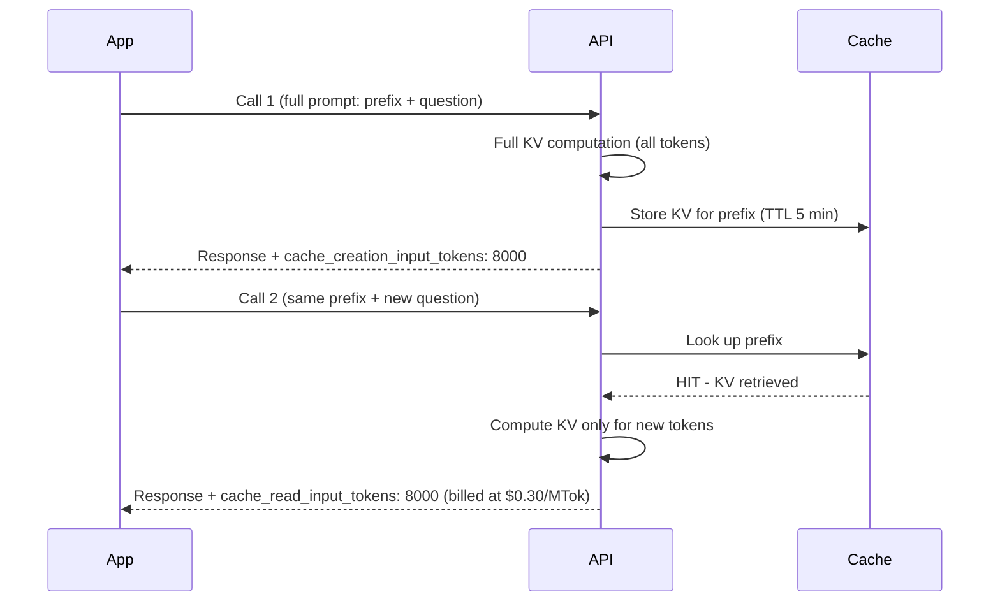
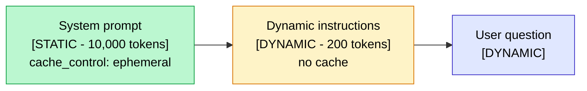

## If you're paying full price for LLM calls in 2026, you're leaving 50 to 90% savings on the table

Prompt caching has become **the first cost optimization to implement** in any LLM project running in production, and oddly enough, nobody talks about it enough.

What I keep seeing on the projects I work on: teams spend hours comparing models, negotiating volume discounts with providers, looking for open-source alternatives. And all along, their code is paying full price for the same 10,000-token system prompt on every single call, without ever having heard of `cache_control`.

In this article, you'll see how prompt caching works at the technical level (the KV cache), how the three major providers implement it differently (Anthropic, OpenAI, Gemini), the patterns that genuinely cut the bill, and a concrete ROI calculation on a real use case.

<!-- more -->

***

## Why your LLM calls cost more than they should

Every LLM call bills you for input and output tokens. On output tokens, there's not much you can do: the model is generating, and the length depends on your needs.

On input tokens, on the other hand, there's a structural problem most teams ignore.

**In production, prompts grow large fast.** A typical system prompt includes: role definition and constraints, few-shot examples to guide the format, sometimes RAG documents injected into context, and conversation history. You quickly reach 5,000, 20,000, sometimes 50,000 tokens.

The problem: on every call, the LLM recomputes **everything from scratch**, even if 90% of the prompt is identical to the previous call. It's like having to pay the full price of a restaurant menu with every bite, with no discount for what you've already had.

Prompt caching solves exactly that. You pay for the large stable prefix once, then a fraction of the normal price on every subsequent call that reuses it.

Concretely, with Claude Sonnet 4.6:

| Token type | Normal price | Cache hit price |
|---|---|---|
| Standard input | $3/MTok | $3/MTok |
| Cache write (5 min) | $3.75/MTok | one time only |
| Cache read (hit) | **$0.30/MTok** | that's **-90%** |

***

## How it works technically: the KV cache

To understand why this works, you need to grasp what an LLM does when it processes your prompt.

A Transformer model computes, for each token, what are called **Key-Value pairs**. These pairs encode the meaning of each token in relation to all preceding tokens. This is the attention mechanism that lets the model understand context.

The good news: **once these pairs are computed for the first N tokens, they don't need to be recomputed if those N tokens stay identical**. This is what deep learning researchers call the KV cache.

Providers now expose this mechanism at the API level. You declare that a prefix is cacheable, the provider stores its KV pairs on their side, and subsequent calls with the same prefix only compute the new tokens.



**The critical point:** the cache is byte-for-byte sensitive. A single extra space, a different capitalization, a timestamp that changes in the prompt: complete miss and you pay full price again. Prefix stability is non-negotiable.

***

## Support and differences by provider

The three major providers implement prompt caching with very different philosophies.

| Provider | Activation | Cache duration | Write cost | Read cost | Min tokens |
|---|---|---|---|---|---|
| **Anthropic Claude** | Manual (`cache_control`) | 5 min (default) or 1h (extra cost) | +25% of normal price | 10% of normal price | 1,024 (Sonnet 4.x) or 4,096 (Opus, Haiku 4.5) |
| **OpenAI** | Automatic | 5 to 60 min (variable) | Same as normal price | 50% of normal price | 1,024 tokens |
| **Google Gemini** | Manual (Context Caching API) | 1h by default (configurable) | Hourly storage cost | ~25% of normal price | 32,768 tokens (Pro), 4,096 (Flash) |

The real differences to understand:

**Anthropic** is the most controllable. You can place up to 4 cache breakpoints in your prompt (tools, system, messages). You choose exactly what gets cached. Reading from cache costs only 10% of the normal price: the steepest discount of the three. The downside: you have to activate it manually, and writing to the cache costs 25% more than normal. If your hits are rare, you end up paying more.

**OpenAI** is the simplest: nothing to code. As soon as your system prompt exceeds 1,024 tokens and you reuse it, OpenAI handles caching automatically. The discount is 50% on cached tokens, not 90%. Less control, but zero effort.

**Gemini** takes a different approach with its separate Context Caching API. You explicitly create a cache object and then reference it in your calls. The 32,768-token minimum (Pro) is high: good ROI only on very large, very frequently reused contexts. Gemini 2.5 Pro and Flash also support automatic implicit caching since 2026, but with less control.

***

## The code in practice

### Anthropic Claude (Python)

```python
from anthropic import Anthropic

client = Anthropic()

# LONG_LEGAL_CONTEXT: 50,000 tokens of case law
response = client.messages.create(
    model="claude-sonnet-4-6",
    max_tokens=1024,
    system=[
        {
            "type": "text",
            "text": "You are an expert assistant in French employment law.",
        },
        {
            "type": "text",
            "text": LONG_LEGAL_CONTEXT,
            "cache_control": {"type": "ephemeral"},  # this block is cached
        },
    ],
    messages=[{"role": "user", "content": "Notice period for a senior CDI contract?"}],
)

# Check whether the cache was used
usage = response.usage
print(f"Tokens written to cache: {usage.cache_creation_input_tokens}")
print(f"Tokens read from cache: {usage.cache_read_input_tokens}")
print(f"Tokens billed at full price: {usage.input_tokens}")
```

To enable the one-hour TTL (recommended when your traffic is spread out):

```python
"cache_control": {"type": "ephemeral", "ttl": "1h"}
# Note: write cost is 2x normal instead of 1.25x
# Only use this if your calls are more than 5 minutes apart
```

### OpenAI (automatic, nothing to do)

```python
from openai import OpenAI

client = OpenAI()

# First call: populates the cache automatically
# Subsequent calls with the same prefix: automatic cache hit
response = client.chat.completions.create(
    model="gpt-4o",
    messages=[
        {
            "role": "system",
            "content": LONG_SYSTEM_PROMPT,  # must exceed 1,024 tokens
        },
        {"role": "user", "content": "My user question"},
    ],
)

# Check cached tokens
cached = response.usage.prompt_tokens_details.cached_tokens
total_input = response.usage.prompt_tokens
print(f"Cached tokens: {cached} / {total_input} total")
print(f"Hit rate: {cached / total_input * 100:.1f}%")
```

### Gemini Context Caching

```python
from google import genai
from google.genai import types
import datetime

client = genai.Client()

# Create the cache once
cached = client.caches.create(
    model="gemini-2.5-pro",
    config=types.CreateCachedContentConfig(
        contents=[LONG_DOCUMENT],
        system_instruction="You are an expert assistant.",
        ttl=datetime.timedelta(hours=1),
        display_name="my-document-cache",
    ),
)

print(f"Cache created: {cached.name}")
print(f"Expires at: {cached.expire_time}")

# Use the cache in subsequent calls
response = client.models.generate_content(
    model="gemini-2.5-pro",
    contents="Summarize the key points of this document",
    config=types.GenerateContentConfig(
        cached_content=cached.name,
    ),
)

# Metrics
print(f"Cached tokens: {response.usage_metadata.cached_content_token_count}")
```

***

## 5 patterns that genuinely cut the bill

### Pattern 1: long system prompt and few-shot examples cached

This is the most universal pattern. Many applications have a system prompt of 5,000 to 50,000 tokens: detailed role, business constraints, few-shot examples to guide the response format. This content is 100% identical across all calls.

Without caching: you pay full price on every call.
With caching: you pay once for 5 minutes (or 1 hour), then 10% of the normal price on each hit.

**Typical gain: 80 to 90% on input tokens.**

The golden rule: put the cacheable prefix first in the system block, dynamic instructions after the breakpoint.



### Pattern 2: RAG with stable context

In an enterprise RAG, certain documents are systematically injected into every prompt: company policy, business glossary, response charter, examples of handled cases. These documents can weigh 10,000 to 100,000 tokens.

They are perfect cache candidates: identical across all users, stable over time.

The dynamic part (the chunk retrieval specific to the question) stays outside the cache, after the breakpoint.

**Typical gain: 30 to 60% depending on the stable-to-dynamic context ratio.**

I cover this in more detail in [8 techniques to optimize your RAG](optimiser-rag-techniques.md), specifically technique 5 (Contextual Retrieval), which mentions prompt caching as a lever for reducing ingestion cost.

### Pattern 3: long conversations (chatbots)

In a chatbot, every turn re-sends the complete history to maintain context. After 10 turns, the history often represents 80% of the total prompt.

With caching, you mark the system prompt and the first conversation messages as cacheable. On each new turn, only the latest messages are billed at full price.

**Typical gain: 50 to 70% on conversations of 20 turns and more.**

The key: never modify messages already in the cached section. Always append new messages after the last breakpoint.

### Pattern 4: agents with long tool definitions

An agent with 20 tools typically has 5,000 to 20,000 tokens just to describe its tools (names, descriptions, JSON Schema parameters). These definitions are identical on every call.

With Anthropic, tools can be explicitly cached using `cache_control` on the tools list. This is often the first breakpoint to place.

**Typical gain: significant for agents that make 10 or more calls per task.**

### Pattern 5: batch processing with a stable prompt

For extraction or classification on 10,000 documents with the same system prompt: prompt caching applies to each document in the batch.

Combined with the Batch API (50% additional discount at OpenAI and Anthropic), the savings stack up.

| Lever | Reduction |
|---|---|
| Prompt caching alone | -90% on cached tokens |
| Batch API alone | -50% on all tokens |
| Prompt caching + Batch | Very powerful combination |

For a corpus of 10,000 documents with an 8,000-token system prompt: **caching + batch can cut the bill by 15 to 20x** compared to naive real-time calls.

***

## Measuring the real gain on your calls

The first reflex: verify that the cache is actually active and measure your hit rates.

**Anthropic:**

```python
def compute_cache_stats(usage):
    total_input = (
        usage.input_tokens
        + usage.cache_creation_input_tokens
        + usage.cache_read_input_tokens
    )
    hit_rate = usage.cache_read_input_tokens / total_input if total_input > 0 else 0

    # Actual savings on this call (vs normal price)
    savings_usd = usage.cache_read_input_tokens * (3 - 0.30) / 1_000_000

    return {
        "hit_rate": f"{hit_rate:.1%}",
        "cached_tokens": usage.cache_read_input_tokens,
        "savings_usd": f"${savings_usd:.4f}",
    }
```

**OpenAI:**

```python
cached = response.usage.prompt_tokens_details.cached_tokens
total = response.usage.prompt_tokens
hit_rate = cached / total if total > 0 else 0
```

**Gemini:**

```python
cached = response.usage_metadata.cached_content_token_count
total = response.usage_metadata.prompt_token_count
hit_rate = cached / total if total > 0 else 0
```

**What to expose in your LLMOps dashboard** (Langfuse, Phoenix, Helicone):

- Hit rate per endpoint
- Cached tokens vs tokens billed at full price
- Savings in dollars per day
- Alerts if the hit rate drops (a sign that the prefix changed unintentionally)

***

## Pitfalls to avoid

**Pitfall 1: a single character invalidates the entire cache.** The cache is compared byte by byte. A timestamp in the system prompt, a version string that changes, an extra space: complete miss. Audit your templates to identify everything that varies unintentionally.

**Pitfall 2: caching below the minimum threshold.** Every provider has a minimum. If your system prompt is 800 tokens and you're targeting Sonnet 4.6 (minimum 1,024 tokens), the cache will never activate. Check `cache_creation_input_tokens` in the response: if it's 0 on the first call, you've hit a threshold miss.

**Pitfall 3: paying for cache writes with no hits.** With Anthropic, writing to the cache costs 25% more than normal. If your traffic is too low or too irregular to generate hits before the TTL expires, you end up paying more. Caching becomes profitable from the second call with the same prefix within the TTL window.

**Pitfall 4: TTL too short for sparse traffic.** With Anthropic's 5-minute TTL, if your app receives one call every 10 minutes, the cache will consistently expire between calls. Switch to the one-hour TTL in that case (write cost doubles, but it pays off with 3 or more hits per hour).

**Pitfall 5: mixing user-specific data into the cached section.** The cached section must be identical across all calls. If you slip a user's name or their history into the system prompt before the breakpoint, the cache will be a miss for every different user. Always place request-specific information **after** the last breakpoint.

***

## Combining prompt caching with other optimizations

Prompt caching is the number one lever, but it sits within a hierarchy of optimizations. Here's the order I apply on my projects:

| Priority | Optimization | Gain | Effort |
|---|---|---|---|
| 1 | **Prompt caching** | 50 to 90% on input tokens | Low (2 lines of code) |
| 2 | **Model routing** | 80% on simple tasks | Medium |
| 3 | **Batch API** | 50% additional | Low |
| 4 | **Semantic caching** | Variable (see technique 8 in [8 RAG techniques](optimiser-rag-techniques.md)) | Medium |
| 5 | **Prompt compression** | 20 to 30% | Medium (quality risk) |
| 6 | **Fine-tuning a small model** | Huge over the long term | High |

**Model routing** deserves a special mention. On a system that handles very varied requests, systematically routing everything to Claude Opus or GPT-4o is wasteful. A lightweight classifier (or the LLM itself) can route simple questions to Haiku, Flash, or GPT-4o-mini. Combined with caching, the savings accumulate fast.

I detail this decision logic in [the article on Agentic RAG vs classic RAG](agentic-rag-vs-rag-classique.md): the principle is the same, matching model capability to the actual complexity of the task.

***

## ROI calculation on a real-world case

Here's a concrete calculation for a SaaS app running a chatbot in production.

**Assumptions:**
- 50,000 calls per day
- System prompt of 8,000 tokens (stable)
- Average conversational context of 4,000 tokens (dynamic)
- Model: Claude Sonnet 4.6 ($3/MTok input, $15/MTok output)
- Average output size: 500 tokens

**Without prompt caching:**

| Line item | Calculation | Cost/day |
|---|---|---|
| Input (12,000 tokens x 50,000 calls) | 600M tokens x $3/MTok | **$1,800/day** |
| Output (500 tokens x 50,000 calls) | 25M tokens x $15/MTok | **$375/day** |
| **Total** | | **$2,175/day** |

That's **$65,250/month** in input + output.

**With prompt caching (90% hit rate on the 8,000 stable tokens):**

| Line item | Calculation | Cost/day |
|---|---|---|
| Cache writes (1 miss/5 min x 8,000 tokens) | ~144 misses/day x 8,000 tokens x $3.75/MTok | **~$4/day** |
| Cache reads (49,856 hits x 8,000 tokens) | 399M tokens x $0.30/MTok | **~$120/day** |
| Dynamic input (4,000 tokens x 50,000 calls) | 200M tokens x $3/MTok | **$600/day** |
| Output (unchanged) | 25M tokens x $15/MTok | **$375/day** |
| **Total** | | **~$1,099/day** |

**Savings: roughly $1,076/day, or ~$32,000/month.**

For an implementation that takes 30 minutes of development (adding `cache_control` in the right places), this is probably the highest hourly ROI you can get on an LLM project in production.

***

## FAQ

**What is prompt caching?**

Prompt caching is a mechanism that lets you reuse computations already performed for an identical prompt prefix across multiple LLM calls. Instead of recomputing the Key-Value pairs for each token on every call, the provider stores these computations server-side and reuses them if the prefix is identical. You only pay for the new tokens.

**How much can you save with prompt caching?**

The reduction reaches 90% on cached tokens with Anthropic (0.10x the normal price), 50% with OpenAI, and about 75% with Gemini. In practice, for an app with a large stable system prompt, total input cost savings range from 50 to 85% depending on the ratio of stable to dynamic tokens.

**Automatic OpenAI caching vs manual Anthropic: which is better?**

It depends on the context. OpenAI is ideal if you want zero effort and an immediate gain. Anthropic offers more control (4 breakpoints, configurable TTL, 90% vs 50% discount) but requires explicit coding. For projects with complex prompts and high volume, Anthropic is often more cost-effective. For a quick implementation, OpenAI wins.

**How long does a prompt cache last?**

With Anthropic: 5 minutes by default, 1 hour with the extended TTL option (write cost doubles). With OpenAI: between 5 and 60 minutes depending on server load, not configurable. With Gemini: 1 hour by default, configurable up to several days.

**Does prompt caching degrade response quality?**

No. The cache stores only the attention computations on the prefix. The model generates exactly the same response it would have generated without the cache: the Key-Value pairs are identical, only their computation is skipped. Quality is strictly equivalent.

**Do you pay more to activate prompt caching?**

With Anthropic, writing to the cache costs 25% more than normal (or 2x for the 1-hour TTL). If you never get hits, you pay more. Caching becomes profitable starting from the second call within the TTL window. With OpenAI and Gemini (implicit caching), there's no write surcharge.

**How do you know if your prompt is actually being cached?**

With Anthropic: check `cache_creation_input_tokens` (tokens written to cache) and `cache_read_input_tokens` (tokens read from cache) in `response.usage`. If both are 0 on the first call, your prompt is probably below the minimum threshold. With OpenAI: `response.usage.prompt_tokens_details.cached_tokens`. With Gemini: `response.usage_metadata.cached_content_token_count`.

**Prompt caching and sensitive data: is it secure?**

The cache is isolated by organization and by API key. With Anthropic, the cache is explicitly limited to your organization, and no other client has access to your cached data. Providers certify that cached data is subject to the same confidentiality guarantees as normally processed data. Check the DPA (Data Processing Agreements) of your provider if you handle sensitive data (healthcare, finance).

**Prompt caching with a RAG: how to organize it?**

The optimal structure: first the stable system prompt (mission, constraints, format), then the reference documents always present (glossary, policy, examples), then a cache breakpoint. After that: the retrieval chunks specific to the question, then the question itself. The first two blocks are cached, the last two are dynamic and billed at full price.

**What are the minimum token requirements per provider?**

Anthropic: 1,024 tokens for Claude Sonnet 4.x, 4,096 tokens for Claude Opus and Haiku 4.5. OpenAI: 1,024 tokens (all models). Gemini: 4,096 tokens for Gemini Flash, 32,768 tokens for Gemini Pro. If your prefix is below the threshold, the cache does not activate without an explicit error: always check the metrics fields in the response.

***

## Further reading

- **[Optimize your RAG: 8 techniques](optimiser-rag-techniques.md)**: technique 8 (semantic cache) is the cousin of prompt caching, applied at the level of user queries
- **[Evaluate a RAG in production](evaluer-rag-production-metriques-ragas.md)**: once your costs are optimized, measure quality with the right metrics
- **[Agentic RAG vs classic RAG](agentic-rag-vs-rag-classique.md)**: understanding when agent complexity justifies its cost, and how caching changes the equation
- **[MCP: the standard for AI agents](mcp-model-context-protocol-agents-ia.md)**: agents with many tools are strong candidates for caching their tool definitions
- **[Long context vs RAG: when to use which](long-context-vs-rag-quand-utiliser.md)**: caching softens the cost of long context, but it does not remove the architecture decision

***

If my articles interest you and you have questions or just want to discuss your own challenges, feel free to write to me at [anas@tensoria.fr](mailto:anas@tensoria.fr), I enjoy talking about these topics!

You can also [book a call](https://cal.eu/anas-rabhi/rendez-vous-ianas) or subscribe to my newsletter :)


---

### About me

I'm **Anas Rabhi**, freelance AI Engineer & Data Scientist. I help companies design and deploy AI solutions (RAG, AI agents, NLP). [Read more about my work and approach](/en/a-propos/), or browse the [full blog](/en/blog/).

Discover my services at [tensoria.fr](https://tensoria.fr) or try our AI agents solution at [heeya.fr](https://heeya.fr).

<div style="text-align: center; margin: 40px 0; gap: 16px; display: flex; flex-wrap: wrap; justify-content: center;">
  <a href="https://cal.eu/anas-rabhi/rendez-vous-ianas" target="_blank" style="display: inline-block; background-color: #4F46E5; color: #ffffff; font-weight: bold; padding: 16px 32px; text-decoration: none; border-radius: 8px; font-size: 18px; letter-spacing: 0.8px; box-shadow: 0 6px 12px rgba(0, 0, 0, 0.2); transition: all 0.3s ease; border: none;">
    Book a call
  </a>
  <a href="https://anas-ai.kit.com/d8b1a255cc" target="_blank" style="display: inline-block; background-color: #222222; color: #ffffff; font-weight: bold; padding: 16px 32px; text-decoration: none; border-radius: 8px; font-size: 18px; letter-spacing: 0.8px; box-shadow: 0 6px 12px rgba(0, 0, 0, 0.2); transition: all 0.3s ease; border: none;">
    <span style="margin-right: 10px;">✉️</span> Subscribe to my newsletter
  </a>
</div>
