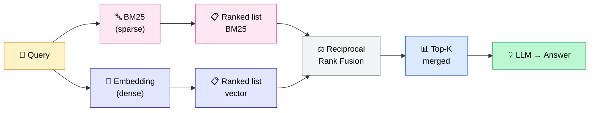

## Your vector RAG is missing questions you don't even know about

It's a comment I hear often on RAG projects: *"It works well in general, but sometimes it finds nothing on questions that seem straightforward."*

Concrete example: *"What is the ISO-27001 procedure for remote access?"* → 0 relevant results.

Vector search encodes meaning. But when a query contains an exact identifier — a standard name, a product code, a domain acronym — semantic encoding fails completely.

This is what's called **vocabulary mismatch**. And it's the problem hybrid search solves.

<!-- more -->

***

## 3 types of queries where vector search alone fails

An embedding model encodes meaning, semantic associations, conceptual proximity. That's powerful. If you want to understand concretely how text becomes a vector and why that representation is so powerful, I have an article that covers the fundamentals: [embeddings in RAG](/en/blog/2026/05/29/embeddings-rag-comprendre-importance/).

But it fails systematically on 3 categories of queries.

**1. Domain jargon and standards**

"DTU 31.2", "CSRD", "IFRS 9", "ISO-27001 annex A.9". These identifiers have no meaning in the semantic sense — they are labels. A general-purpose embedding model doesn't know that "ISO-27001 annex A.9" is about access control, and will encode it as a character sequence with no strong relationship to the corresponding document's content.

**2. Proper nouns, product references, error codes**

"ERROR_CODE_403b", "Product Ref X-2247-FR", "endpoint /v2/users/batch". Embeddings encode these, but poorly: the model doesn't understand that exact matching is what matters here, not semantic proximity.

**3. Mixed queries**

"Configure Redis in cluster mode on AWS with SASL authentication." Half the query is conceptual, the other half is technical and textual. Pure vector search handles this asymmetry badly.

And conversely, here are the 3 cases where **BM25 alone fails**:

- Conceptual questions ("what is a multi-agent architecture?")
- Synonyms and paraphrases ("way to store" ≠ "method to save" for BM25)
- Natural multilingual language

The conclusion is clear: **the failure modes of BM25 and vector search are not correlated**. What one misses, the other often finds. And that's exactly why combining them works.

***

## How BM25 works (without the math)

BM25 (Best Matching 25) is a text search algorithm. The core idea: **a rare word in a short document is highly relevant**.

Two parameters do all the work:

- **k1** (1.2 by default): "frequency saturation". After the 5th occurrence of a word in a document, the marginal contribution becomes nearly zero. If "Redis" appears 20 times in a doc, that's not 20x more relevant than if it appears twice.
- **b** (0.75 by default): length normalization. A 50-word doc containing "Redis" is more relevant than a 5,000-word doc that also contains it.

These defaults have been validated across dozens of benchmarks. In the vast majority of projects, you don't need to touch them.

**The modern view: BM25 as a sparse vector**

This concept is important for understanding hybrid architectures. BM25 can be represented as a **sparse vector**: a vector whose dimension equals the vocabulary size, with non-zero values only for words present in the document.

This "sparse" view is what unifies BM25 and dense vector search in a single architecture: both produce vectors, but of very different natures.

| | BM25 / Sparse | Dense vector |
|---|---|---|
| Representation | Sparse vector (full vocab) | Dense vector (768–1536 dims) |
| Captures | Exact matches | Meaning, context, synonyms |
| Strength | Jargon, codes, proper nouns | Conceptual questions |
| Weakness | Synonyms, paraphrases | Exact identifiers |
| Cost | Very fast (CPU) | Slower (GPU recommended) |

And if BM25 isn't enough (I explain when at the end), there are smarter sparse alternatives: SPLADE and BGE-M3.

***

## Reciprocal Rank Fusion: the fusion algorithm that actually works

When you have two result lists (one from BM25, one from vector search), how do you combine them?

The naive first idea: add the scores. That doesn't work. BM25 scores and cosine similarity scores don't share the same range or distribution. Adding a BM25 score of 15.3 to a cosine similarity of 0.82 has no mathematical meaning.

**The solution: Reciprocal Rank Fusion (RRF)**

The idea is elegant: **forget the scores, keep only the ranks**.

The formula: `RRF_score(doc) = 1 / (k + rank_BM25) + 1 / (k + rank_vector)`

With k = 60 (the default in Elasticsearch and Azure AI Search).

A step-by-step example:

| Document | BM25 rank | Vector rank | RRF score |
|---|---|---|---|
| Doc A | 1st | 2nd | 1/(60+1) + 1/(60+2) = **0.0325** |
| Doc B | 3rd | 1st | 1/(60+3) + 1/(60+1) = **0.0323** |
| Doc C | 2nd | absent | 1/(60+2) + 0 = **0.0161** |

**Doc A** comes out on top because it ranks well in both systems. **Doc C** is absent from vector search: it loses to docs present in both lists, even though it was 2nd in BM25.

That's the robustness of RRF: a document that's strong in only one list can still surface, but a moderately good document in both will almost always beat it.



**k = 60 vs k = 2: what's the difference?**

- High k (60) → high-rank positions carry less weight. The final list balances both signals more evenly.
- Low k (2) → top-ranked positions dominate heavily. Qdrant uses k=2 by default, which strongly favors the best results from a single list.

**Alternative: RelativeScoreFusion (Weaviate)**

Weaviate proposes a different approach: normalize each method's scores between 0 and 1, then add them. Their benchmark on FIQA (a financial Q&A dataset) shows +6% recall vs RRF. It's worth testing both on your data before committing.

***

## The benchmarks that justify implementing it

I'm not asking you to take my word for it. Here are the numbers.

**Microsoft Azure AI Search (BEIR + client data)**

| Method | NDCG@3 | Gain vs vector only |
|---|---|---|
| BM25 only | 40.6 | −7% |
| Vector only | 43.8 | — |
| Hybrid RRF | 48.4 | **+10%** |
| Hybrid + reranker | 60.1 | **+37%** |

**Elasticsearch (BEIR benchmark)**

Hybrid: +1.4% vs vector only, +18% vs BM25 only.

**LlamaIndex (Hit Rate on Q&A benchmark)**

The hybrid + reranker combination achieves a Hit Rate of 0.938. That's the top score in their benchmark, ahead of vector only (0.891) and BM25 only (0.869).

The takeaway: hybrid consistently improves on pure vector search, especially on data with domain jargon. Add a reranker on top and you multiply the effect further. To pick one (Cohere, BGE, Jina or Voyage, with pricing and benchmarks), see the [reranker comparison for RAG](reranker-comparatif-cohere-bge-jina-voyage.md).

***

## Implementation: 3 stacks in practice

### Stack 1 — LangChain + BM25 + FAISS (open-source, minimal)

This is the entry point. Perfect for a POC or a fully local stack with no external database.

```python
from langchain.retrievers import BM25Retriever, EnsembleRetriever
from langchain.vectorstores import FAISS
from langchain_openai import OpenAIEmbeddings

# Your pre-split documents
documents = [...]

# BM25 retriever
bm25_retriever = BM25Retriever.from_documents(documents)
bm25_retriever.k = 5

# FAISS vector retriever
embeddings = OpenAIEmbeddings()
faiss_store = FAISS.from_documents(documents, embeddings)
vector_retriever = faiss_store.as_retriever(search_kwargs={"k": 5})

# Fusion with RRF (c=60 by default in LangChain)
ensemble_retriever = EnsembleRetriever(
    retrievers=[bm25_retriever, vector_retriever],
    weights=[0.5, 0.5]  # 50/50 BM25 / vector
)

results = ensemble_retriever.invoke("your question")
```

That's 15 lines of code. RRF is handled natively by `EnsembleRetriever`.

**Main limitation**: BM25 is recomputed in memory on every restart. For production, you need to persist the BM25 index separately (with `pickle` or an external solution).

---

### Stack 2 — LlamaIndex + QueryFusionRetriever

LlamaIndex has a native implementation with async support, useful if you want to parallelize both searches to reduce latency.

```python
from llama_index.retrievers.bm25 import BM25Retriever
from llama_index.core.retrievers import VectorIndexRetriever, QueryFusionRetriever

# Your existing indexes
vector_retriever = VectorIndexRetriever(index=vector_index, similarity_top_k=5)
bm25_retriever = BM25Retriever.from_defaults(
    docstore=vector_index.docstore,
    similarity_top_k=5
)

# Fusion
hybrid_retriever = QueryFusionRetriever(
    retrievers=[vector_retriever, bm25_retriever],
    similarity_top_k=5,
    num_queries=1,      # no multi-query here, just fusion
    use_async=True,     # BM25 and vector in parallel
    mode="reciprocal_rerank",
)

results = await hybrid_retriever.aretrieve("your question")
```

The `use_async=True` matters: both retrievers run in parallel, cutting latency roughly in half in practice.

---

### Stack 3 — Weaviate (production, all-in-one)

Weaviate handles BM25, vector search, and fusion natively. It's the cleanest stack for large-scale production: everything lives in the database, no fusion logic in your application code.

```python
import weaviate
from weaviate.classes.query import MetadataQuery, HybridFusion

client = weaviate.connect_to_local()
collection = client.collections.get("Documents")

# Hybrid query with RelativeScoreFusion
results = collection.query.hybrid(
    query="your question",
    alpha=0.5,           # 0 = pure BM25, 1 = pure vector, 0.5 = balanced
    fusion_type=HybridFusion.RELATIVE_SCORE,
    query_properties=["content", "title^2"],  # title boost
    limit=5,
    return_metadata=MetadataQuery(score=True, explain_score=True)
)

for obj in results.objects:
    print(obj.properties["content"])
    print(f"Hybrid score: {obj.metadata.score}")
```

The `alpha` parameter is your main lever in production:
- Increase `alpha` for conceptual questions (more vector weight)
- Decrease `alpha` when queries contain heavy jargon or identifiers (more BM25 weight)

**When to use it**: high volumes, metadata filtering combined with hybrid search, multi-tenancy, or when you want to avoid managing BM25 separately in your codebase.

***

## When to use hybrid vs pure vector search

| Situation | Recommendation |
|---|---|
| Domain jargon, acronyms, standards | **Hybrid** (BM25 essential) |
| Pure conceptual questions | Vector only |
| Proper nouns, product codes, references | **Hybrid** |
| Queries with typos | Vector (more robust to misspellings) |
| Code patterns, regex, logs | BM25 only |
| Multilingual corpus | **Hybrid + BGE-M3** |
| General-purpose production without profiling | **Hybrid by default** |

My personal rule: **in general-purpose production, I always start with hybrid**. The added cost is marginal (BM25 is nearly free compared to embedding) and the gains on edge cases always justify the effort.

***

## Going further: SPLADE and BGE-M3

BM25 is an excellent baseline, but it has one obvious limitation: it doesn't understand synonyms. "Send" and "transmit" are two different tokens for BM25 — no proximity score between them.

Two modern alternatives are worth knowing.

**SPLADE (Sparse Lexical and Expansion)**

SPLADE is a model trained to produce "intelligent" sparse vectors. Unlike BM25, it performs term expansion: if a document talks about "car", SPLADE can add weight to "automobile", "vehicle", "auto". It keeps the sparse structure (fast, filterable) while capturing some of the semantics.

When to consider it: your corpus has many domain-specific synonyms, or BM25 misses terminological variants too frequently.

**BGE-M3 (BAAI/bge-m3)**

This is the most versatile model released in 2024. A single model simultaneously produces:
- **Dense** vectors (classic embeddings)
- **Sparse** vectors (SPLADE-style)
- **ColBERT** scores (for reranking)

100 languages. 8192-token context. You use it as a dense retriever, sparse retriever, and reranker — with a single model to manage.

When to consider it: multilingual corpus, or when you want to simplify your stack by deploying and maintaining just one model.

| | BM25 | SPLADE | BGE-M3 sparse |
|---|---|---|---|
| Term expansion | No | Yes | Yes |
| Training required | No | Yes (pre-trained model) | Yes (pre-trained model) |
| Speed | Very fast | Fast | Moderate |
| Multilingual | Depends on tokenizer | Limited | Yes (100 languages) |
| Ideal use case | Baseline, exact jargon | Domain synonyms | Multilingual production |

***

## FAQ

**Does hybrid search slow down queries?**

The BM25 part is near-instantaneous (CPU computation on an inverted index). The vector search is the bottleneck, same as in a classic RAG. In practice, a well-implemented hybrid adds 5 to 15ms of latency vs vector only — negligible in the vast majority of RAG architectures.

**Which vector database should I choose for hybrid search?**

Weaviate and Qdrant have the best native support today. Weaviate offers `alpha`, `RelativeScoreFusion`, and `BM25F` (BM25 with per-field boosting). Qdrant has its own RRF with k=2. Elasticsearch remains the reference if you already run an ELK stack. FAISS and Chroma require managing BM25 separately on the application side (which is what LangChain does with `EnsembleRetriever`).

**Do I need to fine-tune BM25 for my domain?**

Rarely necessary. The default k1 and b parameters have been validated on very diverse corpora. What matters more: tokenizer quality (handling accents, hyphens, and the casing in your data) and preprocessing (stop words relevant to your domain). For highly specialized jargon, BM25 doesn't even need stemming — exact tokens are precisely what you're looking for.

**Does BM25 handle languages other than English well?**

Yes, with an appropriate tokenizer. LangChain uses `rank_bm25` with the Snowball stemmer, which covers most languages well. For technical jargon or acronyms, stemming is useless or even counterproductive — disable it or exclude those terms from normalization.

***

## Further reading

- **[What is RAG, really?](mais-que-es-le-rag.md)** — RAG fundamentals before optimizing retrieval
- **[Embeddings in RAG](embeddings-rag-comprendre-importance.md)** — the dense vector side of hybrid search: model choice, pitfalls, and how BGE-M3 produces both dense and sparse vectors in one pass
- **[Optimize your RAG: 8 techniques](optimiser-rag-techniques.md)** — hybrid search is technique 4; this article covers the full optimization sequence with measured gains
- **[How to evaluate a RAG in production](evaluer-rag-production-metriques-ragas.md)** — how to measure whether hybrid search actually improved your Hit Rate and NDCG
- **[Agentic RAG vs classic RAG](agentic-rag-vs-rag-classique.md)** — when hybrid alone isn't enough and you need an agentic pipeline

***

If my articles interest you and you have questions, or just want to talk through your own challenges, feel free to reach out at [anas@tensoria.fr](mailto:anas@tensoria.fr) — I enjoy these conversations.

You can also [book a call](https://cal.eu/anas-rabhi/rendez-vous-ianas) or subscribe to my newsletter.


---

### About me

I'm **Anas Rabhi**, freelance AI Engineer & Data Scientist. I help companies design and ship AI solutions (RAG, agents, NLP).

Discover my services at [tensoria.fr](https://tensoria.fr) or try our AI agents solution at [heeya.fr](https://heeya.fr).

<div style="text-align: center; margin: 40px 0; gap: 16px; display: flex; flex-wrap: wrap; justify-content: center;">
  <a href="https://cal.eu/anas-rabhi/rendez-vous-ianas" target="_blank" style="display: inline-block; background-color: #4F46E5; color: #ffffff; font-weight: bold; padding: 16px 32px; text-decoration: none; border-radius: 8px; font-size: 18px; letter-spacing: 0.8px; box-shadow: 0 6px 12px rgba(0, 0, 0, 0.2); transition: all 0.3s ease; border: none;">
    Book a call
  </a>
  <a href="https://anas-ai.kit.com/d8b1a255cc" target="_blank" style="display: inline-block; background-color: #222222; color: #ffffff; font-weight: bold; padding: 16px 32px; text-decoration: none; border-radius: 8px; font-size: 18px; letter-spacing: 0.8px; box-shadow: 0 6px 12px rgba(0, 0, 0, 0.2); transition: all 0.3s ease; border: none;">
    <span style="margin-right: 10px;">✉️</span> Subscribe to my newsletter
  </a>
</div>
