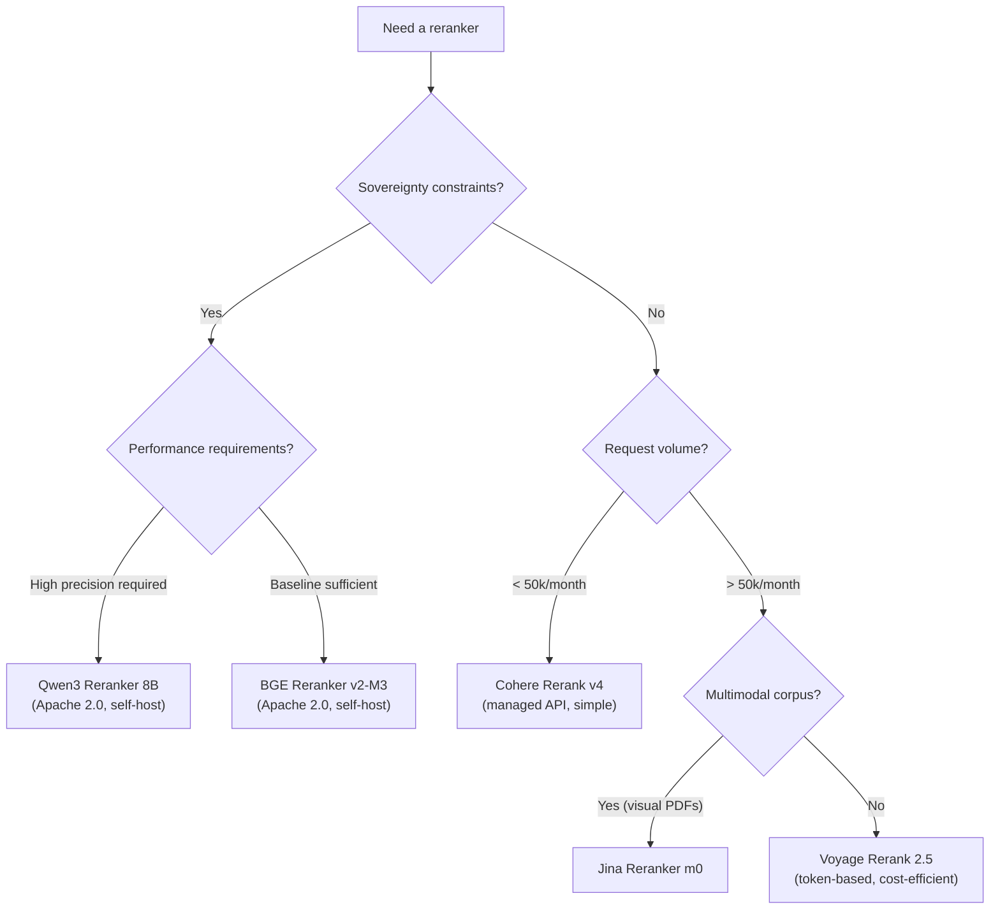

## Hybrid retrieval finds the right chunks. The reranker puts them in the right order.

You have implemented [hybrid BM25 + vector retrieval](rag-hybride-bm25-vectoriel.md). Your recall@10 is decent. And yet the LLM produces mediocre answers: the relevant information is there in the top-10 chunks, but it sits at rank 8 or 9. The LLM ignores it or dilutes it in the noise from the chunks above.

That is the problem a reranker solves. Not recall. Precision. Not "find it," but "put what matters first."

In this article I compare the four most widely used rerankers in production (Cohere, BGE, Jina, Voyage) alongside the notable newcomers from 2025-2026, with public benchmark figures, real pricing, and a direct recommendation by project profile.

<!-- more -->

## Table of contents

1. [Bi-encoder vs cross-encoder: two scoring architectures](#bi-encoder-vs-cross-encoder-two-scoring-architectures)
2. [Reranker comparison table for 2026](#reranker-comparison-table-for-2026)
3. [Cohere Rerank: the managed reference](#cohere-rerank-the-managed-reference)
4. [BGE Reranker: the open-source option that holds up](#bge-reranker-the-open-source-option-that-holds-up)
5. [Jina Reranker: the multimodal card](#jina-reranker-the-multimodal-card)
6. [Voyage Rerank: speed and simplicity](#voyage-rerank-speed-and-simplicity)
7. [The newcomers: Zerank, Qwen3, Mixedbread](#the-newcomers-zerank-qwen3-mixedbread)
8. [Recommendation profiles by use case](#recommendation-profiles-by-use-case)
9. [When a reranker is useless](#when-a-reranker-is-useless)
10. [Integration in practice: minimal Python snippet](#integration-in-practice-minimal-python-snippet)
11. [FAQ](#faq)
12. [Further reading](#further-reading)

## Bi-encoder vs cross-encoder: two scoring architectures

A reranker is a model that takes a (query, chunk) pair and returns a relevance score. That score is used to reorder the results from the initial retrieval stage before they are passed to the LLM.

The fundamental distinction: why not just use your embedding model to score?

**The bi-encoder** (your embedding model) encodes the query alone on one side and the chunk alone on the other, then compares the two vectors with cosine similarity. It is fast because each text is encoded independently. But that independence is also its limitation: the model never sees the query and the chunk at the same time. It cannot reason about their precise relationship.

**The cross-encoder** sees the full pair as input. The query and the chunk are concatenated into a single sequence and processed together by the attention mechanism. The model understands *why* this chunk answers (or does not answer) this specific query. The trade-off: you have to call the model once per pair, which is too slow for searching an index of millions of documents. Hence the two-stage pipeline.

| | Bi-encoder | Cross-encoder |
|---|---|---|
| Input | Query alone / Chunk alone | (Query, Chunk) together |
| Speed | Very fast (pre-computed index) | Slow (computed on the fly) |
| Scoring quality | Approximate | Fine-grained, contextual |
| Usage | Initial retrieval (top-100) | Final reranking (top-10 to top-3) |
| Example | text-embedding-3-small, BGE-M3 | Cohere Rerank, bge-reranker-v2-m3 |

The classic pipeline: the bi-encoder retrieves the 50 to 100 best candidates, the cross-encoder reranks them, and you keep the top 3 to 5 for the LLM.

To understand why the choice of upstream embedding model directly influences the gain a reranker provides, see the article on [embeddings and their impact on RAG](embeddings-rag-comprendre-importance.md).

## Reranker comparison table for 2026

Figures drawn from the public Agentset benchmarks (leaderboard, updated February 2026), official Voyage AI, Cohere, and Jina documentation, and academic literature for BGE.

| Model | ELO (Agentset) | nDCG@10 BEIR | Avg latency | API price | Self-host | License | Multilingual |
|---|---|---|---|---|---|---|---|
| Zerank 2 | 1638 | n.d. | 265 ms | $0.025/M tokens | No | Proprietary | Yes |
| Cohere Rerank 4 Pro | 1629 | n.d. | 614 ms | $2.00/1k searches | No | Proprietary | Yes (100+ languages) |
| Voyage Rerank 2.5 | 1544 | n.d. | 613 ms | $0.05/M tokens | No | Proprietary | Yes |
| Cohere Rerank 3.5 | n.d. | n.d. | ~600 ms | $2.00/1k searches | No | Proprietary | Yes |
| BGE Reranker v2-M3 | n.d. | 51.8 | Variable (GPU) | Free | Yes | Apache 2.0 | Yes (multilingual) |
| Jina Reranker v3 | n.d. | 61.94 | ~300 ms | Freemium | Yes (CC-BY-NC) | CC-BY-NC 4.0 | Yes (100+ languages) |
| Qwen3 Reranker 8B | 1473 | n.d. | Variable | Free | Yes | Apache 2.0 | Yes |
| Mixedbread mxbai-rerank-v2 | n.d. | n.d. | Variable | Free | Yes | Apache 2.0 | Yes |

**Notes on the figures.** The Agentset ELO is computed from head-to-head GPT-5 comparisons across 6 datasets (finance, science, essays, web). The nDCG@10 BEIR is the academic reference benchmark (18 information retrieval datasets). The two metrics do not measure exactly the same thing: ELO captures perceived quality on long-form content; BEIR tests relevance across varied corpora.

**Figures to re-verify before production.** Cohere pricing ($2/1k searches), Voyage pricing ($0.05/M tokens for rerank-2.5), and ELO scores change regularly. Check the official pages before budgeting.

## Cohere Rerank: the managed reference

Cohere Rerank is the default choice for most teams that do not want to manage infrastructure. API, high availability, documented multilingual support across 100+ languages, clean documentation.

### Available models in 2026

Cohere offers three active generations:

- **rerank-v4.0-pro**: the most accurate, quality-optimized, 614 ms average latency (Agentset benchmark).
- **rerank-v4.0-fast**: same generation, reduced latency at the cost of a slight precision trade-off.
- **rerank-v3.5** and **rerank-v3.0** (English + multilingual): still available for continuity of existing deployments.

### Pricing and billing model

Cohere's pricing is per "search unit": **one request with up to 100 documents = 1 unit**. The price is **$2.00 per 1,000 searches** for rerank-v3.5, same logic for v4. A document exceeding 500 tokens is split into chunks, each chunk counting separately.

For 10,000 daily requests with 20 documents each, the cost is $20 per day, roughly $600 per month. That is the first obstacle for high-volume teams.

### Concrete advantages

- Zero infrastructure to manage.
- Native support in LangChain (`CohereRerank`), LlamaIndex, and most RAG frameworks.
- Predictable latency (managed SLA).
- The highest ELO score among proprietary APIs on the Agentset leaderboard (1629, behind Zerank 2 but ahead of Voyage).

### Main limitation

Total vendor lock-in. No self-hosting. If the API goes down, your pipeline stops. For sensitive or sovereignty-constrained data, Cohere offers dedicated deployments (Model Vault) that completely change the cost structure: $5/hour or $3,250/month.

## BGE Reranker: the open-source option that holds up

BGE Reranker v2-M3 (BAAI/bge-reranker-v2-m3) is the most widely used open-source reranker in production. 278 million parameters, Apache 2.0 license, available directly on HuggingFace.

### Measured performance

On the BEIR benchmark, bge-reranker-v2-m3 reaches **51.8 nDCG@10**. For reference, jina-reranker-v3 reaches 61.94 nDCG@10 on the same benchmark. The gap exists, but BGE remains competitive on common domain-specific corpora, and the academic BEIR benchmarks do not always reflect performance well on technical non-English corpora.

In independent benchmarks on business RAG corpora, BGE-reranker-v2-m3 improves vector-only retrieval by an average of +11 NDCG points.

### Architecture and deployment

| Parameter | Value |
|---|---|
| Size | 278M parameters |
| Architecture | Cross-attention encoder (BERT-type) |
| Max context | 512 tokens |
| Languages | Multilingual (MIRACL benchmark) |
| License | Apache 2.0 |
| Cost | $0 (self-host) |
| HuggingFace | `BAAI/bge-reranker-v2-m3` |

### Latency profile

On CPU, BGE-reranker-v2-m3 is usable for batches of fewer than 50 pairs. Beyond that, a GPU becomes necessary to stay under 500 ms. On a T4 GPU (Google Colab or equivalent), latency drops to 80-150 ms for 20 documents, comparable to proprietary APIs.

### The key limitation to know

The 512-token context limit is the main constraint. If your chunks are 600 tokens or longer, you will need to truncate them or use a different model. bge-reranker-v2-gemma (1.5B params) removes this constraint but demands more resources.

## Jina Reranker: the multimodal card

Jina AI took a differentiating angle: its rerankers handle text but also visual documents (PDFs with layout, tables, images).

### Available models

- **jina-reranker-v3**: 0.6B parameters, listwise architecture (handles up to 64 documents simultaneously in a 131,000-token window), nDCG@10 = 61.94 on BEIR. The best BEIR score among the models compared here.
- **jina-reranker-v2-base-multilingual**: classic cross-encoder, 100+ languages, 8,192-token window.
- **jina-reranker-m0**: the multimodal model, capable of scoring PDF documents from their visual representations.
- **jina-colbert-v2**: ColBERT architecture (late interaction), 89 languages. Useful for long corpora.

### The architectural difference: listwise scoring

The vast majority of rerankers are **pointwise**: they score each (query, document) pair independently, then sort the scores. jina-reranker-v3 is **listwise**: it sees all candidate documents at once and reasons about their relative order. In theory, this is closer to how a human judges the relevance of a set of results.

In practice, the advantage is most measurable on long corpora with complex queries.

### Pricing and licenses

Jina offers a free tier of 10 million tokens per new API key. Production pricing is not publicly listed in $/M tokens on the main page (verify at jina.ai at the time of deployment). The models are available under a CC-BY-NC 4.0 license, meaning that direct commercial use of the weights requires an agreement with Jina AI.

Self-hosting is technically possible, but the CC-BY-NC 4.0 license excludes commercial use without an agreement. For commercial self-hosting, contact Jina directly.

## Voyage Rerank: speed and simplicity

Voyage AI built its reputation on high-quality embedding models. Its rerankers follow the same philosophy: performant, fast, competitive pricing.

### Current models

- **voyage-rerank-2.5**: the primary model, $0.05/M tokens, 200 million tokens offered free each month.
- **voyage-rerank-2.5-lite**: lighter version, $0.02/M tokens, same monthly credit.
- **voyage-rerank-2** and **voyage-rerank-2-lite**: previous generation, available at the same rates.

### Cost calculation

Voyage bills by the token, with a precise formula: `(query tokens x number of documents) + sum of all document tokens`. For a typical request with 20 documents of 300 tokens each and a 20-token query, that gives `(20 x 20) + (20 x 300) = 6,400 tokens`, or $0.00032 per request with rerank-2.5. Significantly cheaper than Cohere at the same volume.

### Benchmark positioning

Agentset ELO: 1544 for voyage-rerank-2.5, behind Cohere v4 Pro (1629) and Zerank 2 (1638). Voyage stands out with latency comparable to Cohere (613 ms) while being less expensive at high volume.

| Metric | Voyage Rerank 2.5 | Cohere Rerank 4 Pro |
|---|---|---|
| Agentset ELO | 1544 | 1629 |
| Average latency | 613 ms | 614 ms |
| Price | $0.05/M tokens | $2.00/1k searches |
| Languages | Yes | Yes (100+) |
| Self-host | No | No |

Voyage's price-to-performance ratio makes it a serious candidate for medium-to-high-volume pipelines, especially if you are already in the Voyage ecosystem for embeddings.

## The newcomers: Zerank, Qwen3, Mixedbread

The reranker market shifted significantly in 2025-2026. Three new entrants deserve attention.

**Zerank 2 (ZeroEntropy)**

Top ELO on the Agentset leaderboard at 1638, ahead of Cohere Rerank 4 Pro. Zerank 2 is a proprietary reranker accessible via API at $0.025/M tokens, half the cost of Voyage. Measured latency is 265 ms, twice as fast as Cohere and Voyage. ZeroEntropy is a recent company, which raises legitimate questions about service longevity. One to watch.

**Qwen3 Reranker (Alibaba)**

Qwen3 Reranker is available in several sizes (0.6B, 1.5B, 4B, 8B) under the Apache 2.0 license. On MTEB benchmarks, the 4B model posts competitive scores: MTEB-R at 69.76, CMTEB-R at 75.94. It is the most polyglot open-source option on the market in 2026, with excellent support for Chinese, French, and many other non-English languages. For teams that want sovereignty and performance comparable to proprietary APIs, Qwen3 Reranker 4B or 8B is today's most serious candidate.

**Mixedbread mxbai-rerank-v2**

Apache 2.0, freely self-hostable, solid BEIR performance. Less known than BGE but frequently cited in independent comparisons. A good fallback option if you want an open-source alternative to BGE.

## Recommendation profiles by use case

There is no "best reranker" in absolute terms. Here are my recommendations by profile.

**You want to plug in a reranker within an hour without managing any infrastructure**

Cohere Rerank v3.5 or v4. Native SDK support in LangChain and LlamaIndex. Clear documentation. Multilingual. Budget $2/1k searches and plan ahead if your volume exceeds 50,000 requests per month.

**You have sovereignty or sensitive data constraints**

BGE Reranker v2-M3 self-hosted (Apache 2.0, zero external dependency) or Qwen3 Reranker 8B if you need a longer context window and higher performance. Both run on a standard GPU (A10, T4).

**Your corpus includes PDFs with tables, charts, or complex layouts**

Jina Reranker m0: the only multimodal reranker on the market as of today. If your document base is plain text, the advantage disappears.

**You want the best price-to-performance ratio at high volume (> 500k requests/month)**

Voyage Rerank 2.5 (token-based billing, more predictable at high volume) or Zerank 2 if you are comfortable with a newer provider.

**You are starting from scratch and want to validate reranker impact before committing**

BGE Reranker v2-M3 locally for your tests. It is free, Apache 2.0, and gives you a realistic baseline. Then compare against the API of your choice on your evaluation dataset.

To build that evaluation dataset and objectively measure the reranker's gain, the article on [building a RAG evaluation dataset in 30 minutes](dataset-evaluation-rag-questions-synthetiques.md) gives you the complete method.



## When a reranker is useless

This is the anti-hype section. A reranker improves the ranking of candidates that retrieval already surfaced. It cannot invent what retrieval failed to find.

**If your recall@10 is poor, a reranker will not change anything.**

Reranking a set of 10 chunks where none contains the right answer will not bring you closer to the truth. The problem is upstream: chunking too fine or too coarse, embeddings ill-suited to your domain, no hybrid retrieval, or a query that looks nothing like what is in the corpus.

Jason Liu, whose work on RAG optimization is well documented, puts it plainly: "reach 97% recall in retrieval before touching anything else." The same logic applies to reranking: it optimizes what is already there; it does not compensate for broken retrieval.

**Three signals that tell you the problem is not reranking:**

- Recall@20 below 0.70 on your evaluation dataset: retrieval problem, not a ranking problem.
- Users report that "the answer is always about a different topic": query understanding problem, likely in the embedding or chunking stage.
- The LLM answers correctly when you manually give it the right chunk but not through the pipeline: retrieval is not returning what it should.

In these cases, add the reranker after fixing retrieval, not instead. The article on [8 RAG optimization techniques with measured gains](optimiser-rag-techniques.md) lays out a full priority order.

**Latency cost that should not be overlooked.**

A cross-encoder adds 200 to 600 ms per request. In a conversational application where every exchange counts, that is noticeable to users. If your response SLA is under one second, measure total latency (retrieval + reranking + generation) before validating the architecture.

## Integration in practice: minimal Python snippet

The following example shows how to integrate a reranker into a RAG pipeline with LangChain, in "generic retriever" mode that works with any backend.

```python
from langchain.retrievers import ContextualCompressionRetriever
from langchain.retrievers.document_compressors import CohereRerank
from langchain_community.vectorstores import Qdrant
from langchain_openai import OpenAIEmbeddings

# 1. Base retriever (here vector Qdrant, adapt to your stack)
embeddings = OpenAIEmbeddings(model="text-embedding-3-small")
vectorstore = Qdrant.from_existing_collection(
    embedding=embeddings,
    collection_name="your_collection",
    url="http://localhost:6333",
)
base_retriever = vectorstore.as_retriever(search_kwargs={"k": 20})

# 2. Cohere reranker (replace with BGE or Voyage depending on your choice)
# For BGE self-hosted:
# from langchain.retrievers.document_compressors import CrossEncoderReranker
# from langchain_community.cross_encoders import HuggingFaceCrossEncoder
# model = HuggingFaceCrossEncoder(model_name="BAAI/bge-reranker-v2-m3")
# reranker = CrossEncoderReranker(model=model, top_n=5)
reranker = CohereRerank(
    cohere_api_key="your_api_key",
    model="rerank-v3.5",  # or rerank-v4.0-pro
    top_n=5,              # number of chunks retained after reranking
)

# 3. Full pipeline: retrieval (top-20) then reranking (top-5)
compression_retriever = ContextualCompressionRetriever(
    base_compressor=reranker,
    base_retriever=base_retriever,
)

# 4. Usage
docs = compression_retriever.invoke("Your user query here")
# docs contains the 5 most relevant chunks, in the right order
for i, doc in enumerate(docs):
    print(f"Rank {i+1}: {doc.page_content[:200]}")
```

**Key parameter: the retrieval top-k / reranking top-n ratio.**

Retrieving 20 candidates and keeping 5 after reranking (4:1 ratio) is a solid starting point. If latency allows, retrieve 50 and keep 5 to increase coverage. Below 10 candidates entering the reranker, the gain is marginal.

**For BGE self-hosted**, replace the reranker block with the commented code above. The `ContextualCompressionRetriever` behavior is identical; only the underlying model changes.

## FAQ

**Which reranker should I choose for a multilingual RAG pipeline?**

All the rerankers compared here support non-English languages, including French. Cohere v3.5 and v4 have documented coverage across 100+ languages with MIRACL benchmarks. BGE-reranker-v2-m3 is trained on multilingual corpora. Jina v2 and v3 cover 100+ languages. Voyage rerank-2.5 is multilingual. In practice, on domain-specific non-English content (HR, legal, industrial technical), BGE and Cohere deliver similar results. Always test on your own corpus before deciding. French is a good stress-test for any reranker claiming multilingual support: it is well represented in training data but syntax differs enough from English to surface weaknesses in approximate models.

**What is the difference between pointwise and listwise reranking?**

Pointwise (Cohere, BGE, Voyage) scores each (query, document) pair independently. Listwise (Jina v3) sees all documents at once and reasons about their relative order. In theory, listwise is more accurate. In practice, the difference is most visible on long corpora with complex queries. For the majority of enterprise RAG pipelines, both approaches produce close results.

**Do I need a reranker if I already use hybrid BM25 + vector retrieval?**

Yes, the two are complementary. Hybrid retrieval improves recall (finding more good candidates). The reranker improves precision (putting the best ones first). On Microsoft Azure AI Search benchmarks, hybrid alone gives +10% NDCG vs vector-only, and hybrid + reranker gives +37%. The combination pays off.

**Can I use BGE Reranker in commercial production without fees?**

Yes. bge-reranker-v2-m3 is under the Apache 2.0 license, which allows commercial use without restriction. You just need to manage the infrastructure (GPU recommended for production). Qwen3 Reranker and Mixedbread mxbai-rerank-v2 are also Apache 2.0.

**Is Jina Reranker free for commercial use?**

Not directly. The CC-BY-NC 4.0 license on Jina's model weights excludes commercial use without an agreement with Jina AI. The Jina API is commercially usable (after the 10M-token free tier), but commercial self-hosting of the weights requires a specific agreement.

**How many documents should I pass to the reranker?**

In practice: retrieve 20 to 100 candidates, rerank them, keep 3 to 10 for the LLM. More documents into the reranker means better recall but higher latency. Zerank 2 processes 20 documents in 265 ms. Cohere and Voyage handle around 600 ms for 100 documents. Adjust based on your SLA.

**Does a reranker help with queries in less common languages?**

Partially. Multilingual rerankers (Cohere, BGE-M3, Jina, Voyage) work well on languages that are well represented in their training corpora. For rare languages or dialects, performance can drop significantly. Always test on a real sample of your actual user queries.

```json
<script type="application/ld+json">
{
  "@context": "https://schema.org",
  "@type": "FAQPage",
  "mainEntity": [
    {
      "@type": "Question",
      "name": "Which reranker should I choose for a multilingual RAG pipeline?",
      "acceptedAnswer": {
        "@type": "Answer",
        "text": "All the rerankers compared here support non-English languages. Cohere v3.5/v4, BGE-reranker-v2-m3, Jina v2/v3, and Voyage rerank-2.5 all cover 100+ languages. In practice, BGE and Cohere deliver similar results on domain-specific non-English content. Always test on your own corpus before deciding."
      }
    },
    {
      "@type": "Question",
      "name": "Do I need a reranker if I already use hybrid BM25 + vector retrieval?",
      "acceptedAnswer": {
        "@type": "Answer",
        "text": "Yes, the two are complementary. Hybrid retrieval improves recall, the reranker improves precision. On Microsoft Azure AI Search benchmarks, hybrid alone gives +10% NDCG vs vector-only, and hybrid + reranker gives +37%. The combination pays off."
      }
    },
    {
      "@type": "Question",
      "name": "What is the difference between bi-encoder and cross-encoder in a RAG system?",
      "acceptedAnswer": {
        "@type": "Answer",
        "text": "The bi-encoder (embedding model) encodes the query and document separately then compares vectors. It is fast but approximate. The cross-encoder (reranker) sees the full pair and reasons about their precise relationship. It is more accurate but slower. The classic pipeline: bi-encoder retrieves the top 50-100 candidates, the cross-encoder reranks them."
      }
    },
    {
      "@type": "Question",
      "name": "Can I use BGE Reranker in commercial production without fees?",
      "acceptedAnswer": {
        "@type": "Answer",
        "text": "Yes. bge-reranker-v2-m3 is under the Apache 2.0 license, which allows commercial use without restriction. You just need to manage the infrastructure (GPU recommended for production). Qwen3 Reranker and Mixedbread mxbai-rerank-v2 are also Apache 2.0."
      }
    },
    {
      "@type": "Question",
      "name": "When is a reranker useless?",
      "acceptedAnswer": {
        "@type": "Answer",
        "text": "When initial recall is poor. A reranker improves the ranking of candidates that retrieval already surfaced: it cannot invent what retrieval failed to find. If your recall@20 is below 0.70 on your evaluation dataset, fix retrieval first (chunking, embeddings, hybrid search)."
      }
    },
    {
      "@type": "Question",
      "name": "How many documents should I pass to the reranker?",
      "acceptedAnswer": {
        "@type": "Answer",
        "text": "In practice: retrieve 20 to 100 candidates, rerank them, keep 3 to 10 for the LLM. More documents means better recall but higher latency. Zerank 2 processes 20 documents in 265 ms, Cohere and Voyage handle around 600 ms for 100 documents."
      }
    },
    {
      "@type": "Question",
      "name": "Is Jina Reranker free for commercial use?",
      "acceptedAnswer": {
        "@type": "Answer",
        "text": "Not for commercial self-hosting. The CC-BY-NC 4.0 license on Jina's model weights excludes commercial use without an agreement. The Jina API is commercially usable after the 10M-token free tier, but commercial self-hosting of the weights requires a specific agreement with Jina AI."
      }
    }
  ]
}
</script>
```

## Further reading

- **[Hybrid RAG: BM25 + vector retrieval](rag-hybride-bm25-vectoriel.md)**: the retrieval layer the reranker completes, with the benchmarks that justify implementing it
- **[Embeddings: the foundation of modern AI](embeddings-rag-comprendre-importance.md)**: understanding the bi-encoder to grasp what the cross-encoder adds on top
- **[Build a RAG evaluation dataset in 30 minutes](dataset-evaluation-rag-questions-synthetiques.md)**: how to objectively measure the gain your reranker delivers on your real corpus
- **[Optimize a RAG: 8 production techniques](optimiser-rag-techniques.md)**: the reranker in the full priority order for a production RAG system

---------

If my articles interest you and you have questions, or just want to talk through your own challenges, feel free to reach out at [anas@tensoria.fr](mailto:anas@tensoria.fr). I enjoy these conversations.

You can also [book a call](https://cal.eu/anas-rabhi/rendez-vous-ianas) or subscribe to my newsletter :)


---

### About me

I'm **Anas Rabhi**, freelance AI Engineer & Data Scientist. I help companies design and ship AI solutions (RAG, agents, NLP). [Read more about my work and approach](/en/a-propos/), or browse the [full blog](/en/blog/).

Discover my services at [tensoria.fr](https://tensoria.fr) or try our AI agents solution at [heeya.fr](https://heeya.fr).

<div style="text-align: center; margin: 40px 0; gap: 16px; display: flex; flex-wrap: wrap; justify-content: center;">
  <a href="https://cal.eu/anas-rabhi/rendez-vous-ianas" target="_blank" style="display: inline-block; background-color: #4F46E5; color: #ffffff; font-weight: bold; padding: 16px 32px; text-decoration: none; border-radius: 8px; font-size: 18px; letter-spacing: 0.8px; box-shadow: 0 6px 12px rgba(0, 0, 0, 0.2); transition: all 0.3s ease; border: none;">
    Book a call
  </a>
  <a href="https://anas-ai.kit.com/d8b1a255cc" target="_blank" style="display: inline-block; background-color: #222222; color: #ffffff; font-weight: bold; padding: 16px 32px; text-decoration: none; border-radius: 8px; font-size: 18px; letter-spacing: 0.8px; box-shadow: 0 6px 12px rgba(0, 0, 0, 0.2); transition: all 0.3s ease; border: none;">
    <span style="margin-right: 10px;">✉️</span> Subscribe to my newsletter
  </a>
</div>
