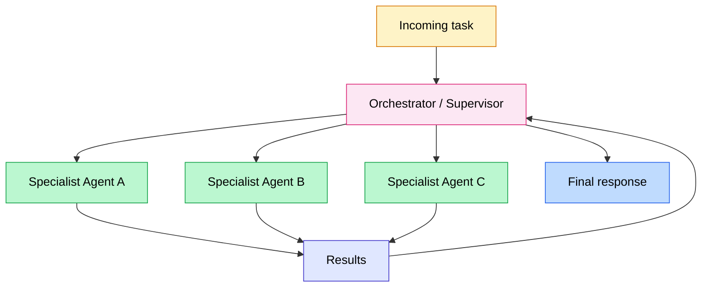

Multi-agent systems are usually the first architecture people reach for. Specialized agents, an orchestrator that distributes tasks, clean hand-offs between roles. On paper, it looks elegant.

In production, it is a different story.

According to the MAST study published by UC Berkeley in March 2025, based on 1,600 execution traces, multi-agent systems fail between 41% and 86.7% of the time depending on the framework. And when they fail, the problem rarely comes from the model itself: it comes from the architecture.

Here is what the data actually says, and how to decide whether you need multiple agents or one well-equipped single agent.

<!-- more -->

## Table of contents

1. [Why everyone wants multi-agent](#why-everyone-wants-multi-agent)
2. [What the failure data says](#what-the-failure-data-says)
3. [The 3 cases where multi-agent is genuinely worth it](#the-3-cases-where-multi-agent-is-genuinely-worth-it)
4. [Supervisor vs Swarm: two architectures, two use cases](#supervisor-vs-swarm-two-architectures-two-use-cases)
5. [When a single agent is enough](#when-a-single-agent-is-enough)
6. [Decision grid](#decision-grid)
7. [The real cost of a hand-off](#the-real-cost-of-a-hand-off)
8. [FAQ on multi-agent systems](#faq-on-multi-agent-systems)
9. [Further reading](#further-reading)

## Why everyone wants multi-agent

Multi-agent is the architecture with the best narrative of 2025.

The image is compelling: specialized agents working in parallel, like a human team. One agent searches for information while another analyzes the code, while a third drafts the report. Efficient, modular, scalable.

Several factors have amplified this enthusiasm over the past two years:

- Frameworks like CrewAI and AutoGen made setting up a multi-agent system accessible in a few lines of code.
- Demos of autonomous research pipelines generated real excitement (SWE-bench, Devin, Anthropic's research agents).
- Framework vendors have an obvious interest in presenting multi-agent as the natural target for any ambitious architecture.

The result: teams deploy multi-agent by default, even when a single agent with the right tools would solve the problem cleanly.

This is not a criticism of the teams making that choice. It is the logical consequence of an ecosystem that values architectural sophistication over operational simplicity.

Production reality corrects that intuition quickly.

## What the failure data says

The MAST study (Multi-Agent System Failure Taxonomy), conducted by UC Berkeley researchers and published in March 2025, is the reference for getting past intuition and into evidence.

The researchers analyzed 1,600 execution traces across 7 popular frameworks (AutoGen, ChatDev, CrewAI, MetaGPT, OpenHands, and others). In one documented analysis covering these frameworks, multi-agent systems failed in 41% to 86.7% of cases depending on the framework and the task. MAST documents 14 distinct failure modes, grouped into 3 broad categories.

| Category | Share of failures | Concrete examples |
|---|---|---|
| Specification problems | 42% | Ambiguous instructions, agents interpreting the task differently |
| Inter-agent misalignment | 37% | Fragmented context between agents, incompatible output formats |
| Verification deficit | 21% | No agent validates the final result, task declared done incorrectly |

What stands out in the conclusions: the cause of failure is rarely model capability. When a multi-agent system fails, the problem comes from architecture and coordination, not from the intelligence of the underlying LLM.

Another important observation: a set of agents that each pass all their individual unit tests can produce a system that fails at the global level. Failures are systemic, not individual. That is the central conclusion of MAST: "a collection of safe agents does not guarantee a safe collection of agents."

Context misalignment deserves a specific mention. When agent A passes its output to agent B via a hand-off, it compresses and reformulates. That reformulation can lose critical nuance, introduce interpretation errors, or simply shorten a context that needed its full length. Agent B works on an impoverished context without knowing it.

For the fundamentals of what an AI agent actually is before going deeper into these architectures, [what is an AI agent](c-est-quoi-un-agent-ia.md) covers the necessary groundwork.

## The 3 cases where multi-agent is genuinely worth it

Multi-agent is not a bad architecture. It is an architecture with precise preconditions. When those preconditions are met, the gain is real. When they are not, you add complexity with no benefit.

Here are the three documented cases where multi-agent delivers measurable value.

### Parallelizable and truly independent subtasks

This is the cleanest and best-documented case. If a task can be decomposed into subtasks that do not need to know about each other to execute, multi-agent makes sense.

Anthropic's multi-agent research architecture, described in their engineering article "How we built our multi-agent research system" (2026), illustrates this precisely. An orchestrator agent decomposes the research into independent questions. Sub-agents work in parallel, each in its own context, unaware of the others. The orchestrator retrieves and synthesizes the results.

The key: each sub-agent receives an autonomous instruction, a defined output format, and a fresh context window. It does not know the others exist. That isolation is what makes the parallelism clean and avoids inter-agent misalignment.

**Precondition to check:** can the subtasks complete without communicating with each other during execution? If yes, parallel multi-agent is legitimate.

### Bulk reading and processing of large document sets

When the volume of information exceeds what a single context window can handle effectively, distributing the work across multiple agents is a valid solution.

A single agent with 200,000 tokens of context can theoretically read a lot. But current models degrade their response quality as context approaches its limit. Factual precision on content located in the middle of a long context drops significantly (a phenomenon documented in the literature as "lost in the middle").

Multiple sub-agents each processing a document subset, then surfacing their summaries to an orchestrator, work around this problem. That is the principle underlying [agentic RAG](agentic-rag-vs-rag-classique.md) architectures.

### Privilege separation and risk isolation

Some production architectures deliberately separate agents by permission level, not for performance reasons, but for security reasons.

An information-gathering agent has read-only access to certain sources. A decision agent works on filtered data, without direct access to raw sources. An execution agent has write permissions only on defined systems.

This separation limits the blast radius of a prompt injection or a hallucination: a compromised agent cannot cause damage beyond its defined perimeter. It is a pattern documented in Anthropic's official documentation on "Building Effective Agents."

## Supervisor vs Swarm: two architectures, two use cases

In practice, two patterns dominate multi-agent implementations in 2026.

**The Supervisor pattern** (orchestrator-workers): a central agent receives the task, decomposes it, delegates to specialist agents, and consolidates the results. The orchestrator maintains global context. Workers have limited local context.

This is the pattern Anthropic uses for its research system. It is also the easiest pattern to debug, because there is a single point of control.

**The Swarm pattern**: agents pass control between each other dynamically, without a central orchestrator. Each agent can decide to transfer the task to another more suited agent depending on the situation. OpenAI experimented with this pattern (then discontinued the Swarm library in March 2025 in favor of the Agents SDK).

| Criterion | Supervisor | Swarm |
|---|---|---|
| Debugging | Easy (central point) | Difficult (complex hand-off chains) |
| Latency | Depends on orchestrator | Can be faster on dynamic tasks |
| Token cost | High (orchestrator sees everything) | Variable |
| Production-ready | Yes | With precautions |
| Typical use case | Research, document analysis | Dynamic routing, customer support |

In practice, the Supervisor pattern is more robust for a first production deployment. Swarm adds value in highly dynamic routing cases, but the difficulty of debugging hand-off chains is real.

For implementing these patterns, LangGraph (native Supervisor support, 34.5 million monthly PyPI downloads) remains the production reference. The full framework comparison is in [CrewAI, LangGraph, AutoGen, Pydantic AI: 2026 comparison](crewai-langchain-langgraph-comparatif-pragmatique.md): once the architecture is decided, that is where the implementation choice is made.

## When a single agent is enough

This is probably the most useful section in this article, and the one you find least often in tutorials.

The pragmatic rule for 2026: **a single well-designed agent with the right tools handles the majority of real-world use cases correctly.**

Signals that a single agent is sufficient:

- The task is sequential, each step depends on the previous one.
- Context must remain coherent across the entire task duration.
- The processing volume fits within a reasonable context window.
- You need deterministic and traceable behavior.

Teams that jump straight to multi-agent often run into the same problem: they add coordination where they needed a better prompt and better tools.

The recommended approach, as documented in Anthropic's documentation and in LangChain field reports, is a progressive one: start with a single well-equipped agent, measure its actual limits, and only add a second agent when a specific limit justifies the addition.

An agent hitting its limits typically produces identifiable symptoms: it starts ignoring instructions (context too long), it confuses tools (too many tools in the same context), it takes too long on a branch (no parallelism available). Those symptoms, not the a priori sophistication of the architecture, should drive the decision.

## Decision grid

Here is how to structure the decision in practice, drawing from the criteria that emerge from MAST and the Anthropic recommendations.

| Observed symptom | Question to ask | Recommended architecture |
|---|---|---|
| Context becomes too long, model "forgets" instructions | Are the subtasks independent? | Parallel multi-agent if yes, context reduction if no |
| Agent regularly uses the wrong tool | Too many tools for a single agent? | Multi-agent with specialization by tool domain |
| Some steps could run simultaneously | Do the parallel steps inform each other? | Parallel multi-agent if no, sequential if yes |
| Different permissions needed per step | Is there a security risk if one agent has all access? | Multi-agent with privilege separation |
| Processing a large document volume | Volume exceeds what one context window handles cleanly? | Document multi-agent (agentic RAG type) |
| Slow agent but correct results | Is the delay caused by sequential operations that could be parallelized? | Parallel multi-agent |
| Fast agent but insufficient quality | Does the problem come from data or reasoning? | Improve tools and prompt before adding an agent |

The right-hand column often reads "single agent" and that is normal. Multi-agent is the right answer to a specific constraint, not the default answer.

## The real cost of a hand-off

Every information transfer between agents has a cost. That cost is rarely measured before deployment, and it consistently surprises teams in production.

Available data for 2026:

- In documented comparative analyses from Augment Code and Iterathon (2026), multi-agent systems consumed on average **4 to 15 times more tokens** than their single-agent equivalents on comparable tasks, with spikes up to 220x in pathological cases.
- A centralized multi-agent architecture (supervisor) generates roughly **285% token overhead** compared to a single-agent. An independent parallel architecture generates roughly **58%** overhead.
- In a controlled experiment cited by Redis (2026), one company deployed a multi-agent customer support system for $47,000 per month, where a well-designed single-agent would have cost $22,700 for only 2.1 fewer points of precision.

These figures deserve verification on your own case before extrapolating: the overhead depends heavily on the structure of your tasks, the number of hand-offs, and the model used.

What is consistent, though: every hand-off consumes tokens for the receiving agent's incoming context, the reformatting of context passing through the orchestrator, and potentially an additional LLM call for routing. On a pipeline with 5 agents and multiple iterations, these costs accumulate quickly.

The right reflex before deployment: instrument a prototype, count tokens on a representative batch of real requests, and project the monthly cost. The actual number almost always comes in higher than the initial estimate.

Reducing token costs is a topic in itself. Prompt caching is one technique that is particularly useful in multi-agent systems where the orchestrator context is often stable between calls. There is no EN article on that topic yet, but the principle is worth factoring into your architecture from the start.

## FAQ on multi-agent systems

**What is the difference between a multi-agent system and a classic workflow?**

A classic workflow chains predefined steps in a fixed order, without autonomous decision-making. A multi-agent system means each agent makes decisions about what actions to take, can change strategy, and communicates dynamically with other agents. Dynamism is the key discriminator: if the execution path is always the same, it is probably a workflow, not a multi-agent system.

**Do you need a different LLM for the orchestrator and the workers?**

Not necessarily, but it is often worth it. The orchestrator primarily does routing and coordination: an intermediate model like Claude Haiku or GPT-4o-mini can suffice and costs less. Workers specialized on complex tasks (analysis, generation) benefit from a more capable model. This split reduces overall cost without sacrificing quality on the critical steps.

**What is the difference between the Supervisor pattern and the Swarm pattern?**

The Supervisor has a central orchestrator that sees all decisions and delegates explicitly. The Swarm allows agents to pass control directly to each other, without a central point. The Supervisor is easier to debug. The Swarm can be more reactive on dynamic routing tasks but generates hand-off chains that are difficult to trace.

**How do I know when my single agent is hitting its limits?**

Three main signals: the model starts ignoring instructions located far back in the context (context too long), it confuses tools with similar functions (too many undifferentiated tools), or latency increases without any quality gain (sequential processing of tasks that could be parallel). These specific symptoms, not the perceived complexity of the problem, should trigger the conversation about a second agent.

**Are multi-agent systems more reliable?**

Not inherently. The MAST study shows that multi-agent systems introduce systemic failure modes that individual agents do not have: context misalignment between agents, error cascades in a hand-off chain, an agent's inability to correct an error committed by an upstream agent. Reliability depends entirely on the quality of the architecture design.

**What is the right team size for agents?**

The unofficial rule among teams with real production experience: start with 2 agents (one orchestrator, one worker), validate that the gain is measurable, then add a third only if a specific need justifies it. Beyond 5 agents in a single pipeline, the complexity of debugging and maintenance typically becomes a larger problem than the one you set out to solve.

**How do you manage memory in a multi-agent system?**

Each agent has its own context window. The orchestrator can maintain a shared state, but it must explicitly decide what to pass to each worker. If interaction history needs to persist across multiple multi-agent tasks, external memory is required: that is the topic covered in detail in [long-term memory for AI agents](memoire-agents-ia-long-terme.md).

**Do protocols like A2A or MCP change the equation?**

Yes, progressively. Google's A2A protocol (April 2025) standardizes hand-offs between agents from different systems. [MCP (Model Context Protocol)](mcp-model-context-protocol-agents-ia.md) standardizes tool connections. These standards reduce the technical integration cost, but they do not resolve the architectural problems documented by MAST: ambiguous specification, inter-agent misalignment, verification deficit. Protocols facilitate wiring, not design.

---------

If my articles interest you and you have questions, or just want to talk through your own challenges, feel free to reach out at [anas@tensoria.fr](mailto:anas@tensoria.fr). I enjoy these conversations.

You can also [book a call](https://cal.eu/anas-rabhi/rendez-vous-ianas) or subscribe to my newsletter :)

## Further reading

- **[What is an AI agent?](c-est-quoi-un-agent-ia.md)**: the definition and mechanics of an agent before tackling multi-agent architectures
- **[Custom AI agent vs n8n, Make, Zapier](agent-ia-vs-n8n-make-zapier.md)**: before deciding how many agents to build, the prior question is whether you need a custom agent at all
- **[CrewAI, LangGraph, AutoGen, Pydantic AI: 2026 comparison](crewai-langchain-langgraph-comparatif-pragmatique.md)**: once the architecture is decided, which framework to use for implementation
- **[Long-term memory for AI agents](memoire-agents-ia-long-terme.md)**: how to handle context persistence in a multi-agent system
- **[MCP: Model Context Protocol for agents](mcp-model-context-protocol-agents-ia.md)**: the tool-connection standard, independent of the number of agents

---

### About me

I'm **Anas Rabhi**, freelance AI Engineer & Data Scientist. I help companies design and deploy AI solutions (RAG, AI agents, NLP). [Read more about my work and approach](/en/a-propos/), or browse the [full blog](/en/blog/).

Discover my services at [tensoria.fr](https://tensoria.fr) or try our AI agents solution at [heeya.fr](https://heeya.fr).

  <a href="https://cal.eu/anas-rabhi/rendez-vous-ianas" target="_blank" style="display: inline-block; background-color: #4F46E5; color: #ffffff; font-weight: bold; padding: 16px 32px; text-decoration: none; border-radius: 8px; font-size: 18px; letter-spacing: 0.8px; box-shadow: 0 6px 12px rgba(0, 0, 0, 0.2); transition: all 0.3s ease; border: none;">
    Book a call
  </a>
  <a href="https://anas-ai.kit.com/d8b1a255cc" target="_blank" style="display: inline-block; background-color: #222222; color: #ffffff; font-weight: bold; padding: 16px 32px; text-decoration: none; border-radius: 8px; font-size: 18px; letter-spacing: 0.8px; box-shadow: 0 6px 12px rgba(0, 0, 0, 0.2); transition: all 0.3s ease; border: none;">
    ✉️ Subscribe to my newsletter
  </a>

