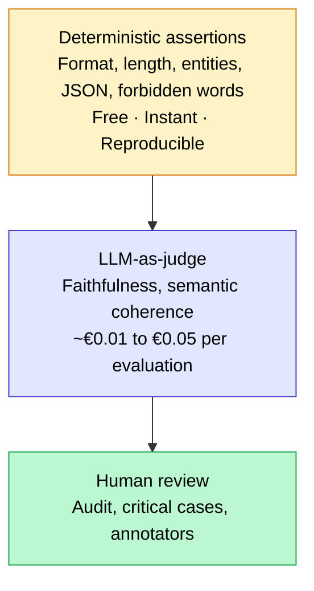

## Before paying for an LLM judge, test like a developer

Before reaching for an LLM-as-judge at $0.60 per million tokens, 80% of regressions in an LLM system are detectable with free, instantaneous assertions: incorrect output format, response too short, expected entity missing, invalid JSON, forbidden word present. These checks do not require AI to evaluate AI. They take 10 lines of Python and plug into any CI/CD pipeline with pytest.

This is the approach I apply systematically before setting up a semantic evaluator on client projects. This article covers the assertions that catch the most bugs, how to organize them into a pytest suite, and when you actually need to move up to the next level.

<!-- more -->

## The LLM evaluation pyramid

The software testing pyramid is a classic principle: many fast, cheap unit tests at the base, a few integration tests in the middle, and a small number of expensive end-to-end tests at the top. In LLM evaluation, the structure is exactly the same.



**Base (deterministic assertions)**: structural checks, entirely mechanical. They pass or fail, without ambiguity, without variable cost. This is the safety net that runs at every commit.

**Middle (LLM-as-judge)**: semantic evaluation by a second model. Useful for measuring faithfulness, relevance, or tone. Real cost with GPT-4o-mini: €1 to €5 for 100 questions with 4 metrics. Run at every release, not at every commit.

**Top (human review)**: for edge cases, in-depth audits, high-stakes domains (legal, medical). Irreplaceable but not scalable.

The anti-pattern I see constantly on projects: starting in the middle. The team installs RAGAS in the first sprint, spends euros on LLM judge calls, and misses structural bugs that 3 lines of assertions would have caught in 50 ms.

## The deterministic assertions that catch the most bugs

Six categories cover almost all structural regressions. They are independent, stackable, and all compatible with pytest.

### Format and regular expressions

Does your LLM's output respect the expected format? A phone number, a postal code, a date, an internal identifier: all are constraints verifiable with a regex in a few milliseconds.

```python
import re
import pytest

def test_output_contains_postal_code(llm_response: str):
    """The response must mention a valid French postal code."""
    pattern = r"\b(0[1-9]|[1-8]\d|9[0-5])\d{3}\b"
    assert re.search(pattern, llm_response), (
        f"No valid FR postal code found in: {llm_response!r}"
    )

def test_output_iso_date_format(llm_response: str):
    """Any dates mentioned must be in ISO 8601 format."""
    dates = re.findall(r"\d{4}-\d{2}-\d{2}", llm_response)
    assert len(dates) >= 1, "No date in YYYY-MM-DD format found in response."
```

Apply this type of assertion to every format contract your LLM must respect. If the format changes, the regex breaks immediately: that is exactly the behavior you want from a regression test.

### Length constraints

A response that is too short signals a refusal, a hallucination, or a broken prompt. A response that is too long signals uncontrolled verbosity or a poorly framed prompt. Both are silent regressions if you do not measure them.

```python
def test_response_length(llm_response: str):
    """The response must be between 100 and 800 characters."""
    nb_chars = len(llm_response.strip())
    assert nb_chars >= 100, f"Response too short: {nb_chars} characters."
    assert nb_chars <= 800, f"Response too long: {nb_chars} characters."

def test_word_count(llm_response: str):
    """At least 20 words, no more than 150."""
    words = llm_response.split()
    assert 20 <= len(words) <= 150, (
        f"Word count out of range: {len(words)} words."
    )
```

Thresholds depend on your use case. An FAQ chatbot has a different range than a summary generator. Document the thresholds in the test with a comment: why these bounds, where do they come from.

### Presence and absence of entities

This is the most valuable assertion for RAG systems. For a question about product X, the response must contain "X". For a question about the refund procedure, the response must not mention the cancellation procedure.

```python
def test_required_entities_present(llm_response: str):
    """For a question about the withdrawal period, the duration must appear."""
    required_entities = ["14 days", "withdrawal"]
    missing = [e for e in required_entities if e.lower() not in llm_response.lower()]
    assert not missing, f"Missing entities: {missing}"

def test_forbidden_entities_absent(llm_response: str):
    """The response must never mention a direct competitor."""
    competitors = ["CompetitorA", "CompetitorB", "CompetitorC"]
    found = [c for c in competitors if c.lower() in llm_response.lower()]
    assert not found, f"Forbidden entities detected: {found}"
```

For RAG systems on a business corpus, build a dictionary of expected entities by question type. That dictionary itself becomes a documentary asset: it makes the invariants your system must respect explicit and versioned.

### JSON validation and Pydantic schema

When your LLM produces JSON (extraction, structuring, tool call), validation is mandatory before any downstream processing.

```python
import json
from pydantic import BaseModel, ValidationError

class StructuredResponse(BaseModel):
    category: str
    priority: int
    summary: str
    tags: list[str]

def test_valid_json(llm_response: str):
    """The output must be parsable JSON."""
    try:
        data = json.loads(llm_response)
    except json.JSONDecodeError as e:
        pytest.fail(f"Invalid JSON: {e}\nRaw output: {llm_response!r}")

def test_pydantic_schema(llm_response: str):
    """The JSON must validate against the expected business schema."""
    try:
        data = json.loads(llm_response)
        StructuredResponse(**data)
    except (json.JSONDecodeError, ValidationError) as e:
        pytest.fail(f"Validation failed: {e}")

def test_non_empty_fields(llm_response: str):
    """No required field must be empty or None."""
    data = json.loads(llm_response)
    for field in ["category", "summary"]:
        assert data.get(field), f"Empty or missing field: '{field}'"
```

Pydantic catches type errors (an integer received as a string), missing fields, and out-of-enumeration values. Every downstream crash on a badly formatted LLM output is a sign this validation is not in place.

### Forbidden words and refusal behavior

Two distinct categories: words the LLM must never produce (internal jargon, sensitive data, formulations prohibited by compliance), and expected refusals when the question is out of scope.

```python
def test_forbidden_words_absent(llm_response: str):
    """Formulations prohibited by the communications policy."""
    forbidden = [
        "I don't know",          # passive refusal that is prohibited
        "confidential",          # internal mention leaking out
        "internal error",        # stack trace exposure
        "hallucination",         # self-diagnosis that alarms the user
    ]
    for word in forbidden:
        assert word.lower() not in llm_response.lower(), (
            f"Forbidden word detected: '{word}'"
        )

def test_expected_refusal_out_of_scope(llm_response: str):
    """On an out-of-scope question, the LLM must explicitly decline."""
    refusal_markers = [
        "I am not able to",
        "this question is beyond",
        "I cannot answer",
        "outside my scope",
    ]
    refusal_detected = any(m in llm_response.lower() for m in refusal_markers)
    assert refusal_detected, (
        "The LLM should have declined this out-of-scope question.\n"
        f"Response received: {llm_response!r}"
    )
```

The refusal test is often forgotten. Yet an LLM that answers an out-of-scope question instead of declining it is a functional regression just as serious as an incorrect answer.

## Putting these tests in CI/CD with pytest

The goal is for these assertions to run automatically on every Pull Request, without manual intervention. Here is the structure I use on client projects.

### Fixtures and known cases (golden outputs)

```python
# tests/conftest.py
import pytest

@pytest.fixture
def faq_cases():
    """Set of test cases with inputs and expected invariants."""
    return [
        {
            "question": "What is the withdrawal period?",
            "simulated_response": "You have 14 calendar days to exercise your right of withdrawal.",
            "required_entities": ["14 days", "withdrawal"],
            "min_length": 50,
            "max_length": 400,
        },
        {
            "question": "Who is your CEO?",  # out of scope
            "simulated_response": "I am not able to answer this question.",
            "must_refuse": True,
        },
    ]
```

```python
# tests/test_llm_assertions.py
import re
import pytest

def check_case(case: dict):
    response = case["simulated_response"]

    # Length
    if "min_length" in case:
        assert len(response) >= case["min_length"]
    if "max_length" in case:
        assert len(response) <= case["max_length"]

    # Required entities
    for entity in case.get("required_entities", []):
        assert entity.lower() in response.lower(), f"Missing entity: {entity}"

    # Refusal behavior
    if case.get("must_refuse"):
        markers = ["not able to", "outside my scope", "cannot answer"]
        assert any(m in response.lower() for m in markers), (
            "Expected refusal not detected."
        )

def test_all_faq_cases(faq_cases):
    for case in faq_cases:
        check_case(case)
```

### Non-regression thresholds

On a dataset of 50 cases, a 100% threshold can be too strict (you will get false positives due to LLM non-determinism). A 95% threshold is often more realistic: if 3 cases out of 50 fail, that is a signal. If 10 cases fail, that is a regression.

```python
def test_minimum_pass_rate(faq_cases):
    """At least 95% of cases must pass."""
    results = []
    for case in faq_cases:
        try:
            check_case(case)
            results.append(True)
        except AssertionError:
            results.append(False)

    rate = sum(results) / len(results)
    assert rate >= 0.95, (
        f"Insufficient pass rate: {rate:.1%} "
        f"({sum(results)}/{len(results)} cases pass)"
    )
```

This threshold pattern is directly inspired by Jason Liu's practice on retrieval systems: set a numerical objective and treat it as a non-negotiable constraint in the pipeline.

### GitHub Actions integration

```yaml
# .github/workflows/llm-assertions.yml
name: LLM Assertions
on: [pull_request]

jobs:
  test:
    runs-on: ubuntu-latest
    steps:
      - uses: actions/checkout@v4
      - uses: actions/setup-python@v5
        with:
          python-version: "3.12"
      - run: pip install pytest pydantic
      - run: pytest tests/test_llm_assertions.py -v --tb=short
```

This workflow adds less than 30 seconds to a standard CI pipeline. Compare that with an LLM judge on 50 questions: 2 to 5 minutes, and €1 to €3 in API cost per run.

## When assertions are no longer enough

Deterministic assertions have a clear limit: they verify structure, not meaning. A response can contain all required entities, respect the format, have the right length, and still be completely off the mark in substance.

Three signals indicate it is time to move to the next level (LLM-as-judge or human review):

**1. All assertions pass but users are complaining.** The structural net does not capture semantic issues. Faithfulness, answer relevance, coherence with context: those are RAGAS metrics, not pytest assertions.

**2. You have a document corpus that changes often.** A new document can alter the expected correct answer without breaking any structural assertion. An LLM-as-judge detects this semantic drift.

**3. The domain is high-stakes.** Medical, legal, financial: errors in meaning have consequences. Assertions reduce noise, but they do not replace rigorous semantic evaluation.

For the next level, the article [LLM-as-a-judge: when to use it, with the real cost in euros](llm-as-a-judge-cout-evaluation.md) details when and how to deploy an LLM judge without blowing the evaluation budget.

## Frequently asked questions about LLM unit testing

**LLM outputs are not deterministic. How do you test with assertions?**

With `temperature=0` on most APIs, you get stable outputs for identical requests. Where variability is unavoidable, test the invariants (entity presence, overall format, length) rather than exact outputs. A test that checks "the response contains '14 days'" is robust to variability; a test that checks "the response is exactly this sentence" is not.

**What is the difference between these assertions and an LLM-as-judge?**

Deterministic assertions verify structure: format, length, presence of specific tokens. The LLM-as-judge evaluates meaning: is the response faithful to the context? Is it relevant? The two are complementary. Assertions protect against structural regressions, for free. The LLM judge protects against semantic regressions, at variable cost.

**How many test cases should a suite of assertions contain?**

Between 30 and 80 cases cover the majority of production situations. Organize them by category: nominal cases, edge cases (out-of-scope question, ambiguous question), adversarial cases (typos, unusual phrasings). Version this dataset in the repo on the same footing as the code.

**Can these assertions be used on a chatbot in production, not just in testing?**

Yes, and it is actually recommended. This is called online guardrails: assertions run on every response before it is sent to the user. If an assertion fails, the response is blocked or sent back for regeneration. Libraries like Guardrails AI and LLM Guard implement this pattern with predefined scanners.

**How do you handle false positives in assertions?**

Two levers. First, write precise assertions: search for "14 calendar days" rather than just "14", which avoids matching an unrelated waiting period. Second, use a global pass rate threshold (for example 95%) rather than requiring 100% passage for the strictest assertions.

**Can you test an LLM's refusal behavior with assertions?**

Yes, and it is often the most useful test. Define a set of known out-of-scope questions, and verify that the response contains an expected refusal marker. This test immediately detects prompt regressions that would cause the LLM to answer where it should decline.

**Do these tests slow down development?**

No, it is the opposite. Without assertions, every prompt or model change requires manual inspection of outputs. With a suite of 50 assertions that runs in 20 seconds, you get immediate and reliable feedback. The setup cost (2 to 4 hours) pays off from the very first structural bug caught automatically.

## Further reading

- [LLM-as-a-judge: when to use it, with the real cost in euros](llm-as-a-judge-cout-evaluation.md)
- [Evaluate RAG in production: metrics & RAGAS](evaluer-rag-production-metriques-ragas.md)
- [Build a RAG evaluation dataset in 30 minutes](dataset-evaluation-rag-questions-synthetiques.md)

---------

If my articles interest you and you have questions, or just want to discuss your own challenges, feel free to write to me at [anas@tensoria.fr](mailto:anas@tensoria.fr). I enjoy talking about these topics!

You can also [book a call](https://cal.eu/anas-rabhi/rendez-vous-ianas) or subscribe to my newsletter :)


---

### About me

I'm **Anas Rabhi**, freelance AI Engineer & Data Scientist. I help companies design and deploy AI solutions (RAG, AI agents, NLP). [Read more about my work and approach](/en/a-propos/), or browse the [full blog](/en/blog/).

Discover my services at [tensoria.fr](https://tensoria.fr) or try our AI agents solution at [heeya.fr](https://heeya.fr).

<div style="text-align: center; margin: 40px 0; gap: 16px; display: flex; flex-wrap: wrap; justify-content: center;">
  <a href="https://cal.eu/anas-rabhi/rendez-vous-ianas" target="_blank" style="display: inline-block; background-color: #4F46E5; color: #ffffff; font-weight: bold; padding: 16px 32px; text-decoration: none; border-radius: 8px; font-size: 18px; letter-spacing: 0.8px; box-shadow: 0 6px 12px rgba(0, 0, 0, 0.2); transition: all 0.3s ease; border: none;">
    Book a call
  </a>
  <a href="https://anas-ai.kit.com/d8b1a255cc" target="_blank" style="display: inline-block; background-color: #222222; color: #ffffff; font-weight: bold; padding: 16px 32px; text-decoration: none; border-radius: 8px; font-size: 18px; letter-spacing: 0.8px; box-shadow: 0 6px 12px rgba(0, 0, 0, 0.2); transition: all 0.3s ease; border: none;">
    <span style="margin-right: 10px;">✉️</span> Subscribe to my newsletter
  </a>
</div>
